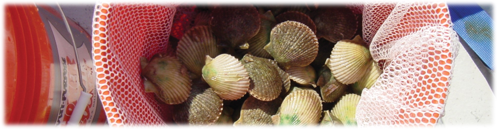
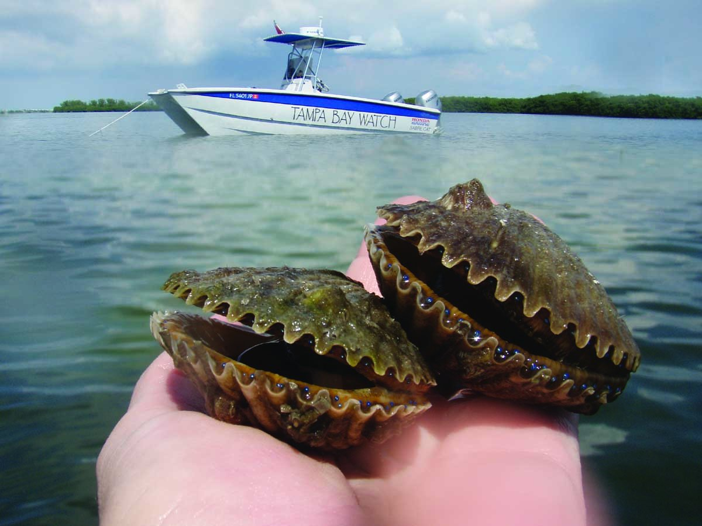
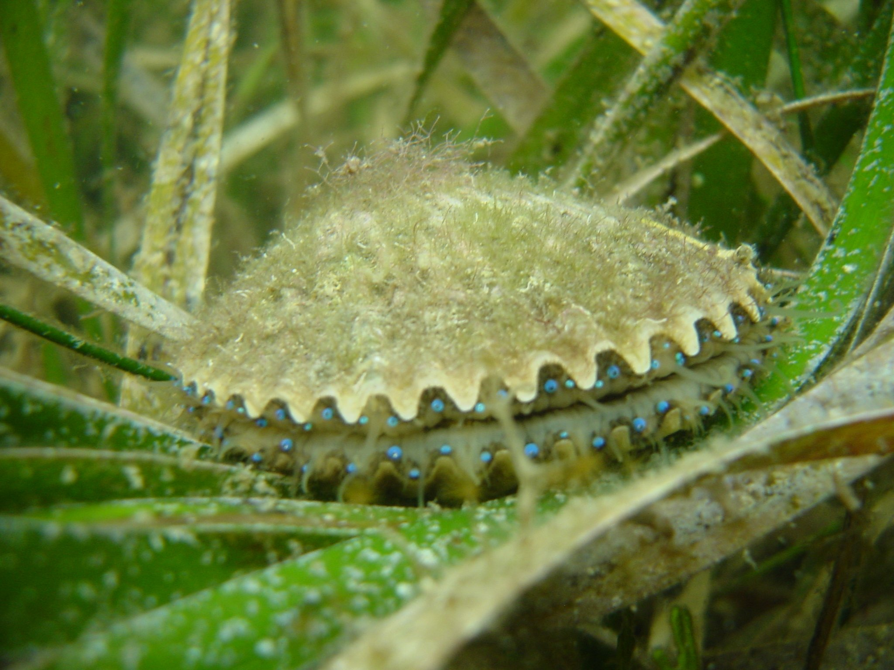
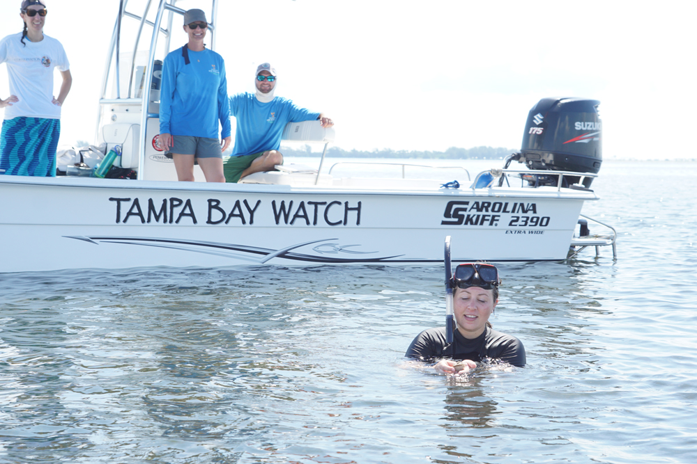
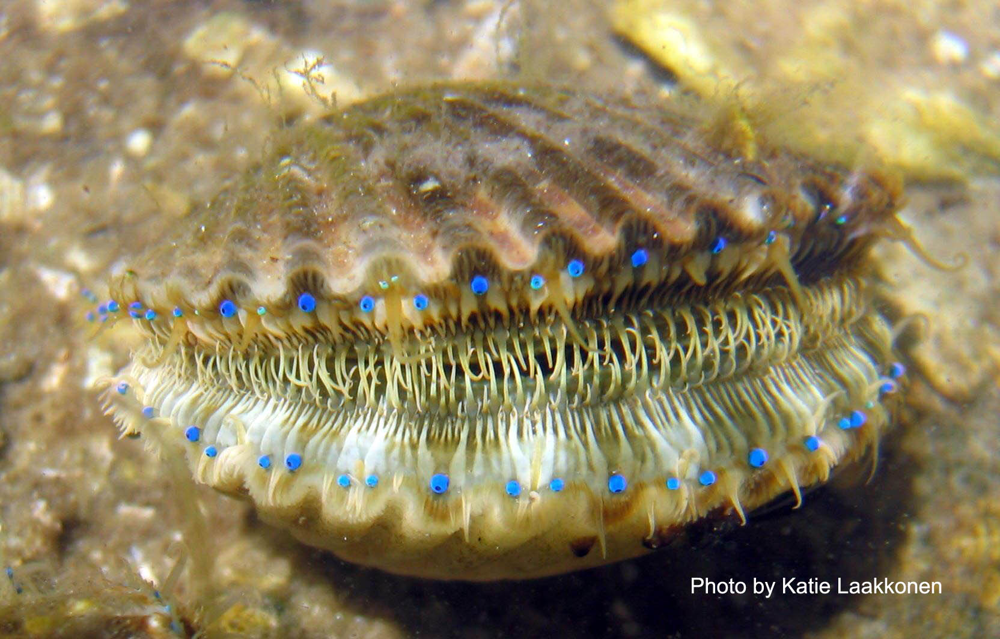
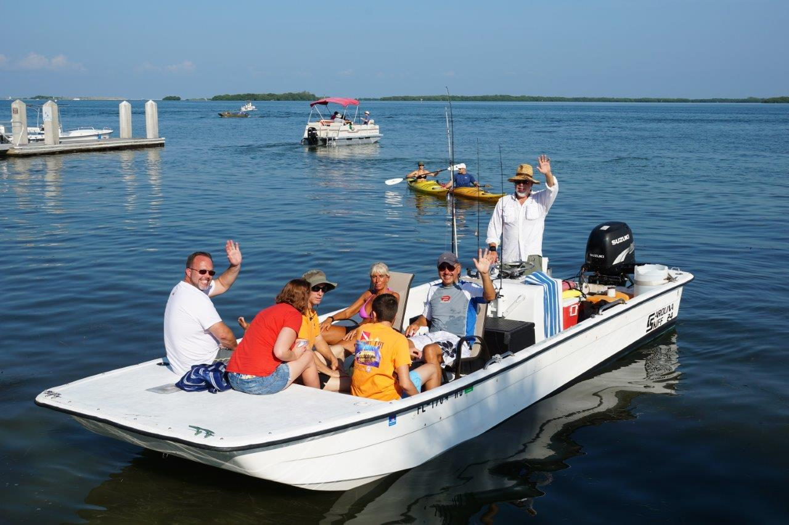

```{r, message = F, warning = F, echo = F}
knitr::opts_chunk$set(echo = TRUE, warning = F, message = F, echo = F, fig.path = 'figs/')

library(tidyverse)
library(sf)
library(mapview)
library(flexdashboard)
library(extrafont)
library(leaflet)
library(plotly)

source('R/funcs.R')

loadfonts(device = 'pdf', quiet = T)
if(Sys.info()[1] == 'Windows')
  loadfonts(device = 'win', quiet = T)

col <- '#00806E'

txt <- 'Hexagons show site locations where volunteers searched for scallops.  Counts for the total number of scallops found at each site are shown by the intensity of the colors, including sites which were searched but no scallops were found.  Sites that were not searched are transparent.  Raw data with missing or incorrect site numbers were omitted.'

data(cntdat)
data(hex)
```

SCALLOPS 101
=======================================================================

Column
-------------------------------------

### 

<div class = "row">
<div class = "col-md-2"></div>
<div class = "col-md-8">

```{r, fig.align = 'center', out.width = '100%'}

```

#### What are scallops? 
 
Bay scallops are marine bivalves, or mollusks with a hinged shell, that are often found hidden among a forest of seagrass. Adults can grow to be about two inches in diameter. They are easily distinguished from other animals hiding in the seagrass by their bright, blue eyes. Catching these animals can be a challenge because they rapidly open and close their shells to propel themselves forward to escape predators. 

```{r, fig.align = 'center', out.width = '60%'}

```

#### Why are scallops important?

Having a robust population of scallops in the estuary is important for many reasons. Scallops are filter feeders and remove algae and organic matter from the water column. Additionally, during periods of red tide, they help remove algae cells and store toxins in their gut. 
 
Scallops are a key indicator of Bay health due to their requirement for clear, salty water, and robust seagrass habitat. (CCMP, 2017)

```{r, fig.align = 'center', out.width = '60%'}

```

#### Can I harvest scallops in Tampa Bay?

Historically, scallops were harvested throughout the Tampa Bay estuary, however, their population disappeared around the 1960s. The disappearance was likely a result of degrading water quality conditions and scallop overharvesting. Efforts to restore scallop populations began in the 1990s, around the same time seagrass acreage started to rebound. To restore the population, efforts to “seed” scallops, or grow them in a hatchery and release into the bay under protected cages, have been attempted with limited success. 
 
Although monitoring efforts do display periodic increases in scallop numbers, recreational harvesting of bay scallops remains closed in Tampa Bay. 

```{r, fig.align = 'center', out.width = '60%'}

```

#### What affects scallop populations? 

Despite significantly improved water quality conditions, restored seagrass habitat, and restoration efforts, bay scallops have yet to rebound to historical values. There are many factors that are complicating successful scallop restoration. Bay scallops are extremely sensitive to changes in water quality, including prevalence of harmful algal blooms like red tide, and rapid shifts in salinity and temperature. In addition to environmental conditions, scallop life cycle could also be complicating restoration efforts. Scallops have a limited lifespan of only 12-18 months during which they grow from larval stage to adult scallop and spawn. Furthermore, it is estimated that only one out of 12 million eggs survive to adulthood.  
 
Scallops are a food source for many sharks and rays that live and feed in Tampa Bay. As a result of successful management and conservation efforts, Tampa Bay has seen a robust recovery of fish populations, which include sharks and rays. This illustrates how successful conservation strategies can present new challenges.

```{r, fig.align = 'center', out.width = '60%'}

```

#### What is the Great Bay Scallop Search? 

To monitor scallop population numbers, Tampa Bay Watch has been conducting an annual citizen science scallop search since 2004. The Great Bay Scallop Search occurs the 3rd Saturday in August and has about 200 people in attendance! In recent years, citizen scientists have focused monitoring efforts in Lower Tampa Bay because this is were salinity is highest and seagrasses are healthy. 
 
On the day of the event, all surveyers meet at Fort Desoto Boat Ramp where they receive their survey locations, equipment, and training on how to conduct the survey. They use the same methods utalized by scientists around Florida. 

```{r, fig.align = 'center', out.width = '60%'}

```

#### More information


</div>
<div class = "col-md-2"></div>
</div>

2020 {data-navmenu="RESULTS BY YEAR"}
=======================================================================

Column
-------------------------------------

### `r txt`  

```{r, out.width = '100%'}
yr <- 2020
plo_fun(cntdat, yr)
```

Column
-------------------------------------

### 

```{r}
sclbox_fun(cntdat, yr)
```

###

```{r}
btsbox_fun(cntdat, yr)
```

###

```{r}
cntbox_fun(cntdat, yr)
```

2019 {data-navmenu="RESULTS BY YEAR"}
=======================================================================

Column
-------------------------------------

### `r txt`  

```{r, out.width = '100%'}
yr <- 2019
plo_fun(cntdat, yr)
```

Column
-------------------------------------

### 

```{r}
sclbox_fun(cntdat, yr)
```

###

```{r}
btsbox_fun(cntdat, yr)
```

###

```{r}
cntbox_fun(cntdat, yr)
```

2017 {data-navmenu="RESULTS BY YEAR"}
=======================================================================

Column
-------------------------------------

### `r txt`  

```{r, out.width = '100%'}
yr <- 2017
plo_fun(cntdat, yr)
```

Column
-------------------------------------

### 

```{r}
sclbox_fun(cntdat, yr)
```

###

```{r}
btsbox_fun(cntdat, yr)
```

###

```{r}
cntbox_fun(cntdat, yr)
```

2015 {data-navmenu="RESULTS BY YEAR"}
=======================================================================

Column
-------------------------------------

### `r txt`  

```{r, out.width = '100%'}
yr <- 2015
plo_fun(cntdat, yr)
```

Column
-------------------------------------

### 

```{r}
sclbox_fun(cntdat, yr)
```

###

```{r}
btsbox_fun(cntdat, yr)
```

###

```{r}
cntbox_fun(cntdat, yr)
```

2014 {data-navmenu="RESULTS BY YEAR"}
=======================================================================

Column
-------------------------------------

### `r txt`  

```{r, out.width = '100%'}
yr <- 2014
plo_fun(cntdat, yr)
```

Column
-------------------------------------

### 

```{r}
sclbox_fun(cntdat, yr)
```

###

```{r}
btsbox_fun(cntdat, yr)
```

###

```{r}
cntbox_fun(cntdat, yr)
```

2011 {data-navmenu="RESULTS BY YEAR"}
=======================================================================

Column
-------------------------------------

### `r txt`  

```{r, out.width = '100%'}
yr <- 2011
plo_fun(cntdat, yr)
```

Column
-------------------------------------

### 

```{r}
sclbox_fun(cntdat, yr)
```

###

```{r}
btsbox_fun(cntdat, yr)
```

###

```{r}
cntbox_fun(cntdat, yr)
```

2010 {data-navmenu="RESULTS BY YEAR"}
=======================================================================

Column
-------------------------------------

### `r txt`  

```{r, out.width = '100%'}
yr <- 2010
plo_fun(cntdat, yr)
```

Column
-------------------------------------

### 

```{r}
sclbox_fun(cntdat, yr)
```

###

```{r}
btsbox_fun(cntdat, yr)
```

###

```{r}
cntbox_fun(cntdat, yr)
```

2009 {data-navmenu="RESULTS BY YEAR"}
=======================================================================

Column
-------------------------------------

### `r txt`  

```{r, out.width = '100%'}
yr <- 2009
plo_fun(cntdat, yr)
```

Column
-------------------------------------

### 

```{r}
sclbox_fun(cntdat, yr)
```

###

```{r}
btsbox_fun(cntdat, yr)
```

###

```{r}
cntbox_fun(cntdat, yr)
```

2008 {data-navmenu="RESULTS BY YEAR"}
=======================================================================

Column
-------------------------------------

### `r txt`  

```{r, out.width = '100%'}
yr <- 2008
plo_fun(cntdat, yr)
```

Column
-------------------------------------

### 

```{r}
sclbox_fun(cntdat, yr)
```

###

```{r}
btsbox_fun(cntdat, yr)
```

###

```{r}
cntbox_fun(cntdat, yr)
```

2007 {data-navmenu="RESULTS BY YEAR"}
=======================================================================

Column
-------------------------------------

### `r txt`

```{r, out.width = '100%'}
yr <- 2007
plo_fun(cntdat, yr)
```

Column
-------------------------------------

### 

```{r}
sclbox_fun(cntdat, yr)
```

###

```{r}
btsbox_fun(cntdat, yr)
```

###

```{r}
cntbox_fun(cntdat, yr)
```

TRENDS
=======================================================================

Column
--------------------------------------

### These plots show summary trends across all years when the scallop search occurred. The top plot shows total scallops found, the middle plot shows total boats searching, and the bottom plot shows the scallops per boat.  

```{r, out.width = '100%'}
sumplo_fun(cntdat)
```

