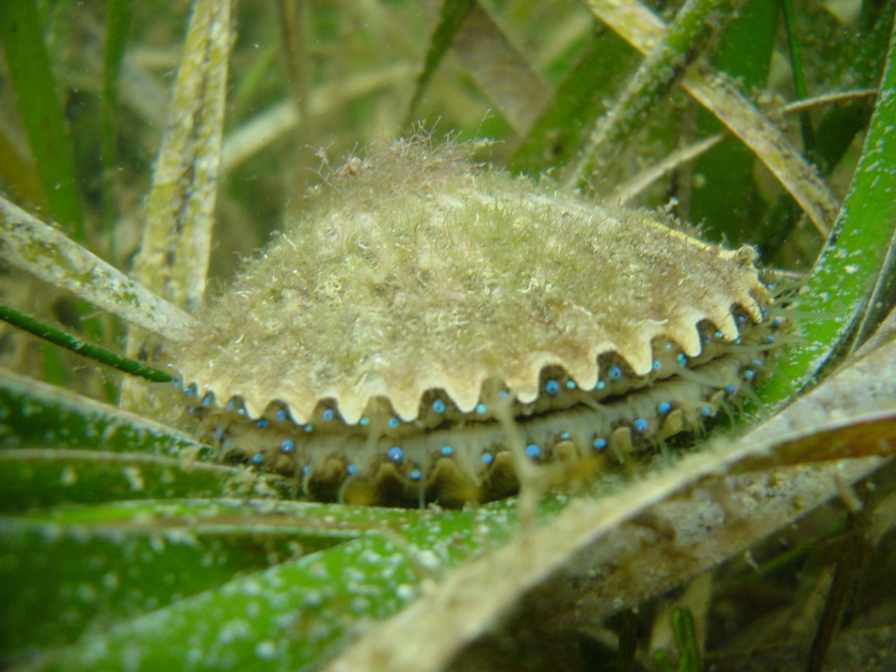

<div class="knitr-options" data-fig-width="576" data-fig-height="460"></div>


SCALLOPS 101
=======================================================================

Column
-------------------------------------

### WELCOME TO THE GREAT BAY SCALLOP SEARCH DASHBOARD!

<div class = "row">
<div class = "col-md-2"></div>
<div class = "col-md-8">

<div class="knitr-options" data-fig-width="576" data-fig-height="460"></div>


#### What are scallops? 
 
Bay scallops are marine bivalves, or mollusks with a hinged shell, that are often found hidden among a forest of seagrass. Adults can grow to be about two inches in diameter. They are easily distinguished from other animals hiding in the seagrass by their bright, blue eyes. Catching these animals can be a challenge because they rapidly open and close their shells to propel themselves forward to escape predators. 

<div class="knitr-options" data-fig-width="576" data-fig-height="460"></div>


#### Why are scallops important?

Having a robust population of scallops in the estuary is important for many reasons. Scallops are filter feeders and remove algae and organic matter from the water column. Additionally, during periods of red tide, they help remove algae cells and store toxins in their gut. 
 
Scallops are a key indicator of Bay health due to their requirement for clear, salty water, and robust seagrass habitat ([CCMP, 2017](https://indd.adobe.com/view/cf7b3c48-d2b2-4713-921c-c2a0d4466632){target="_blank"}).

<div class="knitr-options" data-fig-width="576" data-fig-height="460"></div>


#### Can I harvest scallops in Tampa Bay?

Historically, scallops were harvested throughout the Tampa Bay estuary, however, their population disappeared around the 1960s. The disappearance was likely a result of degrading water quality conditions and scallop overharvesting. Efforts to restore scallop populations began in the 1990s, around the same time seagrass acreage started to rebound. To restore the population, efforts to “seed” scallops, or grow them in a hatchery and release into the bay under protected cages, have been attempted with limited success. 
 
Although monitoring efforts do display periodic increases in scallop numbers, recreational harvesting of bay scallops remains closed in Tampa Bay. 

<div class="knitr-options" data-fig-width="576" data-fig-height="460"></div>


#### What affects scallop populations? 

Despite significantly improved water quality conditions, restored seagrass habitat, and restoration efforts, bay scallops have yet to rebound to historical values. There are many factors that are complicating successful scallop restoration. Bay scallops are extremely sensitive to changes in water quality, including prevalence of harmful algal blooms like red tide, and rapid shifts in salinity and temperature. In addition to environmental conditions, scallop life cycle could also be complicating restoration efforts. Scallops have a limited lifespan of only 12-18 months during which they grow from larval stage to adult scallop and spawn. Furthermore, it is estimated that only one out of 12 million eggs survive to adulthood.  
 
Scallops are a food source for many sharks and rays that live and feed in Tampa Bay. As a result of successful management and conservation efforts, Tampa Bay has seen a robust recovery of fish populations, which include sharks and rays. This illustrates how successful conservation strategies can present new challenges.

<div class="knitr-options" data-fig-width="576" data-fig-height="460"></div>


#### What is the Great Bay Scallop Search? 

To monitor scallop population numbers, Tampa Bay Watch has been conducting an annual citizen science scallop search since 2004. The Great Bay Scallop Search occurs the 3rd Saturday in August and has about 200 people in attendance! In recent years, citizen scientists have focused monitoring efforts in Lower Tampa Bay because this is were salinity is highest and seagrasses are healthy. 
 
On the day of the event, all surveyers meet at Fort Desoto Boat Ramp where they receive their survey locations, equipment, and training on how to conduct the survey. They use the same methods utalized by scientists around Florida. 

<div class="knitr-options" data-fig-width="576" data-fig-height="460"></div>


#### More information

Please visit the [Tampa Bay Watch](https://tampabaywatch.org/restoration/scallop-search/){target="_blank"} web page for more information about the Scallop Search. This dashboard was a collaboration between [Tampa Bay Watch](https://tampabaywatch.org/restoration/scallop-search/){target="_blank"} and the [Tampa Bay Estuary Program](https://www.tbep.org){target="_blank"}. Questions and comments about the dashboard can be sent to [Marcus Beck](mailto:mbeck@tbep.org) or [Sheila Scolaro](mailto:sscolaro@tbep.org). The website source content can be viewed on [Github](https://github.com/tbep-tech/scallop-search). Like this app? Share it on social media using the [\#TampaBayOpenSci](https://twitter.com/hashtag/TampaBayOpenSci?src=hashtag_click) hashtag.  

<div class="knitr-options" data-fig-width="576" data-fig-height="460"></div>


Citation info here: [](https://zenodo.org/badge/latestdoi/295835015)

<a rel='license' href='http://creativecommons.org/licenses/by/4.0/'></a>&nbsp;&nbsp;This website is licensed under a <a rel='license' href='http://creativecommons.org/licenses/by/4.0/'>Creative Commons Attribution 4.0 International License</a>.

</div>
<div class = "col-md-2"></div>
</div>

2026 {data-navmenu="RESULTS BY YEAR"}
=======================================================================

Column
-------------------------------------

### Hexagons show site locations where volunteers searched for scallops.  Counts for the total number of scallops found at each site are shown by the intensity of the colors, including sites which were searched but no scallops were found.  Sites that were not searched are transparent.  Raw data with missing or incorrect site numbers were omitted.  

<div class="knitr-options" data-fig-width="576" data-fig-height="460"></div>

```{=html}
<div class="leaflet html-widget html-fill-item" id="htmlwidget-85d4f72a292a11af028c" style="width:100%;height:460.8px;"></div>
<script type="application/json" data-for="htmlwidget-85d4f72a292a11af028c">{"x":{"options":{"crs":{"crsClass":"L.CRS.EPSG3857","code":null,"proj4def":null,"projectedBounds":null,"options":{}}},"setView":[[27.68572,-82.6914],11,[]],"calls":[{"method":"addProviderTiles","args":["Esri.WorldGrayCanvas",null,"Esri.WorldGrayCanvas",{"errorTileUrl":"","noWrap":false,"detectRetina":false}]},{"method":"addProviderTiles","args":["Esri.NatGeoWorldMap",null,"Esri.NatGeoWorldMap",{"errorTileUrl":"","noWrap":false,"detectRetina":false}]},{"method":"addProviderTiles","args":["Esri.OceanBasemap",null,"Esri.OceanBasemap",{"errorTileUrl":"","noWrap":false,"detectRetina":false}]},{"method":"addProviderTiles","args":["Esri.WorldPhysical",null,"Esri.WorldPhysical",{"errorTileUrl":"","noWrap":false,"detectRetina":false}]},{"method":"addProviderTiles","args":["Esri.WorldShadedRelief",null,"Esri.WorldShadedRelief",{"errorTileUrl":"","noWrap":false,"detectRetina":false}]},{"method":"addProviderTiles","args":["Esri.WorldTerrain",null,"Esri.WorldTerrain",{"errorTileUrl":"","noWrap":false,"detectRetina":false}]},{"method":"addProviderTiles","args":["Esri.WorldImagery",null,"Esri.WorldImagery",{"errorTileUrl":"","noWrap":false,"detectRetina":false}]},{"method":"addProviderTiles","args":["Esri.WorldTopoMap",null,"Esri.WorldTopoMap",{"errorTileUrl":"","noWrap":false,"detectRetina":false}]},{"method":"addProviderTiles","args":["Esri.WorldStreetMap",null,"Esri.WorldStreetMap",{"errorTileUrl":"","noWrap":false,"detectRetina":false}]},{"method":"addProviderTiles","args":["Esri",null,"Esri",{"errorTileUrl":"","noWrap":false,"detectRetina":false}]},{"method":"addLayersControl","args":[["Esri.WorldGrayCanvas","Esri.NatGeoWorldMap","Esri.OceanBasemap","Esri.WorldPhysical","Esri.WorldShadedRelief","Esri.WorldTerrain","Esri.WorldImagery","Esri.WorldTopoMap","Esri.WorldStreetMap","Esri"],[],{"collapsed":true,"autoZIndex":true,"position":"topleft"}]},{"method":"addPolygons","args":[[[[{"lng":[-82.69379387355353,-82.68656389396989,-82.68496900394162,-82.6905966015992,-82.69786438111362,-82.69945109244357,-82.69379387355353],"lat":[27.7450764152109,27.74281793656963,27.73611292641868,27.73168435169168,27.73395452716394,27.74062319811561,27.7450764152109]}]],[[{"lng":[-82.69713944433931,-82.69352342763096,-82.68990393514075,-82.68831211929587,-82.69113317382562,-82.69395339281331,-82.70120093780677,-82.70199513475094,-82.70279088464505,-82.69713944433931],"lat":[27.70274839313924,27.70161680349679,27.70048400571955,27.69378822099476,27.69157098120074,27.68935425475009,27.69161758682891,27.69496702673322,27.69831118000229,27.70274839313924]}]],[[{"lng":[-82.71407570881186,-82.7104327243441,-82.70667022511874,-82.70499328157953,-82.70795309646927,-82.71087283142404,-82.7181948366967,-82.7190099809044,-82.71980538547916,-82.71407570881186],"lat":[27.68945154214653,27.68840498067206,27.68732396043335,27.68034333990782,27.67815382913514,27.67599382386093,27.67827393826939,27.68165478178572,27.68495352002708,27.68945154214653]}]],[[{"lng":[-82.69703820655398,-82.69569104709882,-82.70133267832958,-82.70820880782529,-82.70915248216218,-82.70988080377759,-82.71016011433161,-82.70451716098961,-82.70086153082178,-82.69703820655398],"lat":[27.6472147471383,27.64032277291272,27.63587441441081,27.63843916881157,27.64153745291765,27.64392855926558,27.64484551608055,27.64927754401553,27.64826933245586,27.6472147471383]}]],[[{"lng":[-82.70534196456511,-82.70536695650631,-82.71278766978806,-82.71356633638659,-82.71433809032369,-82.7085215365925,-82.70820880782529,-82.70133267832958,-82.69973905574192,-82.69985603854877,-82.70534196456511],"lat":[27.62477522104952,27.62475558521201,27.62707696785158,27.63036443221096,27.63362250372245,27.63819342905512,27.63843916881157,27.63587441441081,27.62917703406722,27.62908513495664,27.62477522104952]}]],[[{"lng":[-82.71279245560235,-82.70983927124968,-82.70279088464505,-82.70199513475094,-82.70120093780677,-82.70667022511874,-82.7104327243441,-82.71407570881186,-82.71566750005067,-82.71279245560235],"lat":[27.69829645073644,27.70051296079438,27.69831118000229,27.69496702673322,27.69161758682891,27.68732396043335,27.68840498067206,27.68945154214653,27.69613844619991,27.69829645073644]}]],[[{"lng":[-82.66658987136081,-82.67224007538817,-82.67948057016254,-82.68027566883842,-82.68106920981684,-82.67542147311381,-82.67180530768526,-82.66818107041634,-82.66818052902099,-82.66818012012196,-82.66658770814259,-82.66658987136081],"lat":[27.6869938357441,27.68256581930835,27.68482863875719,27.68817915808932,27.69152288121619,27.69595474025002,27.69482763616482,27.69369789721664,27.69369772836755,27.69369600941256,27.68699552918182,27.6869938357441]}]],[[{"lng":[-82.70120093780677,-82.69395339281331,-82.69236138078685,-82.6980616428576,-82.70499328157953,-82.70667022511874,-82.70120093780677],"lat":[27.69161758682891,27.68935425475009,27.68266003408095,27.67818521857955,27.68034333990782,27.68732396043335,27.69161758682891]}]],[[{"lng":[-82.67289607664517,-82.67632185525366,-82.67709956244207,-82.68352803093775,-82.68353164493504,-82.68512823293939,-82.67948057016254,-82.67224007538817,-82.67223924608315,-82.67064850391635,-82.6706495954586,-82.67286816140455,-82.67289607664517],"lat":[27.67410245048317,27.67141382587917,27.67165613645856,27.67365884633,27.67367405516399,27.68039275292911,27.68482863875719,27.68256581930835,27.68256232913246,27.67586627730737,27.67586542013126,27.67412435804096,27.67410245048317]}]],[[{"lng":[-82.68512823293939,-82.68353164493504,-82.68352803093775,-82.68633030466019,-82.68916864937259,-82.68920091839085,-82.69645370804396,-82.69726534637209,-82.6980616428576,-82.69236138078685,-82.68874760429308,-82.68512823293939],"lat":[27.68039275292911,27.67367405516399,27.67365884633,27.67145971839285,27.66923213626932,27.6692421921692,27.67150219298414,27.67487570495213,27.67818521857955,27.68266003408095,27.68153226022716,27.68039275292911]}]],[[{"lng":[-82.70795309646927,-82.70499328157953,-82.6980616428576,-82.69726534637209,-82.69645370804396,-82.70185249887737,-82.70564687565199,-82.70929547124688,-82.71087283142404,-82.70795309646927],"lat":[27.67815382913514,27.68034333990782,27.67818521857955,27.67487570495213,27.67150219298414,27.66726643098678,27.66833619487699,27.66936473823494,27.67599382386093,27.67815382913514]}]],[[{"lng":[-82.73087951587634,-82.72738917665177,-82.72386433557003,-82.72230351587417,-82.72500133954196,-82.72768566456423,-82.73506659370896,-82.73585902782327,-82.73665278416679,-82.73087951587634],"lat":[27.67625592338403,27.67504423791986,27.67382045625448,27.6672365862004,27.66496960887997,27.66271383266138,27.66501837302012,27.66836627286374,27.67171952467418,27.67625592338403]}]],[[{"lng":[-82.68916864937259,-82.68765743309515,-82.68765117699505,-82.6876507221325,-82.68758550524711,-82.69317759423308,-82.69322370471015,-82.70018455123315,-82.70185249887737,-82.69645370804396,-82.68920091839085,-82.68916864937259],"lat":[27.66923213626932,27.66287498630943,27.66284866101931,27.66284675193231,27.66257238884792,27.65818201406726,27.65814580996034,27.66032033265565,27.66726643098678,27.67150219298414,27.6692421921692,27.66923213626932]}]],[[{"lng":[-82.70929547124688,-82.70564687565199,-82.70185249887737,-82.70018455123315,-82.70320689312821,-82.70611008720367,-82.71335172548029,-82.71415063396169,-82.71493688934011,-82.70929547124688],"lat":[27.66936473823494,27.66833619487699,27.66726643098678,27.66032033265565,27.65810398736464,27.65597487306212,27.65823833870782,27.66158452318172,27.66493440283921,27.66936473823494]}]],[[{"lng":[-82.72500133954196,-82.72230351587417,-82.71493688934011,-82.71415063396169,-82.71335172548029,-82.719100317864,-82.72261687553892,-82.72613520603785,-82.72768566456423,-82.72500133954196],"lat":[27.66496960887997,27.6672365862004,27.66493440283921,27.66158452318172,27.65823833870782,27.65372195462104,27.65492993818432,27.65613841304613,27.66271383266138,27.66496960887997]}]],[[{"lng":[-82.73506659370896,-82.72768566456423,-82.72613520603785,-82.73187542371457,-82.73927853295352,-82.74065950907703,-82.73506659370896],"lat":[27.66501837302012,27.66271383266138,27.65613841304613,27.6516287463491,27.6539402750033,27.66062253359375,27.66501837302012]}]],[[{"lng":[-82.69322370471015,-82.69243161218112,-82.69163939103109,-82.69703820655398,-82.70086153082178,-82.70451716098961,-82.70611008720367,-82.70320689312821,-82.70018455123315,-82.69322370471015],"lat":[27.65814580996034,27.65480067670745,27.65145477839407,27.6472147471383,27.64826933245586,27.64927754401553,27.65597487306212,27.65810398736464,27.66032033265565,27.65814580996034]}]],[[{"lng":[-82.71335172548029,-82.70611008720367,-82.70451716098961,-82.71016011433161,-82.71754361876071,-82.719100317864,-82.71335172548029],"lat":[27.65823833870782,27.65597487306212,27.64927754401553,27.64484551608055,27.64715268704486,27.65372195462104,27.65823833870782]}]],[[{"lng":[-82.70988080377759,-82.70915248216218,-82.70820880782529,-82.7085215365925,-82.71433809032369,-82.71784510842134,-82.72139302067529,-82.72300490505023,-82.72030934944418,-82.71754361876071,-82.71016011433161,-82.70988080377759],"lat":[27.64392855926558,27.64153745291765,27.63843916881157,27.63819342905512,27.63362250372245,27.6348150521669,27.63602138756756,27.64286018639509,27.6449789256537,27.64715268704486,27.64484551608055,27.64392855926558]}]],[[{"lng":[-82.66340579754817,-82.66181780494843,-82.66746583544364,-82.67472222300441,-82.67632185525366,-82.67289607664517,-82.67286816140455,-82.6706495954586,-82.67064850391635,-82.66340579754817],"lat":[27.67359536211598,27.66690364115584,27.66247021928941,27.66477805219009,27.67141382587917,27.67410245048317,27.67412435804096,27.67586542013126,27.67586627730737,27.67359536211598]}]],[[{"lng":[-82.68280630715017,-82.68843794589863,-82.69569104709882,-82.69703820655398,-82.69163939103109,-82.6844007569935,-82.68280630715017],"lat":[27.64247648239881,27.63805380901398,27.64032277291272,27.6472147471383,27.65145477839407,27.64917371335754,27.64247648239881]}]],[[{"lng":[-82.65931119396473,-82.65934809221272,-82.65776302560367,-82.66340579754817,-82.67064850391635,-82.67223924608315,-82.67224007538817,-82.66658987136081,-82.66658770814259,-82.65935849556995,-82.65931119396473],"lat":[27.68472213428577,27.68469312606496,27.67802363156488,27.67359536211598,27.67586627730737,27.68256232913246,27.68256581930835,27.6869938357441,27.68699552918182,27.6847368984895,27.68472213428577]}]],[[{"lng":[-82.67632185525366,-82.67472222300441,-82.68011961824641,-82.68758550524711,-82.6876507221325,-82.68765117699505,-82.68765743309515,-82.68916864937259,-82.68633030466019,-82.68352803093775,-82.67709956244207,-82.67632185525366],"lat":[27.67141382587917,27.66477805219009,27.66047277598069,27.66257238884792,27.66284675193231,27.66284866101931,27.66287498630943,27.66923213626932,27.67145971839285,27.67365884633,27.67165613645856,27.67141382587917]}]],[[{"lng":[-82.62615352696437,-82.6204931755816,-82.62049187456506,-82.6132509623656,-82.61166214245262,-82.61731592710608,-82.61731575154649,-82.62456325312016,-82.62615352696437],"lat":[27.74251428830693,27.74694204060986,27.74693655519189,27.74466611215375,27.7379641426173,27.73353944955732,27.73353871125308,27.73580936704455,27.74251428830693]}]],[[{"lng":[-82.62456325312016,-82.61731575154649,-82.61573172622049,-82.62139035565251,-82.62861805969723,-82.62862737913076,-82.63021829149159,-82.63021282537996,-82.62456325312016],"lat":[27.73580936704455,27.73353871125308,27.72685540700266,27.72242895731056,27.72469259464935,27.72468529951419,27.7313886827361,27.73138697046199,27.73580936704455]}]],[[{"lng":[-82.62862737913076,-82.62861805969723,-82.62139035565251,-82.61980041271788,-82.62544533859818,-82.62545266559289,-82.6326945393992,-82.63428051924802,-82.62862737913076],"lat":[27.72468529951419,27.72469259464935,27.72242895731056,27.71572260542805,27.71130338162154,27.71130567588291,27.7135736175676,27.72025938709083,27.72468529951419]}]],[[{"lng":[-82.58812061212174,-82.58940732018067,-82.58343988403011,-82.57619778129414,-82.57493948567962,-82.5808729446735,-82.58812061212174],"lat":[27.82357152799634,27.83018882844578,27.83451059510147,27.8322381283732,27.8257625375687,27.82130794419228,27.82357152799634]}]],[[{"lng":[-82.5966452235737,-82.59792922945557,-82.59197347845645,-82.58472566934769,-82.58343988403011,-82.58940732018067,-82.5966452235737],"lat":[27.83245470761424,27.83905334599196,27.84338338194716,27.84112247300912,27.83451059510147,27.83018882844578,27.83245470761424]}]],[[{"lng":[-82.63706318051139,-82.6424585647305,-82.64627735609392,-82.6499286520999,-82.65151644163598,-82.6486151700805,-82.64559483029434,-82.63864237274014,-82.63785284092819,-82.63706318051139],"lat":[27.5355290085554,27.53129109199985,27.53234727791805,27.53335702045344,27.54005517570382,27.54218314796219,27.54439830448525,27.542220860834,27.53887531721407,27.5355290085554]}]],[[{"lng":[-82.65393460463984,-82.65974747007257,-82.66325021610916,-82.6667938063399,-82.6684004594222,-82.66570661194845,-82.66294263447223,-82.65556802321238,-82.6552894796427,-82.65456315782916,-82.65362207425208,-82.65393460463984],"lat":[27.52227427332731,27.51770562778109,27.51889965188274,27.52010748069811,27.52694711927937,27.52906480106112,27.53123747755819,27.52892720453586,27.52801010931359,27.52561864210237,27.52251989052465,27.52227427332731]}]],[[{"lng":[-82.68524091959385,-82.68538288954787,-82.69195308071552,-82.69387041953044,-82.68868469880489,-82.68130279747153,-82.67968507147994,-82.68252253613987,-82.68524091959385],"lat":[27.51363550248115,27.51352932400632,27.51562281321156,27.52246633730586,27.52663084975656,27.52460663015666,27.51779039181628,27.51566848496475,27.51363550248115]}]],[[{"lng":[-82.67145324198449,-82.67649214632989,-82.6764953713478,-82.68378982950286,-82.68535646631338,-82.68538288954787,-82.68524091959385,-82.68252253613987,-82.67968507147994,-82.67248725879226,-82.67169437575841,-82.67089790953619,-82.67145324198449],"lat":[27.50848245136134,27.50433425629735,27.5043353361909,27.50677745258092,27.51341734218143,27.51352932400632,27.51363550248115,27.51566848496475,27.51779039181628,27.51563346219802,27.5122864328569,27.50893958913531,27.50848245136134]}]],[[{"lng":[-82.62419286888111,-82.62983327722996,-82.63706318051139,-82.63785284092819,-82.63864237274014,-82.63859629158685,-82.63300776014341,-82.6255507513401,-82.62419286888111],"lat":[27.53768672962999,27.53324490881599,27.5355290085554,27.53887531721407,27.542220860834,27.54225704687552,27.54664523099566,27.54454249465041,27.53768672962999]}]],[[{"lng":[-82.80554037938414,-82.79889218265234,-82.79884217579833,-82.80543953675847,-82.81208729166976,-82.81213812743665,-82.80554037938414],"lat":[27.97381892621864,27.97046267008736,27.96367291051877,27.96023942907316,27.96359538264756,27.970385120134,27.97381892621864]}]],[[{"lng":[-82.79899224864107,-82.79234361108435,-82.79229399277222,-82.79889218265234,-82.80554037938414,-82.80559082704944,-82.79899224864107],"lat":[27.98404216976847,27.98068560994494,27.97389584964847,27.97046267008736,27.97381892621864,27.98060866461045,27.98404216976847]}]],[[{"lng":[-82.81940321638122,-82.8127495395439,-82.81269849092122,-82.81930028675525,-82.825953520548,-82.82600540153965,-82.81940321638122],"lat":[28.0552168753728,28.05186144286369,28.04507178691134,28.04163758495326,28.04499271492667,28.05178234840091,28.0552168753728]}]],[[{"lng":[-82.80614691234399,-82.79949362525868,-82.79944340901918,-82.80604564747031,-82.81269849092122,-82.8127495395439,-82.80614691234399],"lat":[28.05529534132766,28.05193925801348,28.04514957994655,28.04171600631543,28.04507178691134,28.05186144286369,28.05529534132766]}]],[[{"lng":[-82.78633647677631,-82.77968313767416,-82.77963414446715,-82.78623765751888,-82.79289055441053,-82.79294038045634,-82.78633647677631],"lat":[28.06559517308932,28.06223813509992,28.0554484347356,28.05201579384327,28.05537252779023,28.06216220658132,28.06559517308932]}]],[[{"lng":[-82.81955774519949,-82.8129027920441,-82.81285169010057,-82.81945470806252,-82.82610921770339,-82.82616115288516,-82.81955774519949],"lat":[28.07558575952154,28.07223036990657,28.06544073436241,28.06200650992662,28.06536159493513,28.07215120799292,28.07558575952154]}]],[[{"lng":[-82.82626507747969,-82.81960929065791,-82.81955774519949,-82.82616115288516,-82.83281649576401,-82.83286887488835,-82.82626507747969],"lat":[28.08573041458667,28.08237537365811,28.07558575952154,28.07215120799292,28.07550594608097,28.08229553754517,28.08573041458667]}]],[[{"lng":[-82.81300504929217,-82.80634965363893,-82.80629894186079,-82.8129027920441,-82.81955774519949,-82.81960929065791,-82.81300504929217],"lat":[28.08580962148136,28.08245392883115,28.07566429238593,28.07223036990657,28.07558575952154,28.08237537365811,28.08580962148136]}]],[[{"lng":[-82.78693083832219,-82.78027238750082,-82.7802231893741,-82.78683160573577,-82.79348961252857,-82.79353964697707,-82.78693083832219],"lat":[28.14707087989719,28.14371401173286,28.13692439299957,28.13349166304255,28.13684822700082,28.14363782412908,28.14707087989719]}]],[[{"lng":[-82.79363976807034,-82.78698048049102,-82.78693083832219,-82.79353964697707,-82.80019849007807,-82.80024896899785,-82.79363976807034],"lat":[28.15721699794755,28.15386047765659,28.14707087989719,28.14363782412908,28.14699403927269,28.15378361524098,28.15721699794755]}]],[[{"lng":[-82.74987136700065,-82.74649045403028,-82.74293722977514,-82.74135313494243,-82.74404923185459,-82.74662926343733,-82.75421629349407,-82.75501359613848,-82.75581212012003,-82.74987136700065],"lat":[27.75670248892399,27.75548249939794,27.75420021183759,27.74752948414313,27.74520432112794,27.74297911640265,27.74534435697158,27.74869187271705,27.75203784892345,27.75670248892399]}]],[[{"lng":[-82.72842549486697,-82.72479807983046,-82.72113120902408,-82.71950365203837,-82.72241794740887,-82.72523326205075,-82.73248748268765,-82.73328460372679,-82.73408115792992,-82.72842549486697],"lat":[27.74969905076209,27.74859470024532,27.74747821695791,27.74071177248126,27.73852429591097,27.73630309786893,27.73856534108592,27.74191399897258,27.7452600378052,27.74969905076209]}]],[[{"lng":[-82.74404923185459,-82.74135313494243,-82.73408115792992,-82.73328460372679,-82.73248748268765,-82.73816637678026,-82.74171366903741,-82.74512084213471,-82.74662926343733,-82.74404923185459],"lat":[27.74520432112794,27.74752948414313,27.7452600378052,27.74191399897258,27.73856534108592,27.73410698601477,27.73537500391003,27.73659281786207,27.74297911640265,27.74520432112794]}]],[[{"lng":[-82.70669881466385,-82.70307906510197,-82.69945109244357,-82.69786438111362,-82.70068757731245,-82.7035103794546,-82.71070268762776,-82.71153069774266,-82.71235145895562,-82.70669881466385],"lat":[27.74291325414284,27.7417812503653,27.74062319811561,27.73395452716394,27.73173739650789,27.7295204330626,27.73176451220596,27.73513627790082,27.73847829031178,27.74291325414284]}]],[[{"lng":[-82.73248748268765,-82.72523326205075,-82.72364067716973,-82.72929823534189,-82.73658697456142,-82.73816637678026,-82.73248748268765],"lat":[27.73856534108592,27.73630309786893,27.72961852620264,27.72517725598302,27.72745319265454,27.73410698601477,27.73856534108592]}]],[[{"lng":[-82.74512084213471,-82.74171366903741,-82.73816637678026,-82.73658697456142,-82.73928422566222,-82.74189035734501,-82.74942759104673,-82.75022609147481,-82.75102433393276,-82.74512084213471],"lat":[27.73659281786207,27.73537500391003,27.73410698601477,27.72745319265454,27.72514406906769,27.722912813927,27.7252634939599,27.72861075217648,27.73195669007978,27.73659281786207]}]],[[{"lng":[-82.70068757731245,-82.69786438111362,-82.6905966015992,-82.68981037812107,-82.68901880237794,-82.69467269095098,-82.69831281019042,-82.70190658270197,-82.7035103794546,-82.70068757731245],"lat":[27.73173739650789,27.73395452716394,27.73168435169168,27.7283490776796,27.72499086244667,27.7205375669719,27.72166721391355,27.72278235812693,27.7295204330626,27.73173739650789]}]],[[{"lng":[-82.72364067716973,-82.72001801466665,-82.71629327342092,-82.71466991222141,-82.72044937334806,-82.72760422911043,-82.72845728465725,-82.72929823534189,-82.72364067716973],"lat":[27.72961852620264,27.72850602067854,27.72736204166292,27.72061018151928,27.71622079281875,27.71845317225335,27.72183935814728,27.72517725598302,27.72961852620264]}]],[[{"lng":[-82.73928422566222,-82.73658697456142,-82.72929823534189,-82.72845728465725,-82.72760422911043,-82.73337266388482,-82.73695262829777,-82.74037197583854,-82.74189035734501,-82.73928422566222],"lat":[27.72514406906769,27.72745319265454,27.72517725598302,27.72183935814728,27.71845317225335,27.71390888037831,27.71522482879125,27.71648161832182,27.722912813927,27.72514406906769]}]],[[{"lng":[-82.70190658270197,-82.69831281019042,-82.69467269095098,-82.69308645583298,-82.6959129481523,-82.69873095370724,-82.70591540191626,-82.70671898406961,-82.70750728324811,-82.70190658270197],"lat":[27.72278235812693,27.72166721391355,27.7205375669719,27.71386807746651,27.71165729429114,27.70943767497603,27.71168050867545,27.71505911842035,27.71837323754412,27.72278235812693]}]],[[{"lng":[-82.71466991222141,-82.70750728324811,-82.70671898406961,-82.70591540191626,-82.71147109016084,-82.71524394894229,-82.71883739327323,-82.72044937334806,-82.71466991222141],"lat":[27.72061018151928,27.71837323754412,27.71505911842035,27.71168050867545,27.70730286967949,27.70840363638463,27.70945193927697,27.71622079281875,27.72061018151928]}]],[[{"lng":[-82.72760422911043,-82.72044937334806,-82.71883739327323,-82.72441008954887,-82.73182293277058,-82.73337266388482,-82.72760422911043],"lat":[27.71845317225335,27.71622079281875,27.70945193927697,27.7050631623042,27.7073773117352,27.71390888037831,27.71845317225335]}]],[[{"lng":[-82.74037197583854,-82.73695262829777,-82.73337266388482,-82.73182293277058,-82.73452051112506,-82.73715341843031,-82.74450265086526,-82.74537764687743,-82.74623613616393,-82.74037197583854],"lat":[27.71648161832182,27.71522482879125,27.71390888037831,27.7073773117352,27.70508440891983,27.70284633630768,27.70513913258156,27.70853945777432,27.71187539903433,27.71648161832182]}]],[[{"lng":[-82.68019643146087,-82.67657865666048,-82.67295468658538,-82.67136144785628,-82.67418826857988,-82.67701258342044,-82.68425866411833,-82.68505551203047,-82.68585145788312,-82.68019643146087],"lat":[27.71604309141828,27.71490977748063,27.71378055901942,27.70707942978162,27.7048635620222,27.70264951487509,27.70491356274325,27.70826234506588,27.71160709842704,27.71604309141828]}]],[[{"lng":[-82.6959129481523,-82.69308645583298,-82.68585145788312,-82.68505551203047,-82.68425866411833,-82.68990393514075,-82.69352342763096,-82.69713944433931,-82.69873095370724,-82.6959129481523],"lat":[27.71165729429114,27.71386807746651,27.71160709842704,27.70826234506588,27.70491356274325,27.70048400571955,27.70161680349679,27.70274839313924,27.70943767497603,27.71165729429114]}]],[[{"lng":[-82.70591540191626,-82.69873095370724,-82.69713944433931,-82.70279088464505,-82.70983927124968,-82.71147109016084,-82.70591540191626],"lat":[27.71168050867545,27.70943767497603,27.70274839313924,27.69831118000229,27.70051296079438,27.70730286967949,27.71168050867545]}]],[[{"lng":[-82.71883739327323,-82.71524394894229,-82.71147109016084,-82.70983927124968,-82.71279245560235,-82.71566750005067,-82.72280919752255,-82.72362178163482,-82.72441008954887,-82.71883739327323],"lat":[27.70945193927697,27.70840363638463,27.70730286967949,27.70051296079438,27.69829645073644,27.69613844619991,27.69836720653809,27.70176607279337,27.7050631623042,27.70945193927697]}]],[[{"lng":[-82.65529741124973,-82.66253694238782,-82.66253880634879,-82.6641276912503,-82.6584774440343,-82.65123600350951,-82.65123525060265,-82.64964271496531,-82.64964268479929,-82.64964261306365,-82.65529741124973],"lat":[27.6958575022364,27.69812199343447,27.69812257650867,27.7048154120937,27.70924752068086,27.70698504618022,27.706981878594,27.70028603323511,27.70028590432944,27.70028560415753,27.6958575022364]}]],[[{"lng":[-82.73452051112506,-82.73182293277058,-82.72441008954887,-82.72362178163482,-82.72280919752255,-82.7286180480565,-82.73218806494764,-82.73559699855414,-82.73715341843031,-82.73452051112506],"lat":[27.70508440891983,27.7073773117352,27.7050631623042,27.70176607279337,27.69836720653809,27.69386699937475,27.69508668374336,27.69625122019368,27.70284633630768,27.70508440891983]}]],[[{"lng":[-82.66253880634879,-82.66818052902099,-82.66818107041634,-82.67180530768526,-82.67542147311381,-82.67701258342044,-82.67418826857988,-82.67136144785628,-82.6641276912503,-82.66253880634879],"lat":[27.69812257650867,27.69369772836755,27.69369789721664,27.69482763616482,27.69595474025002,27.70264951487509,27.7048635620222,27.70707942978162,27.7048154120937,27.69812257650867]}]],[[{"lng":[-82.68425866411833,-82.67701258342044,-82.67542147311381,-82.68106920981684,-82.68831211929587,-82.68990393514075,-82.68425866411833],"lat":[27.70491356274325,27.70264951487509,27.69595474025002,27.69152288121619,27.69378822099476,27.70048400571955,27.70491356274325]}]],[[{"lng":[-82.72280919752255,-82.71566750005067,-82.71407570881186,-82.71980538547916,-82.72705077698467,-82.7286180480565,-82.72280919752255],"lat":[27.69836720653809,27.69613844619991,27.68945154214653,27.68495352002708,27.68725870839796,27.69386699937475,27.69836720653809]}]],[[{"lng":[-82.73559699855414,-82.73218806494764,-82.7286180480565,-82.72705077698467,-82.72973418371205,-82.73241101932234,-82.73980236867656,-82.74062960466985,-82.74140744260065,-82.73559699855414],"lat":[27.69625122019368,27.69508668374336,27.69386699937475,27.68725870839796,27.68500076141098,27.68274820529792,27.68502383984764,27.68845107743724,27.69167343517688,27.69625122019368]}]],[[{"lng":[-82.69113317382562,-82.68831211929587,-82.68106920981684,-82.68027566883842,-82.67948057016254,-82.68512823293939,-82.68874760429308,-82.69236138078685,-82.69395339281331,-82.69113317382562],"lat":[27.69157098120074,27.69378822099476,27.69152288121619,27.68817915808932,27.68482863875719,27.68039275292911,27.68153226022716,27.68266003408095,27.68935425475009,27.69157098120074]}]],[[{"lng":[-82.72973418371205,-82.72705077698467,-82.71980538547916,-82.7190099809044,-82.7181948366967,-82.72386433557003,-82.72738917665177,-82.73087951587634,-82.73241101932234,-82.72973418371205],"lat":[27.68500076141098,27.68725870839796,27.68495352002708,27.68165478178572,27.67827393826939,27.67382045625448,27.67504423791986,27.67625592338403,27.68274820529792,27.68500076141098]}]],[[{"lng":[-82.73980236867656,-82.73241101932234,-82.73087951587634,-82.73665278416679,-82.74389857398302,-82.7454715095174,-82.73980236867656],"lat":[27.68502383984764,27.68274820529792,27.67625592338403,27.67171952467418,27.67400730891943,27.68060703850843,27.68502383984764]}]],[[{"lng":[-82.7181948366967,-82.71087283142404,-82.70929547124688,-82.71493688934011,-82.72230351587417,-82.72386433557003,-82.7181948366967],"lat":[27.67827393826939,27.67599382386093,27.66936473823494,27.66493440283921,27.6672365862004,27.67382045625448,27.67827393826939]}]],[[{"lng":[-82.74678068742581,-82.74389857398302,-82.73665278416679,-82.73585902782327,-82.73506659370896,-82.74065950907703,-82.74431468932232,-82.74791966425528,-82.74829024289383,-82.74948454114536,-82.74943857982294,-82.74678068742581],"lat":[27.67181394689233,27.67400730891943,27.67171952467418,27.66836627286374,27.66501837302012,27.66062253359375,27.66175070197408,27.66286325665577,27.66442519189613,27.66945864106446,27.66979109507832,27.67181394689233]}]],[[{"lng":[-82.74791966425528,-82.74431468932232,-82.74065950907703,-82.73927853295352,-82.7420805256511,-82.7451784361502,-82.75221183733376,-82.75358900123324,-82.74791966425528],"lat":[27.66286325665577,27.66175070197408,27.66062253359375,27.6539402750033,27.6518193619889,27.64947430322065,27.65158015326005,27.65831969092618,27.66286325665577]}]],[[{"lng":[-82.72613520603785,-82.72261687553892,-82.719100317864,-82.71754361876071,-82.72030934944418,-82.72300490505023,-82.73019025590887,-82.73102611507885,-82.73187542371457,-82.72613520603785],"lat":[27.65613841304613,27.65492993818432,27.65372195462104,27.64715268704486,27.6449789256537,27.64286018639509,27.64500643225696,27.64829127717597,27.6516287463491,27.65613841304613]}]],[[{"lng":[-82.7420805256511,-82.73927853295352,-82.73187542371457,-82.73102611507885,-82.73019025590887,-82.73591947793807,-82.74331012881642,-82.7433876844218,-82.7451784361502,-82.7420805256511],"lat":[27.6518193619889,27.6539402750033,27.6516287463491,27.64829127717597,27.64500643225696,27.64051442813061,27.64253554303095,27.64282359912631,27.64947430322065,27.6518193619889]}]],[[{"lng":[-82.73019025590887,-82.72300490505023,-82.72139302067529,-82.72709008198586,-82.73429651827455,-82.73591947793807,-82.73019025590887],"lat":[27.64500643225696,27.64286018639509,27.63602138756756,27.63154513440132,27.6336990353332,27.64051442813061,27.64500643225696]}]],[[{"lng":[-82.74331012881642,-82.73591947793807,-82.73429651827455,-82.73713583583358,-82.73985599383727,-82.73999805645251,-82.74657618315179,-82.74849908497318,-82.74331012881642],"lat":[27.64253554303095,27.64051442813061,27.6336990353332,27.63157601119936,27.62954195820283,27.62943572381632,27.63152644210397,27.63836899425384,27.64253554303095]}]],[[{"lng":[-82.71433809032369,-82.71356633638659,-82.71278766978806,-82.71773607518618,-82.71822614172507,-82.7182424940146,-82.72549559689361,-82.72629463259437,-82.72709008198586,-82.72139302067529,-82.71784510842134,-82.71433809032369],"lat":[27.63362250372245,27.63036443221096,27.62707696785158,27.62298733514706,27.62258229148556,27.62258739760734,27.62485209051655,27.62819851895946,27.63154513440132,27.63602138756756,27.6348150521669,27.63362250372245]}]],[[{"lng":[-82.72605127039493,-82.73109326817365,-82.73109649711229,-82.73839982353437,-82.7399715474053,-82.73999805645251,-82.73985599383727,-82.73713583583358,-82.73429651827455,-82.72709008198586,-82.72629463259437,-82.72549559689361,-82.72605127039493],"lat":[27.62439473535515,27.62024456759229,27.62024564612636,27.62268468640567,27.6293237558277,27.62943572381632,27.62954195820283,27.63157601119936,27.6336990353332,27.63154513440132,27.62819851895946,27.62485209051655,27.62439473535515]}]],[[{"lng":[-82.6295187653709,-82.62951842768982,-82.6279337408847,-82.63358076945873,-82.64081280978698,-82.64087232116957,-82.64240705792879,-82.64240326219034,-82.6367544497438,-82.63675304981551,-82.6295187653709],"lat":[27.70018317246414,27.70018174906256,27.69348890272867,27.68905728570979,27.69132218594857,27.691275504948,27.69802117390902,27.69802414697141,27.70244813388453,27.70244922955377,27.70018317246414]}]],[[{"lng":[-82.64087232116957,-82.64646107740082,-82.65368839892517,-82.65529741124973,-82.64964261306365,-82.64240705792879,-82.64087232116957],"lat":[27.691275504948,27.68689132395786,27.68914229740374,27.6958575022364,27.70028560415753,27.69802117390902,27.691275504948]}]],[[{"lng":[-82.65368839892517,-82.65931119396473,-82.65935849556995,-82.66658770814259,-82.66818012012196,-82.66818052902099,-82.66253880634879,-82.66253694238782,-82.65529741124973,-82.65368839892517],"lat":[27.68914229740374,27.68472213428577,27.6847368984895,27.68699552918182,27.69369600941256,27.69369772836755,27.69812257650867,27.69812199343447,27.6958575022364,27.68914229740374]}]],[[{"lng":[-82.64087232116957,-82.64081280978698,-82.63358076945873,-82.63198929674583,-82.63764216889869,-82.64487613261385,-82.64646107740082,-82.64087232116957],"lat":[27.691275504948,27.69132218594857,27.68905728570979,27.68235864324375,27.67792445524331,27.68019857009421,27.68689132395786,27.691275504948]}]],[[{"lng":[-82.65368839892517,-82.64646107740082,-82.64487613261385,-82.65053520380457,-82.65776302560367,-82.65934809221272,-82.65931119396473,-82.65368839892517],"lat":[27.68914229740374,27.68689132395786,27.68019857009421,27.67575820322886,27.67802363156488,27.68469312606496,27.68472213428577,27.68914229740374]}]],[[{"lng":[-82.64487613261385,-82.63764216889869,-82.63616101303404,-82.64169863141404,-82.64893319956488,-82.65053520380457,-82.64487613261385],"lat":[27.68019857009421,27.67792445524331,27.67114706641974,27.66680218048372,27.66906590203598,27.67575820322886,27.68019857009421]}]],[[{"lng":[-82.65776302560367,-82.65053520380457,-82.64893319956488,-82.65458709022164,-82.66181780494843,-82.66340579754817,-82.65776302560367],"lat":[27.67802363156488,27.67575820322886,27.66906590203598,27.66462919259195,27.66690364115584,27.67359536211598,27.67802363156488]}]],[[{"lng":[-82.66746583544364,-82.66587472842423,-82.6715291583825,-82.67875676343429,-82.68011961824641,-82.67472222300441,-82.66746583544364],"lat":[27.66247021928941,27.65578196602231,27.65135518071306,27.65361774294328,27.66047277598069,27.66477805219009,27.66247021928941]}]],[[{"lng":[-82.68011961824641,-82.67875676343429,-82.6844007569935,-82.69163939103109,-82.69243161218112,-82.69322370471015,-82.69317759423308,-82.68758550524711,-82.68011961824641],"lat":[27.66047277598069,27.65361774294328,27.64917371335754,27.65145477839407,27.65480067670745,27.65814580996034,27.65818201406726,27.66257238884792,27.66047277598069]}]],[[{"lng":[-82.66587472842423,-82.65862382248088,-82.65705937896452,-82.65704688100621,-82.66269090286063,-82.66991718369619,-82.6715291583825,-82.66587472842423],"lat":[27.65578196602231,27.6535190431252,27.64687268143554,27.64682014320411,27.64239091353897,27.64465298568095,27.65135518071306,27.65578196602231]}]],[[{"lng":[-82.6715291583825,-82.66991718369619,-82.67556608910986,-82.67578821593349,-82.68280630715017,-82.6844007569935,-82.67875676343429,-82.6715291583825],"lat":[27.65135518071306,27.64465298568095,27.6402173500606,27.64028666655031,27.64247648239881,27.64917371335754,27.65361774294328,27.65135518071306]}]],[[{"lng":[-82.68280630715017,-82.67578821593349,-82.67556608910986,-82.67408671970206,-82.67962289437175,-82.68684704328895,-82.68843794589863,-82.68280630715017],"lat":[27.64247648239881,27.64028666655031,27.6402173500606,27.63344702248282,27.62909721618927,27.63135760094769,27.63805380901398,27.64247648239881]}]],[[{"lng":[-82.69569104709882,-82.68843794589863,-82.68684704328895,-82.69250033892868,-82.69973905574192,-82.70133267832958,-82.69569104709882],"lat":[27.64032277291272,27.63805380901398,27.63135760094769,27.62691680069203,27.62917703406722,27.63587441441081,27.64032277291272]}]],[[{"lng":[-82.69985603854877,-82.69973905574192,-82.69250033892868,-82.6909100724174,-82.69655458610404,-82.69660415898466,-82.70374917091358,-82.70536695650631,-82.70534196456511,-82.69985603854877],"lat":[27.62908513495664,27.62917703406722,27.62691680069203,27.62023378318407,27.6158014652802,27.61581697380909,27.61805199949182,27.62475558521201,27.62477522104952,27.62908513495664]}]],[[{"lng":[-82.70374917091358,-82.70942351299708,-82.71666363087209,-82.71822614172507,-82.71773607518618,-82.71278766978806,-82.70536695650631,-82.70374917091358],"lat":[27.61805199949182,27.61361980613538,27.61587886093515,27.62258229148556,27.62298733514706,27.62707696785158,27.62475558521201,27.61805199949182]}]],[[{"lng":[-82.71822614172507,-82.71666363087209,-82.72227497898561,-82.72954114646383,-82.73109326817365,-82.72605127039493,-82.72549559689361,-82.7182424940146,-82.71822614172507],"lat":[27.62258229148556,27.61587886093515,27.61146871317538,27.61371756775092,27.62024456759229,27.62439473535515,27.62485209051655,27.62258739760734,27.62258229148556]}]],[[{"lng":[-82.73109326817365,-82.72954114646383,-82.73501276143357,-82.73520711856708,-82.74242164584091,-82.74244937710081,-82.74252341482878,-82.74409983546772,-82.74379159983656,-82.73839982353437,-82.73109649711229,-82.73109326817365],"lat":[27.62024456759229,27.61371756775092,27.60940484564998,27.60925203820558,27.61152612251988,27.6115043194671,27.61152754982026,27.61799305575457,27.6182361783543,27.62268468640567,27.62024564612636,27.62024456759229]}]],[[{"lng":[-82.62932941685474,-82.62207913851704,-82.6204931755816,-82.62615352696437,-82.63339240999659,-82.63339651554718,-82.63498652347498,-82.62932941685474],"lat":[27.75590166738619,27.75363069900265,27.74694204060986,27.74251428830693,27.74478067033709,27.7447774569581,27.75147420170423,27.75590166738619]}]],[[{"lng":[-82.62139035565251,-82.61573172622049,-82.61573088065066,-82.60849002466095,-82.60690349413301,-82.61255764923558,-82.61255578098553,-82.61980041271788,-82.62139035565251],"lat":[27.72242895731056,27.72685540700266,27.72685183624862,27.72458067745395,27.71788554965636,27.71346055201387,27.7134526685325,27.71572260542805,27.72242895731056]}]],[[{"lng":[-82.61980041271788,-82.61255578098553,-82.61097239426313,-82.61662927772876,-82.62386386757613,-82.62386428547865,-82.62545266559289,-82.62544533859818,-82.61980041271788],"lat":[27.71572260542805,27.7134526685325,27.70676924490136,27.70234400010426,27.70461047292174,27.70461014526165,27.71130567588291,27.71130338162154,27.71572260542805]}]],[[{"lng":[-82.62545266559289,-82.62386428547865,-82.6295187653709,-82.63675304981551,-82.63833990397055,-82.6326945393992,-82.62545266559289],"lat":[27.71130567588291,27.70461014526165,27.70018317246414,27.70244922955377,27.70914366924435,27.7135736175676,27.71130567588291]}]],[[{"lng":[-82.64222638048969,-82.63498652347498,-82.63339651554718,-82.63904848087103,-82.64625459885612,-82.64786032038518,-82.64222638048969],"lat":[27.75374141492037,27.75147420170423,27.7447774569581,27.74035330411749,27.7427956728998,27.74944684579554,27.75374141492037]}]],[[{"lng":[-82.63339651554718,-82.63339240999659,-82.62615352696437,-82.62456325312016,-82.63021282537996,-82.63021829149159,-82.63745933271804,-82.63904848087103,-82.63339651554718],"lat":[27.7447774569581,27.74478067033709,27.74251428830693,27.73580936704455,27.73138697046199,27.7313886827361,27.73365700222151,27.74035330411749,27.7447774569581]}]],[[{"lng":[-82.64625459885612,-82.63904848087103,-82.63745933271804,-82.64309099801176,-82.65017350620839,-82.65212996188096,-82.64625459885612],"lat":[27.7427956728998,27.74035330411749,27.73365700222151,27.72924374593524,27.7315460308896,27.73827990532797,27.7427956728998]}]],[[{"lng":[-82.63745933271804,-82.63021829149159,-82.62862737913076,-82.63428051924802,-82.64160088433962,-82.64309099801176,-82.63745933271804],"lat":[27.73365700222151,27.7313886827361,27.72468529951419,27.72025938709083,27.7226226306686,27.72924374593524,27.73365700222151]}]],[[{"lng":[-82.64160088433962,-82.63428051924802,-82.6326945393992,-82.63833990397055,-82.64558109171016,-82.64732443043138,-82.64160088433962],"lat":[27.7226226306686,27.72025938709083,27.7135736175676,27.70914366924435,27.71141031008525,27.71814971713285,27.7226226306686]}]],[[{"lng":[-82.63833990397055,-82.63675304981551,-82.6367544497438,-82.64240326219034,-82.64240705792879,-82.64964261306365,-82.64964268479929,-82.64964271496531,-82.65123525060265,-82.65123600350951,-82.64558109171016,-82.63833990397055],"lat":[27.70914366924435,27.70244922955377,27.70244813388453,27.69802414697141,27.69802117390902,27.70028560415753,27.70028590432944,27.70028603323511,27.706981878594,27.70698504618022,27.71141031008525,27.70914366924435]}]],[[{"lng":[-82.61662927772876,-82.61504221846951,-82.61504168782201,-82.62068923310949,-82.62069571506271,-82.6279337408847,-82.62951842768982,-82.6295187653709,-82.62386428547865,-82.62386386757613,-82.61662927772876],"lat":[27.70234400010426,27.69564699585866,27.69564475296489,27.69122346350584,27.69121838896143,27.69348890272867,27.70018174906256,27.70018317246414,27.70461014526165,27.70461047292174,27.70234400010426]}]],[[{"lng":[-82.63224122062918,-82.63288227005613,-82.62692414216404,-82.62330765116273,-82.61967861037499,-82.61839370523117,-82.62137470956931,-82.62434955665425,-82.63160004875948,-82.63224122062918],"lat":[27.84049709814863,27.84379726374275,27.84812998263488,27.84699516623856,27.84586616789031,27.83925946700229,27.83709044592386,27.83492575850395,27.83719608074962,27.84049709814863]}]],[[{"lng":[-82.60569571399088,-82.60568935503015,-82.60518401814838,-82.60518377045589,-82.61114362880572,-82.61114673471711,-82.61839370523117,-82.61967861037499,-82.61369857268248,-82.61368503551807,-82.60725411159362,-82.60647610779021,-82.60569571399088],"lat":[27.84395044383182,27.84391780076035,27.84132347908711,27.84132220145266,27.83698928827913,27.83698703022327,27.83925946700229,27.84586616789031,27.85021438482881,27.85022422718348,27.84820135095817,27.84795660090154,27.84395044383182]}]],[[{"lng":[-82.61497144480808,-82.61500373208361,-82.62226077353651,-82.62349427167194,-82.61729786932538,-82.61032784011117,-82.61031732965209,-82.60904268735489,-82.60928694398524,-82.60928864495109,-82.60931208012391,-82.61497144480808],"lat":[27.85682016652376,27.85683031639799,27.85911120241247,27.86542331159395,27.86990983178229,27.86772459344526,27.86767065778486,27.86112978874446,27.86095224905113,27.86095101425922,27.86093397880915,27.85682016652376]}]],[[{"lng":[-82.64786590741656,-82.64914273899085,-82.64335754659452,-82.63594192488384,-82.63463106889085,-82.64047387548209,-82.64786590741656],"lat":[27.88568427905624,27.89222899322958,27.89667241665772,27.89435068208058,27.8876346489975,27.88336988969112,27.88568427905624]}]],[[{"lng":[-82.61032784011117,-82.61729786932538,-82.61809773451721,-82.61886614895143,-82.6129028611175,-82.60933597796151,-82.60560548909611,-82.60437537954076,-82.6073520060252,-82.61032784011117],"lat":[27.86772459344526,27.86990983178229,27.8733228404099,27.87660142161953,27.88093566957852,27.87968362553636,27.878374022063,27.87205782661037,27.8698909959591,27.86772459344526]}]],[[{"lng":[-82.62611936743507,-82.62743052707388,-82.62158610898275,-82.61418992344117,-82.6129028611175,-82.61886614895143,-82.62611936743507],"lat":[27.87887278791065,27.88559887271622,27.88985435813266,27.88753755003917,27.88093566957852,27.87660142161953,27.87887278791065]}]],[[{"lng":[-82.63463106889085,-82.63594192488384,-82.63292726925697,-82.62996004193201,-82.62283096593544,-82.62221650386533,-82.62158610898275,-82.62743052707388,-82.63102989642815,-82.63463106889085],"lat":[27.8876346489975,27.89435068208058,27.89648058138102,27.89857683050987,27.89624601881346,27.8930911935654,27.88985435813266,27.88559887271622,27.88661656295944,27.8876346489975]}]],[[{"lng":[-82.64405471334889,-82.64482559190877,-82.63874148247332,-82.63847795714899,-82.63127529284941,-82.62996004193201,-82.63292726925697,-82.63594192488384,-82.64335754659452,-82.64405471334889],"lat":[27.89988793402148,27.90344317662876,27.90763358495034,27.90781507463501,27.90527328352828,27.89857683050987,27.89648058138102,27.89435068208058,27.89667241665772,27.89988793402148]}]],[[{"lng":[-82.61332555798498,-82.61418992344117,-82.62158610898275,-82.62221650386533,-82.62283096593544,-82.61675278151468,-82.6131292659331,-82.60954750525426,-82.60822208287414,-82.60815082981514,-82.61107155051529,-82.61332555798498],"lat":[27.88809684429895,27.88753755003917,27.88985435813266,27.8930911935654,27.89624601881346,27.90068080482024,27.89964360043173,27.89861823536674,27.89181093748764,27.891444956671,27.88955526358232,27.88809684429895]}]],[[{"lng":[-82.62996004193201,-82.63127529284941,-82.6252052728416,-82.6180530191796,-82.61675278151468,-82.62283096593544,-82.62996004193201],"lat":[27.89857683050987,27.90527328352828,27.90968456053033,27.90734751306515,27.90068080482024,27.89624601881346,27.89857683050987]}]],[[{"lng":[-82.63847795714899,-82.63960143118955,-82.63327802093121,-82.62666053535695,-82.62662427253609,-82.62592994362015,-82.6252052728416,-82.63127529284941,-82.63847795714899],"lat":[27.90781507463501,27.91395648272903,27.91822270366055,27.91618753658957,27.91602549834466,27.9129229282177,27.90968456053033,27.90527328352828,27.90781507463501]}]],[[{"lng":[-82.61220258186604,-82.6120903623199,-82.61507310349786,-82.6180530191796,-82.6252052728416,-82.62592994362015,-82.62662427253609,-82.62666053535695,-82.62656092656501,-82.6206544333874,-82.61322421229639,-82.61322092649061,-82.61220258186604],"lat":[27.91234466368266,27.91167819897,27.90951397714019,27.90734751306515,27.90968456053033,27.9129229282177,27.91602549834466,27.91618753658957,27.9162600951947,27.92056227644784,27.91839315055041,27.91839219148384,27.91234466368266]}]],[[{"lng":[-82.59022446335842,-82.59746411923521,-82.59746443871474,-82.59875359857045,-82.59875446422947,-82.59280340214262,-82.59278986984671,-82.58555148970056,-82.58427004812302,-82.59022319677891,-82.59022446335842],"lat":[27.79943125953678,27.80170041119471,27.80170204590005,27.80830022127753,27.80830465562067,27.81270578952329,27.81263621606996,27.81036696985207,27.80376338251057,27.79943218090519,27.79943125953678]}]],[[{"lng":[-82.59280340214262,-82.59875446422947,-82.6059951164292,-82.60728754117949,-82.60130033816215,-82.59407430304175,-82.59280340214262],"lat":[27.81270578952329,27.80830465562067,27.81057473484869,27.81717931261734,27.82151618677371,27.81923976385916,27.81270578952329]}]],[[{"lng":[-82.60130033816215,-82.60728754117949,-82.61453249117903,-82.61453435596934,-82.61582036338336,-82.61581883286701,-82.60985530168641,-82.60262124323637,-82.6025739215151,-82.60130033816215],"lat":[27.82151618677371,27.81717931261734,27.8194505117686,27.8194510963566,27.82604570503825,27.82604681732341,27.83038237928377,27.82811191944335,27.82809704933757,27.82151618677371]}]],[[{"lng":[-82.59280340214262,-82.59407430304175,-82.58812061212174,-82.5808729446735,-82.57958821453421,-82.58555148970056,-82.59278986984671,-82.59280340214262],"lat":[27.81270578952329,27.81923976385916,27.82357152799634,27.82130794419228,27.81469877518047,27.81036696985207,27.81263621606996,27.81270578952329]}]],[[{"lng":[-82.60130033816215,-82.6025739215151,-82.60258227961205,-82.5966452235737,-82.58940732018067,-82.58812061212174,-82.59407430304175,-82.60130033816215],"lat":[27.82151618677371,27.82809704933757,27.8281402358711,27.83245470761424,27.83018882844578,27.82357152799634,27.81923976385916,27.82151618677371]}]],[[{"lng":[-82.59792922945557,-82.60518377045589,-82.60518401814838,-82.60568935503015,-82.60569571399088,-82.60647610779021,-82.60055103455143,-82.5932585003293,-82.59197347845645,-82.59792922945557],"lat":[27.83905334599196,27.84132220145266,27.84132347908711,27.84391780076035,27.84395044383182,27.84795660090154,27.85223744142232,27.84998928727152,27.84338338194716,27.83905334599196]}]],[[{"lng":[-82.5932585003293,-82.60055103455143,-82.60173211280259,-82.59583669705461,-82.58859725057039,-82.58730201231793,-82.5932585003293],"lat":[27.84998928727152,27.85223744142232,27.85860353602622,27.86318721212761,27.86091937510033,27.85431475541249,27.84998928727152]}]],[[{"lng":[-82.60173211280259,-82.60904268735489,-82.61031732965209,-82.61032784011117,-82.6073520060252,-82.60437537954076,-82.59711312498244,-82.59583669705461,-82.60173211280259],"lat":[27.85860353602622,27.86112978874446,27.86767065778486,27.86772459344526,27.8698909959591,27.87205782661037,27.86979931047365,27.86318721212761,27.85860353602622]}]],[[{"lng":[-82.58859725057039,-82.59583669705461,-82.59711312498244,-82.59114728427605,-82.58412148222435,-82.58389911212471,-82.58261388741111,-82.58859725057039],"lat":[27.86091937510033,27.86318721212761,27.86979931047365,27.87413068919387,27.87192258943381,27.87185269447132,27.8652439397752,27.86091937510033]}]],[[{"lng":[-82.59114728427605,-82.59711312498244,-82.60437537954076,-82.60560548909611,-82.5996959741003,-82.59242965020914,-82.59114728427605],"lat":[27.87413068919387,27.86979931047365,27.87205782661037,27.878374022063,27.88299603378146,27.8807195669597,27.87413068919387]}]],[[{"lng":[-82.60560548909611,-82.60933597796151,-82.6129028611175,-82.61418992344117,-82.61332555798498,-82.61107155051529,-82.60815082981514,-82.60096953955757,-82.5996959741003,-82.60560548909611],"lat":[27.878374022063,27.87968362553636,27.88093566957852,27.88753755003917,27.88809684429895,27.88955526358232,27.891444956671,27.889610367926,27.88299603378146,27.878374022063]}]],[[{"lng":[-82.59114728427605,-82.59242965020914,-82.58646654901167,-82.57922875762539,-82.57797054049337,-82.58389911212471,-82.58412148222435,-82.59114728427605],"lat":[27.87413068919387,27.8807195669597,27.88505199668661,27.88278349588217,27.87630421920683,27.87185269447132,27.87192258943381,27.87413068919387]}]],[[{"lng":[-82.5996959741003,-82.60096953955757,-82.59500382467911,-82.58775359930041,-82.58646654901167,-82.59242965020914,-82.5996959741003],"lat":[27.88299603378146,27.889610367926,27.8939431013907,27.89166740308265,27.88505199668661,27.8807195669597,27.88299603378146]}]],[[{"lng":[-82.59503047747162,-82.59628046707905,-82.59628616223674,-82.59029643050216,-82.58313592730451,-82.58308624774789,-82.58179954059136,-82.58775359930041,-82.59500382467911,-82.59503047747162],"lat":[27.89407999444502,27.90049986893519,27.90052911657689,27.9048530791311,27.90260955665673,27.90259398916055,27.89598977599414,27.89166740308265,27.8939431013907,27.89407999444502]}]],[[{"lng":[-82.6025739215151,-82.60262124323637,-82.60985530168641,-82.60985579696424,-82.61114673471711,-82.61114362880572,-82.60518377045589,-82.59792922945557,-82.5966452235737,-82.60258227961205,-82.6025739215151],"lat":[27.82809704933757,27.82811191944335,27.83038237928377,27.83038490566238,27.83698703022327,27.83698928827913,27.84132220145266,27.83905334599196,27.83245470761424,27.8281402358711,27.82809704933757]}]],[[{"lng":[-82.62932941685474,-82.630621359579,-82.6246657323142,-82.62466479493446,-82.61742533707827,-82.61613201470382,-82.62207913851704,-82.62932941685474],"lat":[27.75590166738619,27.76250544281551,27.76683915973274,27.76683436669421,27.76456573158086,27.75795946111803,27.75363069900265,27.75590166738619]}]],[[{"lng":[-82.59489165403227,-82.60213726549367,-82.60341899248469,-82.59746411923521,-82.59022446335842,-82.58893447979999,-82.59489165403227],"lat":[27.78849609248536,27.79076756336013,27.79736814383827,27.80170041119471,27.79943125953678,27.79282745274479,27.78849609248536]}]],[[{"lng":[-82.63786202063777,-82.63923096723779,-82.63329553077034,-82.62595654695657,-82.6246657323142,-82.630621359579,-82.63786202063777],"lat":[27.76477247793627,27.77125959534529,27.77554994048145,27.77343780537751,27.76683915973274,27.76250544281551,27.76477247793627]}]],[[{"lng":[-82.6246657323142,-82.62595654695657,-82.62000115602848,-82.61275735854909,-82.61275189047871,-82.61146265174904,-82.61742533707827,-82.62466479493446,-82.6246657323142],"lat":[27.76683915973274,27.77343780537751,27.77777153118989,27.77550275867408,27.77550104575202,27.76890463967719,27.76456573158086,27.76683436669421,27.76683915973274]}]],[[{"lng":[-82.63329553077034,-82.63469755200401,-82.62842957777183,-82.62128436035188,-82.62000115602848,-82.62595654695657,-82.63329553077034],"lat":[27.77554994048145,27.78234434550578,27.78650357758831,27.78435068615035,27.77777153118989,27.77343780537751,27.77554994048145]}]],[[{"lng":[-82.62000115602848,-82.62128436035188,-82.61545842463731,-82.60808460217817,-82.6067945131518,-82.61275735854909,-82.62000115602848],"lat":[27.77777153118989,27.78435068615035,27.78868089133723,27.78644143869128,27.77983998571112,27.77550275867408,27.77777153118989]}]],[[{"lng":[-82.61545842463731,-82.61677182645295,-82.61066430409579,-82.60341899248469,-82.60213726549367,-82.60808460217817,-82.61545842463731],"lat":[27.78868089133723,27.79535808226074,27.79963919686806,27.79736814383827,27.79076756336013,27.78644143869128,27.78868089133723]}]],[[{"lng":[-82.60341899248469,-82.61066430409579,-82.61195827176169,-82.61195545276797,-82.60599549852422,-82.60599538430267,-82.6059951164292,-82.59875446422947,-82.59875359857045,-82.59746443871474,-82.59746411923521,-82.60341899248469],"lat":[27.79736814383827,27.79963919686806,27.80624130698499,27.80624335623148,27.81057445703228,27.81057454055592,27.81057473484869,27.80830465562067,27.80830022127753,27.80170204590005,27.80170041119471,27.79736814383827]}]],[[{"lng":[-82.58472566934769,-82.59197347845645,-82.5932585003293,-82.58730201231793,-82.58004527195605,-82.57926183246012,-82.57925549127744,-82.57875149826327,-82.57875124985902,-82.58472566934769],"lat":[27.84112247300912,27.84338338194716,27.84998928727152,27.85431475541249,27.85203315257914,27.84801305267553,27.84798040734202,27.8453858669228,27.84538459014371,27.84112247300912]}]],[[{"lng":[-82.57022421171634,-82.57619778129414,-82.58343988403011,-82.58472566934769,-82.57875149826327,-82.57150667720285,-82.57022421171634],"lat":[27.8365147402886,27.8322381283732,27.83451059510147,27.84112247300912,27.8453858669228,27.84311364411743,27.8365147402886]}]],[[{"lng":[-82.61545842463731,-82.62128436035188,-82.62842957777183,-82.63009874284327,-82.62415090242447,-82.61677182645295,-82.61545842463731],"lat":[27.78868089133723,27.78435068615035,27.78650357758831,27.79321769300127,27.79754113887363,27.79535808226074,27.78868089133723]}]],[[{"lng":[-82.59508496310964,-82.60073614161146,-82.60796693126804,-82.60796879297821,-82.60955254728921,-82.60390591158296,-82.59667321781949,-82.59667246734088,-82.59508506468264,-82.59508503461487,-82.59508496310964],"lat":[27.58434379075308,27.57991790160225,27.58218542352273,27.58218600737753,27.5888796625091,27.5933095583902,27.59104405254832,27.5910408845746,27.58434421988307,27.58434409096187,27.58434379075308]}]],[[{"lng":[-82.60796879297821,-82.61360691200903,-82.61360745275103,-82.61722731653269,-82.62083911809647,-82.622425091496,-82.61960258029235,-82.61677756544631,-82.60955254728921,-82.60796879297821],"lat":[27.58218600737753,27.57776336840678,27.57776353748268,27.57889479502257,27.58002341488362,27.58671901180542,27.58893195197517,27.59114671189497,27.5888796625091,27.58218600737753]}]],[[{"lng":[-82.62083911809647,-82.62648325256754,-82.6337174187467,-82.63530409343628,-82.62966242192034,-82.622425091496,-82.62083911809647],"lat":[27.58002341488362,27.57559376900728,27.57786214787649,27.58455875700236,27.58898609992325,27.58671901180542,27.58002341488362]}]],[[{"lng":[-82.61202139091688,-82.61766798680159,-82.62489974535652,-82.6256922754923,-82.62648325256754,-82.62083911809647,-82.61722731653269,-82.61360745275103,-82.61360691200903,-82.61360650442842,-82.61201922908144,-82.61202139091688],"lat":[27.57105865490635,27.56663285083594,27.56889870495434,27.57224963544202,27.57559376900728,27.58002341488362,27.57889479502257,27.57776353748268,27.57776336840678,27.57776164924083,27.5710603474971,27.57105865490635]}]],[[{"lng":[-82.61832768851853,-82.62175128340387,-82.62252805311238,-82.62894877226262,-82.62895237460044,-82.63054381078767,-82.62489974535652,-82.61766798680159,-82.61766716017169,-82.61608154899118,-82.61608263983761,-82.61829979107605,-82.61832768851853],"lat":[27.55816954038313,27.55548225699418,27.55572489341472,27.5577302976662,27.55774550836904,27.5644650319399,27.56889870495434,27.56663285083594,27.56662936023194,27.55993248736317,27.55993163061432,27.55819143701265,27.55816954038313]}]],[[{"lng":[-82.63859629158685,-82.63864237274014,-82.64559483029434,-82.64725743231254,-82.64186207627044,-82.63461802879004,-82.63458579866611,-82.63307945605898,-82.6330732201351,-82.63307276673696,-82.63300776014341,-82.63859629158685],"lat":[27.54225704687552,27.542220860834,27.54439830448525,27.55134526586573,27.5555789110401,27.55331586696827,27.55330579753345,27.54694786566495,27.54692153713842,27.54691962781623,27.54664523099566,27.54225704687552]}]],[[{"lng":[-82.6499286520999,-82.65556802321238,-82.66294263447223,-82.66449429817723,-82.65874935297276,-82.65151644163598,-82.6499286520999],"lat":[27.53335702045344,27.52892720453586,27.53123747755819,27.53780755493287,27.54232168368638,27.54005517570382,27.53335702045344]}]],[[{"lng":[-82.67557720826427,-82.68130279747153,-82.68868469880489,-82.68876202371838,-82.69054744792277,-82.68745154433293,-82.68465136748883,-82.67725717632503,-82.67641048851206,-82.67557720826427],"lat":[27.529096384829,27.52460663015666,27.52663084975656,27.52691894534738,27.53357056160216,27.53591440073491,27.53803421074508,27.53571956484536,27.53238165920741,27.529096384829]}]],[[{"lng":[-82.6667938063399,-82.67248725879226,-82.67968507147994,-82.68130279747153,-82.67557720826427,-82.6684004594222,-82.6667938063399],"lat":[27.52010748069811,27.51563346219802,27.51779039181628,27.52460663015666,27.529096384829,27.52694711927937,27.52010748069811]}]],[[{"lng":[-82.58632850330544,-82.59191368484832,-82.59913228790292,-82.60073614161146,-82.59508496310964,-82.58785814634098,-82.58632850330544],"lat":[27.57532987054648,27.57094787441041,27.57320186986526,27.57991790160225,27.58434379075308,27.58207633489567,27.57532987054648]}]],[[{"lng":[-82.59913228790292,-82.60475149531089,-82.60479873984805,-82.61201922908144,-82.61360650442842,-82.61360691200903,-82.60796879297821,-82.60796693126804,-82.60073614161146,-82.59913228790292],"lat":[27.57320186986526,27.56878390635468,27.56879869035302,27.5710603474971,27.57776164924083,27.57776336840678,27.58218600737753,27.58218542352273,27.57991790160225,27.57320186986526]}]],[[{"lng":[-82.59033385731117,-82.59598931208748,-82.60320841173382,-82.60478837002434,-82.60475149531089,-82.59913228790292,-82.59191368484832,-82.59033385731117],"lat":[27.56425430553865,27.55981615077703,27.56208460180378,27.56875491256982,27.56878390635468,27.57320186986526,27.57094787441041,27.56425430553865]}]],[[{"lng":[-82.59439244108229,-82.60004272156925,-82.60726471077491,-82.60884758209255,-82.60320841173382,-82.59598931208748,-82.59439244108229],"lat":[27.55312302726096,27.54868852767219,27.55096600045141,27.55765853975722,27.56208460180378,27.55981615077703,27.55312302726096]}]],[[{"lng":[-82.60726471077491,-82.61290913957831,-82.62015675859634,-82.62175128340387,-82.61832768851853,-82.61829979107605,-82.61608263983761,-82.61608154899118,-82.60884758209255,-82.60726471077491],"lat":[27.55096600045141,27.54653478780663,27.5488456597836,27.55548225699418,27.55816954038313,27.55819143701265,27.55993163061432,27.55993248736317,27.55765853975722,27.55096600045141]}]],[[{"lng":[-82.61132315369611,-82.61697397457162,-82.62419286888111,-82.6255507513401,-82.62015675859634,-82.61290913957831,-82.61132315369611],"lat":[27.53984571467401,27.53542114116803,27.53768672962999,27.54454249465041,27.5488456597836,27.54653478780663,27.53984571467401]}]],[[{"lng":[-82.60250914986902,-82.60814957342498,-82.61536714839767,-82.61697397457162,-82.61132315369611,-82.60408098406718,-82.60252160764396,-82.60250914986902],"lat":[27.53088004666919,27.52645302257044,27.52871811702684,27.53542114116803,27.53984571467401,27.53757975944729,27.5309325913277,27.53088004666919]}]],[[{"lng":[-82.61536714839767,-82.62101245778659,-82.62123431715884,-82.62824395803011,-82.62983327722996,-82.62419286888111,-82.61697397457162,-82.61536714839767],"lat":[27.52871811702684,27.52428469050455,27.52435409996376,27.52654685428004,27.53324490881599,27.53768672962999,27.53542114116803,27.52871811702684]}]],[[{"lng":[-82.62824395803011,-82.63387201610118,-82.64111638205898,-82.6424585647305,-82.63706318051139,-82.62983327722996,-82.62824395803011],"lat":[27.52654685428004,27.52212638490877,27.52439838926735,27.53129109199985,27.5355290085554,27.53324490881599,27.52654685428004]}]],[[{"lng":[-82.64111638205898,-82.64675443956104,-82.65362207425208,-82.65456315782916,-82.6552894796427,-82.65556802321238,-82.6499286520999,-82.64627735609392,-82.6424585647305,-82.64111638205898],"lat":[27.52439838926735,27.51995223992575,27.52251989052465,27.52561864210237,27.52801010931359,27.52892720453586,27.53335702045344,27.53234727791805,27.53129109199985,27.52439838926735]}]],[[{"lng":[-82.66207979307318,-82.66768758863307,-82.67494502852598,-82.67649214632989,-82.67145324198449,-82.67089790953619,-82.66365353319499,-82.66363720057899,-82.66207979307318],"lat":[27.49996249045347,27.49555454160399,27.49780644869326,27.50433425629735,27.50848245136134,27.50893958913531,27.50667184880002,27.50666673581032,27.49996249045347]}]],[[{"lng":[-82.60320841173382,-82.60884758209255,-82.61608154899118,-82.61766716017169,-82.61766798680159,-82.61202139091688,-82.61201922908144,-82.60479873984805,-82.60475149531089,-82.60478837002434,-82.60320841173382],"lat":[27.56208460180378,27.55765853975722,27.55993248736317,27.56662936023194,27.56663285083594,27.57105865490635,27.5710603474971,27.56879869035302,27.56878390635468,27.56875491256982,27.56208460180378]}]],[[{"lng":[-82.62015675859634,-82.6255507513401,-82.63300776014341,-82.63307276673696,-82.6330732201351,-82.63307945605898,-82.63458579866611,-82.63174926113504,-82.62894877226262,-82.62252805311238,-82.62175128340387,-82.62015675859634],"lat":[27.5488456597836,27.54454249465041,27.54664523099566,27.54691962781623,27.54692153713842,27.54694786566495,27.55330579753345,27.55553226756743,27.5577302976662,27.55572489341472,27.55548225699418,27.5488456597836]}]],[[{"lng":[-82.57407909189438,-82.57972860341413,-82.58704008153106,-82.58852520494179,-82.58289715098185,-82.57566486885665,-82.57407909189438],"lat":[27.60873546096428,27.60431175941104,27.60667806561461,27.61329995566505,27.61771100768382,27.61543966059239,27.60873546096428]}]],[[{"lng":[-82.56526600224012,-82.57090730332854,-82.57091462146872,-82.57814774308375,-82.57972860341413,-82.57407909189438,-82.57406977844521,-82.56685081385545,-82.56526600224012],"lat":[27.59976892995673,27.59535191191146,27.59535420923193,27.59762517560784,27.60431175941104,27.60873546096428,27.6087427524551,27.60647609645899,27.59976892995673]}]],[[{"lng":[-82.57814774308375,-82.58378949200818,-82.59102193001971,-82.59275995376389,-82.58704008153106,-82.57972860341413,-82.57814774308375],"lat":[27.59762517560784,27.59319743465614,27.59546710335501,27.60220739242195,27.60667806561461,27.60431175941104,27.59762517560784]}]],[[{"lng":[-82.5878543530338,-82.58785814634098,-82.59508496310964,-82.59508503461487,-82.59508506468264,-82.59667246734088,-82.59667321781949,-82.59102193001971,-82.58378949200818,-82.58220776117203,-82.58220916020262,-82.5878543530338],"lat":[27.58207930647376,27.58207633489567,27.58434379075308,27.58434409096187,27.58434421988307,27.5910408845746,27.59104405254832,27.59546710335501,27.59319743465614,27.58650217978747,27.58650108466558,27.58207930647376]}]],[[{"lng":[-82.59844910140242,-82.60408098406718,-82.61132315369611,-82.61290913957831,-82.60726471077491,-82.60004272156925,-82.59844910140242],"lat":[27.54200430274569,27.53757975944729,27.53984571467401,27.54653478780663,27.55096600045141,27.54868852767219,27.54200430274569]}]],[[{"lng":[-82.60390591158296,-82.60548979691885,-82.60549054771626,-82.59983916832834,-82.59275995376389,-82.59102193001971,-82.59667321781949,-82.60390591158296],"lat":[27.5933095583902,27.60000743705713,27.60001060497408,27.60443401074903,27.60220739242195,27.59546710335501,27.59104405254832,27.5933095583902]}]],[[{"lng":[-82.85118389837405,-82.8445400530784,-82.84448739346691,-82.8510777541743,-82.85772115922065,-82.85777464380398,-82.85118389837405],"lat":[27.88187859038608,27.87852440240991,27.87173463008727,27.86829906896475,27.87165295623123,27.8784427052396,27.88187859038608]}]],[[{"lng":[-82.84464542741587,-82.8380011418492,-82.83794886739183,-82.8445400530784,-82.85118389837405,-82.85123699824223,-82.84464542741587],"lat":[27.89210392761501,27.88874943780013,27.88195966412527,27.87852440240991,27.88187859038608,27.88866834092364,27.89210392761501]}]],[[{"lng":[-82.83810574546867,-82.83146101963031,-82.83140913075141,-82.8380011418492,-82.84464542741587,-82.84469814214462,-82.83810574546867],"lat":[27.9023289657089,27.89897417563327,27.89218440069511,27.88874943780013,27.89210392761501,27.89889367959292,27.9023289657089]}]],[[{"lng":[-82.84480362675366,-82.8381580746335,-82.83810574546867,-82.84469814214462,-82.85134325354689,-82.8513964089862,-82.84480362675366],"lat":[27.91247316319622,27.90911871903824,27.9023289657089,27.89889367959292,27.90224782254935,27.90903755273294,27.91247316319622]}]],[[{"lng":[-82.83156485167572,-82.8249196855442,-82.82486818266842,-82.83146101963031,-82.83810574546867,-82.8381580746335,-82.83156485167572],"lat":[27.91255370516548,27.90919861370002,27.90240883758752,27.89897417563327,27.9023289657089,27.90911871903824,27.91255370516548]}]],[[{"lng":[-82.83826278771161,-82.83161679485191,-82.83156485167572,-82.8381580746335,-82.84480362675366,-82.84485639664378,-82.83826278771161],"lat":[27.92269820624599,27.91934345975732,27.91255370516548,27.90911871903824,27.91247316319622,27.91926289481941,27.92269820624599]}]],[[{"lng":[-82.82502274517981,-82.81837713873382,-82.81832602228603,-82.8249196855442,-82.83156485167572,-82.83161679485191,-82.82502274517981],"lat":[27.9227781464824,27.91942275249798,27.91263297530016,27.90919861370002,27.91255370516548,27.91934345975732,27.9227781464824]}]],[[{"lng":[-82.83172073554229,-82.82507430194239,-82.82502274517981,-82.83161679485191,-82.83826278771161,-82.83831517162766,-82.83172073554229],"lat":[27.93292294948927,27.92956790224775,27.9227781464824,27.91934345975732,27.92269820624599,27.92948793921985,27.93292294948927]}]],[[{"lng":[-82.81847942510268,-82.81183337834156,-82.81178264874683,-82.81837713873382,-82.82502274517981,-82.82507430194239,-82.81847942510268],"lat":[27.93300228745017,27.92964659252463,27.92285681433053,27.91942275249798,27.9227781464824,27.92956790224775,27.93300228745017]}]],[[{"lng":[-82.83841999424506,-82.83177273305921,-82.83172073554229,-82.83831517162766,-82.84496199162665,-82.84501481672223,-82.83841999424506],"lat":[27.94306738480439,27.93971268372485,27.93292294948927,27.92948793921985,27.93284233860567,27.9396320498642,27.94306738480439]}]],[[{"lng":[-82.8251774693879,-82.81853059502646,-82.81847942510268,-82.82507430194239,-82.83172073554229,-82.83177273305921,-82.8251774693879],"lat":[27.94314739342358,27.93979204429999,27.93300228745017,27.92956790224775,27.93292294948927,27.93971268372485,27.94314739342358]}]],[[{"lng":[-82.81193489058641,-82.80528840450522,-82.80523806218881,-82.81183337834156,-82.81847942510268,-82.81853059502646,-82.81193489058641],"lat":[27.94322612856615,27.93987013156437,27.9330803524631,27.92964659252463,27.93300228745017,27.93979204429999,27.94322612856615]}]],[[{"lng":[-82.83187678247459,-82.82522908008045,-82.8251774693879,-82.83177273305921,-82.83841999424506,-82.83847243295615,-82.83187678247459],"lat":[27.95329213273435,27.94993712883184,27.94314739342358,27.93971268372485,27.94306738480439,27.94985709741283,27.95329213273435]}]],[[{"lng":[-82.81863298839011,-82.81198567324597,-82.81193489058641,-82.81853059502646,-82.8251774693879,-82.82522908008045,-82.81863298839011],"lat":[27.95337153854626,27.95001588641137,27.94322612856615,27.93979204429999,27.94314739342358,27.94993712883184,27.95337153854626]}]],[[{"lng":[-82.80538914178871,-82.7987422143345,-82.798692259722,-82.80528840450522,-82.81193489058641,-82.81198567324597,-82.80538914178871],"lat":[27.95344967032167,27.95009337012635,27.94330359020706,27.93987013156437,27.94322612856615,27.95001588641137,27.95344967032167]}]],[[{"lng":[-82.8253323554359,-82.81868421183272,-82.81863298839011,-82.82522908008045,-82.83187678247459,-82.8319288343758,-82.8253323554359],"lat":[27.96351658018593,27.96016127503816,27.95337153854626,27.94993712883184,27.95329213273435,27.96008184660374,27.96351658018593]}]],[[{"lng":[-82.81208729166976,-82.80543953675847,-82.80538914178871,-82.81198567324597,-82.81863298839011,-82.81868421183272,-82.81208729166976],"lat":[27.96359538264756,27.96023942907316,27.95344967032167,27.95001588641137,27.95337153854626,27.96016127503816,27.96359538264756]}]],[[{"lng":[-82.81878671227008,-82.81213812743665,-82.81208729166976,-82.81868421183272,-82.8253323554359,-82.82538402010158,-82.81878671227008],"lat":[27.97374072765634,27.970385120134,27.96359538264756,27.96016127503816,27.96351658018593,27.9703062952272,27.97374072765634]}]],[[{"lng":[-82.82548740344663,-82.81883798927439,-82.81878671227008,-82.82538402010158,-82.83203299259637,-82.83208509892543,-82.82548740344663],"lat":[27.98388570583736,27.98053044378041,27.97374072765634,27.9703062952272,27.97366125396858,27.98045094746185,27.98388570583736]}]],[[{"lng":[-82.81223985211768,-82.80559082704944,-82.80554037938414,-82.81213812743665,-82.81878671227008,-82.81883798927439,-82.81223985211768],"lat":[27.98396457564271,27.98060866461045,27.97381892621864,27.970385120134,27.97374072765634,27.98053044378041,27.98396457564271]}]],[[{"lng":[-82.81894059688491,-82.81229074103452,-82.81223985211768,-82.81883798927439,-82.82548740344663,-82.82553912212875,-82.81894059688491],"lat":[27.99410985655535,27.99075429276045,27.98396457564271,27.98053044378041,27.98388570583736,27.99067540050172,27.99410985655535]}]],[[{"lng":[-82.80569177511514,-82.79904230777848,-82.79899224864107,-82.80559082704944,-82.81223985211768,-82.81229074103452,-82.80569177511514],"lat":[27.99418812192903,27.99083190897645,27.98404216976847,27.98060866461045,27.98396457564271,27.99075429276045,27.99418812192903]}]],[[{"lng":[-82.7924428995769,-82.78579382119456,-82.78574459185063,-82.79234361108435,-82.79899224864107,-82.79904230777848,-82.7924428995769],"lat":[27.99426511108086,27.99090824914275,27.98411848820766,27.98068560994494,27.98404216976847,27.99083190897645,27.99426511108086]}]],[[{"lng":[-82.81239257205125,-82.80574227551823,-82.80569177511514,-82.81229074103452,-82.81894059688491,-82.81899192749387,-82.81239257205125],"lat":[28.00433370661954,28.00097783995126,27.99418812192903,27.99075429276045,27.99410985655535,28.00089955230169,28.00433370661954]}]],[[{"lng":[-82.79914247836929,-82.79249256975996,-82.7924428995769,-82.79904230777848,-82.80569177511514,-82.80574227551823,-82.79914247836929],"lat":[28.00441136702413,28.00105485101579,27.99426511108086,27.99083190897645,27.99418812192903,28.00097783995126,28.00441136702413]}]],[[{"lng":[-82.83234590296637,-82.82569438628495,-82.8256426135431,-82.83224152685283,-82.8388926009607,-82.83894520432058,-82.83234590296637],"lat":[28.01439931479717,28.01104444372335,28.00425476944581,28.00081998807412,28.00417455552807,28.01096420698072,28.01439931479717]}]],[[{"lng":[-82.81909464235675,-82.81244351416063,-82.81239257205125,-82.81899192749387,-82.8256426135431,-82.82569438628495,-82.81909464235675],"lat":[28.01447892431125,28.0111234033587,28.00433370661954,28.00089955230169,28.00425476944581,28.01104444372335,28.01447892431125]}]],[[{"lng":[-82.80584332910185,-82.79919258983203,-82.79914247836929,-82.80574227551823,-82.81239257205125,-82.81244351416063,-82.80584332910185],"lat":[28.01455725652078,28.01120108586163,28.00441136702413,28.00097783995126,28.00433370661954,28.0111234033587,28.01455725652078]}]],[[{"lng":[-82.79259196203596,-82.78594161213337,-82.78589233133134,-82.79249256975996,-82.79914247836929,-82.79919258983203,-82.79259196203596],"lat":[28.01463431141872,28.01127749122515,28.00448775065259,28.00105485101579,28.00441136702413,28.01120108586163,28.01463431141872]}]],[[{"lng":[-82.82579798586907,-82.81914602661338,-82.81909464235675,-82.82569438628495,-82.83234590296637,-82.83239811828214,-82.82579798586907],"lat":[28.02462377278623,28.02126859966995,28.01447892431125,28.01104444372335,28.01439931479717,28.02118896750848,28.02462377278623]}]],[[{"lng":[-82.81254545161195,-82.80589388228506,-82.80584332910185,-82.81244351416063,-82.81909464235675,-82.81914602661338,-82.81254545161195],"lat":[28.02470277735306,28.02134695416355,28.01455725652078,28.0111234033587,28.01447892431125,28.02126859966995,28.02470277735306]}]],[[{"lng":[-82.79929286512218,-82.79264168413157,-82.79259196203596,-82.79919258983203,-82.80584332910185,-82.80589388228506,-82.79929286512218],"lat":[28.02478050406079,28.02142403098223,28.01463431141872,28.01120108586163,28.01455725652078,28.02134695416355,28.02478050406079]}]],[[{"lng":[-82.7860402252342,-82.77938943403772,-82.77934054304363,-82.78594161213337,-82.79259196203596,-82.79264168413157,-82.7860402252342],"lat":[28.02485695290243,28.02149983010113,28.01471008898025,28.01127749122515,28.01463431141872,28.02142403098223,28.02485695290243]}]],[[{"lng":[-82.81924884880785,-82.81259644695662,-82.81254545161195,-82.81914602661338,-82.82579798586907,-82.82584981271411,-82.81924884880785],"lat":[28.03484792999206,28.03149245370375,28.02470277735306,28.02126859966995,28.02462377278623,28.03141342666706,28.03484792999206]}]],[[{"lng":[-82.80599504146458,-82.79934302895226,-82.79929286512218,-82.80589388228506,-82.81254545161195,-82.81259644695662,-82.80599504146458],"lat":[28.03492632906198,28.03157020251794,28.02478050406079,28.02134695416355,28.02470277735306,28.03149245370375,28.03492632906198]}]],[[{"lng":[-82.79274118026773,-82.78608955753563,-82.7860402252342,-82.79264168413157,-82.79929286512218,-82.79934302895226,-82.79274118026773],"lat":[28.03500344973015,28.03164667310262,28.02485695290243,28.02142403098223,28.02478050406079,28.03157020251794,28.03500344973015]}]],[[{"lng":[-82.81269849092122,-82.80604564747031,-82.80599504146458,-82.81259644695662,-82.81924884880785,-82.81930028675525,-82.81269849092122],"lat":[28.04507178691134,28.04171600631543,28.03492632906198,28.03149245370375,28.03484792999206,28.04163758495326,28.04507178691134]}]],[[{"lng":[-82.79944340901918,-82.79279095431755,-82.79274118026773,-82.79934302895226,-82.80599504146458,-82.80604564747031,-82.79944340901918],"lat":[28.04514957994655,28.04179314891237,28.03500344973015,28.03157020251794,28.03492632906198,28.04171600631543,28.04514957994655]}]],[[{"lng":[-82.78618827367666,-82.77953620918272,-82.77948726710271,-82.78608955753563,-82.79274118026773,-82.79279095431755,-82.78618827367666],"lat":[28.04522609402531,28.04186901271925,28.03507929197172,28.03164667310262,28.03500344973015,28.04179314891237,28.04522609402531]}]],[[{"lng":[-82.79289055441053,-82.78623765751888,-82.78618827367666,-82.79279095431755,-82.79944340901918,-82.79949362525868,-82.79289055441053],"lat":[28.05537252779023,28.05201579384327,28.04522609402531,28.04179314891237,28.04514957994655,28.05193925801348,28.05537252779023]}]],[[{"lng":[-82.82610921770339,-82.81945470806252,-82.81940321638122,-82.82600540153965,-82.83265946768728,-82.83271179216487,-82.82610921770339],"lat":[28.06536159493513,28.06200650992662,28.0552168753728,28.05178234840091,28.05513712993271,28.06192674182248,28.06536159493513]}]],[[{"lng":[-82.81285169010057,-82.80619757121468,-82.80614691234399,-82.8127495395439,-82.81940321638122,-82.81945470806252,-82.81285169010057],"lat":[28.06544073436241,28.06208499818192,28.05529534132766,28.05186144286369,28.0552168753728,28.06200650992662,28.06544073436241]}]],[[{"lng":[-82.79959411017985,-82.79294038045634,-82.79289055441053,-82.79949362525868,-82.80614691234399,-82.80619757121468,-82.79959411017985],"lat":[28.06551859374948,28.06216220658132,28.05537252779023,28.05193925801348,28.05529534132766,28.06208499818192,28.06551859374948]}]],[[{"lng":[-82.77307879177674,-82.76642584373759,-82.76637768338308,-82.77298163821068,-82.77963414446715,-82.77968313767416,-82.77307879177674],"lat":[28.06567047235725,28.06231278371922,28.05552306214532,28.05209105032839,28.0554484347356,28.06223813509992,28.06567047235725]}]],[[{"lng":[-82.83281649576401,-82.82616115288516,-82.82610921770339,-82.83271179216487,-82.83936669110153,-82.83941945950704,-82.83281649576401],"lat":[28.07550594608097,28.07215120799292,28.06536159493513,28.06192674182248,28.06528117549287,28.0720707657006,28.07550594608097]}]],[[{"lng":[-82.80629894186079,-82.79964437887089,-82.79959411017985,-82.80619757121468,-82.81285169010057,-82.8129027920441,-82.80629894186079],"lat":[28.07566429238593,28.07230825141633,28.06551859374948,28.06208499818192,28.06544073436241,28.07223036990657,28.07566429238593]}]],[[{"lng":[-82.7930400845831,-82.78638591220076,-82.78633647677631,-82.79294038045634,-82.79959411017985,-82.79964437887089,-82.7930400845831],"lat":[28.07574154466706,28.07238485251521,28.06559517308932,28.06216220658132,28.06551859374948,28.07230825141633,28.07574154466706]}]],[[{"lng":[-82.77978117525366,-82.77312739392072,-82.77307879177674,-82.77968313767416,-82.78633647677631,-82.78638591220076,-82.77978117525366],"lat":[28.07581751634003,28.07246017317848,28.06567047235725,28.06223813509992,28.06559517308932,28.07238485251521,28.07581751634003]}]],[[{"lng":[-82.83952505141893,-82.83286887488835,-82.83281649576401,-82.83941945950704,-82.84607519166714,-82.84612840444274,-82.83952505141893],"lat":[28.08564992658586,28.08229553754517,28.07550594608097,28.0720707657006,28.07542485208966,28.08221442051774,28.08564992658586]}]],[[{"lng":[-82.79974496874402,-82.79308996266671,-82.7930400845831,-82.79964437887089,-82.80629894186079,-82.80634965363893,-82.79974496874402],"lat":[28.08588754724469,28.08253120305718,28.07574154466706,28.07230825141633,28.07566429238593,28.08245392883115,28.08588754724469]}]],[[{"lng":[-82.78648483467066,-82.77983021962879,-82.77978117525366,-82.78638591220076,-82.7930400845831,-82.79308996266671,-82.78648483467066],"lat":[28.08596419186961,28.08260719631132,28.07581751634003,28.07238485251521,28.07574154466706,28.08253120305718,28.08596419186961]}]],[[{"lng":[-82.77322464895973,-82.76657042539533,-82.76652221474242,-82.77312739392072,-82.77978117525366,-82.77983021962879,-82.77322464895973],"lat":[28.08603955533145,28.08268190857501,28.07589220738634,28.07246017317848,28.07581751634003,28.08260719631132,28.08603955533145]}]],[[{"lng":[-82.83297368781797,-82.8263170668952,-82.82626507747969,-82.83286887488835,-82.83952505141893,-82.83957787492814,-82.83297368781797],"lat":[28.09587470004031,28.09252000721813,28.08573041458667,28.08229553754517,28.08564992658586,28.09243949635887,28.09587470004031]}]],[[{"lng":[-82.81971243538553,-82.81305620459945,-82.81300504929217,-82.81960929065791,-82.82626507747969,-82.8263170668952,-82.81971243538553],"lat":[28.09595458150636,28.09259923660747,28.08580962148136,28.08237537365811,28.08573041458667,28.09252000721813,28.09595458150636]}]],[[{"lng":[-82.80645113013578,-82.79979528992881,-82.79974496874402,-82.80634965363893,-82.81300504929217,-82.81305620459945,-82.80645113013578],"lat":[28.0960331813049,28.09267718450165,28.08588754724469,28.08245392883115,28.08580962148136,28.09259923660747,28.0960331813049]}]],[[{"lng":[-82.79318977090429,-82.78653432171879,-82.78648483467066,-82.79308996266671,-82.79974496874402,-82.79979528992881,-82.79318977090429],"lat":[28.09611049942882,28.09275385089361,28.08596419186961,28.08253120305718,28.08588754724469,28.09267718450165,28.09611049942882]}]],[[{"lng":[-82.77992835957915,-82.77327330185739,-82.77322464895973,-82.77983021962879,-82.78648483467066,-82.78653432171879,-82.77992835957915],"lat":[28.09618653585319,28.09282923575865,28.08603955533145,28.08260719631132,28.08596419186961,28.09275385089361,28.09618653585319]}]],[[{"lng":[-82.82642110000083,-82.81976403466433,-82.81971243538553,-82.8263170668952,-82.83297368781797,-82.83302612163301,-82.82642110000083],"lat":[28.10609917294936,28.10274417521585,28.09595458150636,28.09252000721813,28.09587470004031,28.10266427106907,28.10609917294936]}]],[[{"lng":[-82.81315856861796,-82.80650189486397,-82.80645113013578,-82.81305620459945,-82.81971243538553,-82.81976403466433,-82.81315856861796],"lat":[28.1061784473363,28.10282279733124,28.0960331813049,28.09259923660747,28.09595458150636,28.10274417521585,28.1061784473363]}]],[[{"lng":[-82.79989598483166,-82.79323970106755,-82.79318977090429,-82.79979528992881,-82.80645113013578,-82.80650189486397,-82.79989598483166],"lat":[28.10625643950031,28.10290013740814,28.09611049942882,28.09267718450165,28.0960331813049,28.10282279733124,28.10625643950031]}]],[[{"lng":[-82.78663334747768,-82.77997745516355,-82.77992835957915,-82.78653432171879,-82.79318977090429,-82.79323970106755,-82.78663334747768],"lat":[28.10633314943436,28.10297619542161,28.09618653585319,28.09275385089361,28.09611049942882,28.10290013740814,28.10633314943436]}]],[[{"lng":[-82.77337065844456,-82.76671515802276,-82.766666897031,-82.77327330185739,-82.77992835957915,-82.77997745516355,-82.77337065844456],"lat":[28.10640857711372,28.10305097135312,28.09626129055949,28.09282923575865,28.09618653585319,28.10297619542161,28.10640857711372]}]],[[{"lng":[-82.83313104399505,-82.82647314369373,-82.82642110000083,-82.83302612163301,-82.83968357709176,-82.83973645574902,-82.83313104399505],"lat":[28.11624339358577,28.11288874514465,28.10609917294936,28.10266427106907,28.10601861636478,28.1128081656932,28.11624339358577]}]],[[{"lng":[-82.81986728708289,-82.81320977733193,-82.81315856861796,-82.81976403466433,-82.82642110000083,-82.82647314369373,-82.81986728708289],"lat":[28.11632334310237,28.11296804203452,28.1061784473363,28.10274417521585,28.10609917294936,28.11288874514465,28.11632334310237]}]],[[{"lng":[-82.80660347731026,-82.79994635855243,-82.79989598483166,-82.80650189486397,-82.81315856861796,-82.81320977733193,-82.80660347731026],"lat":[28.1164020098597,28.11304605633753,28.10625643950031,28.10282279733124,28.1061784473363,28.11296804203452,28.1164020098597]}]],[[{"lng":[-82.79333961351303,-82.78668288619107,-82.78663334747768,-82.79323970106755,-82.79989598483166,-82.79994635855243,-82.79333961351303],"lat":[28.11647939385066,28.11312278804663,28.10633314943436,28.10290013740814,28.10625643950031,28.11304605633753,28.11647939385066]}]],[[{"lng":[-82.7800756975802,-82.77341936213671,-82.77337065844456,-82.77997745516355,-82.78663334747768,-82.78668288619107,-82.7800756975802],"lat":[28.11655549505028,28.11319823713708,28.10640857711372,28.10297619542161,28.10633314943436,28.11312278804663,28.11655549505028]}]],[[{"lng":[-82.83984226824613,-82.83318353254485,-82.83313104399505,-82.83973645574902,-82.84639474615776,-82.84644807010014,-82.83984226824613],"lat":[28.12638724389776,28.12303294416924,28.11624339358577,28.1128081656932,28.11616216133539,28.12295168886577,28.12638724389776]}]],[[{"lng":[-82.82657728539093,-82.81991894022542,-82.81986728708289,-82.82647314369373,-82.83313104399505,-82.83318353254485,-82.82657728539093],"lat":[28.12646786909139,28.12311291637492,28.11632334310237,28.11288874514465,28.11624339358577,28.12303294416924,28.12646786909139]}]],[[{"lng":[-82.81331224820003,-82.80665429503112,-82.80660347731026,-82.81320977733193,-82.81986728708289,-82.81991894022542,-82.81331224820003],"lat":[28.12654721099543,28.12319160545733,28.1164020098597,28.11296804203452,28.11632334310237,28.12311291637492,28.12654721099543]}]],[[{"lng":[-82.80004715856288,-82.7933895957979,-82.79333961351303,-82.79994635855243,-82.80660347731026,-82.80665429503112,-82.80004715856288],"lat":[28.12662526958459,28.12326901140936,28.11647939385066,28.11304605633753,28.1164020098597,28.12319160545733,28.12662526958459]}]],[[{"lng":[-82.7867820153155,-82.78012484441511,-82.7800756975802,-82.78668288619107,-82.79333961351303,-82.7933895957979,-82.7867820153155],"lat":[28.12670204485181,28.12334513420604,28.11655549505028,28.11312278804663,28.11647939385066,28.12326901140936,28.12670204485181]}]],[[{"lng":[-82.77351682034734,-82.76686004175427,-82.76681173038311,-82.77341936213671,-82.7800756975802,-82.78012484441511,-82.77351682034734],"lat":[28.12677753677236,28.12341997382881,28.11663031344003,28.11319823713708,28.11655549505028,28.12334513420604,28.12677753677236]}]],[[{"lng":[-82.83328856442049,-82.82662938340495,-82.82657728539093,-82.83318353254485,-82.83984226824613,-82.83989520209587,-82.83328856442049],"lat":[28.13661202578553,28.13325742084066,28.12646786909139,28.12303294416924,28.12638724389776,28.13317677277173,28.13661202578553]}]],[[{"lng":[-82.82002230041482,-82.81336351036373,-82.81331224820003,-82.81991894022542,-82.82657728539093,-82.82662938340495,-82.82002230041482],"lat":[28.13669204337775,28.13333678525593,28.12654721099543,28.12311291637492,28.12646786909139,28.13325742084066,28.13669204337775]}]],[[{"lng":[-82.80675598350547,-82.80009758486194,-82.80004715856288,-82.80665429503112,-82.81331224820003,-82.81336351036373,-82.80675598350547],"lat":[28.13677077711855,28.13341486599225,28.12662526958459,28.12319160545733,28.12654721099543,28.13333678525593,28.13677077711855]}]],[[{"lng":[-82.79348961252857,-82.78683160573577,-82.7867820153155,-82.7933895957979,-82.80004715856288,-82.80009758486194,-82.79348961252857],"lat":[28.13684822700082,28.13349166304255,28.12670204485181,28.12326901140936,28.12662526958459,28.13341486599225,28.13684822700082]}]],[[{"lng":[-82.7802231893741,-82.77356557487492,-82.77351682034734,-82.78012484441511,-82.7867820153155,-82.78683160573577,-82.7802231893741],"lat":[28.13692439299957,28.13356717638208,28.12677753677236,28.12334513420604,28.12670204485181,28.13349166304255,28.13692439299957]}]],[[{"lng":[-82.82673363379504,-82.82007400746447,-82.82002230041482,-82.82662938340495,-82.83328856442049,-82.83334110774913,-82.82673363379504],"lat":[28.14683650478785,28.14348159620354,28.13669204337775,28.13325742084066,28.13661202578553,28.14340155591386,28.14683650478785]}]],[[{"lng":[-82.81346608818114,-82.80680685426169,-82.80675598350547,-82.81336351036373,-82.82002230041482,-82.82007400746447,-82.81346608818114],"lat":[28.14691591423389,28.14356035227765,28.13677077711855,28.13333678525593,28.13669204337775,28.14348159620354,28.14691591423389]}]],[[{"lng":[-82.80019849007807,-82.79353964697707,-82.79348961252857,-82.80009758486194,-82.80675598350547,-82.80680685426169,-82.80019849007807],"lat":[28.14699403927269,28.14363782412908,28.13684822700082,28.13341486599225,28.13677077711855,28.14356035227765,28.14699403927269]}]],[[{"lng":[-82.83344624921963,-82.82678578617394,-82.82673363379504,-82.83334110774913,-82.84000112502945,-82.84005411411614,-82.83344624921963],"lat":[28.15698059570774,28.15362603608127,28.14683650478785,28.14340155591386,28.14675581095988,28.15354531936956,28.15698059570774]}]],[[{"lng":[-82.82017747550469,-82.81351740383764,-82.81346608818114,-82.82007400746447,-82.82673363379504,-82.82678578617394,-82.82017747550469],"lat":[28.15706068140069,28.15370546804685,28.14691591423389,28.14348159620354,28.14683650478785,28.15362603608127,28.15706068140069]}]],[[{"lng":[-82.80690864884276,-82.80024896899785,-82.80019849007807,-82.80680685426169,-82.81346608818114,-82.81351740383764,-82.80690864884276],"lat":[28.15713948214967,28.15378361524098,28.14699403927269,28.14356035227765,28.14691591423389,28.15370546804685,28.15713948214967]}]],[[{"lng":[-82.84016014756818,-82.83349884737132,-82.83344624921963,-82.84005411411614,-82.84671496809683,-82.8467684033852,-82.84016014756818],"lat":[28.16712431661929,28.1637701053711,28.15698059570774,28.15354531936956,28.15689922509635,28.16368871168961,28.16712431661929]}]],[[{"lng":[-82.82689014533767,-82.82022923650494,-82.82017747550469,-82.82678578617394,-82.83344624921963,-82.83349884737132,-82.82689014533767],"lat":[28.16720507910693,28.16385021376988,28.15706068140069,28.15362603608127,28.15698059570774,28.1637701053711,28.16720507910693]}]],[[{"lng":[-82.81362008868381,-82.80695957267713,-82.80690864884276,-82.81351740383764,-82.82017747550469,-82.82022923650494,-82.81362008868381],"lat":[28.1672845561199,28.16392903686041,28.15713948214967,28.15370546804685,28.15706068140069,28.16385021376988,28.1672845561199]}]],[[{"lng":[-82.80034997949778,-82.79368985472448,-82.79363976807034,-82.80024896899785,-82.80690864884276,-82.80695957267713,-82.80034997949778],"lat":[28.16736274763287,28.16400657463558,28.15721699794755,28.15378361524098,28.15713948214967,28.16392903686041,28.16736274763287]}]],[[{"lng":[-82.79363092646244,-82.78711982890984,-82.78707981661628,-82.79368985472448,-82.80034997949778,-82.80039057444077,-82.79363092646244],"lat":[28.17286300097402,28.17290663168681,28.16743965363876,28.16400657463558,28.16736274763287,28.1728173771517,28.17286300097402]}]]],null,null,{"interactive":true,"className":"","stroke":true,"color":"black","weight":1,"opacity":1,"fill":true,"fillColor":["#FF6347","#FF6347","#FF6347","#FF6347","#FF6347","#FF6347","#FF6347","#FF6347","#FF6347","#EF8E58","#FF6347","#FF6347","#00806E","#90EE90","#BCD17D","#FF6347","#57B580","#FF6347","#FF6347","#FF6347","#FF6347","#FF6347","#57B580","#FF6347","#FF6347","#FF6347","#FF6347","#EF8E58","#FF6347","#FF6347","#D9B16A","#FF6347","#FF6347","#FF6347","#FF6347","#FF6347","#EF8E58","#90EE90","#FF6347","#FF6347","#FF6347","#FF6347","#D9B16A","#FFFFFF00","#FFFFFF00","#FFFFFF00","#FFFFFF00","#FFFFFF00","#FFFFFF00","#FFFFFF00","#FFFFFF00","#FFFFFF00","#FFFFFF00","#FFFFFF00","#FFFFFF00","#FFFFFF00","#FFFFFF00","#FFFFFF00","#FFFFFF00","#FFFFFF00","#FFFFFF00","#FFFFFF00","#FFFFFF00","#FFFFFF00","#FFFFFF00","#FFFFFF00","#FFFFFF00","#FFFFFF00","#FFFFFF00","#FFFFFF00","#FFFFFF00","#FFFFFF00","#FFFFFF00","#FFFFFF00","#FFFFFF00","#FFFFFF00","#FFFFFF00","#FFFFFF00","#FFFFFF00","#FFFFFF00","#FFFFFF00","#FFFFFF00","#FFFFFF00","#FFFFFF00","#FFFFFF00","#FFFFFF00","#FFFFFF00","#FFFFFF00","#FFFFFF00","#FFFFFF00","#FFFFFF00","#FFFFFF00","#FFFFFF00","#FFFFFF00","#FFFFFF00","#FFFFFF00","#FFFFFF00","#FFFFFF00","#FFFFFF00","#FFFFFF00","#FFFFFF00","#FFFFFF00","#FFFFFF00","#FFFFFF00","#FFFFFF00","#FFFFFF00","#FFFFFF00","#FFFFFF00","#FFFFFF00","#FFFFFF00","#FFFFFF00","#FFFFFF00","#FFFFFF00","#FFFFFF00","#FFFFFF00","#FFFFFF00","#FFFFFF00","#FFFFFF00","#FFFFFF00","#FFFFFF00","#FFFFFF00","#FFFFFF00","#FFFFFF00","#FFFFFF00","#FFFFFF00","#FFFFFF00","#FFFFFF00","#FFFFFF00","#FFFFFF00","#FFFFFF00","#FFFFFF00","#FFFFFF00","#FFFFFF00","#FFFFFF00","#FFFFFF00","#FFFFFF00","#FFFFFF00","#FFFFFF00","#FFFFFF00","#FFFFFF00","#FFFFFF00","#FFFFFF00","#FFFFFF00","#FFFFFF00","#FFFFFF00","#FFFFFF00","#FFFFFF00","#FFFFFF00","#FFFFFF00","#FFFFFF00","#FFFFFF00","#FFFFFF00","#FFFFFF00","#FFFFFF00","#FFFFFF00","#FFFFFF00","#FFFFFF00","#FFFFFF00","#FFFFFF00","#FFFFFF00","#FFFFFF00","#FFFFFF00","#FFFFFF00","#FFFFFF00","#FFFFFF00","#FFFFFF00","#FFFFFF00","#FFFFFF00","#FFFFFF00","#FFFFFF00","#FFFFFF00","#FFFFFF00","#FFFFFF00","#FFFFFF00","#FFFFFF00","#FFFFFF00","#FFFFFF00","#FFFFFF00","#FFFFFF00","#FFFFFF00","#FFFFFF00","#FFFFFF00","#FFFFFF00","#FFFFFF00","#FFFFFF00","#FFFFFF00","#FFFFFF00","#FFFFFF00","#FFFFFF00","#FFFFFF00","#FFFFFF00","#FFFFFF00","#FFFFFF00","#FFFFFF00","#FFFFFF00","#FFFFFF00","#FFFFFF00","#FFFFFF00","#FFFFFF00","#FFFFFF00","#FFFFFF00","#FFFFFF00","#FFFFFF00","#FFFFFF00","#FFFFFF00","#FFFFFF00","#FFFFFF00","#FFFFFF00","#FFFFFF00","#FFFFFF00","#FFFFFF00","#FFFFFF00","#FFFFFF00","#FFFFFF00","#FFFFFF00","#FFFFFF00","#FFFFFF00","#FFFFFF00","#FFFFFF00","#FFFFFF00","#FFFFFF00","#FFFFFF00","#FFFFFF00","#FFFFFF00","#FFFFFF00","#FFFFFF00","#FFFFFF00","#FFFFFF00","#FFFFFF00","#FFFFFF00","#FFFFFF00","#FFFFFF00","#FFFFFF00","#FFFFFF00","#FFFFFF00","#FFFFFF00","#FFFFFF00","#FFFFFF00","#FFFFFF00","#FFFFFF00","#FFFFFF00","#FFFFFF00","#FFFFFF00","#FFFFFF00","#FFFFFF00","#FFFFFF00","#FFFFFF00","#FFFFFF00","#FFFFFF00","#FFFFFF00","#FFFFFF00","#FFFFFF00","#FFFFFF00","#FFFFFF00","#FFFFFF00","#FFFFFF00","#FFFFFF00","#FFFFFF00","#FFFFFF00","#FFFFFF00","#FFFFFF00"],"fillOpacity":0.4,"smoothFactor":1,"noClip":false},null,null,["Site 40, 0 scallops found, 1 boat searching","Site 63, 0 scallops found, 1 boat searching","Site 72, 0 scallops found, 1 boat searching","Site 40, 0 scallops found, 1 boat searching","Site 52, 0 scallops found, 1 boat searching","Site 64, 0 scallops found, 2 boats searching","Site 69, 0 scallops found, 1 boat searching","Site 71, 0 scallops found, 2 boats searching","Site 76, 0 scallops found, 1 boat searching","Site 77, 1 scallop found, 1 boat searching","Site 78, 0 scallops found, 1 boat searching","Site 80, 0 scallops found, 1 boat searching","Site 84, 8 scallops found, 1 boat searching","Site 85, 4 scallops found, 2 boats searching","Site 86, 3 scallops found, 1 boat searching","Site 87, 0 scallops found, 1 boat searching","Site 90, 6 scallops found, 3 boats searching","Site 91, 0 scallops found, 1 boat searching","Site 97, 0 scallops found, 1 boat searching","Site 17, 0 scallops found, 1 boat searching","Site 36, 0 scallops found, 1 boat searching","Site 201, 0 scallops found, 1 boat searching","Site 202, 6 scallops found, 1 boat searching","Site 83, 0 scallops found, 1 boat searching","Site 94, 0 scallops found, 1 boat searching","Site 218, 0 scallops found, 1 boat searching","Site 313, 0 scallops found, 1 boat searching","Site 317, 1 scallop found, 1 boat searching","Site 410, 0 scallops found, 1 boat searching","Site 406, 0 scallops found, 1 boat searching","Site 403, 2 scallops found, 2 boats searching","Site 402, 0 scallops found, 1 boat searching","Site 412, 0 scallops found, 1 boat searching","Site 518, 0 scallops found, 1 boat searching","Site 602, 0 scallops found, 1 boat searching","Site 624, 0 scallops found, 1 boat searching","Site 623, 1 scallop found, 1 boat searching","Site 702, 4 scallops found, 1 boat searching","Site 707, 0 scallops found, 1 boat searching","Site 710, 0 scallops found, 1 boat searching","Site 711, 0 scallops found, 1 boat searching","Site 745, 0 scallops found, 1 boat searching","Site 746, 2 scallops found, 1 boat searching","Site 35, not searched","Site 37, not searched","Site 38, not searched","Site 41, not searched","Site 43, not searched","Site 44, not searched","Site 45, not searched","Site 47, not searched","Site 48, not searched","Site 50, not searched","Site 51, not searched","Site 52, not searched","Site 53, not searched","Site 54, not searched","Site 55, not searched","Site 56, not searched","Site 58, not searched","Site 59, not searched","Site 60, not searched","Site 61, not searched","Site 62, not searched","Site 66, not searched","Site 68, not searched","Site 70, not searched","Site 73, not searched","Site 75, not searched","Site 79, not searched","Site 82, not searched","Site 88, not searched","Site 92, not searched","Site 93, not searched","Site 98, not searched","Site 99, not searched","Site 102, not searched","Site 103, not searched","Site 4, not searched","Site 5, not searched","Site 6, not searched","Site 9, not searched","Site 10, not searched","Site 14, not searched","Site 15, not searched","Site 24, not searched","Site 26, not searched","Site 32, not searched","Site 34, not searched","Site 47, not searched","Site 49, not searched","Site 63, not searched","Site 66, not searched","Site 68, not searched","Site 72, not searched","Site 74, not searched","Site 103, not searched","Site 113, not searched","Site 115, not searched","Site 204, not searched","Site 207, not searched","Site 209, not searched","Site 214, not searched","Site 220, not searched","Site 225, not searched","Site 229, not searched","Site 322, not searched","Site 321, not searched","Site 326, not searched","Site 333, not searched","Site 327, not searched","Site 332, not searched","Site 334, not searched","Site 338, not searched","Site 335, not searched","Site 337, not searched","Site 339, not searched","Site 340, not searched","Site 310, not searched","Site 311, not searched","Site 315, not searched","Site 312, not searched","Site 314, not searched","Site 320, not searched","Site 323, not searched","Site 325, not searched","Site 324, not searched","Site 329, not searched","Site 331, not searched","Site 328, not searched","Site 330, not searched","Site 336, not searched","Site 316, not searched","Site 301, not searched","Site 308, not searched","Site 302, not searched","Site 303, not searched","Site 304, not searched","Site 305, not searched","Site 307, not searched","Site 309, not searched","Site 319, not searched","Site 318, not searched","Site 306, not searched","Site 428, not searched","Site 424, not searched","Site 423, not searched","Site 422, not searched","Site 417, not searched","Site 411, not searched","Site 407, not searched","Site 404, not searched","Site 405, not searched","Site 427, not searched","Site 425, not searched","Site 426, not searched","Site 420, not searched","Site 418, not searched","Site 415, not searched","Site 414, not searched","Site 413, not searched","Site 409, not searched","Site 408, not searched","Site 401, not searched","Site 421, not searched","Site 416, not searched","Site 432, not searched","Site 433, not searched","Site 431, not searched","Site 430, not searched","Site 419, not searched","Site 429, not searched","Site 501, not searched","Site 502, not searched","Site 503, not searched","Site 505, not searched","Site 504, not searched","Site 506, not searched","Site 507, not searched","Site 509, not searched","Site 508, not searched","Site 510, not searched","Site 511, not searched","Site 512, not searched","Site 515, not searched","Site 514, not searched","Site 513, not searched","Site 516, not searched","Site 517, not searched","Site 519, not searched","Site 520, not searched","Site 601, not searched","Site 605, not searched","Site 604, not searched","Site 603, not searched","Site 606, not searched","Site 607, not searched","Site 611, not searched","Site 610, not searched","Site 609, not searched","Site 608, not searched","Site 612, not searched","Site 613, not searched","Site 614, not searched","Site 615, not searched","Site 618, not searched","Site 617, not searched","Site 616, not searched","Site 619, not searched","Site 620, not searched","Site 621, not searched","Site 622, not searched","Site 625, not searched","Site 626, not searched","Site 701, not searched","Site 703, not searched","Site 708, not searched","Site 706, not searched","Site 705, not searched","Site 704, not searched","Site 709, not searched","Site 712, not searched","Site 713, not searched","Site 714, not searched","Site 720, not searched","Site 719, not searched","Site 718, not searched","Site 717, not searched","Site 716, not searched","Site 721, not searched","Site 722, not searched","Site 723, not searched","Site 724, not searched","Site 725, not searched","Site 730, not searched","Site 729, not searched","Site 728, not searched","Site 727, not searched","Site 726, not searched","Site 731, not searched","Site 732, not searched","Site 733, not searched","Site 734, not searched","Site 735, not searched","Site 736, not searched","Site 741, not searched","Site 740, not searched","Site 739, not searched","Site 738, not searched","Site 737, not searched","Site 742, not searched","Site 743, not searched","Site 744, not searched","Site 749, not searched","Site 748, not searched","Site 747, not searched","Site 750, not searched","Site 751, not searched","Site 752, not searched","Site 753, not searched","Site 755, not searched"],{"interactive":false,"permanent":false,"direction":"auto","opacity":1,"offset":[0,0],"textsize":"10px","textOnly":false,"className":"","sticky":true},null]},{"method":"addMarkers","args":[[27.67594208658183,27.66484135651591,27.66269037373156,27.66050573769424,27.65372393211178,27.66702352658918,27.83678638621237,27.52014732558237,28.04850567447606,28.0588054839105,28.15042741146936],[-82.69078549514607,-82.69474354061431,-82.70756775608521,-82.72053561091533,-82.69884635845628,-82.68194221405359,-82.5906842974704,-82.68675343932246,-82.80609626686694,-82.78628705491808,-82.79358969511594],{"iconUrl":{"data":"data:image/png;base64,iVBORw0KGgoAAAANSUhEUgAAAAEAAAABCAQAAAC1HAwCAAAAC0lEQVR4nGP6zwAAAgcBApocMXEAAAAASUVORK5CYII=","index":0},"iconWidth":1,"iconHeight":1},null,null,{"interactive":true,"draggable":false,"keyboard":true,"title":"","alt":"","zIndexOffset":0,"opacity":1,"riseOnHover":false,"riseOffset":250},null,null,null,null,["1","8","4","3","6","6","1","2","1","4","2"],{"interactive":false,"permanent":true,"direction":"center","opacity":1,"offset":[0,0],"textsize":"10px","textOnly":true,"className":"","sticky":true},null]},{"method":"addLegend","args":[{"colors":["#FF6347 , #FF6347 0%, #EF8E58 12.5%, #D9B16A 25%, #BCD17D 37.5%, #90EE90 50%, #74D188 62.5%, #57B580 75%, #379A77 87.5%, #00806E 100%, #00806E "],"labels":["0","1","2","3","4","5","6","7","8"],"na_color":null,"na_label":"NA","opacity":0.6,"position":"topright","type":"numeric","title":"Scallops found","extra":{"p_1":0,"p_n":1},"layerId":null,"className":"info legend","group":null}]}],"limits":{"lat":[27.49555454160399,28.17290663168681],"lng":[-82.85777464380398,-82.56526600224012]}},"evals":[],"jsHooks":[]}</script>
```

Column
-------------------------------------

### 

<div class="knitr-options" data-fig-width="576" data-fig-height="460"></div>

```{=html}
<span class="value-output" data-caption="&lt;p style=&quot;font-size: 150%&quot;&gt;Scallops found in 2026&lt;/p&gt;" data-icon="fa-search" data-color="#427355" data-color-text="#1a1a1a" data-color-icon="#a1b9aa">38</span>
```

###

<div class="knitr-options" data-fig-width="576" data-fig-height="460"></div>

```{=html}
<span class="value-output" data-caption="&lt;p style=&quot;font-size: 150%&quot;&gt;Boats searching in 2026&lt;/p&gt;" data-icon="fa-ship" data-color="#004F7E" data-color-text="#fff" data-color-icon="#0d354c">28</span>
```

###

<div class="knitr-options" data-fig-width="576" data-fig-height="460"></div>

```{=html}
<span class="value-output" data-caption="&lt;p style=&quot;font-size: 150%&quot;&gt;Scallops per boat in 2026&lt;/p&gt;" data-icon="fa-balance-scale" data-color="#958984" data-color-text="#1a1a1a" data-color-icon="#cac4c2">1.4</span>
```

2025 {data-navmenu="RESULTS BY YEAR"}
=======================================================================

Column
-------------------------------------

### Hexagons show site locations where volunteers searched for scallops.  Counts for the total number of scallops found at each site are shown by the intensity of the colors, including sites which were searched but no scallops were found.  Sites that were not searched are transparent.  Raw data with missing or incorrect site numbers were omitted.  

<div class="knitr-options" data-fig-width="576" data-fig-height="460"></div>

```{=html}
<div class="leaflet html-widget html-fill-item" id="htmlwidget-321ffce21b904ed2fb0b" style="width:100%;height:460.8px;"></div>
<script type="application/json" data-for="htmlwidget-321ffce21b904ed2fb0b">{"x":{"options":{"crs":{"crsClass":"L.CRS.EPSG3857","code":null,"proj4def":null,"projectedBounds":null,"options":{}}},"setView":[[27.68572,-82.6914],11,[]],"calls":[{"method":"addProviderTiles","args":["Esri.WorldGrayCanvas",null,"Esri.WorldGrayCanvas",{"errorTileUrl":"","noWrap":false,"detectRetina":false}]},{"method":"addProviderTiles","args":["Esri.NatGeoWorldMap",null,"Esri.NatGeoWorldMap",{"errorTileUrl":"","noWrap":false,"detectRetina":false}]},{"method":"addProviderTiles","args":["Esri.OceanBasemap",null,"Esri.OceanBasemap",{"errorTileUrl":"","noWrap":false,"detectRetina":false}]},{"method":"addProviderTiles","args":["Esri.WorldPhysical",null,"Esri.WorldPhysical",{"errorTileUrl":"","noWrap":false,"detectRetina":false}]},{"method":"addProviderTiles","args":["Esri.WorldShadedRelief",null,"Esri.WorldShadedRelief",{"errorTileUrl":"","noWrap":false,"detectRetina":false}]},{"method":"addProviderTiles","args":["Esri.WorldTerrain",null,"Esri.WorldTerrain",{"errorTileUrl":"","noWrap":false,"detectRetina":false}]},{"method":"addProviderTiles","args":["Esri.WorldImagery",null,"Esri.WorldImagery",{"errorTileUrl":"","noWrap":false,"detectRetina":false}]},{"method":"addProviderTiles","args":["Esri.WorldTopoMap",null,"Esri.WorldTopoMap",{"errorTileUrl":"","noWrap":false,"detectRetina":false}]},{"method":"addProviderTiles","args":["Esri.WorldStreetMap",null,"Esri.WorldStreetMap",{"errorTileUrl":"","noWrap":false,"detectRetina":false}]},{"method":"addProviderTiles","args":["Esri",null,"Esri",{"errorTileUrl":"","noWrap":false,"detectRetina":false}]},{"method":"addLayersControl","args":[["Esri.WorldGrayCanvas","Esri.NatGeoWorldMap","Esri.OceanBasemap","Esri.WorldPhysical","Esri.WorldShadedRelief","Esri.WorldTerrain","Esri.WorldImagery","Esri.WorldTopoMap","Esri.WorldStreetMap","Esri"],[],{"collapsed":true,"autoZIndex":true,"position":"topleft"}]},{"method":"addPolygons","args":[[[[{"lng":[-82.69379387355353,-82.68656389396989,-82.68496900394162,-82.6905966015992,-82.69786438111362,-82.69945109244357,-82.69379387355353],"lat":[27.7450764152109,27.74281793656963,27.73611292641868,27.73168435169168,27.73395452716394,27.74062319811561,27.7450764152109]}]],[[{"lng":[-82.72364067716973,-82.72001801466665,-82.71629327342092,-82.71466991222141,-82.72044937334806,-82.72760422911043,-82.72845728465725,-82.72929823534189,-82.72364067716973],"lat":[27.72961852620264,27.72850602067854,27.72736204166292,27.72061018151928,27.71622079281875,27.71845317225335,27.72183935814728,27.72517725598302,27.72961852620264]}]],[[{"lng":[-82.72760422911043,-82.72044937334806,-82.71883739327323,-82.72441008954887,-82.73182293277058,-82.73337266388482,-82.72760422911043],"lat":[27.71845317225335,27.71622079281875,27.70945193927697,27.7050631623042,27.7073773117352,27.71390888037831,27.71845317225335]}]],[[{"lng":[-82.69713944433931,-82.69352342763096,-82.68990393514075,-82.68831211929587,-82.69113317382562,-82.69395339281331,-82.70120093780677,-82.70199513475094,-82.70279088464505,-82.69713944433931],"lat":[27.70274839313924,27.70161680349679,27.70048400571955,27.69378822099476,27.69157098120074,27.68935425475009,27.69161758682891,27.69496702673322,27.69831118000229,27.70274839313924]}]],[[{"lng":[-82.72605127039493,-82.73109326817365,-82.73109649711229,-82.73839982353437,-82.7399715474053,-82.73999805645251,-82.73985599383727,-82.73713583583358,-82.73429651827455,-82.72709008198586,-82.72629463259437,-82.72549559689361,-82.72605127039493],"lat":[27.62439473535515,27.62024456759229,27.62024564612636,27.62268468640567,27.6293237558277,27.62943572381632,27.62954195820283,27.63157601119936,27.6336990353332,27.63154513440132,27.62819851895946,27.62485209051655,27.62439473535515]}]],[[{"lng":[-82.69703820655398,-82.69569104709882,-82.70133267832958,-82.70820880782529,-82.70915248216218,-82.70988080377759,-82.71016011433161,-82.70451716098961,-82.70086153082178,-82.69703820655398],"lat":[27.6472147471383,27.64032277291272,27.63587441441081,27.63843916881157,27.64153745291765,27.64392855926558,27.64484551608055,27.64927754401553,27.64826933245586,27.6472147471383]}]],[[{"lng":[-82.68280630715017,-82.67578821593349,-82.67556608910986,-82.67408671970206,-82.67962289437175,-82.68684704328895,-82.68843794589863,-82.68280630715017],"lat":[27.64247648239881,27.64028666655031,27.6402173500606,27.63344702248282,27.62909721618927,27.63135760094769,27.63805380901398,27.64247648239881]}]],[[{"lng":[-82.70534196456511,-82.70536695650631,-82.71278766978806,-82.71356633638659,-82.71433809032369,-82.7085215365925,-82.70820880782529,-82.70133267832958,-82.69973905574192,-82.69985603854877,-82.70534196456511],"lat":[27.62477522104952,27.62475558521201,27.62707696785158,27.63036443221096,27.63362250372245,27.63819342905512,27.63843916881157,27.63587441441081,27.62917703406722,27.62908513495664,27.62477522104952]}]],[[{"lng":[-82.62139035565251,-82.61573172622049,-82.61573088065066,-82.60849002466095,-82.60690349413301,-82.61255764923558,-82.61255578098553,-82.61980041271788,-82.62139035565251],"lat":[27.72242895731056,27.72685540700266,27.72685183624862,27.72458067745395,27.71788554965636,27.71346055201387,27.7134526685325,27.71572260542805,27.72242895731056]}]],[[{"lng":[-82.6959129481523,-82.69308645583298,-82.68585145788312,-82.68505551203047,-82.68425866411833,-82.68990393514075,-82.69352342763096,-82.69713944433931,-82.69873095370724,-82.6959129481523],"lat":[27.71165729429114,27.71386807746651,27.71160709842704,27.70826234506588,27.70491356274325,27.70048400571955,27.70161680349679,27.70274839313924,27.70943767497603,27.71165729429114]}]],[[{"lng":[-82.71883739327323,-82.71524394894229,-82.71147109016084,-82.70983927124968,-82.71279245560235,-82.71566750005067,-82.72280919752255,-82.72362178163482,-82.72441008954887,-82.71883739327323],"lat":[27.70945193927697,27.70840363638463,27.70730286967949,27.70051296079438,27.69829645073644,27.69613844619991,27.69836720653809,27.70176607279337,27.7050631623042,27.70945193927697]}]],[[{"lng":[-82.65529741124973,-82.66253694238782,-82.66253880634879,-82.6641276912503,-82.6584774440343,-82.65123600350951,-82.65123525060265,-82.64964271496531,-82.64964268479929,-82.64964261306365,-82.65529741124973],"lat":[27.6958575022364,27.69812199343447,27.69812257650867,27.7048154120937,27.70924752068086,27.70698504618022,27.706981878594,27.70028603323511,27.70028590432944,27.70028560415753,27.6958575022364]}]],[[{"lng":[-82.66253880634879,-82.66818052902099,-82.66818107041634,-82.67180530768526,-82.67542147311381,-82.67701258342044,-82.67418826857988,-82.67136144785628,-82.6641276912503,-82.66253880634879],"lat":[27.69812257650867,27.69369772836755,27.69369789721664,27.69482763616482,27.69595474025002,27.70264951487509,27.7048635620222,27.70707942978162,27.7048154120937,27.69812257650867]}]],[[{"lng":[-82.71279245560235,-82.70983927124968,-82.70279088464505,-82.70199513475094,-82.70120093780677,-82.70667022511874,-82.7104327243441,-82.71407570881186,-82.71566750005067,-82.71279245560235],"lat":[27.69829645073644,27.70051296079438,27.69831118000229,27.69496702673322,27.69161758682891,27.68732396043335,27.68840498067206,27.68945154214653,27.69613844619991,27.69829645073644]}]],[[{"lng":[-82.69113317382562,-82.68831211929587,-82.68106920981684,-82.68027566883842,-82.67948057016254,-82.68512823293939,-82.68874760429308,-82.69236138078685,-82.69395339281331,-82.69113317382562],"lat":[27.69157098120074,27.69378822099476,27.69152288121619,27.68817915808932,27.68482863875719,27.68039275292911,27.68153226022716,27.68266003408095,27.68935425475009,27.69157098120074]}]],[[{"lng":[-82.70120093780677,-82.69395339281331,-82.69236138078685,-82.6980616428576,-82.70499328157953,-82.70667022511874,-82.70120093780677],"lat":[27.69161758682891,27.68935425475009,27.68266003408095,27.67818521857955,27.68034333990782,27.68732396043335,27.69161758682891]}]],[[{"lng":[-82.68512823293939,-82.68353164493504,-82.68352803093775,-82.68633030466019,-82.68916864937259,-82.68920091839085,-82.69645370804396,-82.69726534637209,-82.6980616428576,-82.69236138078685,-82.68874760429308,-82.68512823293939],"lat":[27.68039275292911,27.67367405516399,27.67365884633,27.67145971839285,27.66923213626932,27.6692421921692,27.67150219298414,27.67487570495213,27.67818521857955,27.68266003408095,27.68153226022716,27.68039275292911]}]],[[{"lng":[-82.70795309646927,-82.70499328157953,-82.6980616428576,-82.69726534637209,-82.69645370804396,-82.70185249887737,-82.70564687565199,-82.70929547124688,-82.71087283142404,-82.70795309646927],"lat":[27.67815382913514,27.68034333990782,27.67818521857955,27.67487570495213,27.67150219298414,27.66726643098678,27.66833619487699,27.66936473823494,27.67599382386093,27.67815382913514]}]],[[{"lng":[-82.68916864937259,-82.68765743309515,-82.68765117699505,-82.6876507221325,-82.68758550524711,-82.69317759423308,-82.69322370471015,-82.70018455123315,-82.70185249887737,-82.69645370804396,-82.68920091839085,-82.68916864937259],"lat":[27.66923213626932,27.66287498630943,27.66284866101931,27.66284675193231,27.66257238884792,27.65818201406726,27.65814580996034,27.66032033265565,27.66726643098678,27.67150219298414,27.6692421921692,27.66923213626932]}]],[[{"lng":[-82.70929547124688,-82.70564687565199,-82.70185249887737,-82.70018455123315,-82.70320689312821,-82.70611008720367,-82.71335172548029,-82.71415063396169,-82.71493688934011,-82.70929547124688],"lat":[27.66936473823494,27.66833619487699,27.66726643098678,27.66032033265565,27.65810398736464,27.65597487306212,27.65823833870782,27.66158452318172,27.66493440283921,27.66936473823494]}]],[[{"lng":[-82.72500133954196,-82.72230351587417,-82.71493688934011,-82.71415063396169,-82.71335172548029,-82.719100317864,-82.72261687553892,-82.72613520603785,-82.72768566456423,-82.72500133954196],"lat":[27.66496960887997,27.6672365862004,27.66493440283921,27.66158452318172,27.65823833870782,27.65372195462104,27.65492993818432,27.65613841304613,27.66271383266138,27.66496960887997]}]],[[{"lng":[-82.73506659370896,-82.72768566456423,-82.72613520603785,-82.73187542371457,-82.73927853295352,-82.74065950907703,-82.73506659370896],"lat":[27.66501837302012,27.66271383266138,27.65613841304613,27.6516287463491,27.6539402750033,27.66062253359375,27.66501837302012]}]],[[{"lng":[-82.74791966425528,-82.74431468932232,-82.74065950907703,-82.73927853295352,-82.7420805256511,-82.7451784361502,-82.75221183733376,-82.75358900123324,-82.74791966425528],"lat":[27.66286325665577,27.66175070197408,27.66062253359375,27.6539402750033,27.6518193619889,27.64947430322065,27.65158015326005,27.65831969092618,27.66286325665577]}]],[[{"lng":[-82.71335172548029,-82.70611008720367,-82.70451716098961,-82.71016011433161,-82.71754361876071,-82.719100317864,-82.71335172548029],"lat":[27.65823833870782,27.65597487306212,27.64927754401553,27.64484551608055,27.64715268704486,27.65372195462104,27.65823833870782]}]],[[{"lng":[-82.72613520603785,-82.72261687553892,-82.719100317864,-82.71754361876071,-82.72030934944418,-82.72300490505023,-82.73019025590887,-82.73102611507885,-82.73187542371457,-82.72613520603785],"lat":[27.65613841304613,27.65492993818432,27.65372195462104,27.64715268704486,27.6449789256537,27.64286018639509,27.64500643225696,27.64829127717597,27.6516287463491,27.65613841304613]}]],[[{"lng":[-82.7420805256511,-82.73927853295352,-82.73187542371457,-82.73102611507885,-82.73019025590887,-82.73591947793807,-82.74331012881642,-82.7433876844218,-82.7451784361502,-82.7420805256511],"lat":[27.6518193619889,27.6539402750033,27.6516287463491,27.64829127717597,27.64500643225696,27.64051442813061,27.64253554303095,27.64282359912631,27.64947430322065,27.6518193619889]}]],[[{"lng":[-82.70988080377759,-82.70915248216218,-82.70820880782529,-82.7085215365925,-82.71433809032369,-82.71784510842134,-82.72139302067529,-82.72300490505023,-82.72030934944418,-82.71754361876071,-82.71016011433161,-82.70988080377759],"lat":[27.64392855926558,27.64153745291765,27.63843916881157,27.63819342905512,27.63362250372245,27.6348150521669,27.63602138756756,27.64286018639509,27.6449789256537,27.64715268704486,27.64484551608055,27.64392855926558]}]],[[{"lng":[-82.71433809032369,-82.71356633638659,-82.71278766978806,-82.71773607518618,-82.71822614172507,-82.7182424940146,-82.72549559689361,-82.72629463259437,-82.72709008198586,-82.72139302067529,-82.71784510842134,-82.71433809032369],"lat":[27.63362250372245,27.63036443221096,27.62707696785158,27.62298733514706,27.62258229148556,27.62258739760734,27.62485209051655,27.62819851895946,27.63154513440132,27.63602138756756,27.6348150521669,27.63362250372245]}]],[[{"lng":[-82.6295187653709,-82.62951842768982,-82.6279337408847,-82.63358076945873,-82.64081280978698,-82.64087232116957,-82.64240705792879,-82.64240326219034,-82.6367544497438,-82.63675304981551,-82.6295187653709],"lat":[27.70018317246414,27.70018174906256,27.69348890272867,27.68905728570979,27.69132218594857,27.691275504948,27.69802117390902,27.69802414697141,27.70244813388453,27.70244922955377,27.70018317246414]}]],[[{"lng":[-82.64087232116957,-82.64646107740082,-82.65368839892517,-82.65529741124973,-82.64964261306365,-82.64240705792879,-82.64087232116957],"lat":[27.691275504948,27.68689132395786,27.68914229740374,27.6958575022364,27.70028560415753,27.69802117390902,27.691275504948]}]],[[{"lng":[-82.65368839892517,-82.65931119396473,-82.65935849556995,-82.66658770814259,-82.66818012012196,-82.66818052902099,-82.66253880634879,-82.66253694238782,-82.65529741124973,-82.65368839892517],"lat":[27.68914229740374,27.68472213428577,27.6847368984895,27.68699552918182,27.69369600941256,27.69369772836755,27.69812257650867,27.69812199343447,27.6958575022364,27.68914229740374]}]],[[{"lng":[-82.64087232116957,-82.64081280978698,-82.63358076945873,-82.63198929674583,-82.63764216889869,-82.64487613261385,-82.64646107740082,-82.64087232116957],"lat":[27.691275504948,27.69132218594857,27.68905728570979,27.68235864324375,27.67792445524331,27.68019857009421,27.68689132395786,27.691275504948]}]],[[{"lng":[-82.65368839892517,-82.64646107740082,-82.64487613261385,-82.65053520380457,-82.65776302560367,-82.65934809221272,-82.65931119396473,-82.65368839892517],"lat":[27.68914229740374,27.68689132395786,27.68019857009421,27.67575820322886,27.67802363156488,27.68469312606496,27.68472213428577,27.68914229740374]}]],[[{"lng":[-82.64487613261385,-82.63764216889869,-82.63616101303404,-82.64169863141404,-82.64893319956488,-82.65053520380457,-82.64487613261385],"lat":[27.68019857009421,27.67792445524331,27.67114706641974,27.66680218048372,27.66906590203598,27.67575820322886,27.68019857009421]}]],[[{"lng":[-82.66340579754817,-82.66181780494843,-82.66746583544364,-82.67472222300441,-82.67632185525366,-82.67289607664517,-82.67286816140455,-82.6706495954586,-82.67064850391635,-82.66340579754817],"lat":[27.67359536211598,27.66690364115584,27.66247021928941,27.66477805219009,27.67141382587917,27.67410245048317,27.67412435804096,27.67586542013126,27.67586627730737,27.67359536211598]}]],[[{"lng":[-82.66746583544364,-82.66587472842423,-82.6715291583825,-82.67875676343429,-82.68011961824641,-82.67472222300441,-82.66746583544364],"lat":[27.66247021928941,27.65578196602231,27.65135518071306,27.65361774294328,27.66047277598069,27.66477805219009,27.66247021928941]}]],[[{"lng":[-82.68011961824641,-82.67875676343429,-82.6844007569935,-82.69163939103109,-82.69243161218112,-82.69322370471015,-82.69317759423308,-82.68758550524711,-82.68011961824641],"lat":[27.66047277598069,27.65361774294328,27.64917371335754,27.65145477839407,27.65480067670745,27.65814580996034,27.65818201406726,27.66257238884792,27.66047277598069]}]],[[{"lng":[-82.66587472842423,-82.65862382248088,-82.65705937896452,-82.65704688100621,-82.66269090286063,-82.66991718369619,-82.6715291583825,-82.66587472842423],"lat":[27.65578196602231,27.6535190431252,27.64687268143554,27.64682014320411,27.64239091353897,27.64465298568095,27.65135518071306,27.65578196602231]}]],[[{"lng":[-82.6715291583825,-82.66991718369619,-82.67556608910986,-82.67578821593349,-82.68280630715017,-82.6844007569935,-82.67875676343429,-82.6715291583825],"lat":[27.65135518071306,27.64465298568095,27.6402173500606,27.64028666655031,27.64247648239881,27.64917371335754,27.65361774294328,27.65135518071306]}]],[[{"lng":[-82.68280630715017,-82.68843794589863,-82.69569104709882,-82.69703820655398,-82.69163939103109,-82.6844007569935,-82.68280630715017],"lat":[27.64247648239881,27.63805380901398,27.64032277291272,27.6472147471383,27.65145477839407,27.64917371335754,27.64247648239881]}]],[[{"lng":[-82.69569104709882,-82.68843794589863,-82.68684704328895,-82.69250033892868,-82.69973905574192,-82.70133267832958,-82.69569104709882],"lat":[27.64032277291272,27.63805380901398,27.63135760094769,27.62691680069203,27.62917703406722,27.63587441441081,27.64032277291272]}]],[[{"lng":[-82.67632185525366,-82.67472222300441,-82.68011961824641,-82.68758550524711,-82.6876507221325,-82.68765117699505,-82.68765743309515,-82.68916864937259,-82.68633030466019,-82.68352803093775,-82.67709956244207,-82.67632185525366],"lat":[27.67141382587917,27.66477805219009,27.66047277598069,27.66257238884792,27.66284675193231,27.66284866101931,27.66287498630943,27.66923213626932,27.67145971839285,27.67365884633,27.67165613645856,27.67141382587917]}]],[[{"lng":[-82.62456325312016,-82.61731575154649,-82.61573172622049,-82.62139035565251,-82.62861805969723,-82.62862737913076,-82.63021829149159,-82.63021282537996,-82.62456325312016],"lat":[27.73580936704455,27.73353871125308,27.72685540700266,27.72242895731056,27.72469259464935,27.72468529951419,27.7313886827361,27.73138697046199,27.73580936704455]}]],[[{"lng":[-82.62545266559289,-82.62386428547865,-82.6295187653709,-82.63675304981551,-82.63833990397055,-82.6326945393992,-82.62545266559289],"lat":[27.71130567588291,27.70461014526165,27.70018317246414,27.70244922955377,27.70914366924435,27.7135736175676,27.71130567588291]}]],[[{"lng":[-82.63339651554718,-82.63339240999659,-82.62615352696437,-82.62456325312016,-82.63021282537996,-82.63021829149159,-82.63745933271804,-82.63904848087103,-82.63339651554718],"lat":[27.7447774569581,27.74478067033709,27.74251428830693,27.73580936704455,27.73138697046199,27.7313886827361,27.73365700222151,27.74035330411749,27.7447774569581]}]],[[{"lng":[-82.62862737913076,-82.62861805969723,-82.62139035565251,-82.61980041271788,-82.62544533859818,-82.62545266559289,-82.6326945393992,-82.63428051924802,-82.62862737913076],"lat":[27.72468529951419,27.72469259464935,27.72242895731056,27.71572260542805,27.71130338162154,27.71130567588291,27.7135736175676,27.72025938709083,27.72468529951419]}]],[[{"lng":[-82.59022446335842,-82.59746411923521,-82.59746443871474,-82.59875359857045,-82.59875446422947,-82.59280340214262,-82.59278986984671,-82.58555148970056,-82.58427004812302,-82.59022319677891,-82.59022446335842],"lat":[27.79943125953678,27.80170041119471,27.80170204590005,27.80830022127753,27.80830465562067,27.81270578952329,27.81263621606996,27.81036696985207,27.80376338251057,27.79943218090519,27.79943125953678]}]],[[{"lng":[-82.60130033816215,-82.60728754117949,-82.61453249117903,-82.61453435596934,-82.61582036338336,-82.61581883286701,-82.60985530168641,-82.60262124323637,-82.6025739215151,-82.60130033816215],"lat":[27.82151618677371,27.81717931261734,27.8194505117686,27.8194510963566,27.82604570503825,27.82604681732341,27.83038237928377,27.82811191944335,27.82809704933757,27.82151618677371]}]],[[{"lng":[-82.60130033816215,-82.6025739215151,-82.60258227961205,-82.5966452235737,-82.58940732018067,-82.58812061212174,-82.59407430304175,-82.60130033816215],"lat":[27.82151618677371,27.82809704933757,27.8281402358711,27.83245470761424,27.83018882844578,27.82357152799634,27.81923976385916,27.82151618677371]}]],[[{"lng":[-82.58812061212174,-82.58940732018067,-82.58343988403011,-82.57619778129414,-82.57493948567962,-82.5808729446735,-82.58812061212174],"lat":[27.82357152799634,27.83018882844578,27.83451059510147,27.8322381283732,27.8257625375687,27.82130794419228,27.82357152799634]}]],[[{"lng":[-82.59489165403227,-82.60213726549367,-82.60341899248469,-82.59746411923521,-82.59022446335842,-82.58893447979999,-82.59489165403227],"lat":[27.78849609248536,27.79076756336013,27.79736814383827,27.80170041119471,27.79943125953678,27.79282745274479,27.78849609248536]}]],[[{"lng":[-82.61545842463731,-82.61677182645295,-82.61066430409579,-82.60341899248469,-82.60213726549367,-82.60808460217817,-82.61545842463731],"lat":[27.78868089133723,27.79535808226074,27.79963919686806,27.79736814383827,27.79076756336013,27.78644143869128,27.78868089133723]}]],[[{"lng":[-82.60341899248469,-82.61066430409579,-82.61195827176169,-82.61195545276797,-82.60599549852422,-82.60599538430267,-82.6059951164292,-82.59875446422947,-82.59875359857045,-82.59746443871474,-82.59746411923521,-82.60341899248469],"lat":[27.79736814383827,27.79963919686806,27.80624130698499,27.80624335623148,27.81057445703228,27.81057454055592,27.81057473484869,27.80830465562067,27.80830022127753,27.80170204590005,27.80170041119471,27.79736814383827]}]],[[{"lng":[-82.57022421171634,-82.57619778129414,-82.58343988403011,-82.58472566934769,-82.57875149826327,-82.57150667720285,-82.57022421171634],"lat":[27.8365147402886,27.8322381283732,27.83451059510147,27.84112247300912,27.8453858669228,27.84311364411743,27.8365147402886]}]],[[{"lng":[-82.63706318051139,-82.6424585647305,-82.64627735609392,-82.6499286520999,-82.65151644163598,-82.6486151700805,-82.64559483029434,-82.63864237274014,-82.63785284092819,-82.63706318051139],"lat":[27.5355290085554,27.53129109199985,27.53234727791805,27.53335702045344,27.54005517570382,27.54218314796219,27.54439830448525,27.542220860834,27.53887531721407,27.5355290085554]}]],[[{"lng":[-82.6499286520999,-82.65556802321238,-82.66294263447223,-82.66449429817723,-82.65874935297276,-82.65151644163598,-82.6499286520999],"lat":[27.53335702045344,27.52892720453586,27.53123747755819,27.53780755493287,27.54232168368638,27.54005517570382,27.53335702045344]}]],[[{"lng":[-82.65393460463984,-82.65974747007257,-82.66325021610916,-82.6667938063399,-82.6684004594222,-82.66570661194845,-82.66294263447223,-82.65556802321238,-82.6552894796427,-82.65456315782916,-82.65362207425208,-82.65393460463984],"lat":[27.52227427332731,27.51770562778109,27.51889965188274,27.52010748069811,27.52694711927937,27.52906480106112,27.53123747755819,27.52892720453586,27.52801010931359,27.52561864210237,27.52251989052465,27.52227427332731]}]],[[{"lng":[-82.6667938063399,-82.67248725879226,-82.67968507147994,-82.68130279747153,-82.67557720826427,-82.6684004594222,-82.6667938063399],"lat":[27.52010748069811,27.51563346219802,27.51779039181628,27.52460663015666,27.529096384829,27.52694711927937,27.52010748069811]}]],[[{"lng":[-82.68524091959385,-82.68538288954787,-82.69195308071552,-82.69387041953044,-82.68868469880489,-82.68130279747153,-82.67968507147994,-82.68252253613987,-82.68524091959385],"lat":[27.51363550248115,27.51352932400632,27.51562281321156,27.52246633730586,27.52663084975656,27.52460663015666,27.51779039181628,27.51566848496475,27.51363550248115]}]],[[{"lng":[-82.61536714839767,-82.62101245778659,-82.62123431715884,-82.62824395803011,-82.62983327722996,-82.62419286888111,-82.61697397457162,-82.61536714839767],"lat":[27.52871811702684,27.52428469050455,27.52435409996376,27.52654685428004,27.53324490881599,27.53768672962999,27.53542114116803,27.52871811702684]}]],[[{"lng":[-82.62824395803011,-82.63387201610118,-82.64111638205898,-82.6424585647305,-82.63706318051139,-82.62983327722996,-82.62824395803011],"lat":[27.52654685428004,27.52212638490877,27.52439838926735,27.53129109199985,27.5355290085554,27.53324490881599,27.52654685428004]}]],[[{"lng":[-82.64111638205898,-82.64675443956104,-82.65362207425208,-82.65456315782916,-82.6552894796427,-82.65556802321238,-82.6499286520999,-82.64627735609392,-82.6424585647305,-82.64111638205898],"lat":[27.52439838926735,27.51995223992575,27.52251989052465,27.52561864210237,27.52801010931359,27.52892720453586,27.53335702045344,27.53234727791805,27.53129109199985,27.52439838926735]}]],[[{"lng":[-82.74987136700065,-82.74649045403028,-82.74293722977514,-82.74135313494243,-82.74404923185459,-82.74662926343733,-82.75421629349407,-82.75501359613848,-82.75581212012003,-82.74987136700065],"lat":[27.75670248892399,27.75548249939794,27.75420021183759,27.74752948414313,27.74520432112794,27.74297911640265,27.74534435697158,27.74869187271705,27.75203784892345,27.75670248892399]}]],[[{"lng":[-82.72842549486697,-82.72479807983046,-82.72113120902408,-82.71950365203837,-82.72241794740887,-82.72523326205075,-82.73248748268765,-82.73328460372679,-82.73408115792992,-82.72842549486697],"lat":[27.74969905076209,27.74859470024532,27.74747821695791,27.74071177248126,27.73852429591097,27.73630309786893,27.73856534108592,27.74191399897258,27.7452600378052,27.74969905076209]}]],[[{"lng":[-82.74404923185459,-82.74135313494243,-82.73408115792992,-82.73328460372679,-82.73248748268765,-82.73816637678026,-82.74171366903741,-82.74512084213471,-82.74662926343733,-82.74404923185459],"lat":[27.74520432112794,27.74752948414313,27.7452600378052,27.74191399897258,27.73856534108592,27.73410698601477,27.73537500391003,27.73659281786207,27.74297911640265,27.74520432112794]}]],[[{"lng":[-82.70669881466385,-82.70307906510197,-82.69945109244357,-82.69786438111362,-82.70068757731245,-82.7035103794546,-82.71070268762776,-82.71153069774266,-82.71235145895562,-82.70669881466385],"lat":[27.74291325414284,27.7417812503653,27.74062319811561,27.73395452716394,27.73173739650789,27.7295204330626,27.73176451220596,27.73513627790082,27.73847829031178,27.74291325414284]}]],[[{"lng":[-82.73248748268765,-82.72523326205075,-82.72364067716973,-82.72929823534189,-82.73658697456142,-82.73816637678026,-82.73248748268765],"lat":[27.73856534108592,27.73630309786893,27.72961852620264,27.72517725598302,27.72745319265454,27.73410698601477,27.73856534108592]}]],[[{"lng":[-82.74512084213471,-82.74171366903741,-82.73816637678026,-82.73658697456142,-82.73928422566222,-82.74189035734501,-82.74942759104673,-82.75022609147481,-82.75102433393276,-82.74512084213471],"lat":[27.73659281786207,27.73537500391003,27.73410698601477,27.72745319265454,27.72514406906769,27.722912813927,27.7252634939599,27.72861075217648,27.73195669007978,27.73659281786207]}]],[[{"lng":[-82.70068757731245,-82.69786438111362,-82.6905966015992,-82.68981037812107,-82.68901880237794,-82.69467269095098,-82.69831281019042,-82.70190658270197,-82.7035103794546,-82.70068757731245],"lat":[27.73173739650789,27.73395452716394,27.73168435169168,27.7283490776796,27.72499086244667,27.7205375669719,27.72166721391355,27.72278235812693,27.7295204330626,27.73173739650789]}]],[[{"lng":[-82.73928422566222,-82.73658697456142,-82.72929823534189,-82.72845728465725,-82.72760422911043,-82.73337266388482,-82.73695262829777,-82.74037197583854,-82.74189035734501,-82.73928422566222],"lat":[27.72514406906769,27.72745319265454,27.72517725598302,27.72183935814728,27.71845317225335,27.71390888037831,27.71522482879125,27.71648161832182,27.722912813927,27.72514406906769]}]],[[{"lng":[-82.70190658270197,-82.69831281019042,-82.69467269095098,-82.69308645583298,-82.6959129481523,-82.69873095370724,-82.70591540191626,-82.70671898406961,-82.70750728324811,-82.70190658270197],"lat":[27.72278235812693,27.72166721391355,27.7205375669719,27.71386807746651,27.71165729429114,27.70943767497603,27.71168050867545,27.71505911842035,27.71837323754412,27.72278235812693]}]],[[{"lng":[-82.71466991222141,-82.70750728324811,-82.70671898406961,-82.70591540191626,-82.71147109016084,-82.71524394894229,-82.71883739327323,-82.72044937334806,-82.71466991222141],"lat":[27.72061018151928,27.71837323754412,27.71505911842035,27.71168050867545,27.70730286967949,27.70840363638463,27.70945193927697,27.71622079281875,27.72061018151928]}]],[[{"lng":[-82.74037197583854,-82.73695262829777,-82.73337266388482,-82.73182293277058,-82.73452051112506,-82.73715341843031,-82.74450265086526,-82.74537764687743,-82.74623613616393,-82.74037197583854],"lat":[27.71648161832182,27.71522482879125,27.71390888037831,27.7073773117352,27.70508440891983,27.70284633630768,27.70513913258156,27.70853945777432,27.71187539903433,27.71648161832182]}]],[[{"lng":[-82.68019643146087,-82.67657865666048,-82.67295468658538,-82.67136144785628,-82.67418826857988,-82.67701258342044,-82.68425866411833,-82.68505551203047,-82.68585145788312,-82.68019643146087],"lat":[27.71604309141828,27.71490977748063,27.71378055901942,27.70707942978162,27.7048635620222,27.70264951487509,27.70491356274325,27.70826234506588,27.71160709842704,27.71604309141828]}]],[[{"lng":[-82.70591540191626,-82.69873095370724,-82.69713944433931,-82.70279088464505,-82.70983927124968,-82.71147109016084,-82.70591540191626],"lat":[27.71168050867545,27.70943767497603,27.70274839313924,27.69831118000229,27.70051296079438,27.70730286967949,27.71168050867545]}]],[[{"lng":[-82.73452051112506,-82.73182293277058,-82.72441008954887,-82.72362178163482,-82.72280919752255,-82.7286180480565,-82.73218806494764,-82.73559699855414,-82.73715341843031,-82.73452051112506],"lat":[27.70508440891983,27.7073773117352,27.7050631623042,27.70176607279337,27.69836720653809,27.69386699937475,27.69508668374336,27.69625122019368,27.70284633630768,27.70508440891983]}]],[[{"lng":[-82.68425866411833,-82.67701258342044,-82.67542147311381,-82.68106920981684,-82.68831211929587,-82.68990393514075,-82.68425866411833],"lat":[27.70491356274325,27.70264951487509,27.69595474025002,27.69152288121619,27.69378822099476,27.70048400571955,27.70491356274325]}]],[[{"lng":[-82.72280919752255,-82.71566750005067,-82.71407570881186,-82.71980538547916,-82.72705077698467,-82.7286180480565,-82.72280919752255],"lat":[27.69836720653809,27.69613844619991,27.68945154214653,27.68495352002708,27.68725870839796,27.69386699937475,27.69836720653809]}]],[[{"lng":[-82.73559699855414,-82.73218806494764,-82.7286180480565,-82.72705077698467,-82.72973418371205,-82.73241101932234,-82.73980236867656,-82.74062960466985,-82.74140744260065,-82.73559699855414],"lat":[27.69625122019368,27.69508668374336,27.69386699937475,27.68725870839796,27.68500076141098,27.68274820529792,27.68502383984764,27.68845107743724,27.69167343517688,27.69625122019368]}]],[[{"lng":[-82.66658987136081,-82.67224007538817,-82.67948057016254,-82.68027566883842,-82.68106920981684,-82.67542147311381,-82.67180530768526,-82.66818107041634,-82.66818052902099,-82.66818012012196,-82.66658770814259,-82.66658987136081],"lat":[27.6869938357441,27.68256581930835,27.68482863875719,27.68817915808932,27.69152288121619,27.69595474025002,27.69482763616482,27.69369789721664,27.69369772836755,27.69369600941256,27.68699552918182,27.6869938357441]}]],[[{"lng":[-82.71407570881186,-82.7104327243441,-82.70667022511874,-82.70499328157953,-82.70795309646927,-82.71087283142404,-82.7181948366967,-82.7190099809044,-82.71980538547916,-82.71407570881186],"lat":[27.68945154214653,27.68840498067206,27.68732396043335,27.68034333990782,27.67815382913514,27.67599382386093,27.67827393826939,27.68165478178572,27.68495352002708,27.68945154214653]}]],[[{"lng":[-82.72973418371205,-82.72705077698467,-82.71980538547916,-82.7190099809044,-82.7181948366967,-82.72386433557003,-82.72738917665177,-82.73087951587634,-82.73241101932234,-82.72973418371205],"lat":[27.68500076141098,27.68725870839796,27.68495352002708,27.68165478178572,27.67827393826939,27.67382045625448,27.67504423791986,27.67625592338403,27.68274820529792,27.68500076141098]}]],[[{"lng":[-82.73980236867656,-82.73241101932234,-82.73087951587634,-82.73665278416679,-82.74389857398302,-82.7454715095174,-82.73980236867656],"lat":[27.68502383984764,27.68274820529792,27.67625592338403,27.67171952467418,27.67400730891943,27.68060703850843,27.68502383984764]}]],[[{"lng":[-82.67289607664517,-82.67632185525366,-82.67709956244207,-82.68352803093775,-82.68353164493504,-82.68512823293939,-82.67948057016254,-82.67224007538817,-82.67223924608315,-82.67064850391635,-82.6706495954586,-82.67286816140455,-82.67289607664517],"lat":[27.67410245048317,27.67141382587917,27.67165613645856,27.67365884633,27.67367405516399,27.68039275292911,27.68482863875719,27.68256581930835,27.68256232913246,27.67586627730737,27.67586542013126,27.67412435804096,27.67410245048317]}]],[[{"lng":[-82.7181948366967,-82.71087283142404,-82.70929547124688,-82.71493688934011,-82.72230351587417,-82.72386433557003,-82.7181948366967],"lat":[27.67827393826939,27.67599382386093,27.66936473823494,27.66493440283921,27.6672365862004,27.67382045625448,27.67827393826939]}]],[[{"lng":[-82.73087951587634,-82.72738917665177,-82.72386433557003,-82.72230351587417,-82.72500133954196,-82.72768566456423,-82.73506659370896,-82.73585902782327,-82.73665278416679,-82.73087951587634],"lat":[27.67625592338403,27.67504423791986,27.67382045625448,27.6672365862004,27.66496960887997,27.66271383266138,27.66501837302012,27.66836627286374,27.67171952467418,27.67625592338403]}]],[[{"lng":[-82.74678068742581,-82.74389857398302,-82.73665278416679,-82.73585902782327,-82.73506659370896,-82.74065950907703,-82.74431468932232,-82.74791966425528,-82.74829024289383,-82.74948454114536,-82.74943857982294,-82.74678068742581],"lat":[27.67181394689233,27.67400730891943,27.67171952467418,27.66836627286374,27.66501837302012,27.66062253359375,27.66175070197408,27.66286325665577,27.66442519189613,27.66945864106446,27.66979109507832,27.67181394689233]}]],[[{"lng":[-82.69322370471015,-82.69243161218112,-82.69163939103109,-82.69703820655398,-82.70086153082178,-82.70451716098961,-82.70611008720367,-82.70320689312821,-82.70018455123315,-82.69322370471015],"lat":[27.65814580996034,27.65480067670745,27.65145477839407,27.6472147471383,27.64826933245586,27.64927754401553,27.65597487306212,27.65810398736464,27.66032033265565,27.65814580996034]}]],[[{"lng":[-82.73019025590887,-82.72300490505023,-82.72139302067529,-82.72709008198586,-82.73429651827455,-82.73591947793807,-82.73019025590887],"lat":[27.64500643225696,27.64286018639509,27.63602138756756,27.63154513440132,27.6336990353332,27.64051442813061,27.64500643225696]}]],[[{"lng":[-82.74331012881642,-82.73591947793807,-82.73429651827455,-82.73713583583358,-82.73985599383727,-82.73999805645251,-82.74657618315179,-82.74849908497318,-82.74331012881642],"lat":[27.64253554303095,27.64051442813061,27.6336990353332,27.63157601119936,27.62954195820283,27.62943572381632,27.63152644210397,27.63836899425384,27.64253554303095]}]],[[{"lng":[-82.65776302560367,-82.65053520380457,-82.64893319956488,-82.65458709022164,-82.66181780494843,-82.66340579754817,-82.65776302560367],"lat":[27.67802363156488,27.67575820322886,27.66906590203598,27.66462919259195,27.66690364115584,27.67359536211598,27.67802363156488]}]],[[{"lng":[-82.69985603854877,-82.69973905574192,-82.69250033892868,-82.6909100724174,-82.69655458610404,-82.69660415898466,-82.70374917091358,-82.70536695650631,-82.70534196456511,-82.69985603854877],"lat":[27.62908513495664,27.62917703406722,27.62691680069203,27.62023378318407,27.6158014652802,27.61581697380909,27.61805199949182,27.62475558521201,27.62477522104952,27.62908513495664]}]],[[{"lng":[-82.70374917091358,-82.70942351299708,-82.71666363087209,-82.71822614172507,-82.71773607518618,-82.71278766978806,-82.70536695650631,-82.70374917091358],"lat":[27.61805199949182,27.61361980613538,27.61587886093515,27.62258229148556,27.62298733514706,27.62707696785158,27.62475558521201,27.61805199949182]}]],[[{"lng":[-82.71822614172507,-82.71666363087209,-82.72227497898561,-82.72954114646383,-82.73109326817365,-82.72605127039493,-82.72549559689361,-82.7182424940146,-82.71822614172507],"lat":[27.62258229148556,27.61587886093515,27.61146871317538,27.61371756775092,27.62024456759229,27.62439473535515,27.62485209051655,27.62258739760734,27.62258229148556]}]],[[{"lng":[-82.73109326817365,-82.72954114646383,-82.73501276143357,-82.73520711856708,-82.74242164584091,-82.74244937710081,-82.74252341482878,-82.74409983546772,-82.74379159983656,-82.73839982353437,-82.73109649711229,-82.73109326817365],"lat":[27.62024456759229,27.61371756775092,27.60940484564998,27.60925203820558,27.61152612251988,27.6115043194671,27.61152754982026,27.61799305575457,27.6182361783543,27.62268468640567,27.62024564612636,27.62024456759229]}]],[[{"lng":[-82.65931119396473,-82.65934809221272,-82.65776302560367,-82.66340579754817,-82.67064850391635,-82.67223924608315,-82.67224007538817,-82.66658987136081,-82.66658770814259,-82.65935849556995,-82.65931119396473],"lat":[27.68472213428577,27.68469312606496,27.67802363156488,27.67359536211598,27.67586627730737,27.68256232913246,27.68256581930835,27.6869938357441,27.68699552918182,27.6847368984895,27.68472213428577]}]],[[{"lng":[-82.62932941685474,-82.62207913851704,-82.6204931755816,-82.62615352696437,-82.63339240999659,-82.63339651554718,-82.63498652347498,-82.62932941685474],"lat":[27.75590166738619,27.75363069900265,27.74694204060986,27.74251428830693,27.74478067033709,27.7447774569581,27.75147420170423,27.75590166738619]}]],[[{"lng":[-82.62615352696437,-82.6204931755816,-82.62049187456506,-82.6132509623656,-82.61166214245262,-82.61731592710608,-82.61731575154649,-82.62456325312016,-82.62615352696437],"lat":[27.74251428830693,27.74694204060986,27.74693655519189,27.74466611215375,27.7379641426173,27.73353944955732,27.73353871125308,27.73580936704455,27.74251428830693]}]],[[{"lng":[-82.61980041271788,-82.61255578098553,-82.61097239426313,-82.61662927772876,-82.62386386757613,-82.62386428547865,-82.62545266559289,-82.62544533859818,-82.61980041271788],"lat":[27.71572260542805,27.7134526685325,27.70676924490136,27.70234400010426,27.70461047292174,27.70461014526165,27.71130567588291,27.71130338162154,27.71572260542805]}]],[[{"lng":[-82.64222638048969,-82.63498652347498,-82.63339651554718,-82.63904848087103,-82.64625459885612,-82.64786032038518,-82.64222638048969],"lat":[27.75374141492037,27.75147420170423,27.7447774569581,27.74035330411749,27.7427956728998,27.74944684579554,27.75374141492037]}]],[[{"lng":[-82.64625459885612,-82.63904848087103,-82.63745933271804,-82.64309099801176,-82.65017350620839,-82.65212996188096,-82.64625459885612],"lat":[27.7427956728998,27.74035330411749,27.73365700222151,27.72924374593524,27.7315460308896,27.73827990532797,27.7427956728998]}]],[[{"lng":[-82.63745933271804,-82.63021829149159,-82.62862737913076,-82.63428051924802,-82.64160088433962,-82.64309099801176,-82.63745933271804],"lat":[27.73365700222151,27.7313886827361,27.72468529951419,27.72025938709083,27.7226226306686,27.72924374593524,27.73365700222151]}]],[[{"lng":[-82.64160088433962,-82.63428051924802,-82.6326945393992,-82.63833990397055,-82.64558109171016,-82.64732443043138,-82.64160088433962],"lat":[27.7226226306686,27.72025938709083,27.7135736175676,27.70914366924435,27.71141031008525,27.71814971713285,27.7226226306686]}]],[[{"lng":[-82.63833990397055,-82.63675304981551,-82.6367544497438,-82.64240326219034,-82.64240705792879,-82.64964261306365,-82.64964268479929,-82.64964271496531,-82.65123525060265,-82.65123600350951,-82.64558109171016,-82.63833990397055],"lat":[27.70914366924435,27.70244922955377,27.70244813388453,27.69802414697141,27.69802117390902,27.70028560415753,27.70028590432944,27.70028603323511,27.706981878594,27.70698504618022,27.71141031008525,27.70914366924435]}]],[[{"lng":[-82.61662927772876,-82.61504221846951,-82.61504168782201,-82.62068923310949,-82.62069571506271,-82.6279337408847,-82.62951842768982,-82.6295187653709,-82.62386428547865,-82.62386386757613,-82.61662927772876],"lat":[27.70234400010426,27.69564699585866,27.69564475296489,27.69122346350584,27.69121838896143,27.69348890272867,27.70018174906256,27.70018317246414,27.70461014526165,27.70461047292174,27.70234400010426]}]],[[{"lng":[-82.63224122062918,-82.63288227005613,-82.62692414216404,-82.62330765116273,-82.61967861037499,-82.61839370523117,-82.62137470956931,-82.62434955665425,-82.63160004875948,-82.63224122062918],"lat":[27.84049709814863,27.84379726374275,27.84812998263488,27.84699516623856,27.84586616789031,27.83925946700229,27.83709044592386,27.83492575850395,27.83719608074962,27.84049709814863]}]],[[{"lng":[-82.60569571399088,-82.60568935503015,-82.60518401814838,-82.60518377045589,-82.61114362880572,-82.61114673471711,-82.61839370523117,-82.61967861037499,-82.61369857268248,-82.61368503551807,-82.60725411159362,-82.60647610779021,-82.60569571399088],"lat":[27.84395044383182,27.84391780076035,27.84132347908711,27.84132220145266,27.83698928827913,27.83698703022327,27.83925946700229,27.84586616789031,27.85021438482881,27.85022422718348,27.84820135095817,27.84795660090154,27.84395044383182]}]],[[{"lng":[-82.61497144480808,-82.61500373208361,-82.62226077353651,-82.62349427167194,-82.61729786932538,-82.61032784011117,-82.61031732965209,-82.60904268735489,-82.60928694398524,-82.60928864495109,-82.60931208012391,-82.61497144480808],"lat":[27.85682016652376,27.85683031639799,27.85911120241247,27.86542331159395,27.86990983178229,27.86772459344526,27.86767065778486,27.86112978874446,27.86095224905113,27.86095101425922,27.86093397880915,27.85682016652376]}]],[[{"lng":[-82.64786590741656,-82.64914273899085,-82.64335754659452,-82.63594192488384,-82.63463106889085,-82.64047387548209,-82.64786590741656],"lat":[27.88568427905624,27.89222899322958,27.89667241665772,27.89435068208058,27.8876346489975,27.88336988969112,27.88568427905624]}]],[[{"lng":[-82.61032784011117,-82.61729786932538,-82.61809773451721,-82.61886614895143,-82.6129028611175,-82.60933597796151,-82.60560548909611,-82.60437537954076,-82.6073520060252,-82.61032784011117],"lat":[27.86772459344526,27.86990983178229,27.8733228404099,27.87660142161953,27.88093566957852,27.87968362553636,27.878374022063,27.87205782661037,27.8698909959591,27.86772459344526]}]],[[{"lng":[-82.62611936743507,-82.62743052707388,-82.62158610898275,-82.61418992344117,-82.6129028611175,-82.61886614895143,-82.62611936743507],"lat":[27.87887278791065,27.88559887271622,27.88985435813266,27.88753755003917,27.88093566957852,27.87660142161953,27.87887278791065]}]],[[{"lng":[-82.63463106889085,-82.63594192488384,-82.63292726925697,-82.62996004193201,-82.62283096593544,-82.62221650386533,-82.62158610898275,-82.62743052707388,-82.63102989642815,-82.63463106889085],"lat":[27.8876346489975,27.89435068208058,27.89648058138102,27.89857683050987,27.89624601881346,27.8930911935654,27.88985435813266,27.88559887271622,27.88661656295944,27.8876346489975]}]],[[{"lng":[-82.64405471334889,-82.64482559190877,-82.63874148247332,-82.63847795714899,-82.63127529284941,-82.62996004193201,-82.63292726925697,-82.63594192488384,-82.64335754659452,-82.64405471334889],"lat":[27.89988793402148,27.90344317662876,27.90763358495034,27.90781507463501,27.90527328352828,27.89857683050987,27.89648058138102,27.89435068208058,27.89667241665772,27.89988793402148]}]],[[{"lng":[-82.61332555798498,-82.61418992344117,-82.62158610898275,-82.62221650386533,-82.62283096593544,-82.61675278151468,-82.6131292659331,-82.60954750525426,-82.60822208287414,-82.60815082981514,-82.61107155051529,-82.61332555798498],"lat":[27.88809684429895,27.88753755003917,27.88985435813266,27.8930911935654,27.89624601881346,27.90068080482024,27.89964360043173,27.89861823536674,27.89181093748764,27.891444956671,27.88955526358232,27.88809684429895]}]],[[{"lng":[-82.62996004193201,-82.63127529284941,-82.6252052728416,-82.6180530191796,-82.61675278151468,-82.62283096593544,-82.62996004193201],"lat":[27.89857683050987,27.90527328352828,27.90968456053033,27.90734751306515,27.90068080482024,27.89624601881346,27.89857683050987]}]],[[{"lng":[-82.63847795714899,-82.63960143118955,-82.63327802093121,-82.62666053535695,-82.62662427253609,-82.62592994362015,-82.6252052728416,-82.63127529284941,-82.63847795714899],"lat":[27.90781507463501,27.91395648272903,27.91822270366055,27.91618753658957,27.91602549834466,27.9129229282177,27.90968456053033,27.90527328352828,27.90781507463501]}]],[[{"lng":[-82.61220258186604,-82.6120903623199,-82.61507310349786,-82.6180530191796,-82.6252052728416,-82.62592994362015,-82.62662427253609,-82.62666053535695,-82.62656092656501,-82.6206544333874,-82.61322421229639,-82.61322092649061,-82.61220258186604],"lat":[27.91234466368266,27.91167819897,27.90951397714019,27.90734751306515,27.90968456053033,27.9129229282177,27.91602549834466,27.91618753658957,27.9162600951947,27.92056227644784,27.91839315055041,27.91839219148384,27.91234466368266]}]],[[{"lng":[-82.59280340214262,-82.59875446422947,-82.6059951164292,-82.60728754117949,-82.60130033816215,-82.59407430304175,-82.59280340214262],"lat":[27.81270578952329,27.80830465562067,27.81057473484869,27.81717931261734,27.82151618677371,27.81923976385916,27.81270578952329]}]],[[{"lng":[-82.59280340214262,-82.59407430304175,-82.58812061212174,-82.5808729446735,-82.57958821453421,-82.58555148970056,-82.59278986984671,-82.59280340214262],"lat":[27.81270578952329,27.81923976385916,27.82357152799634,27.82130794419228,27.81469877518047,27.81036696985207,27.81263621606996,27.81270578952329]}]],[[{"lng":[-82.5966452235737,-82.59792922945557,-82.59197347845645,-82.58472566934769,-82.58343988403011,-82.58940732018067,-82.5966452235737],"lat":[27.83245470761424,27.83905334599196,27.84338338194716,27.84112247300912,27.83451059510147,27.83018882844578,27.83245470761424]}]],[[{"lng":[-82.59792922945557,-82.60518377045589,-82.60518401814838,-82.60568935503015,-82.60569571399088,-82.60647610779021,-82.60055103455143,-82.5932585003293,-82.59197347845645,-82.59792922945557],"lat":[27.83905334599196,27.84132220145266,27.84132347908711,27.84391780076035,27.84395044383182,27.84795660090154,27.85223744142232,27.84998928727152,27.84338338194716,27.83905334599196]}]],[[{"lng":[-82.5932585003293,-82.60055103455143,-82.60173211280259,-82.59583669705461,-82.58859725057039,-82.58730201231793,-82.5932585003293],"lat":[27.84998928727152,27.85223744142232,27.85860353602622,27.86318721212761,27.86091937510033,27.85431475541249,27.84998928727152]}]],[[{"lng":[-82.60173211280259,-82.60904268735489,-82.61031732965209,-82.61032784011117,-82.6073520060252,-82.60437537954076,-82.59711312498244,-82.59583669705461,-82.60173211280259],"lat":[27.85860353602622,27.86112978874446,27.86767065778486,27.86772459344526,27.8698909959591,27.87205782661037,27.86979931047365,27.86318721212761,27.85860353602622]}]],[[{"lng":[-82.58859725057039,-82.59583669705461,-82.59711312498244,-82.59114728427605,-82.58412148222435,-82.58389911212471,-82.58261388741111,-82.58859725057039],"lat":[27.86091937510033,27.86318721212761,27.86979931047365,27.87413068919387,27.87192258943381,27.87185269447132,27.8652439397752,27.86091937510033]}]],[[{"lng":[-82.59114728427605,-82.59711312498244,-82.60437537954076,-82.60560548909611,-82.5996959741003,-82.59242965020914,-82.59114728427605],"lat":[27.87413068919387,27.86979931047365,27.87205782661037,27.878374022063,27.88299603378146,27.8807195669597,27.87413068919387]}]],[[{"lng":[-82.60560548909611,-82.60933597796151,-82.6129028611175,-82.61418992344117,-82.61332555798498,-82.61107155051529,-82.60815082981514,-82.60096953955757,-82.5996959741003,-82.60560548909611],"lat":[27.878374022063,27.87968362553636,27.88093566957852,27.88753755003917,27.88809684429895,27.88955526358232,27.891444956671,27.889610367926,27.88299603378146,27.878374022063]}]],[[{"lng":[-82.59114728427605,-82.59242965020914,-82.58646654901167,-82.57922875762539,-82.57797054049337,-82.58389911212471,-82.58412148222435,-82.59114728427605],"lat":[27.87413068919387,27.8807195669597,27.88505199668661,27.88278349588217,27.87630421920683,27.87185269447132,27.87192258943381,27.87413068919387]}]],[[{"lng":[-82.5996959741003,-82.60096953955757,-82.59500382467911,-82.58775359930041,-82.58646654901167,-82.59242965020914,-82.5996959741003],"lat":[27.88299603378146,27.889610367926,27.8939431013907,27.89166740308265,27.88505199668661,27.8807195669597,27.88299603378146]}]],[[{"lng":[-82.59503047747162,-82.59628046707905,-82.59628616223674,-82.59029643050216,-82.58313592730451,-82.58308624774789,-82.58179954059136,-82.58775359930041,-82.59500382467911,-82.59503047747162],"lat":[27.89407999444502,27.90049986893519,27.90052911657689,27.9048530791311,27.90260955665673,27.90259398916055,27.89598977599414,27.89166740308265,27.8939431013907,27.89407999444502]}]],[[{"lng":[-82.6025739215151,-82.60262124323637,-82.60985530168641,-82.60985579696424,-82.61114673471711,-82.61114362880572,-82.60518377045589,-82.59792922945557,-82.5966452235737,-82.60258227961205,-82.6025739215151],"lat":[27.82809704933757,27.82811191944335,27.83038237928377,27.83038490566238,27.83698703022327,27.83698928827913,27.84132220145266,27.83905334599196,27.83245470761424,27.8281402358711,27.82809704933757]}]],[[{"lng":[-82.62932941685474,-82.630621359579,-82.6246657323142,-82.62466479493446,-82.61742533707827,-82.61613201470382,-82.62207913851704,-82.62932941685474],"lat":[27.75590166738619,27.76250544281551,27.76683915973274,27.76683436669421,27.76456573158086,27.75795946111803,27.75363069900265,27.75590166738619]}]],[[{"lng":[-82.63786202063777,-82.63923096723779,-82.63329553077034,-82.62595654695657,-82.6246657323142,-82.630621359579,-82.63786202063777],"lat":[27.76477247793627,27.77125959534529,27.77554994048145,27.77343780537751,27.76683915973274,27.76250544281551,27.76477247793627]}]],[[{"lng":[-82.6246657323142,-82.62595654695657,-82.62000115602848,-82.61275735854909,-82.61275189047871,-82.61146265174904,-82.61742533707827,-82.62466479493446,-82.6246657323142],"lat":[27.76683915973274,27.77343780537751,27.77777153118989,27.77550275867408,27.77550104575202,27.76890463967719,27.76456573158086,27.76683436669421,27.76683915973274]}]],[[{"lng":[-82.63329553077034,-82.63469755200401,-82.62842957777183,-82.62128436035188,-82.62000115602848,-82.62595654695657,-82.63329553077034],"lat":[27.77554994048145,27.78234434550578,27.78650357758831,27.78435068615035,27.77777153118989,27.77343780537751,27.77554994048145]}]],[[{"lng":[-82.62000115602848,-82.62128436035188,-82.61545842463731,-82.60808460217817,-82.6067945131518,-82.61275735854909,-82.62000115602848],"lat":[27.77777153118989,27.78435068615035,27.78868089133723,27.78644143869128,27.77983998571112,27.77550275867408,27.77777153118989]}]],[[{"lng":[-82.58472566934769,-82.59197347845645,-82.5932585003293,-82.58730201231793,-82.58004527195605,-82.57926183246012,-82.57925549127744,-82.57875149826327,-82.57875124985902,-82.58472566934769],"lat":[27.84112247300912,27.84338338194716,27.84998928727152,27.85431475541249,27.85203315257914,27.84801305267553,27.84798040734202,27.8453858669228,27.84538459014371,27.84112247300912]}]],[[{"lng":[-82.61545842463731,-82.62128436035188,-82.62842957777183,-82.63009874284327,-82.62415090242447,-82.61677182645295,-82.61545842463731],"lat":[27.78868089133723,27.78435068615035,27.78650357758831,27.79321769300127,27.79754113887363,27.79535808226074,27.78868089133723]}]],[[{"lng":[-82.59508496310964,-82.60073614161146,-82.60796693126804,-82.60796879297821,-82.60955254728921,-82.60390591158296,-82.59667321781949,-82.59667246734088,-82.59508506468264,-82.59508503461487,-82.59508496310964],"lat":[27.58434379075308,27.57991790160225,27.58218542352273,27.58218600737753,27.5888796625091,27.5933095583902,27.59104405254832,27.5910408845746,27.58434421988307,27.58434409096187,27.58434379075308]}]],[[{"lng":[-82.60796879297821,-82.61360691200903,-82.61360745275103,-82.61722731653269,-82.62083911809647,-82.622425091496,-82.61960258029235,-82.61677756544631,-82.60955254728921,-82.60796879297821],"lat":[27.58218600737753,27.57776336840678,27.57776353748268,27.57889479502257,27.58002341488362,27.58671901180542,27.58893195197517,27.59114671189497,27.5888796625091,27.58218600737753]}]],[[{"lng":[-82.62083911809647,-82.62648325256754,-82.6337174187467,-82.63530409343628,-82.62966242192034,-82.622425091496,-82.62083911809647],"lat":[27.58002341488362,27.57559376900728,27.57786214787649,27.58455875700236,27.58898609992325,27.58671901180542,27.58002341488362]}]],[[{"lng":[-82.61202139091688,-82.61766798680159,-82.62489974535652,-82.6256922754923,-82.62648325256754,-82.62083911809647,-82.61722731653269,-82.61360745275103,-82.61360691200903,-82.61360650442842,-82.61201922908144,-82.61202139091688],"lat":[27.57105865490635,27.56663285083594,27.56889870495434,27.57224963544202,27.57559376900728,27.58002341488362,27.57889479502257,27.57776353748268,27.57776336840678,27.57776164924083,27.5710603474971,27.57105865490635]}]],[[{"lng":[-82.61832768851853,-82.62175128340387,-82.62252805311238,-82.62894877226262,-82.62895237460044,-82.63054381078767,-82.62489974535652,-82.61766798680159,-82.61766716017169,-82.61608154899118,-82.61608263983761,-82.61829979107605,-82.61832768851853],"lat":[27.55816954038313,27.55548225699418,27.55572489341472,27.5577302976662,27.55774550836904,27.5644650319399,27.56889870495434,27.56663285083594,27.56662936023194,27.55993248736317,27.55993163061432,27.55819143701265,27.55816954038313]}]],[[{"lng":[-82.63859629158685,-82.63864237274014,-82.64559483029434,-82.64725743231254,-82.64186207627044,-82.63461802879004,-82.63458579866611,-82.63307945605898,-82.6330732201351,-82.63307276673696,-82.63300776014341,-82.63859629158685],"lat":[27.54225704687552,27.542220860834,27.54439830448525,27.55134526586573,27.5555789110401,27.55331586696827,27.55330579753345,27.54694786566495,27.54692153713842,27.54691962781623,27.54664523099566,27.54225704687552]}]],[[{"lng":[-82.67557720826427,-82.68130279747153,-82.68868469880489,-82.68876202371838,-82.69054744792277,-82.68745154433293,-82.68465136748883,-82.67725717632503,-82.67641048851206,-82.67557720826427],"lat":[27.529096384829,27.52460663015666,27.52663084975656,27.52691894534738,27.53357056160216,27.53591440073491,27.53803421074508,27.53571956484536,27.53238165920741,27.529096384829]}]],[[{"lng":[-82.67145324198449,-82.67649214632989,-82.6764953713478,-82.68378982950286,-82.68535646631338,-82.68538288954787,-82.68524091959385,-82.68252253613987,-82.67968507147994,-82.67248725879226,-82.67169437575841,-82.67089790953619,-82.67145324198449],"lat":[27.50848245136134,27.50433425629735,27.5043353361909,27.50677745258092,27.51341734218143,27.51352932400632,27.51363550248115,27.51566848496475,27.51779039181628,27.51563346219802,27.5122864328569,27.50893958913531,27.50848245136134]}]],[[{"lng":[-82.58632850330544,-82.59191368484832,-82.59913228790292,-82.60073614161146,-82.59508496310964,-82.58785814634098,-82.58632850330544],"lat":[27.57532987054648,27.57094787441041,27.57320186986526,27.57991790160225,27.58434379075308,27.58207633489567,27.57532987054648]}]],[[{"lng":[-82.59913228790292,-82.60475149531089,-82.60479873984805,-82.61201922908144,-82.61360650442842,-82.61360691200903,-82.60796879297821,-82.60796693126804,-82.60073614161146,-82.59913228790292],"lat":[27.57320186986526,27.56878390635468,27.56879869035302,27.5710603474971,27.57776164924083,27.57776336840678,27.58218600737753,27.58218542352273,27.57991790160225,27.57320186986526]}]],[[{"lng":[-82.59033385731117,-82.59598931208748,-82.60320841173382,-82.60478837002434,-82.60475149531089,-82.59913228790292,-82.59191368484832,-82.59033385731117],"lat":[27.56425430553865,27.55981615077703,27.56208460180378,27.56875491256982,27.56878390635468,27.57320186986526,27.57094787441041,27.56425430553865]}]],[[{"lng":[-82.59439244108229,-82.60004272156925,-82.60726471077491,-82.60884758209255,-82.60320841173382,-82.59598931208748,-82.59439244108229],"lat":[27.55312302726096,27.54868852767219,27.55096600045141,27.55765853975722,27.56208460180378,27.55981615077703,27.55312302726096]}]],[[{"lng":[-82.60726471077491,-82.61290913957831,-82.62015675859634,-82.62175128340387,-82.61832768851853,-82.61829979107605,-82.61608263983761,-82.61608154899118,-82.60884758209255,-82.60726471077491],"lat":[27.55096600045141,27.54653478780663,27.5488456597836,27.55548225699418,27.55816954038313,27.55819143701265,27.55993163061432,27.55993248736317,27.55765853975722,27.55096600045141]}]],[[{"lng":[-82.61132315369611,-82.61697397457162,-82.62419286888111,-82.6255507513401,-82.62015675859634,-82.61290913957831,-82.61132315369611],"lat":[27.53984571467401,27.53542114116803,27.53768672962999,27.54454249465041,27.5488456597836,27.54653478780663,27.53984571467401]}]],[[{"lng":[-82.62419286888111,-82.62983327722996,-82.63706318051139,-82.63785284092819,-82.63864237274014,-82.63859629158685,-82.63300776014341,-82.6255507513401,-82.62419286888111],"lat":[27.53768672962999,27.53324490881599,27.5355290085554,27.53887531721407,27.542220860834,27.54225704687552,27.54664523099566,27.54454249465041,27.53768672962999]}]],[[{"lng":[-82.60250914986902,-82.60814957342498,-82.61536714839767,-82.61697397457162,-82.61132315369611,-82.60408098406718,-82.60252160764396,-82.60250914986902],"lat":[27.53088004666919,27.52645302257044,27.52871811702684,27.53542114116803,27.53984571467401,27.53757975944729,27.5309325913277,27.53088004666919]}]],[[{"lng":[-82.66207979307318,-82.66768758863307,-82.67494502852598,-82.67649214632989,-82.67145324198449,-82.67089790953619,-82.66365353319499,-82.66363720057899,-82.66207979307318],"lat":[27.49996249045347,27.49555454160399,27.49780644869326,27.50433425629735,27.50848245136134,27.50893958913531,27.50667184880002,27.50666673581032,27.49996249045347]}]],[[{"lng":[-82.60320841173382,-82.60884758209255,-82.61608154899118,-82.61766716017169,-82.61766798680159,-82.61202139091688,-82.61201922908144,-82.60479873984805,-82.60475149531089,-82.60478837002434,-82.60320841173382],"lat":[27.56208460180378,27.55765853975722,27.55993248736317,27.56662936023194,27.56663285083594,27.57105865490635,27.5710603474971,27.56879869035302,27.56878390635468,27.56875491256982,27.56208460180378]}]],[[{"lng":[-82.62015675859634,-82.6255507513401,-82.63300776014341,-82.63307276673696,-82.6330732201351,-82.63307945605898,-82.63458579866611,-82.63174926113504,-82.62894877226262,-82.62252805311238,-82.62175128340387,-82.62015675859634],"lat":[27.5488456597836,27.54454249465041,27.54664523099566,27.54691962781623,27.54692153713842,27.54694786566495,27.55330579753345,27.55553226756743,27.5577302976662,27.55572489341472,27.55548225699418,27.5488456597836]}]],[[{"lng":[-82.57407909189438,-82.57972860341413,-82.58704008153106,-82.58852520494179,-82.58289715098185,-82.57566486885665,-82.57407909189438],"lat":[27.60873546096428,27.60431175941104,27.60667806561461,27.61329995566505,27.61771100768382,27.61543966059239,27.60873546096428]}]],[[{"lng":[-82.56526600224012,-82.57090730332854,-82.57091462146872,-82.57814774308375,-82.57972860341413,-82.57407909189438,-82.57406977844521,-82.56685081385545,-82.56526600224012],"lat":[27.59976892995673,27.59535191191146,27.59535420923193,27.59762517560784,27.60431175941104,27.60873546096428,27.6087427524551,27.60647609645899,27.59976892995673]}]],[[{"lng":[-82.57814774308375,-82.58378949200818,-82.59102193001971,-82.59275995376389,-82.58704008153106,-82.57972860341413,-82.57814774308375],"lat":[27.59762517560784,27.59319743465614,27.59546710335501,27.60220739242195,27.60667806561461,27.60431175941104,27.59762517560784]}]],[[{"lng":[-82.5878543530338,-82.58785814634098,-82.59508496310964,-82.59508503461487,-82.59508506468264,-82.59667246734088,-82.59667321781949,-82.59102193001971,-82.58378949200818,-82.58220776117203,-82.58220916020262,-82.5878543530338],"lat":[27.58207930647376,27.58207633489567,27.58434379075308,27.58434409096187,27.58434421988307,27.5910408845746,27.59104405254832,27.59546710335501,27.59319743465614,27.58650217978747,27.58650108466558,27.58207930647376]}]],[[{"lng":[-82.59844910140242,-82.60408098406718,-82.61132315369611,-82.61290913957831,-82.60726471077491,-82.60004272156925,-82.59844910140242],"lat":[27.54200430274569,27.53757975944729,27.53984571467401,27.54653478780663,27.55096600045141,27.54868852767219,27.54200430274569]}]],[[{"lng":[-82.60390591158296,-82.60548979691885,-82.60549054771626,-82.59983916832834,-82.59275995376389,-82.59102193001971,-82.59667321781949,-82.60390591158296],"lat":[27.5933095583902,27.60000743705713,27.60001060497408,27.60443401074903,27.60220739242195,27.59546710335501,27.59104405254832,27.5933095583902]}]]],null,null,{"interactive":true,"className":"","stroke":true,"color":"black","weight":1,"opacity":1,"fill":true,"fillColor":["#A2E389","#E69F60","#FF6347","#FF6347","#FF6347","#FF6347","#FF6347","#FF6347","#FF6347","#BFCE7B","#F38453","#FF6347","#F38453","#D4B76D","#FF6347","#FF6347","#E69F60","#D4B76D","#FF6347","#FF6347","#FF6347","#E69F60","#FF6347","#FF6347","#FF6347","#F38453","#E69F60","#FF6347","#FF6347","#F38453","#FF6347","#FF6347","#F38453","#FF6347","#E69F60","#FF6347","#FF6347","#FF6347","#FF6347","#FF6347","#FF6347","#FF6347","#F38453","#FF6347","#F38453","#FF6347","#FF6347","#FF6347","#FF6347","#FF6347","#FF6347","#FF6347","#FF6347","#00806E","#F38453","#F38453","#D4B76D","#FF6347","#FF6347","#FF6347","#FF6347","#FF6347","#FFFFFF00","#FFFFFF00","#FFFFFF00","#FFFFFF00","#FFFFFF00","#FFFFFF00","#FFFFFF00","#FFFFFF00","#FFFFFF00","#FFFFFF00","#FFFFFF00","#FFFFFF00","#FFFFFF00","#FFFFFF00","#FFFFFF00","#FFFFFF00","#FFFFFF00","#FFFFFF00","#FFFFFF00","#FFFFFF00","#FFFFFF00","#FFFFFF00","#FFFFFF00","#FFFFFF00","#FFFFFF00","#FFFFFF00","#FFFFFF00","#FFFFFF00","#FFFFFF00","#FFFFFF00","#FFFFFF00","#FFFFFF00","#FFFFFF00","#FFFFFF00","#FFFFFF00","#FFFFFF00","#FFFFFF00","#FFFFFF00","#FFFFFF00","#FFFFFF00","#FFFFFF00","#FFFFFF00","#FFFFFF00","#FFFFFF00","#FFFFFF00","#FFFFFF00","#FFFFFF00","#FFFFFF00","#FFFFFF00","#FFFFFF00","#FFFFFF00","#FFFFFF00","#FFFFFF00","#FFFFFF00","#FFFFFF00","#FFFFFF00","#FFFFFF00","#FFFFFF00","#FFFFFF00","#FFFFFF00","#FFFFFF00","#FFFFFF00","#FFFFFF00","#FFFFFF00","#FFFFFF00","#FFFFFF00","#FFFFFF00","#FFFFFF00","#FFFFFF00","#FFFFFF00","#FFFFFF00","#FFFFFF00","#FFFFFF00","#FFFFFF00","#FFFFFF00","#FFFFFF00","#FFFFFF00","#FFFFFF00","#FFFFFF00","#FFFFFF00","#FFFFFF00","#FFFFFF00","#FFFFFF00","#FFFFFF00","#FFFFFF00","#FFFFFF00","#FFFFFF00","#FFFFFF00","#FFFFFF00","#FFFFFF00","#FFFFFF00","#FFFFFF00","#FFFFFF00","#FFFFFF00","#FFFFFF00","#FFFFFF00","#FFFFFF00","#FFFFFF00","#FFFFFF00","#FFFFFF00"],"fillOpacity":0.4,"smoothFactor":1,"noClip":false},null,null,["Site 40, 5 scallops found, 1 boat searching","Site 47, 2 scallops found, 1 boat searching","Site 52, 0 scallops found, 1 boat searching","Site 63, 0 scallops found, 1 boat searching","Site 103, 0 scallops found, 1 boat searching","Site 40, 0 scallops found, 1 boat searching","Site 47, 0 scallops found, 1 boat searching","Site 52, 0 scallops found, 1 boat searching","Site 103, 0 scallops found, 1 boat searching","Site 55, 4 scallops found, 1 boat searching","Site 58, 1 scallop found, 1 boat searching","Site 59, 0 scallops found, 1 boat searching","Site 61, 1 scallop found, 1 boat searching","Site 64, 3 scallops found, 3 boats searching","Site 70, 0 scallops found, 1 boat searching","Site 71, 0 scallops found, 2 boats searching","Site 77, 2 scallops found, 2 boats searching","Site 78, 3 scallops found, 1 boat searching","Site 84, 0 scallops found, 1 boat searching","Site 85, 0 scallops found, 1 boat searching","Site 86, 0 scallops found, 1 boat searching","Site 87, 2 scallops found, 1 boat searching","Site 88, 0 scallops found, 1 boat searching","Site 91, 0 scallops found, 1 boat searching","Site 92, 0 scallops found, 1 boat searching","Site 93, 1 scallop found, 1 boat searching","Site 97, 2 scallops found, 1 boat searching","Site 102, 0 scallops found, 1 boat searching","Site 4, 0 scallops found, 1 boat searching","Site 5, 1 scallop found, 1 boat searching","Site 6, 0 scallops found, 1 boat searching","Site 9, 0 scallops found, 1 boat searching","Site 10, 1 scallop found, 2 boats searching","Site 14, 0 scallops found, 1 boat searching","Site 17, 2 scallops found, 1 boat searching","Site 24, 0 scallops found, 1 boat searching","Site 26, 0 scallops found, 1 boat searching","Site 32, 0 scallops found, 1 boat searching","Site 34, 0 scallops found, 1 boat searching","Site 36, 0 scallops found, 1 boat searching","Site 49, 0 scallops found, 1 boat searching","Site 202, 0 scallops found, 1 boat searching","Site 94, 1 scallop found, 2 boats searching","Site 115, 0 scallops found, 1 boat searching","Site 207, 1 scallop found, 1 boat searching","Site 218, 0 scallops found, 1 boat searching","Site 310, 0 scallops found, 1 boat searching","Site 315, 0 scallops found, 1 boat searching","Site 314, 0 scallops found, 2 boats searching","Site 313, 0 scallops found, 2 boats searching","Site 308, 0 scallops found, 1 boat searching","Site 307, 0 scallops found, 1 boat searching","Site 309, 0 scallops found, 1 boat searching","Site 318, 11 scallop found, 1 boat searching","Site 410, 1 scallop found, 1 boat searching","Site 407, 1 scallop found, 1 boat searching","Site 406, 3 scallops found, 1 boat searching","Site 405, 0 scallops found, 1 boat searching","Site 403, 0 scallops found, 1 boat searching","Site 413, 0 scallops found, 1 boat searching","Site 409, 0 scallops found, 1 boat searching","Site 408, 0 scallops found, 1 boat searching","Site 35, not searched","Site 37, not searched","Site 38, not searched","Site 41, not searched","Site 43, not searched","Site 44, not searched","Site 45, not searched","Site 48, not searched","Site 50, not searched","Site 51, not searched","Site 53, not searched","Site 54, not searched","Site 56, not searched","Site 60, not searched","Site 62, not searched","Site 66, not searched","Site 68, not searched","Site 69, not searched","Site 72, not searched","Site 73, not searched","Site 75, not searched","Site 76, not searched","Site 79, not searched","Site 80, not searched","Site 82, not searched","Site 90, not searched","Site 98, not searched","Site 99, not searched","Site 15, not searched","Site 63, not searched","Site 66, not searched","Site 68, not searched","Site 72, not searched","Site 201, not searched","Site 74, not searched","Site 83, not searched","Site 113, not searched","Site 204, not searched","Site 209, not searched","Site 214, not searched","Site 220, not searched","Site 225, not searched","Site 229, not searched","Site 322, not searched","Site 321, not searched","Site 326, not searched","Site 333, not searched","Site 327, not searched","Site 332, not searched","Site 334, not searched","Site 338, not searched","Site 335, not searched","Site 337, not searched","Site 339, not searched","Site 340, not searched","Site 311, not searched","Site 312, not searched","Site 317, not searched","Site 320, not searched","Site 323, not searched","Site 325, not searched","Site 324, not searched","Site 329, not searched","Site 331, not searched","Site 328, not searched","Site 330, not searched","Site 336, not searched","Site 316, not searched","Site 301, not searched","Site 302, not searched","Site 303, not searched","Site 304, not searched","Site 305, not searched","Site 319, not searched","Site 306, not searched","Site 428, not searched","Site 424, not searched","Site 423, not searched","Site 422, not searched","Site 417, not searched","Site 411, not searched","Site 404, not searched","Site 402, not searched","Site 427, not searched","Site 425, not searched","Site 426, not searched","Site 420, not searched","Site 418, not searched","Site 415, not searched","Site 412, not searched","Site 414, not searched","Site 401, not searched","Site 421, not searched","Site 416, not searched","Site 432, not searched","Site 433, not searched","Site 431, not searched","Site 430, not searched","Site 419, not searched","Site 429, not searched"],{"interactive":false,"permanent":false,"direction":"auto","opacity":1,"offset":[0,0],"textsize":"10px","textOnly":false,"className":"","sticky":true},null]},{"method":"addMarkers","args":[[27.73837837002866,27.72292316604832,27.70717711665196,27.70281248736908,27.70038699299984,27.69388803586929,27.67594208658183,27.67376646081156,27.65832218574521,27.64719586934009,27.64043362741993,27.69358792858585,27.68245175134302,27.66917261487992,27.72911918783536,27.73808364232876,27.83881341898206,27.53780118594126,27.53561721744118,27.52451750180221],[-82.69220638001977,-82.72197829671106,-82.69149531267311,-82.71713548308544,-82.66977517980114,-82.70841429939495,-82.69078549514607,-82.70363766394847,-82.73344541709814,-82.73767924503743,-82.71573730754943,-82.6480656485554,-82.65210961621821,-82.66906012508542,-82.62297461563978,-82.63180483576706,-82.57747536734786,-82.64426145587834,-82.6571994574811,-82.66114169478494],{"iconUrl":{"data":"data:image/png;base64,iVBORw0KGgoAAAANSUhEUgAAAAEAAAABCAQAAAC1HAwCAAAAC0lEQVR4nGP6zwAAAgcBApocMXEAAAAASUVORK5CYII=","index":0},"iconWidth":1,"iconHeight":1},null,null,{"interactive":true,"draggable":false,"keyboard":true,"title":"","alt":"","zIndexOffset":0,"opacity":1,"riseOnHover":false,"riseOffset":250},null,null,null,null,["5","2","4","1","1","3","2","3","2","1","2","1","1","2","1","1","11","1","1","3"],{"interactive":false,"permanent":true,"direction":"center","opacity":1,"offset":[0,0],"textsize":"10px","textOnly":true,"className":"","sticky":true},null]},{"method":"addLegend","args":[{"colors":["#FF6347 , #FF6347 0%, #E69F60 18.1818181818182%, #BFCE7B 36.3636363636364%, #86E38D 54.5454545454545%, #5DBA81 72.7272727272727%, #2D9374 90.9090909090909%, #00806E "],"labels":["0","2","4","6","8","10"],"na_color":null,"na_label":"NA","opacity":0.6,"position":"topright","type":"numeric","title":"Scallops found","extra":{"p_1":0,"p_n":0.9090909090909091},"layerId":null,"className":"info legend","group":null}]}],"limits":{"lat":[27.49555454160399,27.92056227644784],"lng":[-82.75581212012003,-82.56526600224012]}},"evals":[],"jsHooks":[]}</script>
```

Column
-------------------------------------

### 

<div class="knitr-options" data-fig-width="576" data-fig-height="460"></div>

```{=html}
<span class="value-output" data-caption="&lt;p style=&quot;font-size: 150%&quot;&gt;Scallops found in 2025&lt;/p&gt;" data-icon="fa-search" data-color="#427355" data-color-text="#1a1a1a" data-color-icon="#a1b9aa">48</span>
```

###

<div class="knitr-options" data-fig-width="576" data-fig-height="460"></div>

```{=html}
<span class="value-output" data-caption="&lt;p style=&quot;font-size: 150%&quot;&gt;Boats searching in 2025&lt;/p&gt;" data-icon="fa-ship" data-color="#004F7E" data-color-text="#fff" data-color-icon="#0d354c">46</span>
```

###

<div class="knitr-options" data-fig-width="576" data-fig-height="460"></div>

```{=html}
<span class="value-output" data-caption="&lt;p style=&quot;font-size: 150%&quot;&gt;Scallop per boat in 2025&lt;/p&gt;" data-icon="fa-balance-scale" data-color="#958984" data-color-text="#1a1a1a" data-color-icon="#cac4c2">1</span>
```

2024 {data-navmenu="RESULTS BY YEAR"}
=======================================================================

Column
-------------------------------------

### Hexagons show site locations where volunteers searched for scallops.  Counts for the total number of scallops found at each site are shown by the intensity of the colors, including sites which were searched but no scallops were found.  Sites that were not searched are transparent.  Raw data with missing or incorrect site numbers were omitted.  

<div class="knitr-options" data-fig-width="576" data-fig-height="460"></div>

```{=html}
<div class="leaflet html-widget html-fill-item" id="htmlwidget-d5f8e372728f2862b56b" style="width:100%;height:460.8px;"></div>
<script type="application/json" data-for="htmlwidget-d5f8e372728f2862b56b">{"x":{"options":{"crs":{"crsClass":"L.CRS.EPSG3857","code":null,"proj4def":null,"projectedBounds":null,"options":{}}},"setView":[[27.68572,-82.6914],11,[]],"calls":[{"method":"addProviderTiles","args":["Esri.WorldGrayCanvas",null,"Esri.WorldGrayCanvas",{"errorTileUrl":"","noWrap":false,"detectRetina":false}]},{"method":"addProviderTiles","args":["Esri.NatGeoWorldMap",null,"Esri.NatGeoWorldMap",{"errorTileUrl":"","noWrap":false,"detectRetina":false}]},{"method":"addProviderTiles","args":["Esri.OceanBasemap",null,"Esri.OceanBasemap",{"errorTileUrl":"","noWrap":false,"detectRetina":false}]},{"method":"addProviderTiles","args":["Esri.WorldPhysical",null,"Esri.WorldPhysical",{"errorTileUrl":"","noWrap":false,"detectRetina":false}]},{"method":"addProviderTiles","args":["Esri.WorldShadedRelief",null,"Esri.WorldShadedRelief",{"errorTileUrl":"","noWrap":false,"detectRetina":false}]},{"method":"addProviderTiles","args":["Esri.WorldTerrain",null,"Esri.WorldTerrain",{"errorTileUrl":"","noWrap":false,"detectRetina":false}]},{"method":"addProviderTiles","args":["Esri.WorldImagery",null,"Esri.WorldImagery",{"errorTileUrl":"","noWrap":false,"detectRetina":false}]},{"method":"addProviderTiles","args":["Esri.WorldTopoMap",null,"Esri.WorldTopoMap",{"errorTileUrl":"","noWrap":false,"detectRetina":false}]},{"method":"addProviderTiles","args":["Esri.WorldStreetMap",null,"Esri.WorldStreetMap",{"errorTileUrl":"","noWrap":false,"detectRetina":false}]},{"method":"addProviderTiles","args":["Esri",null,"Esri",{"errorTileUrl":"","noWrap":false,"detectRetina":false}]},{"method":"addLayersControl","args":[["Esri.WorldGrayCanvas","Esri.NatGeoWorldMap","Esri.OceanBasemap","Esri.WorldPhysical","Esri.WorldShadedRelief","Esri.WorldTerrain","Esri.WorldImagery","Esri.WorldTopoMap","Esri.WorldStreetMap","Esri"],[],{"collapsed":true,"autoZIndex":true,"position":"topleft"}]},{"method":"addPolygons","args":[[[[{"lng":[-82.72364067716973,-82.72001801466665,-82.71629327342092,-82.71466991222141,-82.72044937334806,-82.72760422911043,-82.72845728465725,-82.72929823534189,-82.72364067716973],"lat":[27.72961852620264,27.72850602067854,27.72736204166292,27.72061018151928,27.71622079281875,27.71845317225335,27.72183935814728,27.72517725598302,27.72961852620264]}]],[[{"lng":[-82.72760422911043,-82.72044937334806,-82.71883739327323,-82.72441008954887,-82.73182293277058,-82.73337266388482,-82.72760422911043],"lat":[27.71845317225335,27.71622079281875,27.70945193927697,27.7050631623042,27.7073773117352,27.71390888037831,27.71845317225335]}]],[[{"lng":[-82.69713944433931,-82.69352342763096,-82.68990393514075,-82.68831211929587,-82.69113317382562,-82.69395339281331,-82.70120093780677,-82.70199513475094,-82.70279088464505,-82.69713944433931],"lat":[27.70274839313924,27.70161680349679,27.70048400571955,27.69378822099476,27.69157098120074,27.68935425475009,27.69161758682891,27.69496702673322,27.69831118000229,27.70274839313924]}]],[[{"lng":[-82.73559699855414,-82.73218806494764,-82.7286180480565,-82.72705077698467,-82.72973418371205,-82.73241101932234,-82.73980236867656,-82.74062960466985,-82.74140744260065,-82.73559699855414],"lat":[27.69625122019368,27.69508668374336,27.69386699937475,27.68725870839796,27.68500076141098,27.68274820529792,27.68502383984764,27.68845107743724,27.69167343517688,27.69625122019368]}]],[[{"lng":[-82.71407570881186,-82.7104327243441,-82.70667022511874,-82.70499328157953,-82.70795309646927,-82.71087283142404,-82.7181948366967,-82.7190099809044,-82.71980538547916,-82.71407570881186],"lat":[27.68945154214653,27.68840498067206,27.68732396043335,27.68034333990782,27.67815382913514,27.67599382386093,27.67827393826939,27.68165478178572,27.68495352002708,27.68945154214653]}]],[[{"lng":[-82.72605127039493,-82.73109326817365,-82.73109649711229,-82.73839982353437,-82.7399715474053,-82.73999805645251,-82.73985599383727,-82.73713583583358,-82.73429651827455,-82.72709008198586,-82.72629463259437,-82.72549559689361,-82.72605127039493],"lat":[27.62439473535515,27.62024456759229,27.62024564612636,27.62268468640567,27.6293237558277,27.62943572381632,27.62954195820283,27.63157601119936,27.6336990353332,27.63154513440132,27.62819851895946,27.62485209051655,27.62439473535515]}]],[[{"lng":[-82.69703820655398,-82.69569104709882,-82.70133267832958,-82.70820880782529,-82.70915248216218,-82.70988080377759,-82.71016011433161,-82.70451716098961,-82.70086153082178,-82.69703820655398],"lat":[27.6472147471383,27.64032277291272,27.63587441441081,27.63843916881157,27.64153745291765,27.64392855926558,27.64484551608055,27.64927754401553,27.64826933245586,27.6472147471383]}]],[[{"lng":[-82.68280630715017,-82.67578821593349,-82.67556608910986,-82.67408671970206,-82.67962289437175,-82.68684704328895,-82.68843794589863,-82.68280630715017],"lat":[27.64247648239881,27.64028666655031,27.6402173500606,27.63344702248282,27.62909721618927,27.63135760094769,27.63805380901398,27.64247648239881]}]],[[{"lng":[-82.70534196456511,-82.70536695650631,-82.71278766978806,-82.71356633638659,-82.71433809032369,-82.7085215365925,-82.70820880782529,-82.70133267832958,-82.69973905574192,-82.69985603854877,-82.70534196456511],"lat":[27.62477522104952,27.62475558521201,27.62707696785158,27.63036443221096,27.63362250372245,27.63819342905512,27.63843916881157,27.63587441441081,27.62917703406722,27.62908513495664,27.62477522104952]}]],[[{"lng":[-82.69985603854877,-82.69973905574192,-82.69250033892868,-82.6909100724174,-82.69655458610404,-82.69660415898466,-82.70374917091358,-82.70536695650631,-82.70534196456511,-82.69985603854877],"lat":[27.62908513495664,27.62917703406722,27.62691680069203,27.62023378318407,27.6158014652802,27.61581697380909,27.61805199949182,27.62475558521201,27.62477522104952,27.62908513495664]}]],[[{"lng":[-82.70374917091358,-82.70942351299708,-82.71666363087209,-82.71822614172507,-82.71773607518618,-82.71278766978806,-82.70536695650631,-82.70374917091358],"lat":[27.61805199949182,27.61361980613538,27.61587886093515,27.62258229148556,27.62298733514706,27.62707696785158,27.62475558521201,27.61805199949182]}]],[[{"lng":[-82.73248748268765,-82.72523326205075,-82.72364067716973,-82.72929823534189,-82.73658697456142,-82.73816637678026,-82.73248748268765],"lat":[27.73856534108592,27.73630309786893,27.72961852620264,27.72517725598302,27.72745319265454,27.73410698601477,27.73856534108592]}]],[[{"lng":[-82.70068757731245,-82.69786438111362,-82.6905966015992,-82.68981037812107,-82.68901880237794,-82.69467269095098,-82.69831281019042,-82.70190658270197,-82.7035103794546,-82.70068757731245],"lat":[27.73173739650789,27.73395452716394,27.73168435169168,27.7283490776796,27.72499086244667,27.7205375669719,27.72166721391355,27.72278235812693,27.7295204330626,27.73173739650789]}]],[[{"lng":[-82.70190658270197,-82.69831281019042,-82.69467269095098,-82.69308645583298,-82.6959129481523,-82.69873095370724,-82.70591540191626,-82.70671898406961,-82.70750728324811,-82.70190658270197],"lat":[27.72278235812693,27.72166721391355,27.7205375669719,27.71386807746651,27.71165729429114,27.70943767497603,27.71168050867545,27.71505911842035,27.71837323754412,27.72278235812693]}]],[[{"lng":[-82.70591540191626,-82.69873095370724,-82.69713944433931,-82.70279088464505,-82.70983927124968,-82.71147109016084,-82.70591540191626],"lat":[27.71168050867545,27.70943767497603,27.70274839313924,27.69831118000229,27.70051296079438,27.70730286967949,27.71168050867545]}]],[[{"lng":[-82.71883739327323,-82.71524394894229,-82.71147109016084,-82.70983927124968,-82.71279245560235,-82.71566750005067,-82.72280919752255,-82.72362178163482,-82.72441008954887,-82.71883739327323],"lat":[27.70945193927697,27.70840363638463,27.70730286967949,27.70051296079438,27.69829645073644,27.69613844619991,27.69836720653809,27.70176607279337,27.7050631623042,27.70945193927697]}]],[[{"lng":[-82.65529741124973,-82.66253694238782,-82.66253880634879,-82.6641276912503,-82.6584774440343,-82.65123600350951,-82.65123525060265,-82.64964271496531,-82.64964268479929,-82.64964261306365,-82.65529741124973],"lat":[27.6958575022364,27.69812199343447,27.69812257650867,27.7048154120937,27.70924752068086,27.70698504618022,27.706981878594,27.70028603323511,27.70028590432944,27.70028560415753,27.6958575022364]}]],[[{"lng":[-82.66253880634879,-82.66818052902099,-82.66818107041634,-82.67180530768526,-82.67542147311381,-82.67701258342044,-82.67418826857988,-82.67136144785628,-82.6641276912503,-82.66253880634879],"lat":[27.69812257650867,27.69369772836755,27.69369789721664,27.69482763616482,27.69595474025002,27.70264951487509,27.7048635620222,27.70707942978162,27.7048154120937,27.69812257650867]}]],[[{"lng":[-82.68425866411833,-82.67701258342044,-82.67542147311381,-82.68106920981684,-82.68831211929587,-82.68990393514075,-82.68425866411833],"lat":[27.70491356274325,27.70264951487509,27.69595474025002,27.69152288121619,27.69378822099476,27.70048400571955,27.70491356274325]}]],[[{"lng":[-82.71279245560235,-82.70983927124968,-82.70279088464505,-82.70199513475094,-82.70120093780677,-82.70667022511874,-82.7104327243441,-82.71407570881186,-82.71566750005067,-82.71279245560235],"lat":[27.69829645073644,27.70051296079438,27.69831118000229,27.69496702673322,27.69161758682891,27.68732396043335,27.68840498067206,27.68945154214653,27.69613844619991,27.69829645073644]}]],[[{"lng":[-82.70120093780677,-82.69395339281331,-82.69236138078685,-82.6980616428576,-82.70499328157953,-82.70667022511874,-82.70120093780677],"lat":[27.69161758682891,27.68935425475009,27.68266003408095,27.67818521857955,27.68034333990782,27.68732396043335,27.69161758682891]}]],[[{"lng":[-82.68512823293939,-82.68353164493504,-82.68352803093775,-82.68633030466019,-82.68916864937259,-82.68920091839085,-82.69645370804396,-82.69726534637209,-82.6980616428576,-82.69236138078685,-82.68874760429308,-82.68512823293939],"lat":[27.68039275292911,27.67367405516399,27.67365884633,27.67145971839285,27.66923213626932,27.6692421921692,27.67150219298414,27.67487570495213,27.67818521857955,27.68266003408095,27.68153226022716,27.68039275292911]}]],[[{"lng":[-82.70795309646927,-82.70499328157953,-82.6980616428576,-82.69726534637209,-82.69645370804396,-82.70185249887737,-82.70564687565199,-82.70929547124688,-82.71087283142404,-82.70795309646927],"lat":[27.67815382913514,27.68034333990782,27.67818521857955,27.67487570495213,27.67150219298414,27.66726643098678,27.66833619487699,27.66936473823494,27.67599382386093,27.67815382913514]}]],[[{"lng":[-82.7181948366967,-82.71087283142404,-82.70929547124688,-82.71493688934011,-82.72230351587417,-82.72386433557003,-82.7181948366967],"lat":[27.67827393826939,27.67599382386093,27.66936473823494,27.66493440283921,27.6672365862004,27.67382045625448,27.67827393826939]}]],[[{"lng":[-82.73087951587634,-82.72738917665177,-82.72386433557003,-82.72230351587417,-82.72500133954196,-82.72768566456423,-82.73506659370896,-82.73585902782327,-82.73665278416679,-82.73087951587634],"lat":[27.67625592338403,27.67504423791986,27.67382045625448,27.6672365862004,27.66496960887997,27.66271383266138,27.66501837302012,27.66836627286374,27.67171952467418,27.67625592338403]}]],[[{"lng":[-82.68916864937259,-82.68765743309515,-82.68765117699505,-82.6876507221325,-82.68758550524711,-82.69317759423308,-82.69322370471015,-82.70018455123315,-82.70185249887737,-82.69645370804396,-82.68920091839085,-82.68916864937259],"lat":[27.66923213626932,27.66287498630943,27.66284866101931,27.66284675193231,27.66257238884792,27.65818201406726,27.65814580996034,27.66032033265565,27.66726643098678,27.67150219298414,27.6692421921692,27.66923213626932]}]],[[{"lng":[-82.70929547124688,-82.70564687565199,-82.70185249887737,-82.70018455123315,-82.70320689312821,-82.70611008720367,-82.71335172548029,-82.71415063396169,-82.71493688934011,-82.70929547124688],"lat":[27.66936473823494,27.66833619487699,27.66726643098678,27.66032033265565,27.65810398736464,27.65597487306212,27.65823833870782,27.66158452318172,27.66493440283921,27.66936473823494]}]],[[{"lng":[-82.72500133954196,-82.72230351587417,-82.71493688934011,-82.71415063396169,-82.71335172548029,-82.719100317864,-82.72261687553892,-82.72613520603785,-82.72768566456423,-82.72500133954196],"lat":[27.66496960887997,27.6672365862004,27.66493440283921,27.66158452318172,27.65823833870782,27.65372195462104,27.65492993818432,27.65613841304613,27.66271383266138,27.66496960887997]}]],[[{"lng":[-82.73506659370896,-82.72768566456423,-82.72613520603785,-82.73187542371457,-82.73927853295352,-82.74065950907703,-82.73506659370896],"lat":[27.66501837302012,27.66271383266138,27.65613841304613,27.6516287463491,27.6539402750033,27.66062253359375,27.66501837302012]}]],[[{"lng":[-82.74791966425528,-82.74431468932232,-82.74065950907703,-82.73927853295352,-82.7420805256511,-82.7451784361502,-82.75221183733376,-82.75358900123324,-82.74791966425528],"lat":[27.66286325665577,27.66175070197408,27.66062253359375,27.6539402750033,27.6518193619889,27.64947430322065,27.65158015326005,27.65831969092618,27.66286325665577]}]],[[{"lng":[-82.69322370471015,-82.69243161218112,-82.69163939103109,-82.69703820655398,-82.70086153082178,-82.70451716098961,-82.70611008720367,-82.70320689312821,-82.70018455123315,-82.69322370471015],"lat":[27.65814580996034,27.65480067670745,27.65145477839407,27.6472147471383,27.64826933245586,27.64927754401553,27.65597487306212,27.65810398736464,27.66032033265565,27.65814580996034]}]],[[{"lng":[-82.71335172548029,-82.70611008720367,-82.70451716098961,-82.71016011433161,-82.71754361876071,-82.719100317864,-82.71335172548029],"lat":[27.65823833870782,27.65597487306212,27.64927754401553,27.64484551608055,27.64715268704486,27.65372195462104,27.65823833870782]}]],[[{"lng":[-82.72613520603785,-82.72261687553892,-82.719100317864,-82.71754361876071,-82.72030934944418,-82.72300490505023,-82.73019025590887,-82.73102611507885,-82.73187542371457,-82.72613520603785],"lat":[27.65613841304613,27.65492993818432,27.65372195462104,27.64715268704486,27.6449789256537,27.64286018639509,27.64500643225696,27.64829127717597,27.6516287463491,27.65613841304613]}]],[[{"lng":[-82.7420805256511,-82.73927853295352,-82.73187542371457,-82.73102611507885,-82.73019025590887,-82.73591947793807,-82.74331012881642,-82.7433876844218,-82.7451784361502,-82.7420805256511],"lat":[27.6518193619889,27.6539402750033,27.6516287463491,27.64829127717597,27.64500643225696,27.64051442813061,27.64253554303095,27.64282359912631,27.64947430322065,27.6518193619889]}]],[[{"lng":[-82.70988080377759,-82.70915248216218,-82.70820880782529,-82.7085215365925,-82.71433809032369,-82.71784510842134,-82.72139302067529,-82.72300490505023,-82.72030934944418,-82.71754361876071,-82.71016011433161,-82.70988080377759],"lat":[27.64392855926558,27.64153745291765,27.63843916881157,27.63819342905512,27.63362250372245,27.6348150521669,27.63602138756756,27.64286018639509,27.6449789256537,27.64715268704486,27.64484551608055,27.64392855926558]}]],[[{"lng":[-82.73019025590887,-82.72300490505023,-82.72139302067529,-82.72709008198586,-82.73429651827455,-82.73591947793807,-82.73019025590887],"lat":[27.64500643225696,27.64286018639509,27.63602138756756,27.63154513440132,27.6336990353332,27.64051442813061,27.64500643225696]}]],[[{"lng":[-82.71433809032369,-82.71356633638659,-82.71278766978806,-82.71773607518618,-82.71822614172507,-82.7182424940146,-82.72549559689361,-82.72629463259437,-82.72709008198586,-82.72139302067529,-82.71784510842134,-82.71433809032369],"lat":[27.63362250372245,27.63036443221096,27.62707696785158,27.62298733514706,27.62258229148556,27.62258739760734,27.62485209051655,27.62819851895946,27.63154513440132,27.63602138756756,27.6348150521669,27.63362250372245]}]],[[{"lng":[-82.6295187653709,-82.62951842768982,-82.6279337408847,-82.63358076945873,-82.64081280978698,-82.64087232116957,-82.64240705792879,-82.64240326219034,-82.6367544497438,-82.63675304981551,-82.6295187653709],"lat":[27.70018317246414,27.70018174906256,27.69348890272867,27.68905728570979,27.69132218594857,27.691275504948,27.69802117390902,27.69802414697141,27.70244813388453,27.70244922955377,27.70018317246414]}]],[[{"lng":[-82.64087232116957,-82.64646107740082,-82.65368839892517,-82.65529741124973,-82.64964261306365,-82.64240705792879,-82.64087232116957],"lat":[27.691275504948,27.68689132395786,27.68914229740374,27.6958575022364,27.70028560415753,27.69802117390902,27.691275504948]}]],[[{"lng":[-82.65368839892517,-82.65931119396473,-82.65935849556995,-82.66658770814259,-82.66818012012196,-82.66818052902099,-82.66253880634879,-82.66253694238782,-82.65529741124973,-82.65368839892517],"lat":[27.68914229740374,27.68472213428577,27.6847368984895,27.68699552918182,27.69369600941256,27.69369772836755,27.69812257650867,27.69812199343447,27.6958575022364,27.68914229740374]}]],[[{"lng":[-82.65368839892517,-82.64646107740082,-82.64487613261385,-82.65053520380457,-82.65776302560367,-82.65934809221272,-82.65931119396473,-82.65368839892517],"lat":[27.68914229740374,27.68689132395786,27.68019857009421,27.67575820322886,27.67802363156488,27.68469312606496,27.68472213428577,27.68914229740374]}]],[[{"lng":[-82.66340579754817,-82.66181780494843,-82.66746583544364,-82.67472222300441,-82.67632185525366,-82.67289607664517,-82.67286816140455,-82.6706495954586,-82.67064850391635,-82.66340579754817],"lat":[27.67359536211598,27.66690364115584,27.66247021928941,27.66477805219009,27.67141382587917,27.67410245048317,27.67412435804096,27.67586542013126,27.67586627730737,27.67359536211598]}]],[[{"lng":[-82.66746583544364,-82.66587472842423,-82.6715291583825,-82.67875676343429,-82.68011961824641,-82.67472222300441,-82.66746583544364],"lat":[27.66247021928941,27.65578196602231,27.65135518071306,27.65361774294328,27.66047277598069,27.66477805219009,27.66247021928941]}]],[[{"lng":[-82.68011961824641,-82.67875676343429,-82.6844007569935,-82.69163939103109,-82.69243161218112,-82.69322370471015,-82.69317759423308,-82.68758550524711,-82.68011961824641],"lat":[27.66047277598069,27.65361774294328,27.64917371335754,27.65145477839407,27.65480067670745,27.65814580996034,27.65818201406726,27.66257238884792,27.66047277598069]}]],[[{"lng":[-82.6715291583825,-82.66991718369619,-82.67556608910986,-82.67578821593349,-82.68280630715017,-82.6844007569935,-82.67875676343429,-82.6715291583825],"lat":[27.65135518071306,27.64465298568095,27.6402173500606,27.64028666655031,27.64247648239881,27.64917371335754,27.65361774294328,27.65135518071306]}]],[[{"lng":[-82.68280630715017,-82.68843794589863,-82.69569104709882,-82.69703820655398,-82.69163939103109,-82.6844007569935,-82.68280630715017],"lat":[27.64247648239881,27.63805380901398,27.64032277291272,27.6472147471383,27.65145477839407,27.64917371335754,27.64247648239881]}]],[[{"lng":[-82.69569104709882,-82.68843794589863,-82.68684704328895,-82.69250033892868,-82.69973905574192,-82.70133267832958,-82.69569104709882],"lat":[27.64032277291272,27.63805380901398,27.63135760094769,27.62691680069203,27.62917703406722,27.63587441441081,27.64032277291272]}]],[[{"lng":[-82.65931119396473,-82.65934809221272,-82.65776302560367,-82.66340579754817,-82.67064850391635,-82.67223924608315,-82.67224007538817,-82.66658987136081,-82.66658770814259,-82.65935849556995,-82.65931119396473],"lat":[27.68472213428577,27.68469312606496,27.67802363156488,27.67359536211598,27.67586627730737,27.68256232913246,27.68256581930835,27.6869938357441,27.68699552918182,27.6847368984895,27.68472213428577]}]],[[{"lng":[-82.67632185525366,-82.67472222300441,-82.68011961824641,-82.68758550524711,-82.6876507221325,-82.68765117699505,-82.68765743309515,-82.68916864937259,-82.68633030466019,-82.68352803093775,-82.67709956244207,-82.67632185525366],"lat":[27.67141382587917,27.66477805219009,27.66047277598069,27.66257238884792,27.66284675193231,27.66284866101931,27.66287498630943,27.66923213626932,27.67145971839285,27.67365884633,27.67165613645856,27.67141382587917]}]],[[{"lng":[-82.62615352696437,-82.6204931755816,-82.62049187456506,-82.6132509623656,-82.61166214245262,-82.61731592710608,-82.61731575154649,-82.62456325312016,-82.62615352696437],"lat":[27.74251428830693,27.74694204060986,27.74693655519189,27.74466611215375,27.7379641426173,27.73353944955732,27.73353871125308,27.73580936704455,27.74251428830693]}]],[[{"lng":[-82.62456325312016,-82.61731575154649,-82.61573172622049,-82.62139035565251,-82.62861805969723,-82.62862737913076,-82.63021829149159,-82.63021282537996,-82.62456325312016],"lat":[27.73580936704455,27.73353871125308,27.72685540700266,27.72242895731056,27.72469259464935,27.72468529951419,27.7313886827361,27.73138697046199,27.73580936704455]}]],[[{"lng":[-82.61980041271788,-82.61255578098553,-82.61097239426313,-82.61662927772876,-82.62386386757613,-82.62386428547865,-82.62545266559289,-82.62544533859818,-82.61980041271788],"lat":[27.71572260542805,27.7134526685325,27.70676924490136,27.70234400010426,27.70461047292174,27.70461014526165,27.71130567588291,27.71130338162154,27.71572260542805]}]],[[{"lng":[-82.62545266559289,-82.62386428547865,-82.6295187653709,-82.63675304981551,-82.63833990397055,-82.6326945393992,-82.62545266559289],"lat":[27.71130567588291,27.70461014526165,27.70018317246414,27.70244922955377,27.70914366924435,27.7135736175676,27.71130567588291]}]],[[{"lng":[-82.63339651554718,-82.63339240999659,-82.62615352696437,-82.62456325312016,-82.63021282537996,-82.63021829149159,-82.63745933271804,-82.63904848087103,-82.63339651554718],"lat":[27.7447774569581,27.74478067033709,27.74251428830693,27.73580936704455,27.73138697046199,27.7313886827361,27.73365700222151,27.74035330411749,27.7447774569581]}]],[[{"lng":[-82.62862737913076,-82.62861805969723,-82.62139035565251,-82.61980041271788,-82.62544533859818,-82.62545266559289,-82.6326945393992,-82.63428051924802,-82.62862737913076],"lat":[27.72468529951419,27.72469259464935,27.72242895731056,27.71572260542805,27.71130338162154,27.71130567588291,27.7135736175676,27.72025938709083,27.72468529951419]}]],[[{"lng":[-82.63833990397055,-82.63675304981551,-82.6367544497438,-82.64240326219034,-82.64240705792879,-82.64964261306365,-82.64964268479929,-82.64964271496531,-82.65123525060265,-82.65123600350951,-82.64558109171016,-82.63833990397055],"lat":[27.70914366924435,27.70244922955377,27.70244813388453,27.69802414697141,27.69802117390902,27.70028560415753,27.70028590432944,27.70028603323511,27.706981878594,27.70698504618022,27.71141031008525,27.70914366924435]}]],[[{"lng":[-82.61662927772876,-82.61504221846951,-82.61504168782201,-82.62068923310949,-82.62069571506271,-82.6279337408847,-82.62951842768982,-82.6295187653709,-82.62386428547865,-82.62386386757613,-82.61662927772876],"lat":[27.70234400010426,27.69564699585866,27.69564475296489,27.69122346350584,27.69121838896143,27.69348890272867,27.70018174906256,27.70018317246414,27.70461014526165,27.70461047292174,27.70234400010426]}]],[[{"lng":[-82.59022446335842,-82.59746411923521,-82.59746443871474,-82.59875359857045,-82.59875446422947,-82.59280340214262,-82.59278986984671,-82.58555148970056,-82.58427004812302,-82.59022319677891,-82.59022446335842],"lat":[27.79943125953678,27.80170041119471,27.80170204590005,27.80830022127753,27.80830465562067,27.81270578952329,27.81263621606996,27.81036696985207,27.80376338251057,27.79943218090519,27.79943125953678]}]],[[{"lng":[-82.60130033816215,-82.6025739215151,-82.60258227961205,-82.5966452235737,-82.58940732018067,-82.58812061212174,-82.59407430304175,-82.60130033816215],"lat":[27.82151618677371,27.82809704933757,27.8281402358711,27.83245470761424,27.83018882844578,27.82357152799634,27.81923976385916,27.82151618677371]}]],[[{"lng":[-82.58812061212174,-82.58940732018067,-82.58343988403011,-82.57619778129414,-82.57493948567962,-82.5808729446735,-82.58812061212174],"lat":[27.82357152799634,27.83018882844578,27.83451059510147,27.8322381283732,27.8257625375687,27.82130794419228,27.82357152799634]}]],[[{"lng":[-82.5932585003293,-82.60055103455143,-82.60173211280259,-82.59583669705461,-82.58859725057039,-82.58730201231793,-82.5932585003293],"lat":[27.84998928727152,27.85223744142232,27.85860353602622,27.86318721212761,27.86091937510033,27.85431475541249,27.84998928727152]}]],[[{"lng":[-82.6025739215151,-82.60262124323637,-82.60985530168641,-82.60985579696424,-82.61114673471711,-82.61114362880572,-82.60518377045589,-82.59792922945557,-82.5966452235737,-82.60258227961205,-82.6025739215151],"lat":[27.82809704933757,27.82811191944335,27.83038237928377,27.83038490566238,27.83698703022327,27.83698928827913,27.84132220145266,27.83905334599196,27.83245470761424,27.8281402358711,27.82809704933757]}]],[[{"lng":[-82.62932941685474,-82.630621359579,-82.6246657323142,-82.62466479493446,-82.61742533707827,-82.61613201470382,-82.62207913851704,-82.62932941685474],"lat":[27.75590166738619,27.76250544281551,27.76683915973274,27.76683436669421,27.76456573158086,27.75795946111803,27.75363069900265,27.75590166738619]}]],[[{"lng":[-82.61545842463731,-82.61677182645295,-82.61066430409579,-82.60341899248469,-82.60213726549367,-82.60808460217817,-82.61545842463731],"lat":[27.78868089133723,27.79535808226074,27.79963919686806,27.79736814383827,27.79076756336013,27.78644143869128,27.78868089133723]}]],[[{"lng":[-82.60341899248469,-82.61066430409579,-82.61195827176169,-82.61195545276797,-82.60599549852422,-82.60599538430267,-82.6059951164292,-82.59875446422947,-82.59875359857045,-82.59746443871474,-82.59746411923521,-82.60341899248469],"lat":[27.79736814383827,27.79963919686806,27.80624130698499,27.80624335623148,27.81057445703228,27.81057454055592,27.81057473484869,27.80830465562067,27.80830022127753,27.80170204590005,27.80170041119471,27.79736814383827]}]],[[{"lng":[-82.58472566934769,-82.59197347845645,-82.5932585003293,-82.58730201231793,-82.58004527195605,-82.57926183246012,-82.57925549127744,-82.57875149826327,-82.57875124985902,-82.58472566934769],"lat":[27.84112247300912,27.84338338194716,27.84998928727152,27.85431475541249,27.85203315257914,27.84801305267553,27.84798040734202,27.8453858669228,27.84538459014371,27.84112247300912]}]],[[{"lng":[-82.57022421171634,-82.57619778129414,-82.58343988403011,-82.58472566934769,-82.57875149826327,-82.57150667720285,-82.57022421171634],"lat":[27.8365147402886,27.8322381283732,27.83451059510147,27.84112247300912,27.8453858669228,27.84311364411743,27.8365147402886]}]],[[{"lng":[-82.61202139091688,-82.61766798680159,-82.62489974535652,-82.6256922754923,-82.62648325256754,-82.62083911809647,-82.61722731653269,-82.61360745275103,-82.61360691200903,-82.61360650442842,-82.61201922908144,-82.61202139091688],"lat":[27.57105865490635,27.56663285083594,27.56889870495434,27.57224963544202,27.57559376900728,27.58002341488362,27.57889479502257,27.57776353748268,27.57776336840678,27.57776164924083,27.5710603474971,27.57105865490635]}]],[[{"lng":[-82.61832768851853,-82.62175128340387,-82.62252805311238,-82.62894877226262,-82.62895237460044,-82.63054381078767,-82.62489974535652,-82.61766798680159,-82.61766716017169,-82.61608154899118,-82.61608263983761,-82.61829979107605,-82.61832768851853],"lat":[27.55816954038313,27.55548225699418,27.55572489341472,27.5577302976662,27.55774550836904,27.5644650319399,27.56889870495434,27.56663285083594,27.56662936023194,27.55993248736317,27.55993163061432,27.55819143701265,27.55816954038313]}]],[[{"lng":[-82.63859629158685,-82.63864237274014,-82.64559483029434,-82.64725743231254,-82.64186207627044,-82.63461802879004,-82.63458579866611,-82.63307945605898,-82.6330732201351,-82.63307276673696,-82.63300776014341,-82.63859629158685],"lat":[27.54225704687552,27.542220860834,27.54439830448525,27.55134526586573,27.5555789110401,27.55331586696827,27.55330579753345,27.54694786566495,27.54692153713842,27.54691962781623,27.54664523099566,27.54225704687552]}]],[[{"lng":[-82.63706318051139,-82.6424585647305,-82.64627735609392,-82.6499286520999,-82.65151644163598,-82.6486151700805,-82.64559483029434,-82.63864237274014,-82.63785284092819,-82.63706318051139],"lat":[27.5355290085554,27.53129109199985,27.53234727791805,27.53335702045344,27.54005517570382,27.54218314796219,27.54439830448525,27.542220860834,27.53887531721407,27.5355290085554]}]],[[{"lng":[-82.6499286520999,-82.65556802321238,-82.66294263447223,-82.66449429817723,-82.65874935297276,-82.65151644163598,-82.6499286520999],"lat":[27.53335702045344,27.52892720453586,27.53123747755819,27.53780755493287,27.54232168368638,27.54005517570382,27.53335702045344]}]],[[{"lng":[-82.65393460463984,-82.65974747007257,-82.66325021610916,-82.6667938063399,-82.6684004594222,-82.66570661194845,-82.66294263447223,-82.65556802321238,-82.6552894796427,-82.65456315782916,-82.65362207425208,-82.65393460463984],"lat":[27.52227427332731,27.51770562778109,27.51889965188274,27.52010748069811,27.52694711927937,27.52906480106112,27.53123747755819,27.52892720453586,27.52801010931359,27.52561864210237,27.52251989052465,27.52227427332731]}]],[[{"lng":[-82.61536714839767,-82.62101245778659,-82.62123431715884,-82.62824395803011,-82.62983327722996,-82.62419286888111,-82.61697397457162,-82.61536714839767],"lat":[27.52871811702684,27.52428469050455,27.52435409996376,27.52654685428004,27.53324490881599,27.53768672962999,27.53542114116803,27.52871811702684]}]],[[{"lng":[-82.62824395803011,-82.63387201610118,-82.64111638205898,-82.6424585647305,-82.63706318051139,-82.62983327722996,-82.62824395803011],"lat":[27.52654685428004,27.52212638490877,27.52439838926735,27.53129109199985,27.5355290085554,27.53324490881599,27.52654685428004]}]],[[{"lng":[-82.64111638205898,-82.64675443956104,-82.65362207425208,-82.65456315782916,-82.6552894796427,-82.65556802321238,-82.6499286520999,-82.64627735609392,-82.6424585647305,-82.64111638205898],"lat":[27.52439838926735,27.51995223992575,27.52251989052465,27.52561864210237,27.52801010931359,27.52892720453586,27.53335702045344,27.53234727791805,27.53129109199985,27.52439838926735]}]],[[{"lng":[-82.62015675859634,-82.6255507513401,-82.63300776014341,-82.63307276673696,-82.6330732201351,-82.63307945605898,-82.63458579866611,-82.63174926113504,-82.62894877226262,-82.62252805311238,-82.62175128340387,-82.62015675859634],"lat":[27.5488456597836,27.54454249465041,27.54664523099566,27.54691962781623,27.54692153713842,27.54694786566495,27.55330579753345,27.55553226756743,27.5577302976662,27.55572489341472,27.55548225699418,27.5488456597836]}]],[[{"lng":[-82.74987136700065,-82.74649045403028,-82.74293722977514,-82.74135313494243,-82.74404923185459,-82.74662926343733,-82.75421629349407,-82.75501359613848,-82.75581212012003,-82.74987136700065],"lat":[27.75670248892399,27.75548249939794,27.75420021183759,27.74752948414313,27.74520432112794,27.74297911640265,27.74534435697158,27.74869187271705,27.75203784892345,27.75670248892399]}]],[[{"lng":[-82.72842549486697,-82.72479807983046,-82.72113120902408,-82.71950365203837,-82.72241794740887,-82.72523326205075,-82.73248748268765,-82.73328460372679,-82.73408115792992,-82.72842549486697],"lat":[27.74969905076209,27.74859470024532,27.74747821695791,27.74071177248126,27.73852429591097,27.73630309786893,27.73856534108592,27.74191399897258,27.7452600378052,27.74969905076209]}]],[[{"lng":[-82.74404923185459,-82.74135313494243,-82.73408115792992,-82.73328460372679,-82.73248748268765,-82.73816637678026,-82.74171366903741,-82.74512084213471,-82.74662926343733,-82.74404923185459],"lat":[27.74520432112794,27.74752948414313,27.7452600378052,27.74191399897258,27.73856534108592,27.73410698601477,27.73537500391003,27.73659281786207,27.74297911640265,27.74520432112794]}]],[[{"lng":[-82.69379387355353,-82.68656389396989,-82.68496900394162,-82.6905966015992,-82.69786438111362,-82.69945109244357,-82.69379387355353],"lat":[27.7450764152109,27.74281793656963,27.73611292641868,27.73168435169168,27.73395452716394,27.74062319811561,27.7450764152109]}]],[[{"lng":[-82.70669881466385,-82.70307906510197,-82.69945109244357,-82.69786438111362,-82.70068757731245,-82.7035103794546,-82.71070268762776,-82.71153069774266,-82.71235145895562,-82.70669881466385],"lat":[27.74291325414284,27.7417812503653,27.74062319811561,27.73395452716394,27.73173739650789,27.7295204330626,27.73176451220596,27.73513627790082,27.73847829031178,27.74291325414284]}]],[[{"lng":[-82.74512084213471,-82.74171366903741,-82.73816637678026,-82.73658697456142,-82.73928422566222,-82.74189035734501,-82.74942759104673,-82.75022609147481,-82.75102433393276,-82.74512084213471],"lat":[27.73659281786207,27.73537500391003,27.73410698601477,27.72745319265454,27.72514406906769,27.722912813927,27.7252634939599,27.72861075217648,27.73195669007978,27.73659281786207]}]],[[{"lng":[-82.73928422566222,-82.73658697456142,-82.72929823534189,-82.72845728465725,-82.72760422911043,-82.73337266388482,-82.73695262829777,-82.74037197583854,-82.74189035734501,-82.73928422566222],"lat":[27.72514406906769,27.72745319265454,27.72517725598302,27.72183935814728,27.71845317225335,27.71390888037831,27.71522482879125,27.71648161832182,27.722912813927,27.72514406906769]}]],[[{"lng":[-82.71466991222141,-82.70750728324811,-82.70671898406961,-82.70591540191626,-82.71147109016084,-82.71524394894229,-82.71883739327323,-82.72044937334806,-82.71466991222141],"lat":[27.72061018151928,27.71837323754412,27.71505911842035,27.71168050867545,27.70730286967949,27.70840363638463,27.70945193927697,27.71622079281875,27.72061018151928]}]],[[{"lng":[-82.74037197583854,-82.73695262829777,-82.73337266388482,-82.73182293277058,-82.73452051112506,-82.73715341843031,-82.74450265086526,-82.74537764687743,-82.74623613616393,-82.74037197583854],"lat":[27.71648161832182,27.71522482879125,27.71390888037831,27.7073773117352,27.70508440891983,27.70284633630768,27.70513913258156,27.70853945777432,27.71187539903433,27.71648161832182]}]],[[{"lng":[-82.68019643146087,-82.67657865666048,-82.67295468658538,-82.67136144785628,-82.67418826857988,-82.67701258342044,-82.68425866411833,-82.68505551203047,-82.68585145788312,-82.68019643146087],"lat":[27.71604309141828,27.71490977748063,27.71378055901942,27.70707942978162,27.7048635620222,27.70264951487509,27.70491356274325,27.70826234506588,27.71160709842704,27.71604309141828]}]],[[{"lng":[-82.6959129481523,-82.69308645583298,-82.68585145788312,-82.68505551203047,-82.68425866411833,-82.68990393514075,-82.69352342763096,-82.69713944433931,-82.69873095370724,-82.6959129481523],"lat":[27.71165729429114,27.71386807746651,27.71160709842704,27.70826234506588,27.70491356274325,27.70048400571955,27.70161680349679,27.70274839313924,27.70943767497603,27.71165729429114]}]],[[{"lng":[-82.73452051112506,-82.73182293277058,-82.72441008954887,-82.72362178163482,-82.72280919752255,-82.7286180480565,-82.73218806494764,-82.73559699855414,-82.73715341843031,-82.73452051112506],"lat":[27.70508440891983,27.7073773117352,27.7050631623042,27.70176607279337,27.69836720653809,27.69386699937475,27.69508668374336,27.69625122019368,27.70284633630768,27.70508440891983]}]],[[{"lng":[-82.72280919752255,-82.71566750005067,-82.71407570881186,-82.71980538547916,-82.72705077698467,-82.7286180480565,-82.72280919752255],"lat":[27.69836720653809,27.69613844619991,27.68945154214653,27.68495352002708,27.68725870839796,27.69386699937475,27.69836720653809]}]],[[{"lng":[-82.66658987136081,-82.67224007538817,-82.67948057016254,-82.68027566883842,-82.68106920981684,-82.67542147311381,-82.67180530768526,-82.66818107041634,-82.66818052902099,-82.66818012012196,-82.66658770814259,-82.66658987136081],"lat":[27.6869938357441,27.68256581930835,27.68482863875719,27.68817915808932,27.69152288121619,27.69595474025002,27.69482763616482,27.69369789721664,27.69369772836755,27.69369600941256,27.68699552918182,27.6869938357441]}]],[[{"lng":[-82.69113317382562,-82.68831211929587,-82.68106920981684,-82.68027566883842,-82.67948057016254,-82.68512823293939,-82.68874760429308,-82.69236138078685,-82.69395339281331,-82.69113317382562],"lat":[27.69157098120074,27.69378822099476,27.69152288121619,27.68817915808932,27.68482863875719,27.68039275292911,27.68153226022716,27.68266003408095,27.68935425475009,27.69157098120074]}]],[[{"lng":[-82.72973418371205,-82.72705077698467,-82.71980538547916,-82.7190099809044,-82.7181948366967,-82.72386433557003,-82.72738917665177,-82.73087951587634,-82.73241101932234,-82.72973418371205],"lat":[27.68500076141098,27.68725870839796,27.68495352002708,27.68165478178572,27.67827393826939,27.67382045625448,27.67504423791986,27.67625592338403,27.68274820529792,27.68500076141098]}]],[[{"lng":[-82.73980236867656,-82.73241101932234,-82.73087951587634,-82.73665278416679,-82.74389857398302,-82.7454715095174,-82.73980236867656],"lat":[27.68502383984764,27.68274820529792,27.67625592338403,27.67171952467418,27.67400730891943,27.68060703850843,27.68502383984764]}]],[[{"lng":[-82.67289607664517,-82.67632185525366,-82.67709956244207,-82.68352803093775,-82.68353164493504,-82.68512823293939,-82.67948057016254,-82.67224007538817,-82.67223924608315,-82.67064850391635,-82.6706495954586,-82.67286816140455,-82.67289607664517],"lat":[27.67410245048317,27.67141382587917,27.67165613645856,27.67365884633,27.67367405516399,27.68039275292911,27.68482863875719,27.68256581930835,27.68256232913246,27.67586627730737,27.67586542013126,27.67412435804096,27.67410245048317]}]],[[{"lng":[-82.74678068742581,-82.74389857398302,-82.73665278416679,-82.73585902782327,-82.73506659370896,-82.74065950907703,-82.74431468932232,-82.74791966425528,-82.74829024289383,-82.74948454114536,-82.74943857982294,-82.74678068742581],"lat":[27.67181394689233,27.67400730891943,27.67171952467418,27.66836627286374,27.66501837302012,27.66062253359375,27.66175070197408,27.66286325665577,27.66442519189613,27.66945864106446,27.66979109507832,27.67181394689233]}]],[[{"lng":[-82.74331012881642,-82.73591947793807,-82.73429651827455,-82.73713583583358,-82.73985599383727,-82.73999805645251,-82.74657618315179,-82.74849908497318,-82.74331012881642],"lat":[27.64253554303095,27.64051442813061,27.6336990353332,27.63157601119936,27.62954195820283,27.62943572381632,27.63152644210397,27.63836899425384,27.64253554303095]}]],[[{"lng":[-82.64087232116957,-82.64081280978698,-82.63358076945873,-82.63198929674583,-82.63764216889869,-82.64487613261385,-82.64646107740082,-82.64087232116957],"lat":[27.691275504948,27.69132218594857,27.68905728570979,27.68235864324375,27.67792445524331,27.68019857009421,27.68689132395786,27.691275504948]}]],[[{"lng":[-82.64487613261385,-82.63764216889869,-82.63616101303404,-82.64169863141404,-82.64893319956488,-82.65053520380457,-82.64487613261385],"lat":[27.68019857009421,27.67792445524331,27.67114706641974,27.66680218048372,27.66906590203598,27.67575820322886,27.68019857009421]}]],[[{"lng":[-82.65776302560367,-82.65053520380457,-82.64893319956488,-82.65458709022164,-82.66181780494843,-82.66340579754817,-82.65776302560367],"lat":[27.67802363156488,27.67575820322886,27.66906590203598,27.66462919259195,27.66690364115584,27.67359536211598,27.67802363156488]}]],[[{"lng":[-82.66587472842423,-82.65862382248088,-82.65705937896452,-82.65704688100621,-82.66269090286063,-82.66991718369619,-82.6715291583825,-82.66587472842423],"lat":[27.65578196602231,27.6535190431252,27.64687268143554,27.64682014320411,27.64239091353897,27.64465298568095,27.65135518071306,27.65578196602231]}]],[[{"lng":[-82.71822614172507,-82.71666363087209,-82.72227497898561,-82.72954114646383,-82.73109326817365,-82.72605127039493,-82.72549559689361,-82.7182424940146,-82.71822614172507],"lat":[27.62258229148556,27.61587886093515,27.61146871317538,27.61371756775092,27.62024456759229,27.62439473535515,27.62485209051655,27.62258739760734,27.62258229148556]}]],[[{"lng":[-82.73109326817365,-82.72954114646383,-82.73501276143357,-82.73520711856708,-82.74242164584091,-82.74244937710081,-82.74252341482878,-82.74409983546772,-82.74379159983656,-82.73839982353437,-82.73109649711229,-82.73109326817365],"lat":[27.62024456759229,27.61371756775092,27.60940484564998,27.60925203820558,27.61152612251988,27.6115043194671,27.61152754982026,27.61799305575457,27.6182361783543,27.62268468640567,27.62024564612636,27.62024456759229]}]],[[{"lng":[-82.62932941685474,-82.62207913851704,-82.6204931755816,-82.62615352696437,-82.63339240999659,-82.63339651554718,-82.63498652347498,-82.62932941685474],"lat":[27.75590166738619,27.75363069900265,27.74694204060986,27.74251428830693,27.74478067033709,27.7447774569581,27.75147420170423,27.75590166738619]}]],[[{"lng":[-82.62139035565251,-82.61573172622049,-82.61573088065066,-82.60849002466095,-82.60690349413301,-82.61255764923558,-82.61255578098553,-82.61980041271788,-82.62139035565251],"lat":[27.72242895731056,27.72685540700266,27.72685183624862,27.72458067745395,27.71788554965636,27.71346055201387,27.7134526685325,27.71572260542805,27.72242895731056]}]],[[{"lng":[-82.64222638048969,-82.63498652347498,-82.63339651554718,-82.63904848087103,-82.64625459885612,-82.64786032038518,-82.64222638048969],"lat":[27.75374141492037,27.75147420170423,27.7447774569581,27.74035330411749,27.7427956728998,27.74944684579554,27.75374141492037]}]],[[{"lng":[-82.64625459885612,-82.63904848087103,-82.63745933271804,-82.64309099801176,-82.65017350620839,-82.65212996188096,-82.64625459885612],"lat":[27.7427956728998,27.74035330411749,27.73365700222151,27.72924374593524,27.7315460308896,27.73827990532797,27.7427956728998]}]],[[{"lng":[-82.63745933271804,-82.63021829149159,-82.62862737913076,-82.63428051924802,-82.64160088433962,-82.64309099801176,-82.63745933271804],"lat":[27.73365700222151,27.7313886827361,27.72468529951419,27.72025938709083,27.7226226306686,27.72924374593524,27.73365700222151]}]],[[{"lng":[-82.64160088433962,-82.63428051924802,-82.6326945393992,-82.63833990397055,-82.64558109171016,-82.64732443043138,-82.64160088433962],"lat":[27.7226226306686,27.72025938709083,27.7135736175676,27.70914366924435,27.71141031008525,27.71814971713285,27.7226226306686]}]],[[{"lng":[-82.63224122062918,-82.63288227005613,-82.62692414216404,-82.62330765116273,-82.61967861037499,-82.61839370523117,-82.62137470956931,-82.62434955665425,-82.63160004875948,-82.63224122062918],"lat":[27.84049709814863,27.84379726374275,27.84812998263488,27.84699516623856,27.84586616789031,27.83925946700229,27.83709044592386,27.83492575850395,27.83719608074962,27.84049709814863]}]],[[{"lng":[-82.60569571399088,-82.60568935503015,-82.60518401814838,-82.60518377045589,-82.61114362880572,-82.61114673471711,-82.61839370523117,-82.61967861037499,-82.61369857268248,-82.61368503551807,-82.60725411159362,-82.60647610779021,-82.60569571399088],"lat":[27.84395044383182,27.84391780076035,27.84132347908711,27.84132220145266,27.83698928827913,27.83698703022327,27.83925946700229,27.84586616789031,27.85021438482881,27.85022422718348,27.84820135095817,27.84795660090154,27.84395044383182]}]],[[{"lng":[-82.61497144480808,-82.61500373208361,-82.62226077353651,-82.62349427167194,-82.61729786932538,-82.61032784011117,-82.61031732965209,-82.60904268735489,-82.60928694398524,-82.60928864495109,-82.60931208012391,-82.61497144480808],"lat":[27.85682016652376,27.85683031639799,27.85911120241247,27.86542331159395,27.86990983178229,27.86772459344526,27.86767065778486,27.86112978874446,27.86095224905113,27.86095101425922,27.86093397880915,27.85682016652376]}]],[[{"lng":[-82.64786590741656,-82.64914273899085,-82.64335754659452,-82.63594192488384,-82.63463106889085,-82.64047387548209,-82.64786590741656],"lat":[27.88568427905624,27.89222899322958,27.89667241665772,27.89435068208058,27.8876346489975,27.88336988969112,27.88568427905624]}]],[[{"lng":[-82.61032784011117,-82.61729786932538,-82.61809773451721,-82.61886614895143,-82.6129028611175,-82.60933597796151,-82.60560548909611,-82.60437537954076,-82.6073520060252,-82.61032784011117],"lat":[27.86772459344526,27.86990983178229,27.8733228404099,27.87660142161953,27.88093566957852,27.87968362553636,27.878374022063,27.87205782661037,27.8698909959591,27.86772459344526]}]],[[{"lng":[-82.62611936743507,-82.62743052707388,-82.62158610898275,-82.61418992344117,-82.6129028611175,-82.61886614895143,-82.62611936743507],"lat":[27.87887278791065,27.88559887271622,27.88985435813266,27.88753755003917,27.88093566957852,27.87660142161953,27.87887278791065]}]],[[{"lng":[-82.63463106889085,-82.63594192488384,-82.63292726925697,-82.62996004193201,-82.62283096593544,-82.62221650386533,-82.62158610898275,-82.62743052707388,-82.63102989642815,-82.63463106889085],"lat":[27.8876346489975,27.89435068208058,27.89648058138102,27.89857683050987,27.89624601881346,27.8930911935654,27.88985435813266,27.88559887271622,27.88661656295944,27.8876346489975]}]],[[{"lng":[-82.64405471334889,-82.64482559190877,-82.63874148247332,-82.63847795714899,-82.63127529284941,-82.62996004193201,-82.63292726925697,-82.63594192488384,-82.64335754659452,-82.64405471334889],"lat":[27.89988793402148,27.90344317662876,27.90763358495034,27.90781507463501,27.90527328352828,27.89857683050987,27.89648058138102,27.89435068208058,27.89667241665772,27.89988793402148]}]],[[{"lng":[-82.61332555798498,-82.61418992344117,-82.62158610898275,-82.62221650386533,-82.62283096593544,-82.61675278151468,-82.6131292659331,-82.60954750525426,-82.60822208287414,-82.60815082981514,-82.61107155051529,-82.61332555798498],"lat":[27.88809684429895,27.88753755003917,27.88985435813266,27.8930911935654,27.89624601881346,27.90068080482024,27.89964360043173,27.89861823536674,27.89181093748764,27.891444956671,27.88955526358232,27.88809684429895]}]],[[{"lng":[-82.62996004193201,-82.63127529284941,-82.6252052728416,-82.6180530191796,-82.61675278151468,-82.62283096593544,-82.62996004193201],"lat":[27.89857683050987,27.90527328352828,27.90968456053033,27.90734751306515,27.90068080482024,27.89624601881346,27.89857683050987]}]],[[{"lng":[-82.63847795714899,-82.63960143118955,-82.63327802093121,-82.62666053535695,-82.62662427253609,-82.62592994362015,-82.6252052728416,-82.63127529284941,-82.63847795714899],"lat":[27.90781507463501,27.91395648272903,27.91822270366055,27.91618753658957,27.91602549834466,27.9129229282177,27.90968456053033,27.90527328352828,27.90781507463501]}]],[[{"lng":[-82.61220258186604,-82.6120903623199,-82.61507310349786,-82.6180530191796,-82.6252052728416,-82.62592994362015,-82.62662427253609,-82.62666053535695,-82.62656092656501,-82.6206544333874,-82.61322421229639,-82.61322092649061,-82.61220258186604],"lat":[27.91234466368266,27.91167819897,27.90951397714019,27.90734751306515,27.90968456053033,27.9129229282177,27.91602549834466,27.91618753658957,27.9162600951947,27.92056227644784,27.91839315055041,27.91839219148384,27.91234466368266]}]],[[{"lng":[-82.59280340214262,-82.59875446422947,-82.6059951164292,-82.60728754117949,-82.60130033816215,-82.59407430304175,-82.59280340214262],"lat":[27.81270578952329,27.80830465562067,27.81057473484869,27.81717931261734,27.82151618677371,27.81923976385916,27.81270578952329]}]],[[{"lng":[-82.60130033816215,-82.60728754117949,-82.61453249117903,-82.61453435596934,-82.61582036338336,-82.61581883286701,-82.60985530168641,-82.60262124323637,-82.6025739215151,-82.60130033816215],"lat":[27.82151618677371,27.81717931261734,27.8194505117686,27.8194510963566,27.82604570503825,27.82604681732341,27.83038237928377,27.82811191944335,27.82809704933757,27.82151618677371]}]],[[{"lng":[-82.59280340214262,-82.59407430304175,-82.58812061212174,-82.5808729446735,-82.57958821453421,-82.58555148970056,-82.59278986984671,-82.59280340214262],"lat":[27.81270578952329,27.81923976385916,27.82357152799634,27.82130794419228,27.81469877518047,27.81036696985207,27.81263621606996,27.81270578952329]}]],[[{"lng":[-82.5966452235737,-82.59792922945557,-82.59197347845645,-82.58472566934769,-82.58343988403011,-82.58940732018067,-82.5966452235737],"lat":[27.83245470761424,27.83905334599196,27.84338338194716,27.84112247300912,27.83451059510147,27.83018882844578,27.83245470761424]}]],[[{"lng":[-82.59792922945557,-82.60518377045589,-82.60518401814838,-82.60568935503015,-82.60569571399088,-82.60647610779021,-82.60055103455143,-82.5932585003293,-82.59197347845645,-82.59792922945557],"lat":[27.83905334599196,27.84132220145266,27.84132347908711,27.84391780076035,27.84395044383182,27.84795660090154,27.85223744142232,27.84998928727152,27.84338338194716,27.83905334599196]}]],[[{"lng":[-82.60173211280259,-82.60904268735489,-82.61031732965209,-82.61032784011117,-82.6073520060252,-82.60437537954076,-82.59711312498244,-82.59583669705461,-82.60173211280259],"lat":[27.85860353602622,27.86112978874446,27.86767065778486,27.86772459344526,27.8698909959591,27.87205782661037,27.86979931047365,27.86318721212761,27.85860353602622]}]],[[{"lng":[-82.58859725057039,-82.59583669705461,-82.59711312498244,-82.59114728427605,-82.58412148222435,-82.58389911212471,-82.58261388741111,-82.58859725057039],"lat":[27.86091937510033,27.86318721212761,27.86979931047365,27.87413068919387,27.87192258943381,27.87185269447132,27.8652439397752,27.86091937510033]}]],[[{"lng":[-82.59114728427605,-82.59711312498244,-82.60437537954076,-82.60560548909611,-82.5996959741003,-82.59242965020914,-82.59114728427605],"lat":[27.87413068919387,27.86979931047365,27.87205782661037,27.878374022063,27.88299603378146,27.8807195669597,27.87413068919387]}]],[[{"lng":[-82.60560548909611,-82.60933597796151,-82.6129028611175,-82.61418992344117,-82.61332555798498,-82.61107155051529,-82.60815082981514,-82.60096953955757,-82.5996959741003,-82.60560548909611],"lat":[27.878374022063,27.87968362553636,27.88093566957852,27.88753755003917,27.88809684429895,27.88955526358232,27.891444956671,27.889610367926,27.88299603378146,27.878374022063]}]],[[{"lng":[-82.59114728427605,-82.59242965020914,-82.58646654901167,-82.57922875762539,-82.57797054049337,-82.58389911212471,-82.58412148222435,-82.59114728427605],"lat":[27.87413068919387,27.8807195669597,27.88505199668661,27.88278349588217,27.87630421920683,27.87185269447132,27.87192258943381,27.87413068919387]}]],[[{"lng":[-82.5996959741003,-82.60096953955757,-82.59500382467911,-82.58775359930041,-82.58646654901167,-82.59242965020914,-82.5996959741003],"lat":[27.88299603378146,27.889610367926,27.8939431013907,27.89166740308265,27.88505199668661,27.8807195669597,27.88299603378146]}]],[[{"lng":[-82.59503047747162,-82.59628046707905,-82.59628616223674,-82.59029643050216,-82.58313592730451,-82.58308624774789,-82.58179954059136,-82.58775359930041,-82.59500382467911,-82.59503047747162],"lat":[27.89407999444502,27.90049986893519,27.90052911657689,27.9048530791311,27.90260955665673,27.90259398916055,27.89598977599414,27.89166740308265,27.8939431013907,27.89407999444502]}]],[[{"lng":[-82.59489165403227,-82.60213726549367,-82.60341899248469,-82.59746411923521,-82.59022446335842,-82.58893447979999,-82.59489165403227],"lat":[27.78849609248536,27.79076756336013,27.79736814383827,27.80170041119471,27.79943125953678,27.79282745274479,27.78849609248536]}]],[[{"lng":[-82.63786202063777,-82.63923096723779,-82.63329553077034,-82.62595654695657,-82.6246657323142,-82.630621359579,-82.63786202063777],"lat":[27.76477247793627,27.77125959534529,27.77554994048145,27.77343780537751,27.76683915973274,27.76250544281551,27.76477247793627]}]],[[{"lng":[-82.6246657323142,-82.62595654695657,-82.62000115602848,-82.61275735854909,-82.61275189047871,-82.61146265174904,-82.61742533707827,-82.62466479493446,-82.6246657323142],"lat":[27.76683915973274,27.77343780537751,27.77777153118989,27.77550275867408,27.77550104575202,27.76890463967719,27.76456573158086,27.76683436669421,27.76683915973274]}]],[[{"lng":[-82.63329553077034,-82.63469755200401,-82.62842957777183,-82.62128436035188,-82.62000115602848,-82.62595654695657,-82.63329553077034],"lat":[27.77554994048145,27.78234434550578,27.78650357758831,27.78435068615035,27.77777153118989,27.77343780537751,27.77554994048145]}]],[[{"lng":[-82.62000115602848,-82.62128436035188,-82.61545842463731,-82.60808460217817,-82.6067945131518,-82.61275735854909,-82.62000115602848],"lat":[27.77777153118989,27.78435068615035,27.78868089133723,27.78644143869128,27.77983998571112,27.77550275867408,27.77777153118989]}]],[[{"lng":[-82.61545842463731,-82.62128436035188,-82.62842957777183,-82.63009874284327,-82.62415090242447,-82.61677182645295,-82.61545842463731],"lat":[27.78868089133723,27.78435068615035,27.78650357758831,27.79321769300127,27.79754113887363,27.79535808226074,27.78868089133723]}]],[[{"lng":[-82.59508496310964,-82.60073614161146,-82.60796693126804,-82.60796879297821,-82.60955254728921,-82.60390591158296,-82.59667321781949,-82.59667246734088,-82.59508506468264,-82.59508503461487,-82.59508496310964],"lat":[27.58434379075308,27.57991790160225,27.58218542352273,27.58218600737753,27.5888796625091,27.5933095583902,27.59104405254832,27.5910408845746,27.58434421988307,27.58434409096187,27.58434379075308]}]],[[{"lng":[-82.60796879297821,-82.61360691200903,-82.61360745275103,-82.61722731653269,-82.62083911809647,-82.622425091496,-82.61960258029235,-82.61677756544631,-82.60955254728921,-82.60796879297821],"lat":[27.58218600737753,27.57776336840678,27.57776353748268,27.57889479502257,27.58002341488362,27.58671901180542,27.58893195197517,27.59114671189497,27.5888796625091,27.58218600737753]}]],[[{"lng":[-82.62083911809647,-82.62648325256754,-82.6337174187467,-82.63530409343628,-82.62966242192034,-82.622425091496,-82.62083911809647],"lat":[27.58002341488362,27.57559376900728,27.57786214787649,27.58455875700236,27.58898609992325,27.58671901180542,27.58002341488362]}]],[[{"lng":[-82.67557720826427,-82.68130279747153,-82.68868469880489,-82.68876202371838,-82.69054744792277,-82.68745154433293,-82.68465136748883,-82.67725717632503,-82.67641048851206,-82.67557720826427],"lat":[27.529096384829,27.52460663015666,27.52663084975656,27.52691894534738,27.53357056160216,27.53591440073491,27.53803421074508,27.53571956484536,27.53238165920741,27.529096384829]}]],[[{"lng":[-82.6667938063399,-82.67248725879226,-82.67968507147994,-82.68130279747153,-82.67557720826427,-82.6684004594222,-82.6667938063399],"lat":[27.52010748069811,27.51563346219802,27.51779039181628,27.52460663015666,27.529096384829,27.52694711927937,27.52010748069811]}]],[[{"lng":[-82.68524091959385,-82.68538288954787,-82.69195308071552,-82.69387041953044,-82.68868469880489,-82.68130279747153,-82.67968507147994,-82.68252253613987,-82.68524091959385],"lat":[27.51363550248115,27.51352932400632,27.51562281321156,27.52246633730586,27.52663084975656,27.52460663015666,27.51779039181628,27.51566848496475,27.51363550248115]}]],[[{"lng":[-82.67145324198449,-82.67649214632989,-82.6764953713478,-82.68378982950286,-82.68535646631338,-82.68538288954787,-82.68524091959385,-82.68252253613987,-82.67968507147994,-82.67248725879226,-82.67169437575841,-82.67089790953619,-82.67145324198449],"lat":[27.50848245136134,27.50433425629735,27.5043353361909,27.50677745258092,27.51341734218143,27.51352932400632,27.51363550248115,27.51566848496475,27.51779039181628,27.51563346219802,27.5122864328569,27.50893958913531,27.50848245136134]}]],[[{"lng":[-82.58632850330544,-82.59191368484832,-82.59913228790292,-82.60073614161146,-82.59508496310964,-82.58785814634098,-82.58632850330544],"lat":[27.57532987054648,27.57094787441041,27.57320186986526,27.57991790160225,27.58434379075308,27.58207633489567,27.57532987054648]}]],[[{"lng":[-82.59913228790292,-82.60475149531089,-82.60479873984805,-82.61201922908144,-82.61360650442842,-82.61360691200903,-82.60796879297821,-82.60796693126804,-82.60073614161146,-82.59913228790292],"lat":[27.57320186986526,27.56878390635468,27.56879869035302,27.5710603474971,27.57776164924083,27.57776336840678,27.58218600737753,27.58218542352273,27.57991790160225,27.57320186986526]}]],[[{"lng":[-82.59033385731117,-82.59598931208748,-82.60320841173382,-82.60478837002434,-82.60475149531089,-82.59913228790292,-82.59191368484832,-82.59033385731117],"lat":[27.56425430553865,27.55981615077703,27.56208460180378,27.56875491256982,27.56878390635468,27.57320186986526,27.57094787441041,27.56425430553865]}]],[[{"lng":[-82.59439244108229,-82.60004272156925,-82.60726471077491,-82.60884758209255,-82.60320841173382,-82.59598931208748,-82.59439244108229],"lat":[27.55312302726096,27.54868852767219,27.55096600045141,27.55765853975722,27.56208460180378,27.55981615077703,27.55312302726096]}]],[[{"lng":[-82.60726471077491,-82.61290913957831,-82.62015675859634,-82.62175128340387,-82.61832768851853,-82.61829979107605,-82.61608263983761,-82.61608154899118,-82.60884758209255,-82.60726471077491],"lat":[27.55096600045141,27.54653478780663,27.5488456597836,27.55548225699418,27.55816954038313,27.55819143701265,27.55993163061432,27.55993248736317,27.55765853975722,27.55096600045141]}]],[[{"lng":[-82.61132315369611,-82.61697397457162,-82.62419286888111,-82.6255507513401,-82.62015675859634,-82.61290913957831,-82.61132315369611],"lat":[27.53984571467401,27.53542114116803,27.53768672962999,27.54454249465041,27.5488456597836,27.54653478780663,27.53984571467401]}]],[[{"lng":[-82.62419286888111,-82.62983327722996,-82.63706318051139,-82.63785284092819,-82.63864237274014,-82.63859629158685,-82.63300776014341,-82.6255507513401,-82.62419286888111],"lat":[27.53768672962999,27.53324490881599,27.5355290085554,27.53887531721407,27.542220860834,27.54225704687552,27.54664523099566,27.54454249465041,27.53768672962999]}]],[[{"lng":[-82.60250914986902,-82.60814957342498,-82.61536714839767,-82.61697397457162,-82.61132315369611,-82.60408098406718,-82.60252160764396,-82.60250914986902],"lat":[27.53088004666919,27.52645302257044,27.52871811702684,27.53542114116803,27.53984571467401,27.53757975944729,27.5309325913277,27.53088004666919]}]],[[{"lng":[-82.66207979307318,-82.66768758863307,-82.67494502852598,-82.67649214632989,-82.67145324198449,-82.67089790953619,-82.66365353319499,-82.66363720057899,-82.66207979307318],"lat":[27.49996249045347,27.49555454160399,27.49780644869326,27.50433425629735,27.50848245136134,27.50893958913531,27.50667184880002,27.50666673581032,27.49996249045347]}]],[[{"lng":[-82.60320841173382,-82.60884758209255,-82.61608154899118,-82.61766716017169,-82.61766798680159,-82.61202139091688,-82.61201922908144,-82.60479873984805,-82.60475149531089,-82.60478837002434,-82.60320841173382],"lat":[27.56208460180378,27.55765853975722,27.55993248736317,27.56662936023194,27.56663285083594,27.57105865490635,27.5710603474971,27.56879869035302,27.56878390635468,27.56875491256982,27.56208460180378]}]],[[{"lng":[-82.57407909189438,-82.57972860341413,-82.58704008153106,-82.58852520494179,-82.58289715098185,-82.57566486885665,-82.57407909189438],"lat":[27.60873546096428,27.60431175941104,27.60667806561461,27.61329995566505,27.61771100768382,27.61543966059239,27.60873546096428]}]],[[{"lng":[-82.56526600224012,-82.57090730332854,-82.57091462146872,-82.57814774308375,-82.57972860341413,-82.57407909189438,-82.57406977844521,-82.56685081385545,-82.56526600224012],"lat":[27.59976892995673,27.59535191191146,27.59535420923193,27.59762517560784,27.60431175941104,27.60873546096428,27.6087427524551,27.60647609645899,27.59976892995673]}]],[[{"lng":[-82.57814774308375,-82.58378949200818,-82.59102193001971,-82.59275995376389,-82.58704008153106,-82.57972860341413,-82.57814774308375],"lat":[27.59762517560784,27.59319743465614,27.59546710335501,27.60220739242195,27.60667806561461,27.60431175941104,27.59762517560784]}]],[[{"lng":[-82.5878543530338,-82.58785814634098,-82.59508496310964,-82.59508503461487,-82.59508506468264,-82.59667246734088,-82.59667321781949,-82.59102193001971,-82.58378949200818,-82.58220776117203,-82.58220916020262,-82.5878543530338],"lat":[27.58207930647376,27.58207633489567,27.58434379075308,27.58434409096187,27.58434421988307,27.5910408845746,27.59104405254832,27.59546710335501,27.59319743465614,27.58650217978747,27.58650108466558,27.58207930647376]}]],[[{"lng":[-82.59844910140242,-82.60408098406718,-82.61132315369611,-82.61290913957831,-82.60726471077491,-82.60004272156925,-82.59844910140242],"lat":[27.54200430274569,27.53757975944729,27.53984571467401,27.54653478780663,27.55096600045141,27.54868852767219,27.54200430274569]}]],[[{"lng":[-82.60390591158296,-82.60548979691885,-82.60549054771626,-82.59983916832834,-82.59275995376389,-82.59102193001971,-82.59667321781949,-82.60390591158296],"lat":[27.5933095583902,27.60000743705713,27.60001060497408,27.60443401074903,27.60220739242195,27.59546710335501,27.59104405254832,27.5933095583902]}]]],null,null,{"interactive":true,"className":"","stroke":true,"color":"black","weight":1,"opacity":1,"fill":true,"fillColor":["#FF6347","#FF6347","#FF6347","#FF6347","#FF6347","#FF6347","#F18A56","#FF6347","#00806E","#F67E51","#FF6347","#FF6347","#F8784E","#F67E51","#F38453","#FF6347","#FF6347","#FF6347","#FF6347","#FF6347","#F67E51","#F8784E","#FF6347","#FF6347","#FF6347","#FF6347","#FB714C","#FF6347","#FD6A49","#FF6347","#FD6A49","#F67E51","#FF6347","#F8784E","#FB714C","#FF6347","#FF6347","#C7C676","#98EA8D","#FF6347","#DBAF68","#F67E51","#F18A56","#FF6347","#FD6A49","#98EA8D","#FF6347","#F67E51","#FF6347","#F8784E","#FB714C","#CBC273","#FF6347","#FD6A49","#FD6A49","#D7B46B","#E2A563","#FF6347","#E89A5E","#FF6347","#FF6347","#F67E51","#FD6A49","#FD6A49","#FF6347","#FF6347","#FF6347","#FF6347","#FF6347","#FF6347","#F67E51","#FF6347","#FF6347","#FD6A49","#FF6347","#FF6347","#FF6347","#FFFFFF00","#FFFFFF00","#FFFFFF00","#FFFFFF00","#FFFFFF00","#FFFFFF00","#FFFFFF00","#FFFFFF00","#FFFFFF00","#FFFFFF00","#FFFFFF00","#FFFFFF00","#FFFFFF00","#FFFFFF00","#FFFFFF00","#FFFFFF00","#FFFFFF00","#FFFFFF00","#FFFFFF00","#FFFFFF00","#FFFFFF00","#FFFFFF00","#FFFFFF00","#FFFFFF00","#FFFFFF00","#FFFFFF00","#FFFFFF00","#FFFFFF00","#FFFFFF00","#FFFFFF00","#FFFFFF00","#FFFFFF00","#FFFFFF00","#FFFFFF00","#FFFFFF00","#FFFFFF00","#FFFFFF00","#FFFFFF00","#FFFFFF00","#FFFFFF00","#FFFFFF00","#FFFFFF00","#FFFFFF00","#FFFFFF00","#FFFFFF00","#FFFFFF00","#FFFFFF00","#FFFFFF00","#FFFFFF00","#FFFFFF00","#FFFFFF00","#FFFFFF00","#FFFFFF00","#FFFFFF00","#FFFFFF00","#FFFFFF00","#FFFFFF00","#FFFFFF00","#FFFFFF00","#FFFFFF00","#FFFFFF00","#FFFFFF00","#FFFFFF00","#FFFFFF00","#FFFFFF00","#FFFFFF00","#FFFFFF00","#FFFFFF00","#FFFFFF00","#FFFFFF00","#FFFFFF00","#FFFFFF00","#FFFFFF00","#FFFFFF00","#FFFFFF00","#FFFFFF00","#FFFFFF00","#FFFFFF00","#FFFFFF00","#FFFFFF00","#FFFFFF00","#FFFFFF00","#FFFFFF00","#FFFFFF00","#FFFFFF00"],"fillOpacity":0.4,"smoothFactor":1,"noClip":false},null,null,["Site 47, 0 scallops found, 1 boat searching","Site 52, 0 scallops found, 1 boat searching","Site 63, 0 scallops found, 2 boats searching","Site 68, 0 scallops found, 1 boat searching","Site 72, 0 scallops found, 1 boat searching","Site 103, 0 scallops found, 1 boat searching","Site 40, 6 scallops found, 4 boats searching","Site 47, 0 scallops found, 1 boat searching","Site 52, 54 scallops found, 1 boat searching","Site 63, 4 scallops found, 2 boats searching","Site 66, 0 scallops found, 2 boats searching","Site 43, 0 scallops found, 1 boat searching","Site 45, 3 scallops found, 1 boat searching","Site 50, 4 scallops found, 1 boat searching","Site 56, 5 scallops found, 1 boat searching","Site 58, 0 scallops found, 1 boat searching","Site 59, 0 scallops found, 1 boat searching","Site 61, 0 scallops found, 1 boat searching","Site 62, 0 scallops found, 1 boat searching","Site 64, 0 scallops found, 3 boats searching","Site 71, 4 scallops found, 2 boats searching","Site 77, 3 scallops found, 3 boats searching","Site 78, 0 scallops found, 1 boat searching","Site 79, 0 scallops found, 1 boat searching","Site 80, 0 scallops found, 2 boats searching","Site 84, 0 scallops found, 2 boats searching","Site 85, 2 scallops found, 2 boats searching","Site 86, 0 scallops found, 1 boat searching","Site 87, 1 scallop found, 1 boat searching","Site 88, 0 scallops found, 1 boat searching","Site 90, 1 scallop found, 1 boat searching","Site 91, 4 scallops found, 3 boats searching","Site 92, 0 scallops found, 1 boat searching","Site 93, 3 scallops found, 4 boats searching","Site 97, 2 scallops found, 2 boats searching","Site 98, 0 scallops found, 1 boat searching","Site 102, 0 scallops found, 1 boat searching","Site 4, 18 scallops found, 1 boat searching","Site 5, 26 scallops found, 2 boats searching","Site 6, 0 scallops found, 1 boat searching","Site 10, 13 scallops found, 2 boats searching","Site 17, 4 scallops found, 3 boats searching","Site 24, 6 scallops found, 2 boats searching","Site 26, 0 scallops found, 1 boat searching","Site 34, 1 scallop found, 1 boat searching","Site 36, 26 scallops found, 3 boats searching","Site 49, 0 scallops found, 1 boat searching","Site 201, 4 scallops found, 1 boat searching","Site 202, 0 scallops found, 1 boat searching","Site 83, 3 scallops found, 2 boats searching","Site 94, 2 scallops found, 1 boat searching","Site 113, 17 scallops found, 1 boat searching","Site 115, 0 scallops found, 1 boat searching","Site 207, 1 scallop found, 2 boats searching","Site 218, 1 scallop found, 1 boat searching","Site 225, 14 scallops found, 1 boat searching","Site 229, 11 scallop found, 2 boats searching","Site 310, 0 scallops found, 1 boat searching","Site 314, 9 scallops found, 1 boat searching","Site 313, 0 scallops found, 1 boat searching","Site 323, 0 scallops found, 2 boats searching","Site 316, 4 scallops found, 1 boat searching","Site 301, 1 scallop found, 1 boat searching","Site 307, 1 scallop found, 1 boat searching","Site 309, 0 scallops found, 2 boats searching","Site 319, 0 scallops found, 2 boats searching","Site 318, 0 scallops found, 1 boat searching","Site 422, 0 scallops found, 1 boat searching","Site 417, 0 scallops found, 1 boat searching","Site 411, 0 scallops found, 1 boat searching","Site 410, 4 scallops found, 2 boats searching","Site 407, 0 scallops found, 1 boat searching","Site 406, 0 scallops found, 1 boat searching","Site 413, 1 scallop found, 1 boat searching","Site 409, 0 scallops found, 1 boat searching","Site 408, 0 scallops found, 1 boat searching","Site 416, 0 scallops found, 1 boat searching","Site 35, not searched","Site 37, not searched","Site 38, not searched","Site 40, not searched","Site 41, not searched","Site 44, not searched","Site 48, not searched","Site 51, not searched","Site 53, not searched","Site 54, not searched","Site 55, not searched","Site 60, not searched","Site 66, not searched","Site 69, not searched","Site 70, not searched","Site 73, not searched","Site 75, not searched","Site 76, not searched","Site 82, not searched","Site 99, not searched","Site 9, not searched","Site 14, not searched","Site 15, not searched","Site 32, not searched","Site 68, not searched","Site 72, not searched","Site 74, not searched","Site 103, not searched","Site 204, not searched","Site 209, not searched","Site 214, not searched","Site 220, not searched","Site 322, not searched","Site 321, not searched","Site 326, not searched","Site 333, not searched","Site 327, not searched","Site 332, not searched","Site 334, not searched","Site 338, not searched","Site 335, not searched","Site 337, not searched","Site 339, not searched","Site 340, not searched","Site 311, not searched","Site 315, not searched","Site 312, not searched","Site 317, not searched","Site 320, not searched","Site 325, not searched","Site 324, not searched","Site 329, not searched","Site 331, not searched","Site 328, not searched","Site 330, not searched","Site 336, not searched","Site 308, not searched","Site 302, not searched","Site 303, not searched","Site 304, not searched","Site 305, not searched","Site 306, not searched","Site 428, not searched","Site 424, not searched","Site 423, not searched","Site 404, not searched","Site 405, not searched","Site 403, not searched","Site 402, not searched","Site 427, not searched","Site 425, not searched","Site 426, not searched","Site 420, not searched","Site 418, not searched","Site 415, not searched","Site 412, not searched","Site 414, not searched","Site 401, not searched","Site 421, not searched","Site 432, not searched","Site 433, not searched","Site 431, not searched","Site 430, not searched","Site 419, not searched","Site 429, not searched"],{"interactive":false,"permanent":false,"direction":"auto","opacity":1,"offset":[0,0],"textsize":"10px","textOnly":false,"className":"","sticky":true},null]},{"method":"addMarkers","args":[[27.64271306751119,27.63150722543402,27.62249192895656,27.72724651676254,27.71611424617527,27.70500179778183,27.68491664400133,27.67594208658183,27.66269037373156,27.65832218574521,27.65372393211178,27.65153468423751,27.64719586934009,27.64043362741993,27.6957501298841,27.69358792858585,27.68245175134302,27.66917261487992,27.65805553226669,27.64691481657022,27.64475027526083,27.6802965071563,27.7402385775688,27.72911918783536,27.70903346460869,27.73808364232876,27.71799687817299,27.70471623255203,27.69791468785786,27.82585030773708,27.83471902230998,27.76023304116026,27.79303704455474,27.53780118594126,27.53098298026769],[-82.70275575566779,-82.70701358201948,-82.69813658390841,-82.69626491379299,-82.7003011454923,-82.70431332018468,-82.69954034312636,-82.69078549514607,-82.70756775608521,-82.73344541709814,-82.69884635845628,-82.71179672676558,-82.73767924503743,-82.71573730754943,-82.6351795514713,-82.6480656485554,-82.65210961621821,-82.66906012508542,-82.67306943741501,-82.6771622602797,-82.68999689402787,-82.66499997501232,-82.61890779268573,-82.62297461563978,-82.61821204976881,-82.63180483576706,-82.62703822022506,-82.64399375634933,-82.62228006151933,-82.59535348898277,-82.60389583765672,-82.62337644955112,-82.60944658089834,-82.64426145587834,-82.62260349916896],{"iconUrl":{"data":"data:image/png;base64,iVBORw0KGgoAAAANSUhEUgAAAAEAAAABCAQAAAC1HAwCAAAAC0lEQVR4nGP6zwAAAgcBApocMXEAAAAASUVORK5CYII=","index":0},"iconWidth":1,"iconHeight":1},null,null,{"interactive":true,"draggable":false,"keyboard":true,"title":"","alt":"","zIndexOffset":0,"opacity":1,"riseOnHover":false,"riseOffset":250},null,null,null,null,["6","54","4","3","4","5","4","3","2","1","1","4","3","2","18","26","13","4","6","1","26","4","3","2","17","1","1","14","11","9","4","1","1","4","1"],{"interactive":false,"permanent":true,"direction":"center","opacity":1,"offset":[0,0],"textsize":"10px","textOnly":true,"className":"","sticky":true},null]},{"method":"addLegend","args":[{"colors":["#FF6347 , #FF6347 0%, #E5A060 18.5185185185185%, #BDCF7C 37.037037037037%, #84E18C 55.5555555555556%, #5AB780 74.0740740740741%, #288F73 92.5925925925926%, #00806E "],"labels":["0","10","20","30","40","50"],"na_color":null,"na_label":"NA","opacity":0.6,"position":"topright","type":"numeric","title":"Scallops found","extra":{"p_1":0,"p_n":0.9259259259259259},"layerId":null,"className":"info legend","group":null}]}],"limits":{"lat":[27.49555454160399,27.92056227644784],"lng":[-82.75581212012003,-82.56526600224012]}},"evals":[],"jsHooks":[]}</script>
```

Column
-------------------------------------

### 

<div class="knitr-options" data-fig-width="576" data-fig-height="460"></div>

```{=html}
<span class="value-output" data-caption="&lt;p style=&quot;font-size: 150%&quot;&gt;Scallops found in 2024&lt;/p&gt;" data-icon="fa-search" data-color="#427355" data-color-text="#1a1a1a" data-color-icon="#a1b9aa">263</span>
```

###

<div class="knitr-options" data-fig-width="576" data-fig-height="460"></div>

```{=html}
<span class="value-output" data-caption="&lt;p style=&quot;font-size: 150%&quot;&gt;Boats searching in 2024&lt;/p&gt;" data-icon="fa-ship" data-color="#004F7E" data-color-text="#fff" data-color-icon="#0d354c">73</span>
```

###

<div class="knitr-options" data-fig-width="576" data-fig-height="460"></div>

```{=html}
<span class="value-output" data-caption="&lt;p style=&quot;font-size: 150%&quot;&gt;Scallops per boat in 2024&lt;/p&gt;" data-icon="fa-balance-scale" data-color="#958984" data-color-text="#1a1a1a" data-color-icon="#cac4c2">3.6</span>
```

2023 {data-navmenu="RESULTS BY YEAR"}
=======================================================================

Column
-------------------------------------

### Hexagons show site locations where volunteers searched for scallops.  Counts for the total number of scallops found at each site are shown by the intensity of the colors, including sites which were searched but no scallops were found.  Sites that were not searched are transparent.  Raw data with missing or incorrect site numbers were omitted.  

<div class="knitr-options" data-fig-width="576" data-fig-height="460"></div>

```{=html}
<div class="leaflet html-widget html-fill-item" id="htmlwidget-fd323e0288553f21e147" style="width:100%;height:460.8px;"></div>
<script type="application/json" data-for="htmlwidget-fd323e0288553f21e147">{"x":{"options":{"crs":{"crsClass":"L.CRS.EPSG3857","code":null,"proj4def":null,"projectedBounds":null,"options":{}}},"setView":[[27.68572,-82.6914],11,[]],"calls":[{"method":"addProviderTiles","args":["Esri.WorldGrayCanvas",null,"Esri.WorldGrayCanvas",{"errorTileUrl":"","noWrap":false,"detectRetina":false}]},{"method":"addProviderTiles","args":["Esri.NatGeoWorldMap",null,"Esri.NatGeoWorldMap",{"errorTileUrl":"","noWrap":false,"detectRetina":false}]},{"method":"addProviderTiles","args":["Esri.OceanBasemap",null,"Esri.OceanBasemap",{"errorTileUrl":"","noWrap":false,"detectRetina":false}]},{"method":"addProviderTiles","args":["Esri.WorldPhysical",null,"Esri.WorldPhysical",{"errorTileUrl":"","noWrap":false,"detectRetina":false}]},{"method":"addProviderTiles","args":["Esri.WorldShadedRelief",null,"Esri.WorldShadedRelief",{"errorTileUrl":"","noWrap":false,"detectRetina":false}]},{"method":"addProviderTiles","args":["Esri.WorldTerrain",null,"Esri.WorldTerrain",{"errorTileUrl":"","noWrap":false,"detectRetina":false}]},{"method":"addProviderTiles","args":["Esri.WorldImagery",null,"Esri.WorldImagery",{"errorTileUrl":"","noWrap":false,"detectRetina":false}]},{"method":"addProviderTiles","args":["Esri.WorldTopoMap",null,"Esri.WorldTopoMap",{"errorTileUrl":"","noWrap":false,"detectRetina":false}]},{"method":"addProviderTiles","args":["Esri.WorldStreetMap",null,"Esri.WorldStreetMap",{"errorTileUrl":"","noWrap":false,"detectRetina":false}]},{"method":"addProviderTiles","args":["Esri",null,"Esri",{"errorTileUrl":"","noWrap":false,"detectRetina":false}]},{"method":"addLayersControl","args":[["Esri.WorldGrayCanvas","Esri.NatGeoWorldMap","Esri.OceanBasemap","Esri.WorldPhysical","Esri.WorldShadedRelief","Esri.WorldTerrain","Esri.WorldImagery","Esri.WorldTopoMap","Esri.WorldStreetMap","Esri"],[],{"collapsed":true,"autoZIndex":true,"position":"topleft"}]},{"method":"addPolygons","args":[[[[{"lng":[-82.72760422911043,-82.72044937334806,-82.71883739327323,-82.72441008954887,-82.73182293277058,-82.73337266388482,-82.72760422911043],"lat":[27.71845317225335,27.71622079281875,27.70945193927697,27.7050631623042,27.7073773117352,27.71390888037831,27.71845317225335]}]],[[{"lng":[-82.71407570881186,-82.7104327243441,-82.70667022511874,-82.70499328157953,-82.70795309646927,-82.71087283142404,-82.7181948366967,-82.7190099809044,-82.71980538547916,-82.71407570881186],"lat":[27.68945154214653,27.68840498067206,27.68732396043335,27.68034333990782,27.67815382913514,27.67599382386093,27.67827393826939,27.68165478178572,27.68495352002708,27.68945154214653]}]],[[{"lng":[-82.72605127039493,-82.73109326817365,-82.73109649711229,-82.73839982353437,-82.7399715474053,-82.73999805645251,-82.73985599383727,-82.73713583583358,-82.73429651827455,-82.72709008198586,-82.72629463259437,-82.72549559689361,-82.72605127039493],"lat":[27.62439473535515,27.62024456759229,27.62024564612636,27.62268468640567,27.6293237558277,27.62943572381632,27.62954195820283,27.63157601119936,27.6336990353332,27.63154513440132,27.62819851895946,27.62485209051655,27.62439473535515]}]],[[{"lng":[-82.69985603854877,-82.69973905574192,-82.69250033892868,-82.6909100724174,-82.69655458610404,-82.69660415898466,-82.70374917091358,-82.70536695650631,-82.70534196456511,-82.69985603854877],"lat":[27.62908513495664,27.62917703406722,27.62691680069203,27.62023378318407,27.6158014652802,27.61581697380909,27.61805199949182,27.62475558521201,27.62477522104952,27.62908513495664]}]],[[{"lng":[-82.70068757731245,-82.69786438111362,-82.6905966015992,-82.68981037812107,-82.68901880237794,-82.69467269095098,-82.69831281019042,-82.70190658270197,-82.7035103794546,-82.70068757731245],"lat":[27.73173739650789,27.73395452716394,27.73168435169168,27.7283490776796,27.72499086244667,27.7205375669719,27.72166721391355,27.72278235812693,27.7295204330626,27.73173739650789]}]],[[{"lng":[-82.70190658270197,-82.69831281019042,-82.69467269095098,-82.69308645583298,-82.6959129481523,-82.69873095370724,-82.70591540191626,-82.70671898406961,-82.70750728324811,-82.70190658270197],"lat":[27.72278235812693,27.72166721391355,27.7205375669719,27.71386807746651,27.71165729429114,27.70943767497603,27.71168050867545,27.71505911842035,27.71837323754412,27.72278235812693]}]],[[{"lng":[-82.71466991222141,-82.70750728324811,-82.70671898406961,-82.70591540191626,-82.71147109016084,-82.71524394894229,-82.71883739327323,-82.72044937334806,-82.71466991222141],"lat":[27.72061018151928,27.71837323754412,27.71505911842035,27.71168050867545,27.70730286967949,27.70840363638463,27.70945193927697,27.71622079281875,27.72061018151928]}]],[[{"lng":[-82.6959129481523,-82.69308645583298,-82.68585145788312,-82.68505551203047,-82.68425866411833,-82.68990393514075,-82.69352342763096,-82.69713944433931,-82.69873095370724,-82.6959129481523],"lat":[27.71165729429114,27.71386807746651,27.71160709842704,27.70826234506588,27.70491356274325,27.70048400571955,27.70161680349679,27.70274839313924,27.70943767497603,27.71165729429114]}]],[[{"lng":[-82.70591540191626,-82.69873095370724,-82.69713944433931,-82.70279088464505,-82.70983927124968,-82.71147109016084,-82.70591540191626],"lat":[27.71168050867545,27.70943767497603,27.70274839313924,27.69831118000229,27.70051296079438,27.70730286967949,27.71168050867545]}]],[[{"lng":[-82.71883739327323,-82.71524394894229,-82.71147109016084,-82.70983927124968,-82.71279245560235,-82.71566750005067,-82.72280919752255,-82.72362178163482,-82.72441008954887,-82.71883739327323],"lat":[27.70945193927697,27.70840363638463,27.70730286967949,27.70051296079438,27.69829645073644,27.69613844619991,27.69836720653809,27.70176607279337,27.7050631623042,27.70945193927697]}]],[[{"lng":[-82.65529741124973,-82.66253694238782,-82.66253880634879,-82.6641276912503,-82.6584774440343,-82.65123600350951,-82.65123525060265,-82.64964271496531,-82.64964268479929,-82.64964261306365,-82.65529741124973],"lat":[27.6958575022364,27.69812199343447,27.69812257650867,27.7048154120937,27.70924752068086,27.70698504618022,27.706981878594,27.70028603323511,27.70028590432944,27.70028560415753,27.6958575022364]}]],[[{"lng":[-82.73452051112506,-82.73182293277058,-82.72441008954887,-82.72362178163482,-82.72280919752255,-82.7286180480565,-82.73218806494764,-82.73559699855414,-82.73715341843031,-82.73452051112506],"lat":[27.70508440891983,27.7073773117352,27.7050631623042,27.70176607279337,27.69836720653809,27.69386699937475,27.69508668374336,27.69625122019368,27.70284633630768,27.70508440891983]}]],[[{"lng":[-82.66253880634879,-82.66818052902099,-82.66818107041634,-82.67180530768526,-82.67542147311381,-82.67701258342044,-82.67418826857988,-82.67136144785628,-82.6641276912503,-82.66253880634879],"lat":[27.69812257650867,27.69369772836755,27.69369789721664,27.69482763616482,27.69595474025002,27.70264951487509,27.7048635620222,27.70707942978162,27.7048154120937,27.69812257650867]}]],[[{"lng":[-82.70120093780677,-82.69395339281331,-82.69236138078685,-82.6980616428576,-82.70499328157953,-82.70667022511874,-82.70120093780677],"lat":[27.69161758682891,27.68935425475009,27.68266003408095,27.67818521857955,27.68034333990782,27.68732396043335,27.69161758682891]}]],[[{"lng":[-82.73980236867656,-82.73241101932234,-82.73087951587634,-82.73665278416679,-82.74389857398302,-82.7454715095174,-82.73980236867656],"lat":[27.68502383984764,27.68274820529792,27.67625592338403,27.67171952467418,27.67400730891943,27.68060703850843,27.68502383984764]}]],[[{"lng":[-82.67289607664517,-82.67632185525366,-82.67709956244207,-82.68352803093775,-82.68353164493504,-82.68512823293939,-82.67948057016254,-82.67224007538817,-82.67223924608315,-82.67064850391635,-82.6706495954586,-82.67286816140455,-82.67289607664517],"lat":[27.67410245048317,27.67141382587917,27.67165613645856,27.67365884633,27.67367405516399,27.68039275292911,27.68482863875719,27.68256581930835,27.68256232913246,27.67586627730737,27.67586542013126,27.67412435804096,27.67410245048317]}]],[[{"lng":[-82.68512823293939,-82.68353164493504,-82.68352803093775,-82.68633030466019,-82.68916864937259,-82.68920091839085,-82.69645370804396,-82.69726534637209,-82.6980616428576,-82.69236138078685,-82.68874760429308,-82.68512823293939],"lat":[27.68039275292911,27.67367405516399,27.67365884633,27.67145971839285,27.66923213626932,27.6692421921692,27.67150219298414,27.67487570495213,27.67818521857955,27.68266003408095,27.68153226022716,27.68039275292911]}]],[[{"lng":[-82.70795309646927,-82.70499328157953,-82.6980616428576,-82.69726534637209,-82.69645370804396,-82.70185249887737,-82.70564687565199,-82.70929547124688,-82.71087283142404,-82.70795309646927],"lat":[27.67815382913514,27.68034333990782,27.67818521857955,27.67487570495213,27.67150219298414,27.66726643098678,27.66833619487699,27.66936473823494,27.67599382386093,27.67815382913514]}]],[[{"lng":[-82.7181948366967,-82.71087283142404,-82.70929547124688,-82.71493688934011,-82.72230351587417,-82.72386433557003,-82.7181948366967],"lat":[27.67827393826939,27.67599382386093,27.66936473823494,27.66493440283921,27.6672365862004,27.67382045625448,27.67827393826939]}]],[[{"lng":[-82.73087951587634,-82.72738917665177,-82.72386433557003,-82.72230351587417,-82.72500133954196,-82.72768566456423,-82.73506659370896,-82.73585902782327,-82.73665278416679,-82.73087951587634],"lat":[27.67625592338403,27.67504423791986,27.67382045625448,27.6672365862004,27.66496960887997,27.66271383266138,27.66501837302012,27.66836627286374,27.67171952467418,27.67625592338403]}]],[[{"lng":[-82.74678068742581,-82.74389857398302,-82.73665278416679,-82.73585902782327,-82.73506659370896,-82.74065950907703,-82.74431468932232,-82.74791966425528,-82.74829024289383,-82.74948454114536,-82.74943857982294,-82.74678068742581],"lat":[27.67181394689233,27.67400730891943,27.67171952467418,27.66836627286374,27.66501837302012,27.66062253359375,27.66175070197408,27.66286325665577,27.66442519189613,27.66945864106446,27.66979109507832,27.67181394689233]}]],[[{"lng":[-82.68916864937259,-82.68765743309515,-82.68765117699505,-82.6876507221325,-82.68758550524711,-82.69317759423308,-82.69322370471015,-82.70018455123315,-82.70185249887737,-82.69645370804396,-82.68920091839085,-82.68916864937259],"lat":[27.66923213626932,27.66287498630943,27.66284866101931,27.66284675193231,27.66257238884792,27.65818201406726,27.65814580996034,27.66032033265565,27.66726643098678,27.67150219298414,27.6692421921692,27.66923213626932]}]],[[{"lng":[-82.70929547124688,-82.70564687565199,-82.70185249887737,-82.70018455123315,-82.70320689312821,-82.70611008720367,-82.71335172548029,-82.71415063396169,-82.71493688934011,-82.70929547124688],"lat":[27.66936473823494,27.66833619487699,27.66726643098678,27.66032033265565,27.65810398736464,27.65597487306212,27.65823833870782,27.66158452318172,27.66493440283921,27.66936473823494]}]],[[{"lng":[-82.72500133954196,-82.72230351587417,-82.71493688934011,-82.71415063396169,-82.71335172548029,-82.719100317864,-82.72261687553892,-82.72613520603785,-82.72768566456423,-82.72500133954196],"lat":[27.66496960887997,27.6672365862004,27.66493440283921,27.66158452318172,27.65823833870782,27.65372195462104,27.65492993818432,27.65613841304613,27.66271383266138,27.66496960887997]}]],[[{"lng":[-82.73506659370896,-82.72768566456423,-82.72613520603785,-82.73187542371457,-82.73927853295352,-82.74065950907703,-82.73506659370896],"lat":[27.66501837302012,27.66271383266138,27.65613841304613,27.6516287463491,27.6539402750033,27.66062253359375,27.66501837302012]}]],[[{"lng":[-82.69322370471015,-82.69243161218112,-82.69163939103109,-82.69703820655398,-82.70086153082178,-82.70451716098961,-82.70611008720367,-82.70320689312821,-82.70018455123315,-82.69322370471015],"lat":[27.65814580996034,27.65480067670745,27.65145477839407,27.6472147471383,27.64826933245586,27.64927754401553,27.65597487306212,27.65810398736464,27.66032033265565,27.65814580996034]}]],[[{"lng":[-82.71335172548029,-82.70611008720367,-82.70451716098961,-82.71016011433161,-82.71754361876071,-82.719100317864,-82.71335172548029],"lat":[27.65823833870782,27.65597487306212,27.64927754401553,27.64484551608055,27.64715268704486,27.65372195462104,27.65823833870782]}]],[[{"lng":[-82.72613520603785,-82.72261687553892,-82.719100317864,-82.71754361876071,-82.72030934944418,-82.72300490505023,-82.73019025590887,-82.73102611507885,-82.73187542371457,-82.72613520603785],"lat":[27.65613841304613,27.65492993818432,27.65372195462104,27.64715268704486,27.6449789256537,27.64286018639509,27.64500643225696,27.64829127717597,27.6516287463491,27.65613841304613]}]],[[{"lng":[-82.70988080377759,-82.70915248216218,-82.70820880782529,-82.7085215365925,-82.71433809032369,-82.71784510842134,-82.72139302067529,-82.72300490505023,-82.72030934944418,-82.71754361876071,-82.71016011433161,-82.70988080377759],"lat":[27.64392855926558,27.64153745291765,27.63843916881157,27.63819342905512,27.63362250372245,27.6348150521669,27.63602138756756,27.64286018639509,27.6449789256537,27.64715268704486,27.64484551608055,27.64392855926558]}]],[[{"lng":[-82.73019025590887,-82.72300490505023,-82.72139302067529,-82.72709008198586,-82.73429651827455,-82.73591947793807,-82.73019025590887],"lat":[27.64500643225696,27.64286018639509,27.63602138756756,27.63154513440132,27.6336990353332,27.64051442813061,27.64500643225696]}]],[[{"lng":[-82.71433809032369,-82.71356633638659,-82.71278766978806,-82.71773607518618,-82.71822614172507,-82.7182424940146,-82.72549559689361,-82.72629463259437,-82.72709008198586,-82.72139302067529,-82.71784510842134,-82.71433809032369],"lat":[27.63362250372245,27.63036443221096,27.62707696785158,27.62298733514706,27.62258229148556,27.62258739760734,27.62485209051655,27.62819851895946,27.63154513440132,27.63602138756756,27.6348150521669,27.63362250372245]}]],[[{"lng":[-82.6295187653709,-82.62951842768982,-82.6279337408847,-82.63358076945873,-82.64081280978698,-82.64087232116957,-82.64240705792879,-82.64240326219034,-82.6367544497438,-82.63675304981551,-82.6295187653709],"lat":[27.70018317246414,27.70018174906256,27.69348890272867,27.68905728570979,27.69132218594857,27.691275504948,27.69802117390902,27.69802414697141,27.70244813388453,27.70244922955377,27.70018317246414]}]],[[{"lng":[-82.64087232116957,-82.64646107740082,-82.65368839892517,-82.65529741124973,-82.64964261306365,-82.64240705792879,-82.64087232116957],"lat":[27.691275504948,27.68689132395786,27.68914229740374,27.6958575022364,27.70028560415753,27.69802117390902,27.691275504948]}]],[[{"lng":[-82.65368839892517,-82.64646107740082,-82.64487613261385,-82.65053520380457,-82.65776302560367,-82.65934809221272,-82.65931119396473,-82.65368839892517],"lat":[27.68914229740374,27.68689132395786,27.68019857009421,27.67575820322886,27.67802363156488,27.68469312606496,27.68472213428577,27.68914229740374]}]],[[{"lng":[-82.66340579754817,-82.66181780494843,-82.66746583544364,-82.67472222300441,-82.67632185525366,-82.67289607664517,-82.67286816140455,-82.6706495954586,-82.67064850391635,-82.66340579754817],"lat":[27.67359536211598,27.66690364115584,27.66247021928941,27.66477805219009,27.67141382587917,27.67410245048317,27.67412435804096,27.67586542013126,27.67586627730737,27.67359536211598]}]],[[{"lng":[-82.66746583544364,-82.66587472842423,-82.6715291583825,-82.67875676343429,-82.68011961824641,-82.67472222300441,-82.66746583544364],"lat":[27.66247021928941,27.65578196602231,27.65135518071306,27.65361774294328,27.66047277598069,27.66477805219009,27.66247021928941]}]],[[{"lng":[-82.68011961824641,-82.67875676343429,-82.6844007569935,-82.69163939103109,-82.69243161218112,-82.69322370471015,-82.69317759423308,-82.68758550524711,-82.68011961824641],"lat":[27.66047277598069,27.65361774294328,27.64917371335754,27.65145477839407,27.65480067670745,27.65814580996034,27.65818201406726,27.66257238884792,27.66047277598069]}]],[[{"lng":[-82.6715291583825,-82.66991718369619,-82.67556608910986,-82.67578821593349,-82.68280630715017,-82.6844007569935,-82.67875676343429,-82.6715291583825],"lat":[27.65135518071306,27.64465298568095,27.6402173500606,27.64028666655031,27.64247648239881,27.64917371335754,27.65361774294328,27.65135518071306]}]],[[{"lng":[-82.68280630715017,-82.68843794589863,-82.69569104709882,-82.69703820655398,-82.69163939103109,-82.6844007569935,-82.68280630715017],"lat":[27.64247648239881,27.63805380901398,27.64032277291272,27.6472147471383,27.65145477839407,27.64917371335754,27.64247648239881]}]],[[{"lng":[-82.69569104709882,-82.68843794589863,-82.68684704328895,-82.69250033892868,-82.69973905574192,-82.70133267832958,-82.69569104709882],"lat":[27.64032277291272,27.63805380901398,27.63135760094769,27.62691680069203,27.62917703406722,27.63587441441081,27.64032277291272]}]],[[{"lng":[-82.65931119396473,-82.65934809221272,-82.65776302560367,-82.66340579754817,-82.67064850391635,-82.67223924608315,-82.67224007538817,-82.66658987136081,-82.66658770814259,-82.65935849556995,-82.65931119396473],"lat":[27.68472213428577,27.68469312606496,27.67802363156488,27.67359536211598,27.67586627730737,27.68256232913246,27.68256581930835,27.6869938357441,27.68699552918182,27.6847368984895,27.68472213428577]}]],[[{"lng":[-82.67632185525366,-82.67472222300441,-82.68011961824641,-82.68758550524711,-82.6876507221325,-82.68765117699505,-82.68765743309515,-82.68916864937259,-82.68633030466019,-82.68352803093775,-82.67709956244207,-82.67632185525366],"lat":[27.67141382587917,27.66477805219009,27.66047277598069,27.66257238884792,27.66284675193231,27.66284866101931,27.66287498630943,27.66923213626932,27.67145971839285,27.67365884633,27.67165613645856,27.67141382587917]}]],[[{"lng":[-82.62932941685474,-82.62207913851704,-82.6204931755816,-82.62615352696437,-82.63339240999659,-82.63339651554718,-82.63498652347498,-82.62932941685474],"lat":[27.75590166738619,27.75363069900265,27.74694204060986,27.74251428830693,27.74478067033709,27.7447774569581,27.75147420170423,27.75590166738619]}]],[[{"lng":[-82.61980041271788,-82.61255578098553,-82.61097239426313,-82.61662927772876,-82.62386386757613,-82.62386428547865,-82.62545266559289,-82.62544533859818,-82.61980041271788],"lat":[27.71572260542805,27.7134526685325,27.70676924490136,27.70234400010426,27.70461047292174,27.70461014526165,27.71130567588291,27.71130338162154,27.71572260542805]}]],[[{"lng":[-82.62545266559289,-82.62386428547865,-82.6295187653709,-82.63675304981551,-82.63833990397055,-82.6326945393992,-82.62545266559289],"lat":[27.71130567588291,27.70461014526165,27.70018317246414,27.70244922955377,27.70914366924435,27.7135736175676,27.71130567588291]}]],[[{"lng":[-82.63339651554718,-82.63339240999659,-82.62615352696437,-82.62456325312016,-82.63021282537996,-82.63021829149159,-82.63745933271804,-82.63904848087103,-82.63339651554718],"lat":[27.7447774569581,27.74478067033709,27.74251428830693,27.73580936704455,27.73138697046199,27.7313886827361,27.73365700222151,27.74035330411749,27.7447774569581]}]],[[{"lng":[-82.64625459885612,-82.63904848087103,-82.63745933271804,-82.64309099801176,-82.65017350620839,-82.65212996188096,-82.64625459885612],"lat":[27.7427956728998,27.74035330411749,27.73365700222151,27.72924374593524,27.7315460308896,27.73827990532797,27.7427956728998]}]],[[{"lng":[-82.62862737913076,-82.62861805969723,-82.62139035565251,-82.61980041271788,-82.62544533859818,-82.62545266559289,-82.6326945393992,-82.63428051924802,-82.62862737913076],"lat":[27.72468529951419,27.72469259464935,27.72242895731056,27.71572260542805,27.71130338162154,27.71130567588291,27.7135736175676,27.72025938709083,27.72468529951419]}]],[[{"lng":[-82.64160088433962,-82.63428051924802,-82.6326945393992,-82.63833990397055,-82.64558109171016,-82.64732443043138,-82.64160088433962],"lat":[27.7226226306686,27.72025938709083,27.7135736175676,27.70914366924435,27.71141031008525,27.71814971713285,27.7226226306686]}]],[[{"lng":[-82.63833990397055,-82.63675304981551,-82.6367544497438,-82.64240326219034,-82.64240705792879,-82.64964261306365,-82.64964268479929,-82.64964271496531,-82.65123525060265,-82.65123600350951,-82.64558109171016,-82.63833990397055],"lat":[27.70914366924435,27.70244922955377,27.70244813388453,27.69802414697141,27.69802117390902,27.70028560415753,27.70028590432944,27.70028603323511,27.706981878594,27.70698504618022,27.71141031008525,27.70914366924435]}]],[[{"lng":[-82.61662927772876,-82.61504221846951,-82.61504168782201,-82.62068923310949,-82.62069571506271,-82.6279337408847,-82.62951842768982,-82.6295187653709,-82.62386428547865,-82.62386386757613,-82.61662927772876],"lat":[27.70234400010426,27.69564699585866,27.69564475296489,27.69122346350584,27.69121838896143,27.69348890272867,27.70018174906256,27.70018317246414,27.70461014526165,27.70461047292174,27.70234400010426]}]],[[{"lng":[-82.59022446335842,-82.59746411923521,-82.59746443871474,-82.59875359857045,-82.59875446422947,-82.59280340214262,-82.59278986984671,-82.58555148970056,-82.58427004812302,-82.59022319677891,-82.59022446335842],"lat":[27.79943125953678,27.80170041119471,27.80170204590005,27.80830022127753,27.80830465562067,27.81270578952329,27.81263621606996,27.81036696985207,27.80376338251057,27.79943218090519,27.79943125953678]}]],[[{"lng":[-82.59280340214262,-82.59875446422947,-82.6059951164292,-82.60728754117949,-82.60130033816215,-82.59407430304175,-82.59280340214262],"lat":[27.81270578952329,27.80830465562067,27.81057473484869,27.81717931261734,27.82151618677371,27.81923976385916,27.81270578952329]}]],[[{"lng":[-82.60130033816215,-82.60728754117949,-82.61453249117903,-82.61453435596934,-82.61582036338336,-82.61581883286701,-82.60985530168641,-82.60262124323637,-82.6025739215151,-82.60130033816215],"lat":[27.82151618677371,27.81717931261734,27.8194505117686,27.8194510963566,27.82604570503825,27.82604681732341,27.83038237928377,27.82811191944335,27.82809704933757,27.82151618677371]}]],[[{"lng":[-82.60130033816215,-82.6025739215151,-82.60258227961205,-82.5966452235737,-82.58940732018067,-82.58812061212174,-82.59407430304175,-82.60130033816215],"lat":[27.82151618677371,27.82809704933757,27.8281402358711,27.83245470761424,27.83018882844578,27.82357152799634,27.81923976385916,27.82151618677371]}]],[[{"lng":[-82.58812061212174,-82.58940732018067,-82.58343988403011,-82.57619778129414,-82.57493948567962,-82.5808729446735,-82.58812061212174],"lat":[27.82357152799634,27.83018882844578,27.83451059510147,27.8322381283732,27.8257625375687,27.82130794419228,27.82357152799634]}]],[[{"lng":[-82.5966452235737,-82.59792922945557,-82.59197347845645,-82.58472566934769,-82.58343988403011,-82.58940732018067,-82.5966452235737],"lat":[27.83245470761424,27.83905334599196,27.84338338194716,27.84112247300912,27.83451059510147,27.83018882844578,27.83245470761424]}]],[[{"lng":[-82.5932585003293,-82.60055103455143,-82.60173211280259,-82.59583669705461,-82.58859725057039,-82.58730201231793,-82.5932585003293],"lat":[27.84998928727152,27.85223744142232,27.85860353602622,27.86318721212761,27.86091937510033,27.85431475541249,27.84998928727152]}]],[[{"lng":[-82.63329553077034,-82.63469755200401,-82.62842957777183,-82.62128436035188,-82.62000115602848,-82.62595654695657,-82.63329553077034],"lat":[27.77554994048145,27.78234434550578,27.78650357758831,27.78435068615035,27.77777153118989,27.77343780537751,27.77554994048145]}]],[[{"lng":[-82.62000115602848,-82.62128436035188,-82.61545842463731,-82.60808460217817,-82.6067945131518,-82.61275735854909,-82.62000115602848],"lat":[27.77777153118989,27.78435068615035,27.78868089133723,27.78644143869128,27.77983998571112,27.77550275867408,27.77777153118989]}]],[[{"lng":[-82.61545842463731,-82.61677182645295,-82.61066430409579,-82.60341899248469,-82.60213726549367,-82.60808460217817,-82.61545842463731],"lat":[27.78868089133723,27.79535808226074,27.79963919686806,27.79736814383827,27.79076756336013,27.78644143869128,27.78868089133723]}]],[[{"lng":[-82.60341899248469,-82.61066430409579,-82.61195827176169,-82.61195545276797,-82.60599549852422,-82.60599538430267,-82.6059951164292,-82.59875446422947,-82.59875359857045,-82.59746443871474,-82.59746411923521,-82.60341899248469],"lat":[27.79736814383827,27.79963919686806,27.80624130698499,27.80624335623148,27.81057445703228,27.81057454055592,27.81057473484869,27.80830465562067,27.80830022127753,27.80170204590005,27.80170041119471,27.79736814383827]}]],[[{"lng":[-82.58472566934769,-82.59197347845645,-82.5932585003293,-82.58730201231793,-82.58004527195605,-82.57926183246012,-82.57925549127744,-82.57875149826327,-82.57875124985902,-82.58472566934769],"lat":[27.84112247300912,27.84338338194716,27.84998928727152,27.85431475541249,27.85203315257914,27.84801305267553,27.84798040734202,27.8453858669228,27.84538459014371,27.84112247300912]}]],[[{"lng":[-82.57022421171634,-82.57619778129414,-82.58343988403011,-82.58472566934769,-82.57875149826327,-82.57150667720285,-82.57022421171634],"lat":[27.8365147402886,27.8322381283732,27.83451059510147,27.84112247300912,27.8453858669228,27.84311364411743,27.8365147402886]}]],[[{"lng":[-82.61545842463731,-82.62128436035188,-82.62842957777183,-82.63009874284327,-82.62415090242447,-82.61677182645295,-82.61545842463731],"lat":[27.78868089133723,27.78435068615035,27.78650357758831,27.79321769300127,27.79754113887363,27.79535808226074,27.78868089133723]}]],[[{"lng":[-82.74987136700065,-82.74649045403028,-82.74293722977514,-82.74135313494243,-82.74404923185459,-82.74662926343733,-82.75421629349407,-82.75501359613848,-82.75581212012003,-82.74987136700065],"lat":[27.75670248892399,27.75548249939794,27.75420021183759,27.74752948414313,27.74520432112794,27.74297911640265,27.74534435697158,27.74869187271705,27.75203784892345,27.75670248892399]}]],[[{"lng":[-82.72842549486697,-82.72479807983046,-82.72113120902408,-82.71950365203837,-82.72241794740887,-82.72523326205075,-82.73248748268765,-82.73328460372679,-82.73408115792992,-82.72842549486697],"lat":[27.74969905076209,27.74859470024532,27.74747821695791,27.74071177248126,27.73852429591097,27.73630309786893,27.73856534108592,27.74191399897258,27.7452600378052,27.74969905076209]}]],[[{"lng":[-82.74404923185459,-82.74135313494243,-82.73408115792992,-82.73328460372679,-82.73248748268765,-82.73816637678026,-82.74171366903741,-82.74512084213471,-82.74662926343733,-82.74404923185459],"lat":[27.74520432112794,27.74752948414313,27.7452600378052,27.74191399897258,27.73856534108592,27.73410698601477,27.73537500391003,27.73659281786207,27.74297911640265,27.74520432112794]}]],[[{"lng":[-82.69379387355353,-82.68656389396989,-82.68496900394162,-82.6905966015992,-82.69786438111362,-82.69945109244357,-82.69379387355353],"lat":[27.7450764152109,27.74281793656963,27.73611292641868,27.73168435169168,27.73395452716394,27.74062319811561,27.7450764152109]}]],[[{"lng":[-82.70669881466385,-82.70307906510197,-82.69945109244357,-82.69786438111362,-82.70068757731245,-82.7035103794546,-82.71070268762776,-82.71153069774266,-82.71235145895562,-82.70669881466385],"lat":[27.74291325414284,27.7417812503653,27.74062319811561,27.73395452716394,27.73173739650789,27.7295204330626,27.73176451220596,27.73513627790082,27.73847829031178,27.74291325414284]}]],[[{"lng":[-82.73248748268765,-82.72523326205075,-82.72364067716973,-82.72929823534189,-82.73658697456142,-82.73816637678026,-82.73248748268765],"lat":[27.73856534108592,27.73630309786893,27.72961852620264,27.72517725598302,27.72745319265454,27.73410698601477,27.73856534108592]}]],[[{"lng":[-82.74512084213471,-82.74171366903741,-82.73816637678026,-82.73658697456142,-82.73928422566222,-82.74189035734501,-82.74942759104673,-82.75022609147481,-82.75102433393276,-82.74512084213471],"lat":[27.73659281786207,27.73537500391003,27.73410698601477,27.72745319265454,27.72514406906769,27.722912813927,27.7252634939599,27.72861075217648,27.73195669007978,27.73659281786207]}]],[[{"lng":[-82.72364067716973,-82.72001801466665,-82.71629327342092,-82.71466991222141,-82.72044937334806,-82.72760422911043,-82.72845728465725,-82.72929823534189,-82.72364067716973],"lat":[27.72961852620264,27.72850602067854,27.72736204166292,27.72061018151928,27.71622079281875,27.71845317225335,27.72183935814728,27.72517725598302,27.72961852620264]}]],[[{"lng":[-82.73928422566222,-82.73658697456142,-82.72929823534189,-82.72845728465725,-82.72760422911043,-82.73337266388482,-82.73695262829777,-82.74037197583854,-82.74189035734501,-82.73928422566222],"lat":[27.72514406906769,27.72745319265454,27.72517725598302,27.72183935814728,27.71845317225335,27.71390888037831,27.71522482879125,27.71648161832182,27.722912813927,27.72514406906769]}]],[[{"lng":[-82.74037197583854,-82.73695262829777,-82.73337266388482,-82.73182293277058,-82.73452051112506,-82.73715341843031,-82.74450265086526,-82.74537764687743,-82.74623613616393,-82.74037197583854],"lat":[27.71648161832182,27.71522482879125,27.71390888037831,27.7073773117352,27.70508440891983,27.70284633630768,27.70513913258156,27.70853945777432,27.71187539903433,27.71648161832182]}]],[[{"lng":[-82.68019643146087,-82.67657865666048,-82.67295468658538,-82.67136144785628,-82.67418826857988,-82.67701258342044,-82.68425866411833,-82.68505551203047,-82.68585145788312,-82.68019643146087],"lat":[27.71604309141828,27.71490977748063,27.71378055901942,27.70707942978162,27.7048635620222,27.70264951487509,27.70491356274325,27.70826234506588,27.71160709842704,27.71604309141828]}]],[[{"lng":[-82.68425866411833,-82.67701258342044,-82.67542147311381,-82.68106920981684,-82.68831211929587,-82.68990393514075,-82.68425866411833],"lat":[27.70491356274325,27.70264951487509,27.69595474025002,27.69152288121619,27.69378822099476,27.70048400571955,27.70491356274325]}]],[[{"lng":[-82.69713944433931,-82.69352342763096,-82.68990393514075,-82.68831211929587,-82.69113317382562,-82.69395339281331,-82.70120093780677,-82.70199513475094,-82.70279088464505,-82.69713944433931],"lat":[27.70274839313924,27.70161680349679,27.70048400571955,27.69378822099476,27.69157098120074,27.68935425475009,27.69161758682891,27.69496702673322,27.69831118000229,27.70274839313924]}]],[[{"lng":[-82.71279245560235,-82.70983927124968,-82.70279088464505,-82.70199513475094,-82.70120093780677,-82.70667022511874,-82.7104327243441,-82.71407570881186,-82.71566750005067,-82.71279245560235],"lat":[27.69829645073644,27.70051296079438,27.69831118000229,27.69496702673322,27.69161758682891,27.68732396043335,27.68840498067206,27.68945154214653,27.69613844619991,27.69829645073644]}]],[[{"lng":[-82.72280919752255,-82.71566750005067,-82.71407570881186,-82.71980538547916,-82.72705077698467,-82.7286180480565,-82.72280919752255],"lat":[27.69836720653809,27.69613844619991,27.68945154214653,27.68495352002708,27.68725870839796,27.69386699937475,27.69836720653809]}]],[[{"lng":[-82.73559699855414,-82.73218806494764,-82.7286180480565,-82.72705077698467,-82.72973418371205,-82.73241101932234,-82.73980236867656,-82.74062960466985,-82.74140744260065,-82.73559699855414],"lat":[27.69625122019368,27.69508668374336,27.69386699937475,27.68725870839796,27.68500076141098,27.68274820529792,27.68502383984764,27.68845107743724,27.69167343517688,27.69625122019368]}]],[[{"lng":[-82.66658987136081,-82.67224007538817,-82.67948057016254,-82.68027566883842,-82.68106920981684,-82.67542147311381,-82.67180530768526,-82.66818107041634,-82.66818052902099,-82.66818012012196,-82.66658770814259,-82.66658987136081],"lat":[27.6869938357441,27.68256581930835,27.68482863875719,27.68817915808932,27.69152288121619,27.69595474025002,27.69482763616482,27.69369789721664,27.69369772836755,27.69369600941256,27.68699552918182,27.6869938357441]}]],[[{"lng":[-82.69113317382562,-82.68831211929587,-82.68106920981684,-82.68027566883842,-82.67948057016254,-82.68512823293939,-82.68874760429308,-82.69236138078685,-82.69395339281331,-82.69113317382562],"lat":[27.69157098120074,27.69378822099476,27.69152288121619,27.68817915808932,27.68482863875719,27.68039275292911,27.68153226022716,27.68266003408095,27.68935425475009,27.69157098120074]}]],[[{"lng":[-82.72973418371205,-82.72705077698467,-82.71980538547916,-82.7190099809044,-82.7181948366967,-82.72386433557003,-82.72738917665177,-82.73087951587634,-82.73241101932234,-82.72973418371205],"lat":[27.68500076141098,27.68725870839796,27.68495352002708,27.68165478178572,27.67827393826939,27.67382045625448,27.67504423791986,27.67625592338403,27.68274820529792,27.68500076141098]}]],[[{"lng":[-82.74791966425528,-82.74431468932232,-82.74065950907703,-82.73927853295352,-82.7420805256511,-82.7451784361502,-82.75221183733376,-82.75358900123324,-82.74791966425528],"lat":[27.66286325665577,27.66175070197408,27.66062253359375,27.6539402750033,27.6518193619889,27.64947430322065,27.65158015326005,27.65831969092618,27.66286325665577]}]],[[{"lng":[-82.7420805256511,-82.73927853295352,-82.73187542371457,-82.73102611507885,-82.73019025590887,-82.73591947793807,-82.74331012881642,-82.7433876844218,-82.7451784361502,-82.7420805256511],"lat":[27.6518193619889,27.6539402750033,27.6516287463491,27.64829127717597,27.64500643225696,27.64051442813061,27.64253554303095,27.64282359912631,27.64947430322065,27.6518193619889]}]],[[{"lng":[-82.74331012881642,-82.73591947793807,-82.73429651827455,-82.73713583583358,-82.73985599383727,-82.73999805645251,-82.74657618315179,-82.74849908497318,-82.74331012881642],"lat":[27.64253554303095,27.64051442813061,27.6336990353332,27.63157601119936,27.62954195820283,27.62943572381632,27.63152644210397,27.63836899425384,27.64253554303095]}]],[[{"lng":[-82.65368839892517,-82.65931119396473,-82.65935849556995,-82.66658770814259,-82.66818012012196,-82.66818052902099,-82.66253880634879,-82.66253694238782,-82.65529741124973,-82.65368839892517],"lat":[27.68914229740374,27.68472213428577,27.6847368984895,27.68699552918182,27.69369600941256,27.69369772836755,27.69812257650867,27.69812199343447,27.6958575022364,27.68914229740374]}]],[[{"lng":[-82.64087232116957,-82.64081280978698,-82.63358076945873,-82.63198929674583,-82.63764216889869,-82.64487613261385,-82.64646107740082,-82.64087232116957],"lat":[27.691275504948,27.69132218594857,27.68905728570979,27.68235864324375,27.67792445524331,27.68019857009421,27.68689132395786,27.691275504948]}]],[[{"lng":[-82.64487613261385,-82.63764216889869,-82.63616101303404,-82.64169863141404,-82.64893319956488,-82.65053520380457,-82.64487613261385],"lat":[27.68019857009421,27.67792445524331,27.67114706641974,27.66680218048372,27.66906590203598,27.67575820322886,27.68019857009421]}]],[[{"lng":[-82.65776302560367,-82.65053520380457,-82.64893319956488,-82.65458709022164,-82.66181780494843,-82.66340579754817,-82.65776302560367],"lat":[27.67802363156488,27.67575820322886,27.66906590203598,27.66462919259195,27.66690364115584,27.67359536211598,27.67802363156488]}]],[[{"lng":[-82.66587472842423,-82.65862382248088,-82.65705937896452,-82.65704688100621,-82.66269090286063,-82.66991718369619,-82.6715291583825,-82.66587472842423],"lat":[27.65578196602231,27.6535190431252,27.64687268143554,27.64682014320411,27.64239091353897,27.64465298568095,27.65135518071306,27.65578196602231]}]],[[{"lng":[-82.69703820655398,-82.69569104709882,-82.70133267832958,-82.70820880782529,-82.70915248216218,-82.70988080377759,-82.71016011433161,-82.70451716098961,-82.70086153082178,-82.69703820655398],"lat":[27.6472147471383,27.64032277291272,27.63587441441081,27.63843916881157,27.64153745291765,27.64392855926558,27.64484551608055,27.64927754401553,27.64826933245586,27.6472147471383]}]],[[{"lng":[-82.68280630715017,-82.67578821593349,-82.67556608910986,-82.67408671970206,-82.67962289437175,-82.68684704328895,-82.68843794589863,-82.68280630715017],"lat":[27.64247648239881,27.64028666655031,27.6402173500606,27.63344702248282,27.62909721618927,27.63135760094769,27.63805380901398,27.64247648239881]}]],[[{"lng":[-82.70534196456511,-82.70536695650631,-82.71278766978806,-82.71356633638659,-82.71433809032369,-82.7085215365925,-82.70820880782529,-82.70133267832958,-82.69973905574192,-82.69985603854877,-82.70534196456511],"lat":[27.62477522104952,27.62475558521201,27.62707696785158,27.63036443221096,27.63362250372245,27.63819342905512,27.63843916881157,27.63587441441081,27.62917703406722,27.62908513495664,27.62477522104952]}]],[[{"lng":[-82.70374917091358,-82.70942351299708,-82.71666363087209,-82.71822614172507,-82.71773607518618,-82.71278766978806,-82.70536695650631,-82.70374917091358],"lat":[27.61805199949182,27.61361980613538,27.61587886093515,27.62258229148556,27.62298733514706,27.62707696785158,27.62475558521201,27.61805199949182]}]],[[{"lng":[-82.71822614172507,-82.71666363087209,-82.72227497898561,-82.72954114646383,-82.73109326817365,-82.72605127039493,-82.72549559689361,-82.7182424940146,-82.71822614172507],"lat":[27.62258229148556,27.61587886093515,27.61146871317538,27.61371756775092,27.62024456759229,27.62439473535515,27.62485209051655,27.62258739760734,27.62258229148556]}]],[[{"lng":[-82.73109326817365,-82.72954114646383,-82.73501276143357,-82.73520711856708,-82.74242164584091,-82.74244937710081,-82.74252341482878,-82.74409983546772,-82.74379159983656,-82.73839982353437,-82.73109649711229,-82.73109326817365],"lat":[27.62024456759229,27.61371756775092,27.60940484564998,27.60925203820558,27.61152612251988,27.6115043194671,27.61152754982026,27.61799305575457,27.6182361783543,27.62268468640567,27.62024564612636,27.62024456759229]}]],[[{"lng":[-82.62615352696437,-82.6204931755816,-82.62049187456506,-82.6132509623656,-82.61166214245262,-82.61731592710608,-82.61731575154649,-82.62456325312016,-82.62615352696437],"lat":[27.74251428830693,27.74694204060986,27.74693655519189,27.74466611215375,27.7379641426173,27.73353944955732,27.73353871125308,27.73580936704455,27.74251428830693]}]],[[{"lng":[-82.62456325312016,-82.61731575154649,-82.61573172622049,-82.62139035565251,-82.62861805969723,-82.62862737913076,-82.63021829149159,-82.63021282537996,-82.62456325312016],"lat":[27.73580936704455,27.73353871125308,27.72685540700266,27.72242895731056,27.72469259464935,27.72468529951419,27.7313886827361,27.73138697046199,27.73580936704455]}]],[[{"lng":[-82.62139035565251,-82.61573172622049,-82.61573088065066,-82.60849002466095,-82.60690349413301,-82.61255764923558,-82.61255578098553,-82.61980041271788,-82.62139035565251],"lat":[27.72242895731056,27.72685540700266,27.72685183624862,27.72458067745395,27.71788554965636,27.71346055201387,27.7134526685325,27.71572260542805,27.72242895731056]}]],[[{"lng":[-82.64222638048969,-82.63498652347498,-82.63339651554718,-82.63904848087103,-82.64625459885612,-82.64786032038518,-82.64222638048969],"lat":[27.75374141492037,27.75147420170423,27.7447774569581,27.74035330411749,27.7427956728998,27.74944684579554,27.75374141492037]}]],[[{"lng":[-82.63745933271804,-82.63021829149159,-82.62862737913076,-82.63428051924802,-82.64160088433962,-82.64309099801176,-82.63745933271804],"lat":[27.73365700222151,27.7313886827361,27.72468529951419,27.72025938709083,27.7226226306686,27.72924374593524,27.73365700222151]}]],[[{"lng":[-82.63224122062918,-82.63288227005613,-82.62692414216404,-82.62330765116273,-82.61967861037499,-82.61839370523117,-82.62137470956931,-82.62434955665425,-82.63160004875948,-82.63224122062918],"lat":[27.84049709814863,27.84379726374275,27.84812998263488,27.84699516623856,27.84586616789031,27.83925946700229,27.83709044592386,27.83492575850395,27.83719608074962,27.84049709814863]}]],[[{"lng":[-82.60569571399088,-82.60568935503015,-82.60518401814838,-82.60518377045589,-82.61114362880572,-82.61114673471711,-82.61839370523117,-82.61967861037499,-82.61369857268248,-82.61368503551807,-82.60725411159362,-82.60647610779021,-82.60569571399088],"lat":[27.84395044383182,27.84391780076035,27.84132347908711,27.84132220145266,27.83698928827913,27.83698703022327,27.83925946700229,27.84586616789031,27.85021438482881,27.85022422718348,27.84820135095817,27.84795660090154,27.84395044383182]}]],[[{"lng":[-82.61497144480808,-82.61500373208361,-82.62226077353651,-82.62349427167194,-82.61729786932538,-82.61032784011117,-82.61031732965209,-82.60904268735489,-82.60928694398524,-82.60928864495109,-82.60931208012391,-82.61497144480808],"lat":[27.85682016652376,27.85683031639799,27.85911120241247,27.86542331159395,27.86990983178229,27.86772459344526,27.86767065778486,27.86112978874446,27.86095224905113,27.86095101425922,27.86093397880915,27.85682016652376]}]],[[{"lng":[-82.64786590741656,-82.64914273899085,-82.64335754659452,-82.63594192488384,-82.63463106889085,-82.64047387548209,-82.64786590741656],"lat":[27.88568427905624,27.89222899322958,27.89667241665772,27.89435068208058,27.8876346489975,27.88336988969112,27.88568427905624]}]],[[{"lng":[-82.61032784011117,-82.61729786932538,-82.61809773451721,-82.61886614895143,-82.6129028611175,-82.60933597796151,-82.60560548909611,-82.60437537954076,-82.6073520060252,-82.61032784011117],"lat":[27.86772459344526,27.86990983178229,27.8733228404099,27.87660142161953,27.88093566957852,27.87968362553636,27.878374022063,27.87205782661037,27.8698909959591,27.86772459344526]}]],[[{"lng":[-82.62611936743507,-82.62743052707388,-82.62158610898275,-82.61418992344117,-82.6129028611175,-82.61886614895143,-82.62611936743507],"lat":[27.87887278791065,27.88559887271622,27.88985435813266,27.88753755003917,27.88093566957852,27.87660142161953,27.87887278791065]}]],[[{"lng":[-82.63463106889085,-82.63594192488384,-82.63292726925697,-82.62996004193201,-82.62283096593544,-82.62221650386533,-82.62158610898275,-82.62743052707388,-82.63102989642815,-82.63463106889085],"lat":[27.8876346489975,27.89435068208058,27.89648058138102,27.89857683050987,27.89624601881346,27.8930911935654,27.88985435813266,27.88559887271622,27.88661656295944,27.8876346489975]}]],[[{"lng":[-82.64405471334889,-82.64482559190877,-82.63874148247332,-82.63847795714899,-82.63127529284941,-82.62996004193201,-82.63292726925697,-82.63594192488384,-82.64335754659452,-82.64405471334889],"lat":[27.89988793402148,27.90344317662876,27.90763358495034,27.90781507463501,27.90527328352828,27.89857683050987,27.89648058138102,27.89435068208058,27.89667241665772,27.89988793402148]}]],[[{"lng":[-82.61332555798498,-82.61418992344117,-82.62158610898275,-82.62221650386533,-82.62283096593544,-82.61675278151468,-82.6131292659331,-82.60954750525426,-82.60822208287414,-82.60815082981514,-82.61107155051529,-82.61332555798498],"lat":[27.88809684429895,27.88753755003917,27.88985435813266,27.8930911935654,27.89624601881346,27.90068080482024,27.89964360043173,27.89861823536674,27.89181093748764,27.891444956671,27.88955526358232,27.88809684429895]}]],[[{"lng":[-82.62996004193201,-82.63127529284941,-82.6252052728416,-82.6180530191796,-82.61675278151468,-82.62283096593544,-82.62996004193201],"lat":[27.89857683050987,27.90527328352828,27.90968456053033,27.90734751306515,27.90068080482024,27.89624601881346,27.89857683050987]}]],[[{"lng":[-82.63847795714899,-82.63960143118955,-82.63327802093121,-82.62666053535695,-82.62662427253609,-82.62592994362015,-82.6252052728416,-82.63127529284941,-82.63847795714899],"lat":[27.90781507463501,27.91395648272903,27.91822270366055,27.91618753658957,27.91602549834466,27.9129229282177,27.90968456053033,27.90527328352828,27.90781507463501]}]],[[{"lng":[-82.61220258186604,-82.6120903623199,-82.61507310349786,-82.6180530191796,-82.6252052728416,-82.62592994362015,-82.62662427253609,-82.62666053535695,-82.62656092656501,-82.6206544333874,-82.61322421229639,-82.61322092649061,-82.61220258186604],"lat":[27.91234466368266,27.91167819897,27.90951397714019,27.90734751306515,27.90968456053033,27.9129229282177,27.91602549834466,27.91618753658957,27.9162600951947,27.92056227644784,27.91839315055041,27.91839219148384,27.91234466368266]}]],[[{"lng":[-82.59280340214262,-82.59407430304175,-82.58812061212174,-82.5808729446735,-82.57958821453421,-82.58555148970056,-82.59278986984671,-82.59280340214262],"lat":[27.81270578952329,27.81923976385916,27.82357152799634,27.82130794419228,27.81469877518047,27.81036696985207,27.81263621606996,27.81270578952329]}]],[[{"lng":[-82.59792922945557,-82.60518377045589,-82.60518401814838,-82.60568935503015,-82.60569571399088,-82.60647610779021,-82.60055103455143,-82.5932585003293,-82.59197347845645,-82.59792922945557],"lat":[27.83905334599196,27.84132220145266,27.84132347908711,27.84391780076035,27.84395044383182,27.84795660090154,27.85223744142232,27.84998928727152,27.84338338194716,27.83905334599196]}]],[[{"lng":[-82.60173211280259,-82.60904268735489,-82.61031732965209,-82.61032784011117,-82.6073520060252,-82.60437537954076,-82.59711312498244,-82.59583669705461,-82.60173211280259],"lat":[27.85860353602622,27.86112978874446,27.86767065778486,27.86772459344526,27.8698909959591,27.87205782661037,27.86979931047365,27.86318721212761,27.85860353602622]}]],[[{"lng":[-82.58859725057039,-82.59583669705461,-82.59711312498244,-82.59114728427605,-82.58412148222435,-82.58389911212471,-82.58261388741111,-82.58859725057039],"lat":[27.86091937510033,27.86318721212761,27.86979931047365,27.87413068919387,27.87192258943381,27.87185269447132,27.8652439397752,27.86091937510033]}]],[[{"lng":[-82.59114728427605,-82.59711312498244,-82.60437537954076,-82.60560548909611,-82.5996959741003,-82.59242965020914,-82.59114728427605],"lat":[27.87413068919387,27.86979931047365,27.87205782661037,27.878374022063,27.88299603378146,27.8807195669597,27.87413068919387]}]],[[{"lng":[-82.60560548909611,-82.60933597796151,-82.6129028611175,-82.61418992344117,-82.61332555798498,-82.61107155051529,-82.60815082981514,-82.60096953955757,-82.5996959741003,-82.60560548909611],"lat":[27.878374022063,27.87968362553636,27.88093566957852,27.88753755003917,27.88809684429895,27.88955526358232,27.891444956671,27.889610367926,27.88299603378146,27.878374022063]}]],[[{"lng":[-82.59114728427605,-82.59242965020914,-82.58646654901167,-82.57922875762539,-82.57797054049337,-82.58389911212471,-82.58412148222435,-82.59114728427605],"lat":[27.87413068919387,27.8807195669597,27.88505199668661,27.88278349588217,27.87630421920683,27.87185269447132,27.87192258943381,27.87413068919387]}]],[[{"lng":[-82.5996959741003,-82.60096953955757,-82.59500382467911,-82.58775359930041,-82.58646654901167,-82.59242965020914,-82.5996959741003],"lat":[27.88299603378146,27.889610367926,27.8939431013907,27.89166740308265,27.88505199668661,27.8807195669597,27.88299603378146]}]],[[{"lng":[-82.59503047747162,-82.59628046707905,-82.59628616223674,-82.59029643050216,-82.58313592730451,-82.58308624774789,-82.58179954059136,-82.58775359930041,-82.59500382467911,-82.59503047747162],"lat":[27.89407999444502,27.90049986893519,27.90052911657689,27.9048530791311,27.90260955665673,27.90259398916055,27.89598977599414,27.89166740308265,27.8939431013907,27.89407999444502]}]],[[{"lng":[-82.6025739215151,-82.60262124323637,-82.60985530168641,-82.60985579696424,-82.61114673471711,-82.61114362880572,-82.60518377045589,-82.59792922945557,-82.5966452235737,-82.60258227961205,-82.6025739215151],"lat":[27.82809704933757,27.82811191944335,27.83038237928377,27.83038490566238,27.83698703022327,27.83698928827913,27.84132220145266,27.83905334599196,27.83245470761424,27.8281402358711,27.82809704933757]}]],[[{"lng":[-82.62932941685474,-82.630621359579,-82.6246657323142,-82.62466479493446,-82.61742533707827,-82.61613201470382,-82.62207913851704,-82.62932941685474],"lat":[27.75590166738619,27.76250544281551,27.76683915973274,27.76683436669421,27.76456573158086,27.75795946111803,27.75363069900265,27.75590166738619]}]],[[{"lng":[-82.59489165403227,-82.60213726549367,-82.60341899248469,-82.59746411923521,-82.59022446335842,-82.58893447979999,-82.59489165403227],"lat":[27.78849609248536,27.79076756336013,27.79736814383827,27.80170041119471,27.79943125953678,27.79282745274479,27.78849609248536]}]],[[{"lng":[-82.63786202063777,-82.63923096723779,-82.63329553077034,-82.62595654695657,-82.6246657323142,-82.630621359579,-82.63786202063777],"lat":[27.76477247793627,27.77125959534529,27.77554994048145,27.77343780537751,27.76683915973274,27.76250544281551,27.76477247793627]}]],[[{"lng":[-82.6246657323142,-82.62595654695657,-82.62000115602848,-82.61275735854909,-82.61275189047871,-82.61146265174904,-82.61742533707827,-82.62466479493446,-82.6246657323142],"lat":[27.76683915973274,27.77343780537751,27.77777153118989,27.77550275867408,27.77550104575202,27.76890463967719,27.76456573158086,27.76683436669421,27.76683915973274]}]]],null,null,{"interactive":true,"className":"","stroke":true,"color":"black","weight":1,"opacity":1,"fill":true,"fillColor":["#FF6347","#FF6347","#FF6347","#FF6347","#ABDD85","#00806E","#FF6347","#FF6347","#FF6347","#FF6347","#FF6347","#FF6347","#FF6347","#FF6347","#FF6347","#FF6347","#FF6347","#FF6347","#FF6347","#FF6347","#FF6347","#EC935A","#FF6347","#FF6347","#FF6347","#FF6347","#FF6347","#FF6347","#FF6347","#FF6347","#FF6347","#EC935A","#FF6347","#ABDD85","#EC935A","#FF6347","#FF6347","#FF6347","#FF6347","#FF6347","#FF6347","#FF6347","#FF6347","#FF6347","#FF6347","#EC935A","#D2BA6F","#FF6347","#D2BA6F","#FF6347","#D2BA6F","#FF6347","#FF6347","#FF6347","#FF6347","#FF6347","#FF6347","#FF6347","#FF6347","#D2BA6F","#FF6347","#EC935A","#FF6347","#FF6347","#FF6347","#FFFFFF00","#FFFFFF00","#FFFFFF00","#FFFFFF00","#FFFFFF00","#FFFFFF00","#FFFFFF00","#FFFFFF00","#FFFFFF00","#FFFFFF00","#FFFFFF00","#FFFFFF00","#FFFFFF00","#FFFFFF00","#FFFFFF00","#FFFFFF00","#FFFFFF00","#FFFFFF00","#FFFFFF00","#FFFFFF00","#FFFFFF00","#FFFFFF00","#FFFFFF00","#FFFFFF00","#FFFFFF00","#FFFFFF00","#FFFFFF00","#FFFFFF00","#FFFFFF00","#FFFFFF00","#FFFFFF00","#FFFFFF00","#FFFFFF00","#FFFFFF00","#FFFFFF00","#FFFFFF00","#FFFFFF00","#FFFFFF00","#FFFFFF00","#FFFFFF00","#FFFFFF00","#FFFFFF00","#FFFFFF00","#FFFFFF00","#FFFFFF00","#FFFFFF00","#FFFFFF00","#FFFFFF00","#FFFFFF00","#FFFFFF00","#FFFFFF00","#FFFFFF00","#FFFFFF00","#FFFFFF00","#FFFFFF00","#FFFFFF00","#FFFFFF00","#FFFFFF00","#FFFFFF00","#FFFFFF00","#FFFFFF00","#FFFFFF00","#FFFFFF00","#FFFFFF00"],"fillOpacity":0.4,"smoothFactor":1,"noClip":false},null,null,["Site 52, 0 scallops found, 1 boat searching","Site 72, 0 scallops found, 1 boat searching","Site 103, 0 scallops found, 1 boat searching","Site 63, 0 scallops found, 2 boats searching","Site 45, 3 scallops found, 1 boat searching","Site 50, 7 scallops found, 1 boat searching","Site 51, 0 scallops found, 1 boat searching","Site 55, 0 scallops found, 1 boat searching","Site 56, 0 scallops found, 1 boat searching","Site 58, 0 scallops found, 1 boat searching","Site 59, 0 scallops found, 1 boat searching","Site 60, 0 scallops found, 1 boat searching","Site 61, 0 scallops found, 1 boat searching","Site 71, 0 scallops found, 1 boat searching","Site 75, 0 scallops found, 1 boat searching","Site 76, 0 scallops found, 1 boat searching","Site 77, 0 scallops found, 2 boats searching","Site 78, 0 scallops found, 1 boat searching","Site 79, 0 scallops found, 1 boat searching","Site 80, 0 scallops found, 1 boat searching","Site 82, 0 scallops found, 1 boat searching","Site 84, 1 scallop found, 1 boat searching","Site 85, 0 scallops found, 1 boat searching","Site 86, 0 scallops found, 2 boats searching","Site 87, 0 scallops found, 1 boat searching","Site 90, 0 scallops found, 1 boat searching","Site 91, 0 scallops found, 2 boats searching","Site 92, 0 scallops found, 1 boat searching","Site 97, 0 scallops found, 1 boat searching","Site 98, 0 scallops found, 1 boat searching","Site 102, 0 scallops found, 1 boat searching","Site 4, 1 scallop found, 1 boat searching","Site 5, 0 scallops found, 1 boat searching","Site 10, 3 scallops found, 2 boats searching","Site 17, 1 scallop found, 2 boats searching","Site 24, 0 scallops found, 1 boat searching","Site 26, 0 scallops found, 2 boats searching","Site 34, 0 scallops found, 2 boats searching","Site 36, 0 scallops found, 1 boat searching","Site 49, 0 scallops found, 1 boat searching","Site 201, 0 scallops found, 1 boat searching","Site 202, 0 scallops found, 2 boats searching","Site 74, 0 scallops found, 1 boat searching","Site 113, 0 scallops found, 1 boat searching","Site 115, 0 scallops found, 1 boat searching","Site 207, 1 scallop found, 1 boat searching","Site 209, 2 scallops found, 1 boat searching","Site 218, 0 scallops found, 2 boats searching","Site 220, 2 scallops found, 1 boat searching","Site 225, 0 scallops found, 2 boats searching","Site 229, 2 scallops found, 2 boats searching","Site 310, 0 scallops found, 1 boat searching","Site 311, 0 scallops found, 1 boat searching","Site 315, 0 scallops found, 1 boat searching","Site 314, 0 scallops found, 1 boat searching","Site 313, 0 scallops found, 1 boat searching","Site 317, 0 scallops found, 2 boats searching","Site 323, 0 scallops found, 1 boat searching","Site 304, 0 scallops found, 1 boat searching","Site 305, 2 scallops found, 3 boats searching","Site 307, 0 scallops found, 1 boat searching","Site 309, 1 scallop found, 1 boat searching","Site 319, 0 scallops found, 1 boat searching","Site 318, 0 scallops found, 2 boats searching","Site 306, 0 scallops found, 1 boat searching","Site 35, not searched","Site 37, not searched","Site 38, not searched","Site 40, not searched","Site 41, not searched","Site 43, not searched","Site 44, not searched","Site 47, not searched","Site 48, not searched","Site 53, not searched","Site 54, not searched","Site 62, not searched","Site 63, not searched","Site 64, not searched","Site 66, not searched","Site 68, not searched","Site 69, not searched","Site 70, not searched","Site 73, not searched","Site 88, not searched","Site 93, not searched","Site 99, not searched","Site 6, not searched","Site 9, not searched","Site 14, not searched","Site 15, not searched","Site 32, not searched","Site 40, not searched","Site 47, not searched","Site 52, not searched","Site 66, not searched","Site 68, not searched","Site 72, not searched","Site 83, not searched","Site 94, not searched","Site 103, not searched","Site 204, not searched","Site 214, not searched","Site 322, not searched","Site 321, not searched","Site 326, not searched","Site 333, not searched","Site 327, not searched","Site 332, not searched","Site 334, not searched","Site 338, not searched","Site 335, not searched","Site 337, not searched","Site 339, not searched","Site 340, not searched","Site 312, not searched","Site 320, not searched","Site 325, not searched","Site 324, not searched","Site 329, not searched","Site 331, not searched","Site 328, not searched","Site 330, not searched","Site 336, not searched","Site 316, not searched","Site 301, not searched","Site 308, not searched","Site 302, not searched","Site 303, not searched"],{"interactive":false,"permanent":false,"direction":"auto","opacity":1,"offset":[0,0],"textsize":"10px","textOnly":false,"className":"","sticky":true},null]},{"method":"addMarkers","args":[[27.72724651676254,27.71611424617527,27.66484135651591,27.6957501298841,27.68245175134302,27.66917261487992,27.73808364232876,27.73601826903136,27.71587775018375,27.69791468785786,27.78210073287585,27.80397155578507],[-82.69626491379299,-82.7003011454923,-82.69474354061431,-82.6351795514713,-82.65210961621821,-82.66906012508542,-82.63180483576706,-82.64472295575075,-82.63998496396947,-82.62228006151933,-82.61404615217943,-82.60470978928679],{"iconUrl":{"data":"data:image/png;base64,iVBORw0KGgoAAAANSUhEUgAAAAEAAAABCAQAAAC1HAwCAAAAC0lEQVR4nGP6zwAAAgcBApocMXEAAAAASUVORK5CYII=","index":0},"iconWidth":1,"iconHeight":1},null,null,{"interactive":true,"draggable":false,"keyboard":true,"title":"","alt":"","zIndexOffset":0,"opacity":1,"riseOnHover":false,"riseOffset":250},null,null,null,null,["3","7","1","1","3","1","1","2","2","2","2","1"],{"interactive":false,"permanent":true,"direction":"center","opacity":1,"offset":[0,0],"textsize":"10px","textOnly":true,"className":"","sticky":true},null]},{"method":"addLegend","args":[{"colors":["#FF6347 , #FF6347 0%, #EC935A 14.2857142857143%, #D2BA6F 28.5714285714286%, #ABDD85 42.8571428571429%, #80DE8B 57.1428571428571%, #60BD82 71.4285714285714%, #3C9E78 85.7142857142857%, #00806E 100%, #00806E "],"labels":["0","1","2","3","4","5","6","7"],"na_color":null,"na_label":"NA","opacity":0.6,"position":"topright","type":"numeric","title":"Scallops found","extra":{"p_1":0,"p_n":1},"layerId":null,"className":"info legend","group":null}]}],"limits":{"lat":[27.60925203820558,27.92056227644784],"lng":[-82.75581212012003,-82.57022421171634]}},"evals":[],"jsHooks":[]}</script>
```

Column
-------------------------------------

### 

<div class="knitr-options" data-fig-width="576" data-fig-height="460"></div>

```{=html}
<span class="value-output" data-caption="&lt;p style=&quot;font-size: 150%&quot;&gt;Scallops found in 2023&lt;/p&gt;" data-icon="fa-search" data-color="#427355" data-color-text="#1a1a1a" data-color-icon="#a1b9aa">26</span>
```

###

<div class="knitr-options" data-fig-width="576" data-fig-height="460"></div>

```{=html}
<span class="value-output" data-caption="&lt;p style=&quot;font-size: 150%&quot;&gt;Boats searching in 2023&lt;/p&gt;" data-icon="fa-ship" data-color="#004F7E" data-color-text="#fff" data-color-icon="#0d354c">45</span>
```

###

<div class="knitr-options" data-fig-width="576" data-fig-height="460"></div>

```{=html}
<span class="value-output" data-caption="&lt;p style=&quot;font-size: 150%&quot;&gt;Scallops per boat in 2023&lt;/p&gt;" data-icon="fa-balance-scale" data-color="#958984" data-color-text="#1a1a1a" data-color-icon="#cac4c2">0.6</span>
```

2022 {data-navmenu="RESULTS BY YEAR"}
=======================================================================

Column
-------------------------------------

### Hexagons show site locations where volunteers searched for scallops.  Counts for the total number of scallops found at each site are shown by the intensity of the colors, including sites which were searched but no scallops were found.  Sites that were not searched are transparent.  Raw data with missing or incorrect site numbers were omitted.  

<div class="knitr-options" data-fig-width="576" data-fig-height="460"></div>

```{=html}
<div class="leaflet html-widget html-fill-item" id="htmlwidget-29f1e0f2fa7203efcfa1" style="width:100%;height:460.8px;"></div>
<script type="application/json" data-for="htmlwidget-29f1e0f2fa7203efcfa1">{"x":{"options":{"crs":{"crsClass":"L.CRS.EPSG3857","code":null,"proj4def":null,"projectedBounds":null,"options":{}}},"setView":[[27.68572,-82.6914],11,[]],"calls":[{"method":"addProviderTiles","args":["Esri.WorldGrayCanvas",null,"Esri.WorldGrayCanvas",{"errorTileUrl":"","noWrap":false,"detectRetina":false}]},{"method":"addProviderTiles","args":["Esri.NatGeoWorldMap",null,"Esri.NatGeoWorldMap",{"errorTileUrl":"","noWrap":false,"detectRetina":false}]},{"method":"addProviderTiles","args":["Esri.OceanBasemap",null,"Esri.OceanBasemap",{"errorTileUrl":"","noWrap":false,"detectRetina":false}]},{"method":"addProviderTiles","args":["Esri.WorldPhysical",null,"Esri.WorldPhysical",{"errorTileUrl":"","noWrap":false,"detectRetina":false}]},{"method":"addProviderTiles","args":["Esri.WorldShadedRelief",null,"Esri.WorldShadedRelief",{"errorTileUrl":"","noWrap":false,"detectRetina":false}]},{"method":"addProviderTiles","args":["Esri.WorldTerrain",null,"Esri.WorldTerrain",{"errorTileUrl":"","noWrap":false,"detectRetina":false}]},{"method":"addProviderTiles","args":["Esri.WorldImagery",null,"Esri.WorldImagery",{"errorTileUrl":"","noWrap":false,"detectRetina":false}]},{"method":"addProviderTiles","args":["Esri.WorldTopoMap",null,"Esri.WorldTopoMap",{"errorTileUrl":"","noWrap":false,"detectRetina":false}]},{"method":"addProviderTiles","args":["Esri.WorldStreetMap",null,"Esri.WorldStreetMap",{"errorTileUrl":"","noWrap":false,"detectRetina":false}]},{"method":"addProviderTiles","args":["Esri",null,"Esri",{"errorTileUrl":"","noWrap":false,"detectRetina":false}]},{"method":"addLayersControl","args":[["Esri.WorldGrayCanvas","Esri.NatGeoWorldMap","Esri.OceanBasemap","Esri.WorldPhysical","Esri.WorldShadedRelief","Esri.WorldTerrain","Esri.WorldImagery","Esri.WorldTopoMap","Esri.WorldStreetMap","Esri"],[],{"collapsed":true,"autoZIndex":true,"position":"topleft"}]},{"method":"addPolygons","args":[[[[{"lng":[-82.72760422911043,-82.72044937334806,-82.71883739327323,-82.72441008954887,-82.73182293277058,-82.73337266388482,-82.72760422911043],"lat":[27.71845317225335,27.71622079281875,27.70945193927697,27.7050631623042,27.7073773117352,27.71390888037831,27.71845317225335]}]],[[{"lng":[-82.71407570881186,-82.7104327243441,-82.70667022511874,-82.70499328157953,-82.70795309646927,-82.71087283142404,-82.7181948366967,-82.7190099809044,-82.71980538547916,-82.71407570881186],"lat":[27.68945154214653,27.68840498067206,27.68732396043335,27.68034333990782,27.67815382913514,27.67599382386093,27.67827393826939,27.68165478178572,27.68495352002708,27.68945154214653]}]],[[{"lng":[-82.72605127039493,-82.73109326817365,-82.73109649711229,-82.73839982353437,-82.7399715474053,-82.73999805645251,-82.73985599383727,-82.73713583583358,-82.73429651827455,-82.72709008198586,-82.72629463259437,-82.72549559689361,-82.72605127039493],"lat":[27.62439473535515,27.62024456759229,27.62024564612636,27.62268468640567,27.6293237558277,27.62943572381632,27.62954195820283,27.63157601119936,27.6336990353332,27.63154513440132,27.62819851895946,27.62485209051655,27.62439473535515]}]],[[{"lng":[-82.69703820655398,-82.69569104709882,-82.70133267832958,-82.70820880782529,-82.70915248216218,-82.70988080377759,-82.71016011433161,-82.70451716098961,-82.70086153082178,-82.69703820655398],"lat":[27.6472147471383,27.64032277291272,27.63587441441081,27.63843916881157,27.64153745291765,27.64392855926558,27.64484551608055,27.64927754401553,27.64826933245586,27.6472147471383]}]],[[{"lng":[-82.69985603854877,-82.69973905574192,-82.69250033892868,-82.6909100724174,-82.69655458610404,-82.69660415898466,-82.70374917091358,-82.70536695650631,-82.70534196456511,-82.69985603854877],"lat":[27.62908513495664,27.62917703406722,27.62691680069203,27.62023378318407,27.6158014652802,27.61581697380909,27.61805199949182,27.62475558521201,27.62477522104952,27.62908513495664]}]],[[{"lng":[-82.62139035565251,-82.61573172622049,-82.61573088065066,-82.60849002466095,-82.60690349413301,-82.61255764923558,-82.61255578098553,-82.61980041271788,-82.62139035565251],"lat":[27.72242895731056,27.72685540700266,27.72685183624862,27.72458067745395,27.71788554965636,27.71346055201387,27.7134526685325,27.71572260542805,27.72242895731056]}]],[[{"lng":[-82.70068757731245,-82.69786438111362,-82.6905966015992,-82.68981037812107,-82.68901880237794,-82.69467269095098,-82.69831281019042,-82.70190658270197,-82.7035103794546,-82.70068757731245],"lat":[27.73173739650789,27.73395452716394,27.73168435169168,27.7283490776796,27.72499086244667,27.7205375669719,27.72166721391355,27.72278235812693,27.7295204330626,27.73173739650789]}]],[[{"lng":[-82.70190658270197,-82.69831281019042,-82.69467269095098,-82.69308645583298,-82.6959129481523,-82.69873095370724,-82.70591540191626,-82.70671898406961,-82.70750728324811,-82.70190658270197],"lat":[27.72278235812693,27.72166721391355,27.7205375669719,27.71386807746651,27.71165729429114,27.70943767497603,27.71168050867545,27.71505911842035,27.71837323754412,27.72278235812693]}]],[[{"lng":[-82.68019643146087,-82.67657865666048,-82.67295468658538,-82.67136144785628,-82.67418826857988,-82.67701258342044,-82.68425866411833,-82.68505551203047,-82.68585145788312,-82.68019643146087],"lat":[27.71604309141828,27.71490977748063,27.71378055901942,27.70707942978162,27.7048635620222,27.70264951487509,27.70491356274325,27.70826234506588,27.71160709842704,27.71604309141828]}]],[[{"lng":[-82.71279245560235,-82.70983927124968,-82.70279088464505,-82.70199513475094,-82.70120093780677,-82.70667022511874,-82.7104327243441,-82.71407570881186,-82.71566750005067,-82.71279245560235],"lat":[27.69829645073644,27.70051296079438,27.69831118000229,27.69496702673322,27.69161758682891,27.68732396043335,27.68840498067206,27.68945154214653,27.69613844619991,27.69829645073644]}]],[[{"lng":[-82.69113317382562,-82.68831211929587,-82.68106920981684,-82.68027566883842,-82.67948057016254,-82.68512823293939,-82.68874760429308,-82.69236138078685,-82.69395339281331,-82.69113317382562],"lat":[27.69157098120074,27.69378822099476,27.69152288121619,27.68817915808932,27.68482863875719,27.68039275292911,27.68153226022716,27.68266003408095,27.68935425475009,27.69157098120074]}]],[[{"lng":[-82.70120093780677,-82.69395339281331,-82.69236138078685,-82.6980616428576,-82.70499328157953,-82.70667022511874,-82.70120093780677],"lat":[27.69161758682891,27.68935425475009,27.68266003408095,27.67818521857955,27.68034333990782,27.68732396043335,27.69161758682891]}]],[[{"lng":[-82.67289607664517,-82.67632185525366,-82.67709956244207,-82.68352803093775,-82.68353164493504,-82.68512823293939,-82.67948057016254,-82.67224007538817,-82.67223924608315,-82.67064850391635,-82.6706495954586,-82.67286816140455,-82.67289607664517],"lat":[27.67410245048317,27.67141382587917,27.67165613645856,27.67365884633,27.67367405516399,27.68039275292911,27.68482863875719,27.68256581930835,27.68256232913246,27.67586627730737,27.67586542013126,27.67412435804096,27.67410245048317]}]],[[{"lng":[-82.68512823293939,-82.68353164493504,-82.68352803093775,-82.68633030466019,-82.68916864937259,-82.68920091839085,-82.69645370804396,-82.69726534637209,-82.6980616428576,-82.69236138078685,-82.68874760429308,-82.68512823293939],"lat":[27.68039275292911,27.67367405516399,27.67365884633,27.67145971839285,27.66923213626932,27.6692421921692,27.67150219298414,27.67487570495213,27.67818521857955,27.68266003408095,27.68153226022716,27.68039275292911]}]],[[{"lng":[-82.70795309646927,-82.70499328157953,-82.6980616428576,-82.69726534637209,-82.69645370804396,-82.70185249887737,-82.70564687565199,-82.70929547124688,-82.71087283142404,-82.70795309646927],"lat":[27.67815382913514,27.68034333990782,27.67818521857955,27.67487570495213,27.67150219298414,27.66726643098678,27.66833619487699,27.66936473823494,27.67599382386093,27.67815382913514]}]],[[{"lng":[-82.73087951587634,-82.72738917665177,-82.72386433557003,-82.72230351587417,-82.72500133954196,-82.72768566456423,-82.73506659370896,-82.73585902782327,-82.73665278416679,-82.73087951587634],"lat":[27.67625592338403,27.67504423791986,27.67382045625448,27.6672365862004,27.66496960887997,27.66271383266138,27.66501837302012,27.66836627286374,27.67171952467418,27.67625592338403]}]],[[{"lng":[-82.74678068742581,-82.74389857398302,-82.73665278416679,-82.73585902782327,-82.73506659370896,-82.74065950907703,-82.74431468932232,-82.74791966425528,-82.74829024289383,-82.74948454114536,-82.74943857982294,-82.74678068742581],"lat":[27.67181394689233,27.67400730891943,27.67171952467418,27.66836627286374,27.66501837302012,27.66062253359375,27.66175070197408,27.66286325665577,27.66442519189613,27.66945864106446,27.66979109507832,27.67181394689233]}]],[[{"lng":[-82.68916864937259,-82.68765743309515,-82.68765117699505,-82.6876507221325,-82.68758550524711,-82.69317759423308,-82.69322370471015,-82.70018455123315,-82.70185249887737,-82.69645370804396,-82.68920091839085,-82.68916864937259],"lat":[27.66923213626932,27.66287498630943,27.66284866101931,27.66284675193231,27.66257238884792,27.65818201406726,27.65814580996034,27.66032033265565,27.66726643098678,27.67150219298414,27.6692421921692,27.66923213626932]}]],[[{"lng":[-82.70929547124688,-82.70564687565199,-82.70185249887737,-82.70018455123315,-82.70320689312821,-82.70611008720367,-82.71335172548029,-82.71415063396169,-82.71493688934011,-82.70929547124688],"lat":[27.66936473823494,27.66833619487699,27.66726643098678,27.66032033265565,27.65810398736464,27.65597487306212,27.65823833870782,27.66158452318172,27.66493440283921,27.66936473823494]}]],[[{"lng":[-82.73506659370896,-82.72768566456423,-82.72613520603785,-82.73187542371457,-82.73927853295352,-82.74065950907703,-82.73506659370896],"lat":[27.66501837302012,27.66271383266138,27.65613841304613,27.6516287463491,27.6539402750033,27.66062253359375,27.66501837302012]}]],[[{"lng":[-82.74791966425528,-82.74431468932232,-82.74065950907703,-82.73927853295352,-82.7420805256511,-82.7451784361502,-82.75221183733376,-82.75358900123324,-82.74791966425528],"lat":[27.66286325665577,27.66175070197408,27.66062253359375,27.6539402750033,27.6518193619889,27.64947430322065,27.65158015326005,27.65831969092618,27.66286325665577]}]],[[{"lng":[-82.71335172548029,-82.70611008720367,-82.70451716098961,-82.71016011433161,-82.71754361876071,-82.719100317864,-82.71335172548029],"lat":[27.65823833870782,27.65597487306212,27.64927754401553,27.64484551608055,27.64715268704486,27.65372195462104,27.65823833870782]}]],[[{"lng":[-82.70988080377759,-82.70915248216218,-82.70820880782529,-82.7085215365925,-82.71433809032369,-82.71784510842134,-82.72139302067529,-82.72300490505023,-82.72030934944418,-82.71754361876071,-82.71016011433161,-82.70988080377759],"lat":[27.64392855926558,27.64153745291765,27.63843916881157,27.63819342905512,27.63362250372245,27.6348150521669,27.63602138756756,27.64286018639509,27.6449789256537,27.64715268704486,27.64484551608055,27.64392855926558]}]],[[{"lng":[-82.73019025590887,-82.72300490505023,-82.72139302067529,-82.72709008198586,-82.73429651827455,-82.73591947793807,-82.73019025590887],"lat":[27.64500643225696,27.64286018639509,27.63602138756756,27.63154513440132,27.6336990353332,27.64051442813061,27.64500643225696]}]],[[{"lng":[-82.71433809032369,-82.71356633638659,-82.71278766978806,-82.71773607518618,-82.71822614172507,-82.7182424940146,-82.72549559689361,-82.72629463259437,-82.72709008198586,-82.72139302067529,-82.71784510842134,-82.71433809032369],"lat":[27.63362250372245,27.63036443221096,27.62707696785158,27.62298733514706,27.62258229148556,27.62258739760734,27.62485209051655,27.62819851895946,27.63154513440132,27.63602138756756,27.6348150521669,27.63362250372245]}]],[[{"lng":[-82.66746583544364,-82.66587472842423,-82.6715291583825,-82.67875676343429,-82.68011961824641,-82.67472222300441,-82.66746583544364],"lat":[27.66247021928941,27.65578196602231,27.65135518071306,27.65361774294328,27.66047277598069,27.66477805219009,27.66247021928941]}]],[[{"lng":[-82.68011961824641,-82.67875676343429,-82.6844007569935,-82.69163939103109,-82.69243161218112,-82.69322370471015,-82.69317759423308,-82.68758550524711,-82.68011961824641],"lat":[27.66047277598069,27.65361774294328,27.64917371335754,27.65145477839407,27.65480067670745,27.65814580996034,27.65818201406726,27.66257238884792,27.66047277598069]}]],[[{"lng":[-82.66587472842423,-82.65862382248088,-82.65705937896452,-82.65704688100621,-82.66269090286063,-82.66991718369619,-82.6715291583825,-82.66587472842423],"lat":[27.65578196602231,27.6535190431252,27.64687268143554,27.64682014320411,27.64239091353897,27.64465298568095,27.65135518071306,27.65578196602231]}]],[[{"lng":[-82.6715291583825,-82.66991718369619,-82.67556608910986,-82.67578821593349,-82.68280630715017,-82.6844007569935,-82.67875676343429,-82.6715291583825],"lat":[27.65135518071306,27.64465298568095,27.6402173500606,27.64028666655031,27.64247648239881,27.64917371335754,27.65361774294328,27.65135518071306]}]],[[{"lng":[-82.69569104709882,-82.68843794589863,-82.68684704328895,-82.69250033892868,-82.69973905574192,-82.70133267832958,-82.69569104709882],"lat":[27.64032277291272,27.63805380901398,27.63135760094769,27.62691680069203,27.62917703406722,27.63587441441081,27.64032277291272]}]],[[{"lng":[-82.67632185525366,-82.67472222300441,-82.68011961824641,-82.68758550524711,-82.6876507221325,-82.68765117699505,-82.68765743309515,-82.68916864937259,-82.68633030466019,-82.68352803093775,-82.67709956244207,-82.67632185525366],"lat":[27.67141382587917,27.66477805219009,27.66047277598069,27.66257238884792,27.66284675193231,27.66284866101931,27.66287498630943,27.66923213626932,27.67145971839285,27.67365884633,27.67165613645856,27.67141382587917]}]],[[{"lng":[-82.62615352696437,-82.6204931755816,-82.62049187456506,-82.6132509623656,-82.61166214245262,-82.61731592710608,-82.61731575154649,-82.62456325312016,-82.62615352696437],"lat":[27.74251428830693,27.74694204060986,27.74693655519189,27.74466611215375,27.7379641426173,27.73353944955732,27.73353871125308,27.73580936704455,27.74251428830693]}]],[[{"lng":[-82.61980041271788,-82.61255578098553,-82.61097239426313,-82.61662927772876,-82.62386386757613,-82.62386428547865,-82.62545266559289,-82.62544533859818,-82.61980041271788],"lat":[27.71572260542805,27.7134526685325,27.70676924490136,27.70234400010426,27.70461047292174,27.70461014526165,27.71130567588291,27.71130338162154,27.71572260542805]}]],[[{"lng":[-82.62545266559289,-82.62386428547865,-82.6295187653709,-82.63675304981551,-82.63833990397055,-82.6326945393992,-82.62545266559289],"lat":[27.71130567588291,27.70461014526165,27.70018317246414,27.70244922955377,27.70914366924435,27.7135736175676,27.71130567588291]}]],[[{"lng":[-82.63833990397055,-82.63675304981551,-82.6367544497438,-82.64240326219034,-82.64240705792879,-82.64964261306365,-82.64964268479929,-82.64964271496531,-82.65123525060265,-82.65123600350951,-82.64558109171016,-82.63833990397055],"lat":[27.70914366924435,27.70244922955377,27.70244813388453,27.69802414697141,27.69802117390902,27.70028560415753,27.70028590432944,27.70028603323511,27.706981878594,27.70698504618022,27.71141031008525,27.70914366924435]}]],[[{"lng":[-82.74987136700065,-82.74649045403028,-82.74293722977514,-82.74135313494243,-82.74404923185459,-82.74662926343733,-82.75421629349407,-82.75501359613848,-82.75581212012003,-82.74987136700065],"lat":[27.75670248892399,27.75548249939794,27.75420021183759,27.74752948414313,27.74520432112794,27.74297911640265,27.74534435697158,27.74869187271705,27.75203784892345,27.75670248892399]}]],[[{"lng":[-82.72842549486697,-82.72479807983046,-82.72113120902408,-82.71950365203837,-82.72241794740887,-82.72523326205075,-82.73248748268765,-82.73328460372679,-82.73408115792992,-82.72842549486697],"lat":[27.74969905076209,27.74859470024532,27.74747821695791,27.74071177248126,27.73852429591097,27.73630309786893,27.73856534108592,27.74191399897258,27.7452600378052,27.74969905076209]}]],[[{"lng":[-82.74404923185459,-82.74135313494243,-82.73408115792992,-82.73328460372679,-82.73248748268765,-82.73816637678026,-82.74171366903741,-82.74512084213471,-82.74662926343733,-82.74404923185459],"lat":[27.74520432112794,27.74752948414313,27.7452600378052,27.74191399897258,27.73856534108592,27.73410698601477,27.73537500391003,27.73659281786207,27.74297911640265,27.74520432112794]}]],[[{"lng":[-82.69379387355353,-82.68656389396989,-82.68496900394162,-82.6905966015992,-82.69786438111362,-82.69945109244357,-82.69379387355353],"lat":[27.7450764152109,27.74281793656963,27.73611292641868,27.73168435169168,27.73395452716394,27.74062319811561,27.7450764152109]}]],[[{"lng":[-82.70669881466385,-82.70307906510197,-82.69945109244357,-82.69786438111362,-82.70068757731245,-82.7035103794546,-82.71070268762776,-82.71153069774266,-82.71235145895562,-82.70669881466385],"lat":[27.74291325414284,27.7417812503653,27.74062319811561,27.73395452716394,27.73173739650789,27.7295204330626,27.73176451220596,27.73513627790082,27.73847829031178,27.74291325414284]}]],[[{"lng":[-82.73248748268765,-82.72523326205075,-82.72364067716973,-82.72929823534189,-82.73658697456142,-82.73816637678026,-82.73248748268765],"lat":[27.73856534108592,27.73630309786893,27.72961852620264,27.72517725598302,27.72745319265454,27.73410698601477,27.73856534108592]}]],[[{"lng":[-82.74512084213471,-82.74171366903741,-82.73816637678026,-82.73658697456142,-82.73928422566222,-82.74189035734501,-82.74942759104673,-82.75022609147481,-82.75102433393276,-82.74512084213471],"lat":[27.73659281786207,27.73537500391003,27.73410698601477,27.72745319265454,27.72514406906769,27.722912813927,27.7252634939599,27.72861075217648,27.73195669007978,27.73659281786207]}]],[[{"lng":[-82.72364067716973,-82.72001801466665,-82.71629327342092,-82.71466991222141,-82.72044937334806,-82.72760422911043,-82.72845728465725,-82.72929823534189,-82.72364067716973],"lat":[27.72961852620264,27.72850602067854,27.72736204166292,27.72061018151928,27.71622079281875,27.71845317225335,27.72183935814728,27.72517725598302,27.72961852620264]}]],[[{"lng":[-82.73928422566222,-82.73658697456142,-82.72929823534189,-82.72845728465725,-82.72760422911043,-82.73337266388482,-82.73695262829777,-82.74037197583854,-82.74189035734501,-82.73928422566222],"lat":[27.72514406906769,27.72745319265454,27.72517725598302,27.72183935814728,27.71845317225335,27.71390888037831,27.71522482879125,27.71648161832182,27.722912813927,27.72514406906769]}]],[[{"lng":[-82.71466991222141,-82.70750728324811,-82.70671898406961,-82.70591540191626,-82.71147109016084,-82.71524394894229,-82.71883739327323,-82.72044937334806,-82.71466991222141],"lat":[27.72061018151928,27.71837323754412,27.71505911842035,27.71168050867545,27.70730286967949,27.70840363638463,27.70945193927697,27.71622079281875,27.72061018151928]}]],[[{"lng":[-82.74037197583854,-82.73695262829777,-82.73337266388482,-82.73182293277058,-82.73452051112506,-82.73715341843031,-82.74450265086526,-82.74537764687743,-82.74623613616393,-82.74037197583854],"lat":[27.71648161832182,27.71522482879125,27.71390888037831,27.7073773117352,27.70508440891983,27.70284633630768,27.70513913258156,27.70853945777432,27.71187539903433,27.71648161832182]}]],[[{"lng":[-82.6959129481523,-82.69308645583298,-82.68585145788312,-82.68505551203047,-82.68425866411833,-82.68990393514075,-82.69352342763096,-82.69713944433931,-82.69873095370724,-82.6959129481523],"lat":[27.71165729429114,27.71386807746651,27.71160709842704,27.70826234506588,27.70491356274325,27.70048400571955,27.70161680349679,27.70274839313924,27.70943767497603,27.71165729429114]}]],[[{"lng":[-82.70591540191626,-82.69873095370724,-82.69713944433931,-82.70279088464505,-82.70983927124968,-82.71147109016084,-82.70591540191626],"lat":[27.71168050867545,27.70943767497603,27.70274839313924,27.69831118000229,27.70051296079438,27.70730286967949,27.71168050867545]}]],[[{"lng":[-82.71883739327323,-82.71524394894229,-82.71147109016084,-82.70983927124968,-82.71279245560235,-82.71566750005067,-82.72280919752255,-82.72362178163482,-82.72441008954887,-82.71883739327323],"lat":[27.70945193927697,27.70840363638463,27.70730286967949,27.70051296079438,27.69829645073644,27.69613844619991,27.69836720653809,27.70176607279337,27.7050631623042,27.70945193927697]}]],[[{"lng":[-82.65529741124973,-82.66253694238782,-82.66253880634879,-82.6641276912503,-82.6584774440343,-82.65123600350951,-82.65123525060265,-82.64964271496531,-82.64964268479929,-82.64964261306365,-82.65529741124973],"lat":[27.6958575022364,27.69812199343447,27.69812257650867,27.7048154120937,27.70924752068086,27.70698504618022,27.706981878594,27.70028603323511,27.70028590432944,27.70028560415753,27.6958575022364]}]],[[{"lng":[-82.73452051112506,-82.73182293277058,-82.72441008954887,-82.72362178163482,-82.72280919752255,-82.7286180480565,-82.73218806494764,-82.73559699855414,-82.73715341843031,-82.73452051112506],"lat":[27.70508440891983,27.7073773117352,27.7050631623042,27.70176607279337,27.69836720653809,27.69386699937475,27.69508668374336,27.69625122019368,27.70284633630768,27.70508440891983]}]],[[{"lng":[-82.66253880634879,-82.66818052902099,-82.66818107041634,-82.67180530768526,-82.67542147311381,-82.67701258342044,-82.67418826857988,-82.67136144785628,-82.6641276912503,-82.66253880634879],"lat":[27.69812257650867,27.69369772836755,27.69369789721664,27.69482763616482,27.69595474025002,27.70264951487509,27.7048635620222,27.70707942978162,27.7048154120937,27.69812257650867]}]],[[{"lng":[-82.68425866411833,-82.67701258342044,-82.67542147311381,-82.68106920981684,-82.68831211929587,-82.68990393514075,-82.68425866411833],"lat":[27.70491356274325,27.70264951487509,27.69595474025002,27.69152288121619,27.69378822099476,27.70048400571955,27.70491356274325]}]],[[{"lng":[-82.69713944433931,-82.69352342763096,-82.68990393514075,-82.68831211929587,-82.69113317382562,-82.69395339281331,-82.70120093780677,-82.70199513475094,-82.70279088464505,-82.69713944433931],"lat":[27.70274839313924,27.70161680349679,27.70048400571955,27.69378822099476,27.69157098120074,27.68935425475009,27.69161758682891,27.69496702673322,27.69831118000229,27.70274839313924]}]],[[{"lng":[-82.72280919752255,-82.71566750005067,-82.71407570881186,-82.71980538547916,-82.72705077698467,-82.7286180480565,-82.72280919752255],"lat":[27.69836720653809,27.69613844619991,27.68945154214653,27.68495352002708,27.68725870839796,27.69386699937475,27.69836720653809]}]],[[{"lng":[-82.73559699855414,-82.73218806494764,-82.7286180480565,-82.72705077698467,-82.72973418371205,-82.73241101932234,-82.73980236867656,-82.74062960466985,-82.74140744260065,-82.73559699855414],"lat":[27.69625122019368,27.69508668374336,27.69386699937475,27.68725870839796,27.68500076141098,27.68274820529792,27.68502383984764,27.68845107743724,27.69167343517688,27.69625122019368]}]],[[{"lng":[-82.66658987136081,-82.67224007538817,-82.67948057016254,-82.68027566883842,-82.68106920981684,-82.67542147311381,-82.67180530768526,-82.66818107041634,-82.66818052902099,-82.66818012012196,-82.66658770814259,-82.66658987136081],"lat":[27.6869938357441,27.68256581930835,27.68482863875719,27.68817915808932,27.69152288121619,27.69595474025002,27.69482763616482,27.69369789721664,27.69369772836755,27.69369600941256,27.68699552918182,27.6869938357441]}]],[[{"lng":[-82.72973418371205,-82.72705077698467,-82.71980538547916,-82.7190099809044,-82.7181948366967,-82.72386433557003,-82.72738917665177,-82.73087951587634,-82.73241101932234,-82.72973418371205],"lat":[27.68500076141098,27.68725870839796,27.68495352002708,27.68165478178572,27.67827393826939,27.67382045625448,27.67504423791986,27.67625592338403,27.68274820529792,27.68500076141098]}]],[[{"lng":[-82.73980236867656,-82.73241101932234,-82.73087951587634,-82.73665278416679,-82.74389857398302,-82.7454715095174,-82.73980236867656],"lat":[27.68502383984764,27.68274820529792,27.67625592338403,27.67171952467418,27.67400730891943,27.68060703850843,27.68502383984764]}]],[[{"lng":[-82.7181948366967,-82.71087283142404,-82.70929547124688,-82.71493688934011,-82.72230351587417,-82.72386433557003,-82.7181948366967],"lat":[27.67827393826939,27.67599382386093,27.66936473823494,27.66493440283921,27.6672365862004,27.67382045625448,27.67827393826939]}]],[[{"lng":[-82.72500133954196,-82.72230351587417,-82.71493688934011,-82.71415063396169,-82.71335172548029,-82.719100317864,-82.72261687553892,-82.72613520603785,-82.72768566456423,-82.72500133954196],"lat":[27.66496960887997,27.6672365862004,27.66493440283921,27.66158452318172,27.65823833870782,27.65372195462104,27.65492993818432,27.65613841304613,27.66271383266138,27.66496960887997]}]],[[{"lng":[-82.69322370471015,-82.69243161218112,-82.69163939103109,-82.69703820655398,-82.70086153082178,-82.70451716098961,-82.70611008720367,-82.70320689312821,-82.70018455123315,-82.69322370471015],"lat":[27.65814580996034,27.65480067670745,27.65145477839407,27.6472147471383,27.64826933245586,27.64927754401553,27.65597487306212,27.65810398736464,27.66032033265565,27.65814580996034]}]],[[{"lng":[-82.72613520603785,-82.72261687553892,-82.719100317864,-82.71754361876071,-82.72030934944418,-82.72300490505023,-82.73019025590887,-82.73102611507885,-82.73187542371457,-82.72613520603785],"lat":[27.65613841304613,27.65492993818432,27.65372195462104,27.64715268704486,27.6449789256537,27.64286018639509,27.64500643225696,27.64829127717597,27.6516287463491,27.65613841304613]}]],[[{"lng":[-82.7420805256511,-82.73927853295352,-82.73187542371457,-82.73102611507885,-82.73019025590887,-82.73591947793807,-82.74331012881642,-82.7433876844218,-82.7451784361502,-82.7420805256511],"lat":[27.6518193619889,27.6539402750033,27.6516287463491,27.64829127717597,27.64500643225696,27.64051442813061,27.64253554303095,27.64282359912631,27.64947430322065,27.6518193619889]}]],[[{"lng":[-82.74331012881642,-82.73591947793807,-82.73429651827455,-82.73713583583358,-82.73985599383727,-82.73999805645251,-82.74657618315179,-82.74849908497318,-82.74331012881642],"lat":[27.64253554303095,27.64051442813061,27.6336990353332,27.63157601119936,27.62954195820283,27.62943572381632,27.63152644210397,27.63836899425384,27.64253554303095]}]],[[{"lng":[-82.6295187653709,-82.62951842768982,-82.6279337408847,-82.63358076945873,-82.64081280978698,-82.64087232116957,-82.64240705792879,-82.64240326219034,-82.6367544497438,-82.63675304981551,-82.6295187653709],"lat":[27.70018317246414,27.70018174906256,27.69348890272867,27.68905728570979,27.69132218594857,27.691275504948,27.69802117390902,27.69802414697141,27.70244813388453,27.70244922955377,27.70018317246414]}]],[[{"lng":[-82.64087232116957,-82.64646107740082,-82.65368839892517,-82.65529741124973,-82.64964261306365,-82.64240705792879,-82.64087232116957],"lat":[27.691275504948,27.68689132395786,27.68914229740374,27.6958575022364,27.70028560415753,27.69802117390902,27.691275504948]}]],[[{"lng":[-82.65368839892517,-82.65931119396473,-82.65935849556995,-82.66658770814259,-82.66818012012196,-82.66818052902099,-82.66253880634879,-82.66253694238782,-82.65529741124973,-82.65368839892517],"lat":[27.68914229740374,27.68472213428577,27.6847368984895,27.68699552918182,27.69369600941256,27.69369772836755,27.69812257650867,27.69812199343447,27.6958575022364,27.68914229740374]}]],[[{"lng":[-82.64087232116957,-82.64081280978698,-82.63358076945873,-82.63198929674583,-82.63764216889869,-82.64487613261385,-82.64646107740082,-82.64087232116957],"lat":[27.691275504948,27.69132218594857,27.68905728570979,27.68235864324375,27.67792445524331,27.68019857009421,27.68689132395786,27.691275504948]}]],[[{"lng":[-82.65368839892517,-82.64646107740082,-82.64487613261385,-82.65053520380457,-82.65776302560367,-82.65934809221272,-82.65931119396473,-82.65368839892517],"lat":[27.68914229740374,27.68689132395786,27.68019857009421,27.67575820322886,27.67802363156488,27.68469312606496,27.68472213428577,27.68914229740374]}]],[[{"lng":[-82.64487613261385,-82.63764216889869,-82.63616101303404,-82.64169863141404,-82.64893319956488,-82.65053520380457,-82.64487613261385],"lat":[27.68019857009421,27.67792445524331,27.67114706641974,27.66680218048372,27.66906590203598,27.67575820322886,27.68019857009421]}]],[[{"lng":[-82.65776302560367,-82.65053520380457,-82.64893319956488,-82.65458709022164,-82.66181780494843,-82.66340579754817,-82.65776302560367],"lat":[27.67802363156488,27.67575820322886,27.66906590203598,27.66462919259195,27.66690364115584,27.67359536211598,27.67802363156488]}]],[[{"lng":[-82.66340579754817,-82.66181780494843,-82.66746583544364,-82.67472222300441,-82.67632185525366,-82.67289607664517,-82.67286816140455,-82.6706495954586,-82.67064850391635,-82.66340579754817],"lat":[27.67359536211598,27.66690364115584,27.66247021928941,27.66477805219009,27.67141382587917,27.67410245048317,27.67412435804096,27.67586542013126,27.67586627730737,27.67359536211598]}]],[[{"lng":[-82.68280630715017,-82.68843794589863,-82.69569104709882,-82.69703820655398,-82.69163939103109,-82.6844007569935,-82.68280630715017],"lat":[27.64247648239881,27.63805380901398,27.64032277291272,27.6472147471383,27.65145477839407,27.64917371335754,27.64247648239881]}]],[[{"lng":[-82.68280630715017,-82.67578821593349,-82.67556608910986,-82.67408671970206,-82.67962289437175,-82.68684704328895,-82.68843794589863,-82.68280630715017],"lat":[27.64247648239881,27.64028666655031,27.6402173500606,27.63344702248282,27.62909721618927,27.63135760094769,27.63805380901398,27.64247648239881]}]],[[{"lng":[-82.70534196456511,-82.70536695650631,-82.71278766978806,-82.71356633638659,-82.71433809032369,-82.7085215365925,-82.70820880782529,-82.70133267832958,-82.69973905574192,-82.69985603854877,-82.70534196456511],"lat":[27.62477522104952,27.62475558521201,27.62707696785158,27.63036443221096,27.63362250372245,27.63819342905512,27.63843916881157,27.63587441441081,27.62917703406722,27.62908513495664,27.62477522104952]}]],[[{"lng":[-82.70374917091358,-82.70942351299708,-82.71666363087209,-82.71822614172507,-82.71773607518618,-82.71278766978806,-82.70536695650631,-82.70374917091358],"lat":[27.61805199949182,27.61361980613538,27.61587886093515,27.62258229148556,27.62298733514706,27.62707696785158,27.62475558521201,27.61805199949182]}]],[[{"lng":[-82.71822614172507,-82.71666363087209,-82.72227497898561,-82.72954114646383,-82.73109326817365,-82.72605127039493,-82.72549559689361,-82.7182424940146,-82.71822614172507],"lat":[27.62258229148556,27.61587886093515,27.61146871317538,27.61371756775092,27.62024456759229,27.62439473535515,27.62485209051655,27.62258739760734,27.62258229148556]}]],[[{"lng":[-82.73109326817365,-82.72954114646383,-82.73501276143357,-82.73520711856708,-82.74242164584091,-82.74244937710081,-82.74252341482878,-82.74409983546772,-82.74379159983656,-82.73839982353437,-82.73109649711229,-82.73109326817365],"lat":[27.62024456759229,27.61371756775092,27.60940484564998,27.60925203820558,27.61152612251988,27.6115043194671,27.61152754982026,27.61799305575457,27.6182361783543,27.62268468640567,27.62024564612636,27.62024456759229]}]],[[{"lng":[-82.65931119396473,-82.65934809221272,-82.65776302560367,-82.66340579754817,-82.67064850391635,-82.67223924608315,-82.67224007538817,-82.66658987136081,-82.66658770814259,-82.65935849556995,-82.65931119396473],"lat":[27.68472213428577,27.68469312606496,27.67802363156488,27.67359536211598,27.67586627730737,27.68256232913246,27.68256581930835,27.6869938357441,27.68699552918182,27.6847368984895,27.68472213428577]}]],[[{"lng":[-82.62932941685474,-82.62207913851704,-82.6204931755816,-82.62615352696437,-82.63339240999659,-82.63339651554718,-82.63498652347498,-82.62932941685474],"lat":[27.75590166738619,27.75363069900265,27.74694204060986,27.74251428830693,27.74478067033709,27.7447774569581,27.75147420170423,27.75590166738619]}]],[[{"lng":[-82.62456325312016,-82.61731575154649,-82.61573172622049,-82.62139035565251,-82.62861805969723,-82.62862737913076,-82.63021829149159,-82.63021282537996,-82.62456325312016],"lat":[27.73580936704455,27.73353871125308,27.72685540700266,27.72242895731056,27.72469259464935,27.72468529951419,27.7313886827361,27.73138697046199,27.73580936704455]}]],[[{"lng":[-82.64222638048969,-82.63498652347498,-82.63339651554718,-82.63904848087103,-82.64625459885612,-82.64786032038518,-82.64222638048969],"lat":[27.75374141492037,27.75147420170423,27.7447774569581,27.74035330411749,27.7427956728998,27.74944684579554,27.75374141492037]}]],[[{"lng":[-82.63339651554718,-82.63339240999659,-82.62615352696437,-82.62456325312016,-82.63021282537996,-82.63021829149159,-82.63745933271804,-82.63904848087103,-82.63339651554718],"lat":[27.7447774569581,27.74478067033709,27.74251428830693,27.73580936704455,27.73138697046199,27.7313886827361,27.73365700222151,27.74035330411749,27.7447774569581]}]],[[{"lng":[-82.64625459885612,-82.63904848087103,-82.63745933271804,-82.64309099801176,-82.65017350620839,-82.65212996188096,-82.64625459885612],"lat":[27.7427956728998,27.74035330411749,27.73365700222151,27.72924374593524,27.7315460308896,27.73827990532797,27.7427956728998]}]],[[{"lng":[-82.63745933271804,-82.63021829149159,-82.62862737913076,-82.63428051924802,-82.64160088433962,-82.64309099801176,-82.63745933271804],"lat":[27.73365700222151,27.7313886827361,27.72468529951419,27.72025938709083,27.7226226306686,27.72924374593524,27.73365700222151]}]],[[{"lng":[-82.62862737913076,-82.62861805969723,-82.62139035565251,-82.61980041271788,-82.62544533859818,-82.62545266559289,-82.6326945393992,-82.63428051924802,-82.62862737913076],"lat":[27.72468529951419,27.72469259464935,27.72242895731056,27.71572260542805,27.71130338162154,27.71130567588291,27.7135736175676,27.72025938709083,27.72468529951419]}]],[[{"lng":[-82.64160088433962,-82.63428051924802,-82.6326945393992,-82.63833990397055,-82.64558109171016,-82.64732443043138,-82.64160088433962],"lat":[27.7226226306686,27.72025938709083,27.7135736175676,27.70914366924435,27.71141031008525,27.71814971713285,27.7226226306686]}]],[[{"lng":[-82.61662927772876,-82.61504221846951,-82.61504168782201,-82.62068923310949,-82.62069571506271,-82.6279337408847,-82.62951842768982,-82.6295187653709,-82.62386428547865,-82.62386386757613,-82.61662927772876],"lat":[27.70234400010426,27.69564699585866,27.69564475296489,27.69122346350584,27.69121838896143,27.69348890272867,27.70018174906256,27.70018317246414,27.70461014526165,27.70461047292174,27.70234400010426]}]],[[]],[[]],[[]],[[]]],null,null,{"interactive":true,"className":"","stroke":true,"color":"black","weight":1,"opacity":1,"fill":true,"fillColor":["#F38554","#FE6748","#FF6347","#FE6748","#FF6347","#FF6347","#F48253","#FF6347","#FA724C","#FF6347","#FF6347","#00806E","#FF6347","#F9754D","#FD6B4A","#FF6347","#FF6347","#FD6B4A","#FE6748","#FF6347","#FF6347","#FD6B4A","#FF6347","#FE6748","#FF6347","#FF6347","#FA724C","#FF6347","#FF6347","#FF6347","#FF6347","#FF6347","#FF6347","#FE6748","#FE6748","#FFFFFF00","#FFFFFF00","#FFFFFF00","#FFFFFF00","#FFFFFF00","#FFFFFF00","#FFFFFF00","#FFFFFF00","#FFFFFF00","#FFFFFF00","#FFFFFF00","#FFFFFF00","#FFFFFF00","#FFFFFF00","#FFFFFF00","#FFFFFF00","#FFFFFF00","#FFFFFF00","#FFFFFF00","#FFFFFF00","#FFFFFF00","#FFFFFF00","#FFFFFF00","#FFFFFF00","#FFFFFF00","#FFFFFF00","#FFFFFF00","#FFFFFF00","#FFFFFF00","#FFFFFF00","#FFFFFF00","#FFFFFF00","#FFFFFF00","#FFFFFF00","#FFFFFF00","#FFFFFF00","#FFFFFF00","#FFFFFF00","#FFFFFF00","#FFFFFF00","#FFFFFF00","#FFFFFF00","#FFFFFF00","#FFFFFF00","#FFFFFF00","#FFFFFF00","#FFFFFF00","#FFFFFF00","#FFFFFF00","#FFFFFF00","#FFFFFF00","#FFFFFF00","#FFFFFF00","#FFFFFF00","#FFFFFF00","#FFFFFF00","#FFFFFF00","#FFFFFF00"],"fillOpacity":0.4,"smoothFactor":1,"noClip":false},null,null,["Site 52, 10 scallops found, 1 boat searching","Site 72, 1 scallop found, 1 boat searching","Site 103, 0 scallops found, 1 boat searching","Site 40, 1 scallop found, 1 boat searching","Site 63, 0 scallops found, 1 boat searching","Site 103, 0 scallops found, 1 boat searching","Site 45, 9 scallops found, 1 boat searching","Site 50, 0 scallops found, 1 boat searching","Site 54, 4 scallops found, 1 boat searching","Site 64, 0 scallops found, 1 boat searching","Site 70, 0 scallops found, 1 boat searching","Site 71, 104 scallops found, 2 boats searching","Site 76, 0 scallops found, 1 boat searching","Site 77, 5 scallops found, 2 boats searching","Site 78, 2 scallops found, 1 boat searching","Site 80, 0 scallops found, 1 boat searching","Site 82, 0 scallops found, 1 boat searching","Site 84, 2 scallops found, 2 boats searching","Site 85, 1 scallop found, 1 boat searching","Site 87, 0 scallops found, 1 boat searching","Site 88, 0 scallops found, 1 boat searching","Site 91, 2 scallops found, 1 boat searching","Site 97, 0 scallops found, 1 boat searching","Site 98, 1 scallop found, 1 boat searching","Site 102, 0 scallops found, 1 boat searching","Site 24, 0 scallops found, 2 boats searching","Site 26, 4 scallops found, 1 boat searching","Site 32, 0 scallops found, 1 boat searching","Site 34, 0 scallops found, 1 boat searching","Site 49, 0 scallops found, 1 boat searching","Site 202, 0 scallops found, 1 boat searching","Site 83, 0 scallops found, 1 boat searching","Site 113, 0 scallops found, 1 boat searching","Site 115, 1 scallop found, 1 boat searching","Site 225, 1 scallop found, 1 boat searching","Site 35, not searched","Site 37, not searched","Site 38, not searched","Site 40, not searched","Site 41, not searched","Site 43, not searched","Site 44, not searched","Site 47, not searched","Site 48, not searched","Site 51, not searched","Site 53, not searched","Site 55, not searched","Site 56, not searched","Site 58, not searched","Site 59, not searched","Site 60, not searched","Site 61, not searched","Site 62, not searched","Site 63, not searched","Site 66, not searched","Site 68, not searched","Site 69, not searched","Site 73, not searched","Site 75, not searched","Site 79, not searched","Site 86, not searched","Site 90, not searched","Site 92, not searched","Site 93, not searched","Site 99, not searched","Site 4, not searched","Site 5, not searched","Site 6, not searched","Site 9, not searched","Site 10, not searched","Site 14, not searched","Site 15, not searched","Site 17, not searched","Site 36, not searched","Site 47, not searched","Site 52, not searched","Site 66, not searched","Site 68, not searched","Site 72, not searched","Site 201, not searched","Site 74, not searched","Site 94, not searched","Site 204, not searched","Site 207, not searched","Site 209, not searched","Site 214, not searched","Site 218, not searched","Site 220, not searched","Site 229, not searched","Site NA, not searched","Site NA, not searched","Site NA, not searched","Site NA, not searched"],{"interactive":false,"permanent":false,"direction":"auto","opacity":1,"offset":[0,0],"textsize":"10px","textOnly":false,"className":"","sticky":true},null]},{"method":"addMarkers","args":[[27.7117453528425,27.68273324203266,27.64271306751119,27.72724651676254,27.70934541329472,27.68491664400133,27.67594208658183,27.67376646081156,27.66484135651591,27.66269037373156,27.65153468423751,27.6382755754698,27.65592418137798,27.70687804992829,27.70471623255203],[-82.72608201453502,-82.71239081077626,-82.70275575566779,-82.69626491379299,-82.67860581519135,-82.69954034312636,-82.69078549514607,-82.70363766394847,-82.69474354061431,-82.70756775608521,-82.71179672676558,-82.72865013370081,-82.68592927533787,-82.6311029647008,-82.64399375634933],{"iconUrl":{"data":"data:image/png;base64,iVBORw0KGgoAAAANSUhEUgAAAAEAAAABCAQAAAC1HAwCAAAAC0lEQVR4nGP6zwAAAgcBApocMXEAAAAASUVORK5CYII=","index":0},"iconWidth":1,"iconHeight":1},null,null,{"interactive":true,"draggable":false,"keyboard":true,"title":"","alt":"","zIndexOffset":0,"opacity":1,"riseOnHover":false,"riseOffset":250},null,null,null,null,["10","1","1","9","4","104","5","2","2","1","2","1","4","1","1"],{"interactive":false,"permanent":true,"direction":"center","opacity":1,"offset":[0,0],"textsize":"10px","textOnly":true,"className":"","sticky":true},null]},{"method":"addLegend","args":[{"colors":["#FF6347 , #FF6347 0%, #E4A261 19.2307692307692%, #B9D37E 38.4615384615385%, #7FDC8B 57.6923076923077%, #53B17E 76.9230769230769%, #1A8871 96.1538461538462%, #00806E "],"labels":["0","20","40","60","80","100"],"na_color":null,"na_label":"NA","opacity":0.6,"position":"topright","type":"numeric","title":"Scallops found","extra":{"p_1":0,"p_n":0.9615384615384616},"layerId":null,"className":"info legend","group":null}]}],"limits":{"lat":[27.60925203820558,27.75670248892399],"lng":[-82.75581212012003,-82.60690349413301]}},"evals":[],"jsHooks":[]}</script>
```

Column
-------------------------------------

### 

<div class="knitr-options" data-fig-width="576" data-fig-height="460"></div>

```{=html}
<span class="value-output" data-caption="&lt;p style=&quot;font-size: 150%&quot;&gt;Scallops found in 2022&lt;/p&gt;" data-icon="fa-search" data-color="#427355" data-color-text="#1a1a1a" data-color-icon="#a1b9aa">148</span>
```

###

<div class="knitr-options" data-fig-width="576" data-fig-height="460"></div>

```{=html}
<span class="value-output" data-caption="&lt;p style=&quot;font-size: 150%&quot;&gt;Boats searching in 2022&lt;/p&gt;" data-icon="fa-ship" data-color="#004F7E" data-color-text="#fff" data-color-icon="#0d354c">23</span>
```

###

<div class="knitr-options" data-fig-width="576" data-fig-height="460"></div>

```{=html}
<span class="value-output" data-caption="&lt;p style=&quot;font-size: 150%&quot;&gt;Scallops per boat in 2022&lt;/p&gt;" data-icon="fa-balance-scale" data-color="#958984" data-color-text="#1a1a1a" data-color-icon="#cac4c2">6.4</span>
```

2020 {data-navmenu="RESULTS BY YEAR"}
=======================================================================

Column
-------------------------------------

### Hexagons show site locations where volunteers searched for scallops.  Counts for the total number of scallops found at each site are shown by the intensity of the colors, including sites which were searched but no scallops were found.  Sites that were not searched are transparent.  Raw data with missing or incorrect site numbers were omitted.  

<div class="knitr-options" data-fig-width="576" data-fig-height="460"></div>

```{=html}
<div class="leaflet html-widget html-fill-item" id="htmlwidget-3a97ba37bf1d64439b4b" style="width:100%;height:460.8px;"></div>
<script type="application/json" data-for="htmlwidget-3a97ba37bf1d64439b4b">{"x":{"options":{"crs":{"crsClass":"L.CRS.EPSG3857","code":null,"proj4def":null,"projectedBounds":null,"options":{}}},"setView":[[27.68572,-82.6914],11,[]],"calls":[{"method":"addProviderTiles","args":["Esri.WorldGrayCanvas",null,"Esri.WorldGrayCanvas",{"errorTileUrl":"","noWrap":false,"detectRetina":false}]},{"method":"addProviderTiles","args":["Esri.NatGeoWorldMap",null,"Esri.NatGeoWorldMap",{"errorTileUrl":"","noWrap":false,"detectRetina":false}]},{"method":"addProviderTiles","args":["Esri.OceanBasemap",null,"Esri.OceanBasemap",{"errorTileUrl":"","noWrap":false,"detectRetina":false}]},{"method":"addProviderTiles","args":["Esri.WorldPhysical",null,"Esri.WorldPhysical",{"errorTileUrl":"","noWrap":false,"detectRetina":false}]},{"method":"addProviderTiles","args":["Esri.WorldShadedRelief",null,"Esri.WorldShadedRelief",{"errorTileUrl":"","noWrap":false,"detectRetina":false}]},{"method":"addProviderTiles","args":["Esri.WorldTerrain",null,"Esri.WorldTerrain",{"errorTileUrl":"","noWrap":false,"detectRetina":false}]},{"method":"addProviderTiles","args":["Esri.WorldImagery",null,"Esri.WorldImagery",{"errorTileUrl":"","noWrap":false,"detectRetina":false}]},{"method":"addProviderTiles","args":["Esri.WorldTopoMap",null,"Esri.WorldTopoMap",{"errorTileUrl":"","noWrap":false,"detectRetina":false}]},{"method":"addProviderTiles","args":["Esri.WorldStreetMap",null,"Esri.WorldStreetMap",{"errorTileUrl":"","noWrap":false,"detectRetina":false}]},{"method":"addProviderTiles","args":["Esri",null,"Esri",{"errorTileUrl":"","noWrap":false,"detectRetina":false}]},{"method":"addLayersControl","args":[["Esri.WorldGrayCanvas","Esri.NatGeoWorldMap","Esri.OceanBasemap","Esri.WorldPhysical","Esri.WorldShadedRelief","Esri.WorldTerrain","Esri.WorldImagery","Esri.WorldTopoMap","Esri.WorldStreetMap","Esri"],[],{"collapsed":true,"autoZIndex":true,"position":"topleft"}]},{"method":"addPolygons","args":[[[[{"lng":[-82.72760422911043,-82.72044937334806,-82.71883739327323,-82.72441008954887,-82.73182293277058,-82.73337266388482,-82.72760422911043],"lat":[27.71845317225335,27.71622079281875,27.70945193927697,27.7050631623042,27.7073773117352,27.71390888037831,27.71845317225335]}]],[[{"lng":[-82.72280919752255,-82.71566750005067,-82.71407570881186,-82.71980538547916,-82.72705077698467,-82.7286180480565,-82.72280919752255],"lat":[27.69836720653809,27.69613844619991,27.68945154214653,27.68495352002708,27.68725870839796,27.69386699937475,27.69836720653809]}]],[[{"lng":[-82.71407570881186,-82.7104327243441,-82.70667022511874,-82.70499328157953,-82.70795309646927,-82.71087283142404,-82.7181948366967,-82.7190099809044,-82.71980538547916,-82.71407570881186],"lat":[27.68945154214653,27.68840498067206,27.68732396043335,27.68034333990782,27.67815382913514,27.67599382386093,27.67827393826939,27.68165478178572,27.68495352002708,27.68945154214653]}]],[[{"lng":[-82.69703820655398,-82.69569104709882,-82.70133267832958,-82.70820880782529,-82.70915248216218,-82.70988080377759,-82.71016011433161,-82.70451716098961,-82.70086153082178,-82.69703820655398],"lat":[27.6472147471383,27.64032277291272,27.63587441441081,27.63843916881157,27.64153745291765,27.64392855926558,27.64484551608055,27.64927754401553,27.64826933245586,27.6472147471383]}]],[[{"lng":[-82.70534196456511,-82.70536695650631,-82.71278766978806,-82.71356633638659,-82.71433809032369,-82.7085215365925,-82.70820880782529,-82.70133267832958,-82.69973905574192,-82.69985603854877,-82.70534196456511],"lat":[27.62477522104952,27.62475558521201,27.62707696785158,27.63036443221096,27.63362250372245,27.63819342905512,27.63843916881157,27.63587441441081,27.62917703406722,27.62908513495664,27.62477522104952]}]],[[{"lng":[-82.69985603854877,-82.69973905574192,-82.69250033892868,-82.6909100724174,-82.69655458610404,-82.69660415898466,-82.70374917091358,-82.70536695650631,-82.70534196456511,-82.69985603854877],"lat":[27.62908513495664,27.62917703406722,27.62691680069203,27.62023378318407,27.6158014652802,27.61581697380909,27.61805199949182,27.62475558521201,27.62477522104952,27.62908513495664]}]],[[{"lng":[-82.62139035565251,-82.61573172622049,-82.61573088065066,-82.60849002466095,-82.60690349413301,-82.61255764923558,-82.61255578098553,-82.61980041271788,-82.62139035565251],"lat":[27.72242895731056,27.72685540700266,27.72685183624862,27.72458067745395,27.71788554965636,27.71346055201387,27.7134526685325,27.71572260542805,27.72242895731056]}]],[[{"lng":[-82.72842549486697,-82.72479807983046,-82.72113120902408,-82.71950365203837,-82.72241794740887,-82.72523326205075,-82.73248748268765,-82.73328460372679,-82.73408115792992,-82.72842549486697],"lat":[27.74969905076209,27.74859470024532,27.74747821695791,27.74071177248126,27.73852429591097,27.73630309786893,27.73856534108592,27.74191399897258,27.7452600378052,27.74969905076209]}]],[[{"lng":[-82.68019643146087,-82.67657865666048,-82.67295468658538,-82.67136144785628,-82.67418826857988,-82.67701258342044,-82.68425866411833,-82.68505551203047,-82.68585145788312,-82.68019643146087],"lat":[27.71604309141828,27.71490977748063,27.71378055901942,27.70707942978162,27.7048635620222,27.70264951487509,27.70491356274325,27.70826234506588,27.71160709842704,27.71604309141828]}]],[[{"lng":[-82.6959129481523,-82.69308645583298,-82.68585145788312,-82.68505551203047,-82.68425866411833,-82.68990393514075,-82.69352342763096,-82.69713944433931,-82.69873095370724,-82.6959129481523],"lat":[27.71165729429114,27.71386807746651,27.71160709842704,27.70826234506588,27.70491356274325,27.70048400571955,27.70161680349679,27.70274839313924,27.70943767497603,27.71165729429114]}]],[[{"lng":[-82.70591540191626,-82.69873095370724,-82.69713944433931,-82.70279088464505,-82.70983927124968,-82.71147109016084,-82.70591540191626],"lat":[27.71168050867545,27.70943767497603,27.70274839313924,27.69831118000229,27.70051296079438,27.70730286967949,27.71168050867545]}]],[[{"lng":[-82.71883739327323,-82.71524394894229,-82.71147109016084,-82.70983927124968,-82.71279245560235,-82.71566750005067,-82.72280919752255,-82.72362178163482,-82.72441008954887,-82.71883739327323],"lat":[27.70945193927697,27.70840363638463,27.70730286967949,27.70051296079438,27.69829645073644,27.69613844619991,27.69836720653809,27.70176607279337,27.7050631623042,27.70945193927697]}]],[[{"lng":[-82.66253880634879,-82.66818052902099,-82.66818107041634,-82.67180530768526,-82.67542147311381,-82.67701258342044,-82.67418826857988,-82.67136144785628,-82.6641276912503,-82.66253880634879],"lat":[27.69812257650867,27.69369772836755,27.69369789721664,27.69482763616482,27.69595474025002,27.70264951487509,27.7048635620222,27.70707942978162,27.7048154120937,27.69812257650867]}]],[[{"lng":[-82.68425866411833,-82.67701258342044,-82.67542147311381,-82.68106920981684,-82.68831211929587,-82.68990393514075,-82.68425866411833],"lat":[27.70491356274325,27.70264951487509,27.69595474025002,27.69152288121619,27.69378822099476,27.70048400571955,27.70491356274325]}]],[[{"lng":[-82.71279245560235,-82.70983927124968,-82.70279088464505,-82.70199513475094,-82.70120093780677,-82.70667022511874,-82.7104327243441,-82.71407570881186,-82.71566750005067,-82.71279245560235],"lat":[27.69829645073644,27.70051296079438,27.69831118000229,27.69496702673322,27.69161758682891,27.68732396043335,27.68840498067206,27.68945154214653,27.69613844619991,27.69829645073644]}]],[[{"lng":[-82.66658987136081,-82.67224007538817,-82.67948057016254,-82.68027566883842,-82.68106920981684,-82.67542147311381,-82.67180530768526,-82.66818107041634,-82.66818052902099,-82.66818012012196,-82.66658770814259,-82.66658987136081],"lat":[27.6869938357441,27.68256581930835,27.68482863875719,27.68817915808932,27.69152288121619,27.69595474025002,27.69482763616482,27.69369789721664,27.69369772836755,27.69369600941256,27.68699552918182,27.6869938357441]}]],[[{"lng":[-82.69113317382562,-82.68831211929587,-82.68106920981684,-82.68027566883842,-82.67948057016254,-82.68512823293939,-82.68874760429308,-82.69236138078685,-82.69395339281331,-82.69113317382562],"lat":[27.69157098120074,27.69378822099476,27.69152288121619,27.68817915808932,27.68482863875719,27.68039275292911,27.68153226022716,27.68266003408095,27.68935425475009,27.69157098120074]}]],[[{"lng":[-82.70120093780677,-82.69395339281331,-82.69236138078685,-82.6980616428576,-82.70499328157953,-82.70667022511874,-82.70120093780677],"lat":[27.69161758682891,27.68935425475009,27.68266003408095,27.67818521857955,27.68034333990782,27.68732396043335,27.69161758682891]}]],[[{"lng":[-82.67289607664517,-82.67632185525366,-82.67709956244207,-82.68352803093775,-82.68353164493504,-82.68512823293939,-82.67948057016254,-82.67224007538817,-82.67223924608315,-82.67064850391635,-82.6706495954586,-82.67286816140455,-82.67289607664517],"lat":[27.67410245048317,27.67141382587917,27.67165613645856,27.67365884633,27.67367405516399,27.68039275292911,27.68482863875719,27.68256581930835,27.68256232913246,27.67586627730737,27.67586542013126,27.67412435804096,27.67410245048317]}]],[[{"lng":[-82.68512823293939,-82.68353164493504,-82.68352803093775,-82.68633030466019,-82.68916864937259,-82.68920091839085,-82.69645370804396,-82.69726534637209,-82.6980616428576,-82.69236138078685,-82.68874760429308,-82.68512823293939],"lat":[27.68039275292911,27.67367405516399,27.67365884633,27.67145971839285,27.66923213626932,27.6692421921692,27.67150219298414,27.67487570495213,27.67818521857955,27.68266003408095,27.68153226022716,27.68039275292911]}]],[[{"lng":[-82.70795309646927,-82.70499328157953,-82.6980616428576,-82.69726534637209,-82.69645370804396,-82.70185249887737,-82.70564687565199,-82.70929547124688,-82.71087283142404,-82.70795309646927],"lat":[27.67815382913514,27.68034333990782,27.67818521857955,27.67487570495213,27.67150219298414,27.66726643098678,27.66833619487699,27.66936473823494,27.67599382386093,27.67815382913514]}]],[[{"lng":[-82.7181948366967,-82.71087283142404,-82.70929547124688,-82.71493688934011,-82.72230351587417,-82.72386433557003,-82.7181948366967],"lat":[27.67827393826939,27.67599382386093,27.66936473823494,27.66493440283921,27.6672365862004,27.67382045625448,27.67827393826939]}]],[[{"lng":[-82.73087951587634,-82.72738917665177,-82.72386433557003,-82.72230351587417,-82.72500133954196,-82.72768566456423,-82.73506659370896,-82.73585902782327,-82.73665278416679,-82.73087951587634],"lat":[27.67625592338403,27.67504423791986,27.67382045625448,27.6672365862004,27.66496960887997,27.66271383266138,27.66501837302012,27.66836627286374,27.67171952467418,27.67625592338403]}]],[[{"lng":[-82.74678068742581,-82.74389857398302,-82.73665278416679,-82.73585902782327,-82.73506659370896,-82.74065950907703,-82.74431468932232,-82.74791966425528,-82.74829024289383,-82.74948454114536,-82.74943857982294,-82.74678068742581],"lat":[27.67181394689233,27.67400730891943,27.67171952467418,27.66836627286374,27.66501837302012,27.66062253359375,27.66175070197408,27.66286325665577,27.66442519189613,27.66945864106446,27.66979109507832,27.67181394689233]}]],[[{"lng":[-82.68916864937259,-82.68765743309515,-82.68765117699505,-82.6876507221325,-82.68758550524711,-82.69317759423308,-82.69322370471015,-82.70018455123315,-82.70185249887737,-82.69645370804396,-82.68920091839085,-82.68916864937259],"lat":[27.66923213626932,27.66287498630943,27.66284866101931,27.66284675193231,27.66257238884792,27.65818201406726,27.65814580996034,27.66032033265565,27.66726643098678,27.67150219298414,27.6692421921692,27.66923213626932]}]],[[{"lng":[-82.70929547124688,-82.70564687565199,-82.70185249887737,-82.70018455123315,-82.70320689312821,-82.70611008720367,-82.71335172548029,-82.71415063396169,-82.71493688934011,-82.70929547124688],"lat":[27.66936473823494,27.66833619487699,27.66726643098678,27.66032033265565,27.65810398736464,27.65597487306212,27.65823833870782,27.66158452318172,27.66493440283921,27.66936473823494]}]],[[{"lng":[-82.72500133954196,-82.72230351587417,-82.71493688934011,-82.71415063396169,-82.71335172548029,-82.719100317864,-82.72261687553892,-82.72613520603785,-82.72768566456423,-82.72500133954196],"lat":[27.66496960887997,27.6672365862004,27.66493440283921,27.66158452318172,27.65823833870782,27.65372195462104,27.65492993818432,27.65613841304613,27.66271383266138,27.66496960887997]}]],[[{"lng":[-82.73506659370896,-82.72768566456423,-82.72613520603785,-82.73187542371457,-82.73927853295352,-82.74065950907703,-82.73506659370896],"lat":[27.66501837302012,27.66271383266138,27.65613841304613,27.6516287463491,27.6539402750033,27.66062253359375,27.66501837302012]}]],[[{"lng":[-82.74791966425528,-82.74431468932232,-82.74065950907703,-82.73927853295352,-82.7420805256511,-82.7451784361502,-82.75221183733376,-82.75358900123324,-82.74791966425528],"lat":[27.66286325665577,27.66175070197408,27.66062253359375,27.6539402750033,27.6518193619889,27.64947430322065,27.65158015326005,27.65831969092618,27.66286325665577]}]],[[{"lng":[-82.71335172548029,-82.70611008720367,-82.70451716098961,-82.71016011433161,-82.71754361876071,-82.719100317864,-82.71335172548029],"lat":[27.65823833870782,27.65597487306212,27.64927754401553,27.64484551608055,27.64715268704486,27.65372195462104,27.65823833870782]}]],[[{"lng":[-82.72613520603785,-82.72261687553892,-82.719100317864,-82.71754361876071,-82.72030934944418,-82.72300490505023,-82.73019025590887,-82.73102611507885,-82.73187542371457,-82.72613520603785],"lat":[27.65613841304613,27.65492993818432,27.65372195462104,27.64715268704486,27.6449789256537,27.64286018639509,27.64500643225696,27.64829127717597,27.6516287463491,27.65613841304613]}]],[[{"lng":[-82.7420805256511,-82.73927853295352,-82.73187542371457,-82.73102611507885,-82.73019025590887,-82.73591947793807,-82.74331012881642,-82.7433876844218,-82.7451784361502,-82.7420805256511],"lat":[27.6518193619889,27.6539402750033,27.6516287463491,27.64829127717597,27.64500643225696,27.64051442813061,27.64253554303095,27.64282359912631,27.64947430322065,27.6518193619889]}]],[[{"lng":[-82.70988080377759,-82.70915248216218,-82.70820880782529,-82.7085215365925,-82.71433809032369,-82.71784510842134,-82.72139302067529,-82.72300490505023,-82.72030934944418,-82.71754361876071,-82.71016011433161,-82.70988080377759],"lat":[27.64392855926558,27.64153745291765,27.63843916881157,27.63819342905512,27.63362250372245,27.6348150521669,27.63602138756756,27.64286018639509,27.6449789256537,27.64715268704486,27.64484551608055,27.64392855926558]}]],[[{"lng":[-82.73019025590887,-82.72300490505023,-82.72139302067529,-82.72709008198586,-82.73429651827455,-82.73591947793807,-82.73019025590887],"lat":[27.64500643225696,27.64286018639509,27.63602138756756,27.63154513440132,27.6336990353332,27.64051442813061,27.64500643225696]}]],[[{"lng":[-82.71433809032369,-82.71356633638659,-82.71278766978806,-82.71773607518618,-82.71822614172507,-82.7182424940146,-82.72549559689361,-82.72629463259437,-82.72709008198586,-82.72139302067529,-82.71784510842134,-82.71433809032369],"lat":[27.63362250372245,27.63036443221096,27.62707696785158,27.62298733514706,27.62258229148556,27.62258739760734,27.62485209051655,27.62819851895946,27.63154513440132,27.63602138756756,27.6348150521669,27.63362250372245]}]],[[{"lng":[-82.65368839892517,-82.65931119396473,-82.65935849556995,-82.66658770814259,-82.66818012012196,-82.66818052902099,-82.66253880634879,-82.66253694238782,-82.65529741124973,-82.65368839892517],"lat":[27.68914229740374,27.68472213428577,27.6847368984895,27.68699552918182,27.69369600941256,27.69369772836755,27.69812257650867,27.69812199343447,27.6958575022364,27.68914229740374]}]],[[{"lng":[-82.64487613261385,-82.63764216889869,-82.63616101303404,-82.64169863141404,-82.64893319956488,-82.65053520380457,-82.64487613261385],"lat":[27.68019857009421,27.67792445524331,27.67114706641974,27.66680218048372,27.66906590203598,27.67575820322886,27.68019857009421]}]],[[{"lng":[-82.65776302560367,-82.65053520380457,-82.64893319956488,-82.65458709022164,-82.66181780494843,-82.66340579754817,-82.65776302560367],"lat":[27.67802363156488,27.67575820322886,27.66906590203598,27.66462919259195,27.66690364115584,27.67359536211598,27.67802363156488]}]],[[{"lng":[-82.66340579754817,-82.66181780494843,-82.66746583544364,-82.67472222300441,-82.67632185525366,-82.67289607664517,-82.67286816140455,-82.6706495954586,-82.67064850391635,-82.66340579754817],"lat":[27.67359536211598,27.66690364115584,27.66247021928941,27.66477805219009,27.67141382587917,27.67410245048317,27.67412435804096,27.67586542013126,27.67586627730737,27.67359536211598]}]],[[{"lng":[-82.66746583544364,-82.66587472842423,-82.6715291583825,-82.67875676343429,-82.68011961824641,-82.67472222300441,-82.66746583544364],"lat":[27.66247021928941,27.65578196602231,27.65135518071306,27.65361774294328,27.66047277598069,27.66477805219009,27.66247021928941]}]],[[{"lng":[-82.68011961824641,-82.67875676343429,-82.6844007569935,-82.69163939103109,-82.69243161218112,-82.69322370471015,-82.69317759423308,-82.68758550524711,-82.68011961824641],"lat":[27.66047277598069,27.65361774294328,27.64917371335754,27.65145477839407,27.65480067670745,27.65814580996034,27.65818201406726,27.66257238884792,27.66047277598069]}]],[[{"lng":[-82.6715291583825,-82.66991718369619,-82.67556608910986,-82.67578821593349,-82.68280630715017,-82.6844007569935,-82.67875676343429,-82.6715291583825],"lat":[27.65135518071306,27.64465298568095,27.6402173500606,27.64028666655031,27.64247648239881,27.64917371335754,27.65361774294328,27.65135518071306]}]],[[{"lng":[-82.68280630715017,-82.68843794589863,-82.69569104709882,-82.69703820655398,-82.69163939103109,-82.6844007569935,-82.68280630715017],"lat":[27.64247648239881,27.63805380901398,27.64032277291272,27.6472147471383,27.65145477839407,27.64917371335754,27.64247648239881]}]],[[{"lng":[-82.69569104709882,-82.68843794589863,-82.68684704328895,-82.69250033892868,-82.69973905574192,-82.70133267832958,-82.69569104709882],"lat":[27.64032277291272,27.63805380901398,27.63135760094769,27.62691680069203,27.62917703406722,27.63587441441081,27.64032277291272]}]],[[{"lng":[-82.67632185525366,-82.67472222300441,-82.68011961824641,-82.68758550524711,-82.6876507221325,-82.68765117699505,-82.68765743309515,-82.68916864937259,-82.68633030466019,-82.68352803093775,-82.67709956244207,-82.67632185525366],"lat":[27.67141382587917,27.66477805219009,27.66047277598069,27.66257238884792,27.66284675193231,27.66284866101931,27.66287498630943,27.66923213626932,27.67145971839285,27.67365884633,27.67165613645856,27.67141382587917]}]],[[{"lng":[-82.62932941685474,-82.62207913851704,-82.6204931755816,-82.62615352696437,-82.63339240999659,-82.63339651554718,-82.63498652347498,-82.62932941685474],"lat":[27.75590166738619,27.75363069900265,27.74694204060986,27.74251428830693,27.74478067033709,27.7447774569581,27.75147420170423,27.75590166738619]}]],[[{"lng":[-82.62615352696437,-82.6204931755816,-82.62049187456506,-82.6132509623656,-82.61166214245262,-82.61731592710608,-82.61731575154649,-82.62456325312016,-82.62615352696437],"lat":[27.74251428830693,27.74694204060986,27.74693655519189,27.74466611215375,27.7379641426173,27.73353944955732,27.73353871125308,27.73580936704455,27.74251428830693]}]],[[{"lng":[-82.62456325312016,-82.61731575154649,-82.61573172622049,-82.62139035565251,-82.62861805969723,-82.62862737913076,-82.63021829149159,-82.63021282537996,-82.62456325312016],"lat":[27.73580936704455,27.73353871125308,27.72685540700266,27.72242895731056,27.72469259464935,27.72468529951419,27.7313886827361,27.73138697046199,27.73580936704455]}]],[[{"lng":[-82.63339651554718,-82.63339240999659,-82.62615352696437,-82.62456325312016,-82.63021282537996,-82.63021829149159,-82.63745933271804,-82.63904848087103,-82.63339651554718],"lat":[27.7447774569581,27.74478067033709,27.74251428830693,27.73580936704455,27.73138697046199,27.7313886827361,27.73365700222151,27.74035330411749,27.7447774569581]}]],[[{"lng":[-82.62862737913076,-82.62861805969723,-82.62139035565251,-82.61980041271788,-82.62544533859818,-82.62545266559289,-82.6326945393992,-82.63428051924802,-82.62862737913076],"lat":[27.72468529951419,27.72469259464935,27.72242895731056,27.71572260542805,27.71130338162154,27.71130567588291,27.7135736175676,27.72025938709083,27.72468529951419]}]],[[{"lng":[-82.74987136700065,-82.74649045403028,-82.74293722977514,-82.74135313494243,-82.74404923185459,-82.74662926343733,-82.75421629349407,-82.75501359613848,-82.75581212012003,-82.74987136700065],"lat":[27.75670248892399,27.75548249939794,27.75420021183759,27.74752948414313,27.74520432112794,27.74297911640265,27.74534435697158,27.74869187271705,27.75203784892345,27.75670248892399]}]],[[{"lng":[-82.74404923185459,-82.74135313494243,-82.73408115792992,-82.73328460372679,-82.73248748268765,-82.73816637678026,-82.74171366903741,-82.74512084213471,-82.74662926343733,-82.74404923185459],"lat":[27.74520432112794,27.74752948414313,27.7452600378052,27.74191399897258,27.73856534108592,27.73410698601477,27.73537500391003,27.73659281786207,27.74297911640265,27.74520432112794]}]],[[{"lng":[-82.69379387355353,-82.68656389396989,-82.68496900394162,-82.6905966015992,-82.69786438111362,-82.69945109244357,-82.69379387355353],"lat":[27.7450764152109,27.74281793656963,27.73611292641868,27.73168435169168,27.73395452716394,27.74062319811561,27.7450764152109]}]],[[{"lng":[-82.70669881466385,-82.70307906510197,-82.69945109244357,-82.69786438111362,-82.70068757731245,-82.7035103794546,-82.71070268762776,-82.71153069774266,-82.71235145895562,-82.70669881466385],"lat":[27.74291325414284,27.7417812503653,27.74062319811561,27.73395452716394,27.73173739650789,27.7295204330626,27.73176451220596,27.73513627790082,27.73847829031178,27.74291325414284]}]],[[{"lng":[-82.73248748268765,-82.72523326205075,-82.72364067716973,-82.72929823534189,-82.73658697456142,-82.73816637678026,-82.73248748268765],"lat":[27.73856534108592,27.73630309786893,27.72961852620264,27.72517725598302,27.72745319265454,27.73410698601477,27.73856534108592]}]],[[{"lng":[-82.74512084213471,-82.74171366903741,-82.73816637678026,-82.73658697456142,-82.73928422566222,-82.74189035734501,-82.74942759104673,-82.75022609147481,-82.75102433393276,-82.74512084213471],"lat":[27.73659281786207,27.73537500391003,27.73410698601477,27.72745319265454,27.72514406906769,27.722912813927,27.7252634939599,27.72861075217648,27.73195669007978,27.73659281786207]}]],[[{"lng":[-82.70068757731245,-82.69786438111362,-82.6905966015992,-82.68981037812107,-82.68901880237794,-82.69467269095098,-82.69831281019042,-82.70190658270197,-82.7035103794546,-82.70068757731245],"lat":[27.73173739650789,27.73395452716394,27.73168435169168,27.7283490776796,27.72499086244667,27.7205375669719,27.72166721391355,27.72278235812693,27.7295204330626,27.73173739650789]}]],[[{"lng":[-82.72364067716973,-82.72001801466665,-82.71629327342092,-82.71466991222141,-82.72044937334806,-82.72760422911043,-82.72845728465725,-82.72929823534189,-82.72364067716973],"lat":[27.72961852620264,27.72850602067854,27.72736204166292,27.72061018151928,27.71622079281875,27.71845317225335,27.72183935814728,27.72517725598302,27.72961852620264]}]],[[{"lng":[-82.73928422566222,-82.73658697456142,-82.72929823534189,-82.72845728465725,-82.72760422911043,-82.73337266388482,-82.73695262829777,-82.74037197583854,-82.74189035734501,-82.73928422566222],"lat":[27.72514406906769,27.72745319265454,27.72517725598302,27.72183935814728,27.71845317225335,27.71390888037831,27.71522482879125,27.71648161832182,27.722912813927,27.72514406906769]}]],[[{"lng":[-82.70190658270197,-82.69831281019042,-82.69467269095098,-82.69308645583298,-82.6959129481523,-82.69873095370724,-82.70591540191626,-82.70671898406961,-82.70750728324811,-82.70190658270197],"lat":[27.72278235812693,27.72166721391355,27.7205375669719,27.71386807746651,27.71165729429114,27.70943767497603,27.71168050867545,27.71505911842035,27.71837323754412,27.72278235812693]}]],[[{"lng":[-82.71466991222141,-82.70750728324811,-82.70671898406961,-82.70591540191626,-82.71147109016084,-82.71524394894229,-82.71883739327323,-82.72044937334806,-82.71466991222141],"lat":[27.72061018151928,27.71837323754412,27.71505911842035,27.71168050867545,27.70730286967949,27.70840363638463,27.70945193927697,27.71622079281875,27.72061018151928]}]],[[{"lng":[-82.74037197583854,-82.73695262829777,-82.73337266388482,-82.73182293277058,-82.73452051112506,-82.73715341843031,-82.74450265086526,-82.74537764687743,-82.74623613616393,-82.74037197583854],"lat":[27.71648161832182,27.71522482879125,27.71390888037831,27.7073773117352,27.70508440891983,27.70284633630768,27.70513913258156,27.70853945777432,27.71187539903433,27.71648161832182]}]],[[{"lng":[-82.65529741124973,-82.66253694238782,-82.66253880634879,-82.6641276912503,-82.6584774440343,-82.65123600350951,-82.65123525060265,-82.64964271496531,-82.64964268479929,-82.64964261306365,-82.65529741124973],"lat":[27.6958575022364,27.69812199343447,27.69812257650867,27.7048154120937,27.70924752068086,27.70698504618022,27.706981878594,27.70028603323511,27.70028590432944,27.70028560415753,27.6958575022364]}]],[[{"lng":[-82.73452051112506,-82.73182293277058,-82.72441008954887,-82.72362178163482,-82.72280919752255,-82.7286180480565,-82.73218806494764,-82.73559699855414,-82.73715341843031,-82.73452051112506],"lat":[27.70508440891983,27.7073773117352,27.7050631623042,27.70176607279337,27.69836720653809,27.69386699937475,27.69508668374336,27.69625122019368,27.70284633630768,27.70508440891983]}]],[[{"lng":[-82.69713944433931,-82.69352342763096,-82.68990393514075,-82.68831211929587,-82.69113317382562,-82.69395339281331,-82.70120093780677,-82.70199513475094,-82.70279088464505,-82.69713944433931],"lat":[27.70274839313924,27.70161680349679,27.70048400571955,27.69378822099476,27.69157098120074,27.68935425475009,27.69161758682891,27.69496702673322,27.69831118000229,27.70274839313924]}]],[[{"lng":[-82.73559699855414,-82.73218806494764,-82.7286180480565,-82.72705077698467,-82.72973418371205,-82.73241101932234,-82.73980236867656,-82.74062960466985,-82.74140744260065,-82.73559699855414],"lat":[27.69625122019368,27.69508668374336,27.69386699937475,27.68725870839796,27.68500076141098,27.68274820529792,27.68502383984764,27.68845107743724,27.69167343517688,27.69625122019368]}]],[[{"lng":[-82.72973418371205,-82.72705077698467,-82.71980538547916,-82.7190099809044,-82.7181948366967,-82.72386433557003,-82.72738917665177,-82.73087951587634,-82.73241101932234,-82.72973418371205],"lat":[27.68500076141098,27.68725870839796,27.68495352002708,27.68165478178572,27.67827393826939,27.67382045625448,27.67504423791986,27.67625592338403,27.68274820529792,27.68500076141098]}]],[[{"lng":[-82.73980236867656,-82.73241101932234,-82.73087951587634,-82.73665278416679,-82.74389857398302,-82.7454715095174,-82.73980236867656],"lat":[27.68502383984764,27.68274820529792,27.67625592338403,27.67171952467418,27.67400730891943,27.68060703850843,27.68502383984764]}]],[[{"lng":[-82.69322370471015,-82.69243161218112,-82.69163939103109,-82.69703820655398,-82.70086153082178,-82.70451716098961,-82.70611008720367,-82.70320689312821,-82.70018455123315,-82.69322370471015],"lat":[27.65814580996034,27.65480067670745,27.65145477839407,27.6472147471383,27.64826933245586,27.64927754401553,27.65597487306212,27.65810398736464,27.66032033265565,27.65814580996034]}]],[[{"lng":[-82.74331012881642,-82.73591947793807,-82.73429651827455,-82.73713583583358,-82.73985599383727,-82.73999805645251,-82.74657618315179,-82.74849908497318,-82.74331012881642],"lat":[27.64253554303095,27.64051442813061,27.6336990353332,27.63157601119936,27.62954195820283,27.62943572381632,27.63152644210397,27.63836899425384,27.64253554303095]}]],[[{"lng":[-82.72605127039493,-82.73109326817365,-82.73109649711229,-82.73839982353437,-82.7399715474053,-82.73999805645251,-82.73985599383727,-82.73713583583358,-82.73429651827455,-82.72709008198586,-82.72629463259437,-82.72549559689361,-82.72605127039493],"lat":[27.62439473535515,27.62024456759229,27.62024564612636,27.62268468640567,27.6293237558277,27.62943572381632,27.62954195820283,27.63157601119936,27.6336990353332,27.63154513440132,27.62819851895946,27.62485209051655,27.62439473535515]}]],[[{"lng":[-82.6295187653709,-82.62951842768982,-82.6279337408847,-82.63358076945873,-82.64081280978698,-82.64087232116957,-82.64240705792879,-82.64240326219034,-82.6367544497438,-82.63675304981551,-82.6295187653709],"lat":[27.70018317246414,27.70018174906256,27.69348890272867,27.68905728570979,27.69132218594857,27.691275504948,27.69802117390902,27.69802414697141,27.70244813388453,27.70244922955377,27.70018317246414]}]],[[{"lng":[-82.64087232116957,-82.64646107740082,-82.65368839892517,-82.65529741124973,-82.64964261306365,-82.64240705792879,-82.64087232116957],"lat":[27.691275504948,27.68689132395786,27.68914229740374,27.6958575022364,27.70028560415753,27.69802117390902,27.691275504948]}]],[[{"lng":[-82.64087232116957,-82.64081280978698,-82.63358076945873,-82.63198929674583,-82.63764216889869,-82.64487613261385,-82.64646107740082,-82.64087232116957],"lat":[27.691275504948,27.69132218594857,27.68905728570979,27.68235864324375,27.67792445524331,27.68019857009421,27.68689132395786,27.691275504948]}]],[[{"lng":[-82.65368839892517,-82.64646107740082,-82.64487613261385,-82.65053520380457,-82.65776302560367,-82.65934809221272,-82.65931119396473,-82.65368839892517],"lat":[27.68914229740374,27.68689132395786,27.68019857009421,27.67575820322886,27.67802363156488,27.68469312606496,27.68472213428577,27.68914229740374]}]],[[{"lng":[-82.66587472842423,-82.65862382248088,-82.65705937896452,-82.65704688100621,-82.66269090286063,-82.66991718369619,-82.6715291583825,-82.66587472842423],"lat":[27.65578196602231,27.6535190431252,27.64687268143554,27.64682014320411,27.64239091353897,27.64465298568095,27.65135518071306,27.65578196602231]}]],[[{"lng":[-82.68280630715017,-82.67578821593349,-82.67556608910986,-82.67408671970206,-82.67962289437175,-82.68684704328895,-82.68843794589863,-82.68280630715017],"lat":[27.64247648239881,27.64028666655031,27.6402173500606,27.63344702248282,27.62909721618927,27.63135760094769,27.63805380901398,27.64247648239881]}]],[[{"lng":[-82.70374917091358,-82.70942351299708,-82.71666363087209,-82.71822614172507,-82.71773607518618,-82.71278766978806,-82.70536695650631,-82.70374917091358],"lat":[27.61805199949182,27.61361980613538,27.61587886093515,27.62258229148556,27.62298733514706,27.62707696785158,27.62475558521201,27.61805199949182]}]],[[{"lng":[-82.71822614172507,-82.71666363087209,-82.72227497898561,-82.72954114646383,-82.73109326817365,-82.72605127039493,-82.72549559689361,-82.7182424940146,-82.71822614172507],"lat":[27.62258229148556,27.61587886093515,27.61146871317538,27.61371756775092,27.62024456759229,27.62439473535515,27.62485209051655,27.62258739760734,27.62258229148556]}]],[[{"lng":[-82.73109326817365,-82.72954114646383,-82.73501276143357,-82.73520711856708,-82.74242164584091,-82.74244937710081,-82.74252341482878,-82.74409983546772,-82.74379159983656,-82.73839982353437,-82.73109649711229,-82.73109326817365],"lat":[27.62024456759229,27.61371756775092,27.60940484564998,27.60925203820558,27.61152612251988,27.6115043194671,27.61152754982026,27.61799305575457,27.6182361783543,27.62268468640567,27.62024564612636,27.62024456759229]}]],[[{"lng":[-82.65931119396473,-82.65934809221272,-82.65776302560367,-82.66340579754817,-82.67064850391635,-82.67223924608315,-82.67224007538817,-82.66658987136081,-82.66658770814259,-82.65935849556995,-82.65931119396473],"lat":[27.68472213428577,27.68469312606496,27.67802363156488,27.67359536211598,27.67586627730737,27.68256232913246,27.68256581930835,27.6869938357441,27.68699552918182,27.6847368984895,27.68472213428577]}]],[[{"lng":[-82.61980041271788,-82.61255578098553,-82.61097239426313,-82.61662927772876,-82.62386386757613,-82.62386428547865,-82.62545266559289,-82.62544533859818,-82.61980041271788],"lat":[27.71572260542805,27.7134526685325,27.70676924490136,27.70234400010426,27.70461047292174,27.70461014526165,27.71130567588291,27.71130338162154,27.71572260542805]}]],[[{"lng":[-82.62545266559289,-82.62386428547865,-82.6295187653709,-82.63675304981551,-82.63833990397055,-82.6326945393992,-82.62545266559289],"lat":[27.71130567588291,27.70461014526165,27.70018317246414,27.70244922955377,27.70914366924435,27.7135736175676,27.71130567588291]}]],[[{"lng":[-82.64222638048969,-82.63498652347498,-82.63339651554718,-82.63904848087103,-82.64625459885612,-82.64786032038518,-82.64222638048969],"lat":[27.75374141492037,27.75147420170423,27.7447774569581,27.74035330411749,27.7427956728998,27.74944684579554,27.75374141492037]}]],[[{"lng":[-82.64625459885612,-82.63904848087103,-82.63745933271804,-82.64309099801176,-82.65017350620839,-82.65212996188096,-82.64625459885612],"lat":[27.7427956728998,27.74035330411749,27.73365700222151,27.72924374593524,27.7315460308896,27.73827990532797,27.7427956728998]}]],[[{"lng":[-82.63745933271804,-82.63021829149159,-82.62862737913076,-82.63428051924802,-82.64160088433962,-82.64309099801176,-82.63745933271804],"lat":[27.73365700222151,27.7313886827361,27.72468529951419,27.72025938709083,27.7226226306686,27.72924374593524,27.73365700222151]}]],[[{"lng":[-82.64160088433962,-82.63428051924802,-82.6326945393992,-82.63833990397055,-82.64558109171016,-82.64732443043138,-82.64160088433962],"lat":[27.7226226306686,27.72025938709083,27.7135736175676,27.70914366924435,27.71141031008525,27.71814971713285,27.7226226306686]}]],[[{"lng":[-82.63833990397055,-82.63675304981551,-82.6367544497438,-82.64240326219034,-82.64240705792879,-82.64964261306365,-82.64964268479929,-82.64964271496531,-82.65123525060265,-82.65123600350951,-82.64558109171016,-82.63833990397055],"lat":[27.70914366924435,27.70244922955377,27.70244813388453,27.69802414697141,27.69802117390902,27.70028560415753,27.70028590432944,27.70028603323511,27.706981878594,27.70698504618022,27.71141031008525,27.70914366924435]}]],[[{"lng":[-82.61662927772876,-82.61504221846951,-82.61504168782201,-82.62068923310949,-82.62069571506271,-82.6279337408847,-82.62951842768982,-82.6295187653709,-82.62386428547865,-82.62386386757613,-82.61662927772876],"lat":[27.70234400010426,27.69564699585866,27.69564475296489,27.69122346350584,27.69121838896143,27.69348890272867,27.70018174906256,27.70018317246414,27.70461014526165,27.70461047292174,27.70234400010426]}]],[[]],[[]],[[]],[[]]],null,null,{"interactive":true,"className":"","stroke":true,"color":"black","weight":1,"opacity":1,"fill":true,"fillColor":["#FF6347","#FF6347","#FF6347","#FF6347","#F9754D","#FF6347","#FF6347","#FF6347","#F9754D","#F9754D","#FF6347","#FF6347","#FF6347","#FF6347","#FF6347","#FF6347","#FF6347","#F9754D","#FF6347","#FF6347","#DBAE68","#FF6347","#FF6347","#FF6347","#FC6C4A","#F38554","#70CD87","#FF6347","#FC6C4A","#E89A5E","#00806E","#FF6347","#FF6347","#F67D50","#FF6347","#FF6347","#FF6347","#FF6347","#FC6C4A","#FC6C4A","#FF6347","#FF6347","#FC6C4A","#FF6347","#F9754D","#FF6347","#FF6347","#FF6347","#FF6347","#FF6347","#FFFFFF00","#FFFFFF00","#FFFFFF00","#FFFFFF00","#FFFFFF00","#FFFFFF00","#FFFFFF00","#FFFFFF00","#FFFFFF00","#FFFFFF00","#FFFFFF00","#FFFFFF00","#FFFFFF00","#FFFFFF00","#FFFFFF00","#FFFFFF00","#FFFFFF00","#FFFFFF00","#FFFFFF00","#FFFFFF00","#FFFFFF00","#FFFFFF00","#FFFFFF00","#FFFFFF00","#FFFFFF00","#FFFFFF00","#FFFFFF00","#FFFFFF00","#FFFFFF00","#FFFFFF00","#FFFFFF00","#FFFFFF00","#FFFFFF00","#FFFFFF00","#FFFFFF00","#FFFFFF00","#FFFFFF00","#FFFFFF00","#FFFFFF00","#FFFFFF00","#FFFFFF00","#FFFFFF00","#FFFFFF00"],"fillOpacity":0.4,"smoothFactor":1,"noClip":false},null,null,["Site 52, 0 scallops found, 2 boats searching","Site 66, 0 scallops found, 1 boat searching","Site 72, 0 scallops found, 1 boat searching","Site 40, 0 scallops found, 1 boat searching","Site 52, 2 scallops found, 1 boat searching","Site 63, 0 scallops found, 1 boat searching","Site 103, 0 scallops found, 2 boats searching","Site 37, 0 scallops found, 1 boat searching","Site 54, 2 scallops found, 1 boat searching","Site 55, 2 scallops found, 2 boats searching","Site 56, 0 scallops found, 1 boat searching","Site 58, 0 scallops found, 1 boat searching","Site 61, 0 scallops found, 1 boat searching","Site 62, 0 scallops found, 2 boats searching","Site 64, 0 scallops found, 1 boat searching","Site 69, 0 scallops found, 2 boats searching","Site 70, 0 scallops found, 1 boat searching","Site 71, 2 scallops found, 1 boat searching","Site 76, 0 scallops found, 2 boats searching","Site 77, 0 scallops found, 1 boat searching","Site 78, 10 scallops found, 2 boats searching","Site 79, 0 scallops found, 1 boat searching","Site 80, 0 scallops found, 2 boats searching","Site 82, 0 scallops found, 1 boat searching","Site 84, 1 scallop found, 2 boats searching","Site 85, 4 scallops found, 2 boats searching","Site 86, 27 scallops found, 1 boat searching","Site 87, 0 scallops found, 1 boat searching","Site 88, 1 scallop found, 2 boats searching","Site 91, 7 scallops found, 1 boat searching","Site 92, 42 scallops found, 2 boats searching","Site 93, 0 scallops found, 1 boat searching","Site 97, 0 scallops found, 1 boat searching","Site 98, 3 scallops found, 1 boat searching","Site 102, 0 scallops found, 1 boat searching","Site 6, 0 scallops found, 1 boat searching","Site 14, 0 scallops found, 1 boat searching","Site 15, 0 scallops found, 1 boat searching","Site 17, 1 scallop found, 1 boat searching","Site 24, 1 scallop found, 1 boat searching","Site 26, 0 scallops found, 1 boat searching","Site 34, 0 scallops found, 1 boat searching","Site 36, 1 scallop found, 2 boats searching","Site 49, 0 scallops found, 2 boats searching","Site 202, 2 scallops found, 1 boat searching","Site 74, 0 scallops found, 1 boat searching","Site 83, 0 scallops found, 1 boat searching","Site 94, 0 scallops found, 1 boat searching","Site 207, 0 scallops found, 1 boat searching","Site 218, 0 scallops found, 1 boat searching","Site 35, not searched","Site 38, not searched","Site 40, not searched","Site 41, not searched","Site 43, not searched","Site 44, not searched","Site 45, not searched","Site 47, not searched","Site 48, not searched","Site 50, not searched","Site 51, not searched","Site 53, not searched","Site 59, not searched","Site 60, not searched","Site 63, not searched","Site 68, not searched","Site 73, not searched","Site 75, not searched","Site 90, not searched","Site 99, not searched","Site 103, not searched","Site 4, not searched","Site 5, not searched","Site 9, not searched","Site 10, not searched","Site 32, not searched","Site 47, not searched","Site 66, not searched","Site 68, not searched","Site 72, not searched","Site 201, not searched","Site 113, not searched","Site 115, not searched","Site 204, not searched","Site 209, not searched","Site 214, not searched","Site 220, not searched","Site 225, not searched","Site 229, not searched","Site NA, not searched","Site NA, not searched","Site NA, not searched","Site NA, not searched"],{"interactive":false,"permanent":false,"direction":"auto","opacity":1,"offset":[0,0],"textsize":"10px","textOnly":false,"className":"","sticky":true},null]},{"method":"addMarkers","args":[[27.63150722543402,27.70934541329472,27.70717711665196,27.68491664400133,27.67376646081156,27.66484135651591,27.66269037373156,27.66050573769424,27.65615080979861,27.65153468423751,27.64944390564007,27.6382755754698,27.66917261487992,27.65805553226669,27.64475027526083,27.66702352658918],[-82.70701358201948,-82.67860581519135,-82.69149531267311,-82.69954034312636,-82.70363766394847,-82.69474354061431,-82.70756775608521,-82.72053561091533,-82.74645945427396,-82.71179672676558,-82.72468606003237,-82.72865013370081,-82.66906012508542,-82.67306943741501,-82.68999689402787,-82.68194221405359],{"iconUrl":{"data":"data:image/png;base64,iVBORw0KGgoAAAANSUhEUgAAAAEAAAABCAQAAAC1HAwCAAAAC0lEQVR4nGP6zwAAAgcBApocMXEAAAAASUVORK5CYII=","index":0},"iconWidth":1,"iconHeight":1},null,null,{"interactive":true,"draggable":false,"keyboard":true,"title":"","alt":"","zIndexOffset":0,"opacity":1,"riseOnHover":false,"riseOffset":250},null,null,null,null,["2","2","2","2","10","1","4","27","1","7","42","3","1","1","1","2"],{"interactive":false,"permanent":true,"direction":"center","opacity":1,"offset":[0,0],"textsize":"10px","textOnly":true,"className":"","sticky":true},null]},{"method":"addLegend","args":[{"colors":["#FF6347 , #FF6347 0%, #EF8C57 11.9047619047619%, #DBAE68 23.8095238095238%, #C1CC7A 35.7142857142857%, #9AE88C 47.6190476190476%, #7BD88A 59.5238095238095%, #60BD82 71.4285714285714%, #43A37A 83.3333333333333%, #1E8A71 95.2380952380952%, #00806E "],"labels":["0","5","10","15","20","25","30","35","40"],"na_color":null,"na_label":"NA","opacity":0.6,"position":"topright","type":"numeric","title":"Scallops found","extra":{"p_1":0,"p_n":0.9523809523809523},"layerId":null,"className":"info legend","group":null}]}],"limits":{"lat":[27.60925203820558,27.75670248892399],"lng":[-82.75581212012003,-82.60690349413301]}},"evals":[],"jsHooks":[]}</script>
```

Column
-------------------------------------

### 

<div class="knitr-options" data-fig-width="576" data-fig-height="460"></div>

```{=html}
<span class="value-output" data-caption="&lt;p style=&quot;font-size: 150%&quot;&gt;Scallops found in 2020&lt;/p&gt;" data-icon="fa-search" data-color="#427355" data-color-text="#1a1a1a" data-color-icon="#a1b9aa">131</span>
```

###

<div class="knitr-options" data-fig-width="576" data-fig-height="460"></div>

```{=html}
<span class="value-output" data-caption="&lt;p style=&quot;font-size: 150%&quot;&gt;Boats searching in 2020&lt;/p&gt;" data-icon="fa-ship" data-color="#004F7E" data-color-text="#fff" data-color-icon="#0d354c">37</span>
```

###

<div class="knitr-options" data-fig-width="576" data-fig-height="460"></div>

```{=html}
<span class="value-output" data-caption="&lt;p style=&quot;font-size: 150%&quot;&gt;Scallops per boat in 2020&lt;/p&gt;" data-icon="fa-balance-scale" data-color="#958984" data-color-text="#1a1a1a" data-color-icon="#cac4c2">3.5</span>
```

2019 {data-navmenu="RESULTS BY YEAR"}
=======================================================================

Column
-------------------------------------

### Hexagons show site locations where volunteers searched for scallops.  Counts for the total number of scallops found at each site are shown by the intensity of the colors, including sites which were searched but no scallops were found.  Sites that were not searched are transparent.  Raw data with missing or incorrect site numbers were omitted.  

<div class="knitr-options" data-fig-width="576" data-fig-height="460"></div>

```{=html}
<div class="leaflet html-widget html-fill-item" id="htmlwidget-4232dbff12eb46a6091c" style="width:100%;height:460.8px;"></div>
<script type="application/json" data-for="htmlwidget-4232dbff12eb46a6091c">{"x":{"options":{"crs":{"crsClass":"L.CRS.EPSG3857","code":null,"proj4def":null,"projectedBounds":null,"options":{}}},"setView":[[27.68572,-82.6914],11,[]],"calls":[{"method":"addProviderTiles","args":["Esri.WorldGrayCanvas",null,"Esri.WorldGrayCanvas",{"errorTileUrl":"","noWrap":false,"detectRetina":false}]},{"method":"addProviderTiles","args":["Esri.NatGeoWorldMap",null,"Esri.NatGeoWorldMap",{"errorTileUrl":"","noWrap":false,"detectRetina":false}]},{"method":"addProviderTiles","args":["Esri.OceanBasemap",null,"Esri.OceanBasemap",{"errorTileUrl":"","noWrap":false,"detectRetina":false}]},{"method":"addProviderTiles","args":["Esri.WorldPhysical",null,"Esri.WorldPhysical",{"errorTileUrl":"","noWrap":false,"detectRetina":false}]},{"method":"addProviderTiles","args":["Esri.WorldShadedRelief",null,"Esri.WorldShadedRelief",{"errorTileUrl":"","noWrap":false,"detectRetina":false}]},{"method":"addProviderTiles","args":["Esri.WorldTerrain",null,"Esri.WorldTerrain",{"errorTileUrl":"","noWrap":false,"detectRetina":false}]},{"method":"addProviderTiles","args":["Esri.WorldImagery",null,"Esri.WorldImagery",{"errorTileUrl":"","noWrap":false,"detectRetina":false}]},{"method":"addProviderTiles","args":["Esri.WorldTopoMap",null,"Esri.WorldTopoMap",{"errorTileUrl":"","noWrap":false,"detectRetina":false}]},{"method":"addProviderTiles","args":["Esri.WorldStreetMap",null,"Esri.WorldStreetMap",{"errorTileUrl":"","noWrap":false,"detectRetina":false}]},{"method":"addProviderTiles","args":["Esri",null,"Esri",{"errorTileUrl":"","noWrap":false,"detectRetina":false}]},{"method":"addLayersControl","args":[["Esri.WorldGrayCanvas","Esri.NatGeoWorldMap","Esri.OceanBasemap","Esri.WorldPhysical","Esri.WorldShadedRelief","Esri.WorldTerrain","Esri.WorldImagery","Esri.WorldTopoMap","Esri.WorldStreetMap","Esri"],[],{"collapsed":true,"autoZIndex":true,"position":"topleft"}]},{"method":"addPolygons","args":[[[[{"lng":[-82.72364067716973,-82.72001801466665,-82.71629327342092,-82.71466991222141,-82.72044937334806,-82.72760422911043,-82.72845728465725,-82.72929823534189,-82.72364067716973],"lat":[27.72961852620264,27.72850602067854,27.72736204166292,27.72061018151928,27.71622079281875,27.71845317225335,27.72183935814728,27.72517725598302,27.72961852620264]}]],[[{"lng":[-82.72760422911043,-82.72044937334806,-82.71883739327323,-82.72441008954887,-82.73182293277058,-82.73337266388482,-82.72760422911043],"lat":[27.71845317225335,27.71622079281875,27.70945193927697,27.7050631623042,27.7073773117352,27.71390888037831,27.71845317225335]}]],[[{"lng":[-82.69713944433931,-82.69352342763096,-82.68990393514075,-82.68831211929587,-82.69113317382562,-82.69395339281331,-82.70120093780677,-82.70199513475094,-82.70279088464505,-82.69713944433931],"lat":[27.70274839313924,27.70161680349679,27.70048400571955,27.69378822099476,27.69157098120074,27.68935425475009,27.69161758682891,27.69496702673322,27.69831118000229,27.70274839313924]}]],[[{"lng":[-82.71407570881186,-82.7104327243441,-82.70667022511874,-82.70499328157953,-82.70795309646927,-82.71087283142404,-82.7181948366967,-82.7190099809044,-82.71980538547916,-82.71407570881186],"lat":[27.68945154214653,27.68840498067206,27.68732396043335,27.68034333990782,27.67815382913514,27.67599382386093,27.67827393826939,27.68165478178572,27.68495352002708,27.68945154214653]}]],[[{"lng":[-82.69703820655398,-82.69569104709882,-82.70133267832958,-82.70820880782529,-82.70915248216218,-82.70988080377759,-82.71016011433161,-82.70451716098961,-82.70086153082178,-82.69703820655398],"lat":[27.6472147471383,27.64032277291272,27.63587441441081,27.63843916881157,27.64153745291765,27.64392855926558,27.64484551608055,27.64927754401553,27.64826933245586,27.6472147471383]}]],[[{"lng":[-82.6959129481523,-82.69308645583298,-82.68585145788312,-82.68505551203047,-82.68425866411833,-82.68990393514075,-82.69352342763096,-82.69713944433931,-82.69873095370724,-82.6959129481523],"lat":[27.71165729429114,27.71386807746651,27.71160709842704,27.70826234506588,27.70491356274325,27.70048400571955,27.70161680349679,27.70274839313924,27.70943767497603,27.71165729429114]}]],[[{"lng":[-82.70591540191626,-82.69873095370724,-82.69713944433931,-82.70279088464505,-82.70983927124968,-82.71147109016084,-82.70591540191626],"lat":[27.71168050867545,27.70943767497603,27.70274839313924,27.69831118000229,27.70051296079438,27.70730286967949,27.71168050867545]}]],[[{"lng":[-82.71883739327323,-82.71524394894229,-82.71147109016084,-82.70983927124968,-82.71279245560235,-82.71566750005067,-82.72280919752255,-82.72362178163482,-82.72441008954887,-82.71883739327323],"lat":[27.70945193927697,27.70840363638463,27.70730286967949,27.70051296079438,27.69829645073644,27.69613844619991,27.69836720653809,27.70176607279337,27.7050631623042,27.70945193927697]}]],[[{"lng":[-82.65529741124973,-82.66253694238782,-82.66253880634879,-82.6641276912503,-82.6584774440343,-82.65123600350951,-82.65123525060265,-82.64964271496531,-82.64964268479929,-82.64964261306365,-82.65529741124973],"lat":[27.6958575022364,27.69812199343447,27.69812257650867,27.7048154120937,27.70924752068086,27.70698504618022,27.706981878594,27.70028603323511,27.70028590432944,27.70028560415753,27.6958575022364]}]],[[{"lng":[-82.68425866411833,-82.67701258342044,-82.67542147311381,-82.68106920981684,-82.68831211929587,-82.68990393514075,-82.68425866411833],"lat":[27.70491356274325,27.70264951487509,27.69595474025002,27.69152288121619,27.69378822099476,27.70048400571955,27.70491356274325]}]],[[{"lng":[-82.71279245560235,-82.70983927124968,-82.70279088464505,-82.70199513475094,-82.70120093780677,-82.70667022511874,-82.7104327243441,-82.71407570881186,-82.71566750005067,-82.71279245560235],"lat":[27.69829645073644,27.70051296079438,27.69831118000229,27.69496702673322,27.69161758682891,27.68732396043335,27.68840498067206,27.68945154214653,27.69613844619991,27.69829645073644]}]],[[{"lng":[-82.66658987136081,-82.67224007538817,-82.67948057016254,-82.68027566883842,-82.68106920981684,-82.67542147311381,-82.67180530768526,-82.66818107041634,-82.66818052902099,-82.66818012012196,-82.66658770814259,-82.66658987136081],"lat":[27.6869938357441,27.68256581930835,27.68482863875719,27.68817915808932,27.69152288121619,27.69595474025002,27.69482763616482,27.69369789721664,27.69369772836755,27.69369600941256,27.68699552918182,27.6869938357441]}]],[[{"lng":[-82.69113317382562,-82.68831211929587,-82.68106920981684,-82.68027566883842,-82.67948057016254,-82.68512823293939,-82.68874760429308,-82.69236138078685,-82.69395339281331,-82.69113317382562],"lat":[27.69157098120074,27.69378822099476,27.69152288121619,27.68817915808932,27.68482863875719,27.68039275292911,27.68153226022716,27.68266003408095,27.68935425475009,27.69157098120074]}]],[[{"lng":[-82.70120093780677,-82.69395339281331,-82.69236138078685,-82.6980616428576,-82.70499328157953,-82.70667022511874,-82.70120093780677],"lat":[27.69161758682891,27.68935425475009,27.68266003408095,27.67818521857955,27.68034333990782,27.68732396043335,27.69161758682891]}]],[[{"lng":[-82.67289607664517,-82.67632185525366,-82.67709956244207,-82.68352803093775,-82.68353164493504,-82.68512823293939,-82.67948057016254,-82.67224007538817,-82.67223924608315,-82.67064850391635,-82.6706495954586,-82.67286816140455,-82.67289607664517],"lat":[27.67410245048317,27.67141382587917,27.67165613645856,27.67365884633,27.67367405516399,27.68039275292911,27.68482863875719,27.68256581930835,27.68256232913246,27.67586627730737,27.67586542013126,27.67412435804096,27.67410245048317]}]],[[{"lng":[-82.68512823293939,-82.68353164493504,-82.68352803093775,-82.68633030466019,-82.68916864937259,-82.68920091839085,-82.69645370804396,-82.69726534637209,-82.6980616428576,-82.69236138078685,-82.68874760429308,-82.68512823293939],"lat":[27.68039275292911,27.67367405516399,27.67365884633,27.67145971839285,27.66923213626932,27.6692421921692,27.67150219298414,27.67487570495213,27.67818521857955,27.68266003408095,27.68153226022716,27.68039275292911]}]],[[{"lng":[-82.70795309646927,-82.70499328157953,-82.6980616428576,-82.69726534637209,-82.69645370804396,-82.70185249887737,-82.70564687565199,-82.70929547124688,-82.71087283142404,-82.70795309646927],"lat":[27.67815382913514,27.68034333990782,27.67818521857955,27.67487570495213,27.67150219298414,27.66726643098678,27.66833619487699,27.66936473823494,27.67599382386093,27.67815382913514]}]],[[{"lng":[-82.7181948366967,-82.71087283142404,-82.70929547124688,-82.71493688934011,-82.72230351587417,-82.72386433557003,-82.7181948366967],"lat":[27.67827393826939,27.67599382386093,27.66936473823494,27.66493440283921,27.6672365862004,27.67382045625448,27.67827393826939]}]],[[{"lng":[-82.73087951587634,-82.72738917665177,-82.72386433557003,-82.72230351587417,-82.72500133954196,-82.72768566456423,-82.73506659370896,-82.73585902782327,-82.73665278416679,-82.73087951587634],"lat":[27.67625592338403,27.67504423791986,27.67382045625448,27.6672365862004,27.66496960887997,27.66271383266138,27.66501837302012,27.66836627286374,27.67171952467418,27.67625592338403]}]],[[{"lng":[-82.68916864937259,-82.68765743309515,-82.68765117699505,-82.6876507221325,-82.68758550524711,-82.69317759423308,-82.69322370471015,-82.70018455123315,-82.70185249887737,-82.69645370804396,-82.68920091839085,-82.68916864937259],"lat":[27.66923213626932,27.66287498630943,27.66284866101931,27.66284675193231,27.66257238884792,27.65818201406726,27.65814580996034,27.66032033265565,27.66726643098678,27.67150219298414,27.6692421921692,27.66923213626932]}]],[[{"lng":[-82.70929547124688,-82.70564687565199,-82.70185249887737,-82.70018455123315,-82.70320689312821,-82.70611008720367,-82.71335172548029,-82.71415063396169,-82.71493688934011,-82.70929547124688],"lat":[27.66936473823494,27.66833619487699,27.66726643098678,27.66032033265565,27.65810398736464,27.65597487306212,27.65823833870782,27.66158452318172,27.66493440283921,27.66936473823494]}]],[[{"lng":[-82.72500133954196,-82.72230351587417,-82.71493688934011,-82.71415063396169,-82.71335172548029,-82.719100317864,-82.72261687553892,-82.72613520603785,-82.72768566456423,-82.72500133954196],"lat":[27.66496960887997,27.6672365862004,27.66493440283921,27.66158452318172,27.65823833870782,27.65372195462104,27.65492993818432,27.65613841304613,27.66271383266138,27.66496960887997]}]],[[{"lng":[-82.73506659370896,-82.72768566456423,-82.72613520603785,-82.73187542371457,-82.73927853295352,-82.74065950907703,-82.73506659370896],"lat":[27.66501837302012,27.66271383266138,27.65613841304613,27.6516287463491,27.6539402750033,27.66062253359375,27.66501837302012]}]],[[{"lng":[-82.74791966425528,-82.74431468932232,-82.74065950907703,-82.73927853295352,-82.7420805256511,-82.7451784361502,-82.75221183733376,-82.75358900123324,-82.74791966425528],"lat":[27.66286325665577,27.66175070197408,27.66062253359375,27.6539402750033,27.6518193619889,27.64947430322065,27.65158015326005,27.65831969092618,27.66286325665577]}]],[[{"lng":[-82.69322370471015,-82.69243161218112,-82.69163939103109,-82.69703820655398,-82.70086153082178,-82.70451716098961,-82.70611008720367,-82.70320689312821,-82.70018455123315,-82.69322370471015],"lat":[27.65814580996034,27.65480067670745,27.65145477839407,27.6472147471383,27.64826933245586,27.64927754401553,27.65597487306212,27.65810398736464,27.66032033265565,27.65814580996034]}]],[[{"lng":[-82.71335172548029,-82.70611008720367,-82.70451716098961,-82.71016011433161,-82.71754361876071,-82.719100317864,-82.71335172548029],"lat":[27.65823833870782,27.65597487306212,27.64927754401553,27.64484551608055,27.64715268704486,27.65372195462104,27.65823833870782]}]],[[{"lng":[-82.72613520603785,-82.72261687553892,-82.719100317864,-82.71754361876071,-82.72030934944418,-82.72300490505023,-82.73019025590887,-82.73102611507885,-82.73187542371457,-82.72613520603785],"lat":[27.65613841304613,27.65492993818432,27.65372195462104,27.64715268704486,27.6449789256537,27.64286018639509,27.64500643225696,27.64829127717597,27.6516287463491,27.65613841304613]}]],[[{"lng":[-82.7420805256511,-82.73927853295352,-82.73187542371457,-82.73102611507885,-82.73019025590887,-82.73591947793807,-82.74331012881642,-82.7433876844218,-82.7451784361502,-82.7420805256511],"lat":[27.6518193619889,27.6539402750033,27.6516287463491,27.64829127717597,27.64500643225696,27.64051442813061,27.64253554303095,27.64282359912631,27.64947430322065,27.6518193619889]}]],[[{"lng":[-82.70988080377759,-82.70915248216218,-82.70820880782529,-82.7085215365925,-82.71433809032369,-82.71784510842134,-82.72139302067529,-82.72300490505023,-82.72030934944418,-82.71754361876071,-82.71016011433161,-82.70988080377759],"lat":[27.64392855926558,27.64153745291765,27.63843916881157,27.63819342905512,27.63362250372245,27.6348150521669,27.63602138756756,27.64286018639509,27.6449789256537,27.64715268704486,27.64484551608055,27.64392855926558]}]],[[{"lng":[-82.73019025590887,-82.72300490505023,-82.72139302067529,-82.72709008198586,-82.73429651827455,-82.73591947793807,-82.73019025590887],"lat":[27.64500643225696,27.64286018639509,27.63602138756756,27.63154513440132,27.6336990353332,27.64051442813061,27.64500643225696]}]],[[{"lng":[-82.74331012881642,-82.73591947793807,-82.73429651827455,-82.73713583583358,-82.73985599383727,-82.73999805645251,-82.74657618315179,-82.74849908497318,-82.74331012881642],"lat":[27.64253554303095,27.64051442813061,27.6336990353332,27.63157601119936,27.62954195820283,27.62943572381632,27.63152644210397,27.63836899425384,27.64253554303095]}]],[[{"lng":[-82.71433809032369,-82.71356633638659,-82.71278766978806,-82.71773607518618,-82.71822614172507,-82.7182424940146,-82.72549559689361,-82.72629463259437,-82.72709008198586,-82.72139302067529,-82.71784510842134,-82.71433809032369],"lat":[27.63362250372245,27.63036443221096,27.62707696785158,27.62298733514706,27.62258229148556,27.62258739760734,27.62485209051655,27.62819851895946,27.63154513440132,27.63602138756756,27.6348150521669,27.63362250372245]}]],[[{"lng":[-82.64087232116957,-82.64646107740082,-82.65368839892517,-82.65529741124973,-82.64964261306365,-82.64240705792879,-82.64087232116957],"lat":[27.691275504948,27.68689132395786,27.68914229740374,27.6958575022364,27.70028560415753,27.69802117390902,27.691275504948]}]],[[{"lng":[-82.65368839892517,-82.65931119396473,-82.65935849556995,-82.66658770814259,-82.66818012012196,-82.66818052902099,-82.66253880634879,-82.66253694238782,-82.65529741124973,-82.65368839892517],"lat":[27.68914229740374,27.68472213428577,27.6847368984895,27.68699552918182,27.69369600941256,27.69369772836755,27.69812257650867,27.69812199343447,27.6958575022364,27.68914229740374]}]],[[{"lng":[-82.65368839892517,-82.64646107740082,-82.64487613261385,-82.65053520380457,-82.65776302560367,-82.65934809221272,-82.65931119396473,-82.65368839892517],"lat":[27.68914229740374,27.68689132395786,27.68019857009421,27.67575820322886,27.67802363156488,27.68469312606496,27.68472213428577,27.68914229740374]}]],[[{"lng":[-82.65776302560367,-82.65053520380457,-82.64893319956488,-82.65458709022164,-82.66181780494843,-82.66340579754817,-82.65776302560367],"lat":[27.67802363156488,27.67575820322886,27.66906590203598,27.66462919259195,27.66690364115584,27.67359536211598,27.67802363156488]}]],[[{"lng":[-82.66340579754817,-82.66181780494843,-82.66746583544364,-82.67472222300441,-82.67632185525366,-82.67289607664517,-82.67286816140455,-82.6706495954586,-82.67064850391635,-82.66340579754817],"lat":[27.67359536211598,27.66690364115584,27.66247021928941,27.66477805219009,27.67141382587917,27.67410245048317,27.67412435804096,27.67586542013126,27.67586627730737,27.67359536211598]}]],[[{"lng":[-82.66746583544364,-82.66587472842423,-82.6715291583825,-82.67875676343429,-82.68011961824641,-82.67472222300441,-82.66746583544364],"lat":[27.66247021928941,27.65578196602231,27.65135518071306,27.65361774294328,27.66047277598069,27.66477805219009,27.66247021928941]}]],[[{"lng":[-82.68011961824641,-82.67875676343429,-82.6844007569935,-82.69163939103109,-82.69243161218112,-82.69322370471015,-82.69317759423308,-82.68758550524711,-82.68011961824641],"lat":[27.66047277598069,27.65361774294328,27.64917371335754,27.65145477839407,27.65480067670745,27.65814580996034,27.65818201406726,27.66257238884792,27.66047277598069]}]],[[{"lng":[-82.66587472842423,-82.65862382248088,-82.65705937896452,-82.65704688100621,-82.66269090286063,-82.66991718369619,-82.6715291583825,-82.66587472842423],"lat":[27.65578196602231,27.6535190431252,27.64687268143554,27.64682014320411,27.64239091353897,27.64465298568095,27.65135518071306,27.65578196602231]}]],[[{"lng":[-82.6715291583825,-82.66991718369619,-82.67556608910986,-82.67578821593349,-82.68280630715017,-82.6844007569935,-82.67875676343429,-82.6715291583825],"lat":[27.65135518071306,27.64465298568095,27.6402173500606,27.64028666655031,27.64247648239881,27.64917371335754,27.65361774294328,27.65135518071306]}]],[[{"lng":[-82.68280630715017,-82.68843794589863,-82.69569104709882,-82.69703820655398,-82.69163939103109,-82.6844007569935,-82.68280630715017],"lat":[27.64247648239881,27.63805380901398,27.64032277291272,27.6472147471383,27.65145477839407,27.64917371335754,27.64247648239881]}]],[[{"lng":[-82.65931119396473,-82.65934809221272,-82.65776302560367,-82.66340579754817,-82.67064850391635,-82.67223924608315,-82.67224007538817,-82.66658987136081,-82.66658770814259,-82.65935849556995,-82.65931119396473],"lat":[27.68472213428577,27.68469312606496,27.67802363156488,27.67359536211598,27.67586627730737,27.68256232913246,27.68256581930835,27.6869938357441,27.68699552918182,27.6847368984895,27.68472213428577]}]],[[{"lng":[-82.67632185525366,-82.67472222300441,-82.68011961824641,-82.68758550524711,-82.6876507221325,-82.68765117699505,-82.68765743309515,-82.68916864937259,-82.68633030466019,-82.68352803093775,-82.67709956244207,-82.67632185525366],"lat":[27.67141382587917,27.66477805219009,27.66047277598069,27.66257238884792,27.66284675193231,27.66284866101931,27.66287498630943,27.66923213626932,27.67145971839285,27.67365884633,27.67165613645856,27.67141382587917]}]],[[{"lng":[-82.62932941685474,-82.62207913851704,-82.6204931755816,-82.62615352696437,-82.63339240999659,-82.63339651554718,-82.63498652347498,-82.62932941685474],"lat":[27.75590166738619,27.75363069900265,27.74694204060986,27.74251428830693,27.74478067033709,27.7447774569581,27.75147420170423,27.75590166738619]}]],[[{"lng":[-82.61980041271788,-82.61255578098553,-82.61097239426313,-82.61662927772876,-82.62386386757613,-82.62386428547865,-82.62545266559289,-82.62544533859818,-82.61980041271788],"lat":[27.71572260542805,27.7134526685325,27.70676924490136,27.70234400010426,27.70461047292174,27.70461014526165,27.71130567588291,27.71130338162154,27.71572260542805]}]],[[{"lng":[-82.62545266559289,-82.62386428547865,-82.6295187653709,-82.63675304981551,-82.63833990397055,-82.6326945393992,-82.62545266559289],"lat":[27.71130567588291,27.70461014526165,27.70018317246414,27.70244922955377,27.70914366924435,27.7135736175676,27.71130567588291]}]],[[{"lng":[-82.62862737913076,-82.62861805969723,-82.62139035565251,-82.61980041271788,-82.62544533859818,-82.62545266559289,-82.6326945393992,-82.63428051924802,-82.62862737913076],"lat":[27.72468529951419,27.72469259464935,27.72242895731056,27.71572260542805,27.71130338162154,27.71130567588291,27.7135736175676,27.72025938709083,27.72468529951419]}]],[[{"lng":[-82.63833990397055,-82.63675304981551,-82.6367544497438,-82.64240326219034,-82.64240705792879,-82.64964261306365,-82.64964268479929,-82.64964271496531,-82.65123525060265,-82.65123600350951,-82.64558109171016,-82.63833990397055],"lat":[27.70914366924435,27.70244922955377,27.70244813388453,27.69802414697141,27.69802117390902,27.70028560415753,27.70028590432944,27.70028603323511,27.706981878594,27.70698504618022,27.71141031008525,27.70914366924435]}]],[[{"lng":[-82.61662927772876,-82.61504221846951,-82.61504168782201,-82.62068923310949,-82.62069571506271,-82.6279337408847,-82.62951842768982,-82.6295187653709,-82.62386428547865,-82.62386386757613,-82.61662927772876],"lat":[27.70234400010426,27.69564699585866,27.69564475296489,27.69122346350584,27.69121838896143,27.69348890272867,27.70018174906256,27.70018317246414,27.70461014526165,27.70461047292174,27.70234400010426]}]],[[{"lng":[-82.74987136700065,-82.74649045403028,-82.74293722977514,-82.74135313494243,-82.74404923185459,-82.74662926343733,-82.75421629349407,-82.75501359613848,-82.75581212012003,-82.74987136700065],"lat":[27.75670248892399,27.75548249939794,27.75420021183759,27.74752948414313,27.74520432112794,27.74297911640265,27.74534435697158,27.74869187271705,27.75203784892345,27.75670248892399]}]],[[{"lng":[-82.72842549486697,-82.72479807983046,-82.72113120902408,-82.71950365203837,-82.72241794740887,-82.72523326205075,-82.73248748268765,-82.73328460372679,-82.73408115792992,-82.72842549486697],"lat":[27.74969905076209,27.74859470024532,27.74747821695791,27.74071177248126,27.73852429591097,27.73630309786893,27.73856534108592,27.74191399897258,27.7452600378052,27.74969905076209]}]],[[{"lng":[-82.74404923185459,-82.74135313494243,-82.73408115792992,-82.73328460372679,-82.73248748268765,-82.73816637678026,-82.74171366903741,-82.74512084213471,-82.74662926343733,-82.74404923185459],"lat":[27.74520432112794,27.74752948414313,27.7452600378052,27.74191399897258,27.73856534108592,27.73410698601477,27.73537500391003,27.73659281786207,27.74297911640265,27.74520432112794]}]],[[{"lng":[-82.69379387355353,-82.68656389396989,-82.68496900394162,-82.6905966015992,-82.69786438111362,-82.69945109244357,-82.69379387355353],"lat":[27.7450764152109,27.74281793656963,27.73611292641868,27.73168435169168,27.73395452716394,27.74062319811561,27.7450764152109]}]],[[{"lng":[-82.70669881466385,-82.70307906510197,-82.69945109244357,-82.69786438111362,-82.70068757731245,-82.7035103794546,-82.71070268762776,-82.71153069774266,-82.71235145895562,-82.70669881466385],"lat":[27.74291325414284,27.7417812503653,27.74062319811561,27.73395452716394,27.73173739650789,27.7295204330626,27.73176451220596,27.73513627790082,27.73847829031178,27.74291325414284]}]],[[{"lng":[-82.73248748268765,-82.72523326205075,-82.72364067716973,-82.72929823534189,-82.73658697456142,-82.73816637678026,-82.73248748268765],"lat":[27.73856534108592,27.73630309786893,27.72961852620264,27.72517725598302,27.72745319265454,27.73410698601477,27.73856534108592]}]],[[{"lng":[-82.74512084213471,-82.74171366903741,-82.73816637678026,-82.73658697456142,-82.73928422566222,-82.74189035734501,-82.74942759104673,-82.75022609147481,-82.75102433393276,-82.74512084213471],"lat":[27.73659281786207,27.73537500391003,27.73410698601477,27.72745319265454,27.72514406906769,27.722912813927,27.7252634939599,27.72861075217648,27.73195669007978,27.73659281786207]}]],[[{"lng":[-82.70068757731245,-82.69786438111362,-82.6905966015992,-82.68981037812107,-82.68901880237794,-82.69467269095098,-82.69831281019042,-82.70190658270197,-82.7035103794546,-82.70068757731245],"lat":[27.73173739650789,27.73395452716394,27.73168435169168,27.7283490776796,27.72499086244667,27.7205375669719,27.72166721391355,27.72278235812693,27.7295204330626,27.73173739650789]}]],[[{"lng":[-82.73928422566222,-82.73658697456142,-82.72929823534189,-82.72845728465725,-82.72760422911043,-82.73337266388482,-82.73695262829777,-82.74037197583854,-82.74189035734501,-82.73928422566222],"lat":[27.72514406906769,27.72745319265454,27.72517725598302,27.72183935814728,27.71845317225335,27.71390888037831,27.71522482879125,27.71648161832182,27.722912813927,27.72514406906769]}]],[[{"lng":[-82.70190658270197,-82.69831281019042,-82.69467269095098,-82.69308645583298,-82.6959129481523,-82.69873095370724,-82.70591540191626,-82.70671898406961,-82.70750728324811,-82.70190658270197],"lat":[27.72278235812693,27.72166721391355,27.7205375669719,27.71386807746651,27.71165729429114,27.70943767497603,27.71168050867545,27.71505911842035,27.71837323754412,27.72278235812693]}]],[[{"lng":[-82.71466991222141,-82.70750728324811,-82.70671898406961,-82.70591540191626,-82.71147109016084,-82.71524394894229,-82.71883739327323,-82.72044937334806,-82.71466991222141],"lat":[27.72061018151928,27.71837323754412,27.71505911842035,27.71168050867545,27.70730286967949,27.70840363638463,27.70945193927697,27.71622079281875,27.72061018151928]}]],[[{"lng":[-82.74037197583854,-82.73695262829777,-82.73337266388482,-82.73182293277058,-82.73452051112506,-82.73715341843031,-82.74450265086526,-82.74537764687743,-82.74623613616393,-82.74037197583854],"lat":[27.71648161832182,27.71522482879125,27.71390888037831,27.7073773117352,27.70508440891983,27.70284633630768,27.70513913258156,27.70853945777432,27.71187539903433,27.71648161832182]}]],[[{"lng":[-82.68019643146087,-82.67657865666048,-82.67295468658538,-82.67136144785628,-82.67418826857988,-82.67701258342044,-82.68425866411833,-82.68505551203047,-82.68585145788312,-82.68019643146087],"lat":[27.71604309141828,27.71490977748063,27.71378055901942,27.70707942978162,27.7048635620222,27.70264951487509,27.70491356274325,27.70826234506588,27.71160709842704,27.71604309141828]}]],[[{"lng":[-82.73452051112506,-82.73182293277058,-82.72441008954887,-82.72362178163482,-82.72280919752255,-82.7286180480565,-82.73218806494764,-82.73559699855414,-82.73715341843031,-82.73452051112506],"lat":[27.70508440891983,27.7073773117352,27.7050631623042,27.70176607279337,27.69836720653809,27.69386699937475,27.69508668374336,27.69625122019368,27.70284633630768,27.70508440891983]}]],[[{"lng":[-82.66253880634879,-82.66818052902099,-82.66818107041634,-82.67180530768526,-82.67542147311381,-82.67701258342044,-82.67418826857988,-82.67136144785628,-82.6641276912503,-82.66253880634879],"lat":[27.69812257650867,27.69369772836755,27.69369789721664,27.69482763616482,27.69595474025002,27.70264951487509,27.7048635620222,27.70707942978162,27.7048154120937,27.69812257650867]}]],[[{"lng":[-82.72280919752255,-82.71566750005067,-82.71407570881186,-82.71980538547916,-82.72705077698467,-82.7286180480565,-82.72280919752255],"lat":[27.69836720653809,27.69613844619991,27.68945154214653,27.68495352002708,27.68725870839796,27.69386699937475,27.69836720653809]}]],[[{"lng":[-82.73559699855414,-82.73218806494764,-82.7286180480565,-82.72705077698467,-82.72973418371205,-82.73241101932234,-82.73980236867656,-82.74062960466985,-82.74140744260065,-82.73559699855414],"lat":[27.69625122019368,27.69508668374336,27.69386699937475,27.68725870839796,27.68500076141098,27.68274820529792,27.68502383984764,27.68845107743724,27.69167343517688,27.69625122019368]}]],[[{"lng":[-82.72973418371205,-82.72705077698467,-82.71980538547916,-82.7190099809044,-82.7181948366967,-82.72386433557003,-82.72738917665177,-82.73087951587634,-82.73241101932234,-82.72973418371205],"lat":[27.68500076141098,27.68725870839796,27.68495352002708,27.68165478178572,27.67827393826939,27.67382045625448,27.67504423791986,27.67625592338403,27.68274820529792,27.68500076141098]}]],[[{"lng":[-82.73980236867656,-82.73241101932234,-82.73087951587634,-82.73665278416679,-82.74389857398302,-82.7454715095174,-82.73980236867656],"lat":[27.68502383984764,27.68274820529792,27.67625592338403,27.67171952467418,27.67400730891943,27.68060703850843,27.68502383984764]}]],[[{"lng":[-82.74678068742581,-82.74389857398302,-82.73665278416679,-82.73585902782327,-82.73506659370896,-82.74065950907703,-82.74431468932232,-82.74791966425528,-82.74829024289383,-82.74948454114536,-82.74943857982294,-82.74678068742581],"lat":[27.67181394689233,27.67400730891943,27.67171952467418,27.66836627286374,27.66501837302012,27.66062253359375,27.66175070197408,27.66286325665577,27.66442519189613,27.66945864106446,27.66979109507832,27.67181394689233]}]],[[{"lng":[-82.72605127039493,-82.73109326817365,-82.73109649711229,-82.73839982353437,-82.7399715474053,-82.73999805645251,-82.73985599383727,-82.73713583583358,-82.73429651827455,-82.72709008198586,-82.72629463259437,-82.72549559689361,-82.72605127039493],"lat":[27.62439473535515,27.62024456759229,27.62024564612636,27.62268468640567,27.6293237558277,27.62943572381632,27.62954195820283,27.63157601119936,27.6336990353332,27.63154513440132,27.62819851895946,27.62485209051655,27.62439473535515]}]],[[{"lng":[-82.6295187653709,-82.62951842768982,-82.6279337408847,-82.63358076945873,-82.64081280978698,-82.64087232116957,-82.64240705792879,-82.64240326219034,-82.6367544497438,-82.63675304981551,-82.6295187653709],"lat":[27.70018317246414,27.70018174906256,27.69348890272867,27.68905728570979,27.69132218594857,27.691275504948,27.69802117390902,27.69802414697141,27.70244813388453,27.70244922955377,27.70018317246414]}]],[[{"lng":[-82.64087232116957,-82.64081280978698,-82.63358076945873,-82.63198929674583,-82.63764216889869,-82.64487613261385,-82.64646107740082,-82.64087232116957],"lat":[27.691275504948,27.69132218594857,27.68905728570979,27.68235864324375,27.67792445524331,27.68019857009421,27.68689132395786,27.691275504948]}]],[[{"lng":[-82.64487613261385,-82.63764216889869,-82.63616101303404,-82.64169863141404,-82.64893319956488,-82.65053520380457,-82.64487613261385],"lat":[27.68019857009421,27.67792445524331,27.67114706641974,27.66680218048372,27.66906590203598,27.67575820322886,27.68019857009421]}]],[[{"lng":[-82.68280630715017,-82.67578821593349,-82.67556608910986,-82.67408671970206,-82.67962289437175,-82.68684704328895,-82.68843794589863,-82.68280630715017],"lat":[27.64247648239881,27.64028666655031,27.6402173500606,27.63344702248282,27.62909721618927,27.63135760094769,27.63805380901398,27.64247648239881]}]],[[{"lng":[-82.69569104709882,-82.68843794589863,-82.68684704328895,-82.69250033892868,-82.69973905574192,-82.70133267832958,-82.69569104709882],"lat":[27.64032277291272,27.63805380901398,27.63135760094769,27.62691680069203,27.62917703406722,27.63587441441081,27.64032277291272]}]],[[{"lng":[-82.70534196456511,-82.70536695650631,-82.71278766978806,-82.71356633638659,-82.71433809032369,-82.7085215365925,-82.70820880782529,-82.70133267832958,-82.69973905574192,-82.69985603854877,-82.70534196456511],"lat":[27.62477522104952,27.62475558521201,27.62707696785158,27.63036443221096,27.63362250372245,27.63819342905512,27.63843916881157,27.63587441441081,27.62917703406722,27.62908513495664,27.62477522104952]}]],[[{"lng":[-82.69985603854877,-82.69973905574192,-82.69250033892868,-82.6909100724174,-82.69655458610404,-82.69660415898466,-82.70374917091358,-82.70536695650631,-82.70534196456511,-82.69985603854877],"lat":[27.62908513495664,27.62917703406722,27.62691680069203,27.62023378318407,27.6158014652802,27.61581697380909,27.61805199949182,27.62475558521201,27.62477522104952,27.62908513495664]}]],[[{"lng":[-82.70374917091358,-82.70942351299708,-82.71666363087209,-82.71822614172507,-82.71773607518618,-82.71278766978806,-82.70536695650631,-82.70374917091358],"lat":[27.61805199949182,27.61361980613538,27.61587886093515,27.62258229148556,27.62298733514706,27.62707696785158,27.62475558521201,27.61805199949182]}]],[[{"lng":[-82.71822614172507,-82.71666363087209,-82.72227497898561,-82.72954114646383,-82.73109326817365,-82.72605127039493,-82.72549559689361,-82.7182424940146,-82.71822614172507],"lat":[27.62258229148556,27.61587886093515,27.61146871317538,27.61371756775092,27.62024456759229,27.62439473535515,27.62485209051655,27.62258739760734,27.62258229148556]}]],[[{"lng":[-82.73109326817365,-82.72954114646383,-82.73501276143357,-82.73520711856708,-82.74242164584091,-82.74244937710081,-82.74252341482878,-82.74409983546772,-82.74379159983656,-82.73839982353437,-82.73109649711229,-82.73109326817365],"lat":[27.62024456759229,27.61371756775092,27.60940484564998,27.60925203820558,27.61152612251988,27.6115043194671,27.61152754982026,27.61799305575457,27.6182361783543,27.62268468640567,27.62024564612636,27.62024456759229]}]],[[{"lng":[-82.62615352696437,-82.6204931755816,-82.62049187456506,-82.6132509623656,-82.61166214245262,-82.61731592710608,-82.61731575154649,-82.62456325312016,-82.62615352696437],"lat":[27.74251428830693,27.74694204060986,27.74693655519189,27.74466611215375,27.7379641426173,27.73353944955732,27.73353871125308,27.73580936704455,27.74251428830693]}]],[[{"lng":[-82.62456325312016,-82.61731575154649,-82.61573172622049,-82.62139035565251,-82.62861805969723,-82.62862737913076,-82.63021829149159,-82.63021282537996,-82.62456325312016],"lat":[27.73580936704455,27.73353871125308,27.72685540700266,27.72242895731056,27.72469259464935,27.72468529951419,27.7313886827361,27.73138697046199,27.73580936704455]}]],[[{"lng":[-82.62139035565251,-82.61573172622049,-82.61573088065066,-82.60849002466095,-82.60690349413301,-82.61255764923558,-82.61255578098553,-82.61980041271788,-82.62139035565251],"lat":[27.72242895731056,27.72685540700266,27.72685183624862,27.72458067745395,27.71788554965636,27.71346055201387,27.7134526685325,27.71572260542805,27.72242895731056]}]],[[{"lng":[-82.64222638048969,-82.63498652347498,-82.63339651554718,-82.63904848087103,-82.64625459885612,-82.64786032038518,-82.64222638048969],"lat":[27.75374141492037,27.75147420170423,27.7447774569581,27.74035330411749,27.7427956728998,27.74944684579554,27.75374141492037]}]],[[{"lng":[-82.63339651554718,-82.63339240999659,-82.62615352696437,-82.62456325312016,-82.63021282537996,-82.63021829149159,-82.63745933271804,-82.63904848087103,-82.63339651554718],"lat":[27.7447774569581,27.74478067033709,27.74251428830693,27.73580936704455,27.73138697046199,27.7313886827361,27.73365700222151,27.74035330411749,27.7447774569581]}]],[[{"lng":[-82.64625459885612,-82.63904848087103,-82.63745933271804,-82.64309099801176,-82.65017350620839,-82.65212996188096,-82.64625459885612],"lat":[27.7427956728998,27.74035330411749,27.73365700222151,27.72924374593524,27.7315460308896,27.73827990532797,27.7427956728998]}]],[[{"lng":[-82.63745933271804,-82.63021829149159,-82.62862737913076,-82.63428051924802,-82.64160088433962,-82.64309099801176,-82.63745933271804],"lat":[27.73365700222151,27.7313886827361,27.72468529951419,27.72025938709083,27.7226226306686,27.72924374593524,27.73365700222151]}]],[[{"lng":[-82.64160088433962,-82.63428051924802,-82.6326945393992,-82.63833990397055,-82.64558109171016,-82.64732443043138,-82.64160088433962],"lat":[27.7226226306686,27.72025938709083,27.7135736175676,27.70914366924435,27.71141031008525,27.71814971713285,27.7226226306686]}]],[[]],[[]],[[]],[[]]],null,null,{"interactive":true,"className":"","stroke":true,"color":"black","weight":1,"opacity":1,"fill":true,"fillColor":["#F38453","#BFCE7B","#F38453","#E69F60","#E69F60","#FF6347","#F38453","#FF6347","#FF6347","#FF6347","#FF6347","#00806E","#FF6347","#A2E389","#FF6347","#FF6347","#F38453","#FF6347","#FF6347","#FF6347","#FF6347","#F38453","#FF6347","#FF6347","#FF6347","#A2E389","#FF6347","#FF6347","#FF6347","#D4B76D","#FF6347","#FF6347","#FF6347","#FF6347","#FF6347","#FF6347","#FF6347","#BFCE7B","#D4B76D","#FF6347","#F38453","#E69F60","#E69F60","#FF6347","#FF6347","#FF6347","#FF6347","#E69F60","#FF6347","#FF6347","#FFFFFF00","#FFFFFF00","#FFFFFF00","#FFFFFF00","#FFFFFF00","#FFFFFF00","#FFFFFF00","#FFFFFF00","#FFFFFF00","#FFFFFF00","#FFFFFF00","#FFFFFF00","#FFFFFF00","#FFFFFF00","#FFFFFF00","#FFFFFF00","#FFFFFF00","#FFFFFF00","#FFFFFF00","#FFFFFF00","#FFFFFF00","#FFFFFF00","#FFFFFF00","#FFFFFF00","#FFFFFF00","#FFFFFF00","#FFFFFF00","#FFFFFF00","#FFFFFF00","#FFFFFF00","#FFFFFF00","#FFFFFF00","#FFFFFF00","#FFFFFF00","#FFFFFF00","#FFFFFF00","#FFFFFF00","#FFFFFF00","#FFFFFF00","#FFFFFF00","#FFFFFF00","#FFFFFF00","#FFFFFF00"],"fillOpacity":0.4,"smoothFactor":1,"noClip":false},null,null,["Site 47, 1 scallop found, 1 boat searching","Site 52, 4 scallops found, 1 boat searching","Site 63, 1 scallop found, 1 boat searching","Site 72, 2 scallops found, 1 boat searching","Site 40, 2 scallops found, 2 boats searching","Site 55, 0 scallops found, 1 boat searching","Site 56, 1 scallop found, 1 boat searching","Site 58, 0 scallops found, 1 boat searching","Site 59, 0 scallops found, 1 boat searching","Site 62, 0 scallops found, 1 boat searching","Site 64, 0 scallops found, 1 boat searching","Site 69, 11 scallop found, 3 boats searching","Site 70, 0 scallops found, 1 boat searching","Site 71, 5 scallops found, 2 boats searching","Site 76, 0 scallops found, 2 boats searching","Site 77, 0 scallops found, 1 boat searching","Site 78, 1 scallop found, 2 boats searching","Site 79, 0 scallops found, 1 boat searching","Site 80, 0 scallops found, 1 boat searching","Site 84, 0 scallops found, 2 boats searching","Site 85, 0 scallops found, 1 boat searching","Site 86, 1 scallop found, 2 boats searching","Site 87, 0 scallops found, 2 boats searching","Site 88, 0 scallops found, 1 boat searching","Site 90, 0 scallops found, 1 boat searching","Site 91, 5 scallops found, 1 boat searching","Site 92, 0 scallops found, 1 boat searching","Site 93, 0 scallops found, 2 boats searching","Site 97, 0 scallops found, 1 boat searching","Site 98, 3 scallops found, 1 boat searching","Site 99, 0 scallops found, 1 boat searching","Site 102, 0 scallops found, 1 boat searching","Site 5, 0 scallops found, 1 boat searching","Site 6, 0 scallops found, 1 boat searching","Site 10, 0 scallops found, 1 boat searching","Site 15, 0 scallops found, 1 boat searching","Site 17, 0 scallops found, 1 boat searching","Site 24, 4 scallops found, 1 boat searching","Site 26, 3 scallops found, 2 boats searching","Site 32, 0 scallops found, 1 boat searching","Site 34, 1 scallop found, 1 boat searching","Site 36, 2 scallops found, 1 boat searching","Site 201, 2 scallops found, 1 boat searching","Site 202, 0 scallops found, 2 boats searching","Site 74, 0 scallops found, 1 boat searching","Site 113, 0 scallops found, 1 boat searching","Site 115, 0 scallops found, 1 boat searching","Site 218, 2 scallops found, 1 boat searching","Site 225, 0 scallops found, 1 boat searching","Site 229, 0 scallops found, 1 boat searching","Site 35, not searched","Site 37, not searched","Site 38, not searched","Site 40, not searched","Site 41, not searched","Site 43, not searched","Site 44, not searched","Site 45, not searched","Site 48, not searched","Site 50, not searched","Site 51, not searched","Site 53, not searched","Site 54, not searched","Site 60, not searched","Site 61, not searched","Site 66, not searched","Site 68, not searched","Site 73, not searched","Site 75, not searched","Site 82, not searched","Site 103, not searched","Site 4, not searched","Site 9, not searched","Site 14, not searched","Site 47, not searched","Site 49, not searched","Site 52, not searched","Site 63, not searched","Site 66, not searched","Site 68, not searched","Site 72, not searched","Site 83, not searched","Site 94, not searched","Site 103, not searched","Site 204, not searched","Site 207, not searched","Site 209, not searched","Site 214, not searched","Site 220, not searched","Site NA, not searched","Site NA, not searched","Site NA, not searched","Site NA, not searched"],{"interactive":false,"permanent":false,"direction":"auto","opacity":1,"offset":[0,0],"textsize":"10px","textOnly":false,"className":"","sticky":true},null]},{"method":"addMarkers","args":[[27.72292316604832,27.7117453528425,27.69605039477536,27.68273324203266,27.64271306751119,27.70500179778183,27.68926075156834,27.68491664400133,27.67376646081156,27.66050573769424,27.65153468423751,27.6382755754698,27.65805553226669,27.65592418137798,27.64691481657022,27.64475027526083,27.6802965071563,27.71799687817299],[-82.72197829671106,-82.72608201453502,-82.69555085471104,-82.71239081077626,-82.70275575566779,-82.70431332018468,-82.67382863176645,-82.69954034312636,-82.70363766394847,-82.72053561091533,-82.71179672676558,-82.72865013370081,-82.67306943741501,-82.68592927533787,-82.6771622602797,-82.68999689402787,-82.66499997501232,-82.62703822022506],{"iconUrl":{"data":"data:image/png;base64,iVBORw0KGgoAAAANSUhEUgAAAAEAAAABCAQAAAC1HAwCAAAAC0lEQVR4nGP6zwAAAgcBApocMXEAAAAASUVORK5CYII=","index":0},"iconWidth":1,"iconHeight":1},null,null,{"interactive":true,"draggable":false,"keyboard":true,"title":"","alt":"","zIndexOffset":0,"opacity":1,"riseOnHover":false,"riseOffset":250},null,null,null,null,["1","4","1","2","2","1","11","5","1","1","5","3","4","3","1","2","2","2"],{"interactive":false,"permanent":true,"direction":"center","opacity":1,"offset":[0,0],"textsize":"10px","textOnly":true,"className":"","sticky":true},null]},{"method":"addLegend","args":[{"colors":["#FF6347 , #FF6347 0%, #E69F60 18.1818181818182%, #BFCE7B 36.3636363636364%, #86E38D 54.5454545454545%, #5DBA81 72.7272727272727%, #2D9374 90.9090909090909%, #00806E "],"labels":["0","2","4","6","8","10"],"na_color":null,"na_label":"NA","opacity":0.6,"position":"topright","type":"numeric","title":"Scallops found","extra":{"p_1":0,"p_n":0.9090909090909091},"layerId":null,"className":"info legend","group":null}]}],"limits":{"lat":[27.60925203820558,27.75670248892399],"lng":[-82.75581212012003,-82.60690349413301]}},"evals":[],"jsHooks":[]}</script>
```

Column
-------------------------------------

### 

<div class="knitr-options" data-fig-width="576" data-fig-height="460"></div>

```{=html}
<span class="value-output" data-caption="&lt;p style=&quot;font-size: 150%&quot;&gt;Scallops found in 2019&lt;/p&gt;" data-icon="fa-search" data-color="#427355" data-color-text="#1a1a1a" data-color-icon="#a1b9aa">51</span>
```

###

<div class="knitr-options" data-fig-width="576" data-fig-height="460"></div>

```{=html}
<span class="value-output" data-caption="&lt;p style=&quot;font-size: 150%&quot;&gt;Boats searching in 2019&lt;/p&gt;" data-icon="fa-ship" data-color="#004F7E" data-color-text="#fff" data-color-icon="#0d354c">33</span>
```

###

<div class="knitr-options" data-fig-width="576" data-fig-height="460"></div>

```{=html}
<span class="value-output" data-caption="&lt;p style=&quot;font-size: 150%&quot;&gt;Scallops per boat in 2019&lt;/p&gt;" data-icon="fa-balance-scale" data-color="#958984" data-color-text="#1a1a1a" data-color-icon="#cac4c2">1.5</span>
```

2017 {data-navmenu="RESULTS BY YEAR"}
=======================================================================

Column
-------------------------------------

### Hexagons show site locations where volunteers searched for scallops.  Counts for the total number of scallops found at each site are shown by the intensity of the colors, including sites which were searched but no scallops were found.  Sites that were not searched are transparent.  Raw data with missing or incorrect site numbers were omitted.  

<div class="knitr-options" data-fig-width="576" data-fig-height="460"></div>

```{=html}
<div class="leaflet html-widget html-fill-item" id="htmlwidget-677f18f7a99c0c420e65" style="width:100%;height:460.8px;"></div>
<script type="application/json" data-for="htmlwidget-677f18f7a99c0c420e65">{"x":{"options":{"crs":{"crsClass":"L.CRS.EPSG3857","code":null,"proj4def":null,"projectedBounds":null,"options":{}}},"setView":[[27.68572,-82.6914],11,[]],"calls":[{"method":"addProviderTiles","args":["Esri.WorldGrayCanvas",null,"Esri.WorldGrayCanvas",{"errorTileUrl":"","noWrap":false,"detectRetina":false}]},{"method":"addProviderTiles","args":["Esri.NatGeoWorldMap",null,"Esri.NatGeoWorldMap",{"errorTileUrl":"","noWrap":false,"detectRetina":false}]},{"method":"addProviderTiles","args":["Esri.OceanBasemap",null,"Esri.OceanBasemap",{"errorTileUrl":"","noWrap":false,"detectRetina":false}]},{"method":"addProviderTiles","args":["Esri.WorldPhysical",null,"Esri.WorldPhysical",{"errorTileUrl":"","noWrap":false,"detectRetina":false}]},{"method":"addProviderTiles","args":["Esri.WorldShadedRelief",null,"Esri.WorldShadedRelief",{"errorTileUrl":"","noWrap":false,"detectRetina":false}]},{"method":"addProviderTiles","args":["Esri.WorldTerrain",null,"Esri.WorldTerrain",{"errorTileUrl":"","noWrap":false,"detectRetina":false}]},{"method":"addProviderTiles","args":["Esri.WorldImagery",null,"Esri.WorldImagery",{"errorTileUrl":"","noWrap":false,"detectRetina":false}]},{"method":"addProviderTiles","args":["Esri.WorldTopoMap",null,"Esri.WorldTopoMap",{"errorTileUrl":"","noWrap":false,"detectRetina":false}]},{"method":"addProviderTiles","args":["Esri.WorldStreetMap",null,"Esri.WorldStreetMap",{"errorTileUrl":"","noWrap":false,"detectRetina":false}]},{"method":"addProviderTiles","args":["Esri",null,"Esri",{"errorTileUrl":"","noWrap":false,"detectRetina":false}]},{"method":"addLayersControl","args":[["Esri.WorldGrayCanvas","Esri.NatGeoWorldMap","Esri.OceanBasemap","Esri.WorldPhysical","Esri.WorldShadedRelief","Esri.WorldTerrain","Esri.WorldImagery","Esri.WorldTopoMap","Esri.WorldStreetMap","Esri"],[],{"collapsed":true,"autoZIndex":true,"position":"topleft"}]},{"method":"addPolygons","args":[[[[{"lng":[-82.72760422911043,-82.72044937334806,-82.71883739327323,-82.72441008954887,-82.73182293277058,-82.73337266388482,-82.72760422911043],"lat":[27.71845317225335,27.71622079281875,27.70945193927697,27.7050631623042,27.7073773117352,27.71390888037831,27.71845317225335]}]],[[{"lng":[-82.69713944433931,-82.69352342763096,-82.68990393514075,-82.68831211929587,-82.69113317382562,-82.69395339281331,-82.70120093780677,-82.70199513475094,-82.70279088464505,-82.69713944433931],"lat":[27.70274839313924,27.70161680349679,27.70048400571955,27.69378822099476,27.69157098120074,27.68935425475009,27.69161758682891,27.69496702673322,27.69831118000229,27.70274839313924]}]],[[{"lng":[-82.71407570881186,-82.7104327243441,-82.70667022511874,-82.70499328157953,-82.70795309646927,-82.71087283142404,-82.7181948366967,-82.7190099809044,-82.71980538547916,-82.71407570881186],"lat":[27.68945154214653,27.68840498067206,27.68732396043335,27.68034333990782,27.67815382913514,27.67599382386093,27.67827393826939,27.68165478178572,27.68495352002708,27.68945154214653]}]],[[{"lng":[-82.72605127039493,-82.73109326817365,-82.73109649711229,-82.73839982353437,-82.7399715474053,-82.73999805645251,-82.73985599383727,-82.73713583583358,-82.73429651827455,-82.72709008198586,-82.72629463259437,-82.72549559689361,-82.72605127039493],"lat":[27.62439473535515,27.62024456759229,27.62024564612636,27.62268468640567,27.6293237558277,27.62943572381632,27.62954195820283,27.63157601119936,27.6336990353332,27.63154513440132,27.62819851895946,27.62485209051655,27.62439473535515]}]],[[{"lng":[-82.69703820655398,-82.69569104709882,-82.70133267832958,-82.70820880782529,-82.70915248216218,-82.70988080377759,-82.71016011433161,-82.70451716098961,-82.70086153082178,-82.69703820655398],"lat":[27.6472147471383,27.64032277291272,27.63587441441081,27.63843916881157,27.64153745291765,27.64392855926558,27.64484551608055,27.64927754401553,27.64826933245586,27.6472147471383]}]],[[{"lng":[-82.70534196456511,-82.70536695650631,-82.71278766978806,-82.71356633638659,-82.71433809032369,-82.7085215365925,-82.70820880782529,-82.70133267832958,-82.69973905574192,-82.69985603854877,-82.70534196456511],"lat":[27.62477522104952,27.62475558521201,27.62707696785158,27.63036443221096,27.63362250372245,27.63819342905512,27.63843916881157,27.63587441441081,27.62917703406722,27.62908513495664,27.62477522104952]}]],[[{"lng":[-82.62139035565251,-82.61573172622049,-82.61573088065066,-82.60849002466095,-82.60690349413301,-82.61255764923558,-82.61255578098553,-82.61980041271788,-82.62139035565251],"lat":[27.72242895731056,27.72685540700266,27.72685183624862,27.72458067745395,27.71788554965636,27.71346055201387,27.7134526685325,27.71572260542805,27.72242895731056]}]],[[{"lng":[-82.6959129481523,-82.69308645583298,-82.68585145788312,-82.68505551203047,-82.68425866411833,-82.68990393514075,-82.69352342763096,-82.69713944433931,-82.69873095370724,-82.6959129481523],"lat":[27.71165729429114,27.71386807746651,27.71160709842704,27.70826234506588,27.70491356274325,27.70048400571955,27.70161680349679,27.70274839313924,27.70943767497603,27.71165729429114]}]],[[{"lng":[-82.70591540191626,-82.69873095370724,-82.69713944433931,-82.70279088464505,-82.70983927124968,-82.71147109016084,-82.70591540191626],"lat":[27.71168050867545,27.70943767497603,27.70274839313924,27.69831118000229,27.70051296079438,27.70730286967949,27.71168050867545]}]],[[{"lng":[-82.71883739327323,-82.71524394894229,-82.71147109016084,-82.70983927124968,-82.71279245560235,-82.71566750005067,-82.72280919752255,-82.72362178163482,-82.72441008954887,-82.71883739327323],"lat":[27.70945193927697,27.70840363638463,27.70730286967949,27.70051296079438,27.69829645073644,27.69613844619991,27.69836720653809,27.70176607279337,27.7050631623042,27.70945193927697]}]],[[{"lng":[-82.65529741124973,-82.66253694238782,-82.66253880634879,-82.6641276912503,-82.6584774440343,-82.65123600350951,-82.65123525060265,-82.64964271496531,-82.64964268479929,-82.64964261306365,-82.65529741124973],"lat":[27.6958575022364,27.69812199343447,27.69812257650867,27.7048154120937,27.70924752068086,27.70698504618022,27.706981878594,27.70028603323511,27.70028590432944,27.70028560415753,27.6958575022364]}]],[[{"lng":[-82.66253880634879,-82.66818052902099,-82.66818107041634,-82.67180530768526,-82.67542147311381,-82.67701258342044,-82.67418826857988,-82.67136144785628,-82.6641276912503,-82.66253880634879],"lat":[27.69812257650867,27.69369772836755,27.69369789721664,27.69482763616482,27.69595474025002,27.70264951487509,27.7048635620222,27.70707942978162,27.7048154120937,27.69812257650867]}]],[[{"lng":[-82.68425866411833,-82.67701258342044,-82.67542147311381,-82.68106920981684,-82.68831211929587,-82.68990393514075,-82.68425866411833],"lat":[27.70491356274325,27.70264951487509,27.69595474025002,27.69152288121619,27.69378822099476,27.70048400571955,27.70491356274325]}]],[[{"lng":[-82.66658987136081,-82.67224007538817,-82.67948057016254,-82.68027566883842,-82.68106920981684,-82.67542147311381,-82.67180530768526,-82.66818107041634,-82.66818052902099,-82.66818012012196,-82.66658770814259,-82.66658987136081],"lat":[27.6869938357441,27.68256581930835,27.68482863875719,27.68817915808932,27.69152288121619,27.69595474025002,27.69482763616482,27.69369789721664,27.69369772836755,27.69369600941256,27.68699552918182,27.6869938357441]}]],[[{"lng":[-82.69113317382562,-82.68831211929587,-82.68106920981684,-82.68027566883842,-82.67948057016254,-82.68512823293939,-82.68874760429308,-82.69236138078685,-82.69395339281331,-82.69113317382562],"lat":[27.69157098120074,27.69378822099476,27.69152288121619,27.68817915808932,27.68482863875719,27.68039275292911,27.68153226022716,27.68266003408095,27.68935425475009,27.69157098120074]}]],[[{"lng":[-82.70120093780677,-82.69395339281331,-82.69236138078685,-82.6980616428576,-82.70499328157953,-82.70667022511874,-82.70120093780677],"lat":[27.69161758682891,27.68935425475009,27.68266003408095,27.67818521857955,27.68034333990782,27.68732396043335,27.69161758682891]}]],[[{"lng":[-82.67289607664517,-82.67632185525366,-82.67709956244207,-82.68352803093775,-82.68353164493504,-82.68512823293939,-82.67948057016254,-82.67224007538817,-82.67223924608315,-82.67064850391635,-82.6706495954586,-82.67286816140455,-82.67289607664517],"lat":[27.67410245048317,27.67141382587917,27.67165613645856,27.67365884633,27.67367405516399,27.68039275292911,27.68482863875719,27.68256581930835,27.68256232913246,27.67586627730737,27.67586542013126,27.67412435804096,27.67410245048317]}]],[[{"lng":[-82.68512823293939,-82.68353164493504,-82.68352803093775,-82.68633030466019,-82.68916864937259,-82.68920091839085,-82.69645370804396,-82.69726534637209,-82.6980616428576,-82.69236138078685,-82.68874760429308,-82.68512823293939],"lat":[27.68039275292911,27.67367405516399,27.67365884633,27.67145971839285,27.66923213626932,27.6692421921692,27.67150219298414,27.67487570495213,27.67818521857955,27.68266003408095,27.68153226022716,27.68039275292911]}]],[[{"lng":[-82.70795309646927,-82.70499328157953,-82.6980616428576,-82.69726534637209,-82.69645370804396,-82.70185249887737,-82.70564687565199,-82.70929547124688,-82.71087283142404,-82.70795309646927],"lat":[27.67815382913514,27.68034333990782,27.67818521857955,27.67487570495213,27.67150219298414,27.66726643098678,27.66833619487699,27.66936473823494,27.67599382386093,27.67815382913514]}]],[[{"lng":[-82.7181948366967,-82.71087283142404,-82.70929547124688,-82.71493688934011,-82.72230351587417,-82.72386433557003,-82.7181948366967],"lat":[27.67827393826939,27.67599382386093,27.66936473823494,27.66493440283921,27.6672365862004,27.67382045625448,27.67827393826939]}]],[[{"lng":[-82.73087951587634,-82.72738917665177,-82.72386433557003,-82.72230351587417,-82.72500133954196,-82.72768566456423,-82.73506659370896,-82.73585902782327,-82.73665278416679,-82.73087951587634],"lat":[27.67625592338403,27.67504423791986,27.67382045625448,27.6672365862004,27.66496960887997,27.66271383266138,27.66501837302012,27.66836627286374,27.67171952467418,27.67625592338403]}]],[[{"lng":[-82.68916864937259,-82.68765743309515,-82.68765117699505,-82.6876507221325,-82.68758550524711,-82.69317759423308,-82.69322370471015,-82.70018455123315,-82.70185249887737,-82.69645370804396,-82.68920091839085,-82.68916864937259],"lat":[27.66923213626932,27.66287498630943,27.66284866101931,27.66284675193231,27.66257238884792,27.65818201406726,27.65814580996034,27.66032033265565,27.66726643098678,27.67150219298414,27.6692421921692,27.66923213626932]}]],[[{"lng":[-82.70929547124688,-82.70564687565199,-82.70185249887737,-82.70018455123315,-82.70320689312821,-82.70611008720367,-82.71335172548029,-82.71415063396169,-82.71493688934011,-82.70929547124688],"lat":[27.66936473823494,27.66833619487699,27.66726643098678,27.66032033265565,27.65810398736464,27.65597487306212,27.65823833870782,27.66158452318172,27.66493440283921,27.66936473823494]}]],[[{"lng":[-82.72500133954196,-82.72230351587417,-82.71493688934011,-82.71415063396169,-82.71335172548029,-82.719100317864,-82.72261687553892,-82.72613520603785,-82.72768566456423,-82.72500133954196],"lat":[27.66496960887997,27.6672365862004,27.66493440283921,27.66158452318172,27.65823833870782,27.65372195462104,27.65492993818432,27.65613841304613,27.66271383266138,27.66496960887997]}]],[[{"lng":[-82.73506659370896,-82.72768566456423,-82.72613520603785,-82.73187542371457,-82.73927853295352,-82.74065950907703,-82.73506659370896],"lat":[27.66501837302012,27.66271383266138,27.65613841304613,27.6516287463491,27.6539402750033,27.66062253359375,27.66501837302012]}]],[[{"lng":[-82.74791966425528,-82.74431468932232,-82.74065950907703,-82.73927853295352,-82.7420805256511,-82.7451784361502,-82.75221183733376,-82.75358900123324,-82.74791966425528],"lat":[27.66286325665577,27.66175070197408,27.66062253359375,27.6539402750033,27.6518193619889,27.64947430322065,27.65158015326005,27.65831969092618,27.66286325665577]}]],[[{"lng":[-82.69322370471015,-82.69243161218112,-82.69163939103109,-82.69703820655398,-82.70086153082178,-82.70451716098961,-82.70611008720367,-82.70320689312821,-82.70018455123315,-82.69322370471015],"lat":[27.65814580996034,27.65480067670745,27.65145477839407,27.6472147471383,27.64826933245586,27.64927754401553,27.65597487306212,27.65810398736464,27.66032033265565,27.65814580996034]}]],[[{"lng":[-82.71335172548029,-82.70611008720367,-82.70451716098961,-82.71016011433161,-82.71754361876071,-82.719100317864,-82.71335172548029],"lat":[27.65823833870782,27.65597487306212,27.64927754401553,27.64484551608055,27.64715268704486,27.65372195462104,27.65823833870782]}]],[[{"lng":[-82.72613520603785,-82.72261687553892,-82.719100317864,-82.71754361876071,-82.72030934944418,-82.72300490505023,-82.73019025590887,-82.73102611507885,-82.73187542371457,-82.72613520603785],"lat":[27.65613841304613,27.65492993818432,27.65372195462104,27.64715268704486,27.6449789256537,27.64286018639509,27.64500643225696,27.64829127717597,27.6516287463491,27.65613841304613]}]],[[{"lng":[-82.7420805256511,-82.73927853295352,-82.73187542371457,-82.73102611507885,-82.73019025590887,-82.73591947793807,-82.74331012881642,-82.7433876844218,-82.7451784361502,-82.7420805256511],"lat":[27.6518193619889,27.6539402750033,27.6516287463491,27.64829127717597,27.64500643225696,27.64051442813061,27.64253554303095,27.64282359912631,27.64947430322065,27.6518193619889]}]],[[{"lng":[-82.70988080377759,-82.70915248216218,-82.70820880782529,-82.7085215365925,-82.71433809032369,-82.71784510842134,-82.72139302067529,-82.72300490505023,-82.72030934944418,-82.71754361876071,-82.71016011433161,-82.70988080377759],"lat":[27.64392855926558,27.64153745291765,27.63843916881157,27.63819342905512,27.63362250372245,27.6348150521669,27.63602138756756,27.64286018639509,27.6449789256537,27.64715268704486,27.64484551608055,27.64392855926558]}]],[[{"lng":[-82.73019025590887,-82.72300490505023,-82.72139302067529,-82.72709008198586,-82.73429651827455,-82.73591947793807,-82.73019025590887],"lat":[27.64500643225696,27.64286018639509,27.63602138756756,27.63154513440132,27.6336990353332,27.64051442813061,27.64500643225696]}]],[[{"lng":[-82.71433809032369,-82.71356633638659,-82.71278766978806,-82.71773607518618,-82.71822614172507,-82.7182424940146,-82.72549559689361,-82.72629463259437,-82.72709008198586,-82.72139302067529,-82.71784510842134,-82.71433809032369],"lat":[27.63362250372245,27.63036443221096,27.62707696785158,27.62298733514706,27.62258229148556,27.62258739760734,27.62485209051655,27.62819851895946,27.63154513440132,27.63602138756756,27.6348150521669,27.63362250372245]}]],[[{"lng":[-82.6295187653709,-82.62951842768982,-82.6279337408847,-82.63358076945873,-82.64081280978698,-82.64087232116957,-82.64240705792879,-82.64240326219034,-82.6367544497438,-82.63675304981551,-82.6295187653709],"lat":[27.70018317246414,27.70018174906256,27.69348890272867,27.68905728570979,27.69132218594857,27.691275504948,27.69802117390902,27.69802414697141,27.70244813388453,27.70244922955377,27.70018317246414]}]],[[{"lng":[-82.64087232116957,-82.64646107740082,-82.65368839892517,-82.65529741124973,-82.64964261306365,-82.64240705792879,-82.64087232116957],"lat":[27.691275504948,27.68689132395786,27.68914229740374,27.6958575022364,27.70028560415753,27.69802117390902,27.691275504948]}]],[[{"lng":[-82.65368839892517,-82.65931119396473,-82.65935849556995,-82.66658770814259,-82.66818012012196,-82.66818052902099,-82.66253880634879,-82.66253694238782,-82.65529741124973,-82.65368839892517],"lat":[27.68914229740374,27.68472213428577,27.6847368984895,27.68699552918182,27.69369600941256,27.69369772836755,27.69812257650867,27.69812199343447,27.6958575022364,27.68914229740374]}]],[[{"lng":[-82.65368839892517,-82.64646107740082,-82.64487613261385,-82.65053520380457,-82.65776302560367,-82.65934809221272,-82.65931119396473,-82.65368839892517],"lat":[27.68914229740374,27.68689132395786,27.68019857009421,27.67575820322886,27.67802363156488,27.68469312606496,27.68472213428577,27.68914229740374]}]],[[{"lng":[-82.65776302560367,-82.65053520380457,-82.64893319956488,-82.65458709022164,-82.66181780494843,-82.66340579754817,-82.65776302560367],"lat":[27.67802363156488,27.67575820322886,27.66906590203598,27.66462919259195,27.66690364115584,27.67359536211598,27.67802363156488]}]],[[{"lng":[-82.66340579754817,-82.66181780494843,-82.66746583544364,-82.67472222300441,-82.67632185525366,-82.67289607664517,-82.67286816140455,-82.6706495954586,-82.67064850391635,-82.66340579754817],"lat":[27.67359536211598,27.66690364115584,27.66247021928941,27.66477805219009,27.67141382587917,27.67410245048317,27.67412435804096,27.67586542013126,27.67586627730737,27.67359536211598]}]],[[{"lng":[-82.66746583544364,-82.66587472842423,-82.6715291583825,-82.67875676343429,-82.68011961824641,-82.67472222300441,-82.66746583544364],"lat":[27.66247021928941,27.65578196602231,27.65135518071306,27.65361774294328,27.66047277598069,27.66477805219009,27.66247021928941]}]],[[{"lng":[-82.68011961824641,-82.67875676343429,-82.6844007569935,-82.69163939103109,-82.69243161218112,-82.69322370471015,-82.69317759423308,-82.68758550524711,-82.68011961824641],"lat":[27.66047277598069,27.65361774294328,27.64917371335754,27.65145477839407,27.65480067670745,27.65814580996034,27.65818201406726,27.66257238884792,27.66047277598069]}]],[[{"lng":[-82.6715291583825,-82.66991718369619,-82.67556608910986,-82.67578821593349,-82.68280630715017,-82.6844007569935,-82.67875676343429,-82.6715291583825],"lat":[27.65135518071306,27.64465298568095,27.6402173500606,27.64028666655031,27.64247648239881,27.64917371335754,27.65361774294328,27.65135518071306]}]],[[{"lng":[-82.68280630715017,-82.68843794589863,-82.69569104709882,-82.69703820655398,-82.69163939103109,-82.6844007569935,-82.68280630715017],"lat":[27.64247648239881,27.63805380901398,27.64032277291272,27.6472147471383,27.65145477839407,27.64917371335754,27.64247648239881]}]],[[{"lng":[-82.69569104709882,-82.68843794589863,-82.68684704328895,-82.69250033892868,-82.69973905574192,-82.70133267832958,-82.69569104709882],"lat":[27.64032277291272,27.63805380901398,27.63135760094769,27.62691680069203,27.62917703406722,27.63587441441081,27.64032277291272]}]],[[{"lng":[-82.65931119396473,-82.65934809221272,-82.65776302560367,-82.66340579754817,-82.67064850391635,-82.67223924608315,-82.67224007538817,-82.66658987136081,-82.66658770814259,-82.65935849556995,-82.65931119396473],"lat":[27.68472213428577,27.68469312606496,27.67802363156488,27.67359536211598,27.67586627730737,27.68256232913246,27.68256581930835,27.6869938357441,27.68699552918182,27.6847368984895,27.68472213428577]}]],[[{"lng":[-82.67632185525366,-82.67472222300441,-82.68011961824641,-82.68758550524711,-82.6876507221325,-82.68765117699505,-82.68765743309515,-82.68916864937259,-82.68633030466019,-82.68352803093775,-82.67709956244207,-82.67632185525366],"lat":[27.67141382587917,27.66477805219009,27.66047277598069,27.66257238884792,27.66284675193231,27.66284866101931,27.66287498630943,27.66923213626932,27.67145971839285,27.67365884633,27.67165613645856,27.67141382587917]}]],[[{"lng":[-82.62456325312016,-82.61731575154649,-82.61573172622049,-82.62139035565251,-82.62861805969723,-82.62862737913076,-82.63021829149159,-82.63021282537996,-82.62456325312016],"lat":[27.73580936704455,27.73353871125308,27.72685540700266,27.72242895731056,27.72469259464935,27.72468529951419,27.7313886827361,27.73138697046199,27.73580936704455]}]],[[{"lng":[-82.61980041271788,-82.61255578098553,-82.61097239426313,-82.61662927772876,-82.62386386757613,-82.62386428547865,-82.62545266559289,-82.62544533859818,-82.61980041271788],"lat":[27.71572260542805,27.7134526685325,27.70676924490136,27.70234400010426,27.70461047292174,27.70461014526165,27.71130567588291,27.71130338162154,27.71572260542805]}]],[[{"lng":[-82.62545266559289,-82.62386428547865,-82.6295187653709,-82.63675304981551,-82.63833990397055,-82.6326945393992,-82.62545266559289],"lat":[27.71130567588291,27.70461014526165,27.70018317246414,27.70244922955377,27.70914366924435,27.7135736175676,27.71130567588291]}]],[[{"lng":[-82.62862737913076,-82.62861805969723,-82.62139035565251,-82.61980041271788,-82.62544533859818,-82.62545266559289,-82.6326945393992,-82.63428051924802,-82.62862737913076],"lat":[27.72468529951419,27.72469259464935,27.72242895731056,27.71572260542805,27.71130338162154,27.71130567588291,27.7135736175676,27.72025938709083,27.72468529951419]}]],[[{"lng":[-82.63833990397055,-82.63675304981551,-82.6367544497438,-82.64240326219034,-82.64240705792879,-82.64964261306365,-82.64964268479929,-82.64964271496531,-82.65123525060265,-82.65123600350951,-82.64558109171016,-82.63833990397055],"lat":[27.70914366924435,27.70244922955377,27.70244813388453,27.69802414697141,27.69802117390902,27.70028560415753,27.70028590432944,27.70028603323511,27.706981878594,27.70698504618022,27.71141031008525,27.70914366924435]}]],[[{"lng":[-82.61662927772876,-82.61504221846951,-82.61504168782201,-82.62068923310949,-82.62069571506271,-82.6279337408847,-82.62951842768982,-82.6295187653709,-82.62386428547865,-82.62386386757613,-82.61662927772876],"lat":[27.70234400010426,27.69564699585866,27.69564475296489,27.69122346350584,27.69121838896143,27.69348890272867,27.70018174906256,27.70018317246414,27.70461014526165,27.70461047292174,27.70234400010426]}]],[[{"lng":[-82.74987136700065,-82.74649045403028,-82.74293722977514,-82.74135313494243,-82.74404923185459,-82.74662926343733,-82.75421629349407,-82.75501359613848,-82.75581212012003,-82.74987136700065],"lat":[27.75670248892399,27.75548249939794,27.75420021183759,27.74752948414313,27.74520432112794,27.74297911640265,27.74534435697158,27.74869187271705,27.75203784892345,27.75670248892399]}]],[[{"lng":[-82.72842549486697,-82.72479807983046,-82.72113120902408,-82.71950365203837,-82.72241794740887,-82.72523326205075,-82.73248748268765,-82.73328460372679,-82.73408115792992,-82.72842549486697],"lat":[27.74969905076209,27.74859470024532,27.74747821695791,27.74071177248126,27.73852429591097,27.73630309786893,27.73856534108592,27.74191399897258,27.7452600378052,27.74969905076209]}]],[[{"lng":[-82.74404923185459,-82.74135313494243,-82.73408115792992,-82.73328460372679,-82.73248748268765,-82.73816637678026,-82.74171366903741,-82.74512084213471,-82.74662926343733,-82.74404923185459],"lat":[27.74520432112794,27.74752948414313,27.7452600378052,27.74191399897258,27.73856534108592,27.73410698601477,27.73537500391003,27.73659281786207,27.74297911640265,27.74520432112794]}]],[[{"lng":[-82.69379387355353,-82.68656389396989,-82.68496900394162,-82.6905966015992,-82.69786438111362,-82.69945109244357,-82.69379387355353],"lat":[27.7450764152109,27.74281793656963,27.73611292641868,27.73168435169168,27.73395452716394,27.74062319811561,27.7450764152109]}]],[[{"lng":[-82.70669881466385,-82.70307906510197,-82.69945109244357,-82.69786438111362,-82.70068757731245,-82.7035103794546,-82.71070268762776,-82.71153069774266,-82.71235145895562,-82.70669881466385],"lat":[27.74291325414284,27.7417812503653,27.74062319811561,27.73395452716394,27.73173739650789,27.7295204330626,27.73176451220596,27.73513627790082,27.73847829031178,27.74291325414284]}]],[[{"lng":[-82.73248748268765,-82.72523326205075,-82.72364067716973,-82.72929823534189,-82.73658697456142,-82.73816637678026,-82.73248748268765],"lat":[27.73856534108592,27.73630309786893,27.72961852620264,27.72517725598302,27.72745319265454,27.73410698601477,27.73856534108592]}]],[[{"lng":[-82.74512084213471,-82.74171366903741,-82.73816637678026,-82.73658697456142,-82.73928422566222,-82.74189035734501,-82.74942759104673,-82.75022609147481,-82.75102433393276,-82.74512084213471],"lat":[27.73659281786207,27.73537500391003,27.73410698601477,27.72745319265454,27.72514406906769,27.722912813927,27.7252634939599,27.72861075217648,27.73195669007978,27.73659281786207]}]],[[{"lng":[-82.70068757731245,-82.69786438111362,-82.6905966015992,-82.68981037812107,-82.68901880237794,-82.69467269095098,-82.69831281019042,-82.70190658270197,-82.7035103794546,-82.70068757731245],"lat":[27.73173739650789,27.73395452716394,27.73168435169168,27.7283490776796,27.72499086244667,27.7205375669719,27.72166721391355,27.72278235812693,27.7295204330626,27.73173739650789]}]],[[{"lng":[-82.72364067716973,-82.72001801466665,-82.71629327342092,-82.71466991222141,-82.72044937334806,-82.72760422911043,-82.72845728465725,-82.72929823534189,-82.72364067716973],"lat":[27.72961852620264,27.72850602067854,27.72736204166292,27.72061018151928,27.71622079281875,27.71845317225335,27.72183935814728,27.72517725598302,27.72961852620264]}]],[[{"lng":[-82.73928422566222,-82.73658697456142,-82.72929823534189,-82.72845728465725,-82.72760422911043,-82.73337266388482,-82.73695262829777,-82.74037197583854,-82.74189035734501,-82.73928422566222],"lat":[27.72514406906769,27.72745319265454,27.72517725598302,27.72183935814728,27.71845317225335,27.71390888037831,27.71522482879125,27.71648161832182,27.722912813927,27.72514406906769]}]],[[{"lng":[-82.70190658270197,-82.69831281019042,-82.69467269095098,-82.69308645583298,-82.6959129481523,-82.69873095370724,-82.70591540191626,-82.70671898406961,-82.70750728324811,-82.70190658270197],"lat":[27.72278235812693,27.72166721391355,27.7205375669719,27.71386807746651,27.71165729429114,27.70943767497603,27.71168050867545,27.71505911842035,27.71837323754412,27.72278235812693]}]],[[{"lng":[-82.71466991222141,-82.70750728324811,-82.70671898406961,-82.70591540191626,-82.71147109016084,-82.71524394894229,-82.71883739327323,-82.72044937334806,-82.71466991222141],"lat":[27.72061018151928,27.71837323754412,27.71505911842035,27.71168050867545,27.70730286967949,27.70840363638463,27.70945193927697,27.71622079281875,27.72061018151928]}]],[[{"lng":[-82.74037197583854,-82.73695262829777,-82.73337266388482,-82.73182293277058,-82.73452051112506,-82.73715341843031,-82.74450265086526,-82.74537764687743,-82.74623613616393,-82.74037197583854],"lat":[27.71648161832182,27.71522482879125,27.71390888037831,27.7073773117352,27.70508440891983,27.70284633630768,27.70513913258156,27.70853945777432,27.71187539903433,27.71648161832182]}]],[[{"lng":[-82.68019643146087,-82.67657865666048,-82.67295468658538,-82.67136144785628,-82.67418826857988,-82.67701258342044,-82.68425866411833,-82.68505551203047,-82.68585145788312,-82.68019643146087],"lat":[27.71604309141828,27.71490977748063,27.71378055901942,27.70707942978162,27.7048635620222,27.70264951487509,27.70491356274325,27.70826234506588,27.71160709842704,27.71604309141828]}]],[[{"lng":[-82.73452051112506,-82.73182293277058,-82.72441008954887,-82.72362178163482,-82.72280919752255,-82.7286180480565,-82.73218806494764,-82.73559699855414,-82.73715341843031,-82.73452051112506],"lat":[27.70508440891983,27.7073773117352,27.7050631623042,27.70176607279337,27.69836720653809,27.69386699937475,27.69508668374336,27.69625122019368,27.70284633630768,27.70508440891983]}]],[[{"lng":[-82.71279245560235,-82.70983927124968,-82.70279088464505,-82.70199513475094,-82.70120093780677,-82.70667022511874,-82.7104327243441,-82.71407570881186,-82.71566750005067,-82.71279245560235],"lat":[27.69829645073644,27.70051296079438,27.69831118000229,27.69496702673322,27.69161758682891,27.68732396043335,27.68840498067206,27.68945154214653,27.69613844619991,27.69829645073644]}]],[[{"lng":[-82.72280919752255,-82.71566750005067,-82.71407570881186,-82.71980538547916,-82.72705077698467,-82.7286180480565,-82.72280919752255],"lat":[27.69836720653809,27.69613844619991,27.68945154214653,27.68495352002708,27.68725870839796,27.69386699937475,27.69836720653809]}]],[[{"lng":[-82.73559699855414,-82.73218806494764,-82.7286180480565,-82.72705077698467,-82.72973418371205,-82.73241101932234,-82.73980236867656,-82.74062960466985,-82.74140744260065,-82.73559699855414],"lat":[27.69625122019368,27.69508668374336,27.69386699937475,27.68725870839796,27.68500076141098,27.68274820529792,27.68502383984764,27.68845107743724,27.69167343517688,27.69625122019368]}]],[[{"lng":[-82.72973418371205,-82.72705077698467,-82.71980538547916,-82.7190099809044,-82.7181948366967,-82.72386433557003,-82.72738917665177,-82.73087951587634,-82.73241101932234,-82.72973418371205],"lat":[27.68500076141098,27.68725870839796,27.68495352002708,27.68165478178572,27.67827393826939,27.67382045625448,27.67504423791986,27.67625592338403,27.68274820529792,27.68500076141098]}]],[[{"lng":[-82.73980236867656,-82.73241101932234,-82.73087951587634,-82.73665278416679,-82.74389857398302,-82.7454715095174,-82.73980236867656],"lat":[27.68502383984764,27.68274820529792,27.67625592338403,27.67171952467418,27.67400730891943,27.68060703850843,27.68502383984764]}]],[[{"lng":[-82.74678068742581,-82.74389857398302,-82.73665278416679,-82.73585902782327,-82.73506659370896,-82.74065950907703,-82.74431468932232,-82.74791966425528,-82.74829024289383,-82.74948454114536,-82.74943857982294,-82.74678068742581],"lat":[27.67181394689233,27.67400730891943,27.67171952467418,27.66836627286374,27.66501837302012,27.66062253359375,27.66175070197408,27.66286325665577,27.66442519189613,27.66945864106446,27.66979109507832,27.67181394689233]}]],[[{"lng":[-82.74331012881642,-82.73591947793807,-82.73429651827455,-82.73713583583358,-82.73985599383727,-82.73999805645251,-82.74657618315179,-82.74849908497318,-82.74331012881642],"lat":[27.64253554303095,27.64051442813061,27.6336990353332,27.63157601119936,27.62954195820283,27.62943572381632,27.63152644210397,27.63836899425384,27.64253554303095]}]],[[{"lng":[-82.64087232116957,-82.64081280978698,-82.63358076945873,-82.63198929674583,-82.63764216889869,-82.64487613261385,-82.64646107740082,-82.64087232116957],"lat":[27.691275504948,27.69132218594857,27.68905728570979,27.68235864324375,27.67792445524331,27.68019857009421,27.68689132395786,27.691275504948]}]],[[{"lng":[-82.64487613261385,-82.63764216889869,-82.63616101303404,-82.64169863141404,-82.64893319956488,-82.65053520380457,-82.64487613261385],"lat":[27.68019857009421,27.67792445524331,27.67114706641974,27.66680218048372,27.66906590203598,27.67575820322886,27.68019857009421]}]],[[{"lng":[-82.66587472842423,-82.65862382248088,-82.65705937896452,-82.65704688100621,-82.66269090286063,-82.66991718369619,-82.6715291583825,-82.66587472842423],"lat":[27.65578196602231,27.6535190431252,27.64687268143554,27.64682014320411,27.64239091353897,27.64465298568095,27.65135518071306,27.65578196602231]}]],[[{"lng":[-82.68280630715017,-82.67578821593349,-82.67556608910986,-82.67408671970206,-82.67962289437175,-82.68684704328895,-82.68843794589863,-82.68280630715017],"lat":[27.64247648239881,27.64028666655031,27.6402173500606,27.63344702248282,27.62909721618927,27.63135760094769,27.63805380901398,27.64247648239881]}]],[[{"lng":[-82.69985603854877,-82.69973905574192,-82.69250033892868,-82.6909100724174,-82.69655458610404,-82.69660415898466,-82.70374917091358,-82.70536695650631,-82.70534196456511,-82.69985603854877],"lat":[27.62908513495664,27.62917703406722,27.62691680069203,27.62023378318407,27.6158014652802,27.61581697380909,27.61805199949182,27.62475558521201,27.62477522104952,27.62908513495664]}]],[[{"lng":[-82.70374917091358,-82.70942351299708,-82.71666363087209,-82.71822614172507,-82.71773607518618,-82.71278766978806,-82.70536695650631,-82.70374917091358],"lat":[27.61805199949182,27.61361980613538,27.61587886093515,27.62258229148556,27.62298733514706,27.62707696785158,27.62475558521201,27.61805199949182]}]],[[{"lng":[-82.71822614172507,-82.71666363087209,-82.72227497898561,-82.72954114646383,-82.73109326817365,-82.72605127039493,-82.72549559689361,-82.7182424940146,-82.71822614172507],"lat":[27.62258229148556,27.61587886093515,27.61146871317538,27.61371756775092,27.62024456759229,27.62439473535515,27.62485209051655,27.62258739760734,27.62258229148556]}]],[[{"lng":[-82.73109326817365,-82.72954114646383,-82.73501276143357,-82.73520711856708,-82.74242164584091,-82.74244937710081,-82.74252341482878,-82.74409983546772,-82.74379159983656,-82.73839982353437,-82.73109649711229,-82.73109326817365],"lat":[27.62024456759229,27.61371756775092,27.60940484564998,27.60925203820558,27.61152612251988,27.6115043194671,27.61152754982026,27.61799305575457,27.6182361783543,27.62268468640567,27.62024564612636,27.62024456759229]}]],[[{"lng":[-82.62932941685474,-82.62207913851704,-82.6204931755816,-82.62615352696437,-82.63339240999659,-82.63339651554718,-82.63498652347498,-82.62932941685474],"lat":[27.75590166738619,27.75363069900265,27.74694204060986,27.74251428830693,27.74478067033709,27.7447774569581,27.75147420170423,27.75590166738619]}]],[[{"lng":[-82.62615352696437,-82.6204931755816,-82.62049187456506,-82.6132509623656,-82.61166214245262,-82.61731592710608,-82.61731575154649,-82.62456325312016,-82.62615352696437],"lat":[27.74251428830693,27.74694204060986,27.74693655519189,27.74466611215375,27.7379641426173,27.73353944955732,27.73353871125308,27.73580936704455,27.74251428830693]}]],[[{"lng":[-82.64222638048969,-82.63498652347498,-82.63339651554718,-82.63904848087103,-82.64625459885612,-82.64786032038518,-82.64222638048969],"lat":[27.75374141492037,27.75147420170423,27.7447774569581,27.74035330411749,27.7427956728998,27.74944684579554,27.75374141492037]}]],[[{"lng":[-82.63339651554718,-82.63339240999659,-82.62615352696437,-82.62456325312016,-82.63021282537996,-82.63021829149159,-82.63745933271804,-82.63904848087103,-82.63339651554718],"lat":[27.7447774569581,27.74478067033709,27.74251428830693,27.73580936704455,27.73138697046199,27.7313886827361,27.73365700222151,27.74035330411749,27.7447774569581]}]],[[{"lng":[-82.64625459885612,-82.63904848087103,-82.63745933271804,-82.64309099801176,-82.65017350620839,-82.65212996188096,-82.64625459885612],"lat":[27.7427956728998,27.74035330411749,27.73365700222151,27.72924374593524,27.7315460308896,27.73827990532797,27.7427956728998]}]],[[{"lng":[-82.63745933271804,-82.63021829149159,-82.62862737913076,-82.63428051924802,-82.64160088433962,-82.64309099801176,-82.63745933271804],"lat":[27.73365700222151,27.7313886827361,27.72468529951419,27.72025938709083,27.7226226306686,27.72924374593524,27.73365700222151]}]],[[{"lng":[-82.64160088433962,-82.63428051924802,-82.6326945393992,-82.63833990397055,-82.64558109171016,-82.64732443043138,-82.64160088433962],"lat":[27.7226226306686,27.72025938709083,27.7135736175676,27.70914366924435,27.71141031008525,27.71814971713285,27.7226226306686]}]],[[]],[[]],[[]],[[]]],null,null,{"interactive":true,"className":"","stroke":true,"color":"black","weight":1,"opacity":1,"fill":true,"fillColor":["#FF6347","#D2BA6F","#FF6347","#FF6347","#FF6347","#F67D50","#FF6347","#70CD87","#F67D50","#C1CC7A","#FF6347","#FF6347","#EC935A","#FF6347","#FF6347","#00806E","#FF6347","#FF6347","#FF6347","#E0A865","#FF6347","#FF6347","#FF6347","#E0A865","#D2BA6F","#FF6347","#F67D50","#FF6347","#F67D50","#FF6347","#80DE8B","#FF6347","#FF6347","#E0A865","#FF6347","#FF6347","#FF6347","#FF6347","#F67D50","#D2BA6F","#EC935A","#FF6347","#FF6347","#FF6347","#C1CC7A","#F67D50","#FF6347","#FF6347","#FF6347","#EC935A","#90EE90","#FF6347","#FFFFFF00","#FFFFFF00","#FFFFFF00","#FFFFFF00","#FFFFFF00","#FFFFFF00","#FFFFFF00","#FFFFFF00","#FFFFFF00","#FFFFFF00","#FFFFFF00","#FFFFFF00","#FFFFFF00","#FFFFFF00","#FFFFFF00","#FFFFFF00","#FFFFFF00","#FFFFFF00","#FFFFFF00","#FFFFFF00","#FFFFFF00","#FFFFFF00","#FFFFFF00","#FFFFFF00","#FFFFFF00","#FFFFFF00","#FFFFFF00","#FFFFFF00","#FFFFFF00","#FFFFFF00","#FFFFFF00","#FFFFFF00","#FFFFFF00","#FFFFFF00","#FFFFFF00","#FFFFFF00","#FFFFFF00","#FFFFFF00","#FFFFFF00","#FFFFFF00","#FFFFFF00"],"fillOpacity":0.4,"smoothFactor":1,"noClip":false},null,null,["Site 52, 0 scallops found, 1 boat searching","Site 63, 4 scallops found, 1 boat searching","Site 72, 0 scallops found, 1 boat searching","Site 103, 0 scallops found, 1 boat searching","Site 40, 0 scallops found, 2 boats searching","Site 52, 1 scallop found, 2 boats searching","Site 103, 0 scallops found, 1 boat searching","Site 55, 9 scallops found, 1 boat searching","Site 56, 1 scallop found, 2 boats searching","Site 58, 5 scallops found, 1 boat searching","Site 59, 0 scallops found, 1 boat searching","Site 61, 0 scallops found, 1 boat searching","Site 62, 2 scallops found, 1 boat searching","Site 69, 0 scallops found, 2 boats searching","Site 70, 0 scallops found, 2 boats searching","Site 71, 14 scallops found, 2 boats searching","Site 76, 0 scallops found, 2 boats searching","Site 77, 0 scallops found, 2 boats searching","Site 78, 0 scallops found, 1 boat searching","Site 79, 3 scallops found, 2 boats searching","Site 80, 0 scallops found, 1 boat searching","Site 84, 0 scallops found, 3 boats searching","Site 85, 0 scallops found, 2 boats searching","Site 86, 3 scallops found, 1 boat searching","Site 87, 4 scallops found, 2 boats searching","Site 88, 0 scallops found, 1 boat searching","Site 90, 1 scallop found, 2 boats searching","Site 91, 0 scallops found, 1 boat searching","Site 92, 1 scallop found, 2 boats searching","Site 93, 0 scallops found, 1 boat searching","Site 97, 8 scallops found, 1 boat searching","Site 98, 0 scallops found, 1 boat searching","Site 102, 0 scallops found, 1 boat searching","Site 4, 3 scallops found, 1 boat searching","Site 5, 0 scallops found, 1 boat searching","Site 6, 0 scallops found, 1 boat searching","Site 10, 0 scallops found, 2 boats searching","Site 15, 0 scallops found, 1 boat searching","Site 17, 1 scallop found, 1 boat searching","Site 24, 4 scallops found, 2 boats searching","Site 26, 2 scallops found, 1 boat searching","Site 34, 0 scallops found, 2 boats searching","Site 36, 0 scallops found, 2 boats searching","Site 49, 0 scallops found, 1 boat searching","Site 201, 5 scallops found, 2 boats searching","Site 202, 1 scallop found, 2 boats searching","Site 94, 0 scallops found, 1 boat searching","Site 113, 0 scallops found, 1 boat searching","Site 115, 0 scallops found, 1 boat searching","Site 218, 2 scallops found, 1 boat searching","Site 225, 7 scallops found, 1 boat searching","Site 229, 0 scallops found, 1 boat searching","Site 35, not searched","Site 37, not searched","Site 38, not searched","Site 40, not searched","Site 41, not searched","Site 43, not searched","Site 44, not searched","Site 45, not searched","Site 47, not searched","Site 48, not searched","Site 50, not searched","Site 51, not searched","Site 53, not searched","Site 54, not searched","Site 60, not searched","Site 64, not searched","Site 66, not searched","Site 68, not searched","Site 73, not searched","Site 75, not searched","Site 82, not searched","Site 99, not searched","Site 9, not searched","Site 14, not searched","Site 32, not searched","Site 47, not searched","Site 63, not searched","Site 66, not searched","Site 68, not searched","Site 72, not searched","Site 74, not searched","Site 83, not searched","Site 204, not searched","Site 207, not searched","Site 209, not searched","Site 214, not searched","Site 220, not searched","Site NA, not searched","Site NA, not searched","Site NA, not searched","Site NA, not searched"],{"interactive":false,"permanent":false,"direction":"auto","opacity":1,"offset":[0,0],"textsize":"10px","textOnly":false,"className":"","sticky":true},null]},{"method":"addMarkers","args":[[27.69605039477536,27.63150722543402,27.70717711665196,27.70500179778183,27.70281248736908,27.69821875550273,27.68491664400133,27.67160314904978,27.66050573769424,27.65832218574521,27.65372393211178,27.64944390564007,27.64043362741993,27.6957501298841,27.66917261487992,27.65805553226669,27.65592418137798,27.6802965071563,27.66702352658918,27.71799687817299,27.70471623255203],[-82.69555085471104,-82.70701358201948,-82.69149531267311,-82.70431332018468,-82.71713548308544,-82.68266273609072,-82.69954034312636,-82.71657658845946,-82.72053561091533,-82.73344541709814,-82.69884635845628,-82.72468606003237,-82.71573730754943,-82.6351795514713,-82.66906012508542,-82.67306943741501,-82.68592927533787,-82.66499997501232,-82.68194221405359,-82.62703822022506,-82.64399375634933],{"iconUrl":{"data":"data:image/png;base64,iVBORw0KGgoAAAANSUhEUgAAAAEAAAABCAQAAAC1HAwCAAAAC0lEQVR4nGP6zwAAAgcBApocMXEAAAAASUVORK5CYII=","index":0},"iconWidth":1,"iconHeight":1},null,null,{"interactive":true,"draggable":false,"keyboard":true,"title":"","alt":"","zIndexOffset":0,"opacity":1,"riseOnHover":false,"riseOffset":250},null,null,null,null,["4","1","9","1","5","2","14","3","3","4","1","1","8","3","1","4","2","5","1","2","7"],{"interactive":false,"permanent":true,"direction":"center","opacity":1,"offset":[0,0],"textsize":"10px","textOnly":true,"className":"","sticky":true},null]},{"method":"addLegend","args":[{"colors":["#FF6347 , #FF6347 0%, #EC935A 14.2857142857143%, #D2BA6F 28.5714285714286%, #ABDD85 42.8571428571429%, #80DE8B 57.1428571428571%, #60BD82 71.4285714285714%, #3C9E78 85.7142857142857%, #00806E 100%, #00806E "],"labels":["0","2","4","6","8","10","12","14"],"na_color":null,"na_label":"NA","opacity":0.6,"position":"topright","type":"numeric","title":"Scallops found","extra":{"p_1":0,"p_n":1},"layerId":null,"className":"info legend","group":null}]}],"limits":{"lat":[27.60925203820558,27.75670248892399],"lng":[-82.75581212012003,-82.60690349413301]}},"evals":[],"jsHooks":[]}</script>
```

Column
-------------------------------------

### 

<div class="knitr-options" data-fig-width="576" data-fig-height="460"></div>

```{=html}
<span class="value-output" data-caption="&lt;p style=&quot;font-size: 150%&quot;&gt;Scallops found in 2017&lt;/p&gt;" data-icon="fa-search" data-color="#427355" data-color-text="#1a1a1a" data-color-icon="#a1b9aa">81</span>
```

###

<div class="knitr-options" data-fig-width="576" data-fig-height="460"></div>

```{=html}
<span class="value-output" data-caption="&lt;p style=&quot;font-size: 150%&quot;&gt;Boats searching in 2017&lt;/p&gt;" data-icon="fa-ship" data-color="#004F7E" data-color-text="#fff" data-color-icon="#0d354c">39</span>
```

###

<div class="knitr-options" data-fig-width="576" data-fig-height="460"></div>

```{=html}
<span class="value-output" data-caption="&lt;p style=&quot;font-size: 150%&quot;&gt;Scallops per boat in 2017&lt;/p&gt;" data-icon="fa-balance-scale" data-color="#958984" data-color-text="#1a1a1a" data-color-icon="#cac4c2">2.1</span>
```

2015 {data-navmenu="RESULTS BY YEAR"}
=======================================================================

Column
-------------------------------------

### Hexagons show site locations where volunteers searched for scallops.  Counts for the total number of scallops found at each site are shown by the intensity of the colors, including sites which were searched but no scallops were found.  Sites that were not searched are transparent.  Raw data with missing or incorrect site numbers were omitted.  

<div class="knitr-options" data-fig-width="576" data-fig-height="460"></div>

```{=html}
<div class="leaflet html-widget html-fill-item" id="htmlwidget-795a8a31b6d60f309f12" style="width:100%;height:460.8px;"></div>
<script type="application/json" data-for="htmlwidget-795a8a31b6d60f309f12">{"x":{"options":{"crs":{"crsClass":"L.CRS.EPSG3857","code":null,"proj4def":null,"projectedBounds":null,"options":{}}},"setView":[[27.68572,-82.6914],11,[]],"calls":[{"method":"addProviderTiles","args":["Esri.WorldGrayCanvas",null,"Esri.WorldGrayCanvas",{"errorTileUrl":"","noWrap":false,"detectRetina":false}]},{"method":"addProviderTiles","args":["Esri.NatGeoWorldMap",null,"Esri.NatGeoWorldMap",{"errorTileUrl":"","noWrap":false,"detectRetina":false}]},{"method":"addProviderTiles","args":["Esri.OceanBasemap",null,"Esri.OceanBasemap",{"errorTileUrl":"","noWrap":false,"detectRetina":false}]},{"method":"addProviderTiles","args":["Esri.WorldPhysical",null,"Esri.WorldPhysical",{"errorTileUrl":"","noWrap":false,"detectRetina":false}]},{"method":"addProviderTiles","args":["Esri.WorldShadedRelief",null,"Esri.WorldShadedRelief",{"errorTileUrl":"","noWrap":false,"detectRetina":false}]},{"method":"addProviderTiles","args":["Esri.WorldTerrain",null,"Esri.WorldTerrain",{"errorTileUrl":"","noWrap":false,"detectRetina":false}]},{"method":"addProviderTiles","args":["Esri.WorldImagery",null,"Esri.WorldImagery",{"errorTileUrl":"","noWrap":false,"detectRetina":false}]},{"method":"addProviderTiles","args":["Esri.WorldTopoMap",null,"Esri.WorldTopoMap",{"errorTileUrl":"","noWrap":false,"detectRetina":false}]},{"method":"addProviderTiles","args":["Esri.WorldStreetMap",null,"Esri.WorldStreetMap",{"errorTileUrl":"","noWrap":false,"detectRetina":false}]},{"method":"addProviderTiles","args":["Esri",null,"Esri",{"errorTileUrl":"","noWrap":false,"detectRetina":false}]},{"method":"addLayersControl","args":[["Esri.WorldGrayCanvas","Esri.NatGeoWorldMap","Esri.OceanBasemap","Esri.WorldPhysical","Esri.WorldShadedRelief","Esri.WorldTerrain","Esri.WorldImagery","Esri.WorldTopoMap","Esri.WorldStreetMap","Esri"],[],{"collapsed":true,"autoZIndex":true,"position":"topleft"}]},{"method":"addPolygons","args":[[[[{"lng":[-82.72364067716973,-82.72001801466665,-82.71629327342092,-82.71466991222141,-82.72044937334806,-82.72760422911043,-82.72845728465725,-82.72929823534189,-82.72364067716973],"lat":[27.72961852620264,27.72850602067854,27.72736204166292,27.72061018151928,27.71622079281875,27.71845317225335,27.72183935814728,27.72517725598302,27.72961852620264]}]],[[{"lng":[-82.69713944433931,-82.69352342763096,-82.68990393514075,-82.68831211929587,-82.69113317382562,-82.69395339281331,-82.70120093780677,-82.70199513475094,-82.70279088464505,-82.69713944433931],"lat":[27.70274839313924,27.70161680349679,27.70048400571955,27.69378822099476,27.69157098120074,27.68935425475009,27.69161758682891,27.69496702673322,27.69831118000229,27.70274839313924]}]],[[{"lng":[-82.71407570881186,-82.7104327243441,-82.70667022511874,-82.70499328157953,-82.70795309646927,-82.71087283142404,-82.7181948366967,-82.7190099809044,-82.71980538547916,-82.71407570881186],"lat":[27.68945154214653,27.68840498067206,27.68732396043335,27.68034333990782,27.67815382913514,27.67599382386093,27.67827393826939,27.68165478178572,27.68495352002708,27.68945154214653]}]],[[{"lng":[-82.72605127039493,-82.73109326817365,-82.73109649711229,-82.73839982353437,-82.7399715474053,-82.73999805645251,-82.73985599383727,-82.73713583583358,-82.73429651827455,-82.72709008198586,-82.72629463259437,-82.72549559689361,-82.72605127039493],"lat":[27.62439473535515,27.62024456759229,27.62024564612636,27.62268468640567,27.6293237558277,27.62943572381632,27.62954195820283,27.63157601119936,27.6336990353332,27.63154513440132,27.62819851895946,27.62485209051655,27.62439473535515]}]],[[{"lng":[-82.69703820655398,-82.69569104709882,-82.70133267832958,-82.70820880782529,-82.70915248216218,-82.70988080377759,-82.71016011433161,-82.70451716098961,-82.70086153082178,-82.69703820655398],"lat":[27.6472147471383,27.64032277291272,27.63587441441081,27.63843916881157,27.64153745291765,27.64392855926558,27.64484551608055,27.64927754401553,27.64826933245586,27.6472147471383]}]],[[{"lng":[-82.70534196456511,-82.70536695650631,-82.71278766978806,-82.71356633638659,-82.71433809032369,-82.7085215365925,-82.70820880782529,-82.70133267832958,-82.69973905574192,-82.69985603854877,-82.70534196456511],"lat":[27.62477522104952,27.62475558521201,27.62707696785158,27.63036443221096,27.63362250372245,27.63819342905512,27.63843916881157,27.63587441441081,27.62917703406722,27.62908513495664,27.62477522104952]}]],[[{"lng":[-82.69985603854877,-82.69973905574192,-82.69250033892868,-82.6909100724174,-82.69655458610404,-82.69660415898466,-82.70374917091358,-82.70536695650631,-82.70534196456511,-82.69985603854877],"lat":[27.62908513495664,27.62917703406722,27.62691680069203,27.62023378318407,27.6158014652802,27.61581697380909,27.61805199949182,27.62475558521201,27.62477522104952,27.62908513495664]}]],[[{"lng":[-82.71822614172507,-82.71666363087209,-82.72227497898561,-82.72954114646383,-82.73109326817365,-82.72605127039493,-82.72549559689361,-82.7182424940146,-82.71822614172507],"lat":[27.62258229148556,27.61587886093515,27.61146871317538,27.61371756775092,27.62024456759229,27.62439473535515,27.62485209051655,27.62258739760734,27.62258229148556]}]],[[{"lng":[-82.62139035565251,-82.61573172622049,-82.61573088065066,-82.60849002466095,-82.60690349413301,-82.61255764923558,-82.61255578098553,-82.61980041271788,-82.62139035565251],"lat":[27.72242895731056,27.72685540700266,27.72685183624862,27.72458067745395,27.71788554965636,27.71346055201387,27.7134526685325,27.71572260542805,27.72242895731056]}]],[[{"lng":[-82.73928422566222,-82.73658697456142,-82.72929823534189,-82.72845728465725,-82.72760422911043,-82.73337266388482,-82.73695262829777,-82.74037197583854,-82.74189035734501,-82.73928422566222],"lat":[27.72514406906769,27.72745319265454,27.72517725598302,27.72183935814728,27.71845317225335,27.71390888037831,27.71522482879125,27.71648161832182,27.722912813927,27.72514406906769]}]],[[{"lng":[-82.68019643146087,-82.67657865666048,-82.67295468658538,-82.67136144785628,-82.67418826857988,-82.67701258342044,-82.68425866411833,-82.68505551203047,-82.68585145788312,-82.68019643146087],"lat":[27.71604309141828,27.71490977748063,27.71378055901942,27.70707942978162,27.7048635620222,27.70264951487509,27.70491356274325,27.70826234506588,27.71160709842704,27.71604309141828]}]],[[{"lng":[-82.6959129481523,-82.69308645583298,-82.68585145788312,-82.68505551203047,-82.68425866411833,-82.68990393514075,-82.69352342763096,-82.69713944433931,-82.69873095370724,-82.6959129481523],"lat":[27.71165729429114,27.71386807746651,27.71160709842704,27.70826234506588,27.70491356274325,27.70048400571955,27.70161680349679,27.70274839313924,27.70943767497603,27.71165729429114]}]],[[{"lng":[-82.70591540191626,-82.69873095370724,-82.69713944433931,-82.70279088464505,-82.70983927124968,-82.71147109016084,-82.70591540191626],"lat":[27.71168050867545,27.70943767497603,27.70274839313924,27.69831118000229,27.70051296079438,27.70730286967949,27.71168050867545]}]],[[{"lng":[-82.71883739327323,-82.71524394894229,-82.71147109016084,-82.70983927124968,-82.71279245560235,-82.71566750005067,-82.72280919752255,-82.72362178163482,-82.72441008954887,-82.71883739327323],"lat":[27.70945193927697,27.70840363638463,27.70730286967949,27.70051296079438,27.69829645073644,27.69613844619991,27.69836720653809,27.70176607279337,27.7050631623042,27.70945193927697]}]],[[{"lng":[-82.65529741124973,-82.66253694238782,-82.66253880634879,-82.6641276912503,-82.6584774440343,-82.65123600350951,-82.65123525060265,-82.64964271496531,-82.64964268479929,-82.64964261306365,-82.65529741124973],"lat":[27.6958575022364,27.69812199343447,27.69812257650867,27.7048154120937,27.70924752068086,27.70698504618022,27.706981878594,27.70028603323511,27.70028590432944,27.70028560415753,27.6958575022364]}]],[[{"lng":[-82.66253880634879,-82.66818052902099,-82.66818107041634,-82.67180530768526,-82.67542147311381,-82.67701258342044,-82.67418826857988,-82.67136144785628,-82.6641276912503,-82.66253880634879],"lat":[27.69812257650867,27.69369772836755,27.69369789721664,27.69482763616482,27.69595474025002,27.70264951487509,27.7048635620222,27.70707942978162,27.7048154120937,27.69812257650867]}]],[[{"lng":[-82.68425866411833,-82.67701258342044,-82.67542147311381,-82.68106920981684,-82.68831211929587,-82.68990393514075,-82.68425866411833],"lat":[27.70491356274325,27.70264951487509,27.69595474025002,27.69152288121619,27.69378822099476,27.70048400571955,27.70491356274325]}]],[[{"lng":[-82.71279245560235,-82.70983927124968,-82.70279088464505,-82.70199513475094,-82.70120093780677,-82.70667022511874,-82.7104327243441,-82.71407570881186,-82.71566750005067,-82.71279245560235],"lat":[27.69829645073644,27.70051296079438,27.69831118000229,27.69496702673322,27.69161758682891,27.68732396043335,27.68840498067206,27.68945154214653,27.69613844619991,27.69829645073644]}]],[[{"lng":[-82.66658987136081,-82.67224007538817,-82.67948057016254,-82.68027566883842,-82.68106920981684,-82.67542147311381,-82.67180530768526,-82.66818107041634,-82.66818052902099,-82.66818012012196,-82.66658770814259,-82.66658987136081],"lat":[27.6869938357441,27.68256581930835,27.68482863875719,27.68817915808932,27.69152288121619,27.69595474025002,27.69482763616482,27.69369789721664,27.69369772836755,27.69369600941256,27.68699552918182,27.6869938357441]}]],[[{"lng":[-82.69113317382562,-82.68831211929587,-82.68106920981684,-82.68027566883842,-82.67948057016254,-82.68512823293939,-82.68874760429308,-82.69236138078685,-82.69395339281331,-82.69113317382562],"lat":[27.69157098120074,27.69378822099476,27.69152288121619,27.68817915808932,27.68482863875719,27.68039275292911,27.68153226022716,27.68266003408095,27.68935425475009,27.69157098120074]}]],[[{"lng":[-82.70120093780677,-82.69395339281331,-82.69236138078685,-82.6980616428576,-82.70499328157953,-82.70667022511874,-82.70120093780677],"lat":[27.69161758682891,27.68935425475009,27.68266003408095,27.67818521857955,27.68034333990782,27.68732396043335,27.69161758682891]}]],[[{"lng":[-82.67289607664517,-82.67632185525366,-82.67709956244207,-82.68352803093775,-82.68353164493504,-82.68512823293939,-82.67948057016254,-82.67224007538817,-82.67223924608315,-82.67064850391635,-82.6706495954586,-82.67286816140455,-82.67289607664517],"lat":[27.67410245048317,27.67141382587917,27.67165613645856,27.67365884633,27.67367405516399,27.68039275292911,27.68482863875719,27.68256581930835,27.68256232913246,27.67586627730737,27.67586542013126,27.67412435804096,27.67410245048317]}]],[[{"lng":[-82.68512823293939,-82.68353164493504,-82.68352803093775,-82.68633030466019,-82.68916864937259,-82.68920091839085,-82.69645370804396,-82.69726534637209,-82.6980616428576,-82.69236138078685,-82.68874760429308,-82.68512823293939],"lat":[27.68039275292911,27.67367405516399,27.67365884633,27.67145971839285,27.66923213626932,27.6692421921692,27.67150219298414,27.67487570495213,27.67818521857955,27.68266003408095,27.68153226022716,27.68039275292911]}]],[[{"lng":[-82.73087951587634,-82.72738917665177,-82.72386433557003,-82.72230351587417,-82.72500133954196,-82.72768566456423,-82.73506659370896,-82.73585902782327,-82.73665278416679,-82.73087951587634],"lat":[27.67625592338403,27.67504423791986,27.67382045625448,27.6672365862004,27.66496960887997,27.66271383266138,27.66501837302012,27.66836627286374,27.67171952467418,27.67625592338403]}]],[[{"lng":[-82.68916864937259,-82.68765743309515,-82.68765117699505,-82.6876507221325,-82.68758550524711,-82.69317759423308,-82.69322370471015,-82.70018455123315,-82.70185249887737,-82.69645370804396,-82.68920091839085,-82.68916864937259],"lat":[27.66923213626932,27.66287498630943,27.66284866101931,27.66284675193231,27.66257238884792,27.65818201406726,27.65814580996034,27.66032033265565,27.66726643098678,27.67150219298414,27.6692421921692,27.66923213626932]}]],[[{"lng":[-82.70929547124688,-82.70564687565199,-82.70185249887737,-82.70018455123315,-82.70320689312821,-82.70611008720367,-82.71335172548029,-82.71415063396169,-82.71493688934011,-82.70929547124688],"lat":[27.66936473823494,27.66833619487699,27.66726643098678,27.66032033265565,27.65810398736464,27.65597487306212,27.65823833870782,27.66158452318172,27.66493440283921,27.66936473823494]}]],[[{"lng":[-82.72500133954196,-82.72230351587417,-82.71493688934011,-82.71415063396169,-82.71335172548029,-82.719100317864,-82.72261687553892,-82.72613520603785,-82.72768566456423,-82.72500133954196],"lat":[27.66496960887997,27.6672365862004,27.66493440283921,27.66158452318172,27.65823833870782,27.65372195462104,27.65492993818432,27.65613841304613,27.66271383266138,27.66496960887997]}]],[[{"lng":[-82.73506659370896,-82.72768566456423,-82.72613520603785,-82.73187542371457,-82.73927853295352,-82.74065950907703,-82.73506659370896],"lat":[27.66501837302012,27.66271383266138,27.65613841304613,27.6516287463491,27.6539402750033,27.66062253359375,27.66501837302012]}]],[[{"lng":[-82.74791966425528,-82.74431468932232,-82.74065950907703,-82.73927853295352,-82.7420805256511,-82.7451784361502,-82.75221183733376,-82.75358900123324,-82.74791966425528],"lat":[27.66286325665577,27.66175070197408,27.66062253359375,27.6539402750033,27.6518193619889,27.64947430322065,27.65158015326005,27.65831969092618,27.66286325665577]}]],[[{"lng":[-82.69322370471015,-82.69243161218112,-82.69163939103109,-82.69703820655398,-82.70086153082178,-82.70451716098961,-82.70611008720367,-82.70320689312821,-82.70018455123315,-82.69322370471015],"lat":[27.65814580996034,27.65480067670745,27.65145477839407,27.6472147471383,27.64826933245586,27.64927754401553,27.65597487306212,27.65810398736464,27.66032033265565,27.65814580996034]}]],[[{"lng":[-82.71335172548029,-82.70611008720367,-82.70451716098961,-82.71016011433161,-82.71754361876071,-82.719100317864,-82.71335172548029],"lat":[27.65823833870782,27.65597487306212,27.64927754401553,27.64484551608055,27.64715268704486,27.65372195462104,27.65823833870782]}]],[[{"lng":[-82.72613520603785,-82.72261687553892,-82.719100317864,-82.71754361876071,-82.72030934944418,-82.72300490505023,-82.73019025590887,-82.73102611507885,-82.73187542371457,-82.72613520603785],"lat":[27.65613841304613,27.65492993818432,27.65372195462104,27.64715268704486,27.6449789256537,27.64286018639509,27.64500643225696,27.64829127717597,27.6516287463491,27.65613841304613]}]],[[{"lng":[-82.70988080377759,-82.70915248216218,-82.70820880782529,-82.7085215365925,-82.71433809032369,-82.71784510842134,-82.72139302067529,-82.72300490505023,-82.72030934944418,-82.71754361876071,-82.71016011433161,-82.70988080377759],"lat":[27.64392855926558,27.64153745291765,27.63843916881157,27.63819342905512,27.63362250372245,27.6348150521669,27.63602138756756,27.64286018639509,27.6449789256537,27.64715268704486,27.64484551608055,27.64392855926558]}]],[[{"lng":[-82.73019025590887,-82.72300490505023,-82.72139302067529,-82.72709008198586,-82.73429651827455,-82.73591947793807,-82.73019025590887],"lat":[27.64500643225696,27.64286018639509,27.63602138756756,27.63154513440132,27.6336990353332,27.64051442813061,27.64500643225696]}]],[[{"lng":[-82.71433809032369,-82.71356633638659,-82.71278766978806,-82.71773607518618,-82.71822614172507,-82.7182424940146,-82.72549559689361,-82.72629463259437,-82.72709008198586,-82.72139302067529,-82.71784510842134,-82.71433809032369],"lat":[27.63362250372245,27.63036443221096,27.62707696785158,27.62298733514706,27.62258229148556,27.62258739760734,27.62485209051655,27.62819851895946,27.63154513440132,27.63602138756756,27.6348150521669,27.63362250372245]}]],[[{"lng":[-82.64087232116957,-82.64646107740082,-82.65368839892517,-82.65529741124973,-82.64964261306365,-82.64240705792879,-82.64087232116957],"lat":[27.691275504948,27.68689132395786,27.68914229740374,27.6958575022364,27.70028560415753,27.69802117390902,27.691275504948]}]],[[{"lng":[-82.64087232116957,-82.64081280978698,-82.63358076945873,-82.63198929674583,-82.63764216889869,-82.64487613261385,-82.64646107740082,-82.64087232116957],"lat":[27.691275504948,27.69132218594857,27.68905728570979,27.68235864324375,27.67792445524331,27.68019857009421,27.68689132395786,27.691275504948]}]],[[{"lng":[-82.65368839892517,-82.64646107740082,-82.64487613261385,-82.65053520380457,-82.65776302560367,-82.65934809221272,-82.65931119396473,-82.65368839892517],"lat":[27.68914229740374,27.68689132395786,27.68019857009421,27.67575820322886,27.67802363156488,27.68469312606496,27.68472213428577,27.68914229740374]}]],[[{"lng":[-82.64487613261385,-82.63764216889869,-82.63616101303404,-82.64169863141404,-82.64893319956488,-82.65053520380457,-82.64487613261385],"lat":[27.68019857009421,27.67792445524331,27.67114706641974,27.66680218048372,27.66906590203598,27.67575820322886,27.68019857009421]}]],[[{"lng":[-82.65776302560367,-82.65053520380457,-82.64893319956488,-82.65458709022164,-82.66181780494843,-82.66340579754817,-82.65776302560367],"lat":[27.67802363156488,27.67575820322886,27.66906590203598,27.66462919259195,27.66690364115584,27.67359536211598,27.67802363156488]}]],[[{"lng":[-82.66340579754817,-82.66181780494843,-82.66746583544364,-82.67472222300441,-82.67632185525366,-82.67289607664517,-82.67286816140455,-82.6706495954586,-82.67064850391635,-82.66340579754817],"lat":[27.67359536211598,27.66690364115584,27.66247021928941,27.66477805219009,27.67141382587917,27.67410245048317,27.67412435804096,27.67586542013126,27.67586627730737,27.67359536211598]}]],[[{"lng":[-82.66746583544364,-82.66587472842423,-82.6715291583825,-82.67875676343429,-82.68011961824641,-82.67472222300441,-82.66746583544364],"lat":[27.66247021928941,27.65578196602231,27.65135518071306,27.65361774294328,27.66047277598069,27.66477805219009,27.66247021928941]}]],[[{"lng":[-82.68011961824641,-82.67875676343429,-82.6844007569935,-82.69163939103109,-82.69243161218112,-82.69322370471015,-82.69317759423308,-82.68758550524711,-82.68011961824641],"lat":[27.66047277598069,27.65361774294328,27.64917371335754,27.65145477839407,27.65480067670745,27.65814580996034,27.65818201406726,27.66257238884792,27.66047277598069]}]],[[{"lng":[-82.66587472842423,-82.65862382248088,-82.65705937896452,-82.65704688100621,-82.66269090286063,-82.66991718369619,-82.6715291583825,-82.66587472842423],"lat":[27.65578196602231,27.6535190431252,27.64687268143554,27.64682014320411,27.64239091353897,27.64465298568095,27.65135518071306,27.65578196602231]}]],[[{"lng":[-82.6715291583825,-82.66991718369619,-82.67556608910986,-82.67578821593349,-82.68280630715017,-82.6844007569935,-82.67875676343429,-82.6715291583825],"lat":[27.65135518071306,27.64465298568095,27.6402173500606,27.64028666655031,27.64247648239881,27.64917371335754,27.65361774294328,27.65135518071306]}]],[[{"lng":[-82.68280630715017,-82.68843794589863,-82.69569104709882,-82.69703820655398,-82.69163939103109,-82.6844007569935,-82.68280630715017],"lat":[27.64247648239881,27.63805380901398,27.64032277291272,27.6472147471383,27.65145477839407,27.64917371335754,27.64247648239881]}]],[[{"lng":[-82.69569104709882,-82.68843794589863,-82.68684704328895,-82.69250033892868,-82.69973905574192,-82.70133267832958,-82.69569104709882],"lat":[27.64032277291272,27.63805380901398,27.63135760094769,27.62691680069203,27.62917703406722,27.63587441441081,27.64032277291272]}]],[[{"lng":[-82.67632185525366,-82.67472222300441,-82.68011961824641,-82.68758550524711,-82.6876507221325,-82.68765117699505,-82.68765743309515,-82.68916864937259,-82.68633030466019,-82.68352803093775,-82.67709956244207,-82.67632185525366],"lat":[27.67141382587917,27.66477805219009,27.66047277598069,27.66257238884792,27.66284675193231,27.66284866101931,27.66287498630943,27.66923213626932,27.67145971839285,27.67365884633,27.67165613645856,27.67141382587917]}]],[[{"lng":[-82.62615352696437,-82.6204931755816,-82.62049187456506,-82.6132509623656,-82.61166214245262,-82.61731592710608,-82.61731575154649,-82.62456325312016,-82.62615352696437],"lat":[27.74251428830693,27.74694204060986,27.74693655519189,27.74466611215375,27.7379641426173,27.73353944955732,27.73353871125308,27.73580936704455,27.74251428830693]}]],[[{"lng":[-82.62456325312016,-82.61731575154649,-82.61573172622049,-82.62139035565251,-82.62861805969723,-82.62862737913076,-82.63021829149159,-82.63021282537996,-82.62456325312016],"lat":[27.73580936704455,27.73353871125308,27.72685540700266,27.72242895731056,27.72469259464935,27.72468529951419,27.7313886827361,27.73138697046199,27.73580936704455]}]],[[{"lng":[-82.61980041271788,-82.61255578098553,-82.61097239426313,-82.61662927772876,-82.62386386757613,-82.62386428547865,-82.62545266559289,-82.62544533859818,-82.61980041271788],"lat":[27.71572260542805,27.7134526685325,27.70676924490136,27.70234400010426,27.70461047292174,27.70461014526165,27.71130567588291,27.71130338162154,27.71572260542805]}]],[[{"lng":[-82.62545266559289,-82.62386428547865,-82.6295187653709,-82.63675304981551,-82.63833990397055,-82.6326945393992,-82.62545266559289],"lat":[27.71130567588291,27.70461014526165,27.70018317246414,27.70244922955377,27.70914366924435,27.7135736175676,27.71130567588291]}]],[[{"lng":[-82.63339651554718,-82.63339240999659,-82.62615352696437,-82.62456325312016,-82.63021282537996,-82.63021829149159,-82.63745933271804,-82.63904848087103,-82.63339651554718],"lat":[27.7447774569581,27.74478067033709,27.74251428830693,27.73580936704455,27.73138697046199,27.7313886827361,27.73365700222151,27.74035330411749,27.7447774569581]}]],[[{"lng":[-82.62862737913076,-82.62861805969723,-82.62139035565251,-82.61980041271788,-82.62544533859818,-82.62545266559289,-82.6326945393992,-82.63428051924802,-82.62862737913076],"lat":[27.72468529951419,27.72469259464935,27.72242895731056,27.71572260542805,27.71130338162154,27.71130567588291,27.7135736175676,27.72025938709083,27.72468529951419]}]],[[{"lng":[-82.61662927772876,-82.61504221846951,-82.61504168782201,-82.62068923310949,-82.62069571506271,-82.6279337408847,-82.62951842768982,-82.6295187653709,-82.62386428547865,-82.62386386757613,-82.61662927772876],"lat":[27.70234400010426,27.69564699585866,27.69564475296489,27.69122346350584,27.69121838896143,27.69348890272867,27.70018174906256,27.70018317246414,27.70461014526165,27.70461047292174,27.70234400010426]}]],[[{"lng":[-82.74987136700065,-82.74649045403028,-82.74293722977514,-82.74135313494243,-82.74404923185459,-82.74662926343733,-82.75421629349407,-82.75501359613848,-82.75581212012003,-82.74987136700065],"lat":[27.75670248892399,27.75548249939794,27.75420021183759,27.74752948414313,27.74520432112794,27.74297911640265,27.74534435697158,27.74869187271705,27.75203784892345,27.75670248892399]}]],[[{"lng":[-82.72842549486697,-82.72479807983046,-82.72113120902408,-82.71950365203837,-82.72241794740887,-82.72523326205075,-82.73248748268765,-82.73328460372679,-82.73408115792992,-82.72842549486697],"lat":[27.74969905076209,27.74859470024532,27.74747821695791,27.74071177248126,27.73852429591097,27.73630309786893,27.73856534108592,27.74191399897258,27.7452600378052,27.74969905076209]}]],[[{"lng":[-82.74404923185459,-82.74135313494243,-82.73408115792992,-82.73328460372679,-82.73248748268765,-82.73816637678026,-82.74171366903741,-82.74512084213471,-82.74662926343733,-82.74404923185459],"lat":[27.74520432112794,27.74752948414313,27.7452600378052,27.74191399897258,27.73856534108592,27.73410698601477,27.73537500391003,27.73659281786207,27.74297911640265,27.74520432112794]}]],[[{"lng":[-82.69379387355353,-82.68656389396989,-82.68496900394162,-82.6905966015992,-82.69786438111362,-82.69945109244357,-82.69379387355353],"lat":[27.7450764152109,27.74281793656963,27.73611292641868,27.73168435169168,27.73395452716394,27.74062319811561,27.7450764152109]}]],[[{"lng":[-82.70669881466385,-82.70307906510197,-82.69945109244357,-82.69786438111362,-82.70068757731245,-82.7035103794546,-82.71070268762776,-82.71153069774266,-82.71235145895562,-82.70669881466385],"lat":[27.74291325414284,27.7417812503653,27.74062319811561,27.73395452716394,27.73173739650789,27.7295204330626,27.73176451220596,27.73513627790082,27.73847829031178,27.74291325414284]}]],[[{"lng":[-82.73248748268765,-82.72523326205075,-82.72364067716973,-82.72929823534189,-82.73658697456142,-82.73816637678026,-82.73248748268765],"lat":[27.73856534108592,27.73630309786893,27.72961852620264,27.72517725598302,27.72745319265454,27.73410698601477,27.73856534108592]}]],[[{"lng":[-82.74512084213471,-82.74171366903741,-82.73816637678026,-82.73658697456142,-82.73928422566222,-82.74189035734501,-82.74942759104673,-82.75022609147481,-82.75102433393276,-82.74512084213471],"lat":[27.73659281786207,27.73537500391003,27.73410698601477,27.72745319265454,27.72514406906769,27.722912813927,27.7252634939599,27.72861075217648,27.73195669007978,27.73659281786207]}]],[[{"lng":[-82.70068757731245,-82.69786438111362,-82.6905966015992,-82.68981037812107,-82.68901880237794,-82.69467269095098,-82.69831281019042,-82.70190658270197,-82.7035103794546,-82.70068757731245],"lat":[27.73173739650789,27.73395452716394,27.73168435169168,27.7283490776796,27.72499086244667,27.7205375669719,27.72166721391355,27.72278235812693,27.7295204330626,27.73173739650789]}]],[[{"lng":[-82.70190658270197,-82.69831281019042,-82.69467269095098,-82.69308645583298,-82.6959129481523,-82.69873095370724,-82.70591540191626,-82.70671898406961,-82.70750728324811,-82.70190658270197],"lat":[27.72278235812693,27.72166721391355,27.7205375669719,27.71386807746651,27.71165729429114,27.70943767497603,27.71168050867545,27.71505911842035,27.71837323754412,27.72278235812693]}]],[[{"lng":[-82.71466991222141,-82.70750728324811,-82.70671898406961,-82.70591540191626,-82.71147109016084,-82.71524394894229,-82.71883739327323,-82.72044937334806,-82.71466991222141],"lat":[27.72061018151928,27.71837323754412,27.71505911842035,27.71168050867545,27.70730286967949,27.70840363638463,27.70945193927697,27.71622079281875,27.72061018151928]}]],[[{"lng":[-82.72760422911043,-82.72044937334806,-82.71883739327323,-82.72441008954887,-82.73182293277058,-82.73337266388482,-82.72760422911043],"lat":[27.71845317225335,27.71622079281875,27.70945193927697,27.7050631623042,27.7073773117352,27.71390888037831,27.71845317225335]}]],[[{"lng":[-82.74037197583854,-82.73695262829777,-82.73337266388482,-82.73182293277058,-82.73452051112506,-82.73715341843031,-82.74450265086526,-82.74537764687743,-82.74623613616393,-82.74037197583854],"lat":[27.71648161832182,27.71522482879125,27.71390888037831,27.7073773117352,27.70508440891983,27.70284633630768,27.70513913258156,27.70853945777432,27.71187539903433,27.71648161832182]}]],[[{"lng":[-82.73452051112506,-82.73182293277058,-82.72441008954887,-82.72362178163482,-82.72280919752255,-82.7286180480565,-82.73218806494764,-82.73559699855414,-82.73715341843031,-82.73452051112506],"lat":[27.70508440891983,27.7073773117352,27.7050631623042,27.70176607279337,27.69836720653809,27.69386699937475,27.69508668374336,27.69625122019368,27.70284633630768,27.70508440891983]}]],[[{"lng":[-82.72280919752255,-82.71566750005067,-82.71407570881186,-82.71980538547916,-82.72705077698467,-82.7286180480565,-82.72280919752255],"lat":[27.69836720653809,27.69613844619991,27.68945154214653,27.68495352002708,27.68725870839796,27.69386699937475,27.69836720653809]}]],[[{"lng":[-82.73559699855414,-82.73218806494764,-82.7286180480565,-82.72705077698467,-82.72973418371205,-82.73241101932234,-82.73980236867656,-82.74062960466985,-82.74140744260065,-82.73559699855414],"lat":[27.69625122019368,27.69508668374336,27.69386699937475,27.68725870839796,27.68500076141098,27.68274820529792,27.68502383984764,27.68845107743724,27.69167343517688,27.69625122019368]}]],[[{"lng":[-82.72973418371205,-82.72705077698467,-82.71980538547916,-82.7190099809044,-82.7181948366967,-82.72386433557003,-82.72738917665177,-82.73087951587634,-82.73241101932234,-82.72973418371205],"lat":[27.68500076141098,27.68725870839796,27.68495352002708,27.68165478178572,27.67827393826939,27.67382045625448,27.67504423791986,27.67625592338403,27.68274820529792,27.68500076141098]}]],[[{"lng":[-82.73980236867656,-82.73241101932234,-82.73087951587634,-82.73665278416679,-82.74389857398302,-82.7454715095174,-82.73980236867656],"lat":[27.68502383984764,27.68274820529792,27.67625592338403,27.67171952467418,27.67400730891943,27.68060703850843,27.68502383984764]}]],[[{"lng":[-82.70795309646927,-82.70499328157953,-82.6980616428576,-82.69726534637209,-82.69645370804396,-82.70185249887737,-82.70564687565199,-82.70929547124688,-82.71087283142404,-82.70795309646927],"lat":[27.67815382913514,27.68034333990782,27.67818521857955,27.67487570495213,27.67150219298414,27.66726643098678,27.66833619487699,27.66936473823494,27.67599382386093,27.67815382913514]}]],[[{"lng":[-82.7181948366967,-82.71087283142404,-82.70929547124688,-82.71493688934011,-82.72230351587417,-82.72386433557003,-82.7181948366967],"lat":[27.67827393826939,27.67599382386093,27.66936473823494,27.66493440283921,27.6672365862004,27.67382045625448,27.67827393826939]}]],[[{"lng":[-82.74678068742581,-82.74389857398302,-82.73665278416679,-82.73585902782327,-82.73506659370896,-82.74065950907703,-82.74431468932232,-82.74791966425528,-82.74829024289383,-82.74948454114536,-82.74943857982294,-82.74678068742581],"lat":[27.67181394689233,27.67400730891943,27.67171952467418,27.66836627286374,27.66501837302012,27.66062253359375,27.66175070197408,27.66286325665577,27.66442519189613,27.66945864106446,27.66979109507832,27.67181394689233]}]],[[{"lng":[-82.7420805256511,-82.73927853295352,-82.73187542371457,-82.73102611507885,-82.73019025590887,-82.73591947793807,-82.74331012881642,-82.7433876844218,-82.7451784361502,-82.7420805256511],"lat":[27.6518193619889,27.6539402750033,27.6516287463491,27.64829127717597,27.64500643225696,27.64051442813061,27.64253554303095,27.64282359912631,27.64947430322065,27.6518193619889]}]],[[{"lng":[-82.74331012881642,-82.73591947793807,-82.73429651827455,-82.73713583583358,-82.73985599383727,-82.73999805645251,-82.74657618315179,-82.74849908497318,-82.74331012881642],"lat":[27.64253554303095,27.64051442813061,27.6336990353332,27.63157601119936,27.62954195820283,27.62943572381632,27.63152644210397,27.63836899425384,27.64253554303095]}]],[[{"lng":[-82.6295187653709,-82.62951842768982,-82.6279337408847,-82.63358076945873,-82.64081280978698,-82.64087232116957,-82.64240705792879,-82.64240326219034,-82.6367544497438,-82.63675304981551,-82.6295187653709],"lat":[27.70018317246414,27.70018174906256,27.69348890272867,27.68905728570979,27.69132218594857,27.691275504948,27.69802117390902,27.69802414697141,27.70244813388453,27.70244922955377,27.70018317246414]}]],[[{"lng":[-82.65368839892517,-82.65931119396473,-82.65935849556995,-82.66658770814259,-82.66818012012196,-82.66818052902099,-82.66253880634879,-82.66253694238782,-82.65529741124973,-82.65368839892517],"lat":[27.68914229740374,27.68472213428577,27.6847368984895,27.68699552918182,27.69369600941256,27.69369772836755,27.69812257650867,27.69812199343447,27.6958575022364,27.68914229740374]}]],[[{"lng":[-82.68280630715017,-82.67578821593349,-82.67556608910986,-82.67408671970206,-82.67962289437175,-82.68684704328895,-82.68843794589863,-82.68280630715017],"lat":[27.64247648239881,27.64028666655031,27.6402173500606,27.63344702248282,27.62909721618927,27.63135760094769,27.63805380901398,27.64247648239881]}]],[[{"lng":[-82.70374917091358,-82.70942351299708,-82.71666363087209,-82.71822614172507,-82.71773607518618,-82.71278766978806,-82.70536695650631,-82.70374917091358],"lat":[27.61805199949182,27.61361980613538,27.61587886093515,27.62258229148556,27.62298733514706,27.62707696785158,27.62475558521201,27.61805199949182]}]],[[{"lng":[-82.73109326817365,-82.72954114646383,-82.73501276143357,-82.73520711856708,-82.74242164584091,-82.74244937710081,-82.74252341482878,-82.74409983546772,-82.74379159983656,-82.73839982353437,-82.73109649711229,-82.73109326817365],"lat":[27.62024456759229,27.61371756775092,27.60940484564998,27.60925203820558,27.61152612251988,27.6115043194671,27.61152754982026,27.61799305575457,27.6182361783543,27.62268468640567,27.62024564612636,27.62024456759229]}]],[[{"lng":[-82.65931119396473,-82.65934809221272,-82.65776302560367,-82.66340579754817,-82.67064850391635,-82.67223924608315,-82.67224007538817,-82.66658987136081,-82.66658770814259,-82.65935849556995,-82.65931119396473],"lat":[27.68472213428577,27.68469312606496,27.67802363156488,27.67359536211598,27.67586627730737,27.68256232913246,27.68256581930835,27.6869938357441,27.68699552918182,27.6847368984895,27.68472213428577]}]],[[{"lng":[-82.62932941685474,-82.62207913851704,-82.6204931755816,-82.62615352696437,-82.63339240999659,-82.63339651554718,-82.63498652347498,-82.62932941685474],"lat":[27.75590166738619,27.75363069900265,27.74694204060986,27.74251428830693,27.74478067033709,27.7447774569581,27.75147420170423,27.75590166738619]}]],[[{"lng":[-82.64222638048969,-82.63498652347498,-82.63339651554718,-82.63904848087103,-82.64625459885612,-82.64786032038518,-82.64222638048969],"lat":[27.75374141492037,27.75147420170423,27.7447774569581,27.74035330411749,27.7427956728998,27.74944684579554,27.75374141492037]}]],[[{"lng":[-82.64625459885612,-82.63904848087103,-82.63745933271804,-82.64309099801176,-82.65017350620839,-82.65212996188096,-82.64625459885612],"lat":[27.7427956728998,27.74035330411749,27.73365700222151,27.72924374593524,27.7315460308896,27.73827990532797,27.7427956728998]}]],[[{"lng":[-82.63745933271804,-82.63021829149159,-82.62862737913076,-82.63428051924802,-82.64160088433962,-82.64309099801176,-82.63745933271804],"lat":[27.73365700222151,27.7313886827361,27.72468529951419,27.72025938709083,27.7226226306686,27.72924374593524,27.73365700222151]}]],[[{"lng":[-82.64160088433962,-82.63428051924802,-82.6326945393992,-82.63833990397055,-82.64558109171016,-82.64732443043138,-82.64160088433962],"lat":[27.7226226306686,27.72025938709083,27.7135736175676,27.70914366924435,27.71141031008525,27.71814971713285,27.7226226306686]}]],[[{"lng":[-82.63833990397055,-82.63675304981551,-82.6367544497438,-82.64240326219034,-82.64240705792879,-82.64964261306365,-82.64964268479929,-82.64964271496531,-82.65123525060265,-82.65123600350951,-82.64558109171016,-82.63833990397055],"lat":[27.70914366924435,27.70244922955377,27.70244813388453,27.69802414697141,27.69802117390902,27.70028560415753,27.70028590432944,27.70028603323511,27.706981878594,27.70698504618022,27.71141031008525,27.70914366924435]}]],[[]],[[]],[[]],[[]]],null,null,{"interactive":true,"className":"","stroke":true,"color":"black","weight":1,"opacity":1,"fill":true,"fillColor":["#FD6949","#FF6347","#F8784F","#FC6E4B","#A1E489","#FC6E4B","#FF6347","#FD6949","#FF6347","#FD6949","#FD6949","#FF6347","#F67D50","#EA985C","#FF6347","#FF6347","#FC6E4B","#FD6949","#FD6949","#FD6949","#FD6949","#FF6347","#FF6347","#FA734D","#7AD78A","#00806E","#F8784F","#FF6347","#FD6949","#F67D50","#EA985C","#F8784F","#FF6347","#FF6347","#FF6347","#FF6347","#FC6E4B","#FC6E4B","#FF6347","#FF6347","#EA985C","#FF6347","#FF6347","#FF6347","#FA734D","#FA734D","#F8784F","#E5A060","#FF6347","#FF6347","#FF6347","#FF6347","#FF6347","#FF6347","#F67D50","#FFFFFF00","#FFFFFF00","#FFFFFF00","#FFFFFF00","#FFFFFF00","#FFFFFF00","#FFFFFF00","#FFFFFF00","#FFFFFF00","#FFFFFF00","#FFFFFF00","#FFFFFF00","#FFFFFF00","#FFFFFF00","#FFFFFF00","#FFFFFF00","#FFFFFF00","#FFFFFF00","#FFFFFF00","#FFFFFF00","#FFFFFF00","#FFFFFF00","#FFFFFF00","#FFFFFF00","#FFFFFF00","#FFFFFF00","#FFFFFF00","#FFFFFF00","#FFFFFF00","#FFFFFF00","#FFFFFF00","#FFFFFF00","#FFFFFF00","#FFFFFF00","#FFFFFF00","#FFFFFF00","#FFFFFF00","#FFFFFF00"],"fillOpacity":0.4,"smoothFactor":1,"noClip":false},null,null,["Site 47, 1 scallop found, 1 boat searching","Site 63, 0 scallops found, 1 boat searching","Site 72, 4 scallops found, 2 boats searching","Site 103, 2 scallops found, 1 boat searching","Site 40, 32 scallops found, 2 boats searching","Site 52, 2 scallops found, 1 boat searching","Site 63, 0 scallops found, 1 boat searching","Site 68, 1 scallop found, 1 boat searching","Site 103, 0 scallops found, 1 boat searching","Site 48, 1 scallop found, 1 boat searching","Site 54, 1 scallop found, 1 boat searching","Site 55, 0 scallops found, 1 boat searching","Site 56, 5 scallops found, 1 boat searching","Site 58, 11 scallop found, 1 boat searching","Site 59, 0 scallops found, 1 boat searching","Site 61, 0 scallops found, 1 boat searching","Site 62, 2 scallops found, 1 boat searching","Site 64, 1 scallop found, 1 boat searching","Site 69, 1 scallop found, 1 boat searching","Site 70, 1 scallop found, 1 boat searching","Site 71, 1 scallop found, 1 boat searching","Site 76, 0 scallops found, 1 boat searching","Site 77, 0 scallops found, 1 boat searching","Site 80, 3 scallops found, 1 boat searching","Site 84, 42 scallops found, 2 boats searching","Site 85, 70 scallops found, 3 boats searching","Site 86, 4 scallops found, 2 boats searching","Site 87, 0 scallops found, 1 boat searching","Site 88, 1 scallop found, 1 boat searching","Site 90, 5 scallops found, 2 boats searching","Site 91, 11 scallop found, 3 boats searching","Site 92, 4 scallops found, 2 boats searching","Site 97, 0 scallops found, 1 boat searching","Site 98, 0 scallops found, 1 boat searching","Site 102, 0 scallops found, 1 boat searching","Site 5, 0 scallops found, 1 boat searching","Site 9, 2 scallops found, 1 boat searching","Site 10, 2 scallops found, 1 boat searching","Site 14, 0 scallops found, 1 boat searching","Site 15, 0 scallops found, 1 boat searching","Site 17, 11 scallop found, 1 boat searching","Site 24, 0 scallops found, 1 boat searching","Site 26, 0 scallops found, 1 boat searching","Site 32, 0 scallops found, 1 boat searching","Site 34, 3 scallops found, 1 boat searching","Site 36, 3 scallops found, 1 boat searching","Site 49, 4 scallops found, 1 boat searching","Site 202, 13 scallops found, 1 boat searching","Site 83, 0 scallops found, 1 boat searching","Site 94, 0 scallops found, 1 boat searching","Site 113, 0 scallops found, 1 boat searching","Site 115, 0 scallops found, 1 boat searching","Site 207, 0 scallops found, 1 boat searching","Site 218, 0 scallops found, 1 boat searching","Site 229, 5 scallops found, 1 boat searching","Site 35, not searched","Site 37, not searched","Site 38, not searched","Site 40, not searched","Site 41, not searched","Site 43, not searched","Site 44, not searched","Site 45, not searched","Site 50, not searched","Site 51, not searched","Site 52, not searched","Site 53, not searched","Site 60, not searched","Site 66, not searched","Site 68, not searched","Site 73, not searched","Site 75, not searched","Site 78, not searched","Site 79, not searched","Site 82, not searched","Site 93, not searched","Site 99, not searched","Site 4, not searched","Site 6, not searched","Site 47, not searched","Site 66, not searched","Site 72, not searched","Site 201, not searched","Site 74, not searched","Site 204, not searched","Site 209, not searched","Site 214, not searched","Site 220, not searched","Site 225, not searched","Site NA, not searched","Site NA, not searched","Site NA, not searched","Site NA, not searched"],{"interactive":false,"permanent":false,"direction":"auto","opacity":1,"offset":[0,0],"textsize":"10px","textOnly":false,"className":"","sticky":true},null]},{"method":"addMarkers","args":[[27.72292316604832,27.68273324203266,27.6270389890765,27.64271306751119,27.63150722543402,27.61814144178632,27.72072527291256,27.70934541329472,27.70500179778183,27.70281248736908,27.69821875550273,27.69388803586929,27.68926075156834,27.68709223046159,27.68491664400133,27.66945234594128,27.66484135651591,27.66269037373156,27.66050573769424,27.65615080979861,27.65372393211178,27.65153468423751,27.64944390564007,27.68462450625482,27.68245175134302,27.66917261487992,27.64691481657022,27.64475027526083,27.6336185510811,27.66702352658918,27.69791468785786],[-82.72197829671106,-82.71239081077626,-82.73272943304984,-82.70275575566779,-82.70701358201948,-82.7238694125022,-82.73477372870511,-82.67860581519135,-82.70431332018468,-82.71713548308544,-82.68266273609072,-82.70841429939495,-82.67382863176645,-82.68671640563552,-82.69954034312636,-82.72946294603628,-82.69474354061431,-82.70756775608521,-82.72053561091533,-82.74645945427396,-82.69884635845628,-82.71179672676558,-82.72468606003237,-82.63922576212509,-82.65210961621821,-82.66906012508542,-82.6771622602797,-82.68999689402787,-82.69409064112568,-82.68194221405359,-82.62228006151933],{"iconUrl":{"data":"data:image/png;base64,iVBORw0KGgoAAAANSUhEUgAAAAEAAAABCAQAAAC1HAwCAAAAC0lEQVR4nGP6zwAAAgcBApocMXEAAAAASUVORK5CYII=","index":0},"iconWidth":1,"iconHeight":1},null,null,{"interactive":true,"draggable":false,"keyboard":true,"title":"","alt":"","zIndexOffset":0,"opacity":1,"riseOnHover":false,"riseOffset":250},null,null,null,null,["1","4","2","32","2","1","1","1","5","11","2","1","1","1","1","3","42","70","4","1","5","11","4","2","2","11","3","3","4","13","5"],{"interactive":false,"permanent":true,"direction":"center","opacity":1,"offset":[0,0],"textsize":"10px","textOnly":true,"className":"","sticky":true},null]},{"method":"addLegend","args":[{"colors":["#FF6347 , #FF6347 0%, #EC935A 14.2857142857143%, #D2BA6F 28.5714285714286%, #ABDD85 42.8571428571429%, #80DE8B 57.1428571428571%, #60BD82 71.4285714285714%, #3C9E78 85.7142857142857%, #00806E 100%, #00806E "],"labels":["0","10","20","30","40","50","60","70"],"na_color":null,"na_label":"NA","opacity":0.6,"position":"topright","type":"numeric","title":"Scallops found","extra":{"p_1":0,"p_n":1},"layerId":null,"className":"info legend","group":null}]}],"limits":{"lat":[27.60925203820558,27.75670248892399],"lng":[-82.75581212012003,-82.60690349413301]}},"evals":[],"jsHooks":[]}</script>
```

Column
-------------------------------------

### 

<div class="knitr-options" data-fig-width="576" data-fig-height="460"></div>

```{=html}
<span class="value-output" data-caption="&lt;p style=&quot;font-size: 150%&quot;&gt;Scallops found in 2015&lt;/p&gt;" data-icon="fa-search" data-color="#427355" data-color-text="#1a1a1a" data-color-icon="#a1b9aa">249</span>
```

###

<div class="knitr-options" data-fig-width="576" data-fig-height="460"></div>

```{=html}
<span class="value-output" data-caption="&lt;p style=&quot;font-size: 150%&quot;&gt;Boats searching in 2015&lt;/p&gt;" data-icon="fa-ship" data-color="#004F7E" data-color-text="#fff" data-color-icon="#0d354c">36</span>
```

###

<div class="knitr-options" data-fig-width="576" data-fig-height="460"></div>

```{=html}
<span class="value-output" data-caption="&lt;p style=&quot;font-size: 150%&quot;&gt;Scallops per boat in 2015&lt;/p&gt;" data-icon="fa-balance-scale" data-color="#958984" data-color-text="#1a1a1a" data-color-icon="#cac4c2">6.9</span>
```

2014 {data-navmenu="RESULTS BY YEAR"}
=======================================================================

Column
-------------------------------------

### Hexagons show site locations where volunteers searched for scallops.  Counts for the total number of scallops found at each site are shown by the intensity of the colors, including sites which were searched but no scallops were found.  Sites that were not searched are transparent.  Raw data with missing or incorrect site numbers were omitted.  

<div class="knitr-options" data-fig-width="576" data-fig-height="460"></div>

```{=html}
<div class="leaflet html-widget html-fill-item" id="htmlwidget-723ba6327cb82fad75ea" style="width:100%;height:460.8px;"></div>
<script type="application/json" data-for="htmlwidget-723ba6327cb82fad75ea">{"x":{"options":{"crs":{"crsClass":"L.CRS.EPSG3857","code":null,"proj4def":null,"projectedBounds":null,"options":{}}},"setView":[[27.68572,-82.6914],11,[]],"calls":[{"method":"addProviderTiles","args":["Esri.WorldGrayCanvas",null,"Esri.WorldGrayCanvas",{"errorTileUrl":"","noWrap":false,"detectRetina":false}]},{"method":"addProviderTiles","args":["Esri.NatGeoWorldMap",null,"Esri.NatGeoWorldMap",{"errorTileUrl":"","noWrap":false,"detectRetina":false}]},{"method":"addProviderTiles","args":["Esri.OceanBasemap",null,"Esri.OceanBasemap",{"errorTileUrl":"","noWrap":false,"detectRetina":false}]},{"method":"addProviderTiles","args":["Esri.WorldPhysical",null,"Esri.WorldPhysical",{"errorTileUrl":"","noWrap":false,"detectRetina":false}]},{"method":"addProviderTiles","args":["Esri.WorldShadedRelief",null,"Esri.WorldShadedRelief",{"errorTileUrl":"","noWrap":false,"detectRetina":false}]},{"method":"addProviderTiles","args":["Esri.WorldTerrain",null,"Esri.WorldTerrain",{"errorTileUrl":"","noWrap":false,"detectRetina":false}]},{"method":"addProviderTiles","args":["Esri.WorldImagery",null,"Esri.WorldImagery",{"errorTileUrl":"","noWrap":false,"detectRetina":false}]},{"method":"addProviderTiles","args":["Esri.WorldTopoMap",null,"Esri.WorldTopoMap",{"errorTileUrl":"","noWrap":false,"detectRetina":false}]},{"method":"addProviderTiles","args":["Esri.WorldStreetMap",null,"Esri.WorldStreetMap",{"errorTileUrl":"","noWrap":false,"detectRetina":false}]},{"method":"addProviderTiles","args":["Esri",null,"Esri",{"errorTileUrl":"","noWrap":false,"detectRetina":false}]},{"method":"addLayersControl","args":[["Esri.WorldGrayCanvas","Esri.NatGeoWorldMap","Esri.OceanBasemap","Esri.WorldPhysical","Esri.WorldShadedRelief","Esri.WorldTerrain","Esri.WorldImagery","Esri.WorldTopoMap","Esri.WorldStreetMap","Esri"],[],{"collapsed":true,"autoZIndex":true,"position":"topleft"}]},{"method":"addPolygons","args":[[[[{"lng":[-82.72364067716973,-82.72001801466665,-82.71629327342092,-82.71466991222141,-82.72044937334806,-82.72760422911043,-82.72845728465725,-82.72929823534189,-82.72364067716973],"lat":[27.72961852620264,27.72850602067854,27.72736204166292,27.72061018151928,27.71622079281875,27.71845317225335,27.72183935814728,27.72517725598302,27.72961852620264]}]],[[{"lng":[-82.69713944433931,-82.69352342763096,-82.68990393514075,-82.68831211929587,-82.69113317382562,-82.69395339281331,-82.70120093780677,-82.70199513475094,-82.70279088464505,-82.69713944433931],"lat":[27.70274839313924,27.70161680349679,27.70048400571955,27.69378822099476,27.69157098120074,27.68935425475009,27.69161758682891,27.69496702673322,27.69831118000229,27.70274839313924]}]],[[{"lng":[-82.71407570881186,-82.7104327243441,-82.70667022511874,-82.70499328157953,-82.70795309646927,-82.71087283142404,-82.7181948366967,-82.7190099809044,-82.71980538547916,-82.71407570881186],"lat":[27.68945154214653,27.68840498067206,27.68732396043335,27.68034333990782,27.67815382913514,27.67599382386093,27.67827393826939,27.68165478178572,27.68495352002708,27.68945154214653]}]],[[{"lng":[-82.72605127039493,-82.73109326817365,-82.73109649711229,-82.73839982353437,-82.7399715474053,-82.73999805645251,-82.73985599383727,-82.73713583583358,-82.73429651827455,-82.72709008198586,-82.72629463259437,-82.72549559689361,-82.72605127039493],"lat":[27.62439473535515,27.62024456759229,27.62024564612636,27.62268468640567,27.6293237558277,27.62943572381632,27.62954195820283,27.63157601119936,27.6336990353332,27.63154513440132,27.62819851895946,27.62485209051655,27.62439473535515]}]],[[{"lng":[-82.69703820655398,-82.69569104709882,-82.70133267832958,-82.70820880782529,-82.70915248216218,-82.70988080377759,-82.71016011433161,-82.70451716098961,-82.70086153082178,-82.69703820655398],"lat":[27.6472147471383,27.64032277291272,27.63587441441081,27.63843916881157,27.64153745291765,27.64392855926558,27.64484551608055,27.64927754401553,27.64826933245586,27.6472147471383]}]],[[{"lng":[-82.62139035565251,-82.61573172622049,-82.61573088065066,-82.60849002466095,-82.60690349413301,-82.61255764923558,-82.61255578098553,-82.61980041271788,-82.62139035565251],"lat":[27.72242895731056,27.72685540700266,27.72685183624862,27.72458067745395,27.71788554965636,27.71346055201387,27.7134526685325,27.71572260542805,27.72242895731056]}]],[[{"lng":[-82.71466991222141,-82.70750728324811,-82.70671898406961,-82.70591540191626,-82.71147109016084,-82.71524394894229,-82.71883739327323,-82.72044937334806,-82.71466991222141],"lat":[27.72061018151928,27.71837323754412,27.71505911842035,27.71168050867545,27.70730286967949,27.70840363638463,27.70945193927697,27.71622079281875,27.72061018151928]}]],[[{"lng":[-82.68019643146087,-82.67657865666048,-82.67295468658538,-82.67136144785628,-82.67418826857988,-82.67701258342044,-82.68425866411833,-82.68505551203047,-82.68585145788312,-82.68019643146087],"lat":[27.71604309141828,27.71490977748063,27.71378055901942,27.70707942978162,27.7048635620222,27.70264951487509,27.70491356274325,27.70826234506588,27.71160709842704,27.71604309141828]}]],[[{"lng":[-82.6959129481523,-82.69308645583298,-82.68585145788312,-82.68505551203047,-82.68425866411833,-82.68990393514075,-82.69352342763096,-82.69713944433931,-82.69873095370724,-82.6959129481523],"lat":[27.71165729429114,27.71386807746651,27.71160709842704,27.70826234506588,27.70491356274325,27.70048400571955,27.70161680349679,27.70274839313924,27.70943767497603,27.71165729429114]}]],[[{"lng":[-82.70591540191626,-82.69873095370724,-82.69713944433931,-82.70279088464505,-82.70983927124968,-82.71147109016084,-82.70591540191626],"lat":[27.71168050867545,27.70943767497603,27.70274839313924,27.69831118000229,27.70051296079438,27.70730286967949,27.71168050867545]}]],[[{"lng":[-82.71883739327323,-82.71524394894229,-82.71147109016084,-82.70983927124968,-82.71279245560235,-82.71566750005067,-82.72280919752255,-82.72362178163482,-82.72441008954887,-82.71883739327323],"lat":[27.70945193927697,27.70840363638463,27.70730286967949,27.70051296079438,27.69829645073644,27.69613844619991,27.69836720653809,27.70176607279337,27.7050631623042,27.70945193927697]}]],[[{"lng":[-82.65529741124973,-82.66253694238782,-82.66253880634879,-82.6641276912503,-82.6584774440343,-82.65123600350951,-82.65123525060265,-82.64964271496531,-82.64964268479929,-82.64964261306365,-82.65529741124973],"lat":[27.6958575022364,27.69812199343447,27.69812257650867,27.7048154120937,27.70924752068086,27.70698504618022,27.706981878594,27.70028603323511,27.70028590432944,27.70028560415753,27.6958575022364]}]],[[{"lng":[-82.66253880634879,-82.66818052902099,-82.66818107041634,-82.67180530768526,-82.67542147311381,-82.67701258342044,-82.67418826857988,-82.67136144785628,-82.6641276912503,-82.66253880634879],"lat":[27.69812257650867,27.69369772836755,27.69369789721664,27.69482763616482,27.69595474025002,27.70264951487509,27.7048635620222,27.70707942978162,27.7048154120937,27.69812257650867]}]],[[{"lng":[-82.68425866411833,-82.67701258342044,-82.67542147311381,-82.68106920981684,-82.68831211929587,-82.68990393514075,-82.68425866411833],"lat":[27.70491356274325,27.70264951487509,27.69595474025002,27.69152288121619,27.69378822099476,27.70048400571955,27.70491356274325]}]],[[{"lng":[-82.71279245560235,-82.70983927124968,-82.70279088464505,-82.70199513475094,-82.70120093780677,-82.70667022511874,-82.7104327243441,-82.71407570881186,-82.71566750005067,-82.71279245560235],"lat":[27.69829645073644,27.70051296079438,27.69831118000229,27.69496702673322,27.69161758682891,27.68732396043335,27.68840498067206,27.68945154214653,27.69613844619991,27.69829645073644]}]],[[{"lng":[-82.66658987136081,-82.67224007538817,-82.67948057016254,-82.68027566883842,-82.68106920981684,-82.67542147311381,-82.67180530768526,-82.66818107041634,-82.66818052902099,-82.66818012012196,-82.66658770814259,-82.66658987136081],"lat":[27.6869938357441,27.68256581930835,27.68482863875719,27.68817915808932,27.69152288121619,27.69595474025002,27.69482763616482,27.69369789721664,27.69369772836755,27.69369600941256,27.68699552918182,27.6869938357441]}]],[[{"lng":[-82.69113317382562,-82.68831211929587,-82.68106920981684,-82.68027566883842,-82.67948057016254,-82.68512823293939,-82.68874760429308,-82.69236138078685,-82.69395339281331,-82.69113317382562],"lat":[27.69157098120074,27.69378822099476,27.69152288121619,27.68817915808932,27.68482863875719,27.68039275292911,27.68153226022716,27.68266003408095,27.68935425475009,27.69157098120074]}]],[[{"lng":[-82.70120093780677,-82.69395339281331,-82.69236138078685,-82.6980616428576,-82.70499328157953,-82.70667022511874,-82.70120093780677],"lat":[27.69161758682891,27.68935425475009,27.68266003408095,27.67818521857955,27.68034333990782,27.68732396043335,27.69161758682891]}]],[[{"lng":[-82.67289607664517,-82.67632185525366,-82.67709956244207,-82.68352803093775,-82.68353164493504,-82.68512823293939,-82.67948057016254,-82.67224007538817,-82.67223924608315,-82.67064850391635,-82.6706495954586,-82.67286816140455,-82.67289607664517],"lat":[27.67410245048317,27.67141382587917,27.67165613645856,27.67365884633,27.67367405516399,27.68039275292911,27.68482863875719,27.68256581930835,27.68256232913246,27.67586627730737,27.67586542013126,27.67412435804096,27.67410245048317]}]],[[{"lng":[-82.68512823293939,-82.68353164493504,-82.68352803093775,-82.68633030466019,-82.68916864937259,-82.68920091839085,-82.69645370804396,-82.69726534637209,-82.6980616428576,-82.69236138078685,-82.68874760429308,-82.68512823293939],"lat":[27.68039275292911,27.67367405516399,27.67365884633,27.67145971839285,27.66923213626932,27.6692421921692,27.67150219298414,27.67487570495213,27.67818521857955,27.68266003408095,27.68153226022716,27.68039275292911]}]],[[{"lng":[-82.70795309646927,-82.70499328157953,-82.6980616428576,-82.69726534637209,-82.69645370804396,-82.70185249887737,-82.70564687565199,-82.70929547124688,-82.71087283142404,-82.70795309646927],"lat":[27.67815382913514,27.68034333990782,27.67818521857955,27.67487570495213,27.67150219298414,27.66726643098678,27.66833619487699,27.66936473823494,27.67599382386093,27.67815382913514]}]],[[{"lng":[-82.7181948366967,-82.71087283142404,-82.70929547124688,-82.71493688934011,-82.72230351587417,-82.72386433557003,-82.7181948366967],"lat":[27.67827393826939,27.67599382386093,27.66936473823494,27.66493440283921,27.6672365862004,27.67382045625448,27.67827393826939]}]],[[{"lng":[-82.73087951587634,-82.72738917665177,-82.72386433557003,-82.72230351587417,-82.72500133954196,-82.72768566456423,-82.73506659370896,-82.73585902782327,-82.73665278416679,-82.73087951587634],"lat":[27.67625592338403,27.67504423791986,27.67382045625448,27.6672365862004,27.66496960887997,27.66271383266138,27.66501837302012,27.66836627286374,27.67171952467418,27.67625592338403]}]],[[{"lng":[-82.74678068742581,-82.74389857398302,-82.73665278416679,-82.73585902782327,-82.73506659370896,-82.74065950907703,-82.74431468932232,-82.74791966425528,-82.74829024289383,-82.74948454114536,-82.74943857982294,-82.74678068742581],"lat":[27.67181394689233,27.67400730891943,27.67171952467418,27.66836627286374,27.66501837302012,27.66062253359375,27.66175070197408,27.66286325665577,27.66442519189613,27.66945864106446,27.66979109507832,27.67181394689233]}]],[[{"lng":[-82.68916864937259,-82.68765743309515,-82.68765117699505,-82.6876507221325,-82.68758550524711,-82.69317759423308,-82.69322370471015,-82.70018455123315,-82.70185249887737,-82.69645370804396,-82.68920091839085,-82.68916864937259],"lat":[27.66923213626932,27.66287498630943,27.66284866101931,27.66284675193231,27.66257238884792,27.65818201406726,27.65814580996034,27.66032033265565,27.66726643098678,27.67150219298414,27.6692421921692,27.66923213626932]}]],[[{"lng":[-82.70929547124688,-82.70564687565199,-82.70185249887737,-82.70018455123315,-82.70320689312821,-82.70611008720367,-82.71335172548029,-82.71415063396169,-82.71493688934011,-82.70929547124688],"lat":[27.66936473823494,27.66833619487699,27.66726643098678,27.66032033265565,27.65810398736464,27.65597487306212,27.65823833870782,27.66158452318172,27.66493440283921,27.66936473823494]}]],[[{"lng":[-82.72500133954196,-82.72230351587417,-82.71493688934011,-82.71415063396169,-82.71335172548029,-82.719100317864,-82.72261687553892,-82.72613520603785,-82.72768566456423,-82.72500133954196],"lat":[27.66496960887997,27.6672365862004,27.66493440283921,27.66158452318172,27.65823833870782,27.65372195462104,27.65492993818432,27.65613841304613,27.66271383266138,27.66496960887997]}]],[[{"lng":[-82.73506659370896,-82.72768566456423,-82.72613520603785,-82.73187542371457,-82.73927853295352,-82.74065950907703,-82.73506659370896],"lat":[27.66501837302012,27.66271383266138,27.65613841304613,27.6516287463491,27.6539402750033,27.66062253359375,27.66501837302012]}]],[[{"lng":[-82.69322370471015,-82.69243161218112,-82.69163939103109,-82.69703820655398,-82.70086153082178,-82.70451716098961,-82.70611008720367,-82.70320689312821,-82.70018455123315,-82.69322370471015],"lat":[27.65814580996034,27.65480067670745,27.65145477839407,27.6472147471383,27.64826933245586,27.64927754401553,27.65597487306212,27.65810398736464,27.66032033265565,27.65814580996034]}]],[[{"lng":[-82.71335172548029,-82.70611008720367,-82.70451716098961,-82.71016011433161,-82.71754361876071,-82.719100317864,-82.71335172548029],"lat":[27.65823833870782,27.65597487306212,27.64927754401553,27.64484551608055,27.64715268704486,27.65372195462104,27.65823833870782]}]],[[{"lng":[-82.72613520603785,-82.72261687553892,-82.719100317864,-82.71754361876071,-82.72030934944418,-82.72300490505023,-82.73019025590887,-82.73102611507885,-82.73187542371457,-82.72613520603785],"lat":[27.65613841304613,27.65492993818432,27.65372195462104,27.64715268704486,27.6449789256537,27.64286018639509,27.64500643225696,27.64829127717597,27.6516287463491,27.65613841304613]}]],[[{"lng":[-82.7420805256511,-82.73927853295352,-82.73187542371457,-82.73102611507885,-82.73019025590887,-82.73591947793807,-82.74331012881642,-82.7433876844218,-82.7451784361502,-82.7420805256511],"lat":[27.6518193619889,27.6539402750033,27.6516287463491,27.64829127717597,27.64500643225696,27.64051442813061,27.64253554303095,27.64282359912631,27.64947430322065,27.6518193619889]}]],[[{"lng":[-82.70988080377759,-82.70915248216218,-82.70820880782529,-82.7085215365925,-82.71433809032369,-82.71784510842134,-82.72139302067529,-82.72300490505023,-82.72030934944418,-82.71754361876071,-82.71016011433161,-82.70988080377759],"lat":[27.64392855926558,27.64153745291765,27.63843916881157,27.63819342905512,27.63362250372245,27.6348150521669,27.63602138756756,27.64286018639509,27.6449789256537,27.64715268704486,27.64484551608055,27.64392855926558]}]],[[{"lng":[-82.73019025590887,-82.72300490505023,-82.72139302067529,-82.72709008198586,-82.73429651827455,-82.73591947793807,-82.73019025590887],"lat":[27.64500643225696,27.64286018639509,27.63602138756756,27.63154513440132,27.6336990353332,27.64051442813061,27.64500643225696]}]],[[{"lng":[-82.71433809032369,-82.71356633638659,-82.71278766978806,-82.71773607518618,-82.71822614172507,-82.7182424940146,-82.72549559689361,-82.72629463259437,-82.72709008198586,-82.72139302067529,-82.71784510842134,-82.71433809032369],"lat":[27.63362250372245,27.63036443221096,27.62707696785158,27.62298733514706,27.62258229148556,27.62258739760734,27.62485209051655,27.62819851895946,27.63154513440132,27.63602138756756,27.6348150521669,27.63362250372245]}]],[[{"lng":[-82.64087232116957,-82.64646107740082,-82.65368839892517,-82.65529741124973,-82.64964261306365,-82.64240705792879,-82.64087232116957],"lat":[27.691275504948,27.68689132395786,27.68914229740374,27.6958575022364,27.70028560415753,27.69802117390902,27.691275504948]}]],[[{"lng":[-82.65368839892517,-82.65931119396473,-82.65935849556995,-82.66658770814259,-82.66818012012196,-82.66818052902099,-82.66253880634879,-82.66253694238782,-82.65529741124973,-82.65368839892517],"lat":[27.68914229740374,27.68472213428577,27.6847368984895,27.68699552918182,27.69369600941256,27.69369772836755,27.69812257650867,27.69812199343447,27.6958575022364,27.68914229740374]}]],[[{"lng":[-82.65368839892517,-82.64646107740082,-82.64487613261385,-82.65053520380457,-82.65776302560367,-82.65934809221272,-82.65931119396473,-82.65368839892517],"lat":[27.68914229740374,27.68689132395786,27.68019857009421,27.67575820322886,27.67802363156488,27.68469312606496,27.68472213428577,27.68914229740374]}]],[[{"lng":[-82.64487613261385,-82.63764216889869,-82.63616101303404,-82.64169863141404,-82.64893319956488,-82.65053520380457,-82.64487613261385],"lat":[27.68019857009421,27.67792445524331,27.67114706641974,27.66680218048372,27.66906590203598,27.67575820322886,27.68019857009421]}]],[[{"lng":[-82.65776302560367,-82.65053520380457,-82.64893319956488,-82.65458709022164,-82.66181780494843,-82.66340579754817,-82.65776302560367],"lat":[27.67802363156488,27.67575820322886,27.66906590203598,27.66462919259195,27.66690364115584,27.67359536211598,27.67802363156488]}]],[[{"lng":[-82.66340579754817,-82.66181780494843,-82.66746583544364,-82.67472222300441,-82.67632185525366,-82.67289607664517,-82.67286816140455,-82.6706495954586,-82.67064850391635,-82.66340579754817],"lat":[27.67359536211598,27.66690364115584,27.66247021928941,27.66477805219009,27.67141382587917,27.67410245048317,27.67412435804096,27.67586542013126,27.67586627730737,27.67359536211598]}]],[[{"lng":[-82.66746583544364,-82.66587472842423,-82.6715291583825,-82.67875676343429,-82.68011961824641,-82.67472222300441,-82.66746583544364],"lat":[27.66247021928941,27.65578196602231,27.65135518071306,27.65361774294328,27.66047277598069,27.66477805219009,27.66247021928941]}]],[[{"lng":[-82.68011961824641,-82.67875676343429,-82.6844007569935,-82.69163939103109,-82.69243161218112,-82.69322370471015,-82.69317759423308,-82.68758550524711,-82.68011961824641],"lat":[27.66047277598069,27.65361774294328,27.64917371335754,27.65145477839407,27.65480067670745,27.65814580996034,27.65818201406726,27.66257238884792,27.66047277598069]}]],[[{"lng":[-82.66587472842423,-82.65862382248088,-82.65705937896452,-82.65704688100621,-82.66269090286063,-82.66991718369619,-82.6715291583825,-82.66587472842423],"lat":[27.65578196602231,27.6535190431252,27.64687268143554,27.64682014320411,27.64239091353897,27.64465298568095,27.65135518071306,27.65578196602231]}]],[[{"lng":[-82.6715291583825,-82.66991718369619,-82.67556608910986,-82.67578821593349,-82.68280630715017,-82.6844007569935,-82.67875676343429,-82.6715291583825],"lat":[27.65135518071306,27.64465298568095,27.6402173500606,27.64028666655031,27.64247648239881,27.64917371335754,27.65361774294328,27.65135518071306]}]],[[{"lng":[-82.68280630715017,-82.68843794589863,-82.69569104709882,-82.69703820655398,-82.69163939103109,-82.6844007569935,-82.68280630715017],"lat":[27.64247648239881,27.63805380901398,27.64032277291272,27.6472147471383,27.65145477839407,27.64917371335754,27.64247648239881]}]],[[{"lng":[-82.69569104709882,-82.68843794589863,-82.68684704328895,-82.69250033892868,-82.69973905574192,-82.70133267832958,-82.69569104709882],"lat":[27.64032277291272,27.63805380901398,27.63135760094769,27.62691680069203,27.62917703406722,27.63587441441081,27.64032277291272]}]],[[{"lng":[-82.65931119396473,-82.65934809221272,-82.65776302560367,-82.66340579754817,-82.67064850391635,-82.67223924608315,-82.67224007538817,-82.66658987136081,-82.66658770814259,-82.65935849556995,-82.65931119396473],"lat":[27.68472213428577,27.68469312606496,27.67802363156488,27.67359536211598,27.67586627730737,27.68256232913246,27.68256581930835,27.6869938357441,27.68699552918182,27.6847368984895,27.68472213428577]}]],[[{"lng":[-82.67632185525366,-82.67472222300441,-82.68011961824641,-82.68758550524711,-82.6876507221325,-82.68765117699505,-82.68765743309515,-82.68916864937259,-82.68633030466019,-82.68352803093775,-82.67709956244207,-82.67632185525366],"lat":[27.67141382587917,27.66477805219009,27.66047277598069,27.66257238884792,27.66284675193231,27.66284866101931,27.66287498630943,27.66923213626932,27.67145971839285,27.67365884633,27.67165613645856,27.67141382587917]}]],[[{"lng":[-82.62456325312016,-82.61731575154649,-82.61573172622049,-82.62139035565251,-82.62861805969723,-82.62862737913076,-82.63021829149159,-82.63021282537996,-82.62456325312016],"lat":[27.73580936704455,27.73353871125308,27.72685540700266,27.72242895731056,27.72469259464935,27.72468529951419,27.7313886827361,27.73138697046199,27.73580936704455]}]],[[{"lng":[-82.61980041271788,-82.61255578098553,-82.61097239426313,-82.61662927772876,-82.62386386757613,-82.62386428547865,-82.62545266559289,-82.62544533859818,-82.61980041271788],"lat":[27.71572260542805,27.7134526685325,27.70676924490136,27.70234400010426,27.70461047292174,27.70461014526165,27.71130567588291,27.71130338162154,27.71572260542805]}]],[[{"lng":[-82.62545266559289,-82.62386428547865,-82.6295187653709,-82.63675304981551,-82.63833990397055,-82.6326945393992,-82.62545266559289],"lat":[27.71130567588291,27.70461014526165,27.70018317246414,27.70244922955377,27.70914366924435,27.7135736175676,27.71130567588291]}]],[[{"lng":[-82.61662927772876,-82.61504221846951,-82.61504168782201,-82.62068923310949,-82.62069571506271,-82.6279337408847,-82.62951842768982,-82.6295187653709,-82.62386428547865,-82.62386386757613,-82.61662927772876],"lat":[27.70234400010426,27.69564699585866,27.69564475296489,27.69122346350584,27.69121838896143,27.69348890272867,27.70018174906256,27.70018317246414,27.70461014526165,27.70461047292174,27.70234400010426]}]],[[{"lng":[-82.74987136700065,-82.74649045403028,-82.74293722977514,-82.74135313494243,-82.74404923185459,-82.74662926343733,-82.75421629349407,-82.75501359613848,-82.75581212012003,-82.74987136700065],"lat":[27.75670248892399,27.75548249939794,27.75420021183759,27.74752948414313,27.74520432112794,27.74297911640265,27.74534435697158,27.74869187271705,27.75203784892345,27.75670248892399]}]],[[{"lng":[-82.72842549486697,-82.72479807983046,-82.72113120902408,-82.71950365203837,-82.72241794740887,-82.72523326205075,-82.73248748268765,-82.73328460372679,-82.73408115792992,-82.72842549486697],"lat":[27.74969905076209,27.74859470024532,27.74747821695791,27.74071177248126,27.73852429591097,27.73630309786893,27.73856534108592,27.74191399897258,27.7452600378052,27.74969905076209]}]],[[{"lng":[-82.74404923185459,-82.74135313494243,-82.73408115792992,-82.73328460372679,-82.73248748268765,-82.73816637678026,-82.74171366903741,-82.74512084213471,-82.74662926343733,-82.74404923185459],"lat":[27.74520432112794,27.74752948414313,27.7452600378052,27.74191399897258,27.73856534108592,27.73410698601477,27.73537500391003,27.73659281786207,27.74297911640265,27.74520432112794]}]],[[{"lng":[-82.69379387355353,-82.68656389396989,-82.68496900394162,-82.6905966015992,-82.69786438111362,-82.69945109244357,-82.69379387355353],"lat":[27.7450764152109,27.74281793656963,27.73611292641868,27.73168435169168,27.73395452716394,27.74062319811561,27.7450764152109]}]],[[{"lng":[-82.70669881466385,-82.70307906510197,-82.69945109244357,-82.69786438111362,-82.70068757731245,-82.7035103794546,-82.71070268762776,-82.71153069774266,-82.71235145895562,-82.70669881466385],"lat":[27.74291325414284,27.7417812503653,27.74062319811561,27.73395452716394,27.73173739650789,27.7295204330626,27.73176451220596,27.73513627790082,27.73847829031178,27.74291325414284]}]],[[{"lng":[-82.73248748268765,-82.72523326205075,-82.72364067716973,-82.72929823534189,-82.73658697456142,-82.73816637678026,-82.73248748268765],"lat":[27.73856534108592,27.73630309786893,27.72961852620264,27.72517725598302,27.72745319265454,27.73410698601477,27.73856534108592]}]],[[{"lng":[-82.74512084213471,-82.74171366903741,-82.73816637678026,-82.73658697456142,-82.73928422566222,-82.74189035734501,-82.74942759104673,-82.75022609147481,-82.75102433393276,-82.74512084213471],"lat":[27.73659281786207,27.73537500391003,27.73410698601477,27.72745319265454,27.72514406906769,27.722912813927,27.7252634939599,27.72861075217648,27.73195669007978,27.73659281786207]}]],[[{"lng":[-82.70068757731245,-82.69786438111362,-82.6905966015992,-82.68981037812107,-82.68901880237794,-82.69467269095098,-82.69831281019042,-82.70190658270197,-82.7035103794546,-82.70068757731245],"lat":[27.73173739650789,27.73395452716394,27.73168435169168,27.7283490776796,27.72499086244667,27.7205375669719,27.72166721391355,27.72278235812693,27.7295204330626,27.73173739650789]}]],[[{"lng":[-82.73928422566222,-82.73658697456142,-82.72929823534189,-82.72845728465725,-82.72760422911043,-82.73337266388482,-82.73695262829777,-82.74037197583854,-82.74189035734501,-82.73928422566222],"lat":[27.72514406906769,27.72745319265454,27.72517725598302,27.72183935814728,27.71845317225335,27.71390888037831,27.71522482879125,27.71648161832182,27.722912813927,27.72514406906769]}]],[[{"lng":[-82.70190658270197,-82.69831281019042,-82.69467269095098,-82.69308645583298,-82.6959129481523,-82.69873095370724,-82.70591540191626,-82.70671898406961,-82.70750728324811,-82.70190658270197],"lat":[27.72278235812693,27.72166721391355,27.7205375669719,27.71386807746651,27.71165729429114,27.70943767497603,27.71168050867545,27.71505911842035,27.71837323754412,27.72278235812693]}]],[[{"lng":[-82.72760422911043,-82.72044937334806,-82.71883739327323,-82.72441008954887,-82.73182293277058,-82.73337266388482,-82.72760422911043],"lat":[27.71845317225335,27.71622079281875,27.70945193927697,27.7050631623042,27.7073773117352,27.71390888037831,27.71845317225335]}]],[[{"lng":[-82.74037197583854,-82.73695262829777,-82.73337266388482,-82.73182293277058,-82.73452051112506,-82.73715341843031,-82.74450265086526,-82.74537764687743,-82.74623613616393,-82.74037197583854],"lat":[27.71648161832182,27.71522482879125,27.71390888037831,27.7073773117352,27.70508440891983,27.70284633630768,27.70513913258156,27.70853945777432,27.71187539903433,27.71648161832182]}]],[[{"lng":[-82.73452051112506,-82.73182293277058,-82.72441008954887,-82.72362178163482,-82.72280919752255,-82.7286180480565,-82.73218806494764,-82.73559699855414,-82.73715341843031,-82.73452051112506],"lat":[27.70508440891983,27.7073773117352,27.7050631623042,27.70176607279337,27.69836720653809,27.69386699937475,27.69508668374336,27.69625122019368,27.70284633630768,27.70508440891983]}]],[[{"lng":[-82.72280919752255,-82.71566750005067,-82.71407570881186,-82.71980538547916,-82.72705077698467,-82.7286180480565,-82.72280919752255],"lat":[27.69836720653809,27.69613844619991,27.68945154214653,27.68495352002708,27.68725870839796,27.69386699937475,27.69836720653809]}]],[[{"lng":[-82.73559699855414,-82.73218806494764,-82.7286180480565,-82.72705077698467,-82.72973418371205,-82.73241101932234,-82.73980236867656,-82.74062960466985,-82.74140744260065,-82.73559699855414],"lat":[27.69625122019368,27.69508668374336,27.69386699937475,27.68725870839796,27.68500076141098,27.68274820529792,27.68502383984764,27.68845107743724,27.69167343517688,27.69625122019368]}]],[[{"lng":[-82.72973418371205,-82.72705077698467,-82.71980538547916,-82.7190099809044,-82.7181948366967,-82.72386433557003,-82.72738917665177,-82.73087951587634,-82.73241101932234,-82.72973418371205],"lat":[27.68500076141098,27.68725870839796,27.68495352002708,27.68165478178572,27.67827393826939,27.67382045625448,27.67504423791986,27.67625592338403,27.68274820529792,27.68500076141098]}]],[[{"lng":[-82.73980236867656,-82.73241101932234,-82.73087951587634,-82.73665278416679,-82.74389857398302,-82.7454715095174,-82.73980236867656],"lat":[27.68502383984764,27.68274820529792,27.67625592338403,27.67171952467418,27.67400730891943,27.68060703850843,27.68502383984764]}]],[[{"lng":[-82.74791966425528,-82.74431468932232,-82.74065950907703,-82.73927853295352,-82.7420805256511,-82.7451784361502,-82.75221183733376,-82.75358900123324,-82.74791966425528],"lat":[27.66286325665577,27.66175070197408,27.66062253359375,27.6539402750033,27.6518193619889,27.64947430322065,27.65158015326005,27.65831969092618,27.66286325665577]}]],[[{"lng":[-82.74331012881642,-82.73591947793807,-82.73429651827455,-82.73713583583358,-82.73985599383727,-82.73999805645251,-82.74657618315179,-82.74849908497318,-82.74331012881642],"lat":[27.64253554303095,27.64051442813061,27.6336990353332,27.63157601119936,27.62954195820283,27.62943572381632,27.63152644210397,27.63836899425384,27.64253554303095]}]],[[{"lng":[-82.6295187653709,-82.62951842768982,-82.6279337408847,-82.63358076945873,-82.64081280978698,-82.64087232116957,-82.64240705792879,-82.64240326219034,-82.6367544497438,-82.63675304981551,-82.6295187653709],"lat":[27.70018317246414,27.70018174906256,27.69348890272867,27.68905728570979,27.69132218594857,27.691275504948,27.69802117390902,27.69802414697141,27.70244813388453,27.70244922955377,27.70018317246414]}]],[[{"lng":[-82.64087232116957,-82.64081280978698,-82.63358076945873,-82.63198929674583,-82.63764216889869,-82.64487613261385,-82.64646107740082,-82.64087232116957],"lat":[27.691275504948,27.69132218594857,27.68905728570979,27.68235864324375,27.67792445524331,27.68019857009421,27.68689132395786,27.691275504948]}]],[[{"lng":[-82.68280630715017,-82.67578821593349,-82.67556608910986,-82.67408671970206,-82.67962289437175,-82.68684704328895,-82.68843794589863,-82.68280630715017],"lat":[27.64247648239881,27.64028666655031,27.6402173500606,27.63344702248282,27.62909721618927,27.63135760094769,27.63805380901398,27.64247648239881]}]],[[{"lng":[-82.70534196456511,-82.70536695650631,-82.71278766978806,-82.71356633638659,-82.71433809032369,-82.7085215365925,-82.70820880782529,-82.70133267832958,-82.69973905574192,-82.69985603854877,-82.70534196456511],"lat":[27.62477522104952,27.62475558521201,27.62707696785158,27.63036443221096,27.63362250372245,27.63819342905512,27.63843916881157,27.63587441441081,27.62917703406722,27.62908513495664,27.62477522104952]}]],[[{"lng":[-82.69985603854877,-82.69973905574192,-82.69250033892868,-82.6909100724174,-82.69655458610404,-82.69660415898466,-82.70374917091358,-82.70536695650631,-82.70534196456511,-82.69985603854877],"lat":[27.62908513495664,27.62917703406722,27.62691680069203,27.62023378318407,27.6158014652802,27.61581697380909,27.61805199949182,27.62475558521201,27.62477522104952,27.62908513495664]}]],[[{"lng":[-82.70374917091358,-82.70942351299708,-82.71666363087209,-82.71822614172507,-82.71773607518618,-82.71278766978806,-82.70536695650631,-82.70374917091358],"lat":[27.61805199949182,27.61361980613538,27.61587886093515,27.62258229148556,27.62298733514706,27.62707696785158,27.62475558521201,27.61805199949182]}]],[[{"lng":[-82.71822614172507,-82.71666363087209,-82.72227497898561,-82.72954114646383,-82.73109326817365,-82.72605127039493,-82.72549559689361,-82.7182424940146,-82.71822614172507],"lat":[27.62258229148556,27.61587886093515,27.61146871317538,27.61371756775092,27.62024456759229,27.62439473535515,27.62485209051655,27.62258739760734,27.62258229148556]}]],[[{"lng":[-82.73109326817365,-82.72954114646383,-82.73501276143357,-82.73520711856708,-82.74242164584091,-82.74244937710081,-82.74252341482878,-82.74409983546772,-82.74379159983656,-82.73839982353437,-82.73109649711229,-82.73109326817365],"lat":[27.62024456759229,27.61371756775092,27.60940484564998,27.60925203820558,27.61152612251988,27.6115043194671,27.61152754982026,27.61799305575457,27.6182361783543,27.62268468640567,27.62024564612636,27.62024456759229]}]],[[{"lng":[-82.62932941685474,-82.62207913851704,-82.6204931755816,-82.62615352696437,-82.63339240999659,-82.63339651554718,-82.63498652347498,-82.62932941685474],"lat":[27.75590166738619,27.75363069900265,27.74694204060986,27.74251428830693,27.74478067033709,27.7447774569581,27.75147420170423,27.75590166738619]}]],[[{"lng":[-82.62615352696437,-82.6204931755816,-82.62049187456506,-82.6132509623656,-82.61166214245262,-82.61731592710608,-82.61731575154649,-82.62456325312016,-82.62615352696437],"lat":[27.74251428830693,27.74694204060986,27.74693655519189,27.74466611215375,27.7379641426173,27.73353944955732,27.73353871125308,27.73580936704455,27.74251428830693]}]],[[{"lng":[-82.64222638048969,-82.63498652347498,-82.63339651554718,-82.63904848087103,-82.64625459885612,-82.64786032038518,-82.64222638048969],"lat":[27.75374141492037,27.75147420170423,27.7447774569581,27.74035330411749,27.7427956728998,27.74944684579554,27.75374141492037]}]],[[{"lng":[-82.63339651554718,-82.63339240999659,-82.62615352696437,-82.62456325312016,-82.63021282537996,-82.63021829149159,-82.63745933271804,-82.63904848087103,-82.63339651554718],"lat":[27.7447774569581,27.74478067033709,27.74251428830693,27.73580936704455,27.73138697046199,27.7313886827361,27.73365700222151,27.74035330411749,27.7447774569581]}]],[[{"lng":[-82.64625459885612,-82.63904848087103,-82.63745933271804,-82.64309099801176,-82.65017350620839,-82.65212996188096,-82.64625459885612],"lat":[27.7427956728998,27.74035330411749,27.73365700222151,27.72924374593524,27.7315460308896,27.73827990532797,27.7427956728998]}]],[[{"lng":[-82.63745933271804,-82.63021829149159,-82.62862737913076,-82.63428051924802,-82.64160088433962,-82.64309099801176,-82.63745933271804],"lat":[27.73365700222151,27.7313886827361,27.72468529951419,27.72025938709083,27.7226226306686,27.72924374593524,27.73365700222151]}]],[[{"lng":[-82.62862737913076,-82.62861805969723,-82.62139035565251,-82.61980041271788,-82.62544533859818,-82.62545266559289,-82.6326945393992,-82.63428051924802,-82.62862737913076],"lat":[27.72468529951419,27.72469259464935,27.72242895731056,27.71572260542805,27.71130338162154,27.71130567588291,27.7135736175676,27.72025938709083,27.72468529951419]}]],[[{"lng":[-82.64160088433962,-82.63428051924802,-82.6326945393992,-82.63833990397055,-82.64558109171016,-82.64732443043138,-82.64160088433962],"lat":[27.7226226306686,27.72025938709083,27.7135736175676,27.70914366924435,27.71141031008525,27.71814971713285,27.7226226306686]}]],[[{"lng":[-82.63833990397055,-82.63675304981551,-82.6367544497438,-82.64240326219034,-82.64240705792879,-82.64964261306365,-82.64964268479929,-82.64964271496531,-82.65123525060265,-82.65123600350951,-82.64558109171016,-82.63833990397055],"lat":[27.70914366924435,27.70244922955377,27.70244813388453,27.69802414697141,27.69802117390902,27.70028560415753,27.70028590432944,27.70028603323511,27.706981878594,27.70698504618022,27.71141031008525,27.70914366924435]}]],[[]],[[]],[[]],[[]]],null,null,{"interactive":true,"className":"","stroke":true,"color":"black","weight":1,"opacity":1,"fill":true,"fillColor":["#F8794F","#FF6347","#D4B76D","#FF6347","#FF6347","#FF6347","#FF6347","#FF6347","#FD6B4A","#F57F51","#FD6B4A","#FF6347","#FF6347","#FF6347","#FA724C","#FD6B4A","#F8794F","#E69D5F","#FF6347","#FD6B4A","#F38654","#FF6347","#FF6347","#FF6347","#FA724C","#FA724C","#FF6347","#FF6347","#FA724C","#FF6347","#FF6347","#FD6B4A","#FF6347","#FF6347","#FF6347","#FA724C","#F57F51","#FA724C","#FF6347","#FF6347","#FF6347","#FF6347","#FF6347","#FF6347","#FF6347","#FD6B4A","#FD6B4A","#FD6B4A","#00806E","#FD6B4A","#FD6B4A","#FF6347","#FF6347","#FFFFFF00","#FFFFFF00","#FFFFFF00","#FFFFFF00","#FFFFFF00","#FFFFFF00","#FFFFFF00","#FFFFFF00","#FFFFFF00","#FFFFFF00","#FFFFFF00","#FFFFFF00","#FFFFFF00","#FFFFFF00","#FFFFFF00","#FFFFFF00","#FFFFFF00","#FFFFFF00","#FFFFFF00","#FFFFFF00","#FFFFFF00","#FFFFFF00","#FFFFFF00","#FFFFFF00","#FFFFFF00","#FFFFFF00","#FFFFFF00","#FFFFFF00","#FFFFFF00","#FFFFFF00","#FFFFFF00","#FFFFFF00","#FFFFFF00","#FFFFFF00","#FFFFFF00","#FFFFFF00","#FFFFFF00","#FFFFFF00","#FFFFFF00","#FFFFFF00"],"fillOpacity":0.4,"smoothFactor":1,"noClip":false},null,null,["Site 47, 3 scallops found, 1 boat searching","Site 63, 0 scallops found, 2 boats searching","Site 72, 14 scallops found, 1 boat searching","Site 103, 0 scallops found, 1 boat searching","Site 40, 0 scallops found, 1 boat searching","Site 103, 0 scallops found, 1 boat searching","Site 51, 0 scallops found, 1 boat searching","Site 54, 0 scallops found, 1 boat searching","Site 55, 1 scallop found, 1 boat searching","Site 56, 4 scallops found, 1 boat searching","Site 58, 1 scallop found, 1 boat searching","Site 59, 0 scallops found, 1 boat searching","Site 61, 0 scallops found, 1 boat searching","Site 62, 0 scallops found, 1 boat searching","Site 64, 2 scallops found, 2 boats searching","Site 69, 1 scallop found, 1 boat searching","Site 70, 3 scallops found, 1 boat searching","Site 71, 9 scallops found, 2 boats searching","Site 76, 0 scallops found, 1 boat searching","Site 77, 1 scallop found, 1 boat searching","Site 78, 5 scallops found, 2 boats searching","Site 79, 0 scallops found, 1 boat searching","Site 80, 0 scallops found, 1 boat searching","Site 82, 0 scallops found, 1 boat searching","Site 84, 2 scallops found, 2 boats searching","Site 85, 2 scallops found, 2 boats searching","Site 86, 0 scallops found, 3 boats searching","Site 87, 0 scallops found, 1 boat searching","Site 90, 2 scallops found, 1 boat searching","Site 91, 0 scallops found, 2 boats searching","Site 92, 0 scallops found, 2 boats searching","Site 93, 1 scallop found, 1 boat searching","Site 97, 0 scallops found, 1 boat searching","Site 98, 0 scallops found, 1 boat searching","Site 102, 0 scallops found, 2 boats searching","Site 5, 2 scallops found, 1 boat searching","Site 6, 4 scallops found, 1 boat searching","Site 10, 2 scallops found, 1 boat searching","Site 14, 0 scallops found, 1 boat searching","Site 15, 0 scallops found, 1 boat searching","Site 17, 0 scallops found, 1 boat searching","Site 24, 0 scallops found, 1 boat searching","Site 26, 0 scallops found, 2 boats searching","Site 32, 0 scallops found, 1 boat searching","Site 34, 0 scallops found, 1 boat searching","Site 36, 1 scallop found, 2 boats searching","Site 49, 1 scallop found, 1 boat searching","Site 201, 1 scallop found, 1 boat searching","Site 202, 51 scallop found, 2 boats searching","Site 94, 1 scallop found, 1 boat searching","Site 113, 1 scallop found, 1 boat searching","Site 115, 0 scallops found, 1 boat searching","Site 229, 0 scallops found, 1 boat searching","Site 35, not searched","Site 37, not searched","Site 38, not searched","Site 40, not searched","Site 41, not searched","Site 43, not searched","Site 44, not searched","Site 45, not searched","Site 48, not searched","Site 50, not searched","Site 52, not searched","Site 53, not searched","Site 60, not searched","Site 66, not searched","Site 68, not searched","Site 73, not searched","Site 75, not searched","Site 88, not searched","Site 99, not searched","Site 4, not searched","Site 9, not searched","Site 47, not searched","Site 52, not searched","Site 63, not searched","Site 66, not searched","Site 68, not searched","Site 72, not searched","Site 74, not searched","Site 83, not searched","Site 204, not searched","Site 207, not searched","Site 209, not searched","Site 214, not searched","Site 218, not searched","Site 220, not searched","Site 225, not searched","Site NA, not searched","Site NA, not searched","Site NA, not searched","Site NA, not searched"],{"interactive":false,"permanent":false,"direction":"auto","opacity":1,"offset":[0,0],"textsize":"10px","textOnly":false,"className":"","sticky":true},null]},{"method":"addMarkers","args":[[27.72292316604832,27.68273324203266,27.70717711665196,27.70500179778183,27.70281248736908,27.69388803586929,27.68926075156834,27.68709223046159,27.68491664400133,27.67594208658183,27.67376646081156,27.66484135651591,27.66269037373156,27.65372393211178,27.64719586934009,27.69358792858585,27.69142098901288,27.68245175134302,27.64475027526083,27.6336185510811,27.6802965071563,27.66702352658918,27.72911918783536,27.70903346460869],[-82.72197829671106,-82.71239081077626,-82.69149531267311,-82.70431332018468,-82.71713548308544,-82.70841429939495,-82.67382863176645,-82.68671640563552,-82.69954034312636,-82.69078549514607,-82.70363766394847,-82.69474354061431,-82.70756775608521,-82.69884635845628,-82.73767924503743,-82.6480656485554,-82.66093480730902,-82.65210961621821,-82.68999689402787,-82.69409064112568,-82.66499997501232,-82.68194221405359,-82.62297461563978,-82.61821204976881],{"iconUrl":{"data":"data:image/png;base64,iVBORw0KGgoAAAANSUhEUgAAAAEAAAABCAQAAAC1HAwCAAAAC0lEQVR4nGP6zwAAAgcBApocMXEAAAAASUVORK5CYII=","index":0},"iconWidth":1,"iconHeight":1},null,null,{"interactive":true,"draggable":false,"keyboard":true,"title":"","alt":"","zIndexOffset":0,"opacity":1,"riseOnHover":false,"riseOffset":250},null,null,null,null,["3","14","1","4","1","2","1","3","9","1","5","2","2","2","1","2","4","2","1","1","1","51","1","1"],{"interactive":false,"permanent":true,"direction":"center","opacity":1,"offset":[0,0],"textsize":"10px","textOnly":true,"className":"","sticky":true},null]},{"method":"addLegend","args":[{"colors":["#FF6347 , #FF6347 0%, #E3A362 19.6078431372549%, #B7D57F 39.2156862745098%, #7CDA8A 58.8235294117647%, #4FAE7D 78.4313725490196%, #10846F 98.0392156862745%, #00806E "],"labels":["0","10","20","30","40","50"],"na_color":null,"na_label":"NA","opacity":0.6,"position":"topright","type":"numeric","title":"Scallops found","extra":{"p_1":0,"p_n":0.9803921568627451},"layerId":null,"className":"info legend","group":null}]}],"limits":{"lat":[27.60925203820558,27.75670248892399],"lng":[-82.75581212012003,-82.60690349413301]}},"evals":[],"jsHooks":[]}</script>
```

Column
-------------------------------------

### 

<div class="knitr-options" data-fig-width="576" data-fig-height="460"></div>

```{=html}
<span class="value-output" data-caption="&lt;p style=&quot;font-size: 150%&quot;&gt;Scallops found in 2014&lt;/p&gt;" data-icon="fa-search" data-color="#427355" data-color-text="#1a1a1a" data-color-icon="#a1b9aa">115</span>
```

###

<div class="knitr-options" data-fig-width="576" data-fig-height="460"></div>

```{=html}
<span class="value-output" data-caption="&lt;p style=&quot;font-size: 150%&quot;&gt;Boats searching in 2014&lt;/p&gt;" data-icon="fa-ship" data-color="#004F7E" data-color-text="#fff" data-color-icon="#0d354c">38</span>
```

###

<div class="knitr-options" data-fig-width="576" data-fig-height="460"></div>

```{=html}
<span class="value-output" data-caption="&lt;p style=&quot;font-size: 150%&quot;&gt;Scallops per boat in 2014&lt;/p&gt;" data-icon="fa-balance-scale" data-color="#958984" data-color-text="#1a1a1a" data-color-icon="#cac4c2">3</span>
```

2011 {data-navmenu="RESULTS BY YEAR"}
=======================================================================

Column
-------------------------------------

### Hexagons show site locations where volunteers searched for scallops.  Counts for the total number of scallops found at each site are shown by the intensity of the colors, including sites which were searched but no scallops were found.  Sites that were not searched are transparent.  Raw data with missing or incorrect site numbers were omitted.  

<div class="knitr-options" data-fig-width="576" data-fig-height="460"></div>

```{=html}
<div class="leaflet html-widget html-fill-item" id="htmlwidget-74705d95285770c309b2" style="width:100%;height:460.8px;"></div>
<script type="application/json" data-for="htmlwidget-74705d95285770c309b2">{"x":{"options":{"crs":{"crsClass":"L.CRS.EPSG3857","code":null,"proj4def":null,"projectedBounds":null,"options":{}}},"setView":[[27.68572,-82.6914],11,[]],"calls":[{"method":"addProviderTiles","args":["Esri.WorldGrayCanvas",null,"Esri.WorldGrayCanvas",{"errorTileUrl":"","noWrap":false,"detectRetina":false}]},{"method":"addProviderTiles","args":["Esri.NatGeoWorldMap",null,"Esri.NatGeoWorldMap",{"errorTileUrl":"","noWrap":false,"detectRetina":false}]},{"method":"addProviderTiles","args":["Esri.OceanBasemap",null,"Esri.OceanBasemap",{"errorTileUrl":"","noWrap":false,"detectRetina":false}]},{"method":"addProviderTiles","args":["Esri.WorldPhysical",null,"Esri.WorldPhysical",{"errorTileUrl":"","noWrap":false,"detectRetina":false}]},{"method":"addProviderTiles","args":["Esri.WorldShadedRelief",null,"Esri.WorldShadedRelief",{"errorTileUrl":"","noWrap":false,"detectRetina":false}]},{"method":"addProviderTiles","args":["Esri.WorldTerrain",null,"Esri.WorldTerrain",{"errorTileUrl":"","noWrap":false,"detectRetina":false}]},{"method":"addProviderTiles","args":["Esri.WorldImagery",null,"Esri.WorldImagery",{"errorTileUrl":"","noWrap":false,"detectRetina":false}]},{"method":"addProviderTiles","args":["Esri.WorldTopoMap",null,"Esri.WorldTopoMap",{"errorTileUrl":"","noWrap":false,"detectRetina":false}]},{"method":"addProviderTiles","args":["Esri.WorldStreetMap",null,"Esri.WorldStreetMap",{"errorTileUrl":"","noWrap":false,"detectRetina":false}]},{"method":"addProviderTiles","args":["Esri",null,"Esri",{"errorTileUrl":"","noWrap":false,"detectRetina":false}]},{"method":"addLayersControl","args":[["Esri.WorldGrayCanvas","Esri.NatGeoWorldMap","Esri.OceanBasemap","Esri.WorldPhysical","Esri.WorldShadedRelief","Esri.WorldTerrain","Esri.WorldImagery","Esri.WorldTopoMap","Esri.WorldStreetMap","Esri"],[],{"collapsed":true,"autoZIndex":true,"position":"topleft"}]},{"method":"addPolygons","args":[[[[{"lng":[-82.69713944433931,-82.69352342763096,-82.68990393514075,-82.68831211929587,-82.69113317382562,-82.69395339281331,-82.70120093780677,-82.70199513475094,-82.70279088464505,-82.69713944433931],"lat":[27.70274839313924,27.70161680349679,27.70048400571955,27.69378822099476,27.69157098120074,27.68935425475009,27.69161758682891,27.69496702673322,27.69831118000229,27.70274839313924]}]],[[{"lng":[-82.71407570881186,-82.7104327243441,-82.70667022511874,-82.70499328157953,-82.70795309646927,-82.71087283142404,-82.7181948366967,-82.7190099809044,-82.71980538547916,-82.71407570881186],"lat":[27.68945154214653,27.68840498067206,27.68732396043335,27.68034333990782,27.67815382913514,27.67599382386093,27.67827393826939,27.68165478178572,27.68495352002708,27.68945154214653]}]],[[{"lng":[-82.72605127039493,-82.73109326817365,-82.73109649711229,-82.73839982353437,-82.7399715474053,-82.73999805645251,-82.73985599383727,-82.73713583583358,-82.73429651827455,-82.72709008198586,-82.72629463259437,-82.72549559689361,-82.72605127039493],"lat":[27.62439473535515,27.62024456759229,27.62024564612636,27.62268468640567,27.6293237558277,27.62943572381632,27.62954195820283,27.63157601119936,27.6336990353332,27.63154513440132,27.62819851895946,27.62485209051655,27.62439473535515]}]],[[{"lng":[-82.69703820655398,-82.69569104709882,-82.70133267832958,-82.70820880782529,-82.70915248216218,-82.70988080377759,-82.71016011433161,-82.70451716098961,-82.70086153082178,-82.69703820655398],"lat":[27.6472147471383,27.64032277291272,27.63587441441081,27.63843916881157,27.64153745291765,27.64392855926558,27.64484551608055,27.64927754401553,27.64826933245586,27.6472147471383]}]],[[{"lng":[-82.70534196456511,-82.70536695650631,-82.71278766978806,-82.71356633638659,-82.71433809032369,-82.7085215365925,-82.70820880782529,-82.70133267832958,-82.69973905574192,-82.69985603854877,-82.70534196456511],"lat":[27.62477522104952,27.62475558521201,27.62707696785158,27.63036443221096,27.63362250372245,27.63819342905512,27.63843916881157,27.63587441441081,27.62917703406722,27.62908513495664,27.62477522104952]}]],[[{"lng":[-82.69985603854877,-82.69973905574192,-82.69250033892868,-82.6909100724174,-82.69655458610404,-82.69660415898466,-82.70374917091358,-82.70536695650631,-82.70534196456511,-82.69985603854877],"lat":[27.62908513495664,27.62917703406722,27.62691680069203,27.62023378318407,27.6158014652802,27.61581697380909,27.61805199949182,27.62475558521201,27.62477522104952,27.62908513495664]}]],[[{"lng":[-82.71822614172507,-82.71666363087209,-82.72227497898561,-82.72954114646383,-82.73109326817365,-82.72605127039493,-82.72549559689361,-82.7182424940146,-82.71822614172507],"lat":[27.62258229148556,27.61587886093515,27.61146871317538,27.61371756775092,27.62024456759229,27.62439473535515,27.62485209051655,27.62258739760734,27.62258229148556]}]],[[{"lng":[-82.70068757731245,-82.69786438111362,-82.6905966015992,-82.68981037812107,-82.68901880237794,-82.69467269095098,-82.69831281019042,-82.70190658270197,-82.7035103794546,-82.70068757731245],"lat":[27.73173739650789,27.73395452716394,27.73168435169168,27.7283490776796,27.72499086244667,27.7205375669719,27.72166721391355,27.72278235812693,27.7295204330626,27.73173739650789]}]],[[{"lng":[-82.70190658270197,-82.69831281019042,-82.69467269095098,-82.69308645583298,-82.6959129481523,-82.69873095370724,-82.70591540191626,-82.70671898406961,-82.70750728324811,-82.70190658270197],"lat":[27.72278235812693,27.72166721391355,27.7205375669719,27.71386807746651,27.71165729429114,27.70943767497603,27.71168050867545,27.71505911842035,27.71837323754412,27.72278235812693]}]],[[{"lng":[-82.71466991222141,-82.70750728324811,-82.70671898406961,-82.70591540191626,-82.71147109016084,-82.71524394894229,-82.71883739327323,-82.72044937334806,-82.71466991222141],"lat":[27.72061018151928,27.71837323754412,27.71505911842035,27.71168050867545,27.70730286967949,27.70840363638463,27.70945193927697,27.71622079281875,27.72061018151928]}]],[[{"lng":[-82.74037197583854,-82.73695262829777,-82.73337266388482,-82.73182293277058,-82.73452051112506,-82.73715341843031,-82.74450265086526,-82.74537764687743,-82.74623613616393,-82.74037197583854],"lat":[27.71648161832182,27.71522482879125,27.71390888037831,27.7073773117352,27.70508440891983,27.70284633630768,27.70513913258156,27.70853945777432,27.71187539903433,27.71648161832182]}]],[[{"lng":[-82.68019643146087,-82.67657865666048,-82.67295468658538,-82.67136144785628,-82.67418826857988,-82.67701258342044,-82.68425866411833,-82.68505551203047,-82.68585145788312,-82.68019643146087],"lat":[27.71604309141828,27.71490977748063,27.71378055901942,27.70707942978162,27.7048635620222,27.70264951487509,27.70491356274325,27.70826234506588,27.71160709842704,27.71604309141828]}]],[[{"lng":[-82.6959129481523,-82.69308645583298,-82.68585145788312,-82.68505551203047,-82.68425866411833,-82.68990393514075,-82.69352342763096,-82.69713944433931,-82.69873095370724,-82.6959129481523],"lat":[27.71165729429114,27.71386807746651,27.71160709842704,27.70826234506588,27.70491356274325,27.70048400571955,27.70161680349679,27.70274839313924,27.70943767497603,27.71165729429114]}]],[[{"lng":[-82.70591540191626,-82.69873095370724,-82.69713944433931,-82.70279088464505,-82.70983927124968,-82.71147109016084,-82.70591540191626],"lat":[27.71168050867545,27.70943767497603,27.70274839313924,27.69831118000229,27.70051296079438,27.70730286967949,27.71168050867545]}]],[[{"lng":[-82.71883739327323,-82.71524394894229,-82.71147109016084,-82.70983927124968,-82.71279245560235,-82.71566750005067,-82.72280919752255,-82.72362178163482,-82.72441008954887,-82.71883739327323],"lat":[27.70945193927697,27.70840363638463,27.70730286967949,27.70051296079438,27.69829645073644,27.69613844619991,27.69836720653809,27.70176607279337,27.7050631623042,27.70945193927697]}]],[[{"lng":[-82.65529741124973,-82.66253694238782,-82.66253880634879,-82.6641276912503,-82.6584774440343,-82.65123600350951,-82.65123525060265,-82.64964271496531,-82.64964268479929,-82.64964261306365,-82.65529741124973],"lat":[27.6958575022364,27.69812199343447,27.69812257650867,27.7048154120937,27.70924752068086,27.70698504618022,27.706981878594,27.70028603323511,27.70028590432944,27.70028560415753,27.6958575022364]}]],[[{"lng":[-82.71279245560235,-82.70983927124968,-82.70279088464505,-82.70199513475094,-82.70120093780677,-82.70667022511874,-82.7104327243441,-82.71407570881186,-82.71566750005067,-82.71279245560235],"lat":[27.69829645073644,27.70051296079438,27.69831118000229,27.69496702673322,27.69161758682891,27.68732396043335,27.68840498067206,27.68945154214653,27.69613844619991,27.69829645073644]}]],[[{"lng":[-82.66658987136081,-82.67224007538817,-82.67948057016254,-82.68027566883842,-82.68106920981684,-82.67542147311381,-82.67180530768526,-82.66818107041634,-82.66818052902099,-82.66818012012196,-82.66658770814259,-82.66658987136081],"lat":[27.6869938357441,27.68256581930835,27.68482863875719,27.68817915808932,27.69152288121619,27.69595474025002,27.69482763616482,27.69369789721664,27.69369772836755,27.69369600941256,27.68699552918182,27.6869938357441]}]],[[{"lng":[-82.69113317382562,-82.68831211929587,-82.68106920981684,-82.68027566883842,-82.67948057016254,-82.68512823293939,-82.68874760429308,-82.69236138078685,-82.69395339281331,-82.69113317382562],"lat":[27.69157098120074,27.69378822099476,27.69152288121619,27.68817915808932,27.68482863875719,27.68039275292911,27.68153226022716,27.68266003408095,27.68935425475009,27.69157098120074]}]],[[{"lng":[-82.70120093780677,-82.69395339281331,-82.69236138078685,-82.6980616428576,-82.70499328157953,-82.70667022511874,-82.70120093780677],"lat":[27.69161758682891,27.68935425475009,27.68266003408095,27.67818521857955,27.68034333990782,27.68732396043335,27.69161758682891]}]],[[{"lng":[-82.67289607664517,-82.67632185525366,-82.67709956244207,-82.68352803093775,-82.68353164493504,-82.68512823293939,-82.67948057016254,-82.67224007538817,-82.67223924608315,-82.67064850391635,-82.6706495954586,-82.67286816140455,-82.67289607664517],"lat":[27.67410245048317,27.67141382587917,27.67165613645856,27.67365884633,27.67367405516399,27.68039275292911,27.68482863875719,27.68256581930835,27.68256232913246,27.67586627730737,27.67586542013126,27.67412435804096,27.67410245048317]}]],[[{"lng":[-82.68512823293939,-82.68353164493504,-82.68352803093775,-82.68633030466019,-82.68916864937259,-82.68920091839085,-82.69645370804396,-82.69726534637209,-82.6980616428576,-82.69236138078685,-82.68874760429308,-82.68512823293939],"lat":[27.68039275292911,27.67367405516399,27.67365884633,27.67145971839285,27.66923213626932,27.6692421921692,27.67150219298414,27.67487570495213,27.67818521857955,27.68266003408095,27.68153226022716,27.68039275292911]}]],[[{"lng":[-82.70795309646927,-82.70499328157953,-82.6980616428576,-82.69726534637209,-82.69645370804396,-82.70185249887737,-82.70564687565199,-82.70929547124688,-82.71087283142404,-82.70795309646927],"lat":[27.67815382913514,27.68034333990782,27.67818521857955,27.67487570495213,27.67150219298414,27.66726643098678,27.66833619487699,27.66936473823494,27.67599382386093,27.67815382913514]}]],[[{"lng":[-82.7181948366967,-82.71087283142404,-82.70929547124688,-82.71493688934011,-82.72230351587417,-82.72386433557003,-82.7181948366967],"lat":[27.67827393826939,27.67599382386093,27.66936473823494,27.66493440283921,27.6672365862004,27.67382045625448,27.67827393826939]}]],[[{"lng":[-82.73087951587634,-82.72738917665177,-82.72386433557003,-82.72230351587417,-82.72500133954196,-82.72768566456423,-82.73506659370896,-82.73585902782327,-82.73665278416679,-82.73087951587634],"lat":[27.67625592338403,27.67504423791986,27.67382045625448,27.6672365862004,27.66496960887997,27.66271383266138,27.66501837302012,27.66836627286374,27.67171952467418,27.67625592338403]}]],[[{"lng":[-82.74678068742581,-82.74389857398302,-82.73665278416679,-82.73585902782327,-82.73506659370896,-82.74065950907703,-82.74431468932232,-82.74791966425528,-82.74829024289383,-82.74948454114536,-82.74943857982294,-82.74678068742581],"lat":[27.67181394689233,27.67400730891943,27.67171952467418,27.66836627286374,27.66501837302012,27.66062253359375,27.66175070197408,27.66286325665577,27.66442519189613,27.66945864106446,27.66979109507832,27.67181394689233]}]],[[{"lng":[-82.68916864937259,-82.68765743309515,-82.68765117699505,-82.6876507221325,-82.68758550524711,-82.69317759423308,-82.69322370471015,-82.70018455123315,-82.70185249887737,-82.69645370804396,-82.68920091839085,-82.68916864937259],"lat":[27.66923213626932,27.66287498630943,27.66284866101931,27.66284675193231,27.66257238884792,27.65818201406726,27.65814580996034,27.66032033265565,27.66726643098678,27.67150219298414,27.6692421921692,27.66923213626932]}]],[[{"lng":[-82.70929547124688,-82.70564687565199,-82.70185249887737,-82.70018455123315,-82.70320689312821,-82.70611008720367,-82.71335172548029,-82.71415063396169,-82.71493688934011,-82.70929547124688],"lat":[27.66936473823494,27.66833619487699,27.66726643098678,27.66032033265565,27.65810398736464,27.65597487306212,27.65823833870782,27.66158452318172,27.66493440283921,27.66936473823494]}]],[[{"lng":[-82.72500133954196,-82.72230351587417,-82.71493688934011,-82.71415063396169,-82.71335172548029,-82.719100317864,-82.72261687553892,-82.72613520603785,-82.72768566456423,-82.72500133954196],"lat":[27.66496960887997,27.6672365862004,27.66493440283921,27.66158452318172,27.65823833870782,27.65372195462104,27.65492993818432,27.65613841304613,27.66271383266138,27.66496960887997]}]],[[{"lng":[-82.73506659370896,-82.72768566456423,-82.72613520603785,-82.73187542371457,-82.73927853295352,-82.74065950907703,-82.73506659370896],"lat":[27.66501837302012,27.66271383266138,27.65613841304613,27.6516287463491,27.6539402750033,27.66062253359375,27.66501837302012]}]],[[{"lng":[-82.74791966425528,-82.74431468932232,-82.74065950907703,-82.73927853295352,-82.7420805256511,-82.7451784361502,-82.75221183733376,-82.75358900123324,-82.74791966425528],"lat":[27.66286325665577,27.66175070197408,27.66062253359375,27.6539402750033,27.6518193619889,27.64947430322065,27.65158015326005,27.65831969092618,27.66286325665577]}]],[[{"lng":[-82.69322370471015,-82.69243161218112,-82.69163939103109,-82.69703820655398,-82.70086153082178,-82.70451716098961,-82.70611008720367,-82.70320689312821,-82.70018455123315,-82.69322370471015],"lat":[27.65814580996034,27.65480067670745,27.65145477839407,27.6472147471383,27.64826933245586,27.64927754401553,27.65597487306212,27.65810398736464,27.66032033265565,27.65814580996034]}]],[[{"lng":[-82.71335172548029,-82.70611008720367,-82.70451716098961,-82.71016011433161,-82.71754361876071,-82.719100317864,-82.71335172548029],"lat":[27.65823833870782,27.65597487306212,27.64927754401553,27.64484551608055,27.64715268704486,27.65372195462104,27.65823833870782]}]],[[{"lng":[-82.72613520603785,-82.72261687553892,-82.719100317864,-82.71754361876071,-82.72030934944418,-82.72300490505023,-82.73019025590887,-82.73102611507885,-82.73187542371457,-82.72613520603785],"lat":[27.65613841304613,27.65492993818432,27.65372195462104,27.64715268704486,27.6449789256537,27.64286018639509,27.64500643225696,27.64829127717597,27.6516287463491,27.65613841304613]}]],[[{"lng":[-82.7420805256511,-82.73927853295352,-82.73187542371457,-82.73102611507885,-82.73019025590887,-82.73591947793807,-82.74331012881642,-82.7433876844218,-82.7451784361502,-82.7420805256511],"lat":[27.6518193619889,27.6539402750033,27.6516287463491,27.64829127717597,27.64500643225696,27.64051442813061,27.64253554303095,27.64282359912631,27.64947430322065,27.6518193619889]}]],[[{"lng":[-82.70988080377759,-82.70915248216218,-82.70820880782529,-82.7085215365925,-82.71433809032369,-82.71784510842134,-82.72139302067529,-82.72300490505023,-82.72030934944418,-82.71754361876071,-82.71016011433161,-82.70988080377759],"lat":[27.64392855926558,27.64153745291765,27.63843916881157,27.63819342905512,27.63362250372245,27.6348150521669,27.63602138756756,27.64286018639509,27.6449789256537,27.64715268704486,27.64484551608055,27.64392855926558]}]],[[{"lng":[-82.73019025590887,-82.72300490505023,-82.72139302067529,-82.72709008198586,-82.73429651827455,-82.73591947793807,-82.73019025590887],"lat":[27.64500643225696,27.64286018639509,27.63602138756756,27.63154513440132,27.6336990353332,27.64051442813061,27.64500643225696]}]],[[{"lng":[-82.74331012881642,-82.73591947793807,-82.73429651827455,-82.73713583583358,-82.73985599383727,-82.73999805645251,-82.74657618315179,-82.74849908497318,-82.74331012881642],"lat":[27.64253554303095,27.64051442813061,27.6336990353332,27.63157601119936,27.62954195820283,27.62943572381632,27.63152644210397,27.63836899425384,27.64253554303095]}]],[[{"lng":[-82.71433809032369,-82.71356633638659,-82.71278766978806,-82.71773607518618,-82.71822614172507,-82.7182424940146,-82.72549559689361,-82.72629463259437,-82.72709008198586,-82.72139302067529,-82.71784510842134,-82.71433809032369],"lat":[27.63362250372245,27.63036443221096,27.62707696785158,27.62298733514706,27.62258229148556,27.62258739760734,27.62485209051655,27.62819851895946,27.63154513440132,27.63602138756756,27.6348150521669,27.63362250372245]}]],[[{"lng":[-82.65368839892517,-82.65931119396473,-82.65935849556995,-82.66658770814259,-82.66818012012196,-82.66818052902099,-82.66253880634879,-82.66253694238782,-82.65529741124973,-82.65368839892517],"lat":[27.68914229740374,27.68472213428577,27.6847368984895,27.68699552918182,27.69369600941256,27.69369772836755,27.69812257650867,27.69812199343447,27.6958575022364,27.68914229740374]}]],[[{"lng":[-82.65776302560367,-82.65053520380457,-82.64893319956488,-82.65458709022164,-82.66181780494843,-82.66340579754817,-82.65776302560367],"lat":[27.67802363156488,27.67575820322886,27.66906590203598,27.66462919259195,27.66690364115584,27.67359536211598,27.67802363156488]}]],[[{"lng":[-82.66340579754817,-82.66181780494843,-82.66746583544364,-82.67472222300441,-82.67632185525366,-82.67289607664517,-82.67286816140455,-82.6706495954586,-82.67064850391635,-82.66340579754817],"lat":[27.67359536211598,27.66690364115584,27.66247021928941,27.66477805219009,27.67141382587917,27.67410245048317,27.67412435804096,27.67586542013126,27.67586627730737,27.67359536211598]}]],[[{"lng":[-82.66746583544364,-82.66587472842423,-82.6715291583825,-82.67875676343429,-82.68011961824641,-82.67472222300441,-82.66746583544364],"lat":[27.66247021928941,27.65578196602231,27.65135518071306,27.65361774294328,27.66047277598069,27.66477805219009,27.66247021928941]}]],[[{"lng":[-82.66587472842423,-82.65862382248088,-82.65705937896452,-82.65704688100621,-82.66269090286063,-82.66991718369619,-82.6715291583825,-82.66587472842423],"lat":[27.65578196602231,27.6535190431252,27.64687268143554,27.64682014320411,27.64239091353897,27.64465298568095,27.65135518071306,27.65578196602231]}]],[[{"lng":[-82.69569104709882,-82.68843794589863,-82.68684704328895,-82.69250033892868,-82.69973905574192,-82.70133267832958,-82.69569104709882],"lat":[27.64032277291272,27.63805380901398,27.63135760094769,27.62691680069203,27.62917703406722,27.63587441441081,27.64032277291272]}]],[[{"lng":[-82.65931119396473,-82.65934809221272,-82.65776302560367,-82.66340579754817,-82.67064850391635,-82.67223924608315,-82.67224007538817,-82.66658987136081,-82.66658770814259,-82.65935849556995,-82.65931119396473],"lat":[27.68472213428577,27.68469312606496,27.67802363156488,27.67359536211598,27.67586627730737,27.68256232913246,27.68256581930835,27.6869938357441,27.68699552918182,27.6847368984895,27.68472213428577]}]],[[{"lng":[-82.67632185525366,-82.67472222300441,-82.68011961824641,-82.68758550524711,-82.6876507221325,-82.68765117699505,-82.68765743309515,-82.68916864937259,-82.68633030466019,-82.68352803093775,-82.67709956244207,-82.67632185525366],"lat":[27.67141382587917,27.66477805219009,27.66047277598069,27.66257238884792,27.66284675193231,27.66284866101931,27.66287498630943,27.66923213626932,27.67145971839285,27.67365884633,27.67165613645856,27.67141382587917]}]],[[{"lng":[-82.61980041271788,-82.61255578098553,-82.61097239426313,-82.61662927772876,-82.62386386757613,-82.62386428547865,-82.62545266559289,-82.62544533859818,-82.61980041271788],"lat":[27.71572260542805,27.7134526685325,27.70676924490136,27.70234400010426,27.70461047292174,27.70461014526165,27.71130567588291,27.71130338162154,27.71572260542805]}]],[[{"lng":[-82.62545266559289,-82.62386428547865,-82.6295187653709,-82.63675304981551,-82.63833990397055,-82.6326945393992,-82.62545266559289],"lat":[27.71130567588291,27.70461014526165,27.70018317246414,27.70244922955377,27.70914366924435,27.7135736175676,27.71130567588291]}]],[[{"lng":[-82.62862737913076,-82.62861805969723,-82.62139035565251,-82.61980041271788,-82.62544533859818,-82.62545266559289,-82.6326945393992,-82.63428051924802,-82.62862737913076],"lat":[27.72468529951419,27.72469259464935,27.72242895731056,27.71572260542805,27.71130338162154,27.71130567588291,27.7135736175676,27.72025938709083,27.72468529951419]}]],[[{"lng":[-82.74987136700065,-82.74649045403028,-82.74293722977514,-82.74135313494243,-82.74404923185459,-82.74662926343733,-82.75421629349407,-82.75501359613848,-82.75581212012003,-82.74987136700065],"lat":[27.75670248892399,27.75548249939794,27.75420021183759,27.74752948414313,27.74520432112794,27.74297911640265,27.74534435697158,27.74869187271705,27.75203784892345,27.75670248892399]}]],[[{"lng":[-82.72842549486697,-82.72479807983046,-82.72113120902408,-82.71950365203837,-82.72241794740887,-82.72523326205075,-82.73248748268765,-82.73328460372679,-82.73408115792992,-82.72842549486697],"lat":[27.74969905076209,27.74859470024532,27.74747821695791,27.74071177248126,27.73852429591097,27.73630309786893,27.73856534108592,27.74191399897258,27.7452600378052,27.74969905076209]}]],[[{"lng":[-82.74404923185459,-82.74135313494243,-82.73408115792992,-82.73328460372679,-82.73248748268765,-82.73816637678026,-82.74171366903741,-82.74512084213471,-82.74662926343733,-82.74404923185459],"lat":[27.74520432112794,27.74752948414313,27.7452600378052,27.74191399897258,27.73856534108592,27.73410698601477,27.73537500391003,27.73659281786207,27.74297911640265,27.74520432112794]}]],[[{"lng":[-82.69379387355353,-82.68656389396989,-82.68496900394162,-82.6905966015992,-82.69786438111362,-82.69945109244357,-82.69379387355353],"lat":[27.7450764152109,27.74281793656963,27.73611292641868,27.73168435169168,27.73395452716394,27.74062319811561,27.7450764152109]}]],[[{"lng":[-82.70669881466385,-82.70307906510197,-82.69945109244357,-82.69786438111362,-82.70068757731245,-82.7035103794546,-82.71070268762776,-82.71153069774266,-82.71235145895562,-82.70669881466385],"lat":[27.74291325414284,27.7417812503653,27.74062319811561,27.73395452716394,27.73173739650789,27.7295204330626,27.73176451220596,27.73513627790082,27.73847829031178,27.74291325414284]}]],[[{"lng":[-82.73248748268765,-82.72523326205075,-82.72364067716973,-82.72929823534189,-82.73658697456142,-82.73816637678026,-82.73248748268765],"lat":[27.73856534108592,27.73630309786893,27.72961852620264,27.72517725598302,27.72745319265454,27.73410698601477,27.73856534108592]}]],[[{"lng":[-82.74512084213471,-82.74171366903741,-82.73816637678026,-82.73658697456142,-82.73928422566222,-82.74189035734501,-82.74942759104673,-82.75022609147481,-82.75102433393276,-82.74512084213471],"lat":[27.73659281786207,27.73537500391003,27.73410698601477,27.72745319265454,27.72514406906769,27.722912813927,27.7252634939599,27.72861075217648,27.73195669007978,27.73659281786207]}]],[[{"lng":[-82.72364067716973,-82.72001801466665,-82.71629327342092,-82.71466991222141,-82.72044937334806,-82.72760422911043,-82.72845728465725,-82.72929823534189,-82.72364067716973],"lat":[27.72961852620264,27.72850602067854,27.72736204166292,27.72061018151928,27.71622079281875,27.71845317225335,27.72183935814728,27.72517725598302,27.72961852620264]}]],[[{"lng":[-82.73928422566222,-82.73658697456142,-82.72929823534189,-82.72845728465725,-82.72760422911043,-82.73337266388482,-82.73695262829777,-82.74037197583854,-82.74189035734501,-82.73928422566222],"lat":[27.72514406906769,27.72745319265454,27.72517725598302,27.72183935814728,27.71845317225335,27.71390888037831,27.71522482879125,27.71648161832182,27.722912813927,27.72514406906769]}]],[[{"lng":[-82.72760422911043,-82.72044937334806,-82.71883739327323,-82.72441008954887,-82.73182293277058,-82.73337266388482,-82.72760422911043],"lat":[27.71845317225335,27.71622079281875,27.70945193927697,27.7050631623042,27.7073773117352,27.71390888037831,27.71845317225335]}]],[[{"lng":[-82.73452051112506,-82.73182293277058,-82.72441008954887,-82.72362178163482,-82.72280919752255,-82.7286180480565,-82.73218806494764,-82.73559699855414,-82.73715341843031,-82.73452051112506],"lat":[27.70508440891983,27.7073773117352,27.7050631623042,27.70176607279337,27.69836720653809,27.69386699937475,27.69508668374336,27.69625122019368,27.70284633630768,27.70508440891983]}]],[[{"lng":[-82.66253880634879,-82.66818052902099,-82.66818107041634,-82.67180530768526,-82.67542147311381,-82.67701258342044,-82.67418826857988,-82.67136144785628,-82.6641276912503,-82.66253880634879],"lat":[27.69812257650867,27.69369772836755,27.69369789721664,27.69482763616482,27.69595474025002,27.70264951487509,27.7048635620222,27.70707942978162,27.7048154120937,27.69812257650867]}]],[[{"lng":[-82.68425866411833,-82.67701258342044,-82.67542147311381,-82.68106920981684,-82.68831211929587,-82.68990393514075,-82.68425866411833],"lat":[27.70491356274325,27.70264951487509,27.69595474025002,27.69152288121619,27.69378822099476,27.70048400571955,27.70491356274325]}]],[[{"lng":[-82.72280919752255,-82.71566750005067,-82.71407570881186,-82.71980538547916,-82.72705077698467,-82.7286180480565,-82.72280919752255],"lat":[27.69836720653809,27.69613844619991,27.68945154214653,27.68495352002708,27.68725870839796,27.69386699937475,27.69836720653809]}]],[[{"lng":[-82.73559699855414,-82.73218806494764,-82.7286180480565,-82.72705077698467,-82.72973418371205,-82.73241101932234,-82.73980236867656,-82.74062960466985,-82.74140744260065,-82.73559699855414],"lat":[27.69625122019368,27.69508668374336,27.69386699937475,27.68725870839796,27.68500076141098,27.68274820529792,27.68502383984764,27.68845107743724,27.69167343517688,27.69625122019368]}]],[[{"lng":[-82.72973418371205,-82.72705077698467,-82.71980538547916,-82.7190099809044,-82.7181948366967,-82.72386433557003,-82.72738917665177,-82.73087951587634,-82.73241101932234,-82.72973418371205],"lat":[27.68500076141098,27.68725870839796,27.68495352002708,27.68165478178572,27.67827393826939,27.67382045625448,27.67504423791986,27.67625592338403,27.68274820529792,27.68500076141098]}]],[[{"lng":[-82.73980236867656,-82.73241101932234,-82.73087951587634,-82.73665278416679,-82.74389857398302,-82.7454715095174,-82.73980236867656],"lat":[27.68502383984764,27.68274820529792,27.67625592338403,27.67171952467418,27.67400730891943,27.68060703850843,27.68502383984764]}]],[[{"lng":[-82.6295187653709,-82.62951842768982,-82.6279337408847,-82.63358076945873,-82.64081280978698,-82.64087232116957,-82.64240705792879,-82.64240326219034,-82.6367544497438,-82.63675304981551,-82.6295187653709],"lat":[27.70018317246414,27.70018174906256,27.69348890272867,27.68905728570979,27.69132218594857,27.691275504948,27.69802117390902,27.69802414697141,27.70244813388453,27.70244922955377,27.70018317246414]}]],[[{"lng":[-82.64087232116957,-82.64646107740082,-82.65368839892517,-82.65529741124973,-82.64964261306365,-82.64240705792879,-82.64087232116957],"lat":[27.691275504948,27.68689132395786,27.68914229740374,27.6958575022364,27.70028560415753,27.69802117390902,27.691275504948]}]],[[{"lng":[-82.64087232116957,-82.64081280978698,-82.63358076945873,-82.63198929674583,-82.63764216889869,-82.64487613261385,-82.64646107740082,-82.64087232116957],"lat":[27.691275504948,27.69132218594857,27.68905728570979,27.68235864324375,27.67792445524331,27.68019857009421,27.68689132395786,27.691275504948]}]],[[{"lng":[-82.65368839892517,-82.64646107740082,-82.64487613261385,-82.65053520380457,-82.65776302560367,-82.65934809221272,-82.65931119396473,-82.65368839892517],"lat":[27.68914229740374,27.68689132395786,27.68019857009421,27.67575820322886,27.67802363156488,27.68469312606496,27.68472213428577,27.68914229740374]}]],[[{"lng":[-82.64487613261385,-82.63764216889869,-82.63616101303404,-82.64169863141404,-82.64893319956488,-82.65053520380457,-82.64487613261385],"lat":[27.68019857009421,27.67792445524331,27.67114706641974,27.66680218048372,27.66906590203598,27.67575820322886,27.68019857009421]}]],[[{"lng":[-82.68011961824641,-82.67875676343429,-82.6844007569935,-82.69163939103109,-82.69243161218112,-82.69322370471015,-82.69317759423308,-82.68758550524711,-82.68011961824641],"lat":[27.66047277598069,27.65361774294328,27.64917371335754,27.65145477839407,27.65480067670745,27.65814580996034,27.65818201406726,27.66257238884792,27.66047277598069]}]],[[{"lng":[-82.6715291583825,-82.66991718369619,-82.67556608910986,-82.67578821593349,-82.68280630715017,-82.6844007569935,-82.67875676343429,-82.6715291583825],"lat":[27.65135518071306,27.64465298568095,27.6402173500606,27.64028666655031,27.64247648239881,27.64917371335754,27.65361774294328,27.65135518071306]}]],[[{"lng":[-82.68280630715017,-82.68843794589863,-82.69569104709882,-82.69703820655398,-82.69163939103109,-82.6844007569935,-82.68280630715017],"lat":[27.64247648239881,27.63805380901398,27.64032277291272,27.6472147471383,27.65145477839407,27.64917371335754,27.64247648239881]}]],[[{"lng":[-82.68280630715017,-82.67578821593349,-82.67556608910986,-82.67408671970206,-82.67962289437175,-82.68684704328895,-82.68843794589863,-82.68280630715017],"lat":[27.64247648239881,27.64028666655031,27.6402173500606,27.63344702248282,27.62909721618927,27.63135760094769,27.63805380901398,27.64247648239881]}]],[[{"lng":[-82.70374917091358,-82.70942351299708,-82.71666363087209,-82.71822614172507,-82.71773607518618,-82.71278766978806,-82.70536695650631,-82.70374917091358],"lat":[27.61805199949182,27.61361980613538,27.61587886093515,27.62258229148556,27.62298733514706,27.62707696785158,27.62475558521201,27.61805199949182]}]],[[{"lng":[-82.73109326817365,-82.72954114646383,-82.73501276143357,-82.73520711856708,-82.74242164584091,-82.74244937710081,-82.74252341482878,-82.74409983546772,-82.74379159983656,-82.73839982353437,-82.73109649711229,-82.73109326817365],"lat":[27.62024456759229,27.61371756775092,27.60940484564998,27.60925203820558,27.61152612251988,27.6115043194671,27.61152754982026,27.61799305575457,27.6182361783543,27.62268468640567,27.62024564612636,27.62024456759229]}]],[[{"lng":[-82.62932941685474,-82.62207913851704,-82.6204931755816,-82.62615352696437,-82.63339240999659,-82.63339651554718,-82.63498652347498,-82.62932941685474],"lat":[27.75590166738619,27.75363069900265,27.74694204060986,27.74251428830693,27.74478067033709,27.7447774569581,27.75147420170423,27.75590166738619]}]],[[{"lng":[-82.62615352696437,-82.6204931755816,-82.62049187456506,-82.6132509623656,-82.61166214245262,-82.61731592710608,-82.61731575154649,-82.62456325312016,-82.62615352696437],"lat":[27.74251428830693,27.74694204060986,27.74693655519189,27.74466611215375,27.7379641426173,27.73353944955732,27.73353871125308,27.73580936704455,27.74251428830693]}]],[[{"lng":[-82.62456325312016,-82.61731575154649,-82.61573172622049,-82.62139035565251,-82.62861805969723,-82.62862737913076,-82.63021829149159,-82.63021282537996,-82.62456325312016],"lat":[27.73580936704455,27.73353871125308,27.72685540700266,27.72242895731056,27.72469259464935,27.72468529951419,27.7313886827361,27.73138697046199,27.73580936704455]}]],[[{"lng":[-82.62139035565251,-82.61573172622049,-82.61573088065066,-82.60849002466095,-82.60690349413301,-82.61255764923558,-82.61255578098553,-82.61980041271788,-82.62139035565251],"lat":[27.72242895731056,27.72685540700266,27.72685183624862,27.72458067745395,27.71788554965636,27.71346055201387,27.7134526685325,27.71572260542805,27.72242895731056]}]],[[{"lng":[-82.64222638048969,-82.63498652347498,-82.63339651554718,-82.63904848087103,-82.64625459885612,-82.64786032038518,-82.64222638048969],"lat":[27.75374141492037,27.75147420170423,27.7447774569581,27.74035330411749,27.7427956728998,27.74944684579554,27.75374141492037]}]],[[{"lng":[-82.63339651554718,-82.63339240999659,-82.62615352696437,-82.62456325312016,-82.63021282537996,-82.63021829149159,-82.63745933271804,-82.63904848087103,-82.63339651554718],"lat":[27.7447774569581,27.74478067033709,27.74251428830693,27.73580936704455,27.73138697046199,27.7313886827361,27.73365700222151,27.74035330411749,27.7447774569581]}]],[[{"lng":[-82.64625459885612,-82.63904848087103,-82.63745933271804,-82.64309099801176,-82.65017350620839,-82.65212996188096,-82.64625459885612],"lat":[27.7427956728998,27.74035330411749,27.73365700222151,27.72924374593524,27.7315460308896,27.73827990532797,27.7427956728998]}]],[[{"lng":[-82.63745933271804,-82.63021829149159,-82.62862737913076,-82.63428051924802,-82.64160088433962,-82.64309099801176,-82.63745933271804],"lat":[27.73365700222151,27.7313886827361,27.72468529951419,27.72025938709083,27.7226226306686,27.72924374593524,27.73365700222151]}]],[[{"lng":[-82.64160088433962,-82.63428051924802,-82.6326945393992,-82.63833990397055,-82.64558109171016,-82.64732443043138,-82.64160088433962],"lat":[27.7226226306686,27.72025938709083,27.7135736175676,27.70914366924435,27.71141031008525,27.71814971713285,27.7226226306686]}]],[[{"lng":[-82.63833990397055,-82.63675304981551,-82.6367544497438,-82.64240326219034,-82.64240705792879,-82.64964261306365,-82.64964268479929,-82.64964271496531,-82.65123525060265,-82.65123600350951,-82.64558109171016,-82.63833990397055],"lat":[27.70914366924435,27.70244922955377,27.70244813388453,27.69802414697141,27.69802117390902,27.70028560415753,27.70028590432944,27.70028603323511,27.706981878594,27.70698504618022,27.71141031008525,27.70914366924435]}]],[[{"lng":[-82.61662927772876,-82.61504221846951,-82.61504168782201,-82.62068923310949,-82.62069571506271,-82.6279337408847,-82.62951842768982,-82.6295187653709,-82.62386428547865,-82.62386386757613,-82.61662927772876],"lat":[27.70234400010426,27.69564699585866,27.69564475296489,27.69122346350584,27.69121838896143,27.69348890272867,27.70018174906256,27.70018317246414,27.70461014526165,27.70461047292174,27.70234400010426]}]],[[]],[[]],[[]],[[]]],null,null,{"interactive":true,"className":"","stroke":true,"color":"black","weight":1,"opacity":1,"fill":true,"fillColor":["#FF6347","#00806E","#FF6347","#FF6347","#FF6347","#FF6347","#FF6347","#FF6347","#FF6347","#FF6347","#FF6347","#FF6347","#FF6347","#FF6347","#FF6347","#FF6347","#FF6347","#FF6347","#FF6347","#FF6347","#FF6347","#FF6347","#90EE90","#FF6347","#FF6347","#FF6347","#FF6347","#90EE90","#FF6347","#FF6347","#FF6347","#FF6347","#FF6347","#FF6347","#FF6347","#FF6347","#FF6347","#FF6347","#FF6347","#90EE90","#FF6347","#FF6347","#FF6347","#FF6347","#FF6347","#FF6347","#FF6347","#FF6347","#FF6347","#FF6347","#FFFFFF00","#FFFFFF00","#FFFFFF00","#FFFFFF00","#FFFFFF00","#FFFFFF00","#FFFFFF00","#FFFFFF00","#FFFFFF00","#FFFFFF00","#FFFFFF00","#FFFFFF00","#FFFFFF00","#FFFFFF00","#FFFFFF00","#FFFFFF00","#FFFFFF00","#FFFFFF00","#FFFFFF00","#FFFFFF00","#FFFFFF00","#FFFFFF00","#FFFFFF00","#FFFFFF00","#FFFFFF00","#FFFFFF00","#FFFFFF00","#FFFFFF00","#FFFFFF00","#FFFFFF00","#FFFFFF00","#FFFFFF00","#FFFFFF00","#FFFFFF00","#FFFFFF00","#FFFFFF00","#FFFFFF00","#FFFFFF00","#FFFFFF00","#FFFFFF00","#FFFFFF00","#FFFFFF00","#FFFFFF00"],"fillOpacity":0.4,"smoothFactor":1,"noClip":false},null,null,["Site 63, 0 scallops found, 1 boat searching","Site 72, 2 scallops found, 1 boat searching","Site 103, 0 scallops found, 1 boat searching","Site 40, 0 scallops found, 1 boat searching","Site 52, 0 scallops found, 1 boat searching","Site 63, 0 scallops found, 1 boat searching","Site 68, 0 scallops found, 1 boat searching","Site 45, 0 scallops found, 1 boat searching","Site 50, 0 scallops found, 1 boat searching","Site 51, 0 scallops found, 1 boat searching","Site 53, 0 scallops found, 1 boat searching","Site 54, 0 scallops found, 1 boat searching","Site 55, 0 scallops found, 1 boat searching","Site 56, 0 scallops found, 1 boat searching","Site 58, 0 scallops found, 1 boat searching","Site 59, 0 scallops found, 1 boat searching","Site 64, 0 scallops found, 1 boat searching","Site 69, 0 scallops found, 1 boat searching","Site 70, 0 scallops found, 2 boats searching","Site 71, 0 scallops found, 2 boats searching","Site 76, 0 scallops found, 1 boat searching","Site 77, 0 scallops found, 1 boat searching","Site 78, 1 scallop found, 2 boats searching","Site 79, 0 scallops found, 1 boat searching","Site 80, 0 scallops found, 1 boat searching","Site 82, 0 scallops found, 1 boat searching","Site 84, 0 scallops found, 2 boats searching","Site 85, 1 scallop found, 2 boats searching","Site 86, 0 scallops found, 2 boats searching","Site 87, 0 scallops found, 1 boat searching","Site 88, 0 scallops found, 1 boat searching","Site 90, 0 scallops found, 1 boat searching","Site 91, 0 scallops found, 2 boats searching","Site 92, 0 scallops found, 2 boats searching","Site 93, 0 scallops found, 2 boats searching","Site 97, 0 scallops found, 1 boat searching","Site 98, 0 scallops found, 1 boat searching","Site 99, 0 scallops found, 1 boat searching","Site 102, 0 scallops found, 1 boat searching","Site 6, 1 scallop found, 1 boat searching","Site 15, 0 scallops found, 1 boat searching","Site 17, 0 scallops found, 1 boat searching","Site 24, 0 scallops found, 1 boat searching","Site 32, 0 scallops found, 1 boat searching","Site 49, 0 scallops found, 1 boat searching","Site 201, 0 scallops found, 1 boat searching","Site 202, 0 scallops found, 1 boat searching","Site 113, 0 scallops found, 1 boat searching","Site 115, 0 scallops found, 1 boat searching","Site 218, 0 scallops found, 1 boat searching","Site 35, not searched","Site 37, not searched","Site 38, not searched","Site 40, not searched","Site 41, not searched","Site 43, not searched","Site 44, not searched","Site 47, not searched","Site 48, not searched","Site 52, not searched","Site 60, not searched","Site 61, not searched","Site 62, not searched","Site 66, not searched","Site 68, not searched","Site 73, not searched","Site 75, not searched","Site 4, not searched","Site 5, not searched","Site 9, not searched","Site 10, not searched","Site 14, not searched","Site 26, not searched","Site 34, not searched","Site 36, not searched","Site 47, not searched","Site 66, not searched","Site 72, not searched","Site 74, not searched","Site 83, not searched","Site 94, not searched","Site 103, not searched","Site 204, not searched","Site 207, not searched","Site 209, not searched","Site 214, not searched","Site 220, not searched","Site 225, not searched","Site 229, not searched","Site NA, not searched","Site NA, not searched","Site NA, not searched","Site NA, not searched"],{"interactive":false,"permanent":false,"direction":"auto","opacity":1,"offset":[0,0],"textsize":"10px","textOnly":false,"className":"","sticky":true},null]},{"method":"addMarkers","args":[[27.68273324203266,27.67376646081156,27.66269037373156,27.69142098901288],[-82.71239081077626,-82.70363766394847,-82.70756775608521,-82.66093480730902],{"iconUrl":{"data":"data:image/png;base64,iVBORw0KGgoAAAANSUhEUgAAAAEAAAABCAQAAAC1HAwCAAAAC0lEQVR4nGP6zwAAAgcBApocMXEAAAAASUVORK5CYII=","index":0},"iconWidth":1,"iconHeight":1},null,null,{"interactive":true,"draggable":false,"keyboard":true,"title":"","alt":"","zIndexOffset":0,"opacity":1,"riseOnHover":false,"riseOffset":250},null,null,null,null,["2","1","1","1"],{"interactive":false,"permanent":true,"direction":"center","opacity":1,"offset":[0,0],"textsize":"10px","textOnly":true,"className":"","sticky":true},null]},{"method":"addLegend","args":[{"colors":["#FF6347 , #FF6347 0%, #D9B16A 25%, #90EE90 50%, #57B580 75%, #00806E 100%, #00806E "],"labels":["0.0","0.5","1.0","1.5","2.0"],"na_color":null,"na_label":"NA","opacity":0.6,"position":"topright","type":"numeric","title":"Scallops found","extra":{"p_1":0,"p_n":1},"layerId":null,"className":"info legend","group":null}]}],"limits":{"lat":[27.60925203820558,27.75670248892399],"lng":[-82.75581212012003,-82.60690349413301]}},"evals":[],"jsHooks":[]}</script>
```

Column
-------------------------------------

### 

<div class="knitr-options" data-fig-width="576" data-fig-height="460"></div>

```{=html}
<span class="value-output" data-caption="&lt;p style=&quot;font-size: 150%&quot;&gt;Scallops found in 2011&lt;/p&gt;" data-icon="fa-search" data-color="#427355" data-color-text="#1a1a1a" data-color-icon="#a1b9aa">5</span>
```

###

<div class="knitr-options" data-fig-width="576" data-fig-height="460"></div>

```{=html}
<span class="value-output" data-caption="&lt;p style=&quot;font-size: 150%&quot;&gt;Boats searching in 2011&lt;/p&gt;" data-icon="fa-ship" data-color="#004F7E" data-color-text="#fff" data-color-icon="#0d354c">34</span>
```

###

<div class="knitr-options" data-fig-width="576" data-fig-height="460"></div>

```{=html}
<span class="value-output" data-caption="&lt;p style=&quot;font-size: 150%&quot;&gt;Scallops per boat in 2011&lt;/p&gt;" data-icon="fa-balance-scale" data-color="#958984" data-color-text="#1a1a1a" data-color-icon="#cac4c2">0.1</span>
```

2010 {data-navmenu="RESULTS BY YEAR"}
=======================================================================

Column
-------------------------------------

### Hexagons show site locations where volunteers searched for scallops.  Counts for the total number of scallops found at each site are shown by the intensity of the colors, including sites which were searched but no scallops were found.  Sites that were not searched are transparent.  Raw data with missing or incorrect site numbers were omitted.  

<div class="knitr-options" data-fig-width="576" data-fig-height="460"></div>

```{=html}
<div class="leaflet html-widget html-fill-item" id="htmlwidget-31afc216b43ff108587a" style="width:100%;height:460.8px;"></div>
<script type="application/json" data-for="htmlwidget-31afc216b43ff108587a">{"x":{"options":{"crs":{"crsClass":"L.CRS.EPSG3857","code":null,"proj4def":null,"projectedBounds":null,"options":{}}},"setView":[[27.68572,-82.6914],11,[]],"calls":[{"method":"addProviderTiles","args":["Esri.WorldGrayCanvas",null,"Esri.WorldGrayCanvas",{"errorTileUrl":"","noWrap":false,"detectRetina":false}]},{"method":"addProviderTiles","args":["Esri.NatGeoWorldMap",null,"Esri.NatGeoWorldMap",{"errorTileUrl":"","noWrap":false,"detectRetina":false}]},{"method":"addProviderTiles","args":["Esri.OceanBasemap",null,"Esri.OceanBasemap",{"errorTileUrl":"","noWrap":false,"detectRetina":false}]},{"method":"addProviderTiles","args":["Esri.WorldPhysical",null,"Esri.WorldPhysical",{"errorTileUrl":"","noWrap":false,"detectRetina":false}]},{"method":"addProviderTiles","args":["Esri.WorldShadedRelief",null,"Esri.WorldShadedRelief",{"errorTileUrl":"","noWrap":false,"detectRetina":false}]},{"method":"addProviderTiles","args":["Esri.WorldTerrain",null,"Esri.WorldTerrain",{"errorTileUrl":"","noWrap":false,"detectRetina":false}]},{"method":"addProviderTiles","args":["Esri.WorldImagery",null,"Esri.WorldImagery",{"errorTileUrl":"","noWrap":false,"detectRetina":false}]},{"method":"addProviderTiles","args":["Esri.WorldTopoMap",null,"Esri.WorldTopoMap",{"errorTileUrl":"","noWrap":false,"detectRetina":false}]},{"method":"addProviderTiles","args":["Esri.WorldStreetMap",null,"Esri.WorldStreetMap",{"errorTileUrl":"","noWrap":false,"detectRetina":false}]},{"method":"addProviderTiles","args":["Esri",null,"Esri",{"errorTileUrl":"","noWrap":false,"detectRetina":false}]},{"method":"addLayersControl","args":[["Esri.WorldGrayCanvas","Esri.NatGeoWorldMap","Esri.OceanBasemap","Esri.WorldPhysical","Esri.WorldShadedRelief","Esri.WorldTerrain","Esri.WorldImagery","Esri.WorldTopoMap","Esri.WorldStreetMap","Esri"],[],{"collapsed":true,"autoZIndex":true,"position":"topleft"}]},{"method":"addPolygons","args":[[[[{"lng":[-82.72364067716973,-82.72001801466665,-82.71629327342092,-82.71466991222141,-82.72044937334806,-82.72760422911043,-82.72845728465725,-82.72929823534189,-82.72364067716973],"lat":[27.72961852620264,27.72850602067854,27.72736204166292,27.72061018151928,27.71622079281875,27.71845317225335,27.72183935814728,27.72517725598302,27.72961852620264]}]],[[{"lng":[-82.72760422911043,-82.72044937334806,-82.71883739327323,-82.72441008954887,-82.73182293277058,-82.73337266388482,-82.72760422911043],"lat":[27.71845317225335,27.71622079281875,27.70945193927697,27.7050631623042,27.7073773117352,27.71390888037831,27.71845317225335]}]],[[{"lng":[-82.69713944433931,-82.69352342763096,-82.68990393514075,-82.68831211929587,-82.69113317382562,-82.69395339281331,-82.70120093780677,-82.70199513475094,-82.70279088464505,-82.69713944433931],"lat":[27.70274839313924,27.70161680349679,27.70048400571955,27.69378822099476,27.69157098120074,27.68935425475009,27.69161758682891,27.69496702673322,27.69831118000229,27.70274839313924]}]],[[{"lng":[-82.71407570881186,-82.7104327243441,-82.70667022511874,-82.70499328157953,-82.70795309646927,-82.71087283142404,-82.7181948366967,-82.7190099809044,-82.71980538547916,-82.71407570881186],"lat":[27.68945154214653,27.68840498067206,27.68732396043335,27.68034333990782,27.67815382913514,27.67599382386093,27.67827393826939,27.68165478178572,27.68495352002708,27.68945154214653]}]],[[{"lng":[-82.69703820655398,-82.69569104709882,-82.70133267832958,-82.70820880782529,-82.70915248216218,-82.70988080377759,-82.71016011433161,-82.70451716098961,-82.70086153082178,-82.69703820655398],"lat":[27.6472147471383,27.64032277291272,27.63587441441081,27.63843916881157,27.64153745291765,27.64392855926558,27.64484551608055,27.64927754401553,27.64826933245586,27.6472147471383]}]],[[{"lng":[-82.68280630715017,-82.67578821593349,-82.67556608910986,-82.67408671970206,-82.67962289437175,-82.68684704328895,-82.68843794589863,-82.68280630715017],"lat":[27.64247648239881,27.64028666655031,27.6402173500606,27.63344702248282,27.62909721618927,27.63135760094769,27.63805380901398,27.64247648239881]}]],[[{"lng":[-82.70534196456511,-82.70536695650631,-82.71278766978806,-82.71356633638659,-82.71433809032369,-82.7085215365925,-82.70820880782529,-82.70133267832958,-82.69973905574192,-82.69985603854877,-82.70534196456511],"lat":[27.62477522104952,27.62475558521201,27.62707696785158,27.63036443221096,27.63362250372245,27.63819342905512,27.63843916881157,27.63587441441081,27.62917703406722,27.62908513495664,27.62477522104952]}]],[[{"lng":[-82.70374917091358,-82.70942351299708,-82.71666363087209,-82.71822614172507,-82.71773607518618,-82.71278766978806,-82.70536695650631,-82.70374917091358],"lat":[27.61805199949182,27.61361980613538,27.61587886093515,27.62258229148556,27.62298733514706,27.62707696785158,27.62475558521201,27.61805199949182]}]],[[{"lng":[-82.71822614172507,-82.71666363087209,-82.72227497898561,-82.72954114646383,-82.73109326817365,-82.72605127039493,-82.72549559689361,-82.7182424940146,-82.71822614172507],"lat":[27.62258229148556,27.61587886093515,27.61146871317538,27.61371756775092,27.62024456759229,27.62439473535515,27.62485209051655,27.62258739760734,27.62258229148556]}]],[[{"lng":[-82.73109326817365,-82.72954114646383,-82.73501276143357,-82.73520711856708,-82.74242164584091,-82.74244937710081,-82.74252341482878,-82.74409983546772,-82.74379159983656,-82.73839982353437,-82.73109649711229,-82.73109326817365],"lat":[27.62024456759229,27.61371756775092,27.60940484564998,27.60925203820558,27.61152612251988,27.6115043194671,27.61152754982026,27.61799305575457,27.6182361783543,27.62268468640567,27.62024564612636,27.62024456759229]}]],[[{"lng":[-82.62139035565251,-82.61573172622049,-82.61573088065066,-82.60849002466095,-82.60690349413301,-82.61255764923558,-82.61255578098553,-82.61980041271788,-82.62139035565251],"lat":[27.72242895731056,27.72685540700266,27.72685183624862,27.72458067745395,27.71788554965636,27.71346055201387,27.7134526685325,27.71572260542805,27.72242895731056]}]],[[{"lng":[-82.70068757731245,-82.69786438111362,-82.6905966015992,-82.68981037812107,-82.68901880237794,-82.69467269095098,-82.69831281019042,-82.70190658270197,-82.7035103794546,-82.70068757731245],"lat":[27.73173739650789,27.73395452716394,27.73168435169168,27.7283490776796,27.72499086244667,27.7205375669719,27.72166721391355,27.72278235812693,27.7295204330626,27.73173739650789]}]],[[{"lng":[-82.73928422566222,-82.73658697456142,-82.72929823534189,-82.72845728465725,-82.72760422911043,-82.73337266388482,-82.73695262829777,-82.74037197583854,-82.74189035734501,-82.73928422566222],"lat":[27.72514406906769,27.72745319265454,27.72517725598302,27.72183935814728,27.71845317225335,27.71390888037831,27.71522482879125,27.71648161832182,27.722912813927,27.72514406906769]}]],[[{"lng":[-82.70190658270197,-82.69831281019042,-82.69467269095098,-82.69308645583298,-82.6959129481523,-82.69873095370724,-82.70591540191626,-82.70671898406961,-82.70750728324811,-82.70190658270197],"lat":[27.72278235812693,27.72166721391355,27.7205375669719,27.71386807746651,27.71165729429114,27.70943767497603,27.71168050867545,27.71505911842035,27.71837323754412,27.72278235812693]}]],[[{"lng":[-82.71466991222141,-82.70750728324811,-82.70671898406961,-82.70591540191626,-82.71147109016084,-82.71524394894229,-82.71883739327323,-82.72044937334806,-82.71466991222141],"lat":[27.72061018151928,27.71837323754412,27.71505911842035,27.71168050867545,27.70730286967949,27.70840363638463,27.70945193927697,27.71622079281875,27.72061018151928]}]],[[{"lng":[-82.68019643146087,-82.67657865666048,-82.67295468658538,-82.67136144785628,-82.67418826857988,-82.67701258342044,-82.68425866411833,-82.68505551203047,-82.68585145788312,-82.68019643146087],"lat":[27.71604309141828,27.71490977748063,27.71378055901942,27.70707942978162,27.7048635620222,27.70264951487509,27.70491356274325,27.70826234506588,27.71160709842704,27.71604309141828]}]],[[{"lng":[-82.6959129481523,-82.69308645583298,-82.68585145788312,-82.68505551203047,-82.68425866411833,-82.68990393514075,-82.69352342763096,-82.69713944433931,-82.69873095370724,-82.6959129481523],"lat":[27.71165729429114,27.71386807746651,27.71160709842704,27.70826234506588,27.70491356274325,27.70048400571955,27.70161680349679,27.70274839313924,27.70943767497603,27.71165729429114]}]],[[{"lng":[-82.70591540191626,-82.69873095370724,-82.69713944433931,-82.70279088464505,-82.70983927124968,-82.71147109016084,-82.70591540191626],"lat":[27.71168050867545,27.70943767497603,27.70274839313924,27.69831118000229,27.70051296079438,27.70730286967949,27.71168050867545]}]],[[{"lng":[-82.71883739327323,-82.71524394894229,-82.71147109016084,-82.70983927124968,-82.71279245560235,-82.71566750005067,-82.72280919752255,-82.72362178163482,-82.72441008954887,-82.71883739327323],"lat":[27.70945193927697,27.70840363638463,27.70730286967949,27.70051296079438,27.69829645073644,27.69613844619991,27.69836720653809,27.70176607279337,27.7050631623042,27.70945193927697]}]],[[{"lng":[-82.65529741124973,-82.66253694238782,-82.66253880634879,-82.6641276912503,-82.6584774440343,-82.65123600350951,-82.65123525060265,-82.64964271496531,-82.64964268479929,-82.64964261306365,-82.65529741124973],"lat":[27.6958575022364,27.69812199343447,27.69812257650867,27.7048154120937,27.70924752068086,27.70698504618022,27.706981878594,27.70028603323511,27.70028590432944,27.70028560415753,27.6958575022364]}]],[[{"lng":[-82.66253880634879,-82.66818052902099,-82.66818107041634,-82.67180530768526,-82.67542147311381,-82.67701258342044,-82.67418826857988,-82.67136144785628,-82.6641276912503,-82.66253880634879],"lat":[27.69812257650867,27.69369772836755,27.69369789721664,27.69482763616482,27.69595474025002,27.70264951487509,27.7048635620222,27.70707942978162,27.7048154120937,27.69812257650867]}]],[[{"lng":[-82.68425866411833,-82.67701258342044,-82.67542147311381,-82.68106920981684,-82.68831211929587,-82.68990393514075,-82.68425866411833],"lat":[27.70491356274325,27.70264951487509,27.69595474025002,27.69152288121619,27.69378822099476,27.70048400571955,27.70491356274325]}]],[[{"lng":[-82.66658987136081,-82.67224007538817,-82.67948057016254,-82.68027566883842,-82.68106920981684,-82.67542147311381,-82.67180530768526,-82.66818107041634,-82.66818052902099,-82.66818012012196,-82.66658770814259,-82.66658987136081],"lat":[27.6869938357441,27.68256581930835,27.68482863875719,27.68817915808932,27.69152288121619,27.69595474025002,27.69482763616482,27.69369789721664,27.69369772836755,27.69369600941256,27.68699552918182,27.6869938357441]}]],[[{"lng":[-82.69113317382562,-82.68831211929587,-82.68106920981684,-82.68027566883842,-82.67948057016254,-82.68512823293939,-82.68874760429308,-82.69236138078685,-82.69395339281331,-82.69113317382562],"lat":[27.69157098120074,27.69378822099476,27.69152288121619,27.68817915808932,27.68482863875719,27.68039275292911,27.68153226022716,27.68266003408095,27.68935425475009,27.69157098120074]}]],[[{"lng":[-82.70120093780677,-82.69395339281331,-82.69236138078685,-82.6980616428576,-82.70499328157953,-82.70667022511874,-82.70120093780677],"lat":[27.69161758682891,27.68935425475009,27.68266003408095,27.67818521857955,27.68034333990782,27.68732396043335,27.69161758682891]}]],[[{"lng":[-82.67289607664517,-82.67632185525366,-82.67709956244207,-82.68352803093775,-82.68353164493504,-82.68512823293939,-82.67948057016254,-82.67224007538817,-82.67223924608315,-82.67064850391635,-82.6706495954586,-82.67286816140455,-82.67289607664517],"lat":[27.67410245048317,27.67141382587917,27.67165613645856,27.67365884633,27.67367405516399,27.68039275292911,27.68482863875719,27.68256581930835,27.68256232913246,27.67586627730737,27.67586542013126,27.67412435804096,27.67410245048317]}]],[[{"lng":[-82.68512823293939,-82.68353164493504,-82.68352803093775,-82.68633030466019,-82.68916864937259,-82.68920091839085,-82.69645370804396,-82.69726534637209,-82.6980616428576,-82.69236138078685,-82.68874760429308,-82.68512823293939],"lat":[27.68039275292911,27.67367405516399,27.67365884633,27.67145971839285,27.66923213626932,27.6692421921692,27.67150219298414,27.67487570495213,27.67818521857955,27.68266003408095,27.68153226022716,27.68039275292911]}]],[[{"lng":[-82.70795309646927,-82.70499328157953,-82.6980616428576,-82.69726534637209,-82.69645370804396,-82.70185249887737,-82.70564687565199,-82.70929547124688,-82.71087283142404,-82.70795309646927],"lat":[27.67815382913514,27.68034333990782,27.67818521857955,27.67487570495213,27.67150219298414,27.66726643098678,27.66833619487699,27.66936473823494,27.67599382386093,27.67815382913514]}]],[[{"lng":[-82.7181948366967,-82.71087283142404,-82.70929547124688,-82.71493688934011,-82.72230351587417,-82.72386433557003,-82.7181948366967],"lat":[27.67827393826939,27.67599382386093,27.66936473823494,27.66493440283921,27.6672365862004,27.67382045625448,27.67827393826939]}]],[[{"lng":[-82.73087951587634,-82.72738917665177,-82.72386433557003,-82.72230351587417,-82.72500133954196,-82.72768566456423,-82.73506659370896,-82.73585902782327,-82.73665278416679,-82.73087951587634],"lat":[27.67625592338403,27.67504423791986,27.67382045625448,27.6672365862004,27.66496960887997,27.66271383266138,27.66501837302012,27.66836627286374,27.67171952467418,27.67625592338403]}]],[[{"lng":[-82.74678068742581,-82.74389857398302,-82.73665278416679,-82.73585902782327,-82.73506659370896,-82.74065950907703,-82.74431468932232,-82.74791966425528,-82.74829024289383,-82.74948454114536,-82.74943857982294,-82.74678068742581],"lat":[27.67181394689233,27.67400730891943,27.67171952467418,27.66836627286374,27.66501837302012,27.66062253359375,27.66175070197408,27.66286325665577,27.66442519189613,27.66945864106446,27.66979109507832,27.67181394689233]}]],[[{"lng":[-82.68916864937259,-82.68765743309515,-82.68765117699505,-82.6876507221325,-82.68758550524711,-82.69317759423308,-82.69322370471015,-82.70018455123315,-82.70185249887737,-82.69645370804396,-82.68920091839085,-82.68916864937259],"lat":[27.66923213626932,27.66287498630943,27.66284866101931,27.66284675193231,27.66257238884792,27.65818201406726,27.65814580996034,27.66032033265565,27.66726643098678,27.67150219298414,27.6692421921692,27.66923213626932]}]],[[{"lng":[-82.70929547124688,-82.70564687565199,-82.70185249887737,-82.70018455123315,-82.70320689312821,-82.70611008720367,-82.71335172548029,-82.71415063396169,-82.71493688934011,-82.70929547124688],"lat":[27.66936473823494,27.66833619487699,27.66726643098678,27.66032033265565,27.65810398736464,27.65597487306212,27.65823833870782,27.66158452318172,27.66493440283921,27.66936473823494]}]],[[{"lng":[-82.72500133954196,-82.72230351587417,-82.71493688934011,-82.71415063396169,-82.71335172548029,-82.719100317864,-82.72261687553892,-82.72613520603785,-82.72768566456423,-82.72500133954196],"lat":[27.66496960887997,27.6672365862004,27.66493440283921,27.66158452318172,27.65823833870782,27.65372195462104,27.65492993818432,27.65613841304613,27.66271383266138,27.66496960887997]}]],[[{"lng":[-82.73506659370896,-82.72768566456423,-82.72613520603785,-82.73187542371457,-82.73927853295352,-82.74065950907703,-82.73506659370896],"lat":[27.66501837302012,27.66271383266138,27.65613841304613,27.6516287463491,27.6539402750033,27.66062253359375,27.66501837302012]}]],[[{"lng":[-82.74791966425528,-82.74431468932232,-82.74065950907703,-82.73927853295352,-82.7420805256511,-82.7451784361502,-82.75221183733376,-82.75358900123324,-82.74791966425528],"lat":[27.66286325665577,27.66175070197408,27.66062253359375,27.6539402750033,27.6518193619889,27.64947430322065,27.65158015326005,27.65831969092618,27.66286325665577]}]],[[{"lng":[-82.69322370471015,-82.69243161218112,-82.69163939103109,-82.69703820655398,-82.70086153082178,-82.70451716098961,-82.70611008720367,-82.70320689312821,-82.70018455123315,-82.69322370471015],"lat":[27.65814580996034,27.65480067670745,27.65145477839407,27.6472147471383,27.64826933245586,27.64927754401553,27.65597487306212,27.65810398736464,27.66032033265565,27.65814580996034]}]],[[{"lng":[-82.71335172548029,-82.70611008720367,-82.70451716098961,-82.71016011433161,-82.71754361876071,-82.719100317864,-82.71335172548029],"lat":[27.65823833870782,27.65597487306212,27.64927754401553,27.64484551608055,27.64715268704486,27.65372195462104,27.65823833870782]}]],[[{"lng":[-82.72613520603785,-82.72261687553892,-82.719100317864,-82.71754361876071,-82.72030934944418,-82.72300490505023,-82.73019025590887,-82.73102611507885,-82.73187542371457,-82.72613520603785],"lat":[27.65613841304613,27.65492993818432,27.65372195462104,27.64715268704486,27.6449789256537,27.64286018639509,27.64500643225696,27.64829127717597,27.6516287463491,27.65613841304613]}]],[[{"lng":[-82.7420805256511,-82.73927853295352,-82.73187542371457,-82.73102611507885,-82.73019025590887,-82.73591947793807,-82.74331012881642,-82.7433876844218,-82.7451784361502,-82.7420805256511],"lat":[27.6518193619889,27.6539402750033,27.6516287463491,27.64829127717597,27.64500643225696,27.64051442813061,27.64253554303095,27.64282359912631,27.64947430322065,27.6518193619889]}]],[[{"lng":[-82.70988080377759,-82.70915248216218,-82.70820880782529,-82.7085215365925,-82.71433809032369,-82.71784510842134,-82.72139302067529,-82.72300490505023,-82.72030934944418,-82.71754361876071,-82.71016011433161,-82.70988080377759],"lat":[27.64392855926558,27.64153745291765,27.63843916881157,27.63819342905512,27.63362250372245,27.6348150521669,27.63602138756756,27.64286018639509,27.6449789256537,27.64715268704486,27.64484551608055,27.64392855926558]}]],[[{"lng":[-82.73019025590887,-82.72300490505023,-82.72139302067529,-82.72709008198586,-82.73429651827455,-82.73591947793807,-82.73019025590887],"lat":[27.64500643225696,27.64286018639509,27.63602138756756,27.63154513440132,27.6336990353332,27.64051442813061,27.64500643225696]}]],[[{"lng":[-82.71433809032369,-82.71356633638659,-82.71278766978806,-82.71773607518618,-82.71822614172507,-82.7182424940146,-82.72549559689361,-82.72629463259437,-82.72709008198586,-82.72139302067529,-82.71784510842134,-82.71433809032369],"lat":[27.63362250372245,27.63036443221096,27.62707696785158,27.62298733514706,27.62258229148556,27.62258739760734,27.62485209051655,27.62819851895946,27.63154513440132,27.63602138756756,27.6348150521669,27.63362250372245]}]],[[{"lng":[-82.6295187653709,-82.62951842768982,-82.6279337408847,-82.63358076945873,-82.64081280978698,-82.64087232116957,-82.64240705792879,-82.64240326219034,-82.6367544497438,-82.63675304981551,-82.6295187653709],"lat":[27.70018317246414,27.70018174906256,27.69348890272867,27.68905728570979,27.69132218594857,27.691275504948,27.69802117390902,27.69802414697141,27.70244813388453,27.70244922955377,27.70018317246414]}]],[[{"lng":[-82.64087232116957,-82.64646107740082,-82.65368839892517,-82.65529741124973,-82.64964261306365,-82.64240705792879,-82.64087232116957],"lat":[27.691275504948,27.68689132395786,27.68914229740374,27.6958575022364,27.70028560415753,27.69802117390902,27.691275504948]}]],[[{"lng":[-82.65368839892517,-82.65931119396473,-82.65935849556995,-82.66658770814259,-82.66818012012196,-82.66818052902099,-82.66253880634879,-82.66253694238782,-82.65529741124973,-82.65368839892517],"lat":[27.68914229740374,27.68472213428577,27.6847368984895,27.68699552918182,27.69369600941256,27.69369772836755,27.69812257650867,27.69812199343447,27.6958575022364,27.68914229740374]}]],[[{"lng":[-82.64087232116957,-82.64081280978698,-82.63358076945873,-82.63198929674583,-82.63764216889869,-82.64487613261385,-82.64646107740082,-82.64087232116957],"lat":[27.691275504948,27.69132218594857,27.68905728570979,27.68235864324375,27.67792445524331,27.68019857009421,27.68689132395786,27.691275504948]}]],[[{"lng":[-82.65368839892517,-82.64646107740082,-82.64487613261385,-82.65053520380457,-82.65776302560367,-82.65934809221272,-82.65931119396473,-82.65368839892517],"lat":[27.68914229740374,27.68689132395786,27.68019857009421,27.67575820322886,27.67802363156488,27.68469312606496,27.68472213428577,27.68914229740374]}]],[[{"lng":[-82.64487613261385,-82.63764216889869,-82.63616101303404,-82.64169863141404,-82.64893319956488,-82.65053520380457,-82.64487613261385],"lat":[27.68019857009421,27.67792445524331,27.67114706641974,27.66680218048372,27.66906590203598,27.67575820322886,27.68019857009421]}]],[[{"lng":[-82.66746583544364,-82.66587472842423,-82.6715291583825,-82.67875676343429,-82.68011961824641,-82.67472222300441,-82.66746583544364],"lat":[27.66247021928941,27.65578196602231,27.65135518071306,27.65361774294328,27.66047277598069,27.66477805219009,27.66247021928941]}]],[[{"lng":[-82.68011961824641,-82.67875676343429,-82.6844007569935,-82.69163939103109,-82.69243161218112,-82.69322370471015,-82.69317759423308,-82.68758550524711,-82.68011961824641],"lat":[27.66047277598069,27.65361774294328,27.64917371335754,27.65145477839407,27.65480067670745,27.65814580996034,27.65818201406726,27.66257238884792,27.66047277598069]}]],[[{"lng":[-82.66587472842423,-82.65862382248088,-82.65705937896452,-82.65704688100621,-82.66269090286063,-82.66991718369619,-82.6715291583825,-82.66587472842423],"lat":[27.65578196602231,27.6535190431252,27.64687268143554,27.64682014320411,27.64239091353897,27.64465298568095,27.65135518071306,27.65578196602231]}]],[[{"lng":[-82.6715291583825,-82.66991718369619,-82.67556608910986,-82.67578821593349,-82.68280630715017,-82.6844007569935,-82.67875676343429,-82.6715291583825],"lat":[27.65135518071306,27.64465298568095,27.6402173500606,27.64028666655031,27.64247648239881,27.64917371335754,27.65361774294328,27.65135518071306]}]],[[{"lng":[-82.68280630715017,-82.68843794589863,-82.69569104709882,-82.69703820655398,-82.69163939103109,-82.6844007569935,-82.68280630715017],"lat":[27.64247648239881,27.63805380901398,27.64032277291272,27.6472147471383,27.65145477839407,27.64917371335754,27.64247648239881]}]],[[{"lng":[-82.65931119396473,-82.65934809221272,-82.65776302560367,-82.66340579754817,-82.67064850391635,-82.67223924608315,-82.67224007538817,-82.66658987136081,-82.66658770814259,-82.65935849556995,-82.65931119396473],"lat":[27.68472213428577,27.68469312606496,27.67802363156488,27.67359536211598,27.67586627730737,27.68256232913246,27.68256581930835,27.6869938357441,27.68699552918182,27.6847368984895,27.68472213428577]}]],[[{"lng":[-82.67632185525366,-82.67472222300441,-82.68011961824641,-82.68758550524711,-82.6876507221325,-82.68765117699505,-82.68765743309515,-82.68916864937259,-82.68633030466019,-82.68352803093775,-82.67709956244207,-82.67632185525366],"lat":[27.67141382587917,27.66477805219009,27.66047277598069,27.66257238884792,27.66284675193231,27.66284866101931,27.66287498630943,27.66923213626932,27.67145971839285,27.67365884633,27.67165613645856,27.67141382587917]}]],[[{"lng":[-82.62615352696437,-82.6204931755816,-82.62049187456506,-82.6132509623656,-82.61166214245262,-82.61731592710608,-82.61731575154649,-82.62456325312016,-82.62615352696437],"lat":[27.74251428830693,27.74694204060986,27.74693655519189,27.74466611215375,27.7379641426173,27.73353944955732,27.73353871125308,27.73580936704455,27.74251428830693]}]],[[{"lng":[-82.62456325312016,-82.61731575154649,-82.61573172622049,-82.62139035565251,-82.62861805969723,-82.62862737913076,-82.63021829149159,-82.63021282537996,-82.62456325312016],"lat":[27.73580936704455,27.73353871125308,27.72685540700266,27.72242895731056,27.72469259464935,27.72468529951419,27.7313886827361,27.73138697046199,27.73580936704455]}]],[[{"lng":[-82.61980041271788,-82.61255578098553,-82.61097239426313,-82.61662927772876,-82.62386386757613,-82.62386428547865,-82.62545266559289,-82.62544533859818,-82.61980041271788],"lat":[27.71572260542805,27.7134526685325,27.70676924490136,27.70234400010426,27.70461047292174,27.70461014526165,27.71130567588291,27.71130338162154,27.71572260542805]}]],[[{"lng":[-82.62545266559289,-82.62386428547865,-82.6295187653709,-82.63675304981551,-82.63833990397055,-82.6326945393992,-82.62545266559289],"lat":[27.71130567588291,27.70461014526165,27.70018317246414,27.70244922955377,27.70914366924435,27.7135736175676,27.71130567588291]}]],[[{"lng":[-82.63339651554718,-82.63339240999659,-82.62615352696437,-82.62456325312016,-82.63021282537996,-82.63021829149159,-82.63745933271804,-82.63904848087103,-82.63339651554718],"lat":[27.7447774569581,27.74478067033709,27.74251428830693,27.73580936704455,27.73138697046199,27.7313886827361,27.73365700222151,27.74035330411749,27.7447774569581]}]],[[{"lng":[-82.62862737913076,-82.62861805969723,-82.62139035565251,-82.61980041271788,-82.62544533859818,-82.62545266559289,-82.6326945393992,-82.63428051924802,-82.62862737913076],"lat":[27.72468529951419,27.72469259464935,27.72242895731056,27.71572260542805,27.71130338162154,27.71130567588291,27.7135736175676,27.72025938709083,27.72468529951419]}]],[[{"lng":[-82.63833990397055,-82.63675304981551,-82.6367544497438,-82.64240326219034,-82.64240705792879,-82.64964261306365,-82.64964268479929,-82.64964271496531,-82.65123525060265,-82.65123600350951,-82.64558109171016,-82.63833990397055],"lat":[27.70914366924435,27.70244922955377,27.70244813388453,27.69802414697141,27.69802117390902,27.70028560415753,27.70028590432944,27.70028603323511,27.706981878594,27.70698504618022,27.71141031008525,27.70914366924435]}]],[[{"lng":[-82.61662927772876,-82.61504221846951,-82.61504168782201,-82.62068923310949,-82.62069571506271,-82.6279337408847,-82.62951842768982,-82.6295187653709,-82.62386428547865,-82.62386386757613,-82.61662927772876],"lat":[27.70234400010426,27.69564699585866,27.69564475296489,27.69122346350584,27.69121838896143,27.69348890272867,27.70018174906256,27.70018317246414,27.70461014526165,27.70461047292174,27.70234400010426]}]],[[{"lng":[-82.74987136700065,-82.74649045403028,-82.74293722977514,-82.74135313494243,-82.74404923185459,-82.74662926343733,-82.75421629349407,-82.75501359613848,-82.75581212012003,-82.74987136700065],"lat":[27.75670248892399,27.75548249939794,27.75420021183759,27.74752948414313,27.74520432112794,27.74297911640265,27.74534435697158,27.74869187271705,27.75203784892345,27.75670248892399]}]],[[{"lng":[-82.72842549486697,-82.72479807983046,-82.72113120902408,-82.71950365203837,-82.72241794740887,-82.72523326205075,-82.73248748268765,-82.73328460372679,-82.73408115792992,-82.72842549486697],"lat":[27.74969905076209,27.74859470024532,27.74747821695791,27.74071177248126,27.73852429591097,27.73630309786893,27.73856534108592,27.74191399897258,27.7452600378052,27.74969905076209]}]],[[{"lng":[-82.74404923185459,-82.74135313494243,-82.73408115792992,-82.73328460372679,-82.73248748268765,-82.73816637678026,-82.74171366903741,-82.74512084213471,-82.74662926343733,-82.74404923185459],"lat":[27.74520432112794,27.74752948414313,27.7452600378052,27.74191399897258,27.73856534108592,27.73410698601477,27.73537500391003,27.73659281786207,27.74297911640265,27.74520432112794]}]],[[{"lng":[-82.69379387355353,-82.68656389396989,-82.68496900394162,-82.6905966015992,-82.69786438111362,-82.69945109244357,-82.69379387355353],"lat":[27.7450764152109,27.74281793656963,27.73611292641868,27.73168435169168,27.73395452716394,27.74062319811561,27.7450764152109]}]],[[{"lng":[-82.70669881466385,-82.70307906510197,-82.69945109244357,-82.69786438111362,-82.70068757731245,-82.7035103794546,-82.71070268762776,-82.71153069774266,-82.71235145895562,-82.70669881466385],"lat":[27.74291325414284,27.7417812503653,27.74062319811561,27.73395452716394,27.73173739650789,27.7295204330626,27.73176451220596,27.73513627790082,27.73847829031178,27.74291325414284]}]],[[{"lng":[-82.73248748268765,-82.72523326205075,-82.72364067716973,-82.72929823534189,-82.73658697456142,-82.73816637678026,-82.73248748268765],"lat":[27.73856534108592,27.73630309786893,27.72961852620264,27.72517725598302,27.72745319265454,27.73410698601477,27.73856534108592]}]],[[{"lng":[-82.74512084213471,-82.74171366903741,-82.73816637678026,-82.73658697456142,-82.73928422566222,-82.74189035734501,-82.74942759104673,-82.75022609147481,-82.75102433393276,-82.74512084213471],"lat":[27.73659281786207,27.73537500391003,27.73410698601477,27.72745319265454,27.72514406906769,27.722912813927,27.7252634939599,27.72861075217648,27.73195669007978,27.73659281786207]}]],[[{"lng":[-82.74037197583854,-82.73695262829777,-82.73337266388482,-82.73182293277058,-82.73452051112506,-82.73715341843031,-82.74450265086526,-82.74537764687743,-82.74623613616393,-82.74037197583854],"lat":[27.71648161832182,27.71522482879125,27.71390888037831,27.7073773117352,27.70508440891983,27.70284633630768,27.70513913258156,27.70853945777432,27.71187539903433,27.71648161832182]}]],[[{"lng":[-82.73452051112506,-82.73182293277058,-82.72441008954887,-82.72362178163482,-82.72280919752255,-82.7286180480565,-82.73218806494764,-82.73559699855414,-82.73715341843031,-82.73452051112506],"lat":[27.70508440891983,27.7073773117352,27.7050631623042,27.70176607279337,27.69836720653809,27.69386699937475,27.69508668374336,27.69625122019368,27.70284633630768,27.70508440891983]}]],[[{"lng":[-82.71279245560235,-82.70983927124968,-82.70279088464505,-82.70199513475094,-82.70120093780677,-82.70667022511874,-82.7104327243441,-82.71407570881186,-82.71566750005067,-82.71279245560235],"lat":[27.69829645073644,27.70051296079438,27.69831118000229,27.69496702673322,27.69161758682891,27.68732396043335,27.68840498067206,27.68945154214653,27.69613844619991,27.69829645073644]}]],[[{"lng":[-82.72280919752255,-82.71566750005067,-82.71407570881186,-82.71980538547916,-82.72705077698467,-82.7286180480565,-82.72280919752255],"lat":[27.69836720653809,27.69613844619991,27.68945154214653,27.68495352002708,27.68725870839796,27.69386699937475,27.69836720653809]}]],[[{"lng":[-82.73559699855414,-82.73218806494764,-82.7286180480565,-82.72705077698467,-82.72973418371205,-82.73241101932234,-82.73980236867656,-82.74062960466985,-82.74140744260065,-82.73559699855414],"lat":[27.69625122019368,27.69508668374336,27.69386699937475,27.68725870839796,27.68500076141098,27.68274820529792,27.68502383984764,27.68845107743724,27.69167343517688,27.69625122019368]}]],[[{"lng":[-82.72973418371205,-82.72705077698467,-82.71980538547916,-82.7190099809044,-82.7181948366967,-82.72386433557003,-82.72738917665177,-82.73087951587634,-82.73241101932234,-82.72973418371205],"lat":[27.68500076141098,27.68725870839796,27.68495352002708,27.68165478178572,27.67827393826939,27.67382045625448,27.67504423791986,27.67625592338403,27.68274820529792,27.68500076141098]}]],[[{"lng":[-82.73980236867656,-82.73241101932234,-82.73087951587634,-82.73665278416679,-82.74389857398302,-82.7454715095174,-82.73980236867656],"lat":[27.68502383984764,27.68274820529792,27.67625592338403,27.67171952467418,27.67400730891943,27.68060703850843,27.68502383984764]}]],[[{"lng":[-82.74331012881642,-82.73591947793807,-82.73429651827455,-82.73713583583358,-82.73985599383727,-82.73999805645251,-82.74657618315179,-82.74849908497318,-82.74331012881642],"lat":[27.64253554303095,27.64051442813061,27.6336990353332,27.63157601119936,27.62954195820283,27.62943572381632,27.63152644210397,27.63836899425384,27.64253554303095]}]],[[{"lng":[-82.72605127039493,-82.73109326817365,-82.73109649711229,-82.73839982353437,-82.7399715474053,-82.73999805645251,-82.73985599383727,-82.73713583583358,-82.73429651827455,-82.72709008198586,-82.72629463259437,-82.72549559689361,-82.72605127039493],"lat":[27.62439473535515,27.62024456759229,27.62024564612636,27.62268468640567,27.6293237558277,27.62943572381632,27.62954195820283,27.63157601119936,27.6336990353332,27.63154513440132,27.62819851895946,27.62485209051655,27.62439473535515]}]],[[{"lng":[-82.65776302560367,-82.65053520380457,-82.64893319956488,-82.65458709022164,-82.66181780494843,-82.66340579754817,-82.65776302560367],"lat":[27.67802363156488,27.67575820322886,27.66906590203598,27.66462919259195,27.66690364115584,27.67359536211598,27.67802363156488]}]],[[{"lng":[-82.66340579754817,-82.66181780494843,-82.66746583544364,-82.67472222300441,-82.67632185525366,-82.67289607664517,-82.67286816140455,-82.6706495954586,-82.67064850391635,-82.66340579754817],"lat":[27.67359536211598,27.66690364115584,27.66247021928941,27.66477805219009,27.67141382587917,27.67410245048317,27.67412435804096,27.67586542013126,27.67586627730737,27.67359536211598]}]],[[{"lng":[-82.69569104709882,-82.68843794589863,-82.68684704328895,-82.69250033892868,-82.69973905574192,-82.70133267832958,-82.69569104709882],"lat":[27.64032277291272,27.63805380901398,27.63135760094769,27.62691680069203,27.62917703406722,27.63587441441081,27.64032277291272]}]],[[{"lng":[-82.69985603854877,-82.69973905574192,-82.69250033892868,-82.6909100724174,-82.69655458610404,-82.69660415898466,-82.70374917091358,-82.70536695650631,-82.70534196456511,-82.69985603854877],"lat":[27.62908513495664,27.62917703406722,27.62691680069203,27.62023378318407,27.6158014652802,27.61581697380909,27.61805199949182,27.62475558521201,27.62477522104952,27.62908513495664]}]],[[{"lng":[-82.62932941685474,-82.62207913851704,-82.6204931755816,-82.62615352696437,-82.63339240999659,-82.63339651554718,-82.63498652347498,-82.62932941685474],"lat":[27.75590166738619,27.75363069900265,27.74694204060986,27.74251428830693,27.74478067033709,27.7447774569581,27.75147420170423,27.75590166738619]}]],[[{"lng":[-82.64222638048969,-82.63498652347498,-82.63339651554718,-82.63904848087103,-82.64625459885612,-82.64786032038518,-82.64222638048969],"lat":[27.75374141492037,27.75147420170423,27.7447774569581,27.74035330411749,27.7427956728998,27.74944684579554,27.75374141492037]}]],[[{"lng":[-82.64625459885612,-82.63904848087103,-82.63745933271804,-82.64309099801176,-82.65017350620839,-82.65212996188096,-82.64625459885612],"lat":[27.7427956728998,27.74035330411749,27.73365700222151,27.72924374593524,27.7315460308896,27.73827990532797,27.7427956728998]}]],[[{"lng":[-82.63745933271804,-82.63021829149159,-82.62862737913076,-82.63428051924802,-82.64160088433962,-82.64309099801176,-82.63745933271804],"lat":[27.73365700222151,27.7313886827361,27.72468529951419,27.72025938709083,27.7226226306686,27.72924374593524,27.73365700222151]}]],[[{"lng":[-82.64160088433962,-82.63428051924802,-82.6326945393992,-82.63833990397055,-82.64558109171016,-82.64732443043138,-82.64160088433962],"lat":[27.7226226306686,27.72025938709083,27.7135736175676,27.70914366924435,27.71141031008525,27.71814971713285,27.7226226306686]}]],[[]],[[]],[[]],[[]]],null,null,{"interactive":true,"className":"","stroke":true,"color":"black","weight":1,"opacity":1,"fill":true,"fillColor":["#FF6347","#FF6347","#FF6347","#FF6347","#FF6347","#FF6347","#EA975C","#FF6347","#FF6347","#FF6347","#EA975C","#FF6347","#FF6347","#F57F51","#FF6347","#FF6347","#FF6347","#FF6347","#FF6347","#FF6347","#F57F51","#FF6347","#FF6347","#FF6347","#FF6347","#FF6347","#FF6347","#FF6347","#FF6347","#FF6347","#FF6347","#FF6347","#FF6347","#FF6347","#00806E","#FF6347","#EA975C","#F57F51","#EA975C","#FF6347","#FF6347","#FF6347","#FF6347","#FF6347","#FF6347","#FF6347","#FF6347","#EA975C","#FF6347","#FF6347","#FF6347","#FF6347","#FF6347","#FF6347","#FF6347","#CDC072","#FF6347","#FF6347","#F57F51","#FF6347","#F57F51","#FF6347","#F57F51","#FF6347","#FFFFFF00","#FFFFFF00","#FFFFFF00","#FFFFFF00","#FFFFFF00","#FFFFFF00","#FFFFFF00","#FFFFFF00","#FFFFFF00","#FFFFFF00","#FFFFFF00","#FFFFFF00","#FFFFFF00","#FFFFFF00","#FFFFFF00","#FFFFFF00","#FFFFFF00","#FFFFFF00","#FFFFFF00","#FFFFFF00","#FFFFFF00","#FFFFFF00","#FFFFFF00","#FFFFFF00","#FFFFFF00","#FFFFFF00","#FFFFFF00","#FFFFFF00","#FFFFFF00"],"fillOpacity":0.4,"smoothFactor":1,"noClip":false},null,null,["Site 47, 0 scallops found, 1 boat searching","Site 52, 0 scallops found, 1 boat searching","Site 63, 0 scallops found, 1 boat searching","Site 72, 0 scallops found, 1 boat searching","Site 40, 0 scallops found, 1 boat searching","Site 47, 0 scallops found, 1 boat searching","Site 52, 2 scallops found, 1 boat searching","Site 66, 0 scallops found, 1 boat searching","Site 68, 0 scallops found, 1 boat searching","Site 72, 0 scallops found, 1 boat searching","Site 103, 2 scallops found, 2 boats searching","Site 45, 0 scallops found, 1 boat searching","Site 48, 0 scallops found, 1 boat searching","Site 50, 1 scallop found, 1 boat searching","Site 51, 0 scallops found, 1 boat searching","Site 54, 0 scallops found, 1 boat searching","Site 55, 0 scallops found, 1 boat searching","Site 56, 0 scallops found, 1 boat searching","Site 58, 0 scallops found, 1 boat searching","Site 59, 0 scallops found, 1 boat searching","Site 61, 1 scallop found, 1 boat searching","Site 62, 0 scallops found, 1 boat searching","Site 69, 0 scallops found, 1 boat searching","Site 70, 0 scallops found, 1 boat searching","Site 71, 0 scallops found, 1 boat searching","Site 76, 0 scallops found, 1 boat searching","Site 77, 0 scallops found, 1 boat searching","Site 78, 0 scallops found, 1 boat searching","Site 79, 0 scallops found, 1 boat searching","Site 80, 0 scallops found, 2 boats searching","Site 82, 0 scallops found, 1 boat searching","Site 84, 0 scallops found, 1 boat searching","Site 85, 0 scallops found, 2 boats searching","Site 86, 0 scallops found, 1 boat searching","Site 87, 13 scallops found, 2 boats searching","Site 88, 0 scallops found, 1 boat searching","Site 90, 2 scallops found, 1 boat searching","Site 91, 1 scallop found, 2 boats searching","Site 92, 2 scallops found, 2 boats searching","Site 93, 0 scallops found, 1 boat searching","Site 97, 0 scallops found, 1 boat searching","Site 98, 0 scallops found, 1 boat searching","Site 102, 0 scallops found, 2 boats searching","Site 4, 0 scallops found, 1 boat searching","Site 5, 0 scallops found, 1 boat searching","Site 6, 0 scallops found, 1 boat searching","Site 9, 0 scallops found, 1 boat searching","Site 10, 2 scallops found, 1 boat searching","Site 14, 0 scallops found, 1 boat searching","Site 24, 0 scallops found, 1 boat searching","Site 26, 0 scallops found, 1 boat searching","Site 32, 0 scallops found, 1 boat searching","Site 34, 0 scallops found, 1 boat searching","Site 36, 0 scallops found, 1 boat searching","Site 201, 0 scallops found, 1 boat searching","Site 202, 4 scallops found, 1 boat searching","Site 83, 0 scallops found, 1 boat searching","Site 94, 0 scallops found, 1 boat searching","Site 113, 1 scallop found, 1 boat searching","Site 115, 0 scallops found, 1 boat searching","Site 207, 1 scallop found, 1 boat searching","Site 218, 0 scallops found, 1 boat searching","Site 225, 1 scallop found, 1 boat searching","Site 229, 0 scallops found, 1 boat searching","Site 35, not searched","Site 37, not searched","Site 38, not searched","Site 40, not searched","Site 41, not searched","Site 43, not searched","Site 44, not searched","Site 53, not searched","Site 60, not searched","Site 64, not searched","Site 66, not searched","Site 68, not searched","Site 73, not searched","Site 75, not searched","Site 99, not searched","Site 103, not searched","Site 15, not searched","Site 17, not searched","Site 49, not searched","Site 63, not searched","Site 74, not searched","Site 204, not searched","Site 209, not searched","Site 214, not searched","Site 220, not searched","Site NA, not searched","Site NA, not searched","Site NA, not searched","Site NA, not searched"],{"interactive":false,"permanent":false,"direction":"auto","opacity":1,"offset":[0,0],"textsize":"10px","textOnly":false,"className":"","sticky":true},null]},{"method":"addMarkers","args":[[27.63150722543402,27.7201544152845,27.71611424617527,27.70038699299984,27.65832218574521,27.65372393211178,27.65153468423751,27.64944390564007,27.68245175134302,27.66702352658918,27.70903346460869,27.73808364232876,27.70471623255203],[-82.70701358201948,-82.61414771015181,-82.7003011454923,-82.66977517980114,-82.73344541709814,-82.69884635845628,-82.71179672676558,-82.72468606003237,-82.65210961621821,-82.68194221405359,-82.61821204976881,-82.63180483576706,-82.64399375634933],{"iconUrl":{"data":"data:image/png;base64,iVBORw0KGgoAAAANSUhEUgAAAAEAAAABCAQAAAC1HAwCAAAAC0lEQVR4nGP6zwAAAgcBApocMXEAAAAASUVORK5CYII=","index":0},"iconWidth":1,"iconHeight":1},null,null,{"interactive":true,"draggable":false,"keyboard":true,"title":"","alt":"","zIndexOffset":0,"opacity":1,"riseOnHover":false,"riseOffset":250},null,null,null,null,["2","2","1","1","13","2","1","2","2","4","1","1","1"],{"interactive":false,"permanent":true,"direction":"center","opacity":1,"offset":[0,0],"textsize":"10px","textOnly":true,"className":"","sticky":true},null]},{"method":"addLegend","args":[{"colors":["#FF6347 , #FF6347 0%, #EA975C 15.3846153846154%, #CDC072 30.7692307692308%, #A0E58A 46.1538461538462%, #76D489 61.5384615384615%, #53B17E 76.9230769230769%, #299074 92.3076923076923%, #00806E "],"labels":["0","2","4","6","8","10","12"],"na_color":null,"na_label":"NA","opacity":0.6,"position":"topright","type":"numeric","title":"Scallops found","extra":{"p_1":0,"p_n":0.9230769230769231},"layerId":null,"className":"info legend","group":null}]}],"limits":{"lat":[27.60925203820558,27.75670248892399],"lng":[-82.75581212012003,-82.60690349413301]}},"evals":[],"jsHooks":[]}</script>
```

Column
-------------------------------------

### 

<div class="knitr-options" data-fig-width="576" data-fig-height="460"></div>

```{=html}
<span class="value-output" data-caption="&lt;p style=&quot;font-size: 150%&quot;&gt;Scallops found in 2010&lt;/p&gt;" data-icon="fa-search" data-color="#427355" data-color-text="#1a1a1a" data-color-icon="#a1b9aa">33</span>
```

###

<div class="knitr-options" data-fig-width="576" data-fig-height="460"></div>

```{=html}
<span class="value-output" data-caption="&lt;p style=&quot;font-size: 150%&quot;&gt;Boats searching in 2010&lt;/p&gt;" data-icon="fa-ship" data-color="#004F7E" data-color-text="#fff" data-color-icon="#0d354c">40</span>
```

###

<div class="knitr-options" data-fig-width="576" data-fig-height="460"></div>

```{=html}
<span class="value-output" data-caption="&lt;p style=&quot;font-size: 150%&quot;&gt;Scallops per boat in 2010&lt;/p&gt;" data-icon="fa-balance-scale" data-color="#958984" data-color-text="#1a1a1a" data-color-icon="#cac4c2">0.8</span>
```

2009 {data-navmenu="RESULTS BY YEAR"}
=======================================================================

Column
-------------------------------------

### Hexagons show site locations where volunteers searched for scallops.  Counts for the total number of scallops found at each site are shown by the intensity of the colors, including sites which were searched but no scallops were found.  Sites that were not searched are transparent.  Raw data with missing or incorrect site numbers were omitted.  

<div class="knitr-options" data-fig-width="576" data-fig-height="460"></div>

```{=html}
<div class="leaflet html-widget html-fill-item" id="htmlwidget-03ccae2bf3070cb03e99" style="width:100%;height:460.8px;"></div>
<script type="application/json" data-for="htmlwidget-03ccae2bf3070cb03e99">{"x":{"options":{"crs":{"crsClass":"L.CRS.EPSG3857","code":null,"proj4def":null,"projectedBounds":null,"options":{}}},"setView":[[27.68572,-82.6914],11,[]],"calls":[{"method":"addProviderTiles","args":["Esri.WorldGrayCanvas",null,"Esri.WorldGrayCanvas",{"errorTileUrl":"","noWrap":false,"detectRetina":false}]},{"method":"addProviderTiles","args":["Esri.NatGeoWorldMap",null,"Esri.NatGeoWorldMap",{"errorTileUrl":"","noWrap":false,"detectRetina":false}]},{"method":"addProviderTiles","args":["Esri.OceanBasemap",null,"Esri.OceanBasemap",{"errorTileUrl":"","noWrap":false,"detectRetina":false}]},{"method":"addProviderTiles","args":["Esri.WorldPhysical",null,"Esri.WorldPhysical",{"errorTileUrl":"","noWrap":false,"detectRetina":false}]},{"method":"addProviderTiles","args":["Esri.WorldShadedRelief",null,"Esri.WorldShadedRelief",{"errorTileUrl":"","noWrap":false,"detectRetina":false}]},{"method":"addProviderTiles","args":["Esri.WorldTerrain",null,"Esri.WorldTerrain",{"errorTileUrl":"","noWrap":false,"detectRetina":false}]},{"method":"addProviderTiles","args":["Esri.WorldImagery",null,"Esri.WorldImagery",{"errorTileUrl":"","noWrap":false,"detectRetina":false}]},{"method":"addProviderTiles","args":["Esri.WorldTopoMap",null,"Esri.WorldTopoMap",{"errorTileUrl":"","noWrap":false,"detectRetina":false}]},{"method":"addProviderTiles","args":["Esri.WorldStreetMap",null,"Esri.WorldStreetMap",{"errorTileUrl":"","noWrap":false,"detectRetina":false}]},{"method":"addProviderTiles","args":["Esri",null,"Esri",{"errorTileUrl":"","noWrap":false,"detectRetina":false}]},{"method":"addLayersControl","args":[["Esri.WorldGrayCanvas","Esri.NatGeoWorldMap","Esri.OceanBasemap","Esri.WorldPhysical","Esri.WorldShadedRelief","Esri.WorldTerrain","Esri.WorldImagery","Esri.WorldTopoMap","Esri.WorldStreetMap","Esri"],[],{"collapsed":true,"autoZIndex":true,"position":"topleft"}]},{"method":"addPolygons","args":[[[[{"lng":[-82.69379387355353,-82.68656389396989,-82.68496900394162,-82.6905966015992,-82.69786438111362,-82.69945109244357,-82.69379387355353],"lat":[27.7450764152109,27.74281793656963,27.73611292641868,27.73168435169168,27.73395452716394,27.74062319811561,27.7450764152109]}]],[[{"lng":[-82.72364067716973,-82.72001801466665,-82.71629327342092,-82.71466991222141,-82.72044937334806,-82.72760422911043,-82.72845728465725,-82.72929823534189,-82.72364067716973],"lat":[27.72961852620264,27.72850602067854,27.72736204166292,27.72061018151928,27.71622079281875,27.71845317225335,27.72183935814728,27.72517725598302,27.72961852620264]}]],[[{"lng":[-82.69713944433931,-82.69352342763096,-82.68990393514075,-82.68831211929587,-82.69113317382562,-82.69395339281331,-82.70120093780677,-82.70199513475094,-82.70279088464505,-82.69713944433931],"lat":[27.70274839313924,27.70161680349679,27.70048400571955,27.69378822099476,27.69157098120074,27.68935425475009,27.69161758682891,27.69496702673322,27.69831118000229,27.70274839313924]}]],[[{"lng":[-82.72280919752255,-82.71566750005067,-82.71407570881186,-82.71980538547916,-82.72705077698467,-82.7286180480565,-82.72280919752255],"lat":[27.69836720653809,27.69613844619991,27.68945154214653,27.68495352002708,27.68725870839796,27.69386699937475,27.69836720653809]}]],[[{"lng":[-82.71407570881186,-82.7104327243441,-82.70667022511874,-82.70499328157953,-82.70795309646927,-82.71087283142404,-82.7181948366967,-82.7190099809044,-82.71980538547916,-82.71407570881186],"lat":[27.68945154214653,27.68840498067206,27.68732396043335,27.68034333990782,27.67815382913514,27.67599382386093,27.67827393826939,27.68165478178572,27.68495352002708,27.68945154214653]}]],[[{"lng":[-82.69703820655398,-82.69569104709882,-82.70133267832958,-82.70820880782529,-82.70915248216218,-82.70988080377759,-82.71016011433161,-82.70451716098961,-82.70086153082178,-82.69703820655398],"lat":[27.6472147471383,27.64032277291272,27.63587441441081,27.63843916881157,27.64153745291765,27.64392855926558,27.64484551608055,27.64927754401553,27.64826933245586,27.6472147471383]}]],[[{"lng":[-82.68280630715017,-82.67578821593349,-82.67556608910986,-82.67408671970206,-82.67962289437175,-82.68684704328895,-82.68843794589863,-82.68280630715017],"lat":[27.64247648239881,27.64028666655031,27.6402173500606,27.63344702248282,27.62909721618927,27.63135760094769,27.63805380901398,27.64247648239881]}]],[[{"lng":[-82.70534196456511,-82.70536695650631,-82.71278766978806,-82.71356633638659,-82.71433809032369,-82.7085215365925,-82.70820880782529,-82.70133267832958,-82.69973905574192,-82.69985603854877,-82.70534196456511],"lat":[27.62477522104952,27.62475558521201,27.62707696785158,27.63036443221096,27.63362250372245,27.63819342905512,27.63843916881157,27.63587441441081,27.62917703406722,27.62908513495664,27.62477522104952]}]],[[{"lng":[-82.69985603854877,-82.69973905574192,-82.69250033892868,-82.6909100724174,-82.69655458610404,-82.69660415898466,-82.70374917091358,-82.70536695650631,-82.70534196456511,-82.69985603854877],"lat":[27.62908513495664,27.62917703406722,27.62691680069203,27.62023378318407,27.6158014652802,27.61581697380909,27.61805199949182,27.62475558521201,27.62477522104952,27.62908513495664]}]],[[{"lng":[-82.70374917091358,-82.70942351299708,-82.71666363087209,-82.71822614172507,-82.71773607518618,-82.71278766978806,-82.70536695650631,-82.70374917091358],"lat":[27.61805199949182,27.61361980613538,27.61587886093515,27.62258229148556,27.62298733514706,27.62707696785158,27.62475558521201,27.61805199949182]}]],[[{"lng":[-82.71822614172507,-82.71666363087209,-82.72227497898561,-82.72954114646383,-82.73109326817365,-82.72605127039493,-82.72549559689361,-82.7182424940146,-82.71822614172507],"lat":[27.62258229148556,27.61587886093515,27.61146871317538,27.61371756775092,27.62024456759229,27.62439473535515,27.62485209051655,27.62258739760734,27.62258229148556]}]],[[{"lng":[-82.62139035565251,-82.61573172622049,-82.61573088065066,-82.60849002466095,-82.60690349413301,-82.61255764923558,-82.61255578098553,-82.61980041271788,-82.62139035565251],"lat":[27.72242895731056,27.72685540700266,27.72685183624862,27.72458067745395,27.71788554965636,27.71346055201387,27.7134526685325,27.71572260542805,27.72242895731056]}]],[[{"lng":[-82.73248748268765,-82.72523326205075,-82.72364067716973,-82.72929823534189,-82.73658697456142,-82.73816637678026,-82.73248748268765],"lat":[27.73856534108592,27.73630309786893,27.72961852620264,27.72517725598302,27.72745319265454,27.73410698601477,27.73856534108592]}]],[[{"lng":[-82.74512084213471,-82.74171366903741,-82.73816637678026,-82.73658697456142,-82.73928422566222,-82.74189035734501,-82.74942759104673,-82.75022609147481,-82.75102433393276,-82.74512084213471],"lat":[27.73659281786207,27.73537500391003,27.73410698601477,27.72745319265454,27.72514406906769,27.722912813927,27.7252634939599,27.72861075217648,27.73195669007978,27.73659281786207]}]],[[{"lng":[-82.70068757731245,-82.69786438111362,-82.6905966015992,-82.68981037812107,-82.68901880237794,-82.69467269095098,-82.69831281019042,-82.70190658270197,-82.7035103794546,-82.70068757731245],"lat":[27.73173739650789,27.73395452716394,27.73168435169168,27.7283490776796,27.72499086244667,27.7205375669719,27.72166721391355,27.72278235812693,27.7295204330626,27.73173739650789]}]],[[{"lng":[-82.73928422566222,-82.73658697456142,-82.72929823534189,-82.72845728465725,-82.72760422911043,-82.73337266388482,-82.73695262829777,-82.74037197583854,-82.74189035734501,-82.73928422566222],"lat":[27.72514406906769,27.72745319265454,27.72517725598302,27.72183935814728,27.71845317225335,27.71390888037831,27.71522482879125,27.71648161832182,27.722912813927,27.72514406906769]}]],[[{"lng":[-82.70190658270197,-82.69831281019042,-82.69467269095098,-82.69308645583298,-82.6959129481523,-82.69873095370724,-82.70591540191626,-82.70671898406961,-82.70750728324811,-82.70190658270197],"lat":[27.72278235812693,27.72166721391355,27.7205375669719,27.71386807746651,27.71165729429114,27.70943767497603,27.71168050867545,27.71505911842035,27.71837323754412,27.72278235812693]}]],[[{"lng":[-82.68019643146087,-82.67657865666048,-82.67295468658538,-82.67136144785628,-82.67418826857988,-82.67701258342044,-82.68425866411833,-82.68505551203047,-82.68585145788312,-82.68019643146087],"lat":[27.71604309141828,27.71490977748063,27.71378055901942,27.70707942978162,27.7048635620222,27.70264951487509,27.70491356274325,27.70826234506588,27.71160709842704,27.71604309141828]}]],[[{"lng":[-82.6959129481523,-82.69308645583298,-82.68585145788312,-82.68505551203047,-82.68425866411833,-82.68990393514075,-82.69352342763096,-82.69713944433931,-82.69873095370724,-82.6959129481523],"lat":[27.71165729429114,27.71386807746651,27.71160709842704,27.70826234506588,27.70491356274325,27.70048400571955,27.70161680349679,27.70274839313924,27.70943767497603,27.71165729429114]}]],[[{"lng":[-82.70591540191626,-82.69873095370724,-82.69713944433931,-82.70279088464505,-82.70983927124968,-82.71147109016084,-82.70591540191626],"lat":[27.71168050867545,27.70943767497603,27.70274839313924,27.69831118000229,27.70051296079438,27.70730286967949,27.71168050867545]}]],[[{"lng":[-82.71883739327323,-82.71524394894229,-82.71147109016084,-82.70983927124968,-82.71279245560235,-82.71566750005067,-82.72280919752255,-82.72362178163482,-82.72441008954887,-82.71883739327323],"lat":[27.70945193927697,27.70840363638463,27.70730286967949,27.70051296079438,27.69829645073644,27.69613844619991,27.69836720653809,27.70176607279337,27.7050631623042,27.70945193927697]}]],[[{"lng":[-82.65529741124973,-82.66253694238782,-82.66253880634879,-82.6641276912503,-82.6584774440343,-82.65123600350951,-82.65123525060265,-82.64964271496531,-82.64964268479929,-82.64964261306365,-82.65529741124973],"lat":[27.6958575022364,27.69812199343447,27.69812257650867,27.7048154120937,27.70924752068086,27.70698504618022,27.706981878594,27.70028603323511,27.70028590432944,27.70028560415753,27.6958575022364]}]],[[{"lng":[-82.66253880634879,-82.66818052902099,-82.66818107041634,-82.67180530768526,-82.67542147311381,-82.67701258342044,-82.67418826857988,-82.67136144785628,-82.6641276912503,-82.66253880634879],"lat":[27.69812257650867,27.69369772836755,27.69369789721664,27.69482763616482,27.69595474025002,27.70264951487509,27.7048635620222,27.70707942978162,27.7048154120937,27.69812257650867]}]],[[{"lng":[-82.68425866411833,-82.67701258342044,-82.67542147311381,-82.68106920981684,-82.68831211929587,-82.68990393514075,-82.68425866411833],"lat":[27.70491356274325,27.70264951487509,27.69595474025002,27.69152288121619,27.69378822099476,27.70048400571955,27.70491356274325]}]],[[{"lng":[-82.71279245560235,-82.70983927124968,-82.70279088464505,-82.70199513475094,-82.70120093780677,-82.70667022511874,-82.7104327243441,-82.71407570881186,-82.71566750005067,-82.71279245560235],"lat":[27.69829645073644,27.70051296079438,27.69831118000229,27.69496702673322,27.69161758682891,27.68732396043335,27.68840498067206,27.68945154214653,27.69613844619991,27.69829645073644]}]],[[{"lng":[-82.66658987136081,-82.67224007538817,-82.67948057016254,-82.68027566883842,-82.68106920981684,-82.67542147311381,-82.67180530768526,-82.66818107041634,-82.66818052902099,-82.66818012012196,-82.66658770814259,-82.66658987136081],"lat":[27.6869938357441,27.68256581930835,27.68482863875719,27.68817915808932,27.69152288121619,27.69595474025002,27.69482763616482,27.69369789721664,27.69369772836755,27.69369600941256,27.68699552918182,27.6869938357441]}]],[[{"lng":[-82.69113317382562,-82.68831211929587,-82.68106920981684,-82.68027566883842,-82.67948057016254,-82.68512823293939,-82.68874760429308,-82.69236138078685,-82.69395339281331,-82.69113317382562],"lat":[27.69157098120074,27.69378822099476,27.69152288121619,27.68817915808932,27.68482863875719,27.68039275292911,27.68153226022716,27.68266003408095,27.68935425475009,27.69157098120074]}]],[[{"lng":[-82.70120093780677,-82.69395339281331,-82.69236138078685,-82.6980616428576,-82.70499328157953,-82.70667022511874,-82.70120093780677],"lat":[27.69161758682891,27.68935425475009,27.68266003408095,27.67818521857955,27.68034333990782,27.68732396043335,27.69161758682891]}]],[[{"lng":[-82.72973418371205,-82.72705077698467,-82.71980538547916,-82.7190099809044,-82.7181948366967,-82.72386433557003,-82.72738917665177,-82.73087951587634,-82.73241101932234,-82.72973418371205],"lat":[27.68500076141098,27.68725870839796,27.68495352002708,27.68165478178572,27.67827393826939,27.67382045625448,27.67504423791986,27.67625592338403,27.68274820529792,27.68500076141098]}]],[[{"lng":[-82.73980236867656,-82.73241101932234,-82.73087951587634,-82.73665278416679,-82.74389857398302,-82.7454715095174,-82.73980236867656],"lat":[27.68502383984764,27.68274820529792,27.67625592338403,27.67171952467418,27.67400730891943,27.68060703850843,27.68502383984764]}]],[[{"lng":[-82.67289607664517,-82.67632185525366,-82.67709956244207,-82.68352803093775,-82.68353164493504,-82.68512823293939,-82.67948057016254,-82.67224007538817,-82.67223924608315,-82.67064850391635,-82.6706495954586,-82.67286816140455,-82.67289607664517],"lat":[27.67410245048317,27.67141382587917,27.67165613645856,27.67365884633,27.67367405516399,27.68039275292911,27.68482863875719,27.68256581930835,27.68256232913246,27.67586627730737,27.67586542013126,27.67412435804096,27.67410245048317]}]],[[{"lng":[-82.68512823293939,-82.68353164493504,-82.68352803093775,-82.68633030466019,-82.68916864937259,-82.68920091839085,-82.69645370804396,-82.69726534637209,-82.6980616428576,-82.69236138078685,-82.68874760429308,-82.68512823293939],"lat":[27.68039275292911,27.67367405516399,27.67365884633,27.67145971839285,27.66923213626932,27.6692421921692,27.67150219298414,27.67487570495213,27.67818521857955,27.68266003408095,27.68153226022716,27.68039275292911]}]],[[{"lng":[-82.70795309646927,-82.70499328157953,-82.6980616428576,-82.69726534637209,-82.69645370804396,-82.70185249887737,-82.70564687565199,-82.70929547124688,-82.71087283142404,-82.70795309646927],"lat":[27.67815382913514,27.68034333990782,27.67818521857955,27.67487570495213,27.67150219298414,27.66726643098678,27.66833619487699,27.66936473823494,27.67599382386093,27.67815382913514]}]],[[{"lng":[-82.7181948366967,-82.71087283142404,-82.70929547124688,-82.71493688934011,-82.72230351587417,-82.72386433557003,-82.7181948366967],"lat":[27.67827393826939,27.67599382386093,27.66936473823494,27.66493440283921,27.6672365862004,27.67382045625448,27.67827393826939]}]],[[{"lng":[-82.73087951587634,-82.72738917665177,-82.72386433557003,-82.72230351587417,-82.72500133954196,-82.72768566456423,-82.73506659370896,-82.73585902782327,-82.73665278416679,-82.73087951587634],"lat":[27.67625592338403,27.67504423791986,27.67382045625448,27.6672365862004,27.66496960887997,27.66271383266138,27.66501837302012,27.66836627286374,27.67171952467418,27.67625592338403]}]],[[{"lng":[-82.74678068742581,-82.74389857398302,-82.73665278416679,-82.73585902782327,-82.73506659370896,-82.74065950907703,-82.74431468932232,-82.74791966425528,-82.74829024289383,-82.74948454114536,-82.74943857982294,-82.74678068742581],"lat":[27.67181394689233,27.67400730891943,27.67171952467418,27.66836627286374,27.66501837302012,27.66062253359375,27.66175070197408,27.66286325665577,27.66442519189613,27.66945864106446,27.66979109507832,27.67181394689233]}]],[[{"lng":[-82.68916864937259,-82.68765743309515,-82.68765117699505,-82.6876507221325,-82.68758550524711,-82.69317759423308,-82.69322370471015,-82.70018455123315,-82.70185249887737,-82.69645370804396,-82.68920091839085,-82.68916864937259],"lat":[27.66923213626932,27.66287498630943,27.66284866101931,27.66284675193231,27.66257238884792,27.65818201406726,27.65814580996034,27.66032033265565,27.66726643098678,27.67150219298414,27.6692421921692,27.66923213626932]}]],[[{"lng":[-82.70929547124688,-82.70564687565199,-82.70185249887737,-82.70018455123315,-82.70320689312821,-82.70611008720367,-82.71335172548029,-82.71415063396169,-82.71493688934011,-82.70929547124688],"lat":[27.66936473823494,27.66833619487699,27.66726643098678,27.66032033265565,27.65810398736464,27.65597487306212,27.65823833870782,27.66158452318172,27.66493440283921,27.66936473823494]}]],[[{"lng":[-82.72500133954196,-82.72230351587417,-82.71493688934011,-82.71415063396169,-82.71335172548029,-82.719100317864,-82.72261687553892,-82.72613520603785,-82.72768566456423,-82.72500133954196],"lat":[27.66496960887997,27.6672365862004,27.66493440283921,27.66158452318172,27.65823833870782,27.65372195462104,27.65492993818432,27.65613841304613,27.66271383266138,27.66496960887997]}]],[[{"lng":[-82.73506659370896,-82.72768566456423,-82.72613520603785,-82.73187542371457,-82.73927853295352,-82.74065950907703,-82.73506659370896],"lat":[27.66501837302012,27.66271383266138,27.65613841304613,27.6516287463491,27.6539402750033,27.66062253359375,27.66501837302012]}]],[[{"lng":[-82.69322370471015,-82.69243161218112,-82.69163939103109,-82.69703820655398,-82.70086153082178,-82.70451716098961,-82.70611008720367,-82.70320689312821,-82.70018455123315,-82.69322370471015],"lat":[27.65814580996034,27.65480067670745,27.65145477839407,27.6472147471383,27.64826933245586,27.64927754401553,27.65597487306212,27.65810398736464,27.66032033265565,27.65814580996034]}]],[[{"lng":[-82.71335172548029,-82.70611008720367,-82.70451716098961,-82.71016011433161,-82.71754361876071,-82.719100317864,-82.71335172548029],"lat":[27.65823833870782,27.65597487306212,27.64927754401553,27.64484551608055,27.64715268704486,27.65372195462104,27.65823833870782]}]],[[{"lng":[-82.72613520603785,-82.72261687553892,-82.719100317864,-82.71754361876071,-82.72030934944418,-82.72300490505023,-82.73019025590887,-82.73102611507885,-82.73187542371457,-82.72613520603785],"lat":[27.65613841304613,27.65492993818432,27.65372195462104,27.64715268704486,27.6449789256537,27.64286018639509,27.64500643225696,27.64829127717597,27.6516287463491,27.65613841304613]}]],[[{"lng":[-82.7420805256511,-82.73927853295352,-82.73187542371457,-82.73102611507885,-82.73019025590887,-82.73591947793807,-82.74331012881642,-82.7433876844218,-82.7451784361502,-82.7420805256511],"lat":[27.6518193619889,27.6539402750033,27.6516287463491,27.64829127717597,27.64500643225696,27.64051442813061,27.64253554303095,27.64282359912631,27.64947430322065,27.6518193619889]}]],[[{"lng":[-82.70988080377759,-82.70915248216218,-82.70820880782529,-82.7085215365925,-82.71433809032369,-82.71784510842134,-82.72139302067529,-82.72300490505023,-82.72030934944418,-82.71754361876071,-82.71016011433161,-82.70988080377759],"lat":[27.64392855926558,27.64153745291765,27.63843916881157,27.63819342905512,27.63362250372245,27.6348150521669,27.63602138756756,27.64286018639509,27.6449789256537,27.64715268704486,27.64484551608055,27.64392855926558]}]],[[{"lng":[-82.73019025590887,-82.72300490505023,-82.72139302067529,-82.72709008198586,-82.73429651827455,-82.73591947793807,-82.73019025590887],"lat":[27.64500643225696,27.64286018639509,27.63602138756756,27.63154513440132,27.6336990353332,27.64051442813061,27.64500643225696]}]],[[{"lng":[-82.74331012881642,-82.73591947793807,-82.73429651827455,-82.73713583583358,-82.73985599383727,-82.73999805645251,-82.74657618315179,-82.74849908497318,-82.74331012881642],"lat":[27.64253554303095,27.64051442813061,27.6336990353332,27.63157601119936,27.62954195820283,27.62943572381632,27.63152644210397,27.63836899425384,27.64253554303095]}]],[[{"lng":[-82.71433809032369,-82.71356633638659,-82.71278766978806,-82.71773607518618,-82.71822614172507,-82.7182424940146,-82.72549559689361,-82.72629463259437,-82.72709008198586,-82.72139302067529,-82.71784510842134,-82.71433809032369],"lat":[27.63362250372245,27.63036443221096,27.62707696785158,27.62298733514706,27.62258229148556,27.62258739760734,27.62485209051655,27.62819851895946,27.63154513440132,27.63602138756756,27.6348150521669,27.63362250372245]}]],[[{"lng":[-82.6295187653709,-82.62951842768982,-82.6279337408847,-82.63358076945873,-82.64081280978698,-82.64087232116957,-82.64240705792879,-82.64240326219034,-82.6367544497438,-82.63675304981551,-82.6295187653709],"lat":[27.70018317246414,27.70018174906256,27.69348890272867,27.68905728570979,27.69132218594857,27.691275504948,27.69802117390902,27.69802414697141,27.70244813388453,27.70244922955377,27.70018317246414]}]],[[{"lng":[-82.64087232116957,-82.64646107740082,-82.65368839892517,-82.65529741124973,-82.64964261306365,-82.64240705792879,-82.64087232116957],"lat":[27.691275504948,27.68689132395786,27.68914229740374,27.6958575022364,27.70028560415753,27.69802117390902,27.691275504948]}]],[[{"lng":[-82.65368839892517,-82.65931119396473,-82.65935849556995,-82.66658770814259,-82.66818012012196,-82.66818052902099,-82.66253880634879,-82.66253694238782,-82.65529741124973,-82.65368839892517],"lat":[27.68914229740374,27.68472213428577,27.6847368984895,27.68699552918182,27.69369600941256,27.69369772836755,27.69812257650867,27.69812199343447,27.6958575022364,27.68914229740374]}]],[[{"lng":[-82.64087232116957,-82.64081280978698,-82.63358076945873,-82.63198929674583,-82.63764216889869,-82.64487613261385,-82.64646107740082,-82.64087232116957],"lat":[27.691275504948,27.69132218594857,27.68905728570979,27.68235864324375,27.67792445524331,27.68019857009421,27.68689132395786,27.691275504948]}]],[[{"lng":[-82.65368839892517,-82.64646107740082,-82.64487613261385,-82.65053520380457,-82.65776302560367,-82.65934809221272,-82.65931119396473,-82.65368839892517],"lat":[27.68914229740374,27.68689132395786,27.68019857009421,27.67575820322886,27.67802363156488,27.68469312606496,27.68472213428577,27.68914229740374]}]],[[{"lng":[-82.64487613261385,-82.63764216889869,-82.63616101303404,-82.64169863141404,-82.64893319956488,-82.65053520380457,-82.64487613261385],"lat":[27.68019857009421,27.67792445524331,27.67114706641974,27.66680218048372,27.66906590203598,27.67575820322886,27.68019857009421]}]],[[{"lng":[-82.65776302560367,-82.65053520380457,-82.64893319956488,-82.65458709022164,-82.66181780494843,-82.66340579754817,-82.65776302560367],"lat":[27.67802363156488,27.67575820322886,27.66906590203598,27.66462919259195,27.66690364115584,27.67359536211598,27.67802363156488]}]],[[{"lng":[-82.66340579754817,-82.66181780494843,-82.66746583544364,-82.67472222300441,-82.67632185525366,-82.67289607664517,-82.67286816140455,-82.6706495954586,-82.67064850391635,-82.66340579754817],"lat":[27.67359536211598,27.66690364115584,27.66247021928941,27.66477805219009,27.67141382587917,27.67410245048317,27.67412435804096,27.67586542013126,27.67586627730737,27.67359536211598]}]],[[{"lng":[-82.66746583544364,-82.66587472842423,-82.6715291583825,-82.67875676343429,-82.68011961824641,-82.67472222300441,-82.66746583544364],"lat":[27.66247021928941,27.65578196602231,27.65135518071306,27.65361774294328,27.66047277598069,27.66477805219009,27.66247021928941]}]],[[{"lng":[-82.68011961824641,-82.67875676343429,-82.6844007569935,-82.69163939103109,-82.69243161218112,-82.69322370471015,-82.69317759423308,-82.68758550524711,-82.68011961824641],"lat":[27.66047277598069,27.65361774294328,27.64917371335754,27.65145477839407,27.65480067670745,27.65814580996034,27.65818201406726,27.66257238884792,27.66047277598069]}]],[[{"lng":[-82.66587472842423,-82.65862382248088,-82.65705937896452,-82.65704688100621,-82.66269090286063,-82.66991718369619,-82.6715291583825,-82.66587472842423],"lat":[27.65578196602231,27.6535190431252,27.64687268143554,27.64682014320411,27.64239091353897,27.64465298568095,27.65135518071306,27.65578196602231]}]],[[{"lng":[-82.6715291583825,-82.66991718369619,-82.67556608910986,-82.67578821593349,-82.68280630715017,-82.6844007569935,-82.67875676343429,-82.6715291583825],"lat":[27.65135518071306,27.64465298568095,27.6402173500606,27.64028666655031,27.64247648239881,27.64917371335754,27.65361774294328,27.65135518071306]}]],[[{"lng":[-82.68280630715017,-82.68843794589863,-82.69569104709882,-82.69703820655398,-82.69163939103109,-82.6844007569935,-82.68280630715017],"lat":[27.64247648239881,27.63805380901398,27.64032277291272,27.6472147471383,27.65145477839407,27.64917371335754,27.64247648239881]}]],[[{"lng":[-82.69569104709882,-82.68843794589863,-82.68684704328895,-82.69250033892868,-82.69973905574192,-82.70133267832958,-82.69569104709882],"lat":[27.64032277291272,27.63805380901398,27.63135760094769,27.62691680069203,27.62917703406722,27.63587441441081,27.64032277291272]}]],[[{"lng":[-82.65931119396473,-82.65934809221272,-82.65776302560367,-82.66340579754817,-82.67064850391635,-82.67223924608315,-82.67224007538817,-82.66658987136081,-82.66658770814259,-82.65935849556995,-82.65931119396473],"lat":[27.68472213428577,27.68469312606496,27.67802363156488,27.67359536211598,27.67586627730737,27.68256232913246,27.68256581930835,27.6869938357441,27.68699552918182,27.6847368984895,27.68472213428577]}]],[[{"lng":[-82.67632185525366,-82.67472222300441,-82.68011961824641,-82.68758550524711,-82.6876507221325,-82.68765117699505,-82.68765743309515,-82.68916864937259,-82.68633030466019,-82.68352803093775,-82.67709956244207,-82.67632185525366],"lat":[27.67141382587917,27.66477805219009,27.66047277598069,27.66257238884792,27.66284675193231,27.66284866101931,27.66287498630943,27.66923213626932,27.67145971839285,27.67365884633,27.67165613645856,27.67141382587917]}]],[[{"lng":[-82.62456325312016,-82.61731575154649,-82.61573172622049,-82.62139035565251,-82.62861805969723,-82.62862737913076,-82.63021829149159,-82.63021282537996,-82.62456325312016],"lat":[27.73580936704455,27.73353871125308,27.72685540700266,27.72242895731056,27.72469259464935,27.72468529951419,27.7313886827361,27.73138697046199,27.73580936704455]}]],[[{"lng":[-82.61980041271788,-82.61255578098553,-82.61097239426313,-82.61662927772876,-82.62386386757613,-82.62386428547865,-82.62545266559289,-82.62544533859818,-82.61980041271788],"lat":[27.71572260542805,27.7134526685325,27.70676924490136,27.70234400010426,27.70461047292174,27.70461014526165,27.71130567588291,27.71130338162154,27.71572260542805]}]],[[{"lng":[-82.62545266559289,-82.62386428547865,-82.6295187653709,-82.63675304981551,-82.63833990397055,-82.6326945393992,-82.62545266559289],"lat":[27.71130567588291,27.70461014526165,27.70018317246414,27.70244922955377,27.70914366924435,27.7135736175676,27.71130567588291]}]],[[{"lng":[-82.62862737913076,-82.62861805969723,-82.62139035565251,-82.61980041271788,-82.62544533859818,-82.62545266559289,-82.6326945393992,-82.63428051924802,-82.62862737913076],"lat":[27.72468529951419,27.72469259464935,27.72242895731056,27.71572260542805,27.71130338162154,27.71130567588291,27.7135736175676,27.72025938709083,27.72468529951419]}]],[[{"lng":[-82.63833990397055,-82.63675304981551,-82.6367544497438,-82.64240326219034,-82.64240705792879,-82.64964261306365,-82.64964268479929,-82.64964271496531,-82.65123525060265,-82.65123600350951,-82.64558109171016,-82.63833990397055],"lat":[27.70914366924435,27.70244922955377,27.70244813388453,27.69802414697141,27.69802117390902,27.70028560415753,27.70028590432944,27.70028603323511,27.706981878594,27.70698504618022,27.71141031008525,27.70914366924435]}]],[[{"lng":[-82.61662927772876,-82.61504221846951,-82.61504168782201,-82.62068923310949,-82.62069571506271,-82.6279337408847,-82.62951842768982,-82.6295187653709,-82.62386428547865,-82.62386386757613,-82.61662927772876],"lat":[27.70234400010426,27.69564699585866,27.69564475296489,27.69122346350584,27.69121838896143,27.69348890272867,27.70018174906256,27.70018317246414,27.70461014526165,27.70461047292174,27.70234400010426]}]],[[{"lng":[-82.74987136700065,-82.74649045403028,-82.74293722977514,-82.74135313494243,-82.74404923185459,-82.74662926343733,-82.75421629349407,-82.75501359613848,-82.75581212012003,-82.74987136700065],"lat":[27.75670248892399,27.75548249939794,27.75420021183759,27.74752948414313,27.74520432112794,27.74297911640265,27.74534435697158,27.74869187271705,27.75203784892345,27.75670248892399]}]],[[{"lng":[-82.72842549486697,-82.72479807983046,-82.72113120902408,-82.71950365203837,-82.72241794740887,-82.72523326205075,-82.73248748268765,-82.73328460372679,-82.73408115792992,-82.72842549486697],"lat":[27.74969905076209,27.74859470024532,27.74747821695791,27.74071177248126,27.73852429591097,27.73630309786893,27.73856534108592,27.74191399897258,27.7452600378052,27.74969905076209]}]],[[{"lng":[-82.74404923185459,-82.74135313494243,-82.73408115792992,-82.73328460372679,-82.73248748268765,-82.73816637678026,-82.74171366903741,-82.74512084213471,-82.74662926343733,-82.74404923185459],"lat":[27.74520432112794,27.74752948414313,27.7452600378052,27.74191399897258,27.73856534108592,27.73410698601477,27.73537500391003,27.73659281786207,27.74297911640265,27.74520432112794]}]],[[{"lng":[-82.70669881466385,-82.70307906510197,-82.69945109244357,-82.69786438111362,-82.70068757731245,-82.7035103794546,-82.71070268762776,-82.71153069774266,-82.71235145895562,-82.70669881466385],"lat":[27.74291325414284,27.7417812503653,27.74062319811561,27.73395452716394,27.73173739650789,27.7295204330626,27.73176451220596,27.73513627790082,27.73847829031178,27.74291325414284]}]],[[{"lng":[-82.71466991222141,-82.70750728324811,-82.70671898406961,-82.70591540191626,-82.71147109016084,-82.71524394894229,-82.71883739327323,-82.72044937334806,-82.71466991222141],"lat":[27.72061018151928,27.71837323754412,27.71505911842035,27.71168050867545,27.70730286967949,27.70840363638463,27.70945193927697,27.71622079281875,27.72061018151928]}]],[[{"lng":[-82.72760422911043,-82.72044937334806,-82.71883739327323,-82.72441008954887,-82.73182293277058,-82.73337266388482,-82.72760422911043],"lat":[27.71845317225335,27.71622079281875,27.70945193927697,27.7050631623042,27.7073773117352,27.71390888037831,27.71845317225335]}]],[[{"lng":[-82.74037197583854,-82.73695262829777,-82.73337266388482,-82.73182293277058,-82.73452051112506,-82.73715341843031,-82.74450265086526,-82.74537764687743,-82.74623613616393,-82.74037197583854],"lat":[27.71648161832182,27.71522482879125,27.71390888037831,27.7073773117352,27.70508440891983,27.70284633630768,27.70513913258156,27.70853945777432,27.71187539903433,27.71648161832182]}]],[[{"lng":[-82.73452051112506,-82.73182293277058,-82.72441008954887,-82.72362178163482,-82.72280919752255,-82.7286180480565,-82.73218806494764,-82.73559699855414,-82.73715341843031,-82.73452051112506],"lat":[27.70508440891983,27.7073773117352,27.7050631623042,27.70176607279337,27.69836720653809,27.69386699937475,27.69508668374336,27.69625122019368,27.70284633630768,27.70508440891983]}]],[[{"lng":[-82.73559699855414,-82.73218806494764,-82.7286180480565,-82.72705077698467,-82.72973418371205,-82.73241101932234,-82.73980236867656,-82.74062960466985,-82.74140744260065,-82.73559699855414],"lat":[27.69625122019368,27.69508668374336,27.69386699937475,27.68725870839796,27.68500076141098,27.68274820529792,27.68502383984764,27.68845107743724,27.69167343517688,27.69625122019368]}]],[[{"lng":[-82.74791966425528,-82.74431468932232,-82.74065950907703,-82.73927853295352,-82.7420805256511,-82.7451784361502,-82.75221183733376,-82.75358900123324,-82.74791966425528],"lat":[27.66286325665577,27.66175070197408,27.66062253359375,27.6539402750033,27.6518193619889,27.64947430322065,27.65158015326005,27.65831969092618,27.66286325665577]}]],[[{"lng":[-82.72605127039493,-82.73109326817365,-82.73109649711229,-82.73839982353437,-82.7399715474053,-82.73999805645251,-82.73985599383727,-82.73713583583358,-82.73429651827455,-82.72709008198586,-82.72629463259437,-82.72549559689361,-82.72605127039493],"lat":[27.62439473535515,27.62024456759229,27.62024564612636,27.62268468640567,27.6293237558277,27.62943572381632,27.62954195820283,27.63157601119936,27.6336990353332,27.63154513440132,27.62819851895946,27.62485209051655,27.62439473535515]}]],[[{"lng":[-82.73109326817365,-82.72954114646383,-82.73501276143357,-82.73520711856708,-82.74242164584091,-82.74244937710081,-82.74252341482878,-82.74409983546772,-82.74379159983656,-82.73839982353437,-82.73109649711229,-82.73109326817365],"lat":[27.62024456759229,27.61371756775092,27.60940484564998,27.60925203820558,27.61152612251988,27.6115043194671,27.61152754982026,27.61799305575457,27.6182361783543,27.62268468640567,27.62024564612636,27.62024456759229]}]],[[{"lng":[-82.62932941685474,-82.62207913851704,-82.6204931755816,-82.62615352696437,-82.63339240999659,-82.63339651554718,-82.63498652347498,-82.62932941685474],"lat":[27.75590166738619,27.75363069900265,27.74694204060986,27.74251428830693,27.74478067033709,27.7447774569581,27.75147420170423,27.75590166738619]}]],[[{"lng":[-82.62615352696437,-82.6204931755816,-82.62049187456506,-82.6132509623656,-82.61166214245262,-82.61731592710608,-82.61731575154649,-82.62456325312016,-82.62615352696437],"lat":[27.74251428830693,27.74694204060986,27.74693655519189,27.74466611215375,27.7379641426173,27.73353944955732,27.73353871125308,27.73580936704455,27.74251428830693]}]],[[{"lng":[-82.64222638048969,-82.63498652347498,-82.63339651554718,-82.63904848087103,-82.64625459885612,-82.64786032038518,-82.64222638048969],"lat":[27.75374141492037,27.75147420170423,27.7447774569581,27.74035330411749,27.7427956728998,27.74944684579554,27.75374141492037]}]],[[{"lng":[-82.63339651554718,-82.63339240999659,-82.62615352696437,-82.62456325312016,-82.63021282537996,-82.63021829149159,-82.63745933271804,-82.63904848087103,-82.63339651554718],"lat":[27.7447774569581,27.74478067033709,27.74251428830693,27.73580936704455,27.73138697046199,27.7313886827361,27.73365700222151,27.74035330411749,27.7447774569581]}]],[[{"lng":[-82.64625459885612,-82.63904848087103,-82.63745933271804,-82.64309099801176,-82.65017350620839,-82.65212996188096,-82.64625459885612],"lat":[27.7427956728998,27.74035330411749,27.73365700222151,27.72924374593524,27.7315460308896,27.73827990532797,27.7427956728998]}]],[[{"lng":[-82.63745933271804,-82.63021829149159,-82.62862737913076,-82.63428051924802,-82.64160088433962,-82.64309099801176,-82.63745933271804],"lat":[27.73365700222151,27.7313886827361,27.72468529951419,27.72025938709083,27.7226226306686,27.72924374593524,27.73365700222151]}]],[[{"lng":[-82.64160088433962,-82.63428051924802,-82.6326945393992,-82.63833990397055,-82.64558109171016,-82.64732443043138,-82.64160088433962],"lat":[27.7226226306686,27.72025938709083,27.7135736175676,27.70914366924435,27.71141031008525,27.71814971713285,27.7226226306686]}]],[[]],[[]],[[]],[[]]],null,null,{"interactive":true,"className":"","stroke":true,"color":"black","weight":1,"opacity":1,"fill":true,"fillColor":["#FC6C4A","#FC6C4A","#FF6347","#FF6347","#F58052","#7DDA8A","#FF6347","#EB955B","#FF6347","#FF6347","#FE6848","#FE6848","#FC6C4A","#FE6848","#FF6347","#FF6347","#FE6848","#FF6347","#FF6347","#E59F60","#FC6C4A","#E3A262","#FF6347","#FE6848","#EE8F58","#FF6347","#E79C5F","#97EA8D","#FF6347","#FF6347","#FF6347","#CCC173","#8CEA8F","#FE6848","#FF6347","#F38453","#ED925A","#F08B56","#EE8F58","#F8784F","#C1CC7A","#FB704C","#B4D781","#FF6347","#F58052","#FE6848","#FF6347","#FF6347","#DFA965","#FF6347","#FE6848","#FE6848","#B4D781","#EB955B","#FF6347","#00806E","#FF6347","#FC6C4A","#FC6C4A","#6BC885","#BBD27D","#E79C5F","#D6B56C","#EE8F58","#FB704C","#FF6347","#FE6848","#FB704C","#FC6C4A","#F9744D","#FFFFFF00","#FFFFFF00","#FFFFFF00","#FFFFFF00","#FFFFFF00","#FFFFFF00","#FFFFFF00","#FFFFFF00","#FFFFFF00","#FFFFFF00","#FFFFFF00","#FFFFFF00","#FFFFFF00","#FFFFFF00","#FFFFFF00","#FFFFFF00","#FFFFFF00","#FFFFFF00","#FFFFFF00","#FFFFFF00","#FFFFFF00","#FFFFFF00","#FFFFFF00"],"fillOpacity":0.4,"smoothFactor":1,"noClip":false},null,null,["Site 40, 2 scallops found, 1 boat searching","Site 47, 2 scallops found, 1 boat searching","Site 63, 0 scallops found, 1 boat searching","Site 66, 0 scallops found, 1 boat searching","Site 72, 7 scallops found, 2 boats searching","Site 40, 51 scallop found, 1 boat searching","Site 47, 0 scallops found, 1 boat searching","Site 52, 13 scallops found, 1 boat searching","Site 63, 0 scallops found, 1 boat searching","Site 66, 0 scallops found, 1 boat searching","Site 68, 1 scallop found, 1 boat searching","Site 103, 1 scallop found, 1 boat searching","Site 43, 2 scallops found, 1 boat searching","Site 44, 1 scallop found, 1 boat searching","Site 45, 0 scallops found, 1 boat searching","Site 48, 0 scallops found, 1 boat searching","Site 50, 1 scallop found, 1 boat searching","Site 54, 0 scallops found, 1 boat searching","Site 55, 0 scallops found, 1 boat searching","Site 56, 16 scallops found, 1 boat searching","Site 58, 2 scallops found, 1 boat searching","Site 59, 17 scallops found, 1 boat searching","Site 61, 0 scallops found, 1 boat searching","Site 62, 1 scallop found, 1 boat searching","Site 64, 11 scallop found, 1 boat searching","Site 69, 0 scallops found, 1 boat searching","Site 70, 15 scallops found, 1 boat searching","Site 71, 42 scallops found, 3 boats searching","Site 73, 0 scallops found, 1 boat searching","Site 75, 0 scallops found, 1 boat searching","Site 76, 0 scallops found, 1 boat searching","Site 77, 27 scallops found, 1 boat searching","Site 78, 45 scallops found, 1 boat searching","Site 79, 1 scallop found, 1 boat searching","Site 80, 0 scallops found, 1 boat searching","Site 82, 8 scallops found, 1 boat searching","Site 84, 12 scallops found, 1 boat searching","Site 85, 10 scallops found, 1 boat searching","Site 86, 11 scallop found, 3 boats searching","Site 87, 5 scallops found, 1 boat searching","Site 90, 31 scallop found, 1 boat searching","Site 91, 3 scallops found, 1 boat searching","Site 92, 35 scallops found, 3 boats searching","Site 93, 0 scallops found, 1 boat searching","Site 97, 7 scallops found, 1 boat searching","Site 98, 1 scallop found, 1 boat searching","Site 99, 0 scallops found, 1 boat searching","Site 102, 0 scallops found, 1 boat searching","Site 4, 19 scallops found, 1 boat searching","Site 5, 0 scallops found, 1 boat searching","Site 6, 1 scallop found, 1 boat searching","Site 9, 1 scallop found, 1 boat searching","Site 10, 35 scallops found, 1 boat searching","Site 14, 13 scallops found, 1 boat searching","Site 15, 0 scallops found, 1 boat searching","Site 17, 87 scallops found, 1 boat searching","Site 24, 0 scallops found, 1 boat searching","Site 26, 2 scallops found, 1 boat searching","Site 32, 2 scallops found, 1 boat searching","Site 34, 58 scallops found, 1 boat searching","Site 36, 33 scallops found, 1 boat searching","Site 49, 15 scallops found, 1 boat searching","Site 201, 23 scallops found, 2 boats searching","Site 202, 11 scallop found, 1 boat searching","Site 94, 3 scallops found, 1 boat searching","Site 113, 0 scallops found, 1 boat searching","Site 115, 1 scallop found, 1 boat searching","Site 218, 3 scallops found, 1 boat searching","Site 225, 2 scallops found, 1 boat searching","Site 229, 4 scallops found, 1 boat searching","Site 35, not searched","Site 37, not searched","Site 38, not searched","Site 41, not searched","Site 51, not searched","Site 52, not searched","Site 53, not searched","Site 60, not searched","Site 68, not searched","Site 88, not searched","Site 103, not searched","Site 72, not searched","Site 74, not searched","Site 83, not searched","Site 204, not searched","Site 207, not searched","Site 209, not searched","Site 214, not searched","Site 220, not searched","Site NA, not searched","Site NA, not searched","Site NA, not searched","Site NA, not searched"],{"interactive":false,"permanent":false,"direction":"auto","opacity":1,"offset":[0,0],"textsize":"10px","textOnly":false,"className":"","sticky":true},null]},{"method":"addMarkers","args":[[27.73837837002866,27.72292316604832,27.68273324203266,27.64271306751119,27.63150722543402,27.61814144178632,27.7201544152845,27.7318699918965,27.72970498643004,27.71611424617527,27.70500179778183,27.70281248736908,27.70255231297958,27.69821875550273,27.69388803586929,27.68709223046159,27.68491664400133,27.67594208658183,27.67376646081156,27.67160314904978,27.66731720749716,27.66484135651591,27.66269037373156,27.66050573769424,27.65832218574521,27.65372393211178,27.65153468423751,27.64944390564007,27.64043362741993,27.6382755754698,27.6957501298841,27.69142098901288,27.68462450625482,27.68245175134302,27.67349893330699,27.66917261487992,27.65592418137798,27.64908957054934,27.64691481657022,27.64475027526083,27.6336185510811,27.6802965071563,27.66702352658918,27.72911918783536,27.70687804992829,27.71799687817299,27.70471623255203,27.69791468785786],[-82.69220638001977,-82.72197829671106,-82.71239081077626,-82.70275575566779,-82.70701358201948,-82.7238694125022,-82.61414771015181,-82.73090157789227,-82.74377261903238,-82.7003011454923,-82.70431332018468,-82.71713548308544,-82.65688563979218,-82.68266273609072,-82.70841429939495,-82.68671640563552,-82.69954034312636,-82.69078549514607,-82.70363766394847,-82.71657658845946,-82.74230721212642,-82.69474354061431,-82.70756775608521,-82.72053561091533,-82.73344541709814,-82.69884635845628,-82.71179672676558,-82.72468606003237,-82.71573730754943,-82.72865013370081,-82.6351795514713,-82.66093480730902,-82.63922576212509,-82.65210961621821,-82.64331273917938,-82.66906012508542,-82.68592927533787,-82.66428131400974,-82.6771622602797,-82.68999689402787,-82.69409064112568,-82.66499997501232,-82.68194221405359,-82.62297461563978,-82.6311029647008,-82.62703822022506,-82.64399375634933,-82.62228006151933],{"iconUrl":{"data":"data:image/png;base64,iVBORw0KGgoAAAANSUhEUgAAAAEAAAABCAQAAAC1HAwCAAAAC0lEQVR4nGP6zwAAAgcBApocMXEAAAAASUVORK5CYII=","index":0},"iconWidth":1,"iconHeight":1},null,null,{"interactive":true,"draggable":false,"keyboard":true,"title":"","alt":"","zIndexOffset":0,"opacity":1,"riseOnHover":false,"riseOffset":250},null,null,null,null,["2","2","7","51","13","1","1","2","1","1","16","2","17","1","11","15","42","27","45","1","8","12","10","11","5","31","3","35","7","1","19","1","1","35","13","87","2","2","58","33","15","23","11","3","1","3","2","4"],{"interactive":false,"permanent":true,"direction":"center","opacity":1,"offset":[0,0],"textsize":"10px","textOnly":true,"className":"","sticky":true},null]},{"method":"addLegend","args":[{"colors":["#FF6347 , #FF6347 0%, #F08B56 11.4942528735632%, #DDAC67 22.9885057471264%, #C4C978 34.4827586206897%, #A0E58A 45.9770114942529%, #7FDD8B 57.4712643678161%, #65C384 68.9655172413793%, #4AA97C 80.4597701149425%, #2A9174 91.9540229885057%, #00806E "],"labels":["0","10","20","30","40","50","60","70","80"],"na_color":null,"na_label":"NA","opacity":0.6,"position":"topright","type":"numeric","title":"Scallops found","extra":{"p_1":0,"p_n":0.9195402298850575},"layerId":null,"className":"info legend","group":null}]}],"limits":{"lat":[27.60925203820558,27.75670248892399],"lng":[-82.75581212012003,-82.60690349413301]}},"evals":[],"jsHooks":[]}</script>
```

Column
-------------------------------------

### 

<div class="knitr-options" data-fig-width="576" data-fig-height="460"></div>

```{=html}
<span class="value-output" data-caption="&lt;p style=&quot;font-size: 150%&quot;&gt;Scallops found in 2009&lt;/p&gt;" data-icon="fa-search" data-color="#427355" data-color-text="#1a1a1a" data-color-icon="#a1b9aa">694</span>
```

###

<div class="knitr-options" data-fig-width="576" data-fig-height="460"></div>

```{=html}
<span class="value-output" data-caption="&lt;p style=&quot;font-size: 150%&quot;&gt;Boats searching in 2009&lt;/p&gt;" data-icon="fa-ship" data-color="#004F7E" data-color-text="#fff" data-color-icon="#0d354c">42</span>
```

###

<div class="knitr-options" data-fig-width="576" data-fig-height="460"></div>

```{=html}
<span class="value-output" data-caption="&lt;p style=&quot;font-size: 150%&quot;&gt;Scallops per boat in 2009&lt;/p&gt;" data-icon="fa-balance-scale" data-color="#958984" data-color-text="#1a1a1a" data-color-icon="#cac4c2">16.5</span>
```

2008 {data-navmenu="RESULTS BY YEAR"}
=======================================================================

Column
-------------------------------------

### Hexagons show site locations where volunteers searched for scallops.  Counts for the total number of scallops found at each site are shown by the intensity of the colors, including sites which were searched but no scallops were found.  Sites that were not searched are transparent.  Raw data with missing or incorrect site numbers were omitted.  

<div class="knitr-options" data-fig-width="576" data-fig-height="460"></div>

```{=html}
<div class="leaflet html-widget html-fill-item" id="htmlwidget-6270895e04937e4aa328" style="width:100%;height:460.8px;"></div>
<script type="application/json" data-for="htmlwidget-6270895e04937e4aa328">{"x":{"options":{"crs":{"crsClass":"L.CRS.EPSG3857","code":null,"proj4def":null,"projectedBounds":null,"options":{}}},"setView":[[27.68572,-82.6914],11,[]],"calls":[{"method":"addProviderTiles","args":["Esri.WorldGrayCanvas",null,"Esri.WorldGrayCanvas",{"errorTileUrl":"","noWrap":false,"detectRetina":false}]},{"method":"addProviderTiles","args":["Esri.NatGeoWorldMap",null,"Esri.NatGeoWorldMap",{"errorTileUrl":"","noWrap":false,"detectRetina":false}]},{"method":"addProviderTiles","args":["Esri.OceanBasemap",null,"Esri.OceanBasemap",{"errorTileUrl":"","noWrap":false,"detectRetina":false}]},{"method":"addProviderTiles","args":["Esri.WorldPhysical",null,"Esri.WorldPhysical",{"errorTileUrl":"","noWrap":false,"detectRetina":false}]},{"method":"addProviderTiles","args":["Esri.WorldShadedRelief",null,"Esri.WorldShadedRelief",{"errorTileUrl":"","noWrap":false,"detectRetina":false}]},{"method":"addProviderTiles","args":["Esri.WorldTerrain",null,"Esri.WorldTerrain",{"errorTileUrl":"","noWrap":false,"detectRetina":false}]},{"method":"addProviderTiles","args":["Esri.WorldImagery",null,"Esri.WorldImagery",{"errorTileUrl":"","noWrap":false,"detectRetina":false}]},{"method":"addProviderTiles","args":["Esri.WorldTopoMap",null,"Esri.WorldTopoMap",{"errorTileUrl":"","noWrap":false,"detectRetina":false}]},{"method":"addProviderTiles","args":["Esri.WorldStreetMap",null,"Esri.WorldStreetMap",{"errorTileUrl":"","noWrap":false,"detectRetina":false}]},{"method":"addProviderTiles","args":["Esri",null,"Esri",{"errorTileUrl":"","noWrap":false,"detectRetina":false}]},{"method":"addLayersControl","args":[["Esri.WorldGrayCanvas","Esri.NatGeoWorldMap","Esri.OceanBasemap","Esri.WorldPhysical","Esri.WorldShadedRelief","Esri.WorldTerrain","Esri.WorldImagery","Esri.WorldTopoMap","Esri.WorldStreetMap","Esri"],[],{"collapsed":true,"autoZIndex":true,"position":"topleft"}]},{"method":"addPolygons","args":[[[[{"lng":[-82.69379387355353,-82.68656389396989,-82.68496900394162,-82.6905966015992,-82.69786438111362,-82.69945109244357,-82.69379387355353],"lat":[27.7450764152109,27.74281793656963,27.73611292641868,27.73168435169168,27.73395452716394,27.74062319811561,27.7450764152109]}]],[[{"lng":[-82.72760422911043,-82.72044937334806,-82.71883739327323,-82.72441008954887,-82.73182293277058,-82.73337266388482,-82.72760422911043],"lat":[27.71845317225335,27.71622079281875,27.70945193927697,27.7050631623042,27.7073773117352,27.71390888037831,27.71845317225335]}]],[[{"lng":[-82.69713944433931,-82.69352342763096,-82.68990393514075,-82.68831211929587,-82.69113317382562,-82.69395339281331,-82.70120093780677,-82.70199513475094,-82.70279088464505,-82.69713944433931],"lat":[27.70274839313924,27.70161680349679,27.70048400571955,27.69378822099476,27.69157098120074,27.68935425475009,27.69161758682891,27.69496702673322,27.69831118000229,27.70274839313924]}]],[[{"lng":[-82.72280919752255,-82.71566750005067,-82.71407570881186,-82.71980538547916,-82.72705077698467,-82.7286180480565,-82.72280919752255],"lat":[27.69836720653809,27.69613844619991,27.68945154214653,27.68495352002708,27.68725870839796,27.69386699937475,27.69836720653809]}]],[[{"lng":[-82.73559699855414,-82.73218806494764,-82.7286180480565,-82.72705077698467,-82.72973418371205,-82.73241101932234,-82.73980236867656,-82.74062960466985,-82.74140744260065,-82.73559699855414],"lat":[27.69625122019368,27.69508668374336,27.69386699937475,27.68725870839796,27.68500076141098,27.68274820529792,27.68502383984764,27.68845107743724,27.69167343517688,27.69625122019368]}]],[[{"lng":[-82.71407570881186,-82.7104327243441,-82.70667022511874,-82.70499328157953,-82.70795309646927,-82.71087283142404,-82.7181948366967,-82.7190099809044,-82.71980538547916,-82.71407570881186],"lat":[27.68945154214653,27.68840498067206,27.68732396043335,27.68034333990782,27.67815382913514,27.67599382386093,27.67827393826939,27.68165478178572,27.68495352002708,27.68945154214653]}]],[[{"lng":[-82.72605127039493,-82.73109326817365,-82.73109649711229,-82.73839982353437,-82.7399715474053,-82.73999805645251,-82.73985599383727,-82.73713583583358,-82.73429651827455,-82.72709008198586,-82.72629463259437,-82.72549559689361,-82.72605127039493],"lat":[27.62439473535515,27.62024456759229,27.62024564612636,27.62268468640567,27.6293237558277,27.62943572381632,27.62954195820283,27.63157601119936,27.6336990353332,27.63154513440132,27.62819851895946,27.62485209051655,27.62439473535515]}]],[[{"lng":[-82.69703820655398,-82.69569104709882,-82.70133267832958,-82.70820880782529,-82.70915248216218,-82.70988080377759,-82.71016011433161,-82.70451716098961,-82.70086153082178,-82.69703820655398],"lat":[27.6472147471383,27.64032277291272,27.63587441441081,27.63843916881157,27.64153745291765,27.64392855926558,27.64484551608055,27.64927754401553,27.64826933245586,27.6472147471383]}]],[[{"lng":[-82.68280630715017,-82.67578821593349,-82.67556608910986,-82.67408671970206,-82.67962289437175,-82.68684704328895,-82.68843794589863,-82.68280630715017],"lat":[27.64247648239881,27.64028666655031,27.6402173500606,27.63344702248282,27.62909721618927,27.63135760094769,27.63805380901398,27.64247648239881]}]],[[{"lng":[-82.70534196456511,-82.70536695650631,-82.71278766978806,-82.71356633638659,-82.71433809032369,-82.7085215365925,-82.70820880782529,-82.70133267832958,-82.69973905574192,-82.69985603854877,-82.70534196456511],"lat":[27.62477522104952,27.62475558521201,27.62707696785158,27.63036443221096,27.63362250372245,27.63819342905512,27.63843916881157,27.63587441441081,27.62917703406722,27.62908513495664,27.62477522104952]}]],[[{"lng":[-82.69985603854877,-82.69973905574192,-82.69250033892868,-82.6909100724174,-82.69655458610404,-82.69660415898466,-82.70374917091358,-82.70536695650631,-82.70534196456511,-82.69985603854877],"lat":[27.62908513495664,27.62917703406722,27.62691680069203,27.62023378318407,27.6158014652802,27.61581697380909,27.61805199949182,27.62475558521201,27.62477522104952,27.62908513495664]}]],[[{"lng":[-82.70374917091358,-82.70942351299708,-82.71666363087209,-82.71822614172507,-82.71773607518618,-82.71278766978806,-82.70536695650631,-82.70374917091358],"lat":[27.61805199949182,27.61361980613538,27.61587886093515,27.62258229148556,27.62298733514706,27.62707696785158,27.62475558521201,27.61805199949182]}]],[[{"lng":[-82.62139035565251,-82.61573172622049,-82.61573088065066,-82.60849002466095,-82.60690349413301,-82.61255764923558,-82.61255578098553,-82.61980041271788,-82.62139035565251],"lat":[27.72242895731056,27.72685540700266,27.72685183624862,27.72458067745395,27.71788554965636,27.71346055201387,27.7134526685325,27.71572260542805,27.72242895731056]}]],[[{"lng":[-82.72842549486697,-82.72479807983046,-82.72113120902408,-82.71950365203837,-82.72241794740887,-82.72523326205075,-82.73248748268765,-82.73328460372679,-82.73408115792992,-82.72842549486697],"lat":[27.74969905076209,27.74859470024532,27.74747821695791,27.74071177248126,27.73852429591097,27.73630309786893,27.73856534108592,27.74191399897258,27.7452600378052,27.74969905076209]}]],[[{"lng":[-82.73248748268765,-82.72523326205075,-82.72364067716973,-82.72929823534189,-82.73658697456142,-82.73816637678026,-82.73248748268765],"lat":[27.73856534108592,27.73630309786893,27.72961852620264,27.72517725598302,27.72745319265454,27.73410698601477,27.73856534108592]}]],[[{"lng":[-82.74512084213471,-82.74171366903741,-82.73816637678026,-82.73658697456142,-82.73928422566222,-82.74189035734501,-82.74942759104673,-82.75022609147481,-82.75102433393276,-82.74512084213471],"lat":[27.73659281786207,27.73537500391003,27.73410698601477,27.72745319265454,27.72514406906769,27.722912813927,27.7252634939599,27.72861075217648,27.73195669007978,27.73659281786207]}]],[[{"lng":[-82.70068757731245,-82.69786438111362,-82.6905966015992,-82.68981037812107,-82.68901880237794,-82.69467269095098,-82.69831281019042,-82.70190658270197,-82.7035103794546,-82.70068757731245],"lat":[27.73173739650789,27.73395452716394,27.73168435169168,27.7283490776796,27.72499086244667,27.7205375669719,27.72166721391355,27.72278235812693,27.7295204330626,27.73173739650789]}]],[[{"lng":[-82.73928422566222,-82.73658697456142,-82.72929823534189,-82.72845728465725,-82.72760422911043,-82.73337266388482,-82.73695262829777,-82.74037197583854,-82.74189035734501,-82.73928422566222],"lat":[27.72514406906769,27.72745319265454,27.72517725598302,27.72183935814728,27.71845317225335,27.71390888037831,27.71522482879125,27.71648161832182,27.722912813927,27.72514406906769]}]],[[{"lng":[-82.70190658270197,-82.69831281019042,-82.69467269095098,-82.69308645583298,-82.6959129481523,-82.69873095370724,-82.70591540191626,-82.70671898406961,-82.70750728324811,-82.70190658270197],"lat":[27.72278235812693,27.72166721391355,27.7205375669719,27.71386807746651,27.71165729429114,27.70943767497603,27.71168050867545,27.71505911842035,27.71837323754412,27.72278235812693]}]],[[{"lng":[-82.71466991222141,-82.70750728324811,-82.70671898406961,-82.70591540191626,-82.71147109016084,-82.71524394894229,-82.71883739327323,-82.72044937334806,-82.71466991222141],"lat":[27.72061018151928,27.71837323754412,27.71505911842035,27.71168050867545,27.70730286967949,27.70840363638463,27.70945193927697,27.71622079281875,27.72061018151928]}]],[[{"lng":[-82.74037197583854,-82.73695262829777,-82.73337266388482,-82.73182293277058,-82.73452051112506,-82.73715341843031,-82.74450265086526,-82.74537764687743,-82.74623613616393,-82.74037197583854],"lat":[27.71648161832182,27.71522482879125,27.71390888037831,27.7073773117352,27.70508440891983,27.70284633630768,27.70513913258156,27.70853945777432,27.71187539903433,27.71648161832182]}]],[[{"lng":[-82.68019643146087,-82.67657865666048,-82.67295468658538,-82.67136144785628,-82.67418826857988,-82.67701258342044,-82.68425866411833,-82.68505551203047,-82.68585145788312,-82.68019643146087],"lat":[27.71604309141828,27.71490977748063,27.71378055901942,27.70707942978162,27.7048635620222,27.70264951487509,27.70491356274325,27.70826234506588,27.71160709842704,27.71604309141828]}]],[[{"lng":[-82.6959129481523,-82.69308645583298,-82.68585145788312,-82.68505551203047,-82.68425866411833,-82.68990393514075,-82.69352342763096,-82.69713944433931,-82.69873095370724,-82.6959129481523],"lat":[27.71165729429114,27.71386807746651,27.71160709842704,27.70826234506588,27.70491356274325,27.70048400571955,27.70161680349679,27.70274839313924,27.70943767497603,27.71165729429114]}]],[[{"lng":[-82.70591540191626,-82.69873095370724,-82.69713944433931,-82.70279088464505,-82.70983927124968,-82.71147109016084,-82.70591540191626],"lat":[27.71168050867545,27.70943767497603,27.70274839313924,27.69831118000229,27.70051296079438,27.70730286967949,27.71168050867545]}]],[[{"lng":[-82.73452051112506,-82.73182293277058,-82.72441008954887,-82.72362178163482,-82.72280919752255,-82.7286180480565,-82.73218806494764,-82.73559699855414,-82.73715341843031,-82.73452051112506],"lat":[27.70508440891983,27.7073773117352,27.7050631623042,27.70176607279337,27.69836720653809,27.69386699937475,27.69508668374336,27.69625122019368,27.70284633630768,27.70508440891983]}]],[[{"lng":[-82.68425866411833,-82.67701258342044,-82.67542147311381,-82.68106920981684,-82.68831211929587,-82.68990393514075,-82.68425866411833],"lat":[27.70491356274325,27.70264951487509,27.69595474025002,27.69152288121619,27.69378822099476,27.70048400571955,27.70491356274325]}]],[[{"lng":[-82.66658987136081,-82.67224007538817,-82.67948057016254,-82.68027566883842,-82.68106920981684,-82.67542147311381,-82.67180530768526,-82.66818107041634,-82.66818052902099,-82.66818012012196,-82.66658770814259,-82.66658987136081],"lat":[27.6869938357441,27.68256581930835,27.68482863875719,27.68817915808932,27.69152288121619,27.69595474025002,27.69482763616482,27.69369789721664,27.69369772836755,27.69369600941256,27.68699552918182,27.6869938357441]}]],[[{"lng":[-82.69113317382562,-82.68831211929587,-82.68106920981684,-82.68027566883842,-82.67948057016254,-82.68512823293939,-82.68874760429308,-82.69236138078685,-82.69395339281331,-82.69113317382562],"lat":[27.69157098120074,27.69378822099476,27.69152288121619,27.68817915808932,27.68482863875719,27.68039275292911,27.68153226022716,27.68266003408095,27.68935425475009,27.69157098120074]}]],[[{"lng":[-82.70120093780677,-82.69395339281331,-82.69236138078685,-82.6980616428576,-82.70499328157953,-82.70667022511874,-82.70120093780677],"lat":[27.69161758682891,27.68935425475009,27.68266003408095,27.67818521857955,27.68034333990782,27.68732396043335,27.69161758682891]}]],[[{"lng":[-82.72973418371205,-82.72705077698467,-82.71980538547916,-82.7190099809044,-82.7181948366967,-82.72386433557003,-82.72738917665177,-82.73087951587634,-82.73241101932234,-82.72973418371205],"lat":[27.68500076141098,27.68725870839796,27.68495352002708,27.68165478178572,27.67827393826939,27.67382045625448,27.67504423791986,27.67625592338403,27.68274820529792,27.68500076141098]}]],[[{"lng":[-82.73980236867656,-82.73241101932234,-82.73087951587634,-82.73665278416679,-82.74389857398302,-82.7454715095174,-82.73980236867656],"lat":[27.68502383984764,27.68274820529792,27.67625592338403,27.67171952467418,27.67400730891943,27.68060703850843,27.68502383984764]}]],[[{"lng":[-82.68512823293939,-82.68353164493504,-82.68352803093775,-82.68633030466019,-82.68916864937259,-82.68920091839085,-82.69645370804396,-82.69726534637209,-82.6980616428576,-82.69236138078685,-82.68874760429308,-82.68512823293939],"lat":[27.68039275292911,27.67367405516399,27.67365884633,27.67145971839285,27.66923213626932,27.6692421921692,27.67150219298414,27.67487570495213,27.67818521857955,27.68266003408095,27.68153226022716,27.68039275292911]}]],[[{"lng":[-82.70795309646927,-82.70499328157953,-82.6980616428576,-82.69726534637209,-82.69645370804396,-82.70185249887737,-82.70564687565199,-82.70929547124688,-82.71087283142404,-82.70795309646927],"lat":[27.67815382913514,27.68034333990782,27.67818521857955,27.67487570495213,27.67150219298414,27.66726643098678,27.66833619487699,27.66936473823494,27.67599382386093,27.67815382913514]}]],[[{"lng":[-82.7181948366967,-82.71087283142404,-82.70929547124688,-82.71493688934011,-82.72230351587417,-82.72386433557003,-82.7181948366967],"lat":[27.67827393826939,27.67599382386093,27.66936473823494,27.66493440283921,27.6672365862004,27.67382045625448,27.67827393826939]}]],[[{"lng":[-82.73087951587634,-82.72738917665177,-82.72386433557003,-82.72230351587417,-82.72500133954196,-82.72768566456423,-82.73506659370896,-82.73585902782327,-82.73665278416679,-82.73087951587634],"lat":[27.67625592338403,27.67504423791986,27.67382045625448,27.6672365862004,27.66496960887997,27.66271383266138,27.66501837302012,27.66836627286374,27.67171952467418,27.67625592338403]}]],[[{"lng":[-82.74678068742581,-82.74389857398302,-82.73665278416679,-82.73585902782327,-82.73506659370896,-82.74065950907703,-82.74431468932232,-82.74791966425528,-82.74829024289383,-82.74948454114536,-82.74943857982294,-82.74678068742581],"lat":[27.67181394689233,27.67400730891943,27.67171952467418,27.66836627286374,27.66501837302012,27.66062253359375,27.66175070197408,27.66286325665577,27.66442519189613,27.66945864106446,27.66979109507832,27.67181394689233]}]],[[{"lng":[-82.68916864937259,-82.68765743309515,-82.68765117699505,-82.6876507221325,-82.68758550524711,-82.69317759423308,-82.69322370471015,-82.70018455123315,-82.70185249887737,-82.69645370804396,-82.68920091839085,-82.68916864937259],"lat":[27.66923213626932,27.66287498630943,27.66284866101931,27.66284675193231,27.66257238884792,27.65818201406726,27.65814580996034,27.66032033265565,27.66726643098678,27.67150219298414,27.6692421921692,27.66923213626932]}]],[[{"lng":[-82.70929547124688,-82.70564687565199,-82.70185249887737,-82.70018455123315,-82.70320689312821,-82.70611008720367,-82.71335172548029,-82.71415063396169,-82.71493688934011,-82.70929547124688],"lat":[27.66936473823494,27.66833619487699,27.66726643098678,27.66032033265565,27.65810398736464,27.65597487306212,27.65823833870782,27.66158452318172,27.66493440283921,27.66936473823494]}]],[[{"lng":[-82.72500133954196,-82.72230351587417,-82.71493688934011,-82.71415063396169,-82.71335172548029,-82.719100317864,-82.72261687553892,-82.72613520603785,-82.72768566456423,-82.72500133954196],"lat":[27.66496960887997,27.6672365862004,27.66493440283921,27.66158452318172,27.65823833870782,27.65372195462104,27.65492993818432,27.65613841304613,27.66271383266138,27.66496960887997]}]],[[{"lng":[-82.73506659370896,-82.72768566456423,-82.72613520603785,-82.73187542371457,-82.73927853295352,-82.74065950907703,-82.73506659370896],"lat":[27.66501837302012,27.66271383266138,27.65613841304613,27.6516287463491,27.6539402750033,27.66062253359375,27.66501837302012]}]],[[{"lng":[-82.74791966425528,-82.74431468932232,-82.74065950907703,-82.73927853295352,-82.7420805256511,-82.7451784361502,-82.75221183733376,-82.75358900123324,-82.74791966425528],"lat":[27.66286325665577,27.66175070197408,27.66062253359375,27.6539402750033,27.6518193619889,27.64947430322065,27.65158015326005,27.65831969092618,27.66286325665577]}]],[[{"lng":[-82.69322370471015,-82.69243161218112,-82.69163939103109,-82.69703820655398,-82.70086153082178,-82.70451716098961,-82.70611008720367,-82.70320689312821,-82.70018455123315,-82.69322370471015],"lat":[27.65814580996034,27.65480067670745,27.65145477839407,27.6472147471383,27.64826933245586,27.64927754401553,27.65597487306212,27.65810398736464,27.66032033265565,27.65814580996034]}]],[[{"lng":[-82.71335172548029,-82.70611008720367,-82.70451716098961,-82.71016011433161,-82.71754361876071,-82.719100317864,-82.71335172548029],"lat":[27.65823833870782,27.65597487306212,27.64927754401553,27.64484551608055,27.64715268704486,27.65372195462104,27.65823833870782]}]],[[{"lng":[-82.72613520603785,-82.72261687553892,-82.719100317864,-82.71754361876071,-82.72030934944418,-82.72300490505023,-82.73019025590887,-82.73102611507885,-82.73187542371457,-82.72613520603785],"lat":[27.65613841304613,27.65492993818432,27.65372195462104,27.64715268704486,27.6449789256537,27.64286018639509,27.64500643225696,27.64829127717597,27.6516287463491,27.65613841304613]}]],[[{"lng":[-82.7420805256511,-82.73927853295352,-82.73187542371457,-82.73102611507885,-82.73019025590887,-82.73591947793807,-82.74331012881642,-82.7433876844218,-82.7451784361502,-82.7420805256511],"lat":[27.6518193619889,27.6539402750033,27.6516287463491,27.64829127717597,27.64500643225696,27.64051442813061,27.64253554303095,27.64282359912631,27.64947430322065,27.6518193619889]}]],[[{"lng":[-82.73019025590887,-82.72300490505023,-82.72139302067529,-82.72709008198586,-82.73429651827455,-82.73591947793807,-82.73019025590887],"lat":[27.64500643225696,27.64286018639509,27.63602138756756,27.63154513440132,27.6336990353332,27.64051442813061,27.64500643225696]}]],[[{"lng":[-82.6295187653709,-82.62951842768982,-82.6279337408847,-82.63358076945873,-82.64081280978698,-82.64087232116957,-82.64240705792879,-82.64240326219034,-82.6367544497438,-82.63675304981551,-82.6295187653709],"lat":[27.70018317246414,27.70018174906256,27.69348890272867,27.68905728570979,27.69132218594857,27.691275504948,27.69802117390902,27.69802414697141,27.70244813388453,27.70244922955377,27.70018317246414]}]],[[{"lng":[-82.64087232116957,-82.64646107740082,-82.65368839892517,-82.65529741124973,-82.64964261306365,-82.64240705792879,-82.64087232116957],"lat":[27.691275504948,27.68689132395786,27.68914229740374,27.6958575022364,27.70028560415753,27.69802117390902,27.691275504948]}]],[[{"lng":[-82.65368839892517,-82.65931119396473,-82.65935849556995,-82.66658770814259,-82.66818012012196,-82.66818052902099,-82.66253880634879,-82.66253694238782,-82.65529741124973,-82.65368839892517],"lat":[27.68914229740374,27.68472213428577,27.6847368984895,27.68699552918182,27.69369600941256,27.69369772836755,27.69812257650867,27.69812199343447,27.6958575022364,27.68914229740374]}]],[[{"lng":[-82.64087232116957,-82.64081280978698,-82.63358076945873,-82.63198929674583,-82.63764216889869,-82.64487613261385,-82.64646107740082,-82.64087232116957],"lat":[27.691275504948,27.69132218594857,27.68905728570979,27.68235864324375,27.67792445524331,27.68019857009421,27.68689132395786,27.691275504948]}]],[[{"lng":[-82.65368839892517,-82.64646107740082,-82.64487613261385,-82.65053520380457,-82.65776302560367,-82.65934809221272,-82.65931119396473,-82.65368839892517],"lat":[27.68914229740374,27.68689132395786,27.68019857009421,27.67575820322886,27.67802363156488,27.68469312606496,27.68472213428577,27.68914229740374]}]],[[{"lng":[-82.64487613261385,-82.63764216889869,-82.63616101303404,-82.64169863141404,-82.64893319956488,-82.65053520380457,-82.64487613261385],"lat":[27.68019857009421,27.67792445524331,27.67114706641974,27.66680218048372,27.66906590203598,27.67575820322886,27.68019857009421]}]],[[{"lng":[-82.66340579754817,-82.66181780494843,-82.66746583544364,-82.67472222300441,-82.67632185525366,-82.67289607664517,-82.67286816140455,-82.6706495954586,-82.67064850391635,-82.66340579754817],"lat":[27.67359536211598,27.66690364115584,27.66247021928941,27.66477805219009,27.67141382587917,27.67410245048317,27.67412435804096,27.67586542013126,27.67586627730737,27.67359536211598]}]],[[{"lng":[-82.66746583544364,-82.66587472842423,-82.6715291583825,-82.67875676343429,-82.68011961824641,-82.67472222300441,-82.66746583544364],"lat":[27.66247021928941,27.65578196602231,27.65135518071306,27.65361774294328,27.66047277598069,27.66477805219009,27.66247021928941]}]],[[{"lng":[-82.68011961824641,-82.67875676343429,-82.6844007569935,-82.69163939103109,-82.69243161218112,-82.69322370471015,-82.69317759423308,-82.68758550524711,-82.68011961824641],"lat":[27.66047277598069,27.65361774294328,27.64917371335754,27.65145477839407,27.65480067670745,27.65814580996034,27.65818201406726,27.66257238884792,27.66047277598069]}]],[[{"lng":[-82.66587472842423,-82.65862382248088,-82.65705937896452,-82.65704688100621,-82.66269090286063,-82.66991718369619,-82.6715291583825,-82.66587472842423],"lat":[27.65578196602231,27.6535190431252,27.64687268143554,27.64682014320411,27.64239091353897,27.64465298568095,27.65135518071306,27.65578196602231]}]],[[{"lng":[-82.6715291583825,-82.66991718369619,-82.67556608910986,-82.67578821593349,-82.68280630715017,-82.6844007569935,-82.67875676343429,-82.6715291583825],"lat":[27.65135518071306,27.64465298568095,27.6402173500606,27.64028666655031,27.64247648239881,27.64917371335754,27.65361774294328,27.65135518071306]}]],[[{"lng":[-82.68280630715017,-82.68843794589863,-82.69569104709882,-82.69703820655398,-82.69163939103109,-82.6844007569935,-82.68280630715017],"lat":[27.64247648239881,27.63805380901398,27.64032277291272,27.6472147471383,27.65145477839407,27.64917371335754,27.64247648239881]}]],[[{"lng":[-82.69569104709882,-82.68843794589863,-82.68684704328895,-82.69250033892868,-82.69973905574192,-82.70133267832958,-82.69569104709882],"lat":[27.64032277291272,27.63805380901398,27.63135760094769,27.62691680069203,27.62917703406722,27.63587441441081,27.64032277291272]}]],[[{"lng":[-82.65931119396473,-82.65934809221272,-82.65776302560367,-82.66340579754817,-82.67064850391635,-82.67223924608315,-82.67224007538817,-82.66658987136081,-82.66658770814259,-82.65935849556995,-82.65931119396473],"lat":[27.68472213428577,27.68469312606496,27.67802363156488,27.67359536211598,27.67586627730737,27.68256232913246,27.68256581930835,27.6869938357441,27.68699552918182,27.6847368984895,27.68472213428577]}]],[[{"lng":[-82.67632185525366,-82.67472222300441,-82.68011961824641,-82.68758550524711,-82.6876507221325,-82.68765117699505,-82.68765743309515,-82.68916864937259,-82.68633030466019,-82.68352803093775,-82.67709956244207,-82.67632185525366],"lat":[27.67141382587917,27.66477805219009,27.66047277598069,27.66257238884792,27.66284675193231,27.66284866101931,27.66287498630943,27.66923213626932,27.67145971839285,27.67365884633,27.67165613645856,27.67141382587917]}]],[[{"lng":[-82.62932941685474,-82.62207913851704,-82.6204931755816,-82.62615352696437,-82.63339240999659,-82.63339651554718,-82.63498652347498,-82.62932941685474],"lat":[27.75590166738619,27.75363069900265,27.74694204060986,27.74251428830693,27.74478067033709,27.7447774569581,27.75147420170423,27.75590166738619]}]],[[{"lng":[-82.62615352696437,-82.6204931755816,-82.62049187456506,-82.6132509623656,-82.61166214245262,-82.61731592710608,-82.61731575154649,-82.62456325312016,-82.62615352696437],"lat":[27.74251428830693,27.74694204060986,27.74693655519189,27.74466611215375,27.7379641426173,27.73353944955732,27.73353871125308,27.73580936704455,27.74251428830693]}]],[[{"lng":[-82.62456325312016,-82.61731575154649,-82.61573172622049,-82.62139035565251,-82.62861805969723,-82.62862737913076,-82.63021829149159,-82.63021282537996,-82.62456325312016],"lat":[27.73580936704455,27.73353871125308,27.72685540700266,27.72242895731056,27.72469259464935,27.72468529951419,27.7313886827361,27.73138697046199,27.73580936704455]}]],[[{"lng":[-82.61980041271788,-82.61255578098553,-82.61097239426313,-82.61662927772876,-82.62386386757613,-82.62386428547865,-82.62545266559289,-82.62544533859818,-82.61980041271788],"lat":[27.71572260542805,27.7134526685325,27.70676924490136,27.70234400010426,27.70461047292174,27.70461014526165,27.71130567588291,27.71130338162154,27.71572260542805]}]],[[{"lng":[-82.63339651554718,-82.63339240999659,-82.62615352696437,-82.62456325312016,-82.63021282537996,-82.63021829149159,-82.63745933271804,-82.63904848087103,-82.63339651554718],"lat":[27.7447774569581,27.74478067033709,27.74251428830693,27.73580936704455,27.73138697046199,27.7313886827361,27.73365700222151,27.74035330411749,27.7447774569581]}]],[[{"lng":[-82.74987136700065,-82.74649045403028,-82.74293722977514,-82.74135313494243,-82.74404923185459,-82.74662926343733,-82.75421629349407,-82.75501359613848,-82.75581212012003,-82.74987136700065],"lat":[27.75670248892399,27.75548249939794,27.75420021183759,27.74752948414313,27.74520432112794,27.74297911640265,27.74534435697158,27.74869187271705,27.75203784892345,27.75670248892399]}]],[[{"lng":[-82.74404923185459,-82.74135313494243,-82.73408115792992,-82.73328460372679,-82.73248748268765,-82.73816637678026,-82.74171366903741,-82.74512084213471,-82.74662926343733,-82.74404923185459],"lat":[27.74520432112794,27.74752948414313,27.7452600378052,27.74191399897258,27.73856534108592,27.73410698601477,27.73537500391003,27.73659281786207,27.74297911640265,27.74520432112794]}]],[[{"lng":[-82.70669881466385,-82.70307906510197,-82.69945109244357,-82.69786438111362,-82.70068757731245,-82.7035103794546,-82.71070268762776,-82.71153069774266,-82.71235145895562,-82.70669881466385],"lat":[27.74291325414284,27.7417812503653,27.74062319811561,27.73395452716394,27.73173739650789,27.7295204330626,27.73176451220596,27.73513627790082,27.73847829031178,27.74291325414284]}]],[[{"lng":[-82.72364067716973,-82.72001801466665,-82.71629327342092,-82.71466991222141,-82.72044937334806,-82.72760422911043,-82.72845728465725,-82.72929823534189,-82.72364067716973],"lat":[27.72961852620264,27.72850602067854,27.72736204166292,27.72061018151928,27.71622079281875,27.71845317225335,27.72183935814728,27.72517725598302,27.72961852620264]}]],[[{"lng":[-82.71883739327323,-82.71524394894229,-82.71147109016084,-82.70983927124968,-82.71279245560235,-82.71566750005067,-82.72280919752255,-82.72362178163482,-82.72441008954887,-82.71883739327323],"lat":[27.70945193927697,27.70840363638463,27.70730286967949,27.70051296079438,27.69829645073644,27.69613844619991,27.69836720653809,27.70176607279337,27.7050631623042,27.70945193927697]}]],[[{"lng":[-82.65529741124973,-82.66253694238782,-82.66253880634879,-82.6641276912503,-82.6584774440343,-82.65123600350951,-82.65123525060265,-82.64964271496531,-82.64964268479929,-82.64964261306365,-82.65529741124973],"lat":[27.6958575022364,27.69812199343447,27.69812257650867,27.7048154120937,27.70924752068086,27.70698504618022,27.706981878594,27.70028603323511,27.70028590432944,27.70028560415753,27.6958575022364]}]],[[{"lng":[-82.66253880634879,-82.66818052902099,-82.66818107041634,-82.67180530768526,-82.67542147311381,-82.67701258342044,-82.67418826857988,-82.67136144785628,-82.6641276912503,-82.66253880634879],"lat":[27.69812257650867,27.69369772836755,27.69369789721664,27.69482763616482,27.69595474025002,27.70264951487509,27.7048635620222,27.70707942978162,27.7048154120937,27.69812257650867]}]],[[{"lng":[-82.71279245560235,-82.70983927124968,-82.70279088464505,-82.70199513475094,-82.70120093780677,-82.70667022511874,-82.7104327243441,-82.71407570881186,-82.71566750005067,-82.71279245560235],"lat":[27.69829645073644,27.70051296079438,27.69831118000229,27.69496702673322,27.69161758682891,27.68732396043335,27.68840498067206,27.68945154214653,27.69613844619991,27.69829645073644]}]],[[{"lng":[-82.67289607664517,-82.67632185525366,-82.67709956244207,-82.68352803093775,-82.68353164493504,-82.68512823293939,-82.67948057016254,-82.67224007538817,-82.67223924608315,-82.67064850391635,-82.6706495954586,-82.67286816140455,-82.67289607664517],"lat":[27.67410245048317,27.67141382587917,27.67165613645856,27.67365884633,27.67367405516399,27.68039275292911,27.68482863875719,27.68256581930835,27.68256232913246,27.67586627730737,27.67586542013126,27.67412435804096,27.67410245048317]}]],[[{"lng":[-82.70988080377759,-82.70915248216218,-82.70820880782529,-82.7085215365925,-82.71433809032369,-82.71784510842134,-82.72139302067529,-82.72300490505023,-82.72030934944418,-82.71754361876071,-82.71016011433161,-82.70988080377759],"lat":[27.64392855926558,27.64153745291765,27.63843916881157,27.63819342905512,27.63362250372245,27.6348150521669,27.63602138756756,27.64286018639509,27.6449789256537,27.64715268704486,27.64484551608055,27.64392855926558]}]],[[{"lng":[-82.74331012881642,-82.73591947793807,-82.73429651827455,-82.73713583583358,-82.73985599383727,-82.73999805645251,-82.74657618315179,-82.74849908497318,-82.74331012881642],"lat":[27.64253554303095,27.64051442813061,27.6336990353332,27.63157601119936,27.62954195820283,27.62943572381632,27.63152644210397,27.63836899425384,27.64253554303095]}]],[[{"lng":[-82.71433809032369,-82.71356633638659,-82.71278766978806,-82.71773607518618,-82.71822614172507,-82.7182424940146,-82.72549559689361,-82.72629463259437,-82.72709008198586,-82.72139302067529,-82.71784510842134,-82.71433809032369],"lat":[27.63362250372245,27.63036443221096,27.62707696785158,27.62298733514706,27.62258229148556,27.62258739760734,27.62485209051655,27.62819851895946,27.63154513440132,27.63602138756756,27.6348150521669,27.63362250372245]}]],[[{"lng":[-82.65776302560367,-82.65053520380457,-82.64893319956488,-82.65458709022164,-82.66181780494843,-82.66340579754817,-82.65776302560367],"lat":[27.67802363156488,27.67575820322886,27.66906590203598,27.66462919259195,27.66690364115584,27.67359536211598,27.67802363156488]}]],[[{"lng":[-82.71822614172507,-82.71666363087209,-82.72227497898561,-82.72954114646383,-82.73109326817365,-82.72605127039493,-82.72549559689361,-82.7182424940146,-82.71822614172507],"lat":[27.62258229148556,27.61587886093515,27.61146871317538,27.61371756775092,27.62024456759229,27.62439473535515,27.62485209051655,27.62258739760734,27.62258229148556]}]],[[{"lng":[-82.73109326817365,-82.72954114646383,-82.73501276143357,-82.73520711856708,-82.74242164584091,-82.74244937710081,-82.74252341482878,-82.74409983546772,-82.74379159983656,-82.73839982353437,-82.73109649711229,-82.73109326817365],"lat":[27.62024456759229,27.61371756775092,27.60940484564998,27.60925203820558,27.61152612251988,27.6115043194671,27.61152754982026,27.61799305575457,27.6182361783543,27.62268468640567,27.62024564612636,27.62024456759229]}]],[[{"lng":[-82.62545266559289,-82.62386428547865,-82.6295187653709,-82.63675304981551,-82.63833990397055,-82.6326945393992,-82.62545266559289],"lat":[27.71130567588291,27.70461014526165,27.70018317246414,27.70244922955377,27.70914366924435,27.7135736175676,27.71130567588291]}]],[[{"lng":[-82.64222638048969,-82.63498652347498,-82.63339651554718,-82.63904848087103,-82.64625459885612,-82.64786032038518,-82.64222638048969],"lat":[27.75374141492037,27.75147420170423,27.7447774569581,27.74035330411749,27.7427956728998,27.74944684579554,27.75374141492037]}]],[[{"lng":[-82.64625459885612,-82.63904848087103,-82.63745933271804,-82.64309099801176,-82.65017350620839,-82.65212996188096,-82.64625459885612],"lat":[27.7427956728998,27.74035330411749,27.73365700222151,27.72924374593524,27.7315460308896,27.73827990532797,27.7427956728998]}]],[[{"lng":[-82.63745933271804,-82.63021829149159,-82.62862737913076,-82.63428051924802,-82.64160088433962,-82.64309099801176,-82.63745933271804],"lat":[27.73365700222151,27.7313886827361,27.72468529951419,27.72025938709083,27.7226226306686,27.72924374593524,27.73365700222151]}]],[[{"lng":[-82.62862737913076,-82.62861805969723,-82.62139035565251,-82.61980041271788,-82.62544533859818,-82.62545266559289,-82.6326945393992,-82.63428051924802,-82.62862737913076],"lat":[27.72468529951419,27.72469259464935,27.72242895731056,27.71572260542805,27.71130338162154,27.71130567588291,27.7135736175676,27.72025938709083,27.72468529951419]}]],[[{"lng":[-82.64160088433962,-82.63428051924802,-82.6326945393992,-82.63833990397055,-82.64558109171016,-82.64732443043138,-82.64160088433962],"lat":[27.7226226306686,27.72025938709083,27.7135736175676,27.70914366924435,27.71141031008525,27.71814971713285,27.7226226306686]}]],[[{"lng":[-82.63833990397055,-82.63675304981551,-82.6367544497438,-82.64240326219034,-82.64240705792879,-82.64964261306365,-82.64964268479929,-82.64964271496531,-82.65123525060265,-82.65123600350951,-82.64558109171016,-82.63833990397055],"lat":[27.70914366924435,27.70244922955377,27.70244813388453,27.69802414697141,27.69802117390902,27.70028560415753,27.70028590432944,27.70028603323511,27.706981878594,27.70698504618022,27.71141031008525,27.70914366924435]}]],[[{"lng":[-82.61662927772876,-82.61504221846951,-82.61504168782201,-82.62068923310949,-82.62069571506271,-82.6279337408847,-82.62951842768982,-82.6295187653709,-82.62386428547865,-82.62386386757613,-82.61662927772876],"lat":[27.70234400010426,27.69564699585866,27.69564475296489,27.69122346350584,27.69121838896143,27.69348890272867,27.70018174906256,27.70018317246414,27.70461014526165,27.70461047292174,27.70234400010426]}]],[[]],[[]],[[]],[[]]],null,null,{"interactive":true,"className":"","stroke":true,"color":"black","weight":1,"opacity":1,"fill":true,"fillColor":["#FF6347","#FD6B4A","#FF6347","#FF6347","#FF6347","#D1BB70","#FF6347","#E4A261","#FF6347","#54B37F","#FF6347","#FF6347","#FF6347","#FF6347","#FF6347","#FF6347","#FF6347","#FF6347","#FF6347","#FF6347","#FF6347","#FF6347","#FD6B4A","#FE6648","#FF6347","#FF6347","#FE6648","#E9995D","#FF6347","#FF6347","#FF6347","#FC6D4A","#DEAA66","#EB955B","#FF6347","#FF6347","#E5A061","#F57F51","#FA724C","#00806E","#FF6347","#ED9159","#FD6B4A","#E0A764","#FF6347","#FE6648","#F9764E","#FF6347","#FF6347","#F8794F","#FB6F4B","#F77B4F","#FF6347","#FE6648","#FD6B4A","#FE6648","#FE6648","#FD6B4A","#FF6347","#EB955B","#FF6347","#FF6347","#FD6B4A","#FC6D4A","#FF6347","#FF6347","#FFFFFF00","#FFFFFF00","#FFFFFF00","#FFFFFF00","#FFFFFF00","#FFFFFF00","#FFFFFF00","#FFFFFF00","#FFFFFF00","#FFFFFF00","#FFFFFF00","#FFFFFF00","#FFFFFF00","#FFFFFF00","#FFFFFF00","#FFFFFF00","#FFFFFF00","#FFFFFF00","#FFFFFF00","#FFFFFF00","#FFFFFF00","#FFFFFF00","#FFFFFF00","#FFFFFF00","#FFFFFF00","#FFFFFF00","#FFFFFF00"],"fillOpacity":0.4,"smoothFactor":1,"noClip":false},null,null,["Site 40, 0 scallops found, 1 boat searching","Site 52, 3 scallops found, 1 boat searching","Site 63, 0 scallops found, 1 boat searching","Site 66, 0 scallops found, 1 boat searching","Site 68, 0 scallops found, 1 boat searching","Site 72, 45 scallops found, 1 boat searching","Site 103, 0 scallops found, 1 boat searching","Site 40, 30 scallops found, 2 boats searching","Site 47, 0 scallops found, 1 boat searching","Site 52, 119 scallops found, 1 boat searching","Site 63, 0 scallops found, 1 boat searching","Site 66, 0 scallops found, 1 boat searching","Site 103, 0 scallops found, 1 boat searching","Site 37, 0 scallops found, 1 boat searching","Site 43, 0 scallops found, 1 boat searching","Site 44, 0 scallops found, 1 boat searching","Site 45, 0 scallops found, 1 boat searching","Site 48, 0 scallops found, 1 boat searching","Site 50, 0 scallops found, 1 boat searching","Site 51, 0 scallops found, 1 boat searching","Site 53, 0 scallops found, 1 boat searching","Site 54, 0 scallops found, 1 boat searching","Site 55, 3 scallops found, 1 boat searching","Site 56, 1 scallop found, 1 boat searching","Site 60, 0 scallops found, 1 boat searching","Site 62, 0 scallops found, 1 boat searching","Site 69, 1 scallop found, 1 boat searching","Site 70, 25 scallops found, 1 boat searching","Site 71, 0 scallops found, 1 boat searching","Site 73, 0 scallops found, 1 boat searching","Site 75, 0 scallops found, 1 boat searching","Site 77, 4 scallops found, 1 boat searching","Site 78, 35 scallops found, 1 boat searching","Site 79, 23 scallops found, 1 boat searching","Site 80, 0 scallops found, 1 boat searching","Site 82, 0 scallops found, 1 boat searching","Site 84, 29 scallops found, 1 boat searching","Site 85, 12 scallops found, 1 boat searching","Site 86, 6 scallops found, 1 boat searching","Site 87, 156 scallops found, 1 boat searching","Site 88, 0 scallops found, 1 boat searching","Site 90, 21 scallop found, 1 boat searching","Site 91, 3 scallops found, 1 boat searching","Site 92, 33 scallops found, 1 boat searching","Site 93, 0 scallops found, 1 boat searching","Site 98, 1 scallop found, 1 boat searching","Site 4, 8 scallops found, 1 boat searching","Site 5, 0 scallops found, 1 boat searching","Site 6, 0 scallops found, 1 boat searching","Site 9, 9 scallops found, 1 boat searching","Site 10, 5 scallops found, 1 boat searching","Site 14, 10 scallops found, 1 boat searching","Site 17, 0 scallops found, 1 boat searching","Site 24, 1 scallop found, 1 boat searching","Site 26, 3 scallops found, 1 boat searching","Site 32, 1 scallop found, 1 boat searching","Site 34, 1 scallop found, 1 boat searching","Site 36, 3 scallops found, 1 boat searching","Site 49, 0 scallops found, 1 boat searching","Site 201, 23 scallops found, 1 boat searching","Site 202, 0 scallops found, 1 boat searching","Site 74, 0 scallops found, 1 boat searching","Site 83, 3 scallops found, 1 boat searching","Site 94, 4 scallops found, 1 boat searching","Site 113, 0 scallops found, 1 boat searching","Site 207, 0 scallops found, 1 boat searching","Site 35, not searched","Site 38, not searched","Site 41, not searched","Site 47, not searched","Site 58, not searched","Site 59, not searched","Site 61, not searched","Site 64, not searched","Site 76, not searched","Site 97, not searched","Site 99, not searched","Site 102, not searched","Site 15, not searched","Site 68, not searched","Site 72, not searched","Site 115, not searched","Site 204, not searched","Site 209, not searched","Site 214, not searched","Site 218, not searched","Site 220, not searched","Site 225, not searched","Site 229, not searched","Site NA, not searched","Site NA, not searched","Site NA, not searched","Site NA, not searched"],{"interactive":false,"permanent":false,"direction":"auto","opacity":1,"offset":[0,0],"textsize":"10px","textOnly":false,"className":"","sticky":true},null]},{"method":"addMarkers","args":[[27.7117453528425,27.68273324203266,27.64271306751119,27.63150722543402,27.70717711665196,27.70500179778183,27.68926075156834,27.68709223046159,27.67594208658183,27.67376646081156,27.67160314904978,27.66484135651591,27.66269037373156,27.66050573769424,27.65832218574521,27.65372393211178,27.65153468423751,27.64944390564007,27.6382755754698,27.6957501298841,27.68462450625482,27.68245175134302,27.67349893330699,27.65805553226669,27.65592418137798,27.64908957054934,27.64691481657022,27.64475027526083,27.6802965071563,27.7402385775688,27.72911918783536],[-82.72608201453502,-82.71239081077626,-82.70275575566779,-82.70701358201948,-82.69149531267311,-82.70431332018468,-82.67382863176645,-82.68671640563552,-82.69078549514607,-82.70363766394847,-82.71657658845946,-82.69474354061431,-82.70756775608521,-82.72053561091533,-82.73344541709814,-82.69884635845628,-82.71179672676558,-82.72468606003237,-82.72865013370081,-82.6351795514713,-82.63922576212509,-82.65210961621821,-82.64331273917938,-82.67306943741501,-82.68592927533787,-82.66428131400974,-82.6771622602797,-82.68999689402787,-82.66499997501232,-82.61890779268573,-82.62297461563978],{"iconUrl":{"data":"data:image/png;base64,iVBORw0KGgoAAAANSUhEUgAAAAEAAAABCAQAAAC1HAwCAAAAC0lEQVR4nGP6zwAAAgcBApocMXEAAAAASUVORK5CYII=","index":0},"iconWidth":1,"iconHeight":1},null,null,{"interactive":true,"draggable":false,"keyboard":true,"title":"","alt":"","zIndexOffset":0,"opacity":1,"riseOnHover":false,"riseOffset":250},null,null,null,null,["3","45","30","119","3","1","1","25","4","35","23","29","12","6","156","21","3","33","1","8","9","5","10","1","3","1","1","3","23","3","4"],{"interactive":false,"permanent":true,"direction":"center","opacity":1,"offset":[0,0],"textsize":"10px","textOnly":true,"className":"","sticky":true},null]},{"method":"addLegend","args":[{"colors":["#FF6347 , #FF6347 0%, #EE8F58 12.8205128205128%, #D8B36B 25.6410256410256%, #B9D37E 38.4615384615385%, #8DEB8F 51.2820512820513%, #71CE87 64.1025641025641%, #53B17E 76.9230769230769%, #319575 89.7435897435898%, #00806E "],"labels":["0","20","40","60","80","100","120","140"],"na_color":null,"na_label":"NA","opacity":0.6,"position":"topright","type":"numeric","title":"Scallops found","extra":{"p_1":0,"p_n":0.8974358974358975},"layerId":null,"className":"info legend","group":null}]}],"limits":{"lat":[27.60925203820558,27.75670248892399],"lng":[-82.75581212012003,-82.60690349413301]}},"evals":[],"jsHooks":[]}</script>
```

Column
-------------------------------------

### 

<div class="knitr-options" data-fig-width="576" data-fig-height="460"></div>

```{=html}
<span class="value-output" data-caption="&lt;p style=&quot;font-size: 150%&quot;&gt;Scallops found in 2008&lt;/p&gt;" data-icon="fa-search" data-color="#427355" data-color-text="#1a1a1a" data-color-icon="#a1b9aa">621</span>
```

###

<div class="knitr-options" data-fig-width="576" data-fig-height="460"></div>

```{=html}
<span class="value-output" data-caption="&lt;p style=&quot;font-size: 150%&quot;&gt;Boats searching in 2008&lt;/p&gt;" data-icon="fa-ship" data-color="#004F7E" data-color-text="#fff" data-color-icon="#0d354c">35</span>
```

###

<div class="knitr-options" data-fig-width="576" data-fig-height="460"></div>

```{=html}
<span class="value-output" data-caption="&lt;p style=&quot;font-size: 150%&quot;&gt;Scallops per boat in 2008&lt;/p&gt;" data-icon="fa-balance-scale" data-color="#958984" data-color-text="#1a1a1a" data-color-icon="#cac4c2">17.7</span>
```

2007 {data-navmenu="RESULTS BY YEAR"}
=======================================================================

Column
-------------------------------------

### Hexagons show site locations where volunteers searched for scallops.  Counts for the total number of scallops found at each site are shown by the intensity of the colors, including sites which were searched but no scallops were found.  Sites that were not searched are transparent.  Raw data with missing or incorrect site numbers were omitted.

<div class="knitr-options" data-fig-width="576" data-fig-height="460"></div>

```{=html}
<div class="leaflet html-widget html-fill-item" id="htmlwidget-7f31f3571878fd5cf5af" style="width:100%;height:460.8px;"></div>
<script type="application/json" data-for="htmlwidget-7f31f3571878fd5cf5af">{"x":{"options":{"crs":{"crsClass":"L.CRS.EPSG3857","code":null,"proj4def":null,"projectedBounds":null,"options":{}}},"setView":[[27.68572,-82.6914],11,[]],"calls":[{"method":"addProviderTiles","args":["Esri.WorldGrayCanvas",null,"Esri.WorldGrayCanvas",{"errorTileUrl":"","noWrap":false,"detectRetina":false}]},{"method":"addProviderTiles","args":["Esri.NatGeoWorldMap",null,"Esri.NatGeoWorldMap",{"errorTileUrl":"","noWrap":false,"detectRetina":false}]},{"method":"addProviderTiles","args":["Esri.OceanBasemap",null,"Esri.OceanBasemap",{"errorTileUrl":"","noWrap":false,"detectRetina":false}]},{"method":"addProviderTiles","args":["Esri.WorldPhysical",null,"Esri.WorldPhysical",{"errorTileUrl":"","noWrap":false,"detectRetina":false}]},{"method":"addProviderTiles","args":["Esri.WorldShadedRelief",null,"Esri.WorldShadedRelief",{"errorTileUrl":"","noWrap":false,"detectRetina":false}]},{"method":"addProviderTiles","args":["Esri.WorldTerrain",null,"Esri.WorldTerrain",{"errorTileUrl":"","noWrap":false,"detectRetina":false}]},{"method":"addProviderTiles","args":["Esri.WorldImagery",null,"Esri.WorldImagery",{"errorTileUrl":"","noWrap":false,"detectRetina":false}]},{"method":"addProviderTiles","args":["Esri.WorldTopoMap",null,"Esri.WorldTopoMap",{"errorTileUrl":"","noWrap":false,"detectRetina":false}]},{"method":"addProviderTiles","args":["Esri.WorldStreetMap",null,"Esri.WorldStreetMap",{"errorTileUrl":"","noWrap":false,"detectRetina":false}]},{"method":"addProviderTiles","args":["Esri",null,"Esri",{"errorTileUrl":"","noWrap":false,"detectRetina":false}]},{"method":"addLayersControl","args":[["Esri.WorldGrayCanvas","Esri.NatGeoWorldMap","Esri.OceanBasemap","Esri.WorldPhysical","Esri.WorldShadedRelief","Esri.WorldTerrain","Esri.WorldImagery","Esri.WorldTopoMap","Esri.WorldStreetMap","Esri"],[],{"collapsed":true,"autoZIndex":true,"position":"topleft"}]},{"method":"addPolygons","args":[[[[{"lng":[-82.69379387355353,-82.68656389396989,-82.68496900394162,-82.6905966015992,-82.69786438111362,-82.69945109244357,-82.69379387355353],"lat":[27.7450764152109,27.74281793656963,27.73611292641868,27.73168435169168,27.73395452716394,27.74062319811561,27.7450764152109]}]],[[{"lng":[-82.72760422911043,-82.72044937334806,-82.71883739327323,-82.72441008954887,-82.73182293277058,-82.73337266388482,-82.72760422911043],"lat":[27.71845317225335,27.71622079281875,27.70945193927697,27.7050631623042,27.7073773117352,27.71390888037831,27.71845317225335]}]],[[{"lng":[-82.73559699855414,-82.73218806494764,-82.7286180480565,-82.72705077698467,-82.72973418371205,-82.73241101932234,-82.73980236867656,-82.74062960466985,-82.74140744260065,-82.73559699855414],"lat":[27.69625122019368,27.69508668374336,27.69386699937475,27.68725870839796,27.68500076141098,27.68274820529792,27.68502383984764,27.68845107743724,27.69167343517688,27.69625122019368]}]],[[{"lng":[-82.71407570881186,-82.7104327243441,-82.70667022511874,-82.70499328157953,-82.70795309646927,-82.71087283142404,-82.7181948366967,-82.7190099809044,-82.71980538547916,-82.71407570881186],"lat":[27.68945154214653,27.68840498067206,27.68732396043335,27.68034333990782,27.67815382913514,27.67599382386093,27.67827393826939,27.68165478178572,27.68495352002708,27.68945154214653]}]],[[{"lng":[-82.72605127039493,-82.73109326817365,-82.73109649711229,-82.73839982353437,-82.7399715474053,-82.73999805645251,-82.73985599383727,-82.73713583583358,-82.73429651827455,-82.72709008198586,-82.72629463259437,-82.72549559689361,-82.72605127039493],"lat":[27.62439473535515,27.62024456759229,27.62024564612636,27.62268468640567,27.6293237558277,27.62943572381632,27.62954195820283,27.63157601119936,27.6336990353332,27.63154513440132,27.62819851895946,27.62485209051655,27.62439473535515]}]],[[{"lng":[-82.69703820655398,-82.69569104709882,-82.70133267832958,-82.70820880782529,-82.70915248216218,-82.70988080377759,-82.71016011433161,-82.70451716098961,-82.70086153082178,-82.69703820655398],"lat":[27.6472147471383,27.64032277291272,27.63587441441081,27.63843916881157,27.64153745291765,27.64392855926558,27.64484551608055,27.64927754401553,27.64826933245586,27.6472147471383]}]],[[{"lng":[-82.69985603854877,-82.69973905574192,-82.69250033892868,-82.6909100724174,-82.69655458610404,-82.69660415898466,-82.70374917091358,-82.70536695650631,-82.70534196456511,-82.69985603854877],"lat":[27.62908513495664,27.62917703406722,27.62691680069203,27.62023378318407,27.6158014652802,27.61581697380909,27.61805199949182,27.62475558521201,27.62477522104952,27.62908513495664]}]],[[{"lng":[-82.73109326817365,-82.72954114646383,-82.73501276143357,-82.73520711856708,-82.74242164584091,-82.74244937710081,-82.74252341482878,-82.74409983546772,-82.74379159983656,-82.73839982353437,-82.73109649711229,-82.73109326817365],"lat":[27.62024456759229,27.61371756775092,27.60940484564998,27.60925203820558,27.61152612251988,27.6115043194671,27.61152754982026,27.61799305575457,27.6182361783543,27.62268468640567,27.62024564612636,27.62024456759229]}]],[[{"lng":[-82.74404923185459,-82.74135313494243,-82.73408115792992,-82.73328460372679,-82.73248748268765,-82.73816637678026,-82.74171366903741,-82.74512084213471,-82.74662926343733,-82.74404923185459],"lat":[27.74520432112794,27.74752948414313,27.7452600378052,27.74191399897258,27.73856534108592,27.73410698601477,27.73537500391003,27.73659281786207,27.74297911640265,27.74520432112794]}]],[[{"lng":[-82.70669881466385,-82.70307906510197,-82.69945109244357,-82.69786438111362,-82.70068757731245,-82.7035103794546,-82.71070268762776,-82.71153069774266,-82.71235145895562,-82.70669881466385],"lat":[27.74291325414284,27.7417812503653,27.74062319811561,27.73395452716394,27.73173739650789,27.7295204330626,27.73176451220596,27.73513627790082,27.73847829031178,27.74291325414284]}]],[[{"lng":[-82.73248748268765,-82.72523326205075,-82.72364067716973,-82.72929823534189,-82.73658697456142,-82.73816637678026,-82.73248748268765],"lat":[27.73856534108592,27.73630309786893,27.72961852620264,27.72517725598302,27.72745319265454,27.73410698601477,27.73856534108592]}]],[[{"lng":[-82.74512084213471,-82.74171366903741,-82.73816637678026,-82.73658697456142,-82.73928422566222,-82.74189035734501,-82.74942759104673,-82.75022609147481,-82.75102433393276,-82.74512084213471],"lat":[27.73659281786207,27.73537500391003,27.73410698601477,27.72745319265454,27.72514406906769,27.722912813927,27.7252634939599,27.72861075217648,27.73195669007978,27.73659281786207]}]],[[{"lng":[-82.70068757731245,-82.69786438111362,-82.6905966015992,-82.68981037812107,-82.68901880237794,-82.69467269095098,-82.69831281019042,-82.70190658270197,-82.7035103794546,-82.70068757731245],"lat":[27.73173739650789,27.73395452716394,27.73168435169168,27.7283490776796,27.72499086244667,27.7205375669719,27.72166721391355,27.72278235812693,27.7295204330626,27.73173739650789]}]],[[{"lng":[-82.73928422566222,-82.73658697456142,-82.72929823534189,-82.72845728465725,-82.72760422911043,-82.73337266388482,-82.73695262829777,-82.74037197583854,-82.74189035734501,-82.73928422566222],"lat":[27.72514406906769,27.72745319265454,27.72517725598302,27.72183935814728,27.71845317225335,27.71390888037831,27.71522482879125,27.71648161832182,27.722912813927,27.72514406906769]}]],[[{"lng":[-82.70190658270197,-82.69831281019042,-82.69467269095098,-82.69308645583298,-82.6959129481523,-82.69873095370724,-82.70591540191626,-82.70671898406961,-82.70750728324811,-82.70190658270197],"lat":[27.72278235812693,27.72166721391355,27.7205375669719,27.71386807746651,27.71165729429114,27.70943767497603,27.71168050867545,27.71505911842035,27.71837323754412,27.72278235812693]}]],[[{"lng":[-82.71466991222141,-82.70750728324811,-82.70671898406961,-82.70591540191626,-82.71147109016084,-82.71524394894229,-82.71883739327323,-82.72044937334806,-82.71466991222141],"lat":[27.72061018151928,27.71837323754412,27.71505911842035,27.71168050867545,27.70730286967949,27.70840363638463,27.70945193927697,27.71622079281875,27.72061018151928]}]],[[{"lng":[-82.74037197583854,-82.73695262829777,-82.73337266388482,-82.73182293277058,-82.73452051112506,-82.73715341843031,-82.74450265086526,-82.74537764687743,-82.74623613616393,-82.74037197583854],"lat":[27.71648161832182,27.71522482879125,27.71390888037831,27.7073773117352,27.70508440891983,27.70284633630768,27.70513913258156,27.70853945777432,27.71187539903433,27.71648161832182]}]],[[{"lng":[-82.68019643146087,-82.67657865666048,-82.67295468658538,-82.67136144785628,-82.67418826857988,-82.67701258342044,-82.68425866411833,-82.68505551203047,-82.68585145788312,-82.68019643146087],"lat":[27.71604309141828,27.71490977748063,27.71378055901942,27.70707942978162,27.7048635620222,27.70264951487509,27.70491356274325,27.70826234506588,27.71160709842704,27.71604309141828]}]],[[{"lng":[-82.70591540191626,-82.69873095370724,-82.69713944433931,-82.70279088464505,-82.70983927124968,-82.71147109016084,-82.70591540191626],"lat":[27.71168050867545,27.70943767497603,27.70274839313924,27.69831118000229,27.70051296079438,27.70730286967949,27.71168050867545]}]],[[{"lng":[-82.71883739327323,-82.71524394894229,-82.71147109016084,-82.70983927124968,-82.71279245560235,-82.71566750005067,-82.72280919752255,-82.72362178163482,-82.72441008954887,-82.71883739327323],"lat":[27.70945193927697,27.70840363638463,27.70730286967949,27.70051296079438,27.69829645073644,27.69613844619991,27.69836720653809,27.70176607279337,27.7050631623042,27.70945193927697]}]],[[{"lng":[-82.65529741124973,-82.66253694238782,-82.66253880634879,-82.6641276912503,-82.6584774440343,-82.65123600350951,-82.65123525060265,-82.64964271496531,-82.64964268479929,-82.64964261306365,-82.65529741124973],"lat":[27.6958575022364,27.69812199343447,27.69812257650867,27.7048154120937,27.70924752068086,27.70698504618022,27.706981878594,27.70028603323511,27.70028590432944,27.70028560415753,27.6958575022364]}]],[[{"lng":[-82.68425866411833,-82.67701258342044,-82.67542147311381,-82.68106920981684,-82.68831211929587,-82.68990393514075,-82.68425866411833],"lat":[27.70491356274325,27.70264951487509,27.69595474025002,27.69152288121619,27.69378822099476,27.70048400571955,27.70491356274325]}]],[[{"lng":[-82.71279245560235,-82.70983927124968,-82.70279088464505,-82.70199513475094,-82.70120093780677,-82.70667022511874,-82.7104327243441,-82.71407570881186,-82.71566750005067,-82.71279245560235],"lat":[27.69829645073644,27.70051296079438,27.69831118000229,27.69496702673322,27.69161758682891,27.68732396043335,27.68840498067206,27.68945154214653,27.69613844619991,27.69829645073644]}]],[[{"lng":[-82.69113317382562,-82.68831211929587,-82.68106920981684,-82.68027566883842,-82.67948057016254,-82.68512823293939,-82.68874760429308,-82.69236138078685,-82.69395339281331,-82.69113317382562],"lat":[27.69157098120074,27.69378822099476,27.69152288121619,27.68817915808932,27.68482863875719,27.68039275292911,27.68153226022716,27.68266003408095,27.68935425475009,27.69157098120074]}]],[[{"lng":[-82.70120093780677,-82.69395339281331,-82.69236138078685,-82.6980616428576,-82.70499328157953,-82.70667022511874,-82.70120093780677],"lat":[27.69161758682891,27.68935425475009,27.68266003408095,27.67818521857955,27.68034333990782,27.68732396043335,27.69161758682891]}]],[[{"lng":[-82.72973418371205,-82.72705077698467,-82.71980538547916,-82.7190099809044,-82.7181948366967,-82.72386433557003,-82.72738917665177,-82.73087951587634,-82.73241101932234,-82.72973418371205],"lat":[27.68500076141098,27.68725870839796,27.68495352002708,27.68165478178572,27.67827393826939,27.67382045625448,27.67504423791986,27.67625592338403,27.68274820529792,27.68500076141098]}]],[[{"lng":[-82.73980236867656,-82.73241101932234,-82.73087951587634,-82.73665278416679,-82.74389857398302,-82.7454715095174,-82.73980236867656],"lat":[27.68502383984764,27.68274820529792,27.67625592338403,27.67171952467418,27.67400730891943,27.68060703850843,27.68502383984764]}]],[[{"lng":[-82.67289607664517,-82.67632185525366,-82.67709956244207,-82.68352803093775,-82.68353164493504,-82.68512823293939,-82.67948057016254,-82.67224007538817,-82.67223924608315,-82.67064850391635,-82.6706495954586,-82.67286816140455,-82.67289607664517],"lat":[27.67410245048317,27.67141382587917,27.67165613645856,27.67365884633,27.67367405516399,27.68039275292911,27.68482863875719,27.68256581930835,27.68256232913246,27.67586627730737,27.67586542013126,27.67412435804096,27.67410245048317]}]],[[{"lng":[-82.68512823293939,-82.68353164493504,-82.68352803093775,-82.68633030466019,-82.68916864937259,-82.68920091839085,-82.69645370804396,-82.69726534637209,-82.6980616428576,-82.69236138078685,-82.68874760429308,-82.68512823293939],"lat":[27.68039275292911,27.67367405516399,27.67365884633,27.67145971839285,27.66923213626932,27.6692421921692,27.67150219298414,27.67487570495213,27.67818521857955,27.68266003408095,27.68153226022716,27.68039275292911]}]],[[{"lng":[-82.70795309646927,-82.70499328157953,-82.6980616428576,-82.69726534637209,-82.69645370804396,-82.70185249887737,-82.70564687565199,-82.70929547124688,-82.71087283142404,-82.70795309646927],"lat":[27.67815382913514,27.68034333990782,27.67818521857955,27.67487570495213,27.67150219298414,27.66726643098678,27.66833619487699,27.66936473823494,27.67599382386093,27.67815382913514]}]],[[{"lng":[-82.7181948366967,-82.71087283142404,-82.70929547124688,-82.71493688934011,-82.72230351587417,-82.72386433557003,-82.7181948366967],"lat":[27.67827393826939,27.67599382386093,27.66936473823494,27.66493440283921,27.6672365862004,27.67382045625448,27.67827393826939]}]],[[{"lng":[-82.73087951587634,-82.72738917665177,-82.72386433557003,-82.72230351587417,-82.72500133954196,-82.72768566456423,-82.73506659370896,-82.73585902782327,-82.73665278416679,-82.73087951587634],"lat":[27.67625592338403,27.67504423791986,27.67382045625448,27.6672365862004,27.66496960887997,27.66271383266138,27.66501837302012,27.66836627286374,27.67171952467418,27.67625592338403]}]],[[{"lng":[-82.74678068742581,-82.74389857398302,-82.73665278416679,-82.73585902782327,-82.73506659370896,-82.74065950907703,-82.74431468932232,-82.74791966425528,-82.74829024289383,-82.74948454114536,-82.74943857982294,-82.74678068742581],"lat":[27.67181394689233,27.67400730891943,27.67171952467418,27.66836627286374,27.66501837302012,27.66062253359375,27.66175070197408,27.66286325665577,27.66442519189613,27.66945864106446,27.66979109507832,27.67181394689233]}]],[[{"lng":[-82.68916864937259,-82.68765743309515,-82.68765117699505,-82.6876507221325,-82.68758550524711,-82.69317759423308,-82.69322370471015,-82.70018455123315,-82.70185249887737,-82.69645370804396,-82.68920091839085,-82.68916864937259],"lat":[27.66923213626932,27.66287498630943,27.66284866101931,27.66284675193231,27.66257238884792,27.65818201406726,27.65814580996034,27.66032033265565,27.66726643098678,27.67150219298414,27.6692421921692,27.66923213626932]}]],[[{"lng":[-82.70929547124688,-82.70564687565199,-82.70185249887737,-82.70018455123315,-82.70320689312821,-82.70611008720367,-82.71335172548029,-82.71415063396169,-82.71493688934011,-82.70929547124688],"lat":[27.66936473823494,27.66833619487699,27.66726643098678,27.66032033265565,27.65810398736464,27.65597487306212,27.65823833870782,27.66158452318172,27.66493440283921,27.66936473823494]}]],[[{"lng":[-82.72500133954196,-82.72230351587417,-82.71493688934011,-82.71415063396169,-82.71335172548029,-82.719100317864,-82.72261687553892,-82.72613520603785,-82.72768566456423,-82.72500133954196],"lat":[27.66496960887997,27.6672365862004,27.66493440283921,27.66158452318172,27.65823833870782,27.65372195462104,27.65492993818432,27.65613841304613,27.66271383266138,27.66496960887997]}]],[[{"lng":[-82.73506659370896,-82.72768566456423,-82.72613520603785,-82.73187542371457,-82.73927853295352,-82.74065950907703,-82.73506659370896],"lat":[27.66501837302012,27.66271383266138,27.65613841304613,27.6516287463491,27.6539402750033,27.66062253359375,27.66501837302012]}]],[[{"lng":[-82.74791966425528,-82.74431468932232,-82.74065950907703,-82.73927853295352,-82.7420805256511,-82.7451784361502,-82.75221183733376,-82.75358900123324,-82.74791966425528],"lat":[27.66286325665577,27.66175070197408,27.66062253359375,27.6539402750033,27.6518193619889,27.64947430322065,27.65158015326005,27.65831969092618,27.66286325665577]}]],[[{"lng":[-82.69322370471015,-82.69243161218112,-82.69163939103109,-82.69703820655398,-82.70086153082178,-82.70451716098961,-82.70611008720367,-82.70320689312821,-82.70018455123315,-82.69322370471015],"lat":[27.65814580996034,27.65480067670745,27.65145477839407,27.6472147471383,27.64826933245586,27.64927754401553,27.65597487306212,27.65810398736464,27.66032033265565,27.65814580996034]}]],[[{"lng":[-82.71335172548029,-82.70611008720367,-82.70451716098961,-82.71016011433161,-82.71754361876071,-82.719100317864,-82.71335172548029],"lat":[27.65823833870782,27.65597487306212,27.64927754401553,27.64484551608055,27.64715268704486,27.65372195462104,27.65823833870782]}]],[[{"lng":[-82.70988080377759,-82.70915248216218,-82.70820880782529,-82.7085215365925,-82.71433809032369,-82.71784510842134,-82.72139302067529,-82.72300490505023,-82.72030934944418,-82.71754361876071,-82.71016011433161,-82.70988080377759],"lat":[27.64392855926558,27.64153745291765,27.63843916881157,27.63819342905512,27.63362250372245,27.6348150521669,27.63602138756756,27.64286018639509,27.6449789256537,27.64715268704486,27.64484551608055,27.64392855926558]}]],[[{"lng":[-82.73019025590887,-82.72300490505023,-82.72139302067529,-82.72709008198586,-82.73429651827455,-82.73591947793807,-82.73019025590887],"lat":[27.64500643225696,27.64286018639509,27.63602138756756,27.63154513440132,27.6336990353332,27.64051442813061,27.64500643225696]}]],[[{"lng":[-82.71433809032369,-82.71356633638659,-82.71278766978806,-82.71773607518618,-82.71822614172507,-82.7182424940146,-82.72549559689361,-82.72629463259437,-82.72709008198586,-82.72139302067529,-82.71784510842134,-82.71433809032369],"lat":[27.63362250372245,27.63036443221096,27.62707696785158,27.62298733514706,27.62258229148556,27.62258739760734,27.62485209051655,27.62819851895946,27.63154513440132,27.63602138756756,27.6348150521669,27.63362250372245]}]],[[{"lng":[-82.6295187653709,-82.62951842768982,-82.6279337408847,-82.63358076945873,-82.64081280978698,-82.64087232116957,-82.64240705792879,-82.64240326219034,-82.6367544497438,-82.63675304981551,-82.6295187653709],"lat":[27.70018317246414,27.70018174906256,27.69348890272867,27.68905728570979,27.69132218594857,27.691275504948,27.69802117390902,27.69802414697141,27.70244813388453,27.70244922955377,27.70018317246414]}]],[[{"lng":[-82.64087232116957,-82.64646107740082,-82.65368839892517,-82.65529741124973,-82.64964261306365,-82.64240705792879,-82.64087232116957],"lat":[27.691275504948,27.68689132395786,27.68914229740374,27.6958575022364,27.70028560415753,27.69802117390902,27.691275504948]}]],[[{"lng":[-82.65368839892517,-82.65931119396473,-82.65935849556995,-82.66658770814259,-82.66818012012196,-82.66818052902099,-82.66253880634879,-82.66253694238782,-82.65529741124973,-82.65368839892517],"lat":[27.68914229740374,27.68472213428577,27.6847368984895,27.68699552918182,27.69369600941256,27.69369772836755,27.69812257650867,27.69812199343447,27.6958575022364,27.68914229740374]}]],[[{"lng":[-82.64087232116957,-82.64081280978698,-82.63358076945873,-82.63198929674583,-82.63764216889869,-82.64487613261385,-82.64646107740082,-82.64087232116957],"lat":[27.691275504948,27.69132218594857,27.68905728570979,27.68235864324375,27.67792445524331,27.68019857009421,27.68689132395786,27.691275504948]}]],[[{"lng":[-82.65368839892517,-82.64646107740082,-82.64487613261385,-82.65053520380457,-82.65776302560367,-82.65934809221272,-82.65931119396473,-82.65368839892517],"lat":[27.68914229740374,27.68689132395786,27.68019857009421,27.67575820322886,27.67802363156488,27.68469312606496,27.68472213428577,27.68914229740374]}]],[[{"lng":[-82.64487613261385,-82.63764216889869,-82.63616101303404,-82.64169863141404,-82.64893319956488,-82.65053520380457,-82.64487613261385],"lat":[27.68019857009421,27.67792445524331,27.67114706641974,27.66680218048372,27.66906590203598,27.67575820322886,27.68019857009421]}]],[[{"lng":[-82.65776302560367,-82.65053520380457,-82.64893319956488,-82.65458709022164,-82.66181780494843,-82.66340579754817,-82.65776302560367],"lat":[27.67802363156488,27.67575820322886,27.66906590203598,27.66462919259195,27.66690364115584,27.67359536211598,27.67802363156488]}]],[[{"lng":[-82.66340579754817,-82.66181780494843,-82.66746583544364,-82.67472222300441,-82.67632185525366,-82.67289607664517,-82.67286816140455,-82.6706495954586,-82.67064850391635,-82.66340579754817],"lat":[27.67359536211598,27.66690364115584,27.66247021928941,27.66477805219009,27.67141382587917,27.67410245048317,27.67412435804096,27.67586542013126,27.67586627730737,27.67359536211598]}]],[[{"lng":[-82.66746583544364,-82.66587472842423,-82.6715291583825,-82.67875676343429,-82.68011961824641,-82.67472222300441,-82.66746583544364],"lat":[27.66247021928941,27.65578196602231,27.65135518071306,27.65361774294328,27.66047277598069,27.66477805219009,27.66247021928941]}]],[[{"lng":[-82.68011961824641,-82.67875676343429,-82.6844007569935,-82.69163939103109,-82.69243161218112,-82.69322370471015,-82.69317759423308,-82.68758550524711,-82.68011961824641],"lat":[27.66047277598069,27.65361774294328,27.64917371335754,27.65145477839407,27.65480067670745,27.65814580996034,27.65818201406726,27.66257238884792,27.66047277598069]}]],[[{"lng":[-82.66587472842423,-82.65862382248088,-82.65705937896452,-82.65704688100621,-82.66269090286063,-82.66991718369619,-82.6715291583825,-82.66587472842423],"lat":[27.65578196602231,27.6535190431252,27.64687268143554,27.64682014320411,27.64239091353897,27.64465298568095,27.65135518071306,27.65578196602231]}]],[[{"lng":[-82.6715291583825,-82.66991718369619,-82.67556608910986,-82.67578821593349,-82.68280630715017,-82.6844007569935,-82.67875676343429,-82.6715291583825],"lat":[27.65135518071306,27.64465298568095,27.6402173500606,27.64028666655031,27.64247648239881,27.64917371335754,27.65361774294328,27.65135518071306]}]],[[{"lng":[-82.68280630715017,-82.68843794589863,-82.69569104709882,-82.69703820655398,-82.69163939103109,-82.6844007569935,-82.68280630715017],"lat":[27.64247648239881,27.63805380901398,27.64032277291272,27.6472147471383,27.65145477839407,27.64917371335754,27.64247648239881]}]],[[{"lng":[-82.69569104709882,-82.68843794589863,-82.68684704328895,-82.69250033892868,-82.69973905574192,-82.70133267832958,-82.69569104709882],"lat":[27.64032277291272,27.63805380901398,27.63135760094769,27.62691680069203,27.62917703406722,27.63587441441081,27.64032277291272]}]],[[{"lng":[-82.65931119396473,-82.65934809221272,-82.65776302560367,-82.66340579754817,-82.67064850391635,-82.67223924608315,-82.67224007538817,-82.66658987136081,-82.66658770814259,-82.65935849556995,-82.65931119396473],"lat":[27.68472213428577,27.68469312606496,27.67802363156488,27.67359536211598,27.67586627730737,27.68256232913246,27.68256581930835,27.6869938357441,27.68699552918182,27.6847368984895,27.68472213428577]}]],[[{"lng":[-82.67632185525366,-82.67472222300441,-82.68011961824641,-82.68758550524711,-82.6876507221325,-82.68765117699505,-82.68765743309515,-82.68916864937259,-82.68633030466019,-82.68352803093775,-82.67709956244207,-82.67632185525366],"lat":[27.67141382587917,27.66477805219009,27.66047277598069,27.66257238884792,27.66284675193231,27.66284866101931,27.66287498630943,27.66923213626932,27.67145971839285,27.67365884633,27.67165613645856,27.67141382587917]}]],[[{"lng":[-82.62615352696437,-82.6204931755816,-82.62049187456506,-82.6132509623656,-82.61166214245262,-82.61731592710608,-82.61731575154649,-82.62456325312016,-82.62615352696437],"lat":[27.74251428830693,27.74694204060986,27.74693655519189,27.74466611215375,27.7379641426173,27.73353944955732,27.73353871125308,27.73580936704455,27.74251428830693]}]],[[{"lng":[-82.61980041271788,-82.61255578098553,-82.61097239426313,-82.61662927772876,-82.62386386757613,-82.62386428547865,-82.62545266559289,-82.62544533859818,-82.61980041271788],"lat":[27.71572260542805,27.7134526685325,27.70676924490136,27.70234400010426,27.70461047292174,27.70461014526165,27.71130567588291,27.71130338162154,27.71572260542805]}]],[[{"lng":[-82.62545266559289,-82.62386428547865,-82.6295187653709,-82.63675304981551,-82.63833990397055,-82.6326945393992,-82.62545266559289],"lat":[27.71130567588291,27.70461014526165,27.70018317246414,27.70244922955377,27.70914366924435,27.7135736175676,27.71130567588291]}]],[[{"lng":[-82.63339651554718,-82.63339240999659,-82.62615352696437,-82.62456325312016,-82.63021282537996,-82.63021829149159,-82.63745933271804,-82.63904848087103,-82.63339651554718],"lat":[27.7447774569581,27.74478067033709,27.74251428830693,27.73580936704455,27.73138697046199,27.7313886827361,27.73365700222151,27.74035330411749,27.7447774569581]}]],[[{"lng":[-82.62862737913076,-82.62861805969723,-82.62139035565251,-82.61980041271788,-82.62544533859818,-82.62545266559289,-82.6326945393992,-82.63428051924802,-82.62862737913076],"lat":[27.72468529951419,27.72469259464935,27.72242895731056,27.71572260542805,27.71130338162154,27.71130567588291,27.7135736175676,27.72025938709083,27.72468529951419]}]],[[{"lng":[-82.63833990397055,-82.63675304981551,-82.6367544497438,-82.64240326219034,-82.64240705792879,-82.64964261306365,-82.64964268479929,-82.64964271496531,-82.65123525060265,-82.65123600350951,-82.64558109171016,-82.63833990397055],"lat":[27.70914366924435,27.70244922955377,27.70244813388453,27.69802414697141,27.69802117390902,27.70028560415753,27.70028590432944,27.70028603323511,27.706981878594,27.70698504618022,27.71141031008525,27.70914366924435]}]],[[{"lng":[-82.74987136700065,-82.74649045403028,-82.74293722977514,-82.74135313494243,-82.74404923185459,-82.74662926343733,-82.75421629349407,-82.75501359613848,-82.75581212012003,-82.74987136700065],"lat":[27.75670248892399,27.75548249939794,27.75420021183759,27.74752948414313,27.74520432112794,27.74297911640265,27.74534435697158,27.74869187271705,27.75203784892345,27.75670248892399]}]],[[{"lng":[-82.72842549486697,-82.72479807983046,-82.72113120902408,-82.71950365203837,-82.72241794740887,-82.72523326205075,-82.73248748268765,-82.73328460372679,-82.73408115792992,-82.72842549486697],"lat":[27.74969905076209,27.74859470024532,27.74747821695791,27.74071177248126,27.73852429591097,27.73630309786893,27.73856534108592,27.74191399897258,27.7452600378052,27.74969905076209]}]],[[{"lng":[-82.72364067716973,-82.72001801466665,-82.71629327342092,-82.71466991222141,-82.72044937334806,-82.72760422911043,-82.72845728465725,-82.72929823534189,-82.72364067716973],"lat":[27.72961852620264,27.72850602067854,27.72736204166292,27.72061018151928,27.71622079281875,27.71845317225335,27.72183935814728,27.72517725598302,27.72961852620264]}]],[[{"lng":[-82.6959129481523,-82.69308645583298,-82.68585145788312,-82.68505551203047,-82.68425866411833,-82.68990393514075,-82.69352342763096,-82.69713944433931,-82.69873095370724,-82.6959129481523],"lat":[27.71165729429114,27.71386807746651,27.71160709842704,27.70826234506588,27.70491356274325,27.70048400571955,27.70161680349679,27.70274839313924,27.70943767497603,27.71165729429114]}]],[[{"lng":[-82.73452051112506,-82.73182293277058,-82.72441008954887,-82.72362178163482,-82.72280919752255,-82.7286180480565,-82.73218806494764,-82.73559699855414,-82.73715341843031,-82.73452051112506],"lat":[27.70508440891983,27.7073773117352,27.7050631623042,27.70176607279337,27.69836720653809,27.69386699937475,27.69508668374336,27.69625122019368,27.70284633630768,27.70508440891983]}]],[[{"lng":[-82.66253880634879,-82.66818052902099,-82.66818107041634,-82.67180530768526,-82.67542147311381,-82.67701258342044,-82.67418826857988,-82.67136144785628,-82.6641276912503,-82.66253880634879],"lat":[27.69812257650867,27.69369772836755,27.69369789721664,27.69482763616482,27.69595474025002,27.70264951487509,27.7048635620222,27.70707942978162,27.7048154120937,27.69812257650867]}]],[[{"lng":[-82.69713944433931,-82.69352342763096,-82.68990393514075,-82.68831211929587,-82.69113317382562,-82.69395339281331,-82.70120093780677,-82.70199513475094,-82.70279088464505,-82.69713944433931],"lat":[27.70274839313924,27.70161680349679,27.70048400571955,27.69378822099476,27.69157098120074,27.68935425475009,27.69161758682891,27.69496702673322,27.69831118000229,27.70274839313924]}]],[[{"lng":[-82.72280919752255,-82.71566750005067,-82.71407570881186,-82.71980538547916,-82.72705077698467,-82.7286180480565,-82.72280919752255],"lat":[27.69836720653809,27.69613844619991,27.68945154214653,27.68495352002708,27.68725870839796,27.69386699937475,27.69836720653809]}]],[[{"lng":[-82.66658987136081,-82.67224007538817,-82.67948057016254,-82.68027566883842,-82.68106920981684,-82.67542147311381,-82.67180530768526,-82.66818107041634,-82.66818052902099,-82.66818012012196,-82.66658770814259,-82.66658987136081],"lat":[27.6869938357441,27.68256581930835,27.68482863875719,27.68817915808932,27.69152288121619,27.69595474025002,27.69482763616482,27.69369789721664,27.69369772836755,27.69369600941256,27.68699552918182,27.6869938357441]}]],[[{"lng":[-82.72613520603785,-82.72261687553892,-82.719100317864,-82.71754361876071,-82.72030934944418,-82.72300490505023,-82.73019025590887,-82.73102611507885,-82.73187542371457,-82.72613520603785],"lat":[27.65613841304613,27.65492993818432,27.65372195462104,27.64715268704486,27.6449789256537,27.64286018639509,27.64500643225696,27.64829127717597,27.6516287463491,27.65613841304613]}]],[[{"lng":[-82.7420805256511,-82.73927853295352,-82.73187542371457,-82.73102611507885,-82.73019025590887,-82.73591947793807,-82.74331012881642,-82.7433876844218,-82.7451784361502,-82.7420805256511],"lat":[27.6518193619889,27.6539402750033,27.6516287463491,27.64829127717597,27.64500643225696,27.64051442813061,27.64253554303095,27.64282359912631,27.64947430322065,27.6518193619889]}]],[[{"lng":[-82.74331012881642,-82.73591947793807,-82.73429651827455,-82.73713583583358,-82.73985599383727,-82.73999805645251,-82.74657618315179,-82.74849908497318,-82.74331012881642],"lat":[27.64253554303095,27.64051442813061,27.6336990353332,27.63157601119936,27.62954195820283,27.62943572381632,27.63152644210397,27.63836899425384,27.64253554303095]}]],[[{"lng":[-82.68280630715017,-82.67578821593349,-82.67556608910986,-82.67408671970206,-82.67962289437175,-82.68684704328895,-82.68843794589863,-82.68280630715017],"lat":[27.64247648239881,27.64028666655031,27.6402173500606,27.63344702248282,27.62909721618927,27.63135760094769,27.63805380901398,27.64247648239881]}]],[[{"lng":[-82.70534196456511,-82.70536695650631,-82.71278766978806,-82.71356633638659,-82.71433809032369,-82.7085215365925,-82.70820880782529,-82.70133267832958,-82.69973905574192,-82.69985603854877,-82.70534196456511],"lat":[27.62477522104952,27.62475558521201,27.62707696785158,27.63036443221096,27.63362250372245,27.63819342905512,27.63843916881157,27.63587441441081,27.62917703406722,27.62908513495664,27.62477522104952]}]],[[{"lng":[-82.70374917091358,-82.70942351299708,-82.71666363087209,-82.71822614172507,-82.71773607518618,-82.71278766978806,-82.70536695650631,-82.70374917091358],"lat":[27.61805199949182,27.61361980613538,27.61587886093515,27.62258229148556,27.62298733514706,27.62707696785158,27.62475558521201,27.61805199949182]}]],[[{"lng":[-82.71822614172507,-82.71666363087209,-82.72227497898561,-82.72954114646383,-82.73109326817365,-82.72605127039493,-82.72549559689361,-82.7182424940146,-82.71822614172507],"lat":[27.62258229148556,27.61587886093515,27.61146871317538,27.61371756775092,27.62024456759229,27.62439473535515,27.62485209051655,27.62258739760734,27.62258229148556]}]],[[{"lng":[-82.62932941685474,-82.62207913851704,-82.6204931755816,-82.62615352696437,-82.63339240999659,-82.63339651554718,-82.63498652347498,-82.62932941685474],"lat":[27.75590166738619,27.75363069900265,27.74694204060986,27.74251428830693,27.74478067033709,27.7447774569581,27.75147420170423,27.75590166738619]}]],[[{"lng":[-82.62456325312016,-82.61731575154649,-82.61573172622049,-82.62139035565251,-82.62861805969723,-82.62862737913076,-82.63021829149159,-82.63021282537996,-82.62456325312016],"lat":[27.73580936704455,27.73353871125308,27.72685540700266,27.72242895731056,27.72469259464935,27.72468529951419,27.7313886827361,27.73138697046199,27.73580936704455]}]],[[{"lng":[-82.62139035565251,-82.61573172622049,-82.61573088065066,-82.60849002466095,-82.60690349413301,-82.61255764923558,-82.61255578098553,-82.61980041271788,-82.62139035565251],"lat":[27.72242895731056,27.72685540700266,27.72685183624862,27.72458067745395,27.71788554965636,27.71346055201387,27.7134526685325,27.71572260542805,27.72242895731056]}]],[[{"lng":[-82.64222638048969,-82.63498652347498,-82.63339651554718,-82.63904848087103,-82.64625459885612,-82.64786032038518,-82.64222638048969],"lat":[27.75374141492037,27.75147420170423,27.7447774569581,27.74035330411749,27.7427956728998,27.74944684579554,27.75374141492037]}]],[[{"lng":[-82.64625459885612,-82.63904848087103,-82.63745933271804,-82.64309099801176,-82.65017350620839,-82.65212996188096,-82.64625459885612],"lat":[27.7427956728998,27.74035330411749,27.73365700222151,27.72924374593524,27.7315460308896,27.73827990532797,27.7427956728998]}]],[[{"lng":[-82.63745933271804,-82.63021829149159,-82.62862737913076,-82.63428051924802,-82.64160088433962,-82.64309099801176,-82.63745933271804],"lat":[27.73365700222151,27.7313886827361,27.72468529951419,27.72025938709083,27.7226226306686,27.72924374593524,27.73365700222151]}]],[[{"lng":[-82.64160088433962,-82.63428051924802,-82.6326945393992,-82.63833990397055,-82.64558109171016,-82.64732443043138,-82.64160088433962],"lat":[27.7226226306686,27.72025938709083,27.7135736175676,27.70914366924435,27.71141031008525,27.71814971713285,27.7226226306686]}]],[[{"lng":[-82.61662927772876,-82.61504221846951,-82.61504168782201,-82.62068923310949,-82.62069571506271,-82.6279337408847,-82.62951842768982,-82.6295187653709,-82.62386428547865,-82.62386386757613,-82.61662927772876],"lat":[27.70234400010426,27.69564699585866,27.69564475296489,27.69122346350584,27.69121838896143,27.69348890272867,27.70018174906256,27.70018317246414,27.70461014526165,27.70461047292174,27.70234400010426]}]],[[]],[[]],[[]],[[]]],null,null,{"interactive":true,"className":"","stroke":true,"color":"black","weight":1,"opacity":1,"fill":true,"fillColor":["#FF6347","#FE6648","#EB945B","#FF6347","#FF6347","#FF6447","#FF6447","#FF6447","#FD6949","#FF6347","#FF6347","#FF6347","#FE6648","#FD6949","#F58052","#FF6347","#FF6447","#FF6447","#EA965C","#FD6949","#FF6347","#FE6648","#FF6447","#FF6347","#FD6B4A","#F18A56","#FF6447","#FF6347","#FE6748","#FF6347","#FF6347","#FF6347","#F8784E","#FF6347","#FF6447","#FF6347","#FC6E4B","#00806E","#FF6347","#FE6648","#FD6A49","#FA734C","#FF6347","#FF6347","#FF6347","#FF6347","#FF6347","#FF6447","#FD6949","#FF6447","#FC6E4B","#FF6347","#FF6347","#FF6347","#FF6447","#FC6E4B","#FD6949","#F9764E","#FD6949","#FF6347","#FF6447","#FF6347","#FF6347","#FF6347","#FF6347","#FFFFFF00","#FFFFFF00","#FFFFFF00","#FFFFFF00","#FFFFFF00","#FFFFFF00","#FFFFFF00","#FFFFFF00","#FFFFFF00","#FFFFFF00","#FFFFFF00","#FFFFFF00","#FFFFFF00","#FFFFFF00","#FFFFFF00","#FFFFFF00","#FFFFFF00","#FFFFFF00","#FFFFFF00","#FFFFFF00","#FFFFFF00","#FFFFFF00","#FFFFFF00","#FFFFFF00","#FFFFFF00","#FFFFFF00","#FFFFFF00","#FFFFFF00"],"fillOpacity":0.4,"smoothFactor":1,"noClip":false},null,null,["Site 40, 0 scallops found, 1 boat searching","Site 52, 2 scallops found, 1 boat searching","Site 68, 42 scallops found, 1 boat searching","Site 72, 0 scallops found, 1 boat searching","Site 103, 0 scallops found, 1 boat searching","Site 40, 1 scallop found, 2 boats searching","Site 63, 1 scallop found, 1 boat searching","Site 72, 1 scallop found, 1 boat searching","Site 38, 4 scallops found, 1 boat searching","Site 41, 0 scallops found, 1 boat searching","Site 43, 0 scallops found, 1 boat searching","Site 44, 0 scallops found, 1 boat searching","Site 45, 2 scallops found, 1 boat searching","Site 48, 4 scallops found, 1 boat searching","Site 50, 23 scallops found, 1 boat searching","Site 51, 0 scallops found, 1 boat searching","Site 53, 1 scallop found, 1 boat searching","Site 54, 1 scallop found, 1 boat searching","Site 56, 44 scallops found, 1 boat searching","Site 58, 4 scallops found, 1 boat searching","Site 59, 0 scallops found, 1 boat searching","Site 62, 2 scallops found, 1 boat searching","Site 64, 1 scallop found, 1 boat searching","Site 70, 0 scallops found, 1 boat searching","Site 71, 6 scallops found, 1 boat searching","Site 73, 32 scallops found, 1 boat searching","Site 75, 1 scallop found, 1 boat searching","Site 76, 0 scallops found, 1 boat searching","Site 77, 3 scallops found, 2 boats searching","Site 78, 0 scallops found, 1 boat searching","Site 79, 0 scallops found, 2 boats searching","Site 80, 0 scallops found, 2 boats searching","Site 82, 16 scallops found, 1 boat searching","Site 84, 0 scallops found, 1 boat searching","Site 85, 1 scallop found, 2 boats searching","Site 86, 0 scallops found, 1 boat searching","Site 87, 8 scallops found, 2 boats searching","Site 88, 289 scallops found, 1 boat searching","Site 90, 0 scallops found, 1 boat searching","Site 91, 2 scallops found, 2 boats searching","Site 97, 5 scallops found, 3 boats searching","Site 98, 12 scallops found, 1 boat searching","Site 102, 0 scallops found, 1 boat searching","Site 4, 0 scallops found, 1 boat searching","Site 5, 0 scallops found, 1 boat searching","Site 6, 0 scallops found, 1 boat searching","Site 9, 0 scallops found, 1 boat searching","Site 10, 1 scallop found, 1 boat searching","Site 14, 4 scallops found, 1 boat searching","Site 15, 1 scallop found, 1 boat searching","Site 17, 8 scallops found, 1 boat searching","Site 24, 0 scallops found, 1 boat searching","Site 26, 0 scallops found, 1 boat searching","Site 32, 0 scallops found, 1 boat searching","Site 34, 1 scallop found, 1 boat searching","Site 36, 8 scallops found, 1 boat searching","Site 49, 4 scallops found, 1 boat searching","Site 201, 15 scallops found, 2 boats searching","Site 202, 4 scallops found, 2 boats searching","Site 83, 0 scallops found, 1 boat searching","Site 113, 1 scallop found, 1 boat searching","Site 115, 0 scallops found, 1 boat searching","Site 207, 0 scallops found, 1 boat searching","Site 218, 0 scallops found, 1 boat searching","Site 225, 0 scallops found, 1 boat searching","Site 35, not searched","Site 37, not searched","Site 47, not searched","Site 55, not searched","Site 60, not searched","Site 61, not searched","Site 63, not searched","Site 66, not searched","Site 69, not searched","Site 92, not searched","Site 93, not searched","Site 99, not searched","Site 47, not searched","Site 52, not searched","Site 66, not searched","Site 68, not searched","Site 74, not searched","Site 94, not searched","Site 103, not searched","Site 204, not searched","Site 209, not searched","Site 214, not searched","Site 220, not searched","Site 229, not searched","Site NA, not searched","Site NA, not searched","Site NA, not searched","Site NA, not searched"],{"interactive":false,"permanent":false,"direction":"auto","opacity":1,"offset":[0,0],"textsize":"10px","textOnly":false,"className":"","sticky":true},null]},{"method":"addMarkers","args":[[27.7117453528425,27.6894650784506,27.64271306751119,27.62249192895656,27.61593026118796,27.74084994618358,27.72724651676254,27.72072527291256,27.71611424617527,27.70961510823986,27.70934541329472,27.70500179778183,27.70281248736908,27.69821875550273,27.69388803586929,27.68491664400133,27.68055802903506,27.67839060321153,27.67594208658183,27.66731720749716,27.66269037373156,27.65832218574521,27.65615080979861,27.65153468423751,27.64043362741993,27.6382755754698,27.68245175134302,27.67349893330699,27.67132746649682,27.66917261487992,27.64691481657022,27.64475027526083,27.6336185510811,27.6802965071563,27.66702352658918,27.70903346460869],[-82.72608201453502,-82.73420121494236,-82.70275575566779,-82.69813658390841,-82.73681383831578,-82.73956745257878,-82.69626491379299,-82.73477372870511,-82.7003011454923,-82.73899013137947,-82.67860581519135,-82.70431332018468,-82.71713548308544,-82.68266273609072,-82.70841429939495,-82.69954034312636,-82.72531749045602,-82.73818232638853,-82.69078549514607,-82.74230721212642,-82.70756775608521,-82.73344541709814,-82.74645945427396,-82.71179672676558,-82.71573730754943,-82.72865013370081,-82.65210961621821,-82.64331273917938,-82.65617223895487,-82.66906012508542,-82.6771622602797,-82.68999689402787,-82.69409064112568,-82.66499997501232,-82.68194221405359,-82.61821204976881],{"iconUrl":{"data":"data:image/png;base64,iVBORw0KGgoAAAANSUhEUgAAAAEAAAABCAQAAAC1HAwCAAAAC0lEQVR4nGP6zwAAAgcBApocMXEAAAAASUVORK5CYII=","index":0},"iconWidth":1,"iconHeight":1},null,null,{"interactive":true,"draggable":false,"keyboard":true,"title":"","alt":"","zIndexOffset":0,"opacity":1,"riseOnHover":false,"riseOffset":250},null,null,null,null,["2","42","1","1","1","4","2","4","23","1","1","44","4","2","1","6","32","1","3","16","1","8","289","2","5","12","1","4","1","8","1","8","4","15","4","1"],{"interactive":false,"permanent":true,"direction":"center","opacity":1,"offset":[0,0],"textsize":"10px","textOnly":true,"className":"","sticky":true},null]},{"method":"addLegend","args":[{"colors":["#FF6347 , #FF6347 0%, #E79C5F 17.3010380622837%, #C3C978 34.6020761245675%, #8CEA8F 51.9031141868512%, #65C283 69.2041522491349%, #3A9C78 86.5051903114187%, #00806E "],"labels":["0","50","100","150","200","250"],"na_color":null,"na_label":"NA","opacity":0.6,"position":"topright","type":"numeric","title":"Scallops found","extra":{"p_1":0,"p_n":0.8650519031141869},"layerId":null,"className":"info legend","group":null}]}],"limits":{"lat":[27.60925203820558,27.75670248892399],"lng":[-82.75581212012003,-82.60690349413301]}},"evals":[],"jsHooks":[]}</script>
```

Column
-------------------------------------

### 

<div class="knitr-options" data-fig-width="576" data-fig-height="460"></div>

```{=html}
<span class="value-output" data-caption="&lt;p style=&quot;font-size: 150%&quot;&gt;Scallops found in 2007&lt;/p&gt;" data-icon="fa-search" data-color="#427355" data-color-text="#1a1a1a" data-color-icon="#a1b9aa">555</span>
```

###

<div class="knitr-options" data-fig-width="576" data-fig-height="460"></div>

```{=html}
<span class="value-output" data-caption="&lt;p style=&quot;font-size: 150%&quot;&gt;Boats searching in 2007&lt;/p&gt;" data-icon="fa-ship" data-color="#004F7E" data-color-text="#fff" data-color-icon="#0d354c">43</span>
```

###

<div class="knitr-options" data-fig-width="576" data-fig-height="460"></div>

```{=html}
<span class="value-output" data-caption="&lt;p style=&quot;font-size: 150%&quot;&gt;Scallops per boat in 2007&lt;/p&gt;" data-icon="fa-balance-scale" data-color="#958984" data-color-text="#1a1a1a" data-color-icon="#cac4c2">12.9</span>
```

TRENDS
=======================================================================

Column
--------------------------------------

### These plots show summary trends across all years when the scallop search occurred. The top plot shows total scallops found, the middle plot shows total boats searching, and the bottom plot shows the scallops per boat.  

<div class="knitr-options" data-fig-width="576" data-fig-height="460"></div>

```{=html}
<div class="plotly html-widget html-fill-item" id="htmlwidget-6266aeeac5c2bb8a5337" style="width:100%;height:460.8px;"></div>
<script type="application/json" data-for="htmlwidget-6266aeeac5c2bb8a5337">{"x":{"data":[{"x":["2007","2008","2009","2010","2011","2014","2015","2017","2019","2020","2022","2023","2024","2025","2026"],"y":[555,621,694,33,5,115,249,81,51,131,148,26,263,48,38],"text":[555,621,694,33,5,115,249,81,51,131,148,26,263,48,38],"hoverinfo":["y","y","y","y","y","y","y","y","y","y","y","y","y","y","y"],"type":"bar","marker":{"color":"rgba(66,115,85,1)","line":{"color":"rgba(66,115,85,1)"}},"textfont":{"color":"rgba(66,115,85,1)"},"error_y":{"color":"rgba(66,115,85,1)"},"error_x":{"color":"rgba(66,115,85,1)"},"xaxis":"x","yaxis":"y","frame":null},{"x":["2007","2008","2009","2010","2011","2014","2015","2017","2019","2020","2022","2023","2024","2025","2026"],"y":[43,35,42,40,34,38,36,39,33,37,23,45,73,46,28],"text":[43,35,42,40,34,38,36,39,33,37,23,45,73,46,28],"hoverinfo":["y","y","y","y","y","y","y","y","y","y","y","y","y","y","y"],"type":"bar","marker":{"color":"rgba(0,79,126,1)","line":{"color":"rgba(0,79,126,1)"}},"textfont":{"color":"rgba(0,79,126,1)"},"error_y":{"color":"rgba(0,79,126,1)"},"error_x":{"color":"rgba(0,79,126,1)"},"xaxis":"x","yaxis":"y2","frame":null},{"x":["2007","2008","2009","2010","2011","2014","2015","2017","2019","2020","2022","2023","2024","2025","2026"],"y":[12.9,17.699999999999999,16.5,0.80000000000000004,0.10000000000000001,3,6.9000000000000004,2.1000000000000001,1.5,3.5,6.4000000000000004,0.59999999999999998,3.6000000000000001,1,1.3999999999999999],"text":[12.9,17.699999999999999,16.5,0.80000000000000004,0.10000000000000001,3,6.9000000000000004,2.1000000000000001,1.5,3.5,6.4000000000000004,0.59999999999999998,3.6000000000000001,1,1.3999999999999999],"hoverinfo":["y","y","y","y","y","y","y","y","y","y","y","y","y","y","y"],"type":"bar","marker":{"color":"rgba(149,137,132,1)","line":{"color":"rgba(149,137,132,1)"}},"textfont":{"color":"rgba(149,137,132,1)"},"error_y":{"color":"rgba(149,137,132,1)"},"error_x":{"color":"rgba(149,137,132,1)"},"xaxis":"x","yaxis":"y3","frame":null}],"layout":{"xaxis":{"domain":[0,1],"automargin":true,"title":"","titlefont":{"size":15},"tickfont":{"size":15},"type":"category","categoryorder":"array","categoryarray":["2007","2008","2009","2010","2011","2014","2015","2017","2019","2020","2022","2023","2024","2025","2026"],"anchor":"y3"},"yaxis3":{"domain":[0,0.31333333333333335],"automargin":true,"title":"Scallops per boat","rangemode":"nonnegative","titlefont":{"size":15},"tickfont":{"size":15},"anchor":"x"},"yaxis2":{"domain":[0.35333333333333339,0.64666666666666672],"automargin":true,"title":"Boats searching","rangemode":"nonnegative","titlefont":{"size":15},"tickfont":{"size":15},"anchor":"x"},"yaxis":{"domain":[0.68666666666666676,1],"automargin":true,"title":"Total scallops found","rangemode":"nonnegative","titlefont":{"size":15},"tickfont":{"size":15},"anchor":"x"},"annotations":[],"shapes":[],"images":[],"margin":{"b":40,"l":60,"t":25,"r":10},"showlegend":false,"hovermode":"closest"},"attrs":{"6f24441d1e82":{"x":{},"y":{},"text":{},"hoverinfo":"y","color":["#427355"],"alpha_stroke":1,"sizes":[10,100],"spans":[1,20],"type":"bar"},"6f24efb78c6":{"x":{},"y":{},"text":{},"hoverinfo":"y","color":["#004F7E"],"alpha_stroke":1,"sizes":[10,100],"spans":[1,20],"type":"bar"},"6f241b33202f":{"x":{},"y":{},"text":{},"hoverinfo":"y","color":["#958984"],"alpha_stroke":1,"sizes":[10,100],"spans":[1,20],"type":"bar"}},"source":"A","config":{"modeBarButtonsToAdd":["hoverclosest","hovercompare"],"showSendToCloud":false},"highlight":{"on":"plotly_click","persistent":false,"dynamic":false,"selectize":false,"opacityDim":0.20000000000000001,"selected":{"opacity":1},"debounce":0},"subplot":true,"shinyEvents":["plotly_hover","plotly_click","plotly_selected","plotly_relayout","plotly_brushed","plotly_brushing","plotly_clickannotation","plotly_doubleclick","plotly_deselect","plotly_afterplot","plotly_sunburstclick"],"base_url":"https://plot.ly"},"evals":[],"jsHooks":[]}</script>
```

